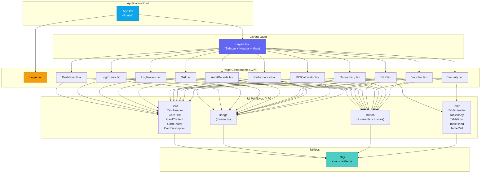
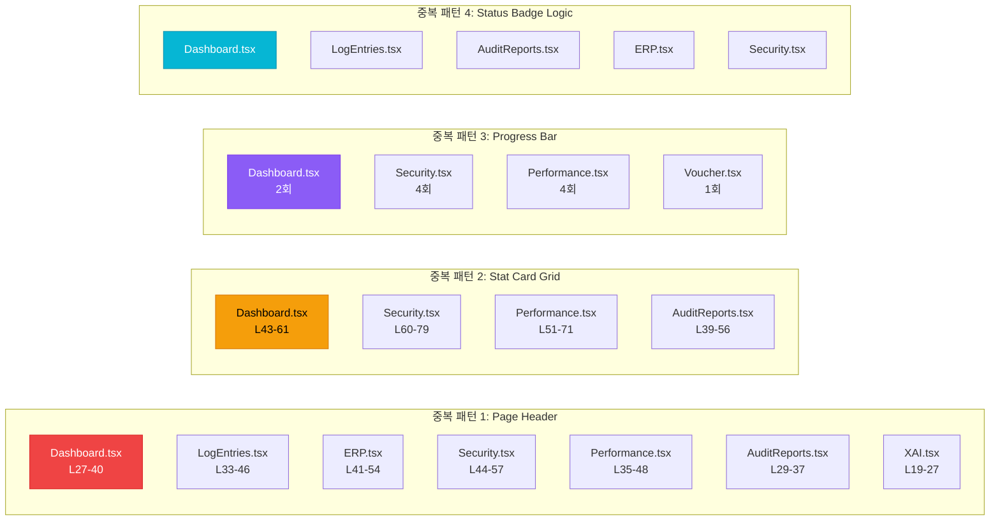
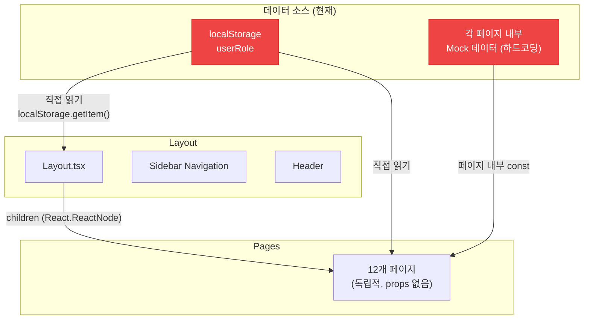
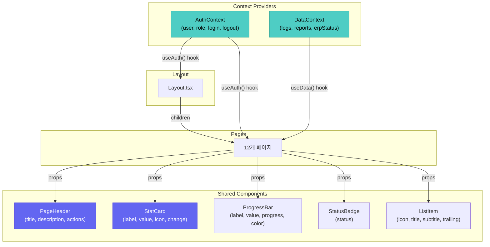
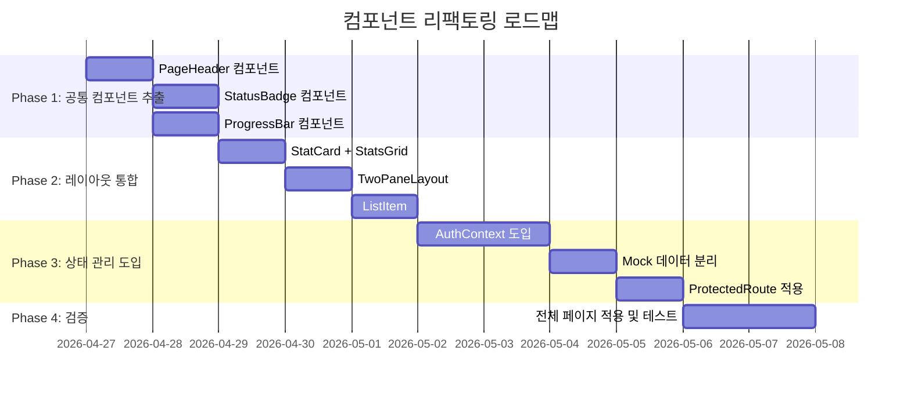

# FactoryAI — 컴포넌트 구조 현황 및 개선점 분석

> **문서 목적**: 현재 프로토타입의 컴포넌트 계층 구조를 시각화하고, 중복 컴포넌트, props 흐름, 리팩토링 포인트를 식별합니다.

---

## 1. 컴포넌트 계층 차트 (현재 상태)



---

## 2. 컴포넌트 사용 빈도 매트릭스

| UI 컴포넌트 | 사용 페이지 수 | 사용 방식 | 비고 |
|:---|:---|:---|:---|
| `Card` + `CardContent` | **12/12** | 모든 페이지의 주요 컨테이너 | 가장 많이 사용 |
| `Button` | **11/12** | 액션 버튼 (CTA, 필터, 내비게이션) | Login만 자체 button 사용 |
| `Badge` | **10/12** | 상태 표시 (성공/경고/위험 등) | Onboarding 미사용 |
| `Table` | **2/12** | ERP 필드 매핑, Security 액세스 로그 | 사용 범위 제한적 |
| `CardHeader` | **10/12** | 카드 제목 영역 | Login, ROI 미사용 |
| `CardTitle` | **10/12** | 카드 제목 텍스트 | 위와 동일 |
| `cn()` | **모든 파일** | 조건부 className 병합 | 핵심 유틸리티 |

---

## 3. 중복 컴포넌트 발견

### 3.1 인라인 중복 패턴 (컴포넌트로 추출되지 않은 반복 코드)



### 3.2 중복 상세 분석

| 중복 패턴 | 발생 횟수 | 코드 줄 수 (총) | 추출 난이도 | 절감 효과 |
|:---|:---|:---|:---|:---|
| Page Header | 7회 | ~84줄 | ⭐ 쉬움 | ~70줄 절감 |
| Stat Card Grid | 4회 | ~80줄 | ⭐ 쉬움 | ~60줄 절감 |
| Progress Bar | 11회+ | ~110줄 | ⭐ 쉬움 | ~90줄 절감 |
| Status Badge 로직 | 5회+ | ~50줄 | ⭐⭐ 보통 | ~40줄 절감 |
| Two-Pane Layout | 6회 | ~30줄 | ⭐ 쉬움 | ~20줄 절감 |
| List Item 행 | 4회 | ~120줄 | ⭐⭐ 보통 | ~80줄 절감 |
| **합계** | **37회+** | **~474줄** | | **~360줄 절감** |

---

## 4. Props 흐름 점검

### 4.1 현재 데이터 흐름 (문제점 포함)



### 4.2 Props 흐름 문제점

| # | 문제 | 위치 | 영향도 |
|:--|:--|:--|:--|
| 1 | **Props가 전혀 없음** | 모든 Page 컴포넌트 | 🔴 높음 |
| 2 | **localStorage 직접 접근** | Layout.tsx (L40), Dashboard.tsx (L23) | 🔴 높음 |
| 3 | **Mock 데이터가 페이지 파일에 인라인** | 모든 Page 컴포넌트 상단 | 🟡 중간 |
| 4 | **Layout → Page 간 props 전달 없음** | Layout.tsx → children | 🟡 중간 |
| 5 | **페이지 간 상태 공유 불가** | 독립적 구조 | 🔴 높음 |

### 4.3 개선된 Props 흐름 (제안)



---

## 5. 리팩토링 포인트 종합

### 5.1 컴포넌트 구조 개선 로드맵



### 5.2 리팩토링 포인트 상세

| # | 분류 | 현재 상태 | 개선 방향 | 영향 범위 | 우선순위 |
|:--|:--|:--|:--|:--|:--|
| 1 | **구조** | 12개 페이지가 모두 독립적 | 공유 컴포넌트 레이어 도입 | 전체 | 🔴 |
| 2 | **상태** | `localStorage` 직접 접근 | `AuthContext` + `useAuth` Hook | Layout, Dashboard, Login | 🔴 |
| 3 | **데이터** | Mock 데이터가 각 페이지에 인라인 | `data/mock/` 디렉토리로 분리 | 전체 | 🟡 |
| 4 | **라우팅** | 동적 라우팅 없음 | `useParams`로 `:id` 기반 라우팅 | LogReview, AuditReports | 🟡 |
| 5 | **타입** | 타입 정의 없음 (인라인 객체) | `types/` 디렉토리에 인터페이스 정의 | 전체 | 🟡 |
| 6 | **CSS** | Tailwind 클래스 직접 사용 | 공통 컴포넌트에 캡슐화 | 전체 | 🟢 |
| 7 | **성능** | 불필요한 리렌더링 가능 | `React.memo`, `useMemo`, `useCallback` | 주요 리스트 | 🟢 |

### 5.3 리팩토링 후 이상적 디렉토리 구조

```
src/
├── components/
│   ├── ui/                    # 원자 컴포넌트 (기존 유지)
│   │   ├── badge.tsx
│   │   ├── button.tsx
│   │   ├── card.tsx
│   │   └── table.tsx
│   ├── shared/                # ✨ 새로 추출할 공유 컴포넌트
│   │   ├── PageHeader.tsx
│   │   ├── StatCard.tsx
│   │   ├── StatsGrid.tsx
│   │   ├── ProgressBar.tsx
│   │   ├── TwoPaneLayout.tsx
│   │   ├── StatusBadge.tsx
│   │   └── ListItem.tsx
│   └── Layout.tsx
├── context/                   # ✨ 상태 관리
│   ├── AuthContext.tsx
│   └── DataContext.tsx
├── data/                      # ✨ Mock 데이터 분리
│   └── mock/
│       ├── users.ts
│       ├── logs.ts
│       ├── reports.ts
│       └── erp.ts
├── hooks/                     # ✨ 커스텀 훅
│   ├── useAuth.ts
│   └── useData.ts
├── types/                     # ✨ 타입 정의
│   ├── user.ts
│   ├── log.ts
│   ├── report.ts
│   └── common.ts
├── pages/
│   └── (12개 페이지 — 대폭 경량화)
├── lib/
│   └── utils.ts
├── App.tsx
├── main.tsx
└── index.css
```
