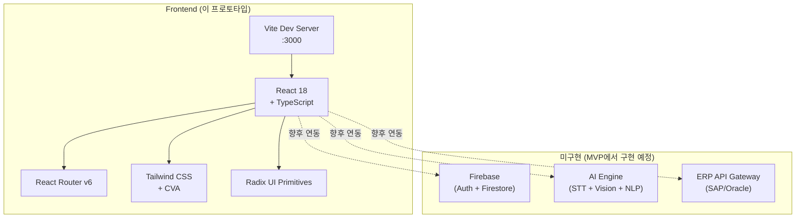
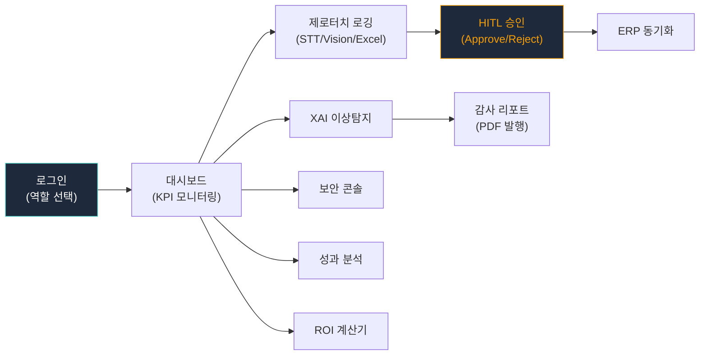
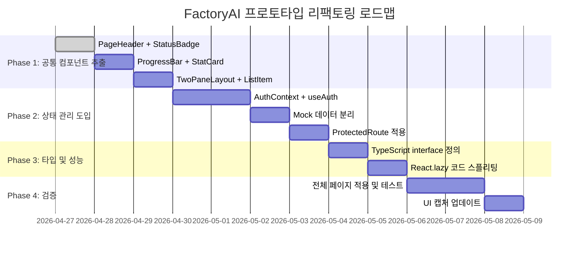

# FactoryAI Trae Prototype — 프로젝트 리팩토링 개요

> **중소 제조공장을 위한 AI 기반 생산관리 SaaS 플랫폼 프로토타입**
>
> 이 문서는 프로젝트 소개, 코드 품질 평가, 리팩토링 계획을 종합한 **프로젝트 리뷰용 개요 문서**입니다.

---

## 📌 프로젝트 개요

| 항목 | 내용 |
|:---|:---|
| **프로젝트명** | FactoryAI — Trae Prototype |
| **기술 스택** | React 18 + TypeScript + Vite + Tailwind CSS |
| **UI 라이브러리** | Radix UI Primitives + CVA (class-variance-authority) |
| **아이콘** | lucide-react |
| **라우팅** | react-router-dom v6 |
| **상태 관리** | localStorage (프로토타입 단계) |
| **페이지 수** | 12개 (Login 포함) |
| **총 코드 줄** | ~1,700줄 (src/ 기준) |
| **목적** | MVP 개발 전 UI/UX 검증용 인터랙티브 프로토타입 |

---

## 🏗️ 시스템 아키텍처



---

## 📂 프로젝트 구조

```
Proto types/trae_proto/
├── RPA_AI_Saas/                    # 메인 프로젝트
│   ├── src/
│   │   ├── App.tsx                 # 루트 라우터 (12개 라우트)
│   │   ├── main.tsx                # Vite 진입점
│   │   ├── index.css               # 글로벌 스타일
│   │   ├── components/
│   │   │   ├── Layout.tsx          # 사이드바 + 헤더 레이아웃
│   │   │   └── ui/                 # 원자 UI 컴포넌트 (4개)
│   │   │       ├── badge.tsx       # 상태 배지 (8 variants)
│   │   │       ├── button.tsx      # 버튼 (7 variants × 4 sizes)
│   │   │       ├── card.tsx        # 카드 컨테이너 (6 sub-components)
│   │   │       └── table.tsx       # 데이터 테이블 (8 sub-components)
│   │   ├── pages/                  # 페이지 컴포넌트 (12개)
│   │   │   ├── Login.tsx           # 역할 기반 Quick Login
│   │   │   ├── Dashboard.tsx       # 현장 운영 대시보드
│   │   │   ├── LogEntries.tsx      # 제로터치 로깅
│   │   │   ├── LogReview.tsx       # HITL 인간 승인
│   │   │   ├── XAI.tsx             # XAI 품질 이상탐지
│   │   │   ├── AuditReports.tsx    # 감사 리포트
│   │   │   ├── ERP.tsx             # ERP 연동 관리
│   │   │   ├── Security.tsx        # 보안 콘솔
│   │   │   ├── Performance.tsx     # 성과 분석 대시보드
│   │   │   ├── ROICalculator.tsx   # ROI 계산기
│   │   │   ├── Onboarding.tsx      # 온보딩 가이드 (ADMIN)
│   │   │   └── Voucher.tsx         # 바우처 관리 (ADMIN)
│   │   ├── lib/
│   │   │   └── utils.ts            # cn() 유틸리티
│   │   ├── context/                # (비어있음 — 향후 AuthContext 등)
│   │   └── hooks/                  # (비어있음 — 향후 useAuth 등)
│   ├── package.json
│   ├── vite.config.ts
│   ├── tailwind.config.js
│   └── 프로토타입_실행.bat         # ✨ 윈도우용 원클릭 실행 스크립트
│
├── capture_trae/                   # UI 캡처 도구 및 결과물
│   ├── capture.mjs                 # Puppeteer 자동 캡처 스크립트
│   ├── capture_trae_01~12.png      # 12개 페이지 스크린샷
│   ├── ui_viewer.html              # 카드놀이 방식 뷰어
│   └── node_modules/               # Puppeteer 의존성
│
└── Refactoring docs/               # 📋 리팩토링 문서 (현재 폴더)
    ├── README.md                   # 이 문서
    ├── UX_FLOW.md                  # UX 핵심 시나리오
    ├── COMPONENT_ANALYSIS.md       # 컴포넌트 구조 분석
    ├── CODE_QUALITY.md             # 코드 품질 평가
    └── repetitive_patterns_analysis.md  # 반복 패턴 분석
```

---

## 👥 사용자 역할 (RBAC)

| 역할 | 대표 사용자 | 접근 가능 페이지 |
|:---|:---|:---|
| **ADMIN** | 한성우 COO | 전체 12개 페이지 |
| **OPERATOR** | 박작업 | 대시보드, 로깅 엔트리 |
| **AUDITOR** | 클레어 리 품질이사 | XAI, 감사 리포트, 로그 검토 |
| **VIEWER** | 이뷰어 | 대시보드, 성과 분석 (읽기 전용) |
| **CISO** | 최보안 | 보안 콘솔, 감사 리포트 |

---

## 📊 코드 품질 현황 및 개선 계획

### 현재 점수 (62점 / C+)

| 평가 항목 | 현재 점수 | 리팩토링 후 목표 |
|:---|:---|:---|
| 가독성 | 78/100 🟡 | 88 |
| 재사용성 | 45/100 🔴 | 75 |
| 유지보수성 | 50/100 🔴 | 70 |
| 일관성 | 72/100 🟡 | 88 |
| 성능 | 65/100 🟡 | 80 |
| **종합** | **62/100** | **82/100 (B+)** |

### 핵심 리팩토링 포인트

| 우선순위 | 작업 | 효과 |
|:---|:---|:---|
| 🔴 P0 | 6개 공유 컴포넌트 추출 (PageHeader, StatCard, ProgressBar, TwoPaneLayout, StatusBadge, ListItem) | 코드 ~360줄 절감, 중복율 40%→10% |
| 🔴 P0 | `AuthContext` 도입 (localStorage 직접 접근 제거) | 상태 관리 안정화, 라우트 보호 기반 |
| 🟡 P1 | Mock 데이터를 `data/mock/` 디렉토리로 분리 | 데이터-뷰 분리, API 전환 용이 |
| 🟡 P1 | TypeScript interface/type 정의 | 타입 안전성, 자동완성 향상 |
| 🟢 P2 | `React.lazy` + `Suspense` 코드 스플리팅 | 초기 로딩 성능 개선 |
| 🟢 P2 | JSDoc/TSDoc 주석 추가 | 개발자/AI 에이전트 가독성 ✅ 완료 |

---

## 🔄 UX 핵심 흐름 요약



**7개 핵심 시나리오**에 대한 상세 흐름은 [UX_FLOW.md](./UX_FLOW.md)를 참조하세요.

---

## 📋 리팩토링 문서 목록

| 문서 | 설명 | 경로 |
|:---|:---|:---|
| **UX 핵심 시나리오** | 7개 사용자 여정 + mermaid 플로우차트 + 개선 포인트 | [UX_FLOW.md](./UX_FLOW.md) |
| **컴포넌트 구조 분석** | 계층 차트 + 중복 발견 + props 흐름 + 리팩토링 로드맵 | [COMPONENT_ANALYSIS.md](./COMPONENT_ANALYSIS.md) |
| **코드 품질 평가** | 5축 평가 (가독성/재사용성/유지보수성/일관성/성능) | [CODE_QUALITY.md](./CODE_QUALITY.md) |
| **반복 패턴 분석** | 6가지 반복 패턴 식별 + 재사용 컴포넌트 인터페이스 제안 | [repetitive_patterns_analysis.md](./repetitive_patterns_analysis.md) |

---

## 🚀 실행 방법

### 방법 1: 윈도우 원클릭 실행 (추천)
윈도우 환경의 보안 정책(Execution Policy) 이슈를 해결한 실행 파일입니다.
1. `Proto types/trae_proto/RPA_AI_Saas/` 폴더로 이동합니다.
2. `프로토타입_실행.bat` 파일을 더블 클릭합니다.

### 방법 2: 터미널 수동 실행
1. 프로젝트 디렉토리로 이동:
   `cd "Proto types/trae_proto/RPA_AI_Saas"`
2. 의존성 설치: `npm install`
3. 개발 서버 실행: `cmd /c "npm run dev"`

---

### 🌐 접속 주소
브라우저에서 다음 주소로 접속하세요:
👉 **[http://localhost:3000](http://localhost:3000)**

---

## 📝 Docstring 적용 현황

모든 주요 소스 코드에 다목적(개발자용 + AI 에이전트용) JSDoc/TSDoc 주석이 추가되었습니다.

| 파일 | 주석 유형 | 포함 내용 |
|:---|:---|:---|
| `App.tsx` | `@file`, `@ai-context`, `@see` | 라우트 구조, 인증 보호 미구현 안내 |
| `Layout.tsx` | `@file`, `@ai-context`, `@param` | 메뉴 구조, localStorage 의존성 |
| `Dashboard.tsx` | `@file`, `@ai-context`, `@see` | KPI 데이터 구조, 링크 대상 |
| `LogEntries.tsx` | `@file`, `@ai-context`, `@see` | Mock 데이터 구조, 필터링 미구현 |
| `LogReview.tsx` | `@file`, `@ai-context`, `@see` | HITL 원칙, 동적 라우팅 미구현 |
| `XAI.tsx` | `@file`, `@ai-context` | 탐지 데이터, 차트 구현 방식 |
| `AuditReports.tsx` | `@file`, `@ai-context` | Mock 데이터, 상세 페이지 분리 필요 |
| `ERP.tsx` | `@file`, `@ai-context` | Mock 데이터 구조, Table 사용 |
| `Security.tsx` | `@file`, `@ai-context` | Mock 데이터, 긴급 락다운 미구현 |
| `Performance.tsx` | `@file`, `@ai-context` | KPI/Goal 데이터, StatCard 패턴 중복 |
| `ROICalculator.tsx` | `@file`, `@ai-context` | useState 활용, 계산 공식 Mock |
| `Login.tsx` | `@file`, `@ai-context`, `@see` | 역할 정의, handleLogin 진입점 |
| `Onboarding.tsx` | `@file`, `@ai-context` | 5단계 설정, ADMIN 전용 |
| `Voucher.tsx` | `@file`, `@ai-context` | 6단계 스테퍼, ADMIN 전용 |
| `utils.ts` | `@file`, `@ai-context`, `@example` | cn() 유틸리티 사용법 |

---

## 📅 리팩토링 로드맵



---

> **작성일**: 2026-05-03  
> **작성 도구**: Antigravity AI Assistant  
> **소스 프롬프트**: [9_fire studio prompt_final.md](../../UI%20Proto%20plan/9_fire%20studio%20prompt_final.md)
