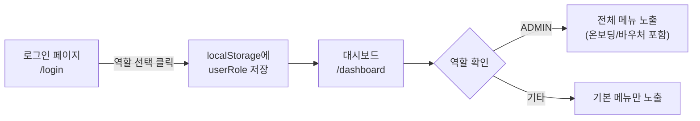
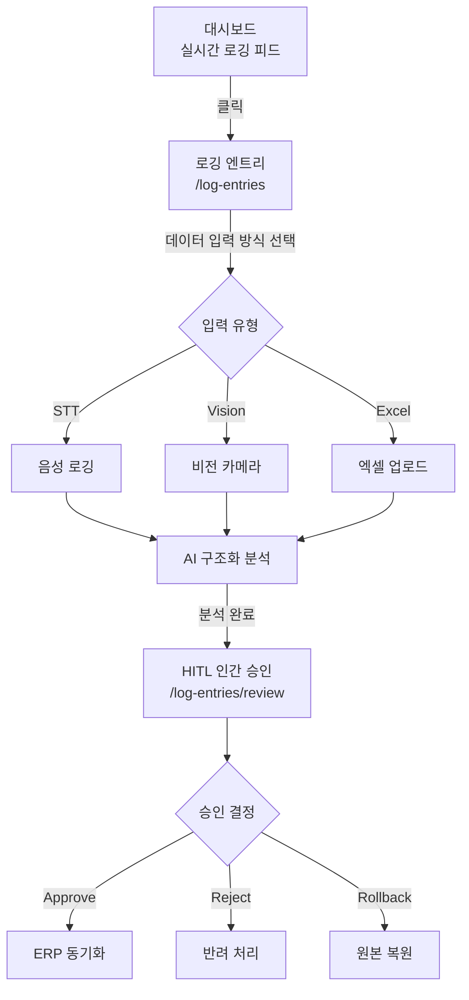
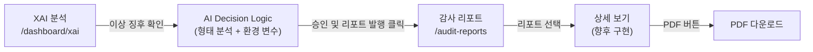
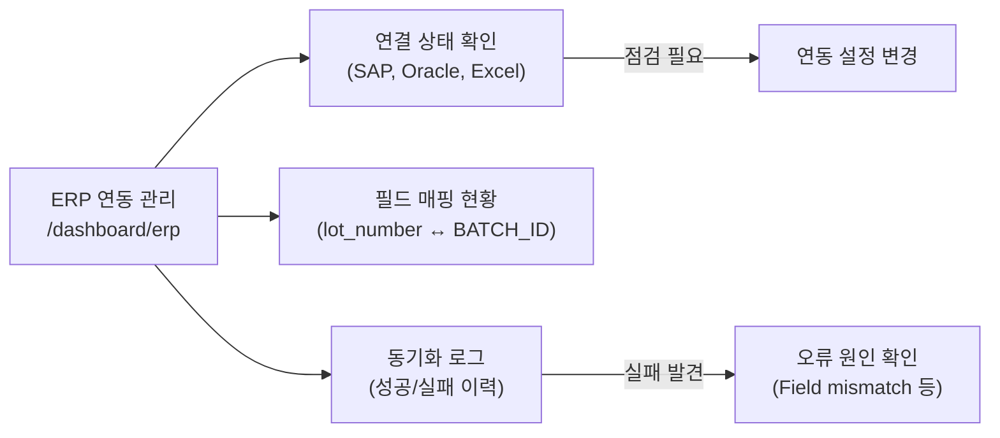
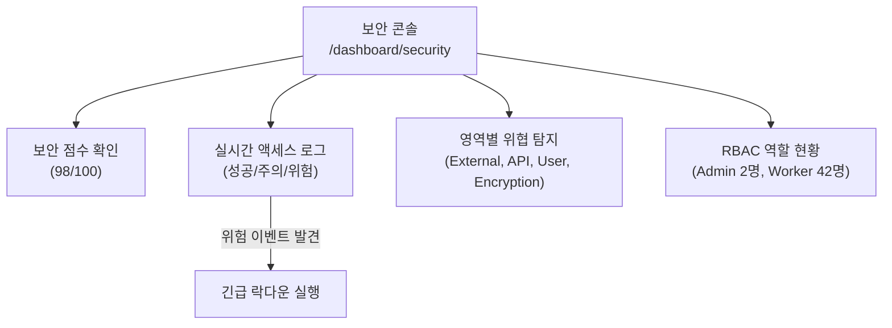
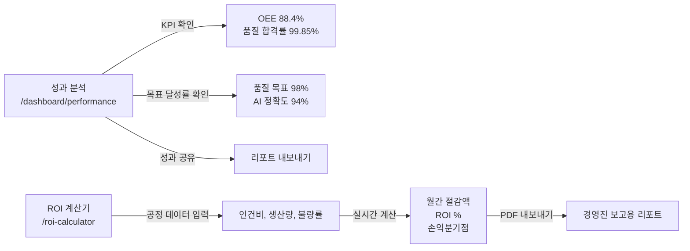
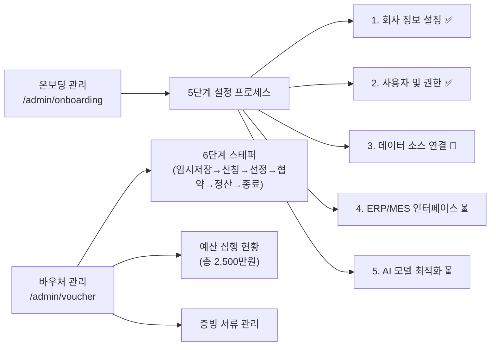
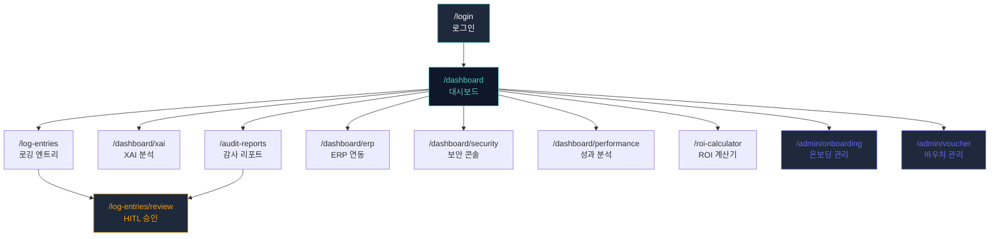

# FactoryAI — UX 핵심 시나리오 (UX Flow)

> **문서 목적**: 사용자가 FactoryAI 플랫폼에서 수행하는 핵심 업무 흐름(Critical User Journey)을 정의합니다.
> 이 문서는 리팩토링 시 어떤 흐름이 깨지면 안 되는지를 판단하는 **회귀 테스트 기준**으로 활용됩니다.

---

## 1. 사용자 역할(Role) 요약

| 역할 | 대표 사용자 | 핵심 권한 | 주요 접근 페이지 |
|:---|:---|:---|:---|
| ADMIN | 한성우 COO | 전체 관리, ERP, 온보딩, 바우처 | 모든 페이지 |
| OPERATOR | 박작업 | 음성/카메라 로깅 | 대시보드, 로깅 엔트리 |
| AUDITOR | 클레어 리 | 감사 리포트, XAI 검토 | XAI, 감사 리포트, 로그 검토 |
| VIEWER | 이뷰어 | 읽기 전용 | 대시보드, 성과 분석 |
| CISO | 최보안 | 보안 콘솔, 감사 로그 | 보안 콘솔, 감사 리포트 |

---

## 2. UX 핵심 시나리오

### 시나리오 1: 로그인 → 대시보드 진입

**흐름 설명**:
1. 사용자가 `/login` 페이지에서 역할(Quick Login) 버튼을 클릭합니다.
2. `localStorage`에 `userRole`이 저장되고, `/dashboard`로 `navigate`합니다.
3. `Layout.tsx`가 `userRole`을 읽어 사이드바 메뉴를 동적으로 구성합니다.
4. ADMIN인 경우에만 온보딩 관리 / 바우처 관리 메뉴가 추가됩니다.

**리팩토링 주의점**:
- 인증 상태가 `localStorage`에만 의존 → Context/Provider 패턴으로 전환 시 이 흐름 검증 필수

---

### 시나리오 2: 제로터치 로깅 → HITL 승인 (핵심 업무 플로우)

**흐름 설명**:
1. 대시보드에서 실시간 로깅 피드를 확인하고, 로깅 엔트리 페이지로 이동합니다.
2. 3가지 입력 방식(STT, Vision, Excel) 중 하나를 선택합니다.
3. AI가 데이터를 구조화하고 (Confidence 점수 표시), 사람이 최종 승인합니다.
4. 승인(Approve) 시 ERP로 자동 동기화됩니다.

**리팩토링 주의점**:
- 로그 리스트 → 상세 검토 페이지 간의 데이터 전달이 현재 없음 (모두 하드코딩된 Mock)
- 실제 구현 시 `useParams`를 통한 로그 ID 기반 라우팅 필요

---

### 시나리오 3: XAI 이상 탐지 → 감사 리포트 발행

**흐름 설명**:
1. XAI 페이지에서 AI가 감지한 이상 징후의 **근거(Explainability)**를 확인합니다.
2. Confidence, Latency 지표를 검토하고 승인 버튼을 클릭합니다.
3. 감사 리포트 목록에서 발행된 리포트를 PDF로 다운로드합니다.

**리팩토링 주의점**:
- XAI → 감사 리포트 간 실제 데이터 연결이 없음 (별도 라우팅만 존재)
- 리포트 상세 페이지가 현재 `/log-entries/review`로 연결되어 있어 분리 필요

---

### 시나리오 4: ERP 연동 모니터링

**흐름 설명**:
1. 3개 ERP 시스템(SAP, Oracle, Legacy Excel)의 연결 상태를 한눈에 확인합니다.
2. 필드 매핑 테이블에서 FactoryAI ↔ ERP 간 데이터 매핑을 점검합니다.
3. 동기화 로그에서 실패 이력과 오류 원인을 확인합니다.

---

### 시나리오 5: 보안 모니터링 및 RBAC 관리 (CISO 전용)

**흐름 설명**:
1. 보안 점수, 활성 세션, 차단된 시도 등 보안 KPI를 확인합니다.
2. 실시간 액세스 로그에서 비정상 접근 시도를 모니터링합니다.
3. 위협 수준이 높을 경우 긴급 락다운 버튼으로 시스템을 잠급니다.

---

### 시나리오 6: 성과 분석 및 ROI 계산 (경영진 의사결정)

**흐름 설명**:
1. 성과 분석 대시보드에서 공장 전체의 KPI를 모니터링합니다.
2. ROI 계산기에서 공정 데이터를 입력하면 실시간으로 절감 효과를 계산합니다.
3. 결과를 PDF로 내보내 경영진 의사결정에 활용합니다.

---

### 시나리오 7: 온보딩 설정 및 바우처 관리 (ADMIN 전용)

**흐름 설명**:
1. 온보딩 페이지에서 5단계 설정을 순차적으로 진행합니다.
2. 바우처 페이지에서 정부 지원금 집행 현황과 증빙 서류를 관리합니다.

---

## 3. 페이지 간 이동 맵 (전체 네비게이션)

---

## 4. UX 개선 포인트 (리팩토링 시 반영 권장)

| # | 현재 상태 | 개선 제안 | 우선순위 |
|:--|:--|:--|:--|
| 1 | 인증이 `localStorage`에만 의존 | `AuthContext` Provider 패턴 도입 | 🔴 높음 |
| 2 | 로그 상세 페이지가 단일 라우트 (`/review`) | 동적 라우팅 (`/review/:id`) 도입 | 🔴 높음 |
| 3 | 감사 리포트가 `/log-entries/review`로 연결 | 전용 상세 페이지 분리 | 🟡 중간 |
| 4 | 페이지 간 데이터 전달 없음 (Mock 고정) | 상태 관리 또는 URL params 활용 | 🟡 중간 |
| 5 | 모바일 사이드바 토글 시 애니메이션 불완전 | `framer-motion` 또는 CSS 전환 강화 | 🟢 낮음 |
| 6 | 로딩/에러 상태 UI 없음 | Skeleton/Error Boundary 추가 | 🟡 중간 |
| 7 | 라우트 보호 로직 없음 | `ProtectedRoute` 컴포넌트 도입 | 🔴 높음 |
