# FactoryAI Prototype UI Flow (Final Results)

이 문서는 한성우 COO(ADMIN) 계정으로 로그인한 후의 전체 UI 흐름을 담고 있습니다.

## 📋 화면 리스트 (순서별)

1. [로그인 화면](#01-로그인-화면)
2. [메인 대시보드](#02-메인-대시보드)
3. [제로터치 로깅](#03-제로터치-로깅)
4. [HITL 승인 뷰어](#04-hitl-승인-뷰어)
5. [XAI 품질 이상탐지](#05-xai-품질-이상탐지)
6. [감사 리포트](#06-감사-리포트)
7. [성과 대시보드](#07-성과-대시보드)
8. [ROI 계산기](#08-roi-계산기)
9. [온보딩 관리](#09-온보딩-관리)
10. [바우처 관리](#10-바우처-관리)
11. [ERP 연동 관리](#11-erp-연동-관리)
12. [CISO 보안 콘솔](#12-ciso-보안-콘솔)

---

### 01. 로그인 화면
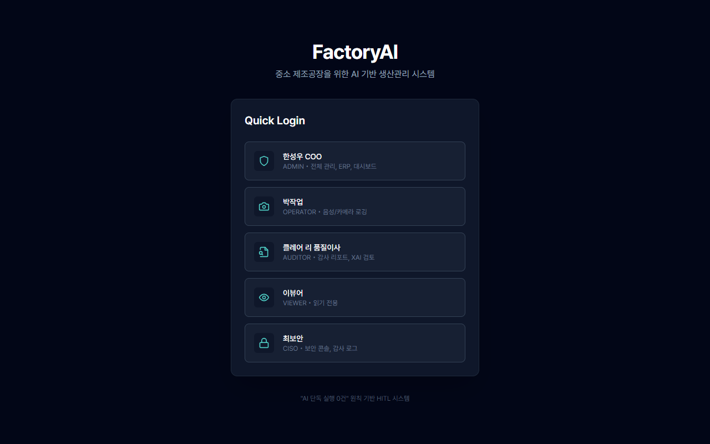

### 02. 메인 대시보드
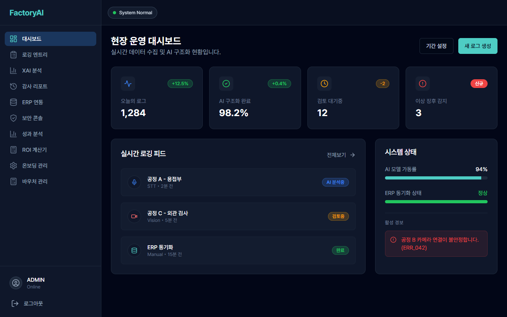

### 03. 제로터치 로깅
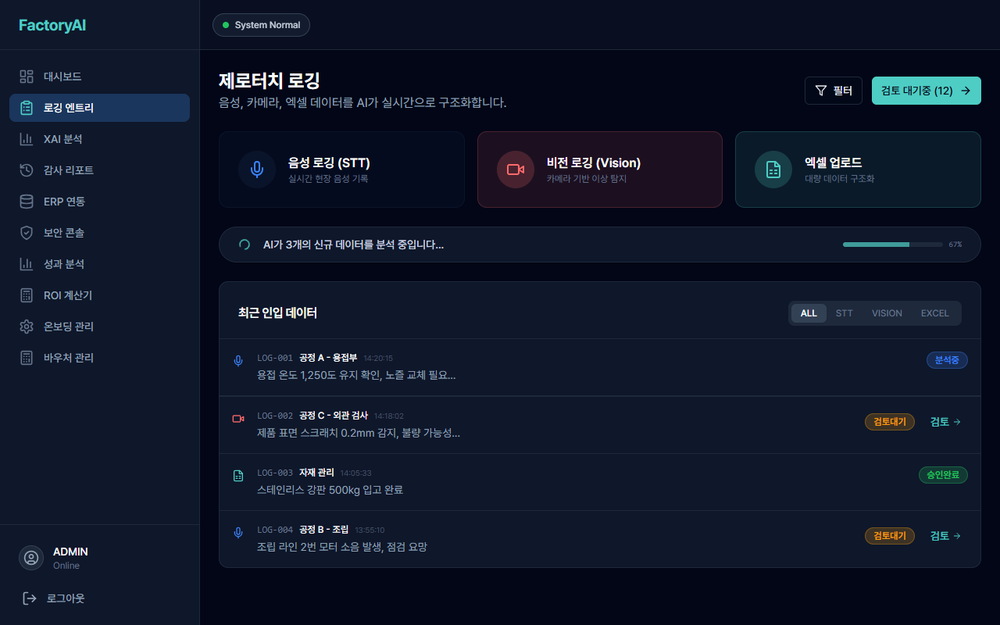

### 04. HITL 승인 뷰어
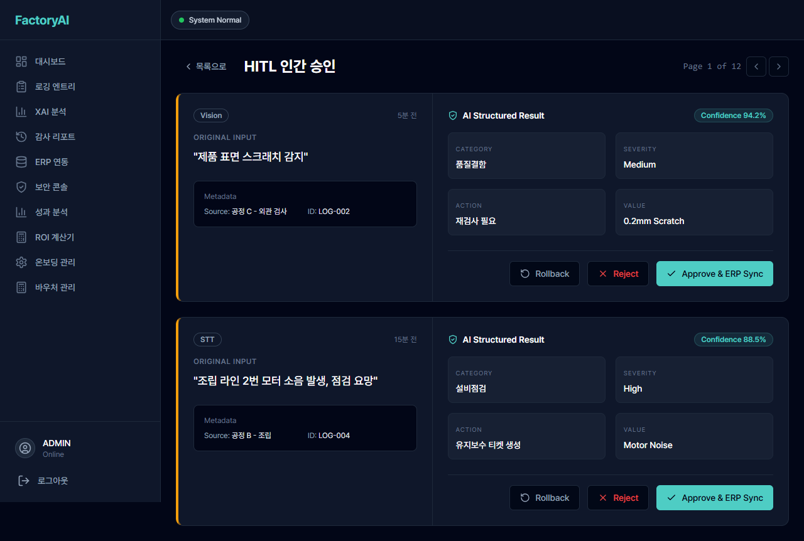

### 05. XAI 품질 이상탐지
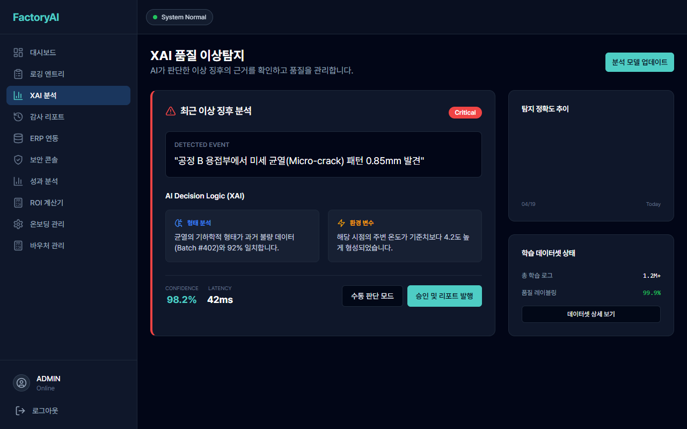

### 06. 감사 리포트
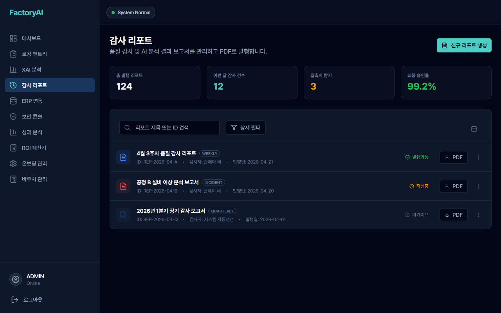

### 07. 성과 대시보드
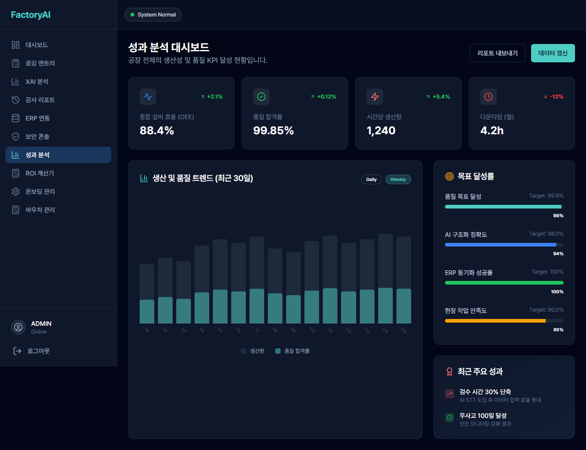

### 08. ROI 계산기
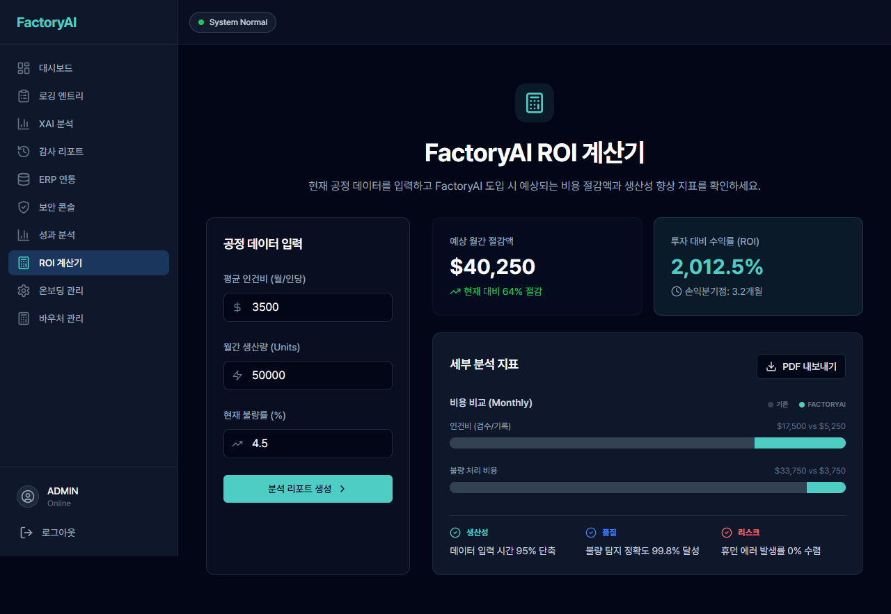

### 09. 온보딩 관리
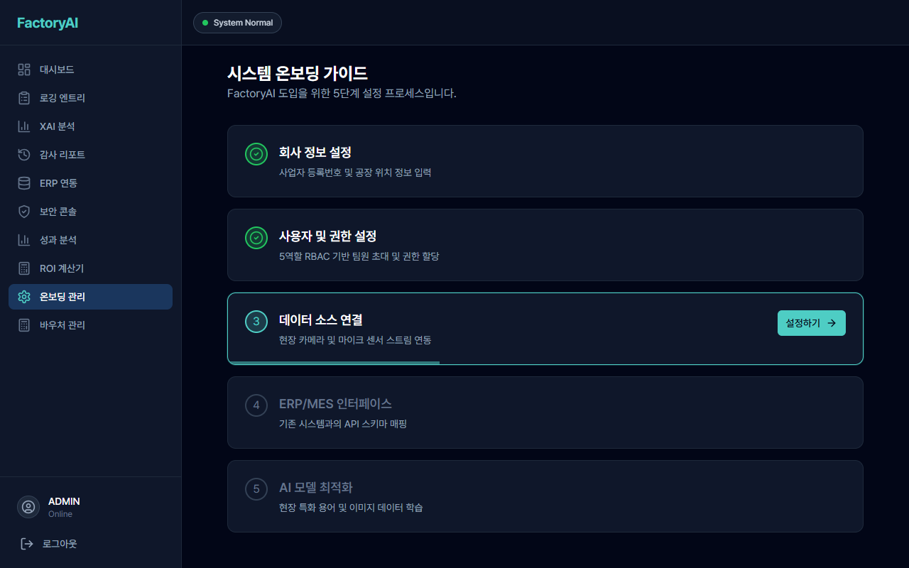

### 10. 바우처 관리
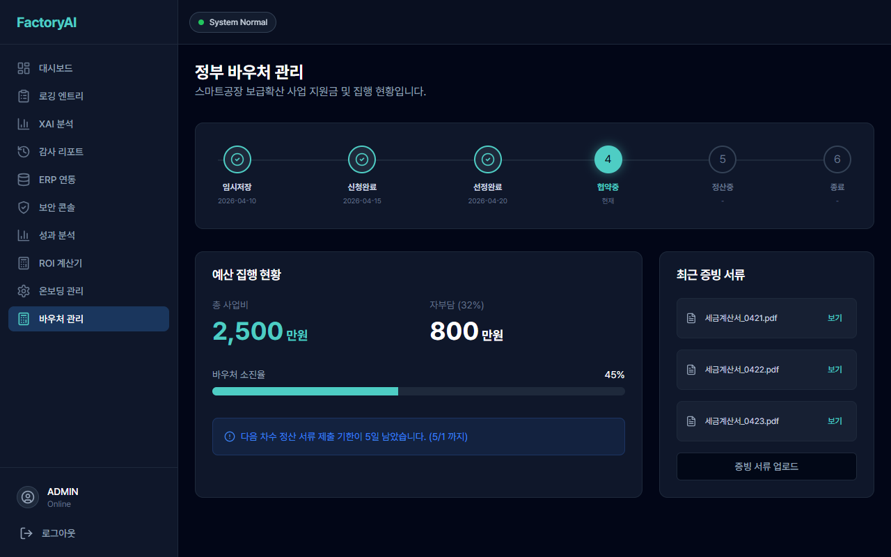

### 11. ERP 연동 관리
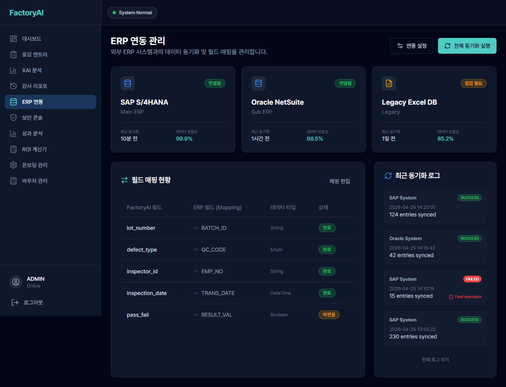

### 12. CISO 보안 콘솔
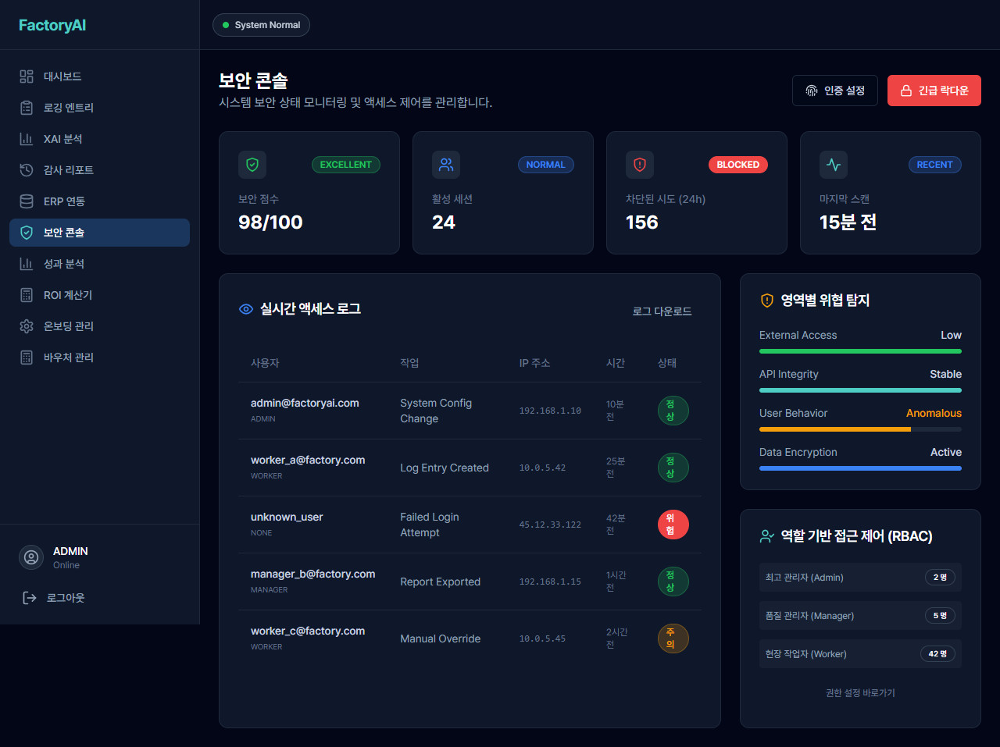
