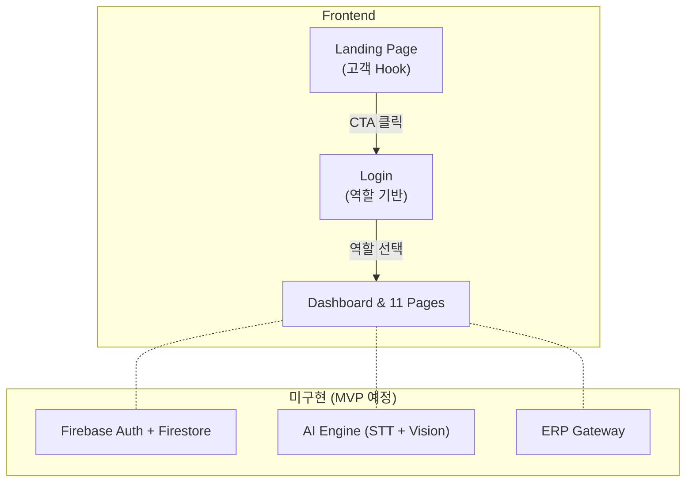
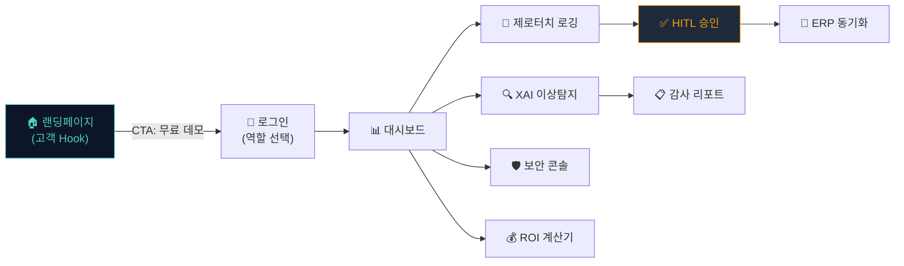

# FactoryAI — AI 기반 생산관리 SaaS 플랫폼

> **중소 제조공장을 위한 AI 기반 생산관리 SaaS 플랫폼 프로토타입**
>
> 음성·카메라·Excel 데이터를 AI가 자동 구조화하고, 사람이 최종 승인하는 HITL 시스템

---

## 📌 프로젝트 개요

| 항목 | 내용 |
|:---|:---|
| **프로젝트명** | FactoryAI |
| **기술 스택** | React 18 + TypeScript + Vite + Tailwind CSS |
| **UI 라이브러리** | Radix UI Primitives + CVA (class-variance-authority) |
| **아이콘** | lucide-react |
| **라우팅** | react-router-dom v6 |
| **상태 관리** | localStorage (프로토타입 단계) |
| **페이지 수** | 13개 (Landing + Login + 11개 앱 페이지) |
| **목적** | MVP 개발 전 UI/UX 검증용 인터랙티브 프로토타입 |

---

## 🏗️ 시스템 아키텍처



---

## 📂 프로젝트 구조

```
my_RPA_AI_SaaS_app/
├── src/
│   ├── App.tsx                 # 루트 라우터 (13개 라우트)
│   ├── main.tsx                # Vite 진입점
│   ├── index.css               # 글로벌 스타일
│   ├── components/
│   │   ├── Layout.tsx          # 사이드바 + 헤더 레이아웃
│   │   └── ui/                 # 원자 UI 컴포넌트 (4개)
│   └── pages/
│       ├── Landing.tsx         # ✨ 랜딩페이지 (고객 Hook 최전면)
│       ├── landing.css         # 랜딩페이지 전용 스타일
│       ├── Login.tsx           # 역할 기반 Quick Login
│       ├── Dashboard.tsx       # 현장 운영 대시보드
│       ├── LogEntries.tsx      # 제로터치 로깅
│       ├── LogReview.tsx       # HITL 인간 승인
│       ├── XAI.tsx             # XAI 품질 이상탐지
│       ├── AuditReports.tsx    # 감사 리포트
│       ├── ERP.tsx             # ERP 연동 관리
│       ├── Security.tsx        # 보안 콘솔
│       ├── Performance.tsx     # 성과 분석 대시보드
│       ├── ROICalculator.tsx   # ROI 계산기
│       ├── Onboarding.tsx      # 온보딩 가이드 (ADMIN)
│       └── Voucher.tsx         # 바우처 관리 (ADMIN)
├── docs/                       # 리팩토링 문서
├── tasks/                      # 태스크 명세서
├── package.json
├── vite.config.ts
├── tailwind.config.js
└── 프로토타입_실행.bat         # 윈도우용 원클릭 실행
```

---

## 🎯 페이지 흐름



---

## 🚀 실행 방법

### 방법 1: 윈도우 원클릭 실행 (추천)
1. `my_RPA_AI_SaaS_app/` 폴더로 이동합니다.
2. `프로토타입_실행.bat` 파일을 더블 클릭합니다.

### 방법 2: 터미널 수동 실행
```bash
# 프로젝트 디렉토리에서 실행
npm install         # 최초 1회만
cmd /c npm run dev  # 개발 서버 시작
```

### 🌐 접속 주소
👉 **[http://localhost:3000](http://localhost:3000)**

| 경로 | 설명 |
|:---|:---|
| `/` | 랜딩페이지 (최전면, 고객 Hook) |
| `/login` | 역할 선택 로그인 |
| `/dashboard` | 현장 운영 대시보드 |

---

## 👥 사용자 역할 (RBAC)

| 역할 | 대표 사용자 | 접근 가능 페이지 |
|:---|:---|:---|
| **ADMIN** | 한성우 COO | 전체 13개 페이지 |
| **OPERATOR** | 박작업 | 대시보드, 로깅 엔트리 |
| **AUDITOR** | 클레어 리 품질이사 | XAI, 감사 리포트, 로그 검토 |
| **VIEWER** | 이뷰어 | 대시보드, 성과 분석 (읽기 전용) |
| **CISO** | 최보안 | 보안 콘솔, 감사 리포트 |

---

## 📝 랜딩페이지 전략

| 항목 | 적용 내용 |
|:---|:---|
| **서비스 유형** | C유형(결과 지향형) 메인 + B유형(기술 몰입형) · A유형(불안 해소형) 보조 |
| **헤드라인** | "기록은 AI가, 판단은 사람이." |
| **CTA 전략** | 동사형 버튼("무료 데모 체험하기") × 상단/중단/하단 3회 반복 배치 |
| **I/O 다이어그램** | INPUT → ⚡FactoryAI Engine → OUTPUT 블랙박스화 |
| **Before/After** | 불량률 4.5% → 0.5%, 감사 준비 2~3주 → 5초 |
| **Trust 요소** | AI 단독 실행 0건, XAI 설명 가능, RBAC 5단계, 비파괴형 ERP |

---

> **작성일**: 2026-05-04  
> **프레임워크**: React 18 + TypeScript + Vite 5 + Tailwind CSS 3
