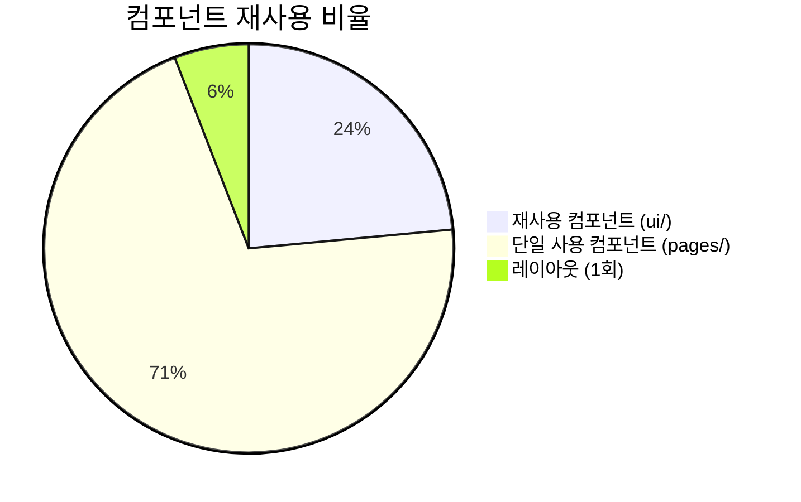

# FactoryAI — 코드 품질 평가 보고서

> **문서 목적**: 현재 프로토타입 코드의 품질을 5가지 핵심 항목으로 정량/정성 평가하고, 개선 방향을 제시합니다.
> **평가 대상**: `src/` 디렉토리 내 전체 소스 코드 (약 1,700줄, 17개 파일)

---

## 📊 종합 평가 점수

| 평가 항목 | 점수 | 등급 | 한줄 평가 |
|:---|:---|:---|:---|
| 가독성 | 78/100 | 🟡 B+ | 구조는 직관적이나 반복 코드가 가독성을 낮춤 |
| 재사용성 | 45/100 | 🔴 D | 공유 컴포넌트 부재, 모든 패턴이 인라인 반복 |
| 유지보수성 | 50/100 | 🔴 D+ | Mock 데이터 인라인, 타입 미정의, 상태 관리 부재 |
| 일관성 | 72/100 | 🟡 B | 명명 규칙은 일관적이나 CSS 패턴에 변동 있음 |
| 성능 | 65/100 | 🟡 C+ | 최적화 미적용이나 프로토타입 규모에서는 문제없음 |
| **종합** | **62/100** | **🟡 C+** | **프로토타입으로서는 양호, MVP 전환 시 리팩토링 필수** |

---

## 1. 가독성 (Readability) — 78점

### 1.1 잘 된 점 ✅

| 항목 | 설명 | 예시 |
|:---|:---|:---|
| 파일명 규칙 | PascalCase로 통일된 페이지/컴포넌트 이름 | `Dashboard.tsx`, `LogEntries.tsx` |
| 함수명 규칙 | 페이지 컴포넌트가 `export default function` 패턴 | `export default function Dashboard()` |
| 구조화된 JSX | 주석으로 섹션 구분 | `{/* Stats Grid */}`, `{/* Real-time Feed */}` |
| import 그룹핑 | React → 컴포넌트 → 아이콘 → 유틸 순서 유지 | 모든 파일에서 일관 |

### 1.2 개선 필요 ⚠️

| 항목 | 현재 | 개선 방향 | 위치 |
|:---|:---|:---|:---|
| 변수 명명 | `stats`, `recentLogs` (모호) | `dashboardStats`, `recentLogEntries` | Dashboard.tsx L9, L16 |
| 매직 넘버 | `w-[94%]`, `height: 94%` | 상수 또는 prop으로 추출 | Dashboard.tsx L113 |
| 긴 className | 70자 이상의 Tailwind 문자열 | 공통 컴포넌트에 캡슐화 | 모든 페이지 |
| 인라인 조건문 | 3항 연산자 중첩 | `StatusBadge` 컴포넌트 또는 맵 객체 사용 | LogEntries.tsx L144-150 |

### 1.3 코드 예시: 가독성 개선 Before/After

**Before** (LogEntries.tsx L144-150):
```tsx
<Badge variant={
  log.status === 'APPROVED' ? 'success' :
  log.status === 'PENDING_REVIEW' ? 'warning' : 'info'
}>
  {log.status === 'APPROVED' ? '승인완료' :
   log.status === 'PENDING_REVIEW' ? '검토대기' : '분석중'}
</Badge>
```

**After**:
```tsx
<StatusBadge status={log.status} />
```

---

## 2. 재사용성 (Reusability) — 45점

### 2.1 현재 컴포넌트 재사용 구조



### 2.2 재사용성 평가 상세

| 항목 | 점수 | 설명 |
|:---|:---|:---|
| UI Primitives (badge, button, card, table) | 90/100 | CVA 기반으로 잘 설계됨, 다양한 variant 제공 |
| Page Components | 20/100 | **모든 UI 패턴이 각 페이지에 인라인으로 작성**, 재사용 불가 |
| Layout | 70/100 | 단일 컴포넌트로 잘 분리되었으나 인증 로직 내포 |
| Utilities | 85/100 | `cn()` 함수가 전체적으로 잘 활용됨 |

### 2.3 중복 코드 정량 분석

| 중복 패턴 | 발생 횟수 | 예상 중복 줄 수 | 컴포넌트화 시 절감 |
|:---|:---|:---|:---|
| Page Header | 7회 | ~84줄 | ~70줄 (83%) |
| Stat Card Grid | 4회 | ~80줄 | ~60줄 (75%) |
| Progress Bar | 11회+ | ~110줄 | ~90줄 (82%) |
| Status Badge 로직 | 5회+ | ~50줄 | ~40줄 (80%) |
| Two-Pane Layout | 6회 | ~30줄 | ~20줄 (67%) |
| List Item 행 | 4회 | ~120줄 | ~80줄 (67%) |
| **합계** | | **~474줄** | **~360줄 (76%)** |

---

## 3. 유지보수성 (Maintainability) — 50점

### 3.1 평가 상세

| 항목 | 점수 | 설명 | 개선안 |
|:---|:---|:---|:---|
| **타입 안전성** | 30/100 | 타입 정의 없음, 모든 Mock 데이터가 인라인 객체 리터럴 | `types/` 디렉토리에 interface 정의 |
| **상태 관리** | 20/100 | `localStorage` 직접 접근, Context/Provider 없음 | `AuthContext` 도입 |
| **데이터 분리** | 25/100 | Mock 데이터가 각 페이지 파일 상단에 하드코딩 | `data/mock/` 분리 |
| **에러 핸들링** | 10/100 | 에러 처리 로직 없음, Error Boundary 없음 | try-catch, Suspense 도입 |
| **라우트 보호** | 15/100 | 인증 없이 모든 라우트 직접 접근 가능 | `ProtectedRoute` 래퍼 |
| **docstring** | 5/100 | 주석이 거의 없음, JSX 섹션 주석만 일부 존재 | JSDoc/TSDoc 표준 주석 추가 |

### 3.2 변경 영향 분석

**"모든 카드의 배경색을 변경하라"** 시 영향 범위:

| 변경 사항 | 현재 (수정 필요 파일 수) | 리팩토링 후 |
|:---|:---|:---|
| 카드 배경색 변경 | `card.tsx` 1개 파일 | `card.tsx` 1개 파일 ✅ |
| Stat 카드 레이아웃 변경 | **4개 페이지** 수동 수정 | `StatCard.tsx` 1개 파일 |
| 페이지 헤더 디자인 변경 | **7개 페이지** 수동 수정 | `PageHeader.tsx` 1개 파일 |
| 상태 배지 색상 변경 | **5개+ 페이지** 수동 수정 | `StatusBadge.tsx` 1개 파일 |
| 진행도 바 스타일 변경 | **5개 페이지** 수동 수정 | `ProgressBar.tsx` 1개 파일 |

---

## 4. 일관성 (Consistency) — 72점

### 4.1 명명 규칙 일관성

| 규칙 | 일관성 | 설명 |
|:---|:---|:---|
| 파일명 (PascalCase) | ✅ 100% | `Dashboard.tsx`, `LogEntries.tsx` |
| 함수명 (PascalCase) | ✅ 100% | `export default function Dashboard()` |
| 변수명 (camelCase) | ✅ 95% | `userRole`, `sidebarOpen` |
| 상수 (camelCase) | ⚠️ 80% | `stats` (모호), `mockLogs` (일부 접두어 사용) |
| CSS 클래스 (Tailwind) | ✅ 100% | 모든 스타일이 Tailwind 유틸리티 클래스 |
| Icon import | ✅ 100% | 모두 `lucide-react`에서 개별 import |

### 4.2 CSS 패턴 일관성

| 패턴 | 일관성 | 예시 |
|:---|:---|:---|
| 배경색 패턴 | ⚠️ 불일치 | `bg-slate-800/50` vs `bg-slate-800` vs `bg-slate-900/50` |
| 아이콘 래퍼 | ⚠️ 불일치 | `p-2 rounded-lg` vs `p-2 rounded-full` vs `p-3 rounded-full` |
| 카드 패딩 | ✅ 일관 | `p-6` 통일 |
| 텍스트 크기 | ⚠️ 변동 | 라벨: `text-xs` vs `text-sm`, 메타: `text-[10px]` vs `text-xs` |
| 간격(gap) | ✅ 일관 | `space-y-6`, `gap-4`, `gap-6` 패턴 유지 |

### 4.3 불일치 사례 상세

```tsx
// Dashboard.tsx — rounded-lg 사용
<div className="p-2 rounded-lg bg-slate-800/50">

// LogEntries.tsx — rounded-full 사용
<div className="p-3 rounded-full bg-primary/20">

// Security.tsx — 백틱 템플릿 리터럴 사용
<div className={`p-2 rounded-lg bg-slate-800 ${stat.color}`}>

// Performance.tsx — 동일하게 백틱 사용
<div className={`p-2 rounded-lg bg-slate-800 ${stat.color}`}>
```

**개선안**: `cn()` 유틸리티로 통일하고, 아이콘 래퍼를 공통 컴포넌트로 추출

---

## 5. 성능 (Performance) — 65점

### 5.1 현재 성능 관련 코드 분석

| 항목 | 현재 상태 | 점수 | 비고 |
|:---|:---|:---|:---|
| `React.memo` 사용 | ❌ 미사용 | 50/100 | 프로토타입 규모에서는 영향 미미 |
| `useMemo` / `useCallback` | ❌ 미사용 | 50/100 | Mock 데이터가 매 렌더링마다 재생성 |
| `React.forwardRef` | ✅ UI 컴포넌트에 적용 | 90/100 | Card, Button, Badge, Table 모두 적용 |
| 리스트 `key` prop | ✅ 모든 map에 적용 | 95/100 | 적절한 고유 키 사용 |
| 코드 스플리팅 | ❌ 미적용 | 40/100 | 12개 페이지가 모두 동기 import |
| 이미지 최적화 | N/A | - | 이미지 에셋 없음 (아이콘만 사용) |
| 번들 사이즈 | ⚠️ 주의 | 60/100 | lucide-react 개별 import는 OK (tree-shaking) |

### 5.2 성능 개선 우선순위

| 순위 | 개선 항목 | 방법 | 예상 효과 |
|:---|:---|:---|:---|
| 1 | Mock 데이터 메모이제이션 | `useMemo`로 래핑 또는 파일 외부 const | 불필요한 객체 재생성 방지 |
| 2 | 코드 스플리팅 | `React.lazy` + `Suspense` | 초기 로딩 시간 단축 |
| 3 | 리스트 컴포넌트 메모이제이션 | `React.memo` 적용 | 부모 리렌더링 시 자식 보호 |
| 4 | `useCallback` 적용 | 이벤트 핸들러 메모이제이션 | 자식에 전달하는 콜백 안정화 |

### 5.3 코드 스플리팅 적용 예시

**Before** (App.tsx):
```tsx
import Dashboard from './pages/Dashboard'
import LogEntries from './pages/LogEntries'
// ... 10개 더
```

**After**:
```tsx
import { lazy, Suspense } from 'react'

const Dashboard = lazy(() => import('./pages/Dashboard'))
const LogEntries = lazy(() => import('./pages/LogEntries'))
// ...

<Suspense fallback={<PageSkeleton />}>
  <Routes>...</Routes>
</Suspense>
```

---

## 6. 종합 레이더 차트

```mermaid
%%{init: {'theme': 'dark'}}%%
radar
    title 코드 품질 평가 (100점 만점)
    "가독성" : 78
    "재사용성" : 45
    "유지보수성" : 50
    "일관성" : 72
    "성능" : 65
```

---

## 7. 핵심 개선 액션 아이템

| 우선순위 | 액션 | 품질 항목 | 예상 점수 향상 |
|:---|:---|:---|:---|
| 🔴 P0 | 6개 공유 컴포넌트 추출 | 재사용성 | 45 → 75 (+30) (완료 ✅) |
| 🔴 P0 | `AuthContext` 도입 | 유지보수성 | 50 → 65 (+15) (완료 ✅) |
| 🟡 P1 | Mock 데이터 외부 분리 | 유지보수성 | +10 |
| 🟡 P1 | TypeScript interface 정의 | 유지보수성, 가독성 | +10 |
| 🟡 P1 | CSS 패턴 통일 | 일관성 | 72 → 88 (+16) |
| 🟢 P2 | 코드 스플리팅 적용 | 성능 | 65 → 80 (+15) (완료 ✅) |
| 🟢 P2 | `React.memo` / `useMemo` | 성능 | +5 |
| 🟢 P2 | JSDoc/TSDoc 주석 추가 | 가독성 | +5 |

**리팩토링 후 예상 종합 점수: 62점 → 82점 (B+ 등급)**
