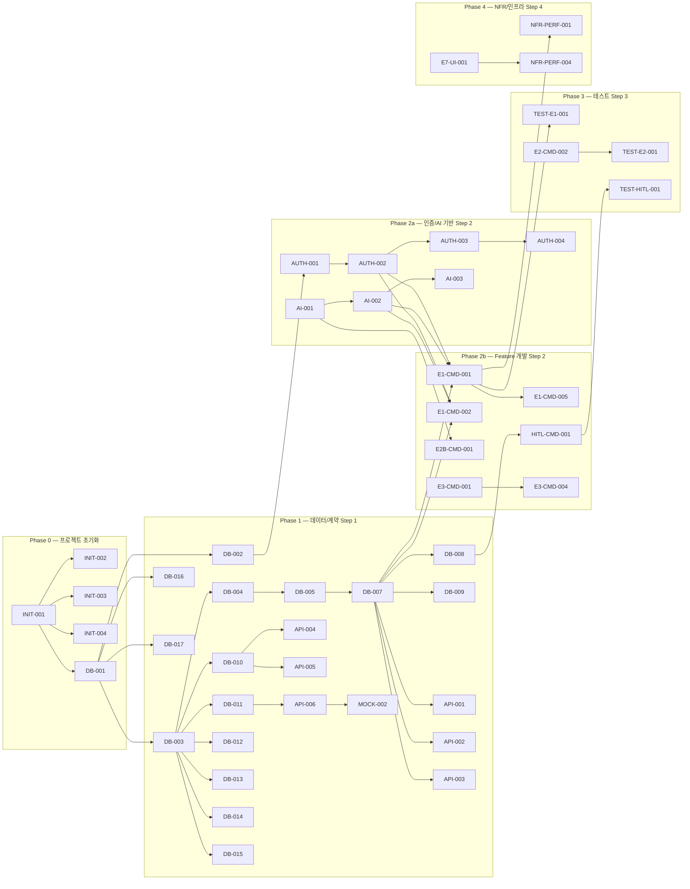

# FactoryAI — 개발 태스크 목록 명세서 (SRS V1.0 기반)

**Source**: SRS-002 Rev 2.0 (V0.8) — 2026-04-18  
**작성일**: 2026-04-19  
**작성자**: Technical PM / System Architect  
**총 태스크**: 179건 (14 Epic)

> [!IMPORTANT]
> 본 문서는 SRS V1.0의 72 REQ-FUNC, 57 REQ-NF, 14 Entities, 19 API Endpoints를 누락 없이 분석하여 도출한 개발 태스크 리스트입니다.
> **MVP = 클라우드 전용 SaaS (1인 개발 + 완전 무료 인프라)** 제약 하의 태스크만 포함합니다.

---

## 범례

| 약어 | 의미 |
|:---|:---|
| **H/M/L** | 복잡도 — High / Medium / Low |
| **DB** | 데이터베이스 스키마/마이그레이션 |
| **API** | API DTO/계약 정의 |
| **Mock** | 프론트엔드 개발용 Mock 데이터/엔드포인트 |
| **Query** | 읽기 전용 (상태 비변경) |
| **Command** | 쓰기 (상태 변경, 입력 검증 포함) |
| **Test** | AC 기반 테스트 코드 |
| **Infra** | 인프라/DevOps |
| **Sec** | 보안 |
| **UI** | 프론트엔드 UI 컴포넌트 |
| **SVC** | 서비스 운영 프로세스 |

---

## Step 1. 계약 및 데이터(Contract/Data) 명세 태스크

### 1-A. 데이터베이스 스키마 & 마이그레이션

| Task ID | Epic (도메인) | Feature (기능명) | 관련 SRS 섹션 | 선행 태스크 (Dependencies) | 복잡도 |
|:---|:---|:---|:---|:---|:---:|
| DB-001 | Foundation | Prisma 프로젝트 초기화 + SQLite(dev)/Supabase PostgreSQL(MVP) 이중 DB 설정 | §10.1, CON-09, ADR-10 | None | M |
| DB-002 | Foundation | USER 엔터티 스키마 + 마이그레이션 (RBAC 5역할: ADMIN/OPERATOR/AUDITOR/VIEWER/CISO) | §6.2.14 | DB-001 | L |
| DB-003 | Foundation | FACTORY 엔터티 스키마 + 마이그레이션 (업종 ENUM: METAL_PROCESSING/FOOD_MANUFACTURING) | §6.2.1 | DB-001 | L |
| DB-004 | Foundation | PRODUCTION_LINE 엔터티 스키마 + 마이그레이션 (FK → FACTORY, 상태 ENUM) | §6.2.2 | DB-003 | L |
| DB-005 | Foundation | WORK_ORDER 엔터티 스키마 + 마이그레이션 (FK → PRODUCTION_LINE, 상태 ENUM) | §6.2.3 | DB-004 | L |
| DB-006 | E1 패시브 로깅 | DATA_SOURCE 엔터티 스키마 + 마이그레이션 (type ENUM: CAMERA/MICROPHONE/ERP/EXCEL) | §6.2.5 | DB-003 | L |
| DB-007 | E1 패시브 로깅 | LOG_ENTRY 엔터티 스키마 + 마이그레이션 (FK → WORK_ORDER, source_type ENUM, status ENUM: PENDING/APPROVED/REJECTED) | §6.2.4 | DB-005 | M |
| DB-008 | HITL | APPROVAL 엔터티 스키마 + 마이그레이션 (FK → LOG_ENTRY, FK → USER, escalation 필드) | §6.2.6 | DB-007, DB-002 | M |
| DB-009 | E2 감사 리포트 | LOT 엔터티 스키마 + 마이그레이션 (FK → WORK_ORDER, lot_number UNIQUE) | §6.2.7 | DB-005 | L |
| DB-010 | E2 감사 리포트 | AUDIT_REPORT 엔터티 스키마 + 마이그레이션 (FK → FACTORY, xai_explanation NOT NULL, FK → USER) | §6.2.8 | DB-003, DB-002 | M |
| DB-011 | E3 ERP 브릿지 | ERP_CONNECTION 엔터티 스키마 + 마이그레이션 (erp_type ENUM, connection_string ENCRYPTED, sync_status ENUM) | §6.2.9 | DB-003 | M |
| DB-012 | SVC-1 온보딩 | ONBOARDING_PROJECT 엔터티 스키마 + 마이그레이션 (체크리스트 JSON, 상태 ENUM) | §6.2.10 | DB-003 | M |
| DB-013 | SVC-2 바우처 | VOUCHER_PROJECT 엔터티 스키마 + 마이그레이션 (status ENUM 6단계, 금액 DECIMAL) | §6.2.11 | DB-003 | M |
| DB-014 | E6 보안 | SECURITY_REVIEW 엔터티 스키마 + 마이그레이션 (result ENUM, supplement_items JSON) | §6.2.12 | DB-003 | L |
| DB-015 | E7 대시보드 | SUBSCRIPTION 엔터티 스키마 + 마이그레이션 (plan_type ENUM, MRR, cumulative_savings JSON) | §6.2.13 | DB-003 | M |
| DB-016 | Foundation | AUDIT_LOG 테이블 (Prisma Middleware용 전수 감사 로그 테이블) 스키마 + 마이그레이션 | §4.2.4, REQ-NF-023 | DB-001 | M |
| DB-017 | Foundation | NOTIFICATION 테이블 스키마 + 마이그레이션 (type, target_role, severity ENUM) | §3.3, API #19 | DB-002 | L |

---

### 1-B. API 계약 정의 (Request/Response DTO + 에러 코드)

| Task ID | Epic (도메인) | Feature (기능명) | 관련 SRS 섹션 | 선행 태스크 (Dependencies) | 복잡도 |
|:---|:---|:---|:---|:---|:---:|
| API-001 | E1 패시브 로깅 | `POST /api/v1/log-entries` DTO 정의 (req: source_type, raw_data, factory_id, line_id / res: id, status, captured_at) + 에러 코드 | §6.1 #1 | DB-007 | M |
| API-002 | E1 패시브 로깅 | `PATCH /api/v1/log-entries/{id}/approve` DTO 정의 (req: approval_decision, reviewer_id / res: status, audit_log_id) | §6.1 #2 | DB-007, DB-008 | L |
| API-003 | E1 패시브 로깅 | `GET /api/v1/log-entries/missing-rate` DTO 정의 (req: factory_id, date_range / res: missing_rate, total_entries) | §6.1 #3 | DB-007 | L |
| API-004 | E2 감사 리포트 | `POST /api/v1/audit-reports` DTO 정의 (req: factory_id, lot_ids, regulation_type, date_range / res: report_id, pdf_url, status) | §6.1 #4 | DB-010, DB-009 | M |
| API-005 | E2-B XAI | `GET /api/v1/xai/explanations/{id}` DTO 정의 (res: explanation_text, data_highlights, confidence) | §6.1 #5 | DB-010 | L |
| API-006 | E3 ERP 브릿지 | `POST /api/v1/erp/sync` DTO 정의 (req: connection_id, table_names, period / res: sync_status, records_count, errors) | §6.1 #6 | DB-011 | M |
| API-007 | E3 ERP 브릿지 | `POST /api/v1/erp/excel-import` DTO 정의 (req: file multipart, factory_id / res: import_id, parsed_records, errors) | §6.1 #7 | DB-007 | L |
| API-008 | E3 ERP 브릿지 | `GET /api/v1/erp/consistency-report` DTO 정의 (res: inconsistency_rate, details) | §6.1 #8 | DB-011 | L |
| API-009 | E4 ROI | `POST /api/v1/roi/calculate` DTO 정의 (req: industry, employee_count, revenue, erp_type / res: voucher_match, self_pay, payback_months, roi) | §6.1 #9 | None | M |
| API-010 | E4 ROI | `POST /api/v1/roi/voucher-fit` DTO 정의 (req: 5항목 / res: fit_probability, risk_grades) | §6.1 #10 | None | L |
| API-011 | E4 ROI | `POST /api/v1/roi/ba-card` DTO 정의 (req: industry, reference_data / res: ba_card JSON) | §6.1 #11 | None | L |
| API-012 | E6 보안 | `GET /api/v1/security/network-status` DTO 정의 (res: external_traffic_bytes, status) | §6.1 #12 | None | L |
| API-013 | E6 보안 | `POST /api/v1/models/update` DTO 정의 (req: package_file, hash, version / res: update_status, hash_verified) | §6.1 #13 | None | L |
| API-014 | HITL | `PATCH /api/v1/approvals/{id}` DTO 정의 (req: decision, reviewer_id, comment / res: status, audit_log_id) | §6.1 #14 | DB-008 | M |
| API-015 | HITL | `GET /api/v1/approvals/pending` DTO 정의 (res: pending_items[], escalation_status) | §6.1 #15 | DB-008 | L |
| API-016 | E7 대시보드 | `POST /api/v1/dashboards/publish` DTO 정의 (req: factory_id, period, persona_type / res: dashboard_id, status, render_time_ms) | §6.1 #16 | DB-015 | M |
| API-017 | E7 대시보드 | `POST /api/v1/nps/survey` DTO 정의 (req: factory_id, target_users / res: survey_id, sent_count) | §6.1 #17 | DB-002 | L |
| API-018 | E6 보안 | `GET /api/v1/audit-logs` DTO 정의 (req: factory_id, date_range, event_type / res: logs[], total_count) | §6.1 #18 | DB-016 | L |
| API-019 | Foundation | `POST /api/v1/notifications` DTO 정의 (req: type, target_role, message, severity / res: notification_id, sent_at) | §6.1 #19 | DB-017 | L |

---

### 1-C. Mock 데이터 & Mock API

| Task ID | Epic (도메인) | Feature (기능명) | 관련 SRS 섹션 | 선행 태스크 (Dependencies) | 복잡도 |
|:---|:---|:---|:---|:---|:---:|
| MOCK-001 | Foundation | Seed 데이터: USER (5역할 x 2명), FACTORY (금속가공 1, 식품제조 1), PRODUCTION_LINE (공장당 3라인) 시드 스크립트 | §6.2.1~6.2.14, ASM-08 | DB-002 ~ DB-006 | M |
| MOCK-002 | E3 ERP 브릿지 | Supabase 내 Mock ERP 테이블 (더존 iCUBE 스키마 모방) 생성 + 재고/발주/실적 샘플 데이터 적재 | §3.1 EXT-01, ASM-02, ASM-07 | DB-011 | H |
| MOCK-003 | E1 패시브 로깅 | Mock LOG_ENTRY 데이터 (STT/VISION/EXCEL_BATCH 3종 x 20건) 시드 스크립트 | §6.2.4 | DB-007 | L |
| MOCK-004 | E2 감사 리포트 | Mock LOT + AUDIT_REPORT 데이터 (Lot 10건 + 리포트 3건) 시드 스크립트 | §6.2.7~6.2.8 | DB-009, DB-010 | L |
| MOCK-005 | E4 ROI | 동종 업종 벤치마크 데이터 (금속가공/식품제조 Before-After 참고 데이터) JSON 파일 | §4.1.5 REQ-FUNC-026 | None | L |
| MOCK-006 | E1 패시브 로깅 | 프론트엔드 개발용 `POST /api/v1/log-entries` Mock API 엔드포인트 (성공/실패 시나리오) | §6.1 #1 | API-001 | M |
| MOCK-007 | HITL | 프론트엔드 개발용 `PATCH /api/v1/approvals/{id}` Mock API (APPROVED/REJECTED 시나리오) | §6.1 #14 | API-014 | L |
| MOCK-008 | E2 감사 리포트 | 프론트엔드 개발용 `POST /api/v1/audit-reports` Mock API (PDF 생성 성공/결측치 누락 시나리오) | §6.1 #4 | API-004 | M |
| MOCK-009 | E4 ROI | 프론트엔드 개발용 `POST /api/v1/roi/calculate` Mock API (바우처 매칭 결과 시나리오) | §6.1 #9 | API-009 | L |
| MOCK-010 | E3 ERP 브릿지 | 프론트엔드 개발용 `POST /api/v1/erp/sync` Mock API (성공/스키마변경 시나리오) | §6.1 #6 | API-006 | L |

---

## Step 2. 로직(Logic) 및 상태 변경(Mutation) 태스크 — CQRS 분리

### 2-A. 인증/인가 공통 (Foundation)

| Task ID | Epic (도메인) | Feature (기능명) | 관련 SRS 섹션 | 선행 태스크 (Dependencies) | 복잡도 |
|:---|:---|:---|:---|:---|:---:|
| AUTH-001 | Foundation | NextAuth.js v5 초기 설정 + 자격 증명 프로바이더 (이메일/패스워드) 구현 | §10.1, CON-10 | DB-002 | H |
| AUTH-002 | Foundation | RBAC 미들웨어 구현: 5역할(ADMIN/OPERATOR/AUDITOR/VIEWER/CISO) 접근제어 매트릭스 + Route 보호 | §4.1.6 REQ-FUNC-032, REQ-NF-022 | AUTH-001 | H |
| AUTH-003 | Foundation | Prisma Middleware 전수 감사 로그 기록 (AUDIT_LOG 테이블) 구현 | §4.2.4 REQ-NF-023 | DB-016, AUTH-001 | M |
| AUTH-004 | Foundation | 미인가 접근 감지 시 즉시 차단 + CISO 알림 ≤10초 발송 로직 구현 | §4.1.6 REQ-FUNC-034 | AUTH-002, AUTH-003 | M |

### 2-B. AI 추상화 레이어 (Foundation)

| Task ID | Epic (도메인) | Feature (기능명) | 관련 SRS 섹션 | 선행 태스크 (Dependencies) | 복잡도 |
|:---|:---|:---|:---|:---|:---:|
| AI-001 | Foundation | Vercel AI SDK + Gemini 프로바이더 초기 설정 (환경변수 `AI_PROVIDER`/`AI_MODEL` 전환 구조) | §10.1, ADR-9, CON-08 | None | M |
| AI-002 | Foundation | In-memory Queue + Exponential Backoff Rate Limiter 구현 (Gemini 15 RPM Throttle) | §10.1, ASM-10, REQ-NF-008 | AI-001 | H |
| AI-003 | Foundation | 사용자 대면 '처리 중' 진행률 표시기 UI 컴포넌트 구현 (최대 대기 60초) | REQ-NF-008 | AI-002 | M |

### 2-C. 알림 서비스 (Foundation)

| Task ID | Epic (도메인) | Feature (기능명) | 관련 SRS 섹션 | 선행 태스크 (Dependencies) | 복잡도 |
|:---|:---|:---|:---|:---|:---:|
| NOTI-001 | Foundation | **[Command]** 알림 서비스 핵심 구현: `POST /api/v1/notifications` Route Handler (type, target_role, severity 기반 대상자 필터링 + DB 저장) | §6.1 #19, REQ-NF-029 | API-019, DB-017, AUTH-002 | M |
| NOTI-002 | Foundation | **[Query]** 사용자별 알림 목록 조회 + 읽음 처리 UI | REQ-NF-029~031 | NOTI-001 | L |

### 2-D. E1 — 무입력 패시브 로깅 (STT + Vision)

| Task ID | Epic (도메인) | Feature (기능명) | 관련 SRS 섹션 | 선행 태스크 (Dependencies) | 복잡도 |
|:---|:---|:---|:---|:---|:---:|
| E1-CMD-001 | E1 패시브 로깅 | **[Command]** 버튼 녹음 → Gemini STT API 음성→텍스트 변환 + LOG_ENTRY 저장(status=PENDING) Server Action 구현 | REQ-FUNC-001 | AI-001, AI-002, DB-007, AUTH-002 | H |
| E1-CMD-002 | E1 패시브 로깅 | **[Command]** 모바일 카메라 촬영 → Gemini Vision API 이미지 파싱 + LOG_ENTRY 저장(status=PENDING) Server Action 구현 | REQ-FUNC-002 | AI-001, AI-002, DB-007, AUTH-002 | H |
| E1-CMD-003 | E1 패시브 로깅 | **[Command]** LOG_ENTRY Approve/Reject + 감사 로그 기록 (반영 ≤1초) Route Handler 구현 | REQ-FUNC-003 | API-002, DB-008, AUTH-003 | M |
| E1-CMD-004 | E1 패시브 로깅 | **[Command]** Vision 파싱 실패 시 "재촬영 요청" 알림 발송 로직 구현 (≤3초) | REQ-FUNC-006 | E1-CMD-002, NOTI-001 | M |
| E1-CMD-005 | E1 패시브 로깅 | **[Command]** 동시 녹음 5건+ 큐잉 순차 처리 로직 (큐 드롭 0건, 최대 지연 ≤15초) | REQ-FUNC-008 | E1-CMD-001, AI-002 | H |
| E1-QRY-001 | E1 패시브 로깅 | **[Query]** 결측률 리포트 조회 API (일별 결측률 자동 집계, 목표 ≤5%) | REQ-FUNC-004, API-003 | DB-007, AUTH-002 | M |
| E1-QRY-002 | E1 패시브 로깅 | **[Query]** 롤백/수정 웹 뷰어 — PENDING 건 목록 조회 (DataTable) | REQ-FUNC-003 | DB-007, DB-008, AUTH-002 | M |
| E1-UI-001 | E1 패시브 로깅 | **[UI]** 녹음 버튼 + 오디오 레코더 + 녹음 상태 표시 프론트엔드 컴포넌트 | REQ-FUNC-001 | MOCK-006 | M |
| E1-UI-002 | E1 패시브 로깅 | **[UI]** 카메라 촬영/이미지 업로드 + 파싱 결과 미리보기 프론트엔드 컴포넌트 | REQ-FUNC-002 | MOCK-006 | M |
| E1-UI-003 | E1 패시브 로깅 | **[UI]** 롤백/수정 웹 뷰어 (CLI-04) — PENDING 목록 + Approve/Reject 버튼 + 감사 로그 뷰 | REQ-FUNC-003, CLI-04 | E1-QRY-002, MOCK-007 | H |
| E1-UI-004 | E1 패시브 로깅 | **[UI]** 결측률 리포트 대시보드 (일별 결측률 시각화, 목표선 ≤5% 표시) | REQ-FUNC-004 | E1-QRY-001 | M |
| E1-UI-005 | E1 패시브 로깅 | **[UI]** "연결 끊김" 안내 UI (네트워크 단절 감지 시 표시) | REQ-FUNC-007 | None | L |

### 2-E. E2 — 원클릭 감사 리포트 (Lot Merge + PDF)

| Task ID | Epic (도메인) | Feature (기능명) | 관련 SRS 섹션 | 선행 태스크 (Dependencies) | 복잡도 |
|:---|:---|:---|:---|:---|:---:|
| E2-CMD-001 | E2 감사 리포트 | **[Command]** Lot 시간순 병합 로직 구현 (타임스탬프 중복/역전 검증 포함, 오병합 0건) | REQ-FUNC-009, REQ-FUNC-013 | DB-009, DB-007 | H |
| E2-CMD-002 | E2 감사 리포트 | **[Command]** 클라이언트 브라우저 PDF 생성 모듈 구현 (`@react-pdf/renderer` 브라우저 모드 또는 `window.print()`) | REQ-FUNC-009, ASM-09, CON-07 | E2-CMD-001 | H |
| E2-CMD-003 | E2 감사 리포트 | **[Command]** 필수 데이터 누락 시 결측치 목록 + 보완 알림 생성 (감지 정확도 ≥95%, ≤30초) | REQ-FUNC-010 | E2-CMD-001 | M |
| E2-CMD-004 | E2 감사 리포트 | **[Command]** XAI 판단 근거를 PDF에 한국어 이상 판단 설명으로 포함하는 로직 | REQ-FUNC-011 | E2-CMD-002, E2B-CMD-001 | M |
| E2-CMD-005 | E2 감사 리포트 | **[Command]** 미지원 규제 포맷 요청 시 "지원 불가 포맷" 안내 + 대체 포맷 제안 (≤2초, 크래시 0건) | REQ-FUNC-012 | E2-CMD-002 | L |
| E2-CMD-006 | E2 감사 리포트 | **[Command]** Lot 충돌 시 자동 병합 차단 + 충돌 Lot 목록 표시 + 수동 확인 요청 (≤5초) | REQ-FUNC-013 | E2-CMD-001 | M |
| E2-CMD-007 | E2 감사 리포트 | **[Command]** 감사 리포트 HITL 승인 워크플로 (status=PENDING → 품질이사 승인 → 최종 발행) | REQ-FUNC-009, §3.4.2 | E2-CMD-002, HITL-CMD-001 | M |
| E2-QRY-001 | E2 감사 리포트 | **[Query]** 감사 리포트 목록/상세 조회 API (리포트 이력, PDF 다운로드) | REQ-FUNC-009 | DB-010, AUTH-002 | M |
| E2-UI-001 | E2 감사 리포트 | **[UI]** 관리자 대시보드 — "감사 리포트 생성" 1클릭 UI (Lot 선택, 규제 포맷 선택, 생성 진행률) | REQ-FUNC-009~013, CLI-01 | MOCK-008, AI-003 | H |
| E2-UI-002 | E2 감사 리포트 | **[UI]** 결측치 보완 알림 UI (누락 필드 하이라이팅 + 보완 가이드) | REQ-FUNC-010 | E2-CMD-003 | M |
| E2-UI-003 | E2 감사 리포트 | **[UI]** Lot 충돌 해결 UI (충돌 Lot 목록 + 수동 순서 지정) | REQ-FUNC-013 | E2-CMD-006 | M |

### 2-F. E2-B — 품질 XAI 이상탐지

| Task ID | Epic (도메인) | Feature (기능명) | 관련 SRS 섹션 | 선행 태스크 (Dependencies) | 복잡도 |
|:---|:---|:---|:---|:---|:---:|
| E2B-CMD-001 | E2-B XAI | **[Command]** Gemini API 기반 XAI 한국어 설명 생성 Server Action (이상 징후 입력 → 한국어 설명 출력 ≤3초) | REQ-FUNC-014, API-005 | AI-001, AI-002 | H |
| E2B-CMD-002 | E2-B XAI | **[Command]** XAI 설명 생성 실패(모델오류/타임아웃) 시 "설명 생성 불가" 경고 + 원본 데이터 + 수동 판단 요청 전달 | REQ-FUNC-017 | E2B-CMD-001, NOTI-001 | M |
| E2B-CMD-003 | E2-B XAI | **[Command]** XAI 모듈 헬스체크 3회 실패 → ≤5분 내 수동 판단 모드 자동 전환 + 복구 후 30분 이내 자동 복귀 | REQ-FUNC-042 | E2B-CMD-001 | H |
| E2B-CMD-004 | E2-B XAI | **[Command]** 품질이사 알림 30분 무응답 시 COO 자동 에스컬레이션 2차 알림 발송 | REQ-FUNC-018, REQ-FUNC-044 | NOTI-001, DB-008 | M |
| E2B-QRY-001 | E2-B XAI | **[Query]** XAI 대시보드 — 이상 징후 감지 결과 + 한국어 설명 + 데이터 하이라이팅 조회 | REQ-FUNC-014, API-005 | E2B-CMD-001, AUTH-002 | M |
| E2B-QRY-002 | E2-B XAI | **[Query]** AI→인간→결과 전 과정 판단 이력 검색 조회 (≤2초) | REQ-FUNC-016 | DB-008, AUTH-003 | M |
| E2B-UI-001 | E2-B XAI | **[UI]** XAI 대시보드 (이상 징후 실시간 알림, 한국어 설명, 데이터 하이라이팅, 승인/거절 버튼) | REQ-FUNC-014~016, CLI-01 | E2B-QRY-001, MOCK-007 | H |
| E2B-UI-002 | E2-B XAI | **[UI]** "설명 생성 불가" 경고 + 수동 판단 모드 UI (원본 데이터 표시 + 판단 입력) | REQ-FUNC-017 | E2B-CMD-002 | M |

### 2-G. E3 — ERP 비파괴형 브릿지

| Task ID | Epic (도메인) | Feature (기능명) | 관련 SRS 섹션 | 선행 태스크 (Dependencies) | 복잡도 |
|:---|:---|:---|:---|:---|:---:|
| E3-CMD-001 | E3 ERP 브릿지 | **[Command]** Mock ERP 테이블 Read-Only 동기화 구현 (Write 시스템 레벨 차단, 합의 테이블만 읽기) | REQ-FUNC-019, API-006 | MOCK-002, DB-011, AUTH-002 | H |
| E3-CMD-002 | E3 ERP 브릿지 | **[Command]** 엑셀 파일(.xlsx/.csv) 드래그&드롭 업로드 → 자동 파싱/적재 (파싱 ≥95%, ≤30초/파일) | REQ-FUNC-020, API-007 | DB-007, AUTH-002 | H |
| E3-CMD-003 | E3 ERP 브릿지 | **[Command]** 50MB 초과/비표준 인코딩 파일 업로드 시 거부 + 오류 메시지 (≤3초, 크래시 0건) | REQ-FUNC-023 | E3-CMD-002 | M |
| E3-CMD-004 | E3 ERP 브릿지 | **[Command]** ERP 스키마 변경 감지 → 동기화 중단 + CIO 알림 ≤1분 (데이터 손상 0건) | REQ-FUNC-022 | E3-CMD-001, NOTI-001 | H |
| E3-QRY-001 | E3 ERP 브릿지 | **[Query]** 정합성 리포트 조회 API (불일치율 ≤2% 표시) | REQ-FUNC-021, API-008 | E3-CMD-001, AUTH-002 | M |
| E3-QRY-002 | E3 ERP 브릿지 | **[Query]** ERP 연결 상태/동기화 이력 조회 | §6.2.9 | DB-011, AUTH-002 | L |
| E3-UI-001 | E3 ERP 브릿지 | **[UI]** ERP 연동 관리 페이지 (연결 상태, 동기화 실행, 스키마 차이 경고) | REQ-FUNC-019~022, CLI-01 | MOCK-010 | H |
| E3-UI-002 | E3 ERP 브릿지 | **[UI]** 엑셀 드래그&드롭 업로드 + 파싱 결과 미리보기 + 에러 표시 UI | REQ-FUNC-020, REQ-FUNC-023 | E3-CMD-002 | M |
| E3-UI-003 | E3 ERP 브릿지 | **[UI]** 정합성 리포트 대시보드 (불일치율 시각화, 상세 불일치 항목 테이블) | REQ-FUNC-021 | E3-QRY-001 | M |

### 2-H. E4 — CFO용 ROI 진단/결재기

| Task ID | Epic (도메인) | Feature (기능명) | 관련 SRS 섹션 | 선행 태스크 (Dependencies) | 복잡도 |
|:---|:---|:---|:---|:---|:---:|
| E4-CMD-001 | E4 ROI | **[Command]** ROI 계산 엔진 구현: 기업 규모 입력 → 바우처 매칭 + 자부담 + 회수액 산출 (≤3초, 정확도 ≥90%) | REQ-FUNC-024, API-009 | MOCK-005, AUTH-002 | H |
| E4-CMD-002 | E4 ROI | **[Command]** 바우처 적합성 5항목 진단 엔진 (성공 확률% + 항목별 리스크 등급 High/Mid/Low) | REQ-FUNC-025, API-010 | AUTH-002 | H |
| E4-CMD-003 | E4 ROI | **[Command]** Before-After 카드 생성 (동종 업종 데이터 기반, ≤10초) | REQ-FUNC-026, API-011 | MOCK-005 | M |
| E4-CMD-004 | E4 ROI | **[Command]** 필수 입력 항목 검증: 누락 시 하이라이팅 + 계산 차단 + 감사 로그 기록 | REQ-FUNC-027 | E4-CMD-001, AUTH-003 | M |
| E4-CMD-005 | E4 ROI | **[Command]** 비현실적 수치 검증: 매출 0원/직원 0명 경고 + 재확인 요청 + 이상 입력 패턴 로그 | REQ-FUNC-028 | E4-CMD-001 | L |
| E4-UI-001 | E4 ROI | **[UI]** ROI 웹 계산기 (CLI-02) — 기업 규모 입력 폼 + 바우처 매칭 결과 + Payback 시뮬레이션 시각화 | REQ-FUNC-024~028, CLI-02 | MOCK-009, E4-CMD-001 | H |
| E4-UI-002 | E4 ROI | **[UI]** 바우처 적합성 진단 결과 표시 (항목별 리스크 등급 카드, 성공 확률 게이지) | REQ-FUNC-025 | E4-CMD-002 | M |
| E4-UI-003 | E4 ROI | **[UI]** Before-After 카드 시각화 컴포넌트 | REQ-FUNC-026 | E4-CMD-003 | M |

### 2-I. E6 — 보안 패키지

| Task ID | Epic (도메인) | Feature (기능명) | 관련 SRS 섹션 | 선행 태스크 (Dependencies) | 복잡도 |
|:---|:---|:---|:---|:---|:---:|
| E6-CMD-001 | E6 보안 | **[Command]** Supabase RLS (Row Level Security) 정책 설정 (역할별 데이터 접근 범위 제한) | REQ-FUNC-029 | DB-001 ~ DB-015, AUTH-002 | H |
| E6-CMD-002 | E6 보안 | **[Command]** 클라우드 보안 체크리스트 자동 생성 로직 (HTTPS, RLS, 감사 로그 현황 기반) | REQ-FUNC-031, REQ-NF-024 | E6-CMD-001, AUTH-003 | M |
| E6-CMD-003 | E6 보안 | **[Command]** 이상 접근 감지 → 감사 로그 + CISO 알림 ≤10초 발송 | REQ-FUNC-034 | AUTH-004, NOTI-001 | M |
| E6-QRY-001 | E6 보안 | **[Query]** 감사 로그 조회 API (전 접근 전수 기록, 필터: factory_id, date_range, event_type) | REQ-FUNC-032, API-018 | DB-016, AUTH-002 | M |
| E6-QRY-002 | E6 보안 | **[Query]** 네트워크 모니터링 상태 조회 (외부 트래픽 바이트 수 — MVP: 참고용 메트릭) | REQ-FUNC-029, API-012 | AUTH-002 | L |
| E6-UI-001 | E6 보안 | **[UI]** CISO 보안 콘솔 (CLI-03) — 감사 로그 조회, RBAC 관리, 네트워크 모니터링 현황 | REQ-FUNC-029~034, CLI-03 | E6-QRY-001, E6-QRY-002 | H |
| E6-UI-002 | E6 보안 | **[UI]** 보안 체크리스트 자동 생성 결과 표시 + 다운로드 | REQ-FUNC-031 | E6-CMD-002 | M |

### 2-J. E7 — 성과 가시화/리텐션 대시보드

| Task ID | Epic (도메인) | Feature (기능명) | 관련 SRS 섹션 | 선행 태스크 (Dependencies) | 복잡도 |
|:---|:---|:---|:---|:---|:---:|
| E7-CMD-001 | E7 대시보드 | **[Command]** 월말 자동 발행 트리거 + 4인(COO/구매본부장/품질이사/CFO) 맞춤 대시보드 데이터 생성 (≤24시간) | REQ-FUNC-035, API-016 | DB-015, DB-007, DB-010, AUTH-002 | H |
| E7-CMD-002 | E7 대시보드 | **[Command]** 당월 로깅 건수 < 100건 시 "데이터 부족" 경고 + 대시보드 미발행 + COO 알림 | REQ-FUNC-038 | E7-CMD-001, NOTI-001 | M |
| E7-CMD-003 | E7 대시보드 | **[Command]** 대시보드 렌더링 5초 미완료 시 재시도 3회 → "지연 안내" 메시지 + 큐 대기 | REQ-FUNC-039 | E7-CMD-001 | M |
| E7-CMD-004 | E7 대시보드 | **[Command]** NPS 설문 발송: NPS 9~10점 감지 시 1클릭 NPS + 레퍼런스 동의 수집 | REQ-FUNC-037, API-017 | DB-002, AUTH-002 | M |
| E7-QRY-001 | E7 대시보드 | **[Query]** 분기 말 ROI 누적 리포트: 절감액/생성건수 자동 집계 (수동 개입 0건) | REQ-FUNC-036 | DB-015, DB-007, DB-010 | M |
| E7-QRY-002 | E7 대시보드 | **[Query]** 대시보드 이력/상세 조회 (persona_type별 필터) | REQ-FUNC-035 | E7-CMD-001, AUTH-002 | L |
| E7-UI-001 | E7 대시보드 | **[UI]** 성과 대시보드 페이지 (4인 페르소나별 탭, 렌더링 ≤5초, 진행률 표시기) | REQ-FUNC-035~039, CLI-01 | E7-QRY-001, E7-QRY-002 | H |
| E7-UI-002 | E7 대시보드 | **[UI]** NPS 설문 + 레퍼런스 동의 수집 UI (1클릭 응답) | REQ-FUNC-037 | E7-CMD-004 | M |

### 2-K. HITL — 공통 안전 프로토콜

| Task ID | Epic (도메인) | Feature (기능명) | 관련 SRS 섹션 | 선행 태스크 (Dependencies) | 복잡도 |
|:---|:---|:---|:---|:---|:---:|
| HITL-CMD-001 | HITL | **[Command]** APPROVAL status=PENDING 외부 발행 자동 차단 + 관리자 알림 ≤10초 | REQ-FUNC-040 | DB-008, NOTI-001 | H |
| HITL-CMD-002 | HITL | **[Command]** AUDIT_REPORT.xai_explanation = null 시 리포트 발행 차단 + 개발팀 알림 | REQ-FUNC-041 | DB-010 | M |
| HITL-CMD-003 | HITL | **[Command]** API 게이트웨이 승인 검증: action_type IN (STOP, CHANGE) 시 approval_id 필수 검증 + 무승인 차단 + 감사 로그 ≤1초 | REQ-FUNC-043 | AUTH-002, AUTH-003 | H |
| HITL-CMD-004 | HITL | **[Command]** 30분 미처리 PENDING 건 자동 에스컬레이션 (COO 알림 발송) 스케줄러 | REQ-FUNC-044 | DB-008, NOTI-001 | M |
| HITL-CMD-005 | HITL | **[Command]** LOG_ENTRY Reject 후 원본 데이터 보존 일일 무결성 검증 + 위반 시 알림 ≤10초 | REQ-FUNC-045 | DB-007, AUTH-003, NOTI-001 | M |
| HITL-QRY-001 | HITL | **[Query]** PENDING 승인 건 목록 조회 (age_minutes 기반, 에스컬레이션 상태 포함) | REQ-FUNC-044, API-015 | DB-008, AUTH-002 | L |

---

## Step 3. 완료 조건(AC)을 테스트(Test) 태스크로 변환

### 3-A. E1 패시브 로깅 테스트

| Task ID | Epic (도메인) | Feature (기능명) | 관련 SRS 섹션 | 선행 태스크 (Dependencies) | 복잡도 |
|:---|:---|:---|:---|:---|:---:|
| TEST-E1-001 | E1 Test | **[Test]** STT 음성→텍스트 변환 GWT: 버튼 녹음 → 텍스트 변환/로깅 (정확도 ≥85%, 지연 ≤5초) | REQ-FUNC-001 AC | E1-CMD-001 | M |
| TEST-E1-002 | E1 Test | **[Test]** Vision 이미지 파싱 GWT: 촬영 → 상태값 기록 (성공률 ≥85%, ≤5초) | REQ-FUNC-002 AC | E1-CMD-002 | M |
| TEST-E1-003 | E1 Test | **[Test]** Approve/Reject 반영 ≤1초 + 감사 로그 기록 + 인간 승인 없이 발행 0건 | REQ-FUNC-003 AC | E1-CMD-003 | M |
| TEST-E1-004 | E1 Test | **[Test]** 결측률 리포트 조회 + 결측률 ≤5% 달성 검증 | REQ-FUNC-004 AC | E1-QRY-001 | L |
| TEST-E1-005 | E1 Test | **[Test]** Vision 파싱 실패 시 "재촬영 요청" 알림 ≤3초 + 오 데이터 기록 0건 | REQ-FUNC-006 NAC | E1-CMD-004 | M |
| TEST-E1-006 | E1 Test | **[Test]** "연결 끊김" UI 안내 표시 (MVP 네트워크 단절 시) | REQ-FUNC-007 AC[MVP] | E1-UI-005 | L |
| TEST-E1-007 | E1 Test | **[Test]** 동시 5건+ 녹음 큐잉 순차 처리 완료 + 드롭 0건 + 최대 지연 ≤15초 | REQ-FUNC-008 NAC | E1-CMD-005 | H |

### 3-B. E2 감사 리포트 테스트

| Task ID | Epic (도메인) | Feature (기능명) | 관련 SRS 섹션 | 선행 태스크 (Dependencies) | 복잡도 |
|:---|:---|:---|:---|:---|:---:|
| TEST-E2-001 | E2 Test | **[Test]** PDF 생성 GWT: Lot 병합 + 규제 포맷 PDF (Lot 정확도 ≥99%, 생성 클라이언트 측) | REQ-FUNC-009 AC | E2-CMD-002 | H |
| TEST-E2-002 | E2 Test | **[Test]** 필수 데이터 누락 시 결측치 목록 + 보완 알림 (감지 정확도 ≥95%, ≤30초) | REQ-FUNC-010 AC | E2-CMD-003 | M |
| TEST-E2-003 | E2 Test | **[Test]** XAI 한국어 설명 PDF 포함 + 누락 0건 검증 | REQ-FUNC-011 AC | E2-CMD-004 | M |
| TEST-E2-004 | E2 Test | **[Test]** 미지원 규제 포맷 → "지원 불가" 안내 + 대체 제안 (크래시 0건, ≤2초) | REQ-FUNC-012 NAC | E2-CMD-005 | L |
| TEST-E2-005 | E2 Test | **[Test]** 타임스탬프 중복/역전 시 충돌 목록 표시 + 자동 병합 차단 (오병합 0건, ≤5초) | REQ-FUNC-013 NAC | E2-CMD-006 | M |

### 3-C. E2-B XAI 이상탐지 테스트

| Task ID | Epic (도메인) | Feature (기능명) | 관련 SRS 섹션 | 선행 태스크 (Dependencies) | 복잡도 |
|:---|:---|:---|:---|:---|:---:|
| TEST-E2B-001 | E2-B Test | **[Test]** XAI 한국어 설명 생성 ≤3초 + 이해도 ≥4.0/5.0 (구조 테스트) | REQ-FUNC-014 AC | E2B-CMD-001 | M |
| TEST-E2B-002 | E2-B Test | **[Test]** AI 단독 실행 0건: 승인/거절 없이 실행 시도 → 100% 차단 | REQ-FUNC-015 AC | HITL-CMD-001 | H |
| TEST-E2B-003 | E2-B Test | **[Test]** AI→인간→결과 판단 이력 전 과정 기록 + 검색 ≤2초 + 누락 0% | REQ-FUNC-016 AC | E2B-QRY-002 | M |
| TEST-E2B-004 | E2-B Test | **[Test]** XAI 생성 실패 시 "설명 불가" 경고 + 원본 데이터 + 수동 판단 요청 (AI 무설명 자동 실행 0건) | REQ-FUNC-017 NAC | E2B-CMD-002 | M |
| TEST-E2B-005 | E2-B Test | **[Test]** 30분 무응답 → COO 에스컬레이션 알림 발송 (미처리 이상 징후 0건) | REQ-FUNC-018 NAC | E2B-CMD-004 | M |

### 3-D. E3 ERP 브릿지 테스트

| Task ID | Epic (도메인) | Feature (기능명) | 관련 SRS 섹션 | 선행 태스크 (Dependencies) | 복잡도 |
|:---|:---|:---|:---|:---|:---:|
| TEST-E3-001 | E3 Test | **[Test]** Read-Only 커넥터: 합의 테이블만 읽기 + DB 변경(Write) 0건 + 동기화 ≤5분 | REQ-FUNC-019 AC | E3-CMD-001 | H |
| TEST-E3-002 | E3 Test | **[Test]** 엑셀 드래그&드롭 파싱 (성공률 ≥95%, ≤30초/파일) | REQ-FUNC-020 AC | E3-CMD-002 | M |
| TEST-E3-003 | E3 Test | **[Test]** 정합성 리포트 불일치율 ≤2% 검증 | REQ-FUNC-021 AC | E3-QRY-001 | L |
| TEST-E3-004 | E3 Test | **[Test]** 스키마 변경 감지 → 동기화 중단 + CIO 알림 ≤1분 (데이터 손상 0건) | REQ-FUNC-022 NAC | E3-CMD-004 | H |
| TEST-E3-005 | E3 Test | **[Test]** 50MB 초과/비표준 인코딩 파일 → 거부 + 오류 메시지 ≤3초 (크래시 0건) | REQ-FUNC-023 NAC | E3-CMD-003 | M |

### 3-E. E4 ROI 진단 테스트

| Task ID | Epic (도메인) | Feature (기능명) | 관련 SRS 섹션 | 선행 태스크 (Dependencies) | 복잡도 |
|:---|:---|:---|:---|:---|:---:|
| TEST-E4-001 | E4 Test | **[Test]** ROI 계산 GWT: 바우처 매칭 + 자부담 + 회수액 표시 (≤3초, 정확도 ≥90%) | REQ-FUNC-024 AC | E4-CMD-001 | M |
| TEST-E4-002 | E4 Test | **[Test]** 적합성 5항목 진단: 성공 확률% + 리스크 등급 (≤5초, 항목 누락 0건) | REQ-FUNC-025 AC | E4-CMD-002 | M |
| TEST-E4-003 | E4 Test | **[Test]** B/A 카드 생성 ≤10초 검증 | REQ-FUNC-026 AC | E4-CMD-003 | L |
| TEST-E4-004 | E4 Test | **[Test]** 필수 항목 누락 → 하이라이팅 + 계산 차단 + 감사 로그 (잘못된 결과 0건, ≤1초) | REQ-FUNC-027 NAC | E4-CMD-004 | M |
| TEST-E4-005 | E4 Test | **[Test]** 비현실적 수치(매출 0원) → 경고 + 재확인 (오진단 발행 0건, ≤1초) | REQ-FUNC-028 NAC | E4-CMD-005 | L |

### 3-F. E6 보안 테스트

| Task ID | Epic (도메인) | Feature (기능명) | 관련 SRS 섹션 | 선행 태스크 (Dependencies) | 복잡도 |
|:---|:---|:---|:---|:---|:---:|
| TEST-E6-001 | E6 Test | **[Test]** Supabase RLS + HTTPS 전구간 암호화 + 전수 감사 로그 기록 검증 | REQ-FUNC-029 AC[MVP] | E6-CMD-001, AUTH-003 | H |
| TEST-E6-002 | E6 Test | **[Test]** RBAC 5역할 접근 제어 매트릭스 전수 테스트 (역할별 허용/차단 확인) | REQ-FUNC-032 AC | AUTH-002 | H |
| TEST-E6-003 | E6 Test | **[Test]** 미인가 접근 → 차단 + 감사 로그 + CISO 알림 ≤10초 | REQ-FUNC-034 NAC | AUTH-004 | M |
| TEST-E6-004 | E6 Test | **[Test]** 클라우드 보안 체크리스트 자동 생성 검증 | REQ-FUNC-031 AC[MVP] | E6-CMD-002 | L |

### 3-G. E7 대시보드 테스트

| Task ID | Epic (도메인) | Feature (기능명) | 관련 SRS 섹션 | 선행 태스크 (Dependencies) | 복잡도 |
|:---|:---|:---|:---|:---|:---:|
| TEST-E7-001 | E7 Test | **[Test]** 월말 자동 발행 → 4인 맞춤 대시보드 (≤24시간, 렌더링 ≤5초) | REQ-FUNC-035 AC | E7-CMD-001 | M |
| TEST-E7-002 | E7 Test | **[Test]** 분기 말 ROI 누적 리포트 자동 집계 (수동 개입 0건) | REQ-FUNC-036 AC | E7-QRY-001 | M |
| TEST-E7-003 | E7 Test | **[Test]** NPS 9~10점 → 1클릭 NPS + 동의 수집 (응답률 ≥30% 구조 검증) | REQ-FUNC-037 AC | E7-CMD-004 | L |
| TEST-E7-004 | E7 Test | **[Test]** 당월 로깅 <100건 → "데이터 부족" 경고 + 미발행 (오해 유발 대시보드 0건) | REQ-FUNC-038 NAC | E7-CMD-002 | M |
| TEST-E7-005 | E7 Test | **[Test]** 렌더링 지연 → 재시도 3회 → "지연 안내" (에러 화면 0건) | REQ-FUNC-039 NAC | E7-CMD-003 | M |

### 3-H. HITL 안전 프로토콜 테스트

| Task ID | Epic (도메인) | Feature (기능명) | 관련 SRS 섹션 | 선행 태스크 (Dependencies) | 복잡도 |
|:---|:---|:---|:---|:---|:---:|
| TEST-HITL-001 | HITL Test | **[Test]** PENDING 상태 외부 발행 → 자동 차단 ≤1초 + 관리자 알림 ≤10초 | REQ-FUNC-040 AC | HITL-CMD-001 | H |
| TEST-HITL-002 | HITL Test | **[Test]** xai_explanation = null → 리포트 발행 차단 + 개발팀 알림 ≤30초 | REQ-FUNC-041 AC | HITL-CMD-002 | M |
| TEST-HITL-003 | HITL Test | **[Test]** XAI 헬스체크 3회 실패 → ≤5분 내 수동 판단 모드 전환 + 복구 후 30분 내 복귀 | REQ-FUNC-042 AC | E2B-CMD-003 | H |
| TEST-HITL-004 | HITL Test | **[Test]** action_type=STOP/CHANGE + approval_id 없음 → 차단 + 감사 로그 ≤1초 + CISO 통보 | REQ-FUNC-043 AC | HITL-CMD-003 | H |
| TEST-HITL-005 | HITL Test | **[Test]** 30분 미처리 PENDING → COO 에스컬레이션 알림 자동 발송 | REQ-FUNC-044 AC | HITL-CMD-004 | M |
| TEST-HITL-006 | HITL Test | **[Test]** Reject 후 원본 데이터 보존 일일 무결성 검증 + 위반 시 알림 ≤10초 | REQ-FUNC-045 AC | HITL-CMD-005 | M |

---

## Step 4. 비기능 제약(NFR) 태스크 + 의존성 매핑

### 4-A. 성능 (Performance)

| Task ID | Epic (도메인) | Feature (기능명) | 관련 SRS 섹션 | 선행 태스크 (Dependencies) | 복잡도 |
|:---|:---|:---|:---|:---|:---:|
| NFR-PERF-001 | Infra | STT p95 ≤5,000ms 성능 테스트 스크립트 (2건/분 Throttle 적용) | REQ-NF-001 | E1-CMD-001 | M |
| NFR-PERF-002 | Infra | Vision p95 ≤8,000ms 성능 테스트 스크립트 (2건/분 Throttle 적용) | REQ-NF-002 | E1-CMD-002 | M |
| NFR-PERF-003 | Infra | 클라이언트 PDF 생성 (100 Lot) 브라우저 렌더링 시간 측정 테스트 | REQ-NF-003 | E2-CMD-002 | M |
| NFR-PERF-004 | Infra | 대시보드 렌더링 p95 ≤5,000ms (동시접속 3명) 부하 테스트 | REQ-NF-004 | E7-UI-001 | M |
| NFR-PERF-005 | Infra | XAI 설명 생성 p95 ≤8,000ms (Throttle 대기 포함) 성능 테스트 | REQ-NF-006 | E2B-CMD-001 | M |
| NFR-PERF-006 | Infra | 동시접속 3명 전체 p95 기준 유지 복합 부하 테스트 시나리오 | REQ-NF-007 | NFR-PERF-001 ~ NFR-PERF-005 | H |
| NFR-PERF-007 | Infra | Gemini Throttle 환경 큐 드롭 0건 + 최대 대기 60초 + 진행률 UI 통합 테스트 | REQ-NF-008 | AI-002, AI-003 | H |
| NFR-PERF-008 | Infra | Supabase Free 500MB DB + 1GB Storage 용량 모니터링 구현 | REQ-NF-009, REQ-NF-031 | DB-001 | M |

### 4-B. 가용성 & 신뢰성 (Availability & Reliability)

| Task ID | Epic (도메인) | Feature (기능명) | 관련 SRS 섹션 | 선행 태스크 (Dependencies) | 복잡도 |
|:---|:---|:---|:---|:---|:---:|
| NFR-AVAIL-001 | Infra | Cloudflare/Supabase 상태 페이지 모니터링 + 가용성 대시보드 (MVP: Best Effort) | REQ-NF-010 | None | L |
| NFR-AVAIL-002 | Infra | 유지보수 사전 72시간 고지 프로세스 + 유지보수 일정 로그 구현 | REQ-NF-011 | NOTI-001 | L |
| NFR-REL-001 | Infra | 수동 pg_dump / Supabase Export 백업 프로세스 문서화 (RPO ≤24시간) | REQ-NF-018 | DB-001 | L |
| NFR-REL-002 | Infra | STT 오인식률 ≤10% 정기 정확도 테스트 자동화 스크립트 | REQ-NF-015 | E1-CMD-001 | M |
| NFR-REL-003 | Infra | Vision 파싱 실패율 ≤15% 정기 정확도 테스트 자동화 스크립트 | REQ-NF-016 | E1-CMD-002 | M |
| NFR-REL-004 | Infra | 감사 리포트 불일치율 ≤1% 정합성 검증 자동화 | REQ-NF-017 | E2-CMD-001 | M |

### 4-C. 보안 (Security)

| Task ID | Epic (도메인) | Feature (기능명) | 관련 SRS 섹션 | 선행 태스크 (Dependencies) | 복잡도 |
|:---|:---|:---|:---|:---|:---:|
| NFR-SEC-001 | Sec | HTTPS 전구간 암호화 적용 검증 (SSL 인증서 검증) | REQ-NF-020[MVP] | None | L |
| NFR-SEC-002 | Sec | Vercel AI SDK 추상화 레이어 모델 교체 환경변수 전환 테스트 | REQ-NF-021[MVP] | AI-001 | M |
| NFR-SEC-003 | Sec | Prisma 감사 로그 누락률 0% 검증 + 이상 알림 ≤10초 통합 테스트 | REQ-NF-023 | AUTH-003 | M |
| NFR-SEC-004 | Sec | 분기 1회 내부 보안 감사 프로세스 문서화 + 감사 보고서 템플릿 | REQ-NF-025 | E6-CMD-001 | L |
| NFR-SEC-001 | Sec | ERP_CONNECTION.connection_string 암호화 저장 검증 | §6.2.9 | DB-011 | L |

### 4-D. 운영/모니터링 (Operational Monitoring)

| Task ID | Epic (도메인) | Feature (기능명) | 관련 SRS 섹션 | 선행 태스크 (Dependencies) | 복잡도 |
|:---|:---|:---|:---|:---|:---:|
| NFR-MON-001 | Infra | 결측률 >10% 시 COO 알림 ≤30초 자동 발송 로직 | REQ-NF-029 | E1-QRY-001, NOTI-001 | M |
| NFR-MON-002 | Infra | 보안 이벤트 시 CISO 알림 ≤30초 자동 발송 로직 | REQ-NF-029 | AUTH-004, NOTI-001 | M |
| NFR-MON-003 | Infra | 이상 감지 시 품질이사 알림 ≤30초 자동 발송 로직 | REQ-NF-029 | E2B-CMD-001, NOTI-001 | M |
| NFR-MON-004 | Infra | 센서 HW 연결 끊김 감지 → ≤1분 알림 구현 (DATA_SOURCE status=DISCONNECTED 감지) | REQ-NF-030 | DB-006, NOTI-001 | M |
| NFR-MON-005 | Infra | 디스크 용량 <20% 시 ≤1분 알림 구현 (Supabase 사용량 모니터링) | REQ-NF-031 | NFR-PERF-008, NOTI-001 | M |
| NFR-MON-006 | Infra | 월간 가동률 리포트 자동 생성 (가용성 모니터링) | REQ-NF-032 | NFR-AVAIL-001 | L |

### 4-E. 확장성 & 유지보수성

| Task ID | Epic (도메인) | Feature (기능명) | 관련 SRS 섹션 | 선행 태스크 (Dependencies) | 복잡도 |
|:---|:---|:---|:---|:---|:---:|
| NFR-SCALE-001 | Infra | 고객사당 3개 생산라인 동시 지원 검증 (멀티 라인 동시 운영 테스트) | REQ-NF-033 | DB-004, MOCK-001 | M |
| NFR-SCALE-002 | Infra | Phase 2/3 모듈 추가 가능 플러그인 아키텍처 설계 검증 (아키텍처 변경 0건) | REQ-NF-034 | 전체 아키텍처 | M |
| NFR-MAINT-001 | Infra | ERP 스키마 변형 패턴 라이브러리 데이터 구조 설계 + 초기 적재 | REQ-NF-036 | E3-CMD-004 | M |

---

## Step 4-F. SVC (서비스 운영) 시스템 지원 태스크

> SVC-1 ~ SVC-5는 오프라인 서비스이나, 시스템적 지원이 필요한 태스크를 추출합니다.

| Task ID | Epic (도메인) | Feature (기능명) | 관련 SRS 섹션 | 선행 태스크 (Dependencies) | 복잡도 |
|:---|:---|:---|:---|:---|:---:|
| SVC-SYS-001 | SVC-1 온보딩 | **[Command]** ONBOARDING_PROJECT 상태 관리 CRUD (4단계: SURVEY→INSTALL→ACCOMPANY→COMPLETE) | REQ-FUNC-046~049 | DB-012, AUTH-002 | M |
| SVC-SYS-002 | SVC-1 온보딩 | **[Query]** 온보딩 체크리스트 현황 조회 + 진행률 표시 | REQ-FUNC-049 | SVC-SYS-001 | L |
| SVC-SYS-003 | SVC-1 온보딩 | **[UI]** 온보딩 프로젝트 관리 대시보드 (단계별 진행 현황, 체크리스트) | REQ-FUNC-046~049, §6.3.4 | SVC-SYS-002 | M |
| SVC-SYS-004 | SVC-2 바우처 | **[Command]** VOUCHER_PROJECT 상태 관리 CRUD (6단계: DRAFT→SUBMITTED→...→CLOSED) | REQ-FUNC-050~052 | DB-013, AUTH-002 | M |
| SVC-SYS-005 | SVC-2 바우처 | **[Query]** 바우처 프로젝트 현황/이력 조회 (자부담액, 상태, 일정) | REQ-FUNC-050~052 | SVC-SYS-004 | L |
| SVC-SYS-006 | SVC-2 바우처 | **[UI]** 바우처 프로젝트 관리 대시보드 (신청→심사→감리→정산 플로우 시각화) | REQ-FUNC-050~052, §6.3.5 | SVC-SYS-005 | M |
| SVC-SYS-007 | SVC-3 보안심의 | **[Command]** SECURITY_REVIEW 상태 관리 CRUD (PENDING→CONDITIONAL→APPROVED/REJECTED) | REQ-FUNC-053~054 | DB-014, AUTH-002 | M |
| SVC-SYS-008 | SVC-3 보안심의 | **[Command]** 보안 심의 문서(망분리 설계서 + ISMS 확인서 + 데이터 흐름도) 자동 생성 로직 | REQ-FUNC-053, REQ-FUNC-031 | E6-CMD-002 | H |
| SVC-SYS-009 | SVC-3 보안심의 | **[UI]** 보안 심의 관리 페이지 (문서 준비 현황, 심의 결과, 보완 요청 트래킹) | REQ-FUNC-053~054, 065~067 | SVC-SYS-007, SVC-SYS-008 | M |
| SVC-SYS-010 | SVC-4 사후관리 | **[Command]** 성과 보고서 자동 생성 + 정부 포맷 변환 (고객 투입 0시간) | REQ-FUNC-055 | E7-QRY-001, DB-013 | H |
| SVC-SYS-011 | SVC-4 사후관리 | **[Command]** 정부 양식 버전 자동 검증 + 불일치 시 제출 차단 로직 | REQ-FUNC-056 | SVC-SYS-010 | M |
| SVC-SYS-012 | SVC-5 장애출동 | **[Command]** 장애 접수 + 1차 원격 진단 상태 관리 (1시간 타임아웃 → 자동 출동 에스컬레이션) | REQ-FUNC-057, REQ-FUNC-071 | NOTI-001, AUTH-002 | M |
| SVC-SYS-013 | SVC-5 장애출동 | **[Command]** 장애 보고서 자동 생성 템플릿 (원인 분석 + 재발 방지 대책) | REQ-FUNC-059 | SVC-SYS-012 | M |
| SVC-SYS-014 | SVC-5 장애출동 | **[Command]** 장애 재발(동일원인 90일내) 감지 → RCA 심화 리포트 트리거 | REQ-FUNC-072 | SVC-SYS-012 | M |

---

## Step 4-G. 프로젝트 초기 설정 & DevOps

| Task ID | Epic (도메인) | Feature (기능명) | 관련 SRS 섹션 | 선행 태스크 (Dependencies) | 복잡도 |
|:---|:---|:---|:---|:---|:---:|
| INIT-001 | Foundation | Next.js 15 (App Router) 프로젝트 초기화 + Tailwind CSS + shadcn/ui 설정 | §10.1, CON-01, CON-10 | None | M |
| INIT-002 | Foundation | Vercel Free 배포 설정 + Git Push 자동 배포 파이프라인 구성 | §10.1, CON-04, REQ-FUNC-030 | INIT-001 | M |
| INIT-003 | Foundation | 환경변수 관리 체계: `.env.local` (dev) / `.env.cloud` (MVP) 설정 + README 문서화 | ADR-1 | INIT-001 | L |
| INIT-004 | Foundation | 공통 레이아웃 + 네비게이션 + 4개 클라이언트 앱 라우팅 구조 (CLI-01~04) | §3.2 | INIT-001 | M |

---

## 전체 의존성 맵 — Critical Path

> [!TIP]
> 아래는 태스크 간 핵심 의존성 체인입니다. **Good First Issues**(선행 없는 태스크)부터 착수하십시오.

### Good First Issues (선행 태스크 없음)

| Task ID | Feature |
|:---|:---|
| INIT-001 | Next.js 프로젝트 초기화 |
| AI-001 | Vercel AI SDK 설정 |
| MOCK-005 | 업종 벤치마크 데이터 JSON |
| API-009 ~ API-013 | ROI/보안 API DTO 정의 |
| NFR-SEC-001 | HTTPS 암호화 검증 |
| NFR-AVAIL-001 | 가용성 모니터링 |
| E1-UI-005 | "연결 끊김" UI |

---

## 태스크 통계 요약

| 카테고리 | 건수 |
|:---:|:---:|
| **DB (스키마/마이그레이션)** | 17 |
| **API (DTO/계약)** | 19 |
| **Mock (데이터/엔드포인트)** | 10 |
| **Auth (인증/인가)** | 4 |
| **AI (추상화 레이어)** | 3 |
| **Notification (알림)** | 2 |
| **E1 Command** | 5 |
| **E1 Query** | 2 |
| **E1 UI** | 5 |
| **E2 Command** | 7 |
| **E2 Query** | 1 |
| **E2 UI** | 3 |
| **E2-B Command** | 4 |
| **E2-B Query** | 2 |
| **E2-B UI** | 2 |
| **E3 Command** | 4 |
| **E3 Query** | 2 |
| **E3 UI** | 3 |
| **E4 Command** | 5 |
| **E4 UI** | 3 |
| **E6 Command** | 3 |
| **E6 Query** | 2 |
| **E6 UI** | 2 |
| **E7 Command** | 4 |
| **E7 Query** | 2 |
| **E7 UI** | 2 |
| **HITL Command** | 5 |
| **HITL Query** | 1 |
| **Test (AC 기반)** | 37 |
| **NFR — 성능** | 8 |
| **NFR — 가용성/신뢰성** | 6 |
| **NFR — 보안** | 5 |
| **NFR — 모니터링** | 6 |
| **NFR — 확장/유지보수** | 3 |
| **SVC 시스템 지원** | 14 |
| **프로젝트 초기화** | 4 |
| **총 합계** | **179** |

---

*본 문서는 SRS-002 Rev 2.0 (V0.8)의 72 REQ-FUNC, 57 REQ-NF, 14 Entities, 19 API Endpoints를 기반으로 도출되었습니다.*  
*SRS에 명시되지 않은 기능은 임의로 추가하지 않았습니다.*  
*모든 태스크는 MVP = 클라우드 전용 SaaS 범위 내에서 정의되었으며, Phase 2(PROD 온프레미스) 전용 기능은 제외합니다.*

---

## Detailed Task Specifications (Phase 2 Critical Path)

> [!NOTE]
> 아래는 Phase 2 개발의 핵심 경로(Critical Path)에 해당하는 5개 주요 태스크에 대한 상세 명세입니다. 
   
### [E1-CMD-001] 버튼 녹음 → Gemini STT 음성→텍스트 변환 + LOG_ENTRY 저장

#### :dart: Summary
- **기능명**: [E1-CMD-001] 버튼 녹음 → Gemini STT API 음성→텍스트 변환 + LOG_ENTRY 저장 (status=PENDING)
- **목적**: 작업자가 녹음 버튼을 눌러 음성을 녹음하면 Gemini STT API를 통해 공정 상태를 텍스트로 변환하고, 변환 결과를 LOG_ENTRY 테이블에 `status=PENDING`으로 저장한다. 이를 통해 현장 수기 입력을 제거하고 결측률 40%+ → ≤5%로 감소시키는 Zero-Touch 패시브 로깅의 핵심 기능이다.

#### :link: References (Spec & Context)
- SRS 문서: [`SRS_V_1.0.md#REQ-FUNC-001`](file:///c:/Antigravity_Workspace/SRS%20from%20PRD_RPA%20Saas/Tasks/2_SRS_V_1.0.md) — §4.1.1 E1 무입력 패시브 로깅
- 시퀀스 다이어그램: [`SRS_V_1.0.md#3.4.1`](file:///c:/Antigravity_Workspace/SRS%20from%20PRD_RPA%20Saas/Tasks/2_SRS_V_1.0.md) — §3.4.1 패시브 로깅 시퀀스 (E1)
- 데이터 모델 (ERD): [`SRS_V_1.0.md#6.2.4`](file:///c:/Antigravity_Workspace/SRS%20from%20PRD_RPA%20Saas/Tasks/2_SRS_V_1.0.md) — §6.2.4 LOG_ENTRY 엔터티
- API 명세: [`SRS_V_1.0.md#6.1`](file:///c:/Antigravity_Workspace/SRS%20from%20PRD_RPA%20Saas/Tasks/2_SRS_V_1.0.md) — §6.1 API #1 `POST /api/v1/log-entries`
- ADR: ADR-5 (Zero-Touch UX), ADR-9 (AI 추상화 레이어 — Vercel AI SDK)
- 제약사항: CON-08 (Gemini API 전용), ASM-10 (Rate Limit 15 RPM Throttle)

#### :white_check_mark: Task Breakdown (실행 계획)
- [ ] **1. Server Action 생성**: `app/actions/log-entries/create-stt-log.ts`
- [ ] **2. Gemini STT 호출 모듈**: `lib/ai/stt-service.ts` (Vercel AI SDK 연동)
- [ ] **3. Rate Limiter 연동**: In-memory Queue + Exponential Backoff 연동
- [ ] **4. LOG_ENTRY 저장 로직**: Prisma ORM 사용 (source_type: STT, status: PENDING)
- [ ] **5. 입력 검증**: 오디오 유효성, 용량(10MB), 권한(OPERATOR 이상)
- [ ] **6. 에러 핸들링**: API 타임아웃 재시도, Rate Limit 대기, 파싱 실패 처리
- [ ] **7. 감사 로그 연동**: Prisma Middleware를 통한 자동 기록

#### :test_tube: Acceptance Criteria (BDD/GWT)
- **Scenario 1**: 정상 녹음 → 텍스트 변환 → PENDING 저장 확인 (정확도 ≥85%, 지연 ≤5초)
- **Scenario 2**: Rate Limit 도달 시 큐잉 처리 및 202 Accepted 반환
- **Scenario 3**: 유효하지 않은 오디오(10MB 초과 등) 시 400 Bad Request
- **Scenario 4**: 미인가 사용자(VIEWER 등) 시 403 Forbidden 및 CISO 알림
- **Scenario 5**: API 타임아웃 시 1회 재시도 후 503 Service Unavailable

#### :gear: Technical & Non-Functional Constraints
- 성능: p95 ≤5,000ms / Rate Limit: 15 RPM / 보안: RBAC & Full Audit Log

---

### [E1-CMD-002] 모바일 카메라 촬영 → Gemini Vision 이미지 파싱 + LOG_ENTRY 저장

#### :dart: Summary
- **기능명**: [E1-CMD-002] 모바일 카메라 촬영 → Gemini Vision API 이미지 파싱 + LOG_ENTRY 저장 (status=PENDING)
- **목적**: 작업자가 모바일 카메라로 촬영한 완성품/계기판 이미지를 Gemini Vision API로 파싱하여 상태 값을 추출하고, LOG_ENTRY 테이블에 `status=PENDING`으로 저장한다.

#### :link: References (Spec & Context)
- SRS 문서: [`SRS_V_1.0.md#REQ-FUNC-002`](file:///c:/Antigravity_Workspace/SRS%20from%20PRD_RPA%20Saas/Tasks/2_SRS_V_1.0.md) — §4.1.1 E1 무입력 패시브 로깅
- 관련 요구사항: REQ-FUNC-006 (파싱 실패 시 재촬영 요청)
- 데이터 모델 (ERD): [`SRS_V_1.0.md#6.2.4`](file:///c:/Antigravity_Workspace/SRS%20from%20PRD_RPA%20Saas/Tasks/2_SRS_V_1.0.md) — §6.2.4 LOG_ENTRY 엔터티
- API 명세: [`SRS_V_1.0.md#6.1`](file:///c:/Antigravity_Workspace/SRS%20from%20PRD_RPA%20Saas/Tasks/2_SRS_V_1.0.md) — §6.1 API #1 `POST /api/v1/log-entries`

#### :white_check_mark: Task Breakdown (실행 계획)
- [ ] **1. Server Action 생성**: `app/actions/log-entries/create-vision-log.ts`
- [ ] **2. 이미지 전처리 모듈**: `lib/ai/image-preprocessor.ts` (포맷/크기/해상도 검증)
- [ ] **3. Gemini Vision 호출 모듈**: `lib/ai/vision-service.ts` (구조화 데이터 추출)
- [ ] **4. Rate Limiter 연동**: 15 RPM 한도 준수 (STT와 공유)
- [ ] **5. 파싱 실패 감지**: Confidence < 0.5 또는 흐려짐 감지 시 차단
- [ ] **6. LOG_ENTRY 저장 로직**: source_type: VISION, status: PENDING
- [ ] **7. 재촬영 알림 연동**: 실패 시 알림 트리거 이벤트 발행
- [ ] **8. 감사 로그 연동**: Prisma Middleware 자동 기록

#### :test_tube: Acceptance Criteria
- **Scenario 1**: 정상 이미지 → 데이터 추출 → PENDING 저장 (성공률 ≥85%, 처리 ≤5초)
- **Scenario 2**: 렌즈 오염/역광 → 파싱 실패 → 422 Unprocessable 및 재촬영 안내
- **Scenario 3**: 10MB 초과 또는 지원 불가 포맷 → 400 Bad Request
- **Scenario 4**: Rate Limit 도달 시 큐 대기 (최대 60초)

#### :gear: Technical & Non-Functional Constraints
- 성능: p95 ≤8,000ms / 유무결성: 파싱 실패 시 저장 0건 / 저장소: 이미지 메타데이터 DB저장 + 원본 Storage 저장

---

### [E2-CMD-001] Lot 시간순 병합 로직 (타임스탬프 중복/역전 검증)

#### :dart: Summary
- **기능명**: [E2-CMD-001] Lot 시간순 병합 로직 구현 (타임스탬프 중복/역전 검증 포함, 오병합 0건)
- **목적**: 감사 리포트 생성을 위해 로그 데이터를 Lot 단위로 시간순 병합하고, 정합성을 검증한다.

#### :link: References (Spec & Context)
- SRS 문서: [`SRS_V_1.0.md#REQ-FUNC-009`](file:///c:/Antigravity_Workspace/SRS%20from%20PRD_RPA%20Saas/Tasks/2_SRS_V_1.0.md), [`#REQ-FUNC-013`](file:///c:/Antigravity_Workspace/SRS%20from%20PRD_RPA%20Saas/Tasks/2_SRS_V_1.0.md) — Lot 병합 및 충돌 처리
- 데이터 모델 (ERD): [`SRS_V_1.0.md#6.2.7`](file:///c:/Antigravity_Workspace/SRS%20from%20PRD_RPA%20Saas/Tasks/2_SRS_V_1.0.md) — LOT 엔터티

#### :white_check_mark: Task Breakdown (실행 계획)
- [ ] **1. 도메인 서비스 생성**: `lib/services/lot-merge-service.ts`
- [ ] **2. 매핑 로직**: LOG_ENTRY 조회 및 `captured_at` 기준 정렬/그룹핑
- [ ] **3. 무결성 검증 엔진**: 중복, 역전, 갭(>30분) 감지 로직
- [ ] **4. 충돌 처리 분기**: 충돌 시 자동 병합 차단 및 ConflictReport 반환
- [ ] **5. 수동 해결 API**: 관리자의 순서 재지정 로직
- [ ] **6. 병합 결과 객체 생성**: 메타데이터 및 무결성 해시 포함
- [ ] **7. 감사 로그**: 시도/충돌/해결 전 과정 기록

#### :test_tube: Acceptance Criteria
- **Scenario 1**: 정상 데이터 → Lot 시간순 병합 완료 (정확도 ≥99%)
- **Scenario 2**: 타임스탬프 중복 → 병합 차단 및 충돌 목록 표시 (≤5초)
- **Scenario 3**: 타임스탬프 역전 → 병합 차단 및 수동 확인 요청
- **Scenario 4**: 100 Lot(5,000건) 대규모 병합 성능 (≤10초)
- **Scenario 5**: `APPROVED` 상태의 로그만 병합에 포함

#### :gear: Technical & Non-Functional Constraints
- 정확도: ≥99% / 오병합 방지: 100% 차단 / 데이터 필터링: 승인 데이터만 대상

---

### [E3-CMD-001] Mock ERP Read-Only 동기화 (Write 시스템 레벨 차단)

#### :dart: Summary
- **기능명**: [E3-CMD-001] Mock ERP 테이블 Read-Only 동기화 구현 (Write 시스템 레벨 차단)
- **목적**: 기존 ERP 시스템을 보호하기 위해 합의된 테이블만 Read-Only로 읽어오는 안전한 커넥터를 구축한다.

#### :link: References (Spec & Context)
- SRS 문서: [`SRS_V_1.0.md#REQ-FUNC-019`](file:///c:/Antigravity_Workspace/SRS%20from%20PRD_RPA%20Saas/Tasks/2_SRS_V_1.0.md) — Read-Only 커넥터
- ADR: ADR-2 (비파괴형 브릿지)
- 제약사항: ASM-02 (ERP 데이터는 Read-Only)

#### :white_check_mark: Task Breakdown (실행 계획)
- [ ] **1. ERP Connector 인터페이스**: `lib/erp/erp-connector.interface.ts` (Write 메서드 미정의)
- [ ] **2. Mock ERP 커넥터 구현**: SELECT 쿼리만 실행하는 Mock 커넥터
- [ ] **3. 합의 테이블 가드**: 화이트리스트(`approved_tables`) 기반 접근 제어
- [ ] **4. Write 3중 차단**: TypeScript 인터페이스, Prisma Middleware, DB RLS 적용
- [ ] **5. 동기화 Route Handler**: `POST /api/v1/erp/sync` 구현
- [ ] **6. 스키마 변경 감지**: 현재 스키마와 스냅샷 비교 로직
- [ ] **7. 상태 업데이트 및 감사 로그**: 동기화 이력 및 차단 이벤트 기록

#### :test_tube: Acceptance Criteria
- **Scenario 1**: 합의된 테이블 정상 읽기 및 동기화 성공 (≤5분)
- **Scenario 2**: Write(INSERT/UPDATE 등) 시도 시 즉시 차단 및 CISO 알림
- **Scenario 3**: 미합의 테이블 접근 시 403 Forbidden 차단
- **Scenario 4**: 스키마 변경 감지 시 상태 기록 및 동기화 중단 예비

#### :gear: Technical & Non-Functional Constraints
- 안전성: Write 0건 보증 / 암호화: Connection String 보안 저장 / 확장성: 인터페이스 교체 가능 구조

---

### [HITL-CMD-001] PENDING 상태 외부 발행 자동 차단 + 관리자 알림

#### :dart: Summary
- **기능명**: [HITL-CMD-001] APPROVAL status=PENDING 외부 발행 자동 차단 + 관리자 알림 ≤10초
- **목적**: 미승인 AI 결과물의 외부 공유를 원천 차단하여 "AI 단독 실행 0건" 원칙을 사수한다.

#### :link: References (Spec & Context)
- SRS 문서: [`SRS_V_1.0.md#REQ-FUNC-040`](file:///c:/Antigravity_Workspace/SRS%20from%20PRD_RPA%20Saas/Tasks/2_SRS_V_1.0.md), [`#REQ-FUNC-015`](file:///c:/Antigravity_Workspace/SRS%20from%20PRD_RPA%20Saas/Tasks/2_SRS_V_1.0.md) — 미승인 차단 및 AI 단독 실행 금지
- ADR: ADR-3 (HITL 4대 원칙)

#### :white_check_mark: Task Breakdown (실행 계획)
- [ ] **1. 발행 게이트 미들웨어**: `lib/hitl/publication-gate.ts` 중앙 게이트웨이
- [ ] **2. 차단 로직**: PENDING/REJECTED/MISSING 상태 시 즉시 403 반환
- [ ] **3. 관리자 알림 발송**: 차단 시 ADMIN 전원에게 ≤10초 내 알림
- [ ] **4. 리소스-승인 매핑**: 리포트, 로그 등 유형별 승인 필요 여부 정의
- [ ] **5. API 게이트웨이 통합**: 핵심 발행 엔드포인트에 미들웨어 적용
- [ ] **6. 감사 로그 강화**: 통과/차단/우회 시도 전수 기록
- [ ] **7. 상태 전이 모델**: Approval 상태 머신 구현

#### :test_tube: Acceptance Criteria
- **Scenario 1**: PENDING 리포트 발행 시 즉시 차단(≤1초) 및 알림(≤10초)
- **Scenario 2**: APPROVAL 레코드 없을 시 발행 차단
- **Scenario 3**: APPROVED 상태 시 정상 발행 및 로그 기록
- **Scenario 4**: 직접 접근(우회) 시도 감지 → 차단 및 CISO 긴급 알림

#### :gear: Technical & Non-Functional Constraints
- 보안 원칙: **Fail-Close** (장애 시 기본 차단) / 차단 정확도: 100% / 알림 SLA: ≤10초

---

*본 문서는 SRS-002 Rev 2.0 (V0.8)의 72 REQ-FUNC, 57 REQ-NF, 14 Entities, 19 API Endpoints를 기반으로 도출되었습니다.*  
