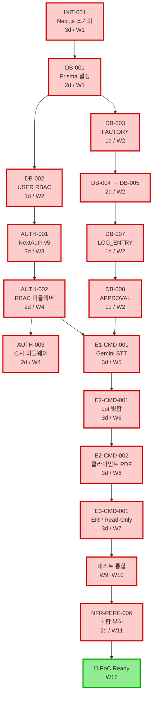

# FactoryAI — 개발 간트 차트 & 병렬 트랙 맵

**Source**: [`tasks/3.0_Full TASKS list.md`](3.0_Full%20TASKS%20list.md) — 전체 의존성 맵 (Critical Path)
**작성일**: 2026-05-16
**대상**: 179 태스크 / 14 Epic / SRS V0.8 MVP
**기준 일정**: 12주 (1인 개발 + AI 보조 가정). 시작일 2026-05-18 (월요일).

> [!TIP]
> 본 문서는 3개 다이어그램으로 구성됩니다:
> 1. **간트 차트** — 시간순 12주 배치 (병렬 트랙 + Critical Path)
> 2. **병렬 가능성 표** — 같은 주(Week)에 동시 진행 가능한 작업 그룹
> 3. **Critical Path 시각화** — 가장 긴 의존성 체인 (지연 시 전체 지연)

---

## 0. 핵심 요약 — 한 페이지

```mermaid
flowchart LR
    subgraph "🟥 Critical Path (지연 시 전체 지연) — 약 8주"
        direction LR
        CP1[INIT-001<br/>Next.js 초기화] --> CP2[DB-001<br/>Prisma 설정]
        CP2 --> CP3[DB-002,003<br/>USER + FACTORY]
        CP3 --> CP4[DB-007,008<br/>LOG_ENTRY + APPROVAL]
        CP4 --> CP5[AUTH-001~003<br/>NextAuth + RBAC + Audit]
        CP5 --> CP6[E1-CMD-001<br/>Gemini STT]
        CP6 --> CP7[E2-CMD-001,002<br/>Lot 병합 + PDF]
        CP7 --> CP8[E3-CMD-001<br/>ERP 동기화]
        CP8 --> CP9[NFR-PERF-006<br/>통합 부하 테스트]
    end

    style CP1 fill:#ffcccc,stroke:#c00,stroke-width:2px
    style CP2 fill:#ffcccc,stroke:#c00,stroke-width:2px
    style CP3 fill:#ffcccc,stroke:#c00,stroke-width:2px
    style CP4 fill:#ffcccc,stroke:#c00,stroke-width:2px
    style CP5 fill:#ffcccc,stroke:#c00,stroke-width:2px
    style CP6 fill:#ffcccc,stroke:#c00,stroke-width:2px
    style CP7 fill:#ffcccc,stroke:#c00,stroke-width:2px
    style CP8 fill:#ffcccc,stroke:#c00,stroke-width:2px
    style CP9 fill:#ffcccc,stroke:#c00,stroke-width:2px
```

| 주요 마일스톤 | 완료 시점 (목표) | Critical 태스크 |
|---|---|---|
| 🏗️ 인프라 가동 | W2 종료 | INIT-001~004, DB-001~017, API-001~019, MOCK-001~010 |
| 🔐 인증·AI 기반 | W4 종료 | AUTH-001~004, AI-001~003, NOTI-001~002 |
| ⚙️ Feature MVP | W8 종료 | E1, E2, E2-B, E3, E4 Command/Query |
| 🧪 통합 테스트 | W10 종료 | TEST-* 전체 37건 |
| 📦 NFR + 출시 준비 | W12 종료 | NFR-PERF/SEC/MON, PoC 시연 가능 |

---

## 1. 12주 간트 차트 (Gantt)

> 🟥 **빨강 (`crit`)** = Critical Path (지연 시 전체 지연)
> ⬜ 일반 = 병렬 가능 (Critical과 동시 진행 OK)

```mermaid
gantt
    title FactoryAI MVP — 12주 개발 간트 (2026-05-18 ~ 2026-08-09)
    dateFormat YYYY-MM-DD
    axisFormat W%V

    section 🏗️ Phase 0 초기화 (W1)
    INIT-001 Next.js + Tailwind + shadcn      :crit, init1, 2026-05-18, 3d
    INIT-002 Vercel 자동 배포                  :init2, after init1, 2d
    INIT-003 환경변수 체계                     :init3, after init1, 1d
    INIT-004 4앱 라우팅 구조                   :init4, after init1, 2d

    section 🗄️ Phase 1a DB 스키마 (W1~W2)
    DB-001 Prisma 이중 DB                      :crit, db1, after init1, 2d
    DB-002 USER (RBAC 5역할)                   :crit, db2, after db1, 1d
    DB-003 FACTORY                              :crit, db3, after db1, 1d
    DB-004 PRODUCTION_LINE                      :db4, after db3, 1d
    DB-005 WORK_ORDER                           :db5, after db4, 1d
    DB-006 DATA_SOURCE                          :db6, after db3, 1d
    DB-007 LOG_ENTRY                            :crit, db7, after db5, 1d
    DB-008 APPROVAL                             :crit, db8, after db7, 1d
    DB-009 LOT                                  :db9, after db5, 1d
    DB-010 AUDIT_REPORT                         :db10, after db3, 1d
    DB-011 ERP_CONNECTION                       :db11, after db3, 1d
    DB-012~015 SVC/E7 엔터티                   :db1215, after db3, 2d
    DB-016 AUDIT_LOG                            :db16, after db1, 1d
    DB-017 NOTIFICATION                         :db17, after db1, 1d

    section 📜 Phase 1b API/Mock 계약 (W2)
    API-001~003 E1 DTO                          :api13, after db7, 2d
    API-004~008 E2/E3 DTO                       :api48, after db11, 2d
    API-009~013 ROI/보안 DTO (Good First)      :api913, 2026-05-18, 3d
    API-014~015 HITL DTO                        :api1415, after db8, 1d
    API-016~019 E7/Audit/Noti DTO              :api1619, after db17, 1d
    MOCK-001 Seed 데이터                        :mock1, after db6, 1d
    MOCK-002 Mock ERP 테이블                    :mock2, after db11, 2d
    MOCK-003~005 Mock 시드 (Good First 포함)   :mock35, 2026-05-19, 2d
    MOCK-006~010 Mock API 엔드포인트           :mock610, after api1619, 2d

    section 🔐 Phase 2a 인증·AI 기반 (W3~W4)
    AI-001 Vercel AI SDK (Good First)          :ai1, 2026-05-18, 2d
    AI-002 In-memory Queue + Throttle           :crit, ai2, after ai1, 3d
    AI-003 진행률 UI                            :ai3, after ai2, 1d
    AUTH-001 NextAuth v5                        :crit, auth1, after db2, 3d
    AUTH-002 RBAC 미들웨어                      :crit, auth2, after auth1, 2d
    AUTH-003 Prisma 감사 미들웨어              :crit, auth3, after auth2, 2d
    AUTH-004 미인가 차단 + CISO 알림           :auth4, after auth3, 1d
    NOTI-001 알림 서비스                        :noti1, after api1619, 2d
    NOTI-002 알림 UI                            :noti2, after noti1, 1d

    section ⚙️ Phase 2b E1 패시브 로깅 (W5~W6)
    E1-CMD-001 Gemini STT (★)                  :crit, e1c1, after auth2, 3d
    E1-CMD-002 Gemini Vision                    :e1c2, after auth2, 3d
    E1-CMD-003 Approve/Reject                   :e1c3, after auth3, 2d
    E1-CMD-004 재촬영 알림                      :e1c4, after e1c2, 1d
    E1-CMD-005 동시 5건 큐                      :e1c5, after e1c1, 2d
    E1-QRY-001 결측률 리포트                    :e1q1, after db7, 1d
    E1-QRY-002 PENDING 목록                     :e1q2, after db8, 1d
    E1-UI-001~005 UI 컴포넌트                  :e1ui, after mock610, 4d

    section 📋 Phase 2c E2 감사 리포트 (W5~W7)
    E2-CMD-001 Lot 시간순 병합 (★)             :crit, e2c1, after db9, 3d
    E2-CMD-002 클라이언트 PDF (★)              :crit, e2c2, after e2c1, 3d
    E2-CMD-003 결측 알림                        :e2c3, after e2c1, 1d
    E2-CMD-004 XAI 포함                         :e2c4, after e2c2, 2d
    E2-CMD-005 미지원 포맷                      :e2c5, after e2c2, 1d
    E2-CMD-006 충돌 차단                        :e2c6, after e2c1, 1d
    E2-CMD-007 HITL 승인 워크플로              :e2c7, after e2c2, 2d
    E2-UI-001~003 UI                            :e2ui, after mock610, 3d

    section 🤖 Phase 2d E2-B XAI / E3 ERP (W5~W7)
    E2B-CMD-001 XAI 한국어 설명                :e2bc1, after ai2, 3d
    E2B-CMD-002~004 이상탐지                    :e2bc2, after e2bc1, 3d
    E3-CMD-001 Mock ERP Read-Only (★)          :crit, e3c1, after mock2, 3d
    E3-CMD-002~003 Excel Import                 :e3c23, after e3c1, 3d
    E3-CMD-004 정합성 리포트                    :e3c4, after e3c1, 2d
    E3-UI-001~003 UI                            :e3ui, after mock610, 3d

    section 💰 Phase 2e E4 ROI / E6 / E7 (W6~W8)
    E4-CMD-001~005 ROI                          :e4c, after api913, 5d
    E4-UI-001~003 UI                            :e4ui, after e4c, 2d
    E6-CMD-001~003 보안 콘솔                    :e6c, after auth2, 3d
    E6-UI-001~002 UI                            :e6ui, after e6c, 2d
    E7-CMD-001~004 대시보드                     :e7c, after db1215, 3d
    E7-UI-001~002 UI                            :e7ui, after e7c, 2d

    section 🛡️ Phase 2f HITL Guard (W5~W7)
    HITL-CMD-001 PENDING 차단                   :crit, hc1, after db8, 2d
    HITL-CMD-002 XAI null 차단                  :hc2, after db10, 1d
    HITL-CMD-003 API 게이트웨이 승인           :hc3, after auth3, 2d
    HITL-CMD-004~005 그 외 HITL                :hc45, after hc3, 2d

    section 🧪 Phase 3 테스트 (W9~W10)
    TEST-E1-001~005 패시브 로깅                :te1, after e1c5, 3d
    TEST-E2-001~005 감사 리포트                 :te2, after e2c7, 3d
    TEST-E2B-001~002 XAI                       :te2b, after e2bc2, 2d
    TEST-E3-001~003 ERP                         :te3, after e3c4, 2d
    TEST-E4-001~004 ROI                         :te4, after e4c, 2d
    TEST-E6-001~003 보안                        :te6, after e6c, 2d
    TEST-HITL-001~004 안전                      :thitl, after hc45, 3d

    section 📊 Phase 4 NFR + 인프라 (W11~W12)
    NFR-PERF-001~005 단위 성능                 :np1, after e2c2, 3d
    NFR-PERF-006 통합 부하 (★)                  :crit, np2, after np1, 2d
    NFR-PERF-007 큐 통합                        :np3, after ai3, 1d
    NFR-PERF-008 용량 모니터링                  :np4, after db1, 1d
    NFR-AVAIL-001 가용성 (Good First)          :na1, 2026-05-18, 1d
    NFR-AVAIL-002 유지보수 고지                :na2, after noti1, 1d
    NFR-REL-001~004 신뢰성                      :nrel, after e1c2, 3d
    NFR-SEC-001 HTTPS (Good First)             :nsec1, 2026-05-18, 1d
    NFR-SEC-002~005 보안                        :nsec2, after auth3, 3d
    NFR-MON-001~006 모니터링                    :nmon, after noti1, 4d
    NFR-SCALE-001~002 확장                      :nsc, after db4, 2d
    NFR-MAINT-001 유지보수                      :nm, after e3c4, 1d

    section 🤝 Phase 5 SVC 시스템 지원 (W7~W10)
    SVC-SYS-001~003 온보딩                      :svc1, after auth2, 3d
    SVC-SYS-004~006 바우처                      :svc2, after auth2, 3d
    SVC-SYS-007~009 보안심의                    :svc3, after e6c, 3d
    SVC-SYS-010~011 사후관리                    :svc4, after svc1, 3d
    SVC-SYS-012~014 장애 출동                   :svc5, after noti1, 3d
```

---

## 2. 병렬 가능성 표 (주차별 동시 진행 트랙)

> **1인 개발 가정**이지만 트랙별로 빠르게 전환 가능. AI 도구가 boilerplate를 가속하면 동시 2~3 트랙 진행 가능.

### W1 (5/18 ~ 5/24)
| 트랙 | 작업 | 의존성 |
|---|---|---|
| 🔵 **Track A (Critical)** | INIT-001 → DB-001 | None |
| 🟢 Track B (병렬) | AI-001 (Good First) | None |
| 🟢 Track C (병렬) | API-009~013 (Good First, ROI/보안 DTO) | None |
| 🟢 Track D (병렬) | MOCK-005 (Good First, 벤치마크 JSON) | None |
| 🟢 Track E (병렬) | NFR-SEC-001 (Good First, HTTPS 검증) | None |
| 🟢 Track F (병렬) | NFR-AVAIL-001 (Good First, 가용성 모니터) | None |
| 🟢 Track G (병렬) | E1-UI-005 (Good First, 연결 끊김 UI) | None |

### W2 (5/25 ~ 5/31)
| 트랙 | 작업 |
|---|---|
| 🔵 **Critical** | DB-002 → DB-003 → DB-004 → DB-005 → DB-007 → DB-008 |
| 🟢 병렬 1 | DB-006, DB-009~017 (FACTORY 후속 엔터티 무더기) |
| 🟢 병렬 2 | API-001~019 (DB 별로 의존성 만족 시 즉시) |
| 🟢 병렬 3 | MOCK-001~004, MOCK-006~010 |
| 🟢 병렬 4 | AI-002 → AI-003 (Gemini Throttle Queue 완성) |
| 🟢 병렬 5 | INIT-002~004 (Vercel 배포 + 환경변수 + 라우팅) |

### W3 (6/1 ~ 6/7)
| 트랙 | 작업 |
|---|---|
| 🔵 **Critical** | AUTH-001 (NextAuth v5) |
| 🟢 병렬 1 | NOTI-001 → NOTI-002 (알림 서비스) |
| 🟢 병렬 2 | NFR-PERF-008 (Supabase 용량 모니터) |
| 🟢 병렬 3 | NFR-SCALE-001 (멀티 라인 동시 테스트) |

### W4 (6/8 ~ 6/14)
| 트랙 | 작업 |
|---|---|
| 🔵 **Critical** | AUTH-002 (RBAC) → AUTH-003 (감사 미들웨어) |
| 🟢 병렬 1 | AUTH-004 (CISO 알림) |
| 🟢 병렬 2 | E1-QRY-001, E1-QRY-002 (결측률, PENDING 목록) |
| 🟢 병렬 3 | E1-UI-001~004 (Mock API 기반 UI 선개발) |
| 🟢 병렬 4 | E2-UI-001~003, E3-UI-001~003 (Mock 기반 UI) |

### W5 (6/15 ~ 6/21)
| 트랙 | 작업 |
|---|---|
| 🔵 **Critical** | E1-CMD-001 (Gemini STT) |
| 🟢 병렬 1 | E1-CMD-002 (Vision) |
| 🟢 병렬 2 | E2-CMD-001 (Lot 병합) |
| 🟢 병렬 3 | E2B-CMD-001 (XAI 한국어 설명) |
| 🟢 병렬 4 | HITL-CMD-001 (PENDING 차단) |
| 🟢 병렬 5 | E6-CMD-001~003 (보안 콘솔) |
| 🟢 병렬 6 | SVC-SYS-001~006 (온보딩 + 바우처 시스템) |

### W6 (6/22 ~ 6/28)
| 트랙 | 작업 |
|---|---|
| 🔵 **Critical** | E2-CMD-002 (클라이언트 PDF) |
| 🟢 병렬 1 | E1-CMD-003~005 (Approve, 재촬영, 동시 큐) |
| 🟢 병렬 2 | E2-CMD-003~007 (결측, XAI, 충돌, HITL) |
| 🟢 병렬 3 | E2B-CMD-002~004 (이상탐지) |
| 🟢 병렬 4 | E3-CMD-001 (Mock ERP Read-Only) |
| 🟢 병렬 5 | HITL-CMD-002~005 |

### W7 (6/29 ~ 7/5)
| 트랙 | 작업 |
|---|---|
| 🔵 **Critical** | E3-CMD-002~004 (Excel + 정합성) |
| 🟢 병렬 1 | E4-CMD-001~005 (ROI 계산) |
| 🟢 병렬 2 | E7-CMD-001~004 (대시보드) |
| 🟢 병렬 3 | SVC-SYS-007~011 (보안심의 + 사후관리) |

### W8 (7/6 ~ 7/12)
| 트랙 | 작업 |
|---|---|
| 🔵 Critical 완화 | Feature mop-up (남은 UI, Edge case) |
| 🟢 병렬 1 | E4-UI, E6-UI, E7-UI (UI 마무리) |
| 🟢 병렬 2 | SVC-SYS-012~014 (장애 출동) |
| 🟢 병렬 3 | NFR-PERF-001~005 (단위 성능 시작) |

### W9 (7/13 ~ 7/19)
| 트랙 | 작업 |
|---|---|
| 🔵 **Critical** | TEST-E1, TEST-E2 (핵심 Feature 테스트) |
| 🟢 병렬 1 | TEST-E2B, TEST-E3, TEST-E4 |
| 🟢 병렬 2 | NFR-REL-001~004 (신뢰성 테스트) |
| 🟢 병렬 3 | NFR-SEC-002~005 (보안 자동화) |

### W10 (7/20 ~ 7/26)
| 트랙 | 작업 |
|---|---|
| 🔵 **Critical** | TEST-HITL (안전 프로토콜 테스트) |
| 🟢 병렬 1 | TEST-E6, NFR-MON-001~006 |
| 🟢 병렬 2 | NFR-AVAIL-002, NFR-REL 마무리 |

### W11 (7/27 ~ 8/2)
| 트랙 | 작업 |
|---|---|
| 🔵 **Critical** | NFR-PERF-006 (동시접속 3명 통합 부하) |
| 🟢 병렬 1 | NFR-PERF-007 (큐 통합), NFR-MAINT-001 |
| 🟢 병렬 2 | 버그 수정 / 성능 튜닝 |

### W12 (8/3 ~ 8/9)
| 트랙 | 작업 |
|---|---|
| 🔵 PoC 준비 | E2E 시나리오 리허설, CISO 보안 심의 자료 (`.agents/workflows/ciso-security-review.md`) |
| 🟢 병렬 | 문서화, 데모 영상, 사용자 매뉴얼 |

---

## 3. Critical Path 상세 분석 (8주 코어)

> 이 경로가 **하루라도 지연되면 전체가 지연**. 절대 백로그에서 우선순위 1순위.

### 누적 일수 (이상적 시나리오, 작업일 기준)
| Step | 누적 | 비고 |
|---|---|---|
| INIT-001 종료 | D3 | |
| DB-001 종료 | D5 | |
| DB-008 종료 (W2 말) | D10 | |
| AUTH-003 종료 (W4 말) | D17 | NextAuth 학습 곡선 포함 |
| E1-CMD-001 종료 (W5 말) | D22 | Gemini API 첫 통합 |
| E2-CMD-002 종료 (W6 말) | D28 | 클라이언트 PDF 완료 |
| E3-CMD-001 종료 (W7 말) | D33 | Mock ERP Read-Only 완료 |
| 테스트 + NFR-PERF-006 | D52 | W11 종료 |
| **PoC 시연 준비** | **D60 (W12)** | 마지노선 |

---

## 4. Good First Issues — 즉시 시작 가능 (W1 동시 출발)

> SRS의 모든 의존성 표를 분석한 결과, 다음 **7개 태스크가 선행 의존성 0건**. INIT-001을 진행하면서 병렬로 시작 권장.

| Task ID | Feature | 권장 착수 | 예상 |
|---|---|---|---|
| 🥇 **INIT-001** | Next.js + Tailwind + shadcn 초기화 | Day 1 | 3d |
| 🥈 **AI-001** | Vercel AI SDK + Gemini Provider 설정 | Day 1 (병렬) | 2d |
| 🥉 **API-009~013** | ROI/보안 API DTO 정의 | Day 1~3 (병렬) | 3d 합산 |
| 🏅 **MOCK-005** | 업종 벤치마크 데이터 JSON | Day 2~3 (병렬, 데이터 작업) | 1d |
| 🏅 **NFR-SEC-001** | HTTPS 암호화 검증 | Day 1 (Vercel 기본 OK 확인) | 0.5d |
| 🏅 **NFR-AVAIL-001** | 가용성 모니터링 (status page) | Day 1 | 1d |
| 🏅 **E1-UI-005** | "연결 끊김" UI 컴포넌트 | Day 2 (정적 컴포넌트) | 1d |

> **1인 dev라도 INIT-001(주력) + 짧은 보조 작업(API DTO, JSON 데이터, 정적 UI)을 함께 진행 가능**. INIT-001이 빌드 대기 중인 동안 다른 트랙으로 전환.

---

## 5. 병렬 효율 극대화 전략

### 5-1. Mock-First 전략 (UI 트랙 가속)
- **W2~W4에 모든 Mock API 완성** (MOCK-006~010) → **UI 트랙이 백엔드와 무관하게 진행 가능**
- E1-UI-001~005, E2-UI-001~003, E3-UI-001~003, E4-UI-001~003 등 **모든 UI는 Mock API 의존**
- 백엔드 Command 완성 후 endpoint URL만 swap → 통합 비용 최소

### 5-2. AI 추상화 우선 (W1~W2)
- AI-001 → AI-002 → AI-003 **3개 태스크는 Foundation**. W2 안에 끝내야 Feature 트랙(W5~)이 의존성 충족.
- 늦어지면 E1-CMD-001, E2B-CMD-001 등 **6개 Feature가 동시에 막힘**

### 5-3. RBAC 미들웨어가 진짜 병목 (W3~W4)
- AUTH-001 → AUTH-002 → AUTH-003은 **모든 Server Action / Route Handler의 선행**
- 거의 모든 Command 태스크가 `AUTH-002` 의존
- W4 끝까지 완성 필수 → 늦어지면 W5 전체 트랙 정지

### 5-4. ERP/보안/Test는 분리 가능
- E3-CMD-001 (Mock ERP)는 MOCK-002 + DB-011 + AUTH-002 만 있으면 시작
- TEST-* 는 각 Command 완성 직후 1~2일 안에 작성 가능 (TDD 안 한다 가정)
- NFR-* 는 대부분 W11~W12에 집중 (단, Good First인 NFR-SEC-001, NFR-AVAIL-001은 W1 시작)

### 5-5. 위험 신호 (Anti-pattern)
- ❌ Feature를 다 만들고 마지막에 AUTH 통합 → 모든 코드에 `requireRole` 후행 삽입 비용 폭증
- ❌ HITL-CMD-001을 늦게 → E2-CMD-007 (감사 리포트 HITL 승인)이 지연
- ❌ NFR-PERF-006 (통합 부하)을 W12에 시도 → 발견된 병목 수정 시간 부족

---

## 6. 주차별 Done 조건 (Definition of Done)

| Week | 마일스톤 | 검증 |
|---|---|---|
| **W2 종료** | 인프라·계약·Mock 완료 | `npm run dev` 정상, `npx prisma migrate dev` 통과, Mock API 10개 200 응답 |
| **W4 종료** | 인증·AI 기반 완료 | Credentials 로그인 → JWT 발급 → RBAC 가드 동작, Gemini 호출 throttle 동작 |
| **W6 종료** | E1+E2 Feature 50% | STT 1건 정상 → LOG_ENTRY PENDING 저장 → 승인, Lot 병합 + PDF 다운로드 |
| **W8 종료** | 모든 Feature Command 완료 | 7 Epic × Command 모두 동작, audit_log 누락 0건 |
| **W10 종료** | 테스트 37건 통과 | `npm test` 통과, RBAC 매트릭스 전수 검증 |
| **W11 종료** | NFR 합격 | p95 ≤ 800ms 페이지, ≤ 5s STT, 동시 3명 부하 OK |
| **W12 종료** | 🏁 PoC 시연 가능 | E2E 시나리오 1회 무중단 통과, CISO 보안 심의 자료 완비 |

---

## 7. 위험·완충 (Buffer)

### 식별된 위험
| 위험 | 영향 | 완충안 |
|---|---|---|
| Gemini Free Tier 한도 초과 | AI 트랙 정지 | PoC 직전 유료 전환 ($15/월), 큐 ≤12 RPM 강제 |
| NextAuth v5 학습 곡선 | W3 지연 | W2 끝에 보조 학습 1일 예산 |
| 클라이언트 PDF 한글 폰트 | E2 PDF 깨짐 | Pretendard 등록·테스트를 W6 초반 |
| ERP Mock ↔ 실제 스키마 괴리 | Phase 2 마이그레이션 비용 | W2에 더존 iCUBE 스키마 모방 정밀도 점검 |
| 1인 번아웃 | 전체 지연 | W4, W8 종료 후 각 2일 휴식 권장 |

### 일정 완충
- 12주 계획에 **약 1주 완충 내장** (각 Phase 종료 후 0.5일~1일 여유)
- W11과 W12 사이에 통합 테스트 / 버그 수정 시간 **명시적 확보**
- Critical Path 외 트랙은 ±2일 슬립 허용

---

## 8. 사용법 (이 문서를 어떻게 활용)

1. **매주 월요일 아침** — §2 (병렬 가능성 표) 해당 주차 확인 → 4~6 트랙 중 우선순위 결정
2. **새 PR 작성 시** — §3 (Critical Path)에서 본 PR이 critical path 영향인지 확인
3. **지연 발생 시** — §1 Gantt에서 후속 의존성 검토 → 통보 대상 식별
4. **PoC 시연 D-30** — W11 마일스톤 점검 (§6 Done 조건)
5. **레퍼런스** — [`3.0_Full TASKS list.md`](3.0_Full%20TASKS%20list.md) 의존성 표가 항상 진실원본

---

*본 차트는 [`tasks/3.0_Full TASKS list.md`](3.0_Full%20TASKS%20list.md) §전체 의존성 맵을 기반으로 작성되었으며, 1인 개발 + AI 보조 도구 활용을 전제로 12주 일정을 도출했습니다. 실제 진행 상황에 따라 매 W4, W8에 재조정 권장.*
