# FactoryAI — AI 가속 일정 (12주 → 5주)

**Source**: [`tasks/3.0_Full TASKS list.md`](3.0_Full%20TASKS%20list.md), [`tasks/3.1_Gantt_Chart_Critical_Path.md`](3.1_Gantt_Chart_Critical_Path.md)
**작성일**: 2026-05-16
**대상**: GitHub Project Roadmap 등록용 단축 일정
**시작일**: 2026-05-18 (월) → 종료: 2026-06-19 (금) — 5주 (25 working days)

> [!IMPORTANT]
> 기존 12주 일정을 **AI 보조(.agents/skills/ 24종 + .claude/agents/ 5종 + .gemini/agents/ 7종)** 활용 전제로 5주로 단축했습니다. 58% 단축의 근거는 §1 참조.

---

## 1. 가속 근거 (12주 → 5주, 58% 단축)

| 영역 | 기존 (12주) | AI 가속 (5주) | 단축 사유 |
|---|:---:|:---:|---|
| Foundation (INIT/DB/API/Mock) | W1~W2 (10일) | W1 (5일) | `300-nextjs-app-router-rules` + `310/311 server-side` 골격 즉시 적용. Prisma schema/DTO AI 자동 생성 |
| 인증·AI 기반 | W3~W4 (10일) | W2 (5일) | `314-nextauth-v5-setup`이 코드 골격 제공 (인증 학습 시간 0) |
| Feature 개발 (7 Epic) | W5~W8 (20일) | W2~W3 (10일) | Server Action/Route Handler 골격(`310/311`) + Skill 기반 패턴 즉시 적용 → 트랙당 1~2일 |
| Test (37건) | W9~W10 (10일) | W4 전반 (3일) | `319-user-rate-limiting` 등에서 테스트 패턴 제공. AC 표 → 테스트 코드 AI 변환 |
| NFR (28건) | W11~W12 (10일) | W4 후반~W5 (7일) | 표준 NFR 시나리오 템플릿 활용 |
| **합계** | **60일** | **25일** | **약 2.4x 가속** |

### 가속의 전제 조건
1. **Harness 24 Skill이 코드 골격 즉시 제공** — 첫 작성 시간 0에 가까움
2. **AI가 boilerplate 작성** — DB schema, DTO, Route Handler 같은 반복 코드
3. **AC 표 → Test 코드 자동 변환** — `400-srs-task-extraction` skill 활용
4. **1인 개발자가 매일 6시간+ 집중** (회의/대기 최소화)

### 가속의 한계 (이 일정에서도 1인 dev가 직접 해야 하는 일)
- 비즈니스 의사결정 (ERP 모델 매핑, RBAC 권한 매트릭스 등)
- 외부 시연·검토 (CISO 보안 심의, PoC 고객 미팅)
- 디자인 결정 (UX, 모바일 친화도)
- 디버깅 (AI도 막힐 때 결국 사람이 풀어야 함)

---

## 2. 5주 일정 — 주차별 Task 할당

### 🏗️ Week 1 (5/18~5/22) — Foundation (50 tasks)

| Day | Track A (Critical) | Track B (병렬) | Track C (병렬) |
|---|---|---|---|
| Mon 5/18 | INIT-001 Next.js 초기화 | AI-001 Vercel AI SDK | API-009~013 (Good First 5건) |
| Tue 5/19 | DB-001 Prisma 설정 | INIT-002 Vercel 배포 | MOCK-005, NFR-SEC-001, NFR-AVAIL-001, E1-UI-005 |
| Wed 5/20 | DB-002, DB-003 | INIT-003, INIT-004 | API-001~008 (DB 의존) |
| Thu 5/21 | DB-004~007 | DB-009~015 (병렬) | API-014~019 |
| Fri 5/22 | DB-008, DB-016, DB-017 | AI-002, AI-003 | MOCK-001~004, MOCK-006~010 |

**W1 Done 조건**: `npm run dev` + Prisma migrate + Mock API 10건 200 응답

### 🔐 Week 2 (5/25~5/29) — Auth + AI 기반 + 핵심 Feature (30 tasks)

| Day | Track A (Critical) | Track B (병렬) | Track C (병렬) |
|---|---|---|---|
| Mon 5/25 | AUTH-001 NextAuth v5 | NOTI-001 알림 서비스 | NFR-PERF-008 용량 모니터 |
| Tue 5/26 | AUTH-002 RBAC | NOTI-002 알림 UI | E1-UI-001~005 (Mock 기반) |
| Wed 5/27 | AUTH-003 감사 미들웨어 | E1-QRY-001, E1-QRY-002 | E2-UI-001~003 |
| Thu 5/28 | E1-CMD-001 Gemini STT (★) | E1-CMD-002 Vision | AUTH-004 CISO 알림 |
| Fri 5/29 | E2-CMD-001 Lot 병합 (★) | E1-CMD-003~005, HITL-CMD-001 | E3-UI-001~003 |

**W2 Done 조건**: 로그인 → RBAC 가드 → STT 1건 PENDING 저장 → 승인

### ⚙️ Week 3 (6/1~6/5) — 나머지 Feature (30 tasks)

| Day | Track A | Track B | Track C |
|---|---|---|---|
| Mon 6/1 | E2-CMD-002 클라이언트 PDF (★) | E2B-CMD-001 XAI 한국어 | E6-CMD-001~003 보안 콘솔 |
| Tue 6/2 | E2-CMD-003~007 (5건) | E2B-CMD-002~004 | E6-QRY-001~002, E6-UI-001~002 |
| Wed 6/3 | E3-CMD-001 Mock ERP (★) | E4-CMD-001~005 ROI | HITL-CMD-002~005 |
| Thu 6/4 | E3-CMD-002~004 | E4-UI-001~003 | E7-CMD-001~004 |
| Fri 6/5 | E3-QRY-001~002 | E7-QRY-001~002, E7-UI-001~002 | HITL-QRY-001 |

**W3 Done 조건**: 모든 7 Epic Command 동작, audit_log 누락 0건

### 🧪 Week 4 (6/8~6/12) — Test + SVC 시스템 (51 tasks)

| Day | Track A | Track B | Track C |
|---|---|---|---|
| Mon 6/8 | TEST-E1-001~007 (7건) | SVC-SYS-001~003 온보딩 | NFR-PERF-001~003 |
| Tue 6/9 | TEST-E2-001~005, TEST-E2B-001~005 | SVC-SYS-004~006 바우처 | NFR-PERF-004~005 |
| Wed 6/10 | TEST-E3-001~005, TEST-E4-001~005 | SVC-SYS-007~009 보안심의 | NFR-PERF-007 큐 통합 |
| Thu 6/11 | TEST-E6-001~004, TEST-E7-001~005 | SVC-SYS-010~014 사후관리/장애 | NFR-AVAIL-001~002 |
| Fri 6/12 | TEST-HITL-001~006 (6건, ★) | NFR-REL-001~004 | NFR-SEC-001~005 |

**W4 Done 조건**: 37 Test 통과, RBAC 매트릭스 전수 검증, SVC 14건 구현

### 📊 Week 5 (6/15~6/19) — NFR 완성 + 통합 + PoC 준비 (18 tasks)

| Day | Track A | Track B |
|---|---|---|
| Mon 6/15 | NFR-MON-001~006 (모니터링 6건) | NFR-SCALE-001~002, NFR-MAINT-001 |
| Tue 6/16 | NFR-PERF-006 통합 부하 (★) | E2E 시나리오 리허설 시작 |
| Wed 6/17 | 발견 병목 수정 | 한국어 UX 점검·번역 마무리 |
| Thu 6/18 | CISO 보안 심의 자료 (`workflows/ciso-security-review.md`) | 사용자 매뉴얼·데모 영상 |
| Fri 6/19 | 🏁 **PoC 시연 가능 상태** | 회고 + Phase 2 계획 |

**W5 Done 조건**: E2E 1회 무중단, 동시 3명 p95 ≤ 800ms, CISO 자료 완비

---

## 3. Critical Path (AI 가속 버전, 14일 → 9일)

```mermaid
flowchart LR
    A[INIT-001<br/>D1] --> B[DB-001~008<br/>D2~D3]
    B --> C[AUTH-001~003<br/>D6~D8]
    C --> D[E1-CMD-001<br/>D9]
    D --> E[E2-CMD-001,002<br/>D10~D11]
    E --> F[E3-CMD-001<br/>D13]
    F --> G[Test 통합<br/>D17~D19]
    G --> H[NFR-PERF-006<br/>D22]
    H --> I[🏁 PoC<br/>D25]

    style A fill:#ffcccc
    style B fill:#ffcccc
    style C fill:#ffcccc
    style D fill:#ffcccc
    style E fill:#ffcccc
    style F fill:#ffcccc
    style G fill:#ffcccc
    style H fill:#ffcccc
    style I fill:#90EE90
```

---

## 4. GitHub Project 등록 — 일정 필드 매핑

| Task ID 패턴 | Phase | Week | Start Date | End Date |
|---|---|---|---|---|
| INIT-* | 0-init | 1 | 5/18 | 5/22 |
| DB-001~008 | 1-foundation | 1 | 5/18 | 5/22 |
| DB-009~017 | 1-foundation | 1 | 5/19 | 5/22 |
| API-001~019 | 1-foundation | 1 | 5/20 | 5/22 |
| MOCK-001~010 | 1-foundation | 1 | 5/21 | 5/22 |
| AUTH-001~004 | 2a-auth | 2 | 5/25 | 5/28 |
| AI-001~003 | 2a-ai | 1 | 5/18 | 5/22 |
| NOTI-001~002 | 2a-noti | 2 | 5/25 | 5/26 |
| E1-* | 2-feature | 2~3 | 5/26 | 5/30 |
| E2-* | 2-feature | 2~3 | 5/29 | 6/3 |
| E2B-* | 2-feature | 3 | 6/1 | 6/3 |
| E3-* | 2-feature | 3 | 6/3 | 6/5 |
| E4-* | 2-feature | 3 | 6/3 | 6/5 |
| E6-* | 2-feature | 3 | 6/1 | 6/3 |
| E7-* | 2-feature | 3 | 6/4 | 6/5 |
| HITL-* | 2-hitl | 2~3 | 5/29 | 6/4 |
| TEST-* | 3-test | 4 | 6/8 | 6/12 |
| SVC-SYS-* | 4-svc | 4 | 6/8 | 6/12 |
| NFR-PERF-* | 4-nfr | 4~5 | 6/8 | 6/16 |
| NFR-AVAIL-*, NFR-REL-* | 4-nfr | 4 | 6/11 | 6/12 |
| NFR-SEC-* | 4-nfr | 4 | 6/12 | 6/12 |
| NFR-MON-* | 4-nfr | 5 | 6/15 | 6/15 |
| NFR-SCALE-*, NFR-MAINT-* | 4-nfr | 5 | 6/15 | 6/15 |

---

## 5. 위험 + 완충

| 위험 | 영향 | 완충안 (5주 일정 내) |
|---|---|---|
| 1인 dev 번아웃 | 일정 슬립 | W3, W4 끝나고 주말 휴식 강제 |
| AI 응답 품질 저하 (Gemini Free 한도) | 가속 효과 감소 | PoC 1주 전 유료 전환 결정 |
| Prisma migration 충돌 | DB 작업 지연 | W1 안에 모든 schema 한 번에 |
| NextAuth v5 학습 곡선 | W2 지연 | W1 끝 주말에 30분 docs skim |
| 통합 테스트에서 발견될 버그 | W5 지연 | 1.5일 버그 수정 여유 (D23~24) |
| **5주에 못 끝낼 경우** | PoC 지연 | **W6 (6/22~6/26) 1주 비축**. 그래도 총 6주 = 기존 12주 대비 50% 단축 |

---

## 6. 모니터링 체크포인트 (매주 금요일)

- W1 종료: 50건 / 179건 (28%)
- W2 종료: 80건 / 179건 (45%)
- W3 종료: 110건 / 179건 (61%)
- W4 종료: 161건 / 179건 (90%)
- W5 종료: 179건 / 179건 (100%)

체크포인트마다 미완료 task의 의존성 영향 점검 → 다음 주 조정.

---

*본 일정은 [`3.1_Gantt_Chart_Critical_Path.md`](3.1_Gantt_Chart_Critical_Path.md)의 12주 일정을 AI 보조 도구 활용으로 단축한 버전입니다. GitHub Project의 Start/End Date 필드는 본 §4를 기준으로 입력합니다. 실제 진행 상황에 따라 W2 끝(6/1)에 재조정 권장.*
