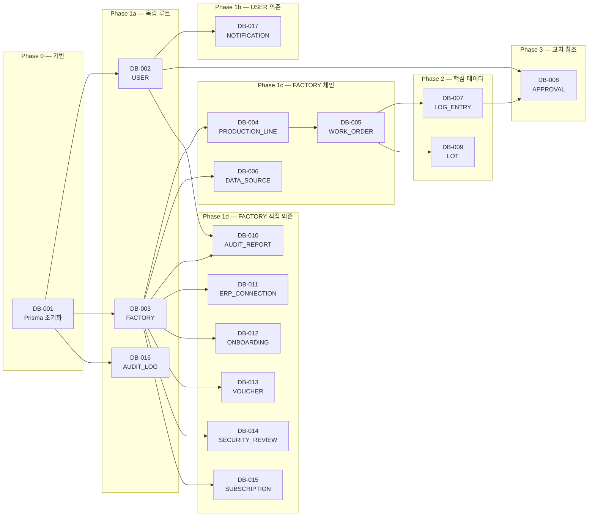

# FactoryAI — Database Schema & Migration Issues (DB-001 ~ DB-017)

> **Source**: SRS-002 Rev 2.0 (V0.8) — §6.2 Entity & Data Model  
> **작성일**: 2026-04-19  
> **총 Issue**: 17건 (Foundation 7 + Domain 10)  
> **ORM**: Prisma  
> **DB**: SQLite (dev) / Supabase PostgreSQL (MVP)

---

## DB-001: Prisma 프로젝트 초기화 + 이중 DB 설정

---
name: Feature Task
about: SRS 기반의 구체적인 개발 태스크 명세
title: "[DB/Foundation] DB-001: Prisma 프로젝트 초기화 + SQLite(dev)/Supabase PostgreSQL(MVP) 이중 DB 설정"
labels: 'feature, backend, database, priority:must, epic:foundation'
assignees: ''
---

### :dart: Summary
- **기능명**: [DB-001] Prisma ORM 프로젝트 초기화 + SQLite(dev)/Supabase PostgreSQL(MVP) 이중 데이터베이스 설정
- **목적**: FactoryAI 전체 데이터 레이어의 기반을 구축한다. 개발 환경에서는 SQLite로 즉시 로컬 실행 가능하게 하고, MVP 배포 환경에서는 Supabase PostgreSQL에 연결하여 환경변수 전환만으로 DB를 교체할 수 있는 Prisma ORM 중립 구조를 확립한다.

### :link: References (Spec & Context)
> :bulb: AI Agent & Dev Note: 작업 시작 전 아래 문서를 반드시 먼저 Read/Evaluate 할 것.
- SRS 문서: [`SRS_V_1.0.md#§10.1`](file:///c:/Antigravity_Workspace/SRS%20from%20PRD_RPA%20Saas/Tasks/2_SRS_V_1.0.md) — 기술 스택 정의
- 제약사항: CON-09 (Prisma ORM: SQLite dev / Supabase PostgreSQL MVP)
- ADR: ADR-10 (Prisma ORM 중립 DB)
- 제약사항: CON-12 (Supabase Free 500MB DB + 1GB Storage)

### :white_check_mark: Task Breakdown (실행 계획)
- [ ] **1.** `npx prisma init` 실행 — `prisma/schema.prisma` 기본 파일 생성
- [ ] **2.** `prisma/schema.prisma`에 `generator`, `datasource` 블록 정의
  - `datasource db { provider = "postgresql" url = env("DATABASE_URL") }`
  - SQLite 개발 시 별도 `schema.dev.prisma` 또는 `.env.local`에서 `DATABASE_URL="file:./dev.db"` 전환
- [ ] **3.** `.env.local` (dev) / `.env.cloud` (MVP) 환경변수 파일 구조 생성
  - dev: `DATABASE_URL="file:./dev.db"` + `DIRECT_URL` 없음
  - MVP: `DATABASE_URL="postgresql://...@supabase:5432/postgres"` + `DIRECT_URL`
- [ ] **4.** Prisma Client 생성 스크립트: `package.json`에 `"db:generate": "prisma generate"`, `"db:push": "prisma db push"`, `"db:migrate:dev": "prisma migrate dev"` 추가
- [ ] **5.** `.gitignore`에 `prisma/dev.db`, `.env.local`, `.env.cloud` 추가
- [ ] **6.** `lib/prisma.ts` — 싱글톤 PrismaClient 인스턴스 생성 (Next.js Hot Reload 대응)
- [ ] **7.** 연결 테스트 스크립트: `scripts/test-db-connection.ts` — DB 연결 성공 확인

### :test_tube: Acceptance Criteria (BDD/GWT)

**Scenario 1: 로컬 개발 환경 DB 초기화**
- **Given**: `.env.local`에 SQLite URL이 설정되어 있다
- **When**: `npx prisma db push`를 실행한다
- **Then**: `prisma/dev.db` 파일이 생성되고 스키마가 적용된다. PrismaClient로 연결 테스트 성공.

**Scenario 2: MVP 환경 Supabase 연결**
- **Given**: `.env.cloud`에 Supabase PostgreSQL URL이 설정되어 있다
- **When**: `npx prisma migrate deploy`를 실행한다
- **Then**: Supabase PostgreSQL에 스키마가 적용된다. PrismaClient 연결 테스트 성공.

**Scenario 3: 환경 전환**
- **Given**: 동일한 `schema.prisma` 파일이 존재한다
- **When**: `DATABASE_URL` 환경변수만 변경한다
- **Then**: SQLite ↔ PostgreSQL 간 전환이 코드 변경 없이 가능하다.

### :gear: Technical & Non-Functional Constraints
- **ORM**: Prisma 5.x (최신 안정 버전)
- **DB 용량 제한**: Supabase Free 500MB DB + 1GB Storage (REQ-NF-009)
- **Hot Reload**: Next.js 개발 모드에서 PrismaClient 다중 인스턴스 방지 필수 (`globalThis` 패턴)
- **PostgreSQL**: Supabase Connection Pooling 지원 (`?pgbouncer=true`)

### :checkered_flag: Definition of Done (DoD)
- [ ] SQLite(dev)와 PostgreSQL(MVP) 모두에서 마이그레이션 성공 확인
- [ ] PrismaClient 싱글톤 패턴 구현 완료
- [ ] 환경변수 전환만으로 DB 교체 가능 확인
- [ ] `.env.example` 파일에 필수 변수 문서화
- [ ] 코드 정적 분석 경고 0건 (ESLint)

### :construction: Dependencies & Blockers
- **Depends on**: `INIT-001` (Next.js 프로젝트 초기화)
- **Blocks**: DB-002 ~ DB-017 (모든 후속 DB 태스크), AUTH-001 (인증 설정), NFR-PERF-008 (용량 모니터링)

---

## DB-002: USER 엔터티 스키마 + 마이그레이션

---
name: Feature Task
about: SRS 기반의 구체적인 개발 태스크 명세
title: "[DB/Foundation] DB-002: USER 엔터티 스키마 + 마이그레이션 (RBAC 5역할)"
labels: 'feature, backend, database, priority:must, epic:foundation'
assignees: ''
---

### :dart: Summary
- **기능명**: [DB-002] USER 엔터티 스키마 + 마이그레이션 (RBAC 5역할: ADMIN/OPERATOR/AUDITOR/VIEWER/CISO)
- **목적**: FactoryAI의 인증/인가 체계의 기반이 되는 사용자 테이블을 생성한다. NextAuth.js와 연동되는 5역할 RBAC 구조를 데이터 레벨에서 보장한다.

### :link: References (Spec & Context)
- SRS 문서: [`SRS_V_1.0.md#§6.2.14`](file:///c:/Antigravity_Workspace/SRS%20from%20PRD_RPA%20Saas/Tasks/2_SRS_V_1.0.md) — §6.2.14 USER 엔터티
- 관련 요구사항: REQ-NF-022 (RBAC 5역할 접근 제어)
- 데이터 모델: §6.2 ERD — USER 엔터티

### :white_check_mark: Task Breakdown (실행 계획)
- [ ] **1.** `prisma/schema.prisma`에 `User` 모델 정의
- [ ] **2.** `Role` ENUM 정의: `ADMIN`, `OPERATOR`, `AUDITOR`, `VIEWER`, `CISO`
- [ ] **3.** 필드 정의:
  - `id` — UUID, PK, `@default(uuid())`
  - `name` — String, NOT NULL
  - `email` — String, UNIQUE, NOT NULL
  - `password_hash` — String (NextAuth.js 자격증명용)
  - `role` — Role ENUM, NOT NULL
  - `factory_id` — UUID, FK → Factory (Optional, 소속 공장)
  - `is_active` — Boolean, DEFAULT true
  - `created_at` — DateTime, `@default(now())`
  - `last_login_at` — DateTime? (Optional)
- [ ] **4.** 인덱스 정의: `@@index([email])`, `@@index([role])`, `@@index([factory_id])`
- [ ] **5.** `prisma migrate dev --name add-user-table` 실행
- [ ] **6.** 마이그레이션 SQL 파일 검증 (컬럼 타입, 제약 확인)

### :test_tube: Acceptance Criteria (BDD/GWT)

**Scenario 1: USER 테이블 정상 생성**
- **Given**: Prisma 스키마에 User 모델이 정의되어 있다
- **When**: `prisma migrate dev`를 실행한다
- **Then**: `User` 테이블이 생성되며 5개 역할 ENUM, UNIQUE email 제약이 적용된다.

**Scenario 2: 중복 이메일 삽입 차단**
- **Given**: `admin@factory.co.kr` 이메일의 USER가 존재한다
- **When**: 동일 이메일로 INSERT를 시도한다
- **Then**: UNIQUE 제약 위반 에러가 발생하고 INSERT가 차단된다.

**Scenario 3: 유효하지 않은 Role 삽입 차단**
- **Given**: Role ENUM에 정의되지 않은 값 `SUPERADMIN`이 주어진다
- **When**: INSERT를 시도한다
- **Then**: ENUM 제약 위반 에러가 발생한다.

### :gear: Technical & Non-Functional Constraints
- **RBAC**: 5역할 정확한 ENUM 정의 필수 (REQ-NF-022)
- **보안**: `password_hash` 필드는 평문 저장 절대 금지 (Bcrypt hash only)
- **NextAuth.js 호환**: NextAuth.js Adapter 모델 구조와 호환 필수
- **FK 참조**: `factory_id`는 DB-003 (FACTORY) 완료 후 FK 관계 활성화

### :checkered_flag: Definition of Done (DoD)
- [ ] 마이그레이션 SQL 생성 및 적용 완료 (SQLite + PostgreSQL)
- [ ] 5역할 ENUM 정상 동작 확인
- [ ] UNIQUE email 제약 테스트 통과
- [ ] 인덱스 생성 확인
- [ ] 코드 정적 분석 경고 0건

### :construction: Dependencies & Blockers
- **Depends on**: `DB-001` (Prisma 초기화)
- **Blocks**: `AUTH-001` (NextAuth.js 설정), `DB-008` (APPROVAL FK), `DB-010` (AUDIT_REPORT FK), `DB-017` (NOTIFICATION FK), `MOCK-001` (Seed 데이터)

---

## DB-003: FACTORY 엔터티 스키마 + 마이그레이션

---
name: Feature Task
title: "[DB/Foundation] DB-003: FACTORY 엔터티 스키마 + 마이그레이션 (업종 ENUM)"
labels: 'feature, backend, database, priority:must, epic:foundation'
---

### :dart: Summary
- **기능명**: [DB-003] FACTORY 엔터티 스키마 + 마이그레이션 (업종 ENUM: METAL_PROCESSING / FOOD_MANUFACTURING)
- **목적**: FactoryAI가 관리하는 공장 단위의 마스터 데이터를 저장한다. 대부분의 도메인 엔터티(생산라인, ERP 연결, 구독 등)가 공장을 기준으로 FK 참조하므로, 전체 데이터 모델의 루트 엔터티 역할을 한다.

### :link: References (Spec & Context)
- SRS 문서: [`SRS_V_1.0.md#§6.2.1`](file:///c:/Antigravity_Workspace/SRS%20from%20PRD_RPA%20Saas/Tasks/2_SRS_V_1.0.md) — §6.2.1 FACTORY 엔터티
- 제약사항: CON-06 (금속가공 + 식품제조 2개 버티컬만)

### :white_check_mark: Task Breakdown (실행 계획)
- [ ] **1.** `Industry` ENUM 정의: `METAL_PROCESSING`, `FOOD_MANUFACTURING`
- [ ] **2.** `Factory` 모델 필드 정의:
  - `id` — UUID, PK
  - `name` — String(255), NOT NULL
  - `industry` — Industry ENUM, NOT NULL
  - `address` — String(Text), NOT NULL
  - `employee_count` — Int, NOT NULL
  - `created_at` — DateTime, `@default(now())`
- [ ] **3.** 관계(Relation) 정의: `productionLines`, `erpConnections`, `onboardingProjects`, `voucherProjects`, `securityReviews`, `subscriptions`, `dataSources`, `users`
- [ ] **4.** 인덱스: `@@index([industry])`
- [ ] **5.** 마이그레이션 실행 및 검증

### :test_tube: Acceptance Criteria (BDD/GWT)

**Scenario 1: FACTORY 테이블 정상 생성**
- **Given**: Prisma 스키마에 Factory 모델이 정의되어 있다
- **When**: 마이그레이션을 실행한다
- **Then**: `Factory` 테이블이 생성되고 2개 업종 ENUM이 정상 적용된다.

**Scenario 2: 유효하지 않은 업종 차단**
- **Given**: `AUTOMOBILE` 등 미정의 업종이 주어진다
- **When**: INSERT를 시도한다
- **Then**: ENUM 제약 위반으로 차단된다.

### :gear: Technical & Non-Functional Constraints
- **업종 제한**: Phase 1 MVP는 금속가공·식품제조 2개만 (CON-06). Phase 2에서 ENUM 확장
- **루트 엔터티**: 10+ 엔터티가 FK 참조하는 중심 테이블 — 스키마 변경 시 영향도 高

### :checkered_flag: Definition of Done (DoD)
- [ ] 마이그레이션 성공 (SQLite + PostgreSQL)
- [ ] 2개 업종 ENUM 동작 확인
- [ ] Relation 정의 완료 (DB-004~015에서 사용)
- [ ] 코드 정적 분석 경고 0건

### :construction: Dependencies & Blockers
- **Depends on**: `DB-001`
- **Blocks**: `DB-004` (PRODUCTION_LINE), `DB-006` (DATA_SOURCE), `DB-010` (AUDIT_REPORT), `DB-011` (ERP_CONNECTION), `DB-012` (ONBOARDING), `DB-013` (VOUCHER), `DB-014` (SECURITY_REVIEW), `DB-015` (SUBSCRIPTION), `MOCK-001`

---

## DB-004: PRODUCTION_LINE 엔터티 스키마 + 마이그레이션

---
name: Feature Task
title: "[DB/Foundation] DB-004: PRODUCTION_LINE 엔터티 스키마 + 마이그레이션"
labels: 'feature, backend, database, priority:must, epic:foundation'
---

### :dart: Summary
- **기능명**: [DB-004] PRODUCTION_LINE 엔터티 스키마 + 마이그레이션 (FK → FACTORY, 상태 ENUM)
- **목적**: 공장 내 생산라인 단위를 관리한다. 라인별 작업지시(WORK_ORDER)의 상위 엔터티이며, 고객사당 최소 3개 라인 동시 지원(REQ-NF-033)을 데이터 구조로 보장한다.

### :link: References (Spec & Context)
- SRS 문서: §6.2.2 PRODUCTION_LINE 엔터티
- 관련 요구사항: REQ-NF-033 (고객사당 ≥3 라인 지원)

### :white_check_mark: Task Breakdown (실행 계획)
- [ ] **1.** `LineStatus` ENUM: `ACTIVE`, `IDLE`, `MAINTENANCE`
- [ ] **2.** `ProductionLine` 모델 필드:
  - `id` — UUID, PK
  - `factory_id` — UUID, FK → Factory, NOT NULL
  - `name` — String(255), NOT NULL
  - `status` — LineStatus ENUM, NOT NULL, DEFAULT `ACTIVE`
- [ ] **3.** 관계: `factory` (belongs_to), `workOrders` (has_many)
- [ ] **4.** 인덱스: `@@index([factory_id])`, `@@index([status])`
- [ ] **5.** 마이그레이션 + FK 제약 검증

### :test_tube: Acceptance Criteria (BDD/GWT)

**Scenario 1: 라인 생성 및 FK 검증**
- **Given**: 유효한 `factory_id`가 존재한다
- **When**: ProductionLine을 생성한다
- **Then**: Factory FK 참조가 정상 적용된다.

**Scenario 2: 존재하지 않는 Factory 참조 차단**
- **Given**: 존재하지 않는 `factory_id`가 주어진다
- **When**: ProductionLine INSERT를 시도한다
- **Then**: FK 제약 위반으로 차단된다.

### :gear: Technical & Non-Functional Constraints
- **확장성**: 고객사당 ≥3 라인 동시 지원 (REQ-NF-033)
- **Cascade**: Factory 삭제 시 CASCADE 정책 결정 필요 (RESTRICT 권장 — 데이터 보존)

### :checkered_flag: Definition of Done (DoD)
- [ ] 마이그레이션 성공, FK 무결성 검증
- [ ] 3개 상태 ENUM 동작 확인
- [ ] 코드 정적 분석 경고 0건

### :construction: Dependencies & Blockers
- **Depends on**: `DB-003` (FACTORY)
- **Blocks**: `DB-005` (WORK_ORDER), `NFR-SCALE-001` (멀티 라인 테스트)

---

## DB-005: WORK_ORDER 엔터티 스키마 + 마이그레이션

---
name: Feature Task
title: "[DB/Foundation] DB-005: WORK_ORDER 엔터티 스키마 + 마이그레이션"
labels: 'feature, backend, database, priority:must, epic:foundation'
---

### :dart: Summary
- **기능명**: [DB-005] WORK_ORDER 엔터티 스키마 + 마이그레이션 (FK → PRODUCTION_LINE, 상태 ENUM)
- **목적**: 생산라인 내 작업지시 단위를 관리한다. LOG_ENTRY와 LOT의 상위 엔터티로, 스케줄 수립 소요 측정(REQ-NF-044)과 설비 유휴시간 산출(REQ-NF-045)의 기반 데이터를 제공한다.

### :link: References (Spec & Context)
- SRS 문서: §6.2.3 WORK_ORDER 엔터티
- 관련 KPI: REQ-NF-044 (스케줄 수립 ≤15분), REQ-NF-045 (유휴시간 ≤3h/일)

### :white_check_mark: Task Breakdown (실행 계획)
- [ ] **1.** `WorkOrderStatus` ENUM: `PENDING`, `IN_PROGRESS`, `COMPLETE`, `IDLE`
- [ ] **2.** `WorkOrder` 모델 필드:
  - `id` — UUID, PK
  - `line_id` — UUID, FK → ProductionLine, NOT NULL
  - `status` — WorkOrderStatus ENUM, NOT NULL, DEFAULT `PENDING`
  - `created_at` — DateTime, `@default(now())`
  - `confirmed_at` — DateTime? (Optional)
- [ ] **3.** 관계: `productionLine` (belongs_to), `logEntries` (has_many), `lots` (has_many)
- [ ] **4.** 인덱스: `@@index([line_id])`, `@@index([status])`, `@@index([created_at])`
- [ ] **5.** 마이그레이션 + 검증

### :test_tube: Acceptance Criteria (BDD/GWT)

**Scenario 1: 작업지시 정상 생성**
- **Given**: 유효한 `line_id`가 존재한다
- **When**: WorkOrder를 생성한다
- **Then**: `status=PENDING`으로 기본 생성되고 `created_at`이 자동 기록된다.

**Scenario 2: 상태 전이 기록**
- **Given**: WorkOrder가 `PENDING` 상태이다
- **When**: `confirmed_at`을 기록하며 `IN_PROGRESS`로 전환한다
- **Then**: `created_at→confirmed_at` 시간 차이로 스케줄 수립 소요 측정 가능.

### :gear: Technical & Non-Functional Constraints
- **KPI 측정**: `created_at → confirmed_at` 타임스탬프 차이로 REQ-NF-044 자동 산출
- **유휴시간**: `IDLE` 상태 합계로 REQ-NF-045 자동 산출

### :checkered_flag: Definition of Done (DoD)
- [ ] 마이그레이션 성공, FK 무결성 검증
- [ ] 4개 상태 ENUM 동작 확인
- [ ] 타임스탬프 자동 기록 확인
- [ ] 코드 정적 분석 경고 0건

### :construction: Dependencies & Blockers
- **Depends on**: `DB-004` (PRODUCTION_LINE)
- **Blocks**: `DB-007` (LOG_ENTRY), `DB-009` (LOT)

---

## DB-006: DATA_SOURCE 엔터티 스키마 + 마이그레이션

---
name: Feature Task
title: "[DB/E1] DB-006: DATA_SOURCE 엔터티 스키마 + 마이그레이션"
labels: 'feature, backend, database, priority:must, epic:e1-passive-logging'
---

### :dart: Summary
- **기능명**: [DB-006] DATA_SOURCE 엔터티 스키마 + 마이그레이션 (type ENUM: CAMERA/MICROPHONE/ERP/EXCEL)
- **목적**: 현장 데이터 수집 장비(카메라, 마이크)와 소프트웨어 소스(ERP, 엑셀)를 관리한다. 센서 HW 연결 끊김 감지(REQ-NF-030) 알림의 기반 데이터이다.

### :link: References (Spec & Context)
- SRS 문서: §6.2.5 DATA_SOURCE 엔터티
- 관련 요구사항: REQ-NF-030 (센서 끊김 ≤1분 알림)

### :white_check_mark: Task Breakdown (실행 계획)
- [ ] **1.** `DataSourceType` ENUM: `CAMERA`, `MICROPHONE`, `ERP`, `EXCEL`
- [ ] **2.** `DataSourceStatus` ENUM: `ACTIVE`, `DISCONNECTED`
- [ ] **3.** `DataSource` 모델 필드:
  - `id` — UUID, PK
  - `type` — DataSourceType ENUM, NOT NULL
  - `factory_id` — UUID, FK → Factory, NOT NULL
  - `name` — String(255) (Optional — 장비명/위치 식별)
  - `status` — DataSourceStatus ENUM, NOT NULL, DEFAULT `ACTIVE`
  - `last_heartbeat` — DateTime? (센서 끊김 감지용)
- [ ] **4.** 관계: `factory` (belongs_to), `logEntries` (has_many)
- [ ] **5.** 인덱스: `@@index([factory_id])`, `@@index([status])`
- [ ] **6.** 마이그레이션 + 검증

### :test_tube: Acceptance Criteria (BDD/GWT)

**Scenario 1: 데이터 소스 등록**
- **Given**: 유효한 `factory_id`가 존재한다
- **When**: DataSource(type=CAMERA)를 생성한다
- **Then**: `status=ACTIVE`로 기본 생성된다.

**Scenario 2: 연결 끊김 상태 전환**
- **Given**: DataSource가 `ACTIVE` 상태이다
- **When**: `status`를 `DISCONNECTED`로 변경한다
- **Then**: 상태 전환이 정상 반영되고 NFR-MON-004 알림 트리거 기반이 구축된다.

### :gear: Technical & Non-Functional Constraints
- **모니터링**: `last_heartbeat` 필드로 센서 상태 감시 (REQ-NF-030)
- **4 유형**: 카메라/마이크(물리 HW) + ERP/엑셀(소프트웨어)

### :checkered_flag: Definition of Done (DoD)
- [ ] 마이그레이션 성공, 4개 type ENUM 동작 확인
- [ ] FK 무결성 검증
- [ ] 코드 정적 분석 경고 0건

### :construction: Dependencies & Blockers
- **Depends on**: `DB-003` (FACTORY)
- **Blocks**: `NFR-MON-004` (센서 끊김 감지), `MOCK-001` (Seed 데이터)

---

## DB-007: LOG_ENTRY 엔터티 스키마 + 마이그레이션

---
name: Feature Task
title: "[DB/E1] DB-007: LOG_ENTRY 엔터티 스키마 + 마이그레이션 (핵심 데이터 테이블)"
labels: 'feature, backend, database, priority:must, epic:e1-passive-logging'
---

### :dart: Summary
- **기능명**: [DB-007] LOG_ENTRY 엔터티 스키마 + 마이그레이션 (FK → WORK_ORDER, source_type ENUM, status ENUM: PENDING/APPROVED/REJECTED)
- **목적**: FactoryAI의 **핵심 데이터 테이블**. 모든 패시브 로깅(STT/Vision/엑셀) 결과가 이 테이블에 PENDING 상태로 저장되며, HITL 승인 프로세스의 대상이 된다. 결측률(REQ-NF-043), 감사 리포트(E2), XAI(E2-B), 성과 대시보드(E7) 등 대다수 기능이 이 테이블을 원천 데이터로 사용한다.

### :link: References (Spec & Context)
- SRS 문서: §6.2.4 LOG_ENTRY 엔터티
- API 명세: §6.1 API #1 `POST /api/v1/log-entries`
- 관련 요구사항: REQ-FUNC-001~008 (E1 전체), REQ-NF-043 (결측률 KPI)

### :white_check_mark: Task Breakdown (실행 계획)
- [ ] **1.** `SourceType` ENUM: `STT`, `VISION`, `EXCEL_BATCH`
- [ ] **2.** `ApprovalStatus` ENUM: `PENDING`, `APPROVED`, `REJECTED`
- [ ] **3.** `LogEntry` 모델 필드:
  - `id` — UUID, PK
  - `work_order_id` — UUID, FK → WorkOrder, NOT NULL
  - `captured_at` — DateTime, NOT NULL
  - `source_type` — SourceType ENUM, NOT NULL
  - `raw_data` — Json, NOT NULL (원본 데이터)
  - `parsed_data` — Json? (파싱 결과)
  - `status` — ApprovalStatus ENUM, NOT NULL, DEFAULT `PENDING`
  - `reviewer_id` — UUID?, FK → User (검토자)
  - `reviewed_at` — DateTime? (검토일시)
- [ ] **4.** 관계: `workOrder` (belongs_to), `reviewer` (belongs_to User, optional), `approval` (has_one), `dataSource` (belongs_to, optional)
- [ ] **5.** 인덱스:
  - `@@index([work_order_id])` — 작업지시별 조회
  - `@@index([status])` — PENDING 목록 조회
  - `@@index([captured_at])` — 시간순 정렬/쿼리
  - `@@index([source_type])` — 유형별 필터
  - `@@index([work_order_id, captured_at])` — 복합 (Lot 병합 최적화)
- [ ] **6.** 마이그레이션 + 검증

### :test_tube: Acceptance Criteria (BDD/GWT)

**Scenario 1: STT 로그엔트리 생성**
- **Given**: 유효한 `work_order_id`와 `source_type=STT`가 주어진다
- **When**: LogEntry를 생성한다
- **Then**: `status=PENDING`으로 저장되고 `captured_at`이 기록된다.

**Scenario 2: 상태 전이 (PENDING → APPROVED)**
- **Given**: `status=PENDING`인 LogEntry가 존재한다
- **When**: `reviewer_id`와 함께 `status=APPROVED`로 업데이트한다
- **Then**: `reviewed_at`이 기록되고 감사 로그 기반이 구축된다.

**Scenario 3: JSON 데이터 무결성**
- **Given**: `raw_data`에 유효한 JSON이 저장된다
- **When**: 조회한다
- **Then**: 원본 JSON 구조가 보존되어 있다.

### :gear: Technical & Non-Functional Constraints
- **데이터 크기**: 500MB DB 제한 내 운영 (REQ-NF-009). JSON 필드 크기 모니터링 필요
- **쿼리 성능**: `captured_at` 인덱스 필수 — Lot 병합(E2-CMD-001)에서 시간순 정렬 사용
- **HITL**: 모든 LOG_ENTRY는 `PENDING`으로 생성 → 인간 승인 후 `APPROVED` (ADR-3)

### :checkered_flag: Definition of Done (DoD)
- [ ] 마이그레이션 성공 (SQLite + PostgreSQL)
- [ ] 3개 source_type ENUM + 3개 status ENUM 동작 확인
- [ ] FK 무결성 (work_order_id, reviewer_id) 검증
- [ ] 복합 인덱스 생성 확인
- [ ] JSON 필드 CRUD 테스트 통과
- [ ] 코드 정적 분석 경고 0건

### :construction: Dependencies & Blockers
- **Depends on**: `DB-005` (WORK_ORDER)
- **Blocks**: `DB-008` (APPROVAL), `API-001~003`, `E1-CMD-001`, `E1-CMD-002`, `E2-CMD-001`, `MOCK-003`, `HITL-CMD-005`

---

## DB-008: APPROVAL 엔터티 스키마 + 마이그레이션

---
name: Feature Task
title: "[DB/HITL] DB-008: APPROVAL 엔터티 스키마 + 마이그레이션"
labels: 'feature, backend, database, priority:must, epic:hitl-safety-protocol'
---

### :dart: Summary
- **기능명**: [DB-008] APPROVAL 엔터티 스키마 + 마이그레이션 (FK → LOG_ENTRY, FK → USER, escalation 필드)
- **목적**: HITL 승인 프로세스의 핵심 상태 관리 테이블. AI 생성 결과물에 대한 인간 승인/거절/에스컬레이션 이력을 추적하며, "AI 단독 실행 0건" 원칙(ADR-3)의 데이터 기반이다.

### :link: References (Spec & Context)
- SRS 문서: §6.2.6 APPROVAL 엔터티
- 관련 요구사항: REQ-FUNC-040~045 (HITL 전체)
- API 명세: §6.1 API #14 `PATCH /api/v1/approvals/{id}`, #15 `GET /api/v1/approvals/pending`

### :white_check_mark: Task Breakdown (실행 계획)
- [ ] **1.** `Approval` 모델 필드:
  - `id` — UUID, PK
  - `log_entry_id` — UUID, FK → LogEntry, NOT NULL
  - `status` — ApprovalStatus ENUM, NOT NULL, DEFAULT `PENDING`
  - `reviewer_id` — UUID, FK → User, NOT NULL
  - `decision_at` — DateTime? (결정 일시)
  - `comment` — String? (검토 코멘트)
  - `escalated` — Boolean, DEFAULT false
  - `escalated_at` — DateTime? (에스컬레이션 일시)
- [ ] **2.** 관계: `logEntry` (belongs_to), `reviewer` (belongs_to User)
- [ ] **3.** 인덱스:
  - `@@index([log_entry_id])` — 로그별 승인 조회
  - `@@index([status])` — PENDING 목록
  - `@@index([reviewer_id])` — 검토자별 조회
  - `@@index([escalated])` — 에스컬레이션 필터
- [ ] **4.** 비즈니스 규칙 주석: PENDING 30분 경과 시 에스컬레이션 (HITL-CMD-004에서 구현)
- [ ] **5.** 마이그레이션 + 검증

### :test_tube: Acceptance Criteria (BDD/GWT)

**Scenario 1: 승인 레코드 생성**
- **Given**: 유효한 `log_entry_id`와 `reviewer_id`가 존재한다
- **When**: Approval을 생성한다
- **Then**: `status=PENDING`, `escalated=false`로 기본 생성된다.

**Scenario 2: 에스컬레이션 상태 전환**
- **Given**: PENDING 상태 30분 경과 Approval이 존재한다
- **When**: `escalated=true`, `escalated_at=NOW()`로 업데이트한다
- **Then**: 에스컬레이션 이력이 정확히 기록된다.

### :gear: Technical & Non-Functional Constraints
- **HITL 원칙**: 이 테이블의 status가 APPROVED가 아니면 외부 발행 차단 (REQ-FUNC-040)
- **에스컬레이션**: 30분 미처리 → COO 알림 자동 발송 (REQ-FUNC-044)

### :checkered_flag: Definition of Done (DoD)
- [ ] 마이그레이션 성공, FK 2개(log_entry_id, reviewer_id) 무결성 검증
- [ ] 에스컬레이션 관련 필드(escalated, escalated_at) 정상 동작
- [ ] 인덱스 4개 생성 확인
- [ ] 코드 정적 분석 경고 0건

### :construction: Dependencies & Blockers
- **Depends on**: `DB-007` (LOG_ENTRY), `DB-002` (USER)
- **Blocks**: `API-014`, `API-015`, `HITL-CMD-001`, `HITL-CMD-004`, `E2B-CMD-004`

---

## DB-009: LOT 엔터티 스키마 + 마이그레이션

---
name: Feature Task
title: "[DB/E2] DB-009: LOT 엔터티 스키마 + 마이그레이션"
labels: 'feature, backend, database, priority:must, epic:e2-audit-report'
---

### :dart: Summary
- **기능명**: [DB-009] LOT 엔터티 스키마 + 마이그레이션 (FK → WORK_ORDER, lot_number UNIQUE)
- **목적**: 감사 리포트(E2)의 데이터 병합 단위인 Lot을 관리한다. Lot 시간순 병합(E2-CMD-001)의 대상이자, lot_number의 UNIQUE 제약으로 데이터 중복을 방지한다.

### :link: References (Spec & Context)
- SRS 문서: §6.2.7 LOT 엔터티
- 관련 요구사항: REQ-FUNC-009 (Lot 정확도 ≥99%), REQ-FUNC-013 (Lot 충돌 처리)

### :white_check_mark: Task Breakdown (실행 계획)
- [ ] **1.** `Lot` 모델 필드:
  - `id` — UUID, PK
  - `work_order_id` — UUID, FK → WorkOrder, NOT NULL
  - `lot_number` — String(100), UNIQUE, NOT NULL
  - `start_time` — DateTime, NOT NULL
  - `end_time` — DateTime? (Optional)
- [ ] **2.** 관계: `workOrder` (belongs_to), `auditReports` (has_many)
- [ ] **3.** 인덱스: `@@index([work_order_id])`, `@@unique([lot_number])`
- [ ] **4.** 마이그레이션 + 검증

### :test_tube: Acceptance Criteria (BDD/GWT)

**Scenario 1: Lot 정상 생성**
- **Given**: 유효한 `work_order_id`와 유일한 `lot_number`가 주어진다
- **When**: Lot을 생성한다
- **Then**: `lot_number` UNIQUE 제약이 적용되어 정상 생성된다.

**Scenario 2: 중복 Lot 번호 차단**
- **Given**: `LOT-2026-001`이 이미 존재한다
- **When**: 동일한 `lot_number`로 INSERT를 시도한다
- **Then**: UNIQUE 제약 위반으로 차단된다.

### :gear: Technical & Non-Functional Constraints
- **정확도**: Lot 병합 정확도 ≥99% (REQ-FUNC-009)
- **시간 범위**: `start_time`~`end_time`으로 시간순 정렬의 기준 제공

### :checkered_flag: Definition of Done (DoD)
- [ ] 마이그레이션 성공, UNIQUE 제약 검증
- [ ] FK 무결성 검증
- [ ] 코드 정적 분석 경고 0건

### :construction: Dependencies & Blockers
- **Depends on**: `DB-005` (WORK_ORDER)
- **Blocks**: `DB-010` (AUDIT_REPORT 간접), `E2-CMD-001` (Lot 병합), `API-004`, `MOCK-004`

---

## DB-010: AUDIT_REPORT 엔터티 스키마 + 마이그레이션

---
name: Feature Task
title: "[DB/E2] DB-010: AUDIT_REPORT 엔터티 스키마 + 마이그레이션"
labels: 'feature, backend, database, priority:must, epic:e2-audit-report'
---

### :dart: Summary
- **기능명**: [DB-010] AUDIT_REPORT 엔터티 스키마 + 마이그레이션 (FK → FACTORY, xai_explanation NOT NULL, FK → USER)
- **목적**: 원클릭 감사 리포트의 결과물을 저장한다. `xai_explanation NOT NULL` 제약으로 HITL ② 원칙("XAI 설명 없이 리포트 발행 차단")을 데이터 레벨에서 강제한다.

### :link: References (Spec & Context)
- SRS 문서: §6.2.8 AUDIT_REPORT 엔터티
- 관련 요구사항: REQ-FUNC-009~013 (E2), REQ-FUNC-041 (xai_explanation null 차단)

### :white_check_mark: Task Breakdown (실행 계획)
- [ ] **1.** `RegulationType` ENUM: `SAMSUNG_QA`, `HYUNDAI`, `CBAM`, `HACCP`
- [ ] **2.** `IntegrityStatus` ENUM: `VERIFIED`, `FLAGGED`
- [ ] **3.** `AuditReport` 모델 필드:
  - `id` — UUID, PK
  - `factory_id` — UUID, FK → Factory, NOT NULL
  - `regulation_type` — RegulationType ENUM, NOT NULL
  - `pdf_url` — String? (클라이언트 생성 PDF URL/경로)
  - `xai_explanation` — Json, NOT NULL (HITL ② 강제)
  - `integrity` — IntegrityStatus ENUM, NOT NULL, DEFAULT `VERIFIED`
  - `created_at` — DateTime, `@default(now())`
  - `approved_by` — UUID?, FK → User (승인자)
  - `approved_at` — DateTime?
- [ ] **4.** 관계: `factory` (belongs_to), `approver` (belongs_to User, optional)
- [ ] **5.** 인덱스: `@@index([factory_id])`, `@@index([regulation_type])`, `@@index([created_at])`
- [ ] **6.** 마이그레이션 + 검증

### :test_tube: Acceptance Criteria (BDD/GWT)

**Scenario 1: 감사 리포트 정상 생성**
- **Given**: 유효한 `factory_id`와 `xai_explanation` JSON이 주어진다
- **When**: AuditReport를 생성한다
- **Then**: `xai_explanation` NOT NULL 검증을 통과하고 정상 저장된다.

**Scenario 2: xai_explanation null 시 INSERT 차단**
- **Given**: `xai_explanation`이 null이다
- **When**: AuditReport INSERT를 시도한다
- **Then**: NOT NULL 제약 위반으로 INSERT가 차단된다 (HITL ② 강제).

### :gear: Technical & Non-Functional Constraints
- **HITL ②**: `xai_explanation NOT NULL` — XAI 설명 없는 리포트 발행 차단 (REQ-FUNC-041)
- **PDF**: 클라이언트 브라우저에서 생성 (CON-07). `pdf_url` 필드는 Storage 참조
- **불일치율**: ≤1% 유지 (REQ-NF-017)

### :checkered_flag: Definition of Done (DoD)
- [ ] 마이그레이션 성공
- [ ] `xai_explanation NOT NULL` 제약 검증 통과
- [ ] 4개 규제타입 ENUM 동작 확인
- [ ] FK 무결성 (factory_id, approved_by) 검증
- [ ] 코드 정적 분석 경고 0건

### :construction: Dependencies & Blockers
- **Depends on**: `DB-003` (FACTORY), `DB-002` (USER)
- **Blocks**: `API-004`, `API-005`, `E2-CMD-002`, `HITL-CMD-002`, `MOCK-004`

---

## DB-011: ERP_CONNECTION 엔터티 스키마 + 마이그레이션

---
name: Feature Task
title: "[DB/E3] DB-011: ERP_CONNECTION 엔터티 스키마 + 마이그레이션"
labels: 'feature, backend, database, priority:must, epic:e3-erp-bridge'
---

### :dart: Summary
- **기능명**: [DB-011] ERP_CONNECTION 엔터티 스키마 + 마이그레이션 (erp_type ENUM, connection_string ENCRYPTED, sync_status ENUM)
- **목적**: ERP 비파괴형 브릿지(E3)의 연결 정보를 관리한다. `connection_string` 암호화 저장과 `approved_tables` 화이트리스트로 보안을 데이터 레벨에서 보장한다.

### :link: References (Spec & Context)
- SRS 문서: §6.2.9 ERP_CONNECTION 엔터티
- ADR: ADR-2 (Read-Only ERP 비파괴형 브릿지)
- 제약사항: ASM-02 (Read-Only), ASM-07 (더존 iCUBE/SMART-A, 영림원 K-System)

### :white_check_mark: Task Breakdown (실행 계획)
- [ ] **1.** `ERPType` ENUM: `DOUZONE_ICUBE`, `DOUZONE_SMARTA`, `YOUNGRIMWON_KSYSTEM`
- [ ] **2.** `SyncStatus` ENUM: `SYNCED`, `SYNCING`, `ERROR`, `SCHEMA_CHANGED`
- [ ] **3.** `ErpConnection` 모델 필드:
  - `id` — UUID, PK
  - `factory_id` — UUID, FK → Factory, NOT NULL
  - `erp_type` — ERPType ENUM, NOT NULL
  - `connection_string` — String (암호화 저장 – 어플리케이션 레벨 AES-256 암호화)
  - `approved_tables` — Json, NOT NULL (CISO 승인 테이블 목록)
  - `last_sync_at` — DateTime?
  - `sync_status` — SyncStatus ENUM, NOT NULL, DEFAULT `SYNCED`
  - `schema_snapshot` — Json? (스키마 변경 감지용 스냅샷)
- [ ] **4.** 관계: `factory` (belongs_to)
- [ ] **5.** 인덱스: `@@index([factory_id])`, `@@index([sync_status])`
- [ ] **6.** 마이그레이션 + 검증

### :test_tube: Acceptance Criteria (BDD/GWT)

**Scenario 1: ERP 연결 정보 저장**
- **Given**: 유효한 ERP 연결 정보가 주어진다
- **When**: ErpConnection을 생성한다
- **Then**: `connection_string`이 암호화 저장되고 `approved_tables`에 화이트리스트가 기록된다.

**Scenario 2: 스키마 변경 상태 기록**
- **Given**: 동기화 중 스키마 변경이 감지된다
- **When**: `sync_status=SCHEMA_CHANGED`로 업데이트한다
- **Then**: 상태가 정상 기록되어 E3-CMD-004에서 CIO 알림 트리거 기반이 된다.

### :gear: Technical & Non-Functional Constraints
- **보안**: `connection_string` 암호화 필수 (NFR-SEC-005). 앱 레벨 AES-256 또는 Supabase Vault
- **MVP**: Mock ERP 테이블이므로 `connection_string`은 Supabase 내부 참조
- **확장**: Phase 2에서 실제 Cloudflare Tunnel URL로 교체

### :checkered_flag: Definition of Done (DoD)
- [ ] 마이그레이션 성공
- [ ] 3개 ERP 타입 + 4개 동기화 상태 ENUM 동작 확인
- [ ] `approved_tables` JSON CRUD 검증
- [ ] FK 무결성 검증
- [ ] 코드 정적 분석 경고 0건

### :construction: Dependencies & Blockers
- **Depends on**: `DB-003` (FACTORY)
- **Blocks**: `API-006~008`, `MOCK-002`, `E3-CMD-001`, `NFR-SEC-005`

---

## DB-012: ONBOARDING_PROJECT 엔터티 스키마 + 마이그레이션

---
name: Feature Task
title: "[DB/SVC-1] DB-012: ONBOARDING_PROJECT 엔터티 스키마 + 마이그레이션"
labels: 'feature, backend, database, priority:must, epic:svc-onboarding'
---

### :dart: Summary
- **기능명**: [DB-012] ONBOARDING_PROJECT 엔터티 스키마 + 마이그레이션 (체크리스트 JSON, 상태 ENUM 4단계)
- **목적**: SVC-1 현장 온보딩 서비스의 4단계(SURVEY→INSTALL→ACCOMPANY→COMPLETE) 프로세스와 체크리스트 진행 현황을 추적한다.

### :link: References (Spec & Context)
- SRS 문서: §6.2.10 ONBOARDING_PROJECT 엔터티
- 관련 요구사항: REQ-FUNC-046~049, REQ-NF-037 (온보딩 ≤4주 SLA)

### :white_check_mark: Task Breakdown (실행 계획)
- [ ] **1.** `OnboardingStatus` ENUM: `SURVEY`, `INSTALL`, `ACCOMPANY`, `COMPLETE`
- [ ] **2.** `OnboardingProject` 모델 필드:
  - `id` — UUID, PK
  - `factory_id` — UUID, FK → Factory, NOT NULL
  - `contract_date` — DateTime, NOT NULL
  - `site_survey_date` — DateTime?
  - `hw_install_date` — DateTime?
  - `sw_deploy_date` — DateTime?
  - `accompany_start` — DateTime?
  - `accompany_end` — DateTime?
  - `checklist_status` — Json, NOT NULL (단계별 완료 상태)
  - `status` — OnboardingStatus ENUM, NOT NULL, DEFAULT `SURVEY`
  - `completed_at` — DateTime?
- [ ] **3.** 관계: `factory` (belongs_to)
- [ ] **4.** 인덱스: `@@index([factory_id])`, `@@index([status])`
- [ ] **5.** 마이그레이션 + 검증

### :test_tube: Acceptance Criteria (BDD/GWT)

**Scenario 1: 온보딩 프로젝트 상태 4단계 전이**
- **Given**: `status=SURVEY`인 OnboardingProject가 존재한다
- **When**: 각 단계별 날짜를 기록하며 INSTALL→ACCOMPANY→COMPLETE로 전환한다
- **Then**: 4단계 상태 전이가 정확히 기록된다.

### :gear: Technical & Non-Functional Constraints
- **SLA**: 계약 후 4주 내 COMPLETE 달성 (REQ-NF-037)
- **체크리스트**: JSON 구조로 유연한 체크리스트 항목 관리

### :checkered_flag: Definition of Done (DoD)
- [ ] 마이그레이션 성공, 4단계 ENUM 동작 확인
- [ ] JSON 체크리스트 CRUD 검증
- [ ] 코드 정적 분석 경고 0건

### :construction: Dependencies & Blockers
- **Depends on**: `DB-003` (FACTORY)
- **Blocks**: `SVC-SYS-001` (온보딩 CRUD)

---

## DB-013: VOUCHER_PROJECT 엔터티 스키마 + 마이그레이션

---
name: Feature Task
title: "[DB/SVC-2] DB-013: VOUCHER_PROJECT 엔터티 스키마 + 마이그레이션"
labels: 'feature, backend, database, priority:must, epic:svc-voucher'
---

### :dart: Summary
- **기능명**: [DB-013] VOUCHER_PROJECT 엔터티 스키마 + 마이그레이션 (status ENUM 6단계, 금액 DECIMAL)
- **목적**: SVC-2 바우처 턴키 대행의 6단계 프로세스(DRAFT→SUBMITTED→SELECTED→ACTIVE→SETTLED→CLOSED)와 자부담액/총 사업비를 추적한다.

### :link: References (Spec & Context)
- SRS 문서: §6.2.11 VOUCHER_PROJECT 엔터티
- 관련 요구사항: REQ-FUNC-050~052, REQ-NF-027 (자부담 500~1,000만 원)

### :white_check_mark: Task Breakdown (실행 계획)
- [ ] **1.** `VoucherType` ENUM: `AX`, `MANUFACTURING`, `AI`
- [ ] **2.** `VoucherStatus` ENUM: `DRAFT`, `SUBMITTED`, `SELECTED`, `ACTIVE`, `SETTLED`, `CLOSED`
- [ ] **3.** `VoucherProject` 모델 필드:
  - `id` — UUID, PK
  - `factory_id` — UUID, FK → Factory, NOT NULL
  - `voucher_type` — VoucherType ENUM, NOT NULL
  - `application_date` — DateTime?
  - `selection_date` — DateTime?
  - `audit_date` — DateTime?
  - `settlement_date` — DateTime?
  - `status` — VoucherStatus ENUM, NOT NULL, DEFAULT `DRAFT`
  - `total_amount` — Decimal(15,2)?
  - `self_pay_amount` — Decimal(15,2)?
- [ ] **4.** 관계: `factory` (belongs_to)
- [ ] **5.** 인덱스: `@@index([factory_id])`, `@@index([status])`
- [ ] **6.** 마이그레이션 + 검증

### :test_tube: Acceptance Criteria (BDD/GWT)

**Scenario 1: 바우처 6단계 상태 전이**
- **Given**: `status=DRAFT`인 VoucherProject가 존재한다
- **When**: 순차적으로 SUBMITTED→SELECTED→ACTIVE→SETTLED→CLOSED로 전환한다
- **Then**: 6단계 상태 전이 이력이 정확히 기록된다.

**Scenario 2: 금액 정밀도**
- **Given**: `total_amount=25000000.50`, `self_pay_amount=5000000.00`이 주어진다
- **When**: 저장한다
- **Then**: DECIMAL(15,2) 정밀도가 유지된다.

### :gear: Technical & Non-Functional Constraints
- **KPI 측정**: `self_pay_amount` 필드로 REQ-NF-027 자부담 금액 자동 집계
- **금액 정밀도**: DECIMAL(15,2) — 소수점 2자리까지 (원화 기준)

### :checkered_flag: Definition of Done (DoD)
- [ ] 마이그레이션 성공, 6단계 ENUM + 3개 유형 ENUM 동작 확인
- [ ] DECIMAL 금액 정밀도 검증
- [ ] 코드 정적 분석 경고 0건

### :construction: Dependencies & Blockers
- **Depends on**: `DB-003` (FACTORY)
- **Blocks**: `SVC-SYS-004` (바우처 CRUD), `SVC-SYS-010` (성과 보고서)

---

## DB-014: SECURITY_REVIEW 엔터티 스키마 + 마이그레이션

---
name: Feature Task
title: "[DB/E6] DB-014: SECURITY_REVIEW 엔터티 스키마 + 마이그레이션"
labels: 'feature, backend, database, priority:must, epic:e6-security'
---

### :dart: Summary
- **기능명**: [DB-014] SECURITY_REVIEW 엔터티 스키마 + 마이그레이션 (result ENUM, supplement_items JSON)
- **목적**: CISO 보안 심의의 결과와 보완 요청 항목을 추적한다. SVC-3과 연계하여 보안 심의 소요(REQ-NF-048 ≤4주) 측정의 기반 데이터이다.

### :link: References (Spec & Context)
- SRS 문서: §6.2.12 SECURITY_REVIEW 엔터티
- 관련 요구사항: REQ-FUNC-053~054, REQ-NF-048 (심의 ≤4주)

### :white_check_mark: Task Breakdown (실행 계획)
- [ ] **1.** `ReviewResult` ENUM: `PENDING`, `CONDITIONAL`, `APPROVED`, `REJECTED`
- [ ] **2.** `SecurityReview` 모델 필드:
  - `id` — UUID, PK
  - `factory_id` — UUID, FK → Factory, NOT NULL
  - `document_prepared` — DateTime?
  - `review_meeting` — DateTime?
  - `result` — ReviewResult ENUM, NOT NULL, DEFAULT `PENDING`
  - `supplement_items` — Json? (보완 요청 항목)
- [ ] **3.** 관계: `factory` (belongs_to)
- [ ] **4.** 인덱스: `@@index([factory_id])`, `@@index([result])`
- [ ] **5.** 마이그레이션 + 검증

### :test_tube: Acceptance Criteria (BDD/GWT)

**Scenario 1: 보안 심의 결과 기록**
- **Given**: 유효한 `factory_id`가 존재한다
- **When**: SecurityReview를 생성하고 `result=CONDITIONAL`로 업데이트한다
- **Then**: 보완 요청 항목(`supplement_items`)이 JSON으로 기록된다.

### :gear: Technical & Non-Functional Constraints
- **KPI**: `document_prepared → result` 일수 차이로 REQ-NF-048 자동 산출

### :checkered_flag: Definition of Done (DoD)
- [ ] 마이그레이션 성공, 4개 결과 ENUM 동작 확인
- [ ] JSON 보완 항목 CRUD 검증
- [ ] 코드 정적 분석 경고 0건

### :construction: Dependencies & Blockers
- **Depends on**: `DB-003` (FACTORY)
- **Blocks**: `SVC-SYS-007` (보안심의 CRUD)

---

## DB-015: SUBSCRIPTION 엔터티 스키마 + 마이그레이션

---
name: Feature Task
title: "[DB/E7] DB-015: SUBSCRIPTION 엔터티 스키마 + 마이그레이션"
labels: 'feature, backend, database, priority:must, epic:e7-dashboard'
---

### :dart: Summary
- **기능명**: [DB-015] SUBSCRIPTION 엔터티 스키마 + 마이그레이션 (plan_type ENUM, MRR DECIMAL, cumulative_savings JSON)
- **목적**: 고객사 구독 관리 및 E7 성과 대시보드의 핵심 데이터. MRR 금액, 누적 절감액, 갱신/이탈 이력을 추적하여 Payback Period(REQ-NF-028 ≤18개월)와 MRR 매출 비중(REQ-NF-056)을 자동 산출한다.

### :link: References (Spec & Context)
- SRS 문서: §6.2.13 SUBSCRIPTION 엔터티
- 관련 요구사항: REQ-NF-028 (Payback ≤18개월), REQ-NF-050 (전환율 ≥60%), REQ-NF-056 (MRR 비중 ≥30%)

### :white_check_mark: Task Breakdown (실행 계획)
- [ ] **1.** `PlanType` ENUM: `POC_TRIAL`, `VOUCHER_BUNDLED`, `SELF_PAY_MRR`
- [ ] **2.** `SubscriptionStatus` ENUM: `TRIAL`, `ACTIVE`, `RENEWAL_PENDING`, `CHURNED`, `RENEWED`
- [ ] **3.** `RenewalResult` ENUM: `PENDING`, `RENEWED`, `CHURNED`
- [ ] **4.** `Subscription` 모델 필드:
  - `id` — UUID, PK
  - `factory_id` — UUID, FK → Factory, NOT NULL
  - `plan_type` — PlanType ENUM, NOT NULL
  - `start_date` — DateTime, NOT NULL
  - `end_date` — DateTime?
  - `mrr_amount` — Decimal(15,2), NOT NULL
  - `status` — SubscriptionStatus ENUM, NOT NULL, DEFAULT `TRIAL`
  - `cumulative_savings` — Json? (누적 절감액)
  - `savings_vs_mrr_ratio` — Decimal(5,2)? (절감/MRR 비율)
  - `renewal_proposal_date` — DateTime?
  - `renewal_result` — RenewalResult ENUM?
  - `churn_reason` — String(500)?
- [ ] **5.** 관계: `factory` (belongs_to)
- [ ] **6.** 인덱스: `@@index([factory_id])`, `@@index([status])`, `@@index([plan_type])`
- [ ] **7.** 마이그레이션 + 검증

### :test_tube: Acceptance Criteria (BDD/GWT)

**Scenario 1: 구독 생성 및 MRR 기록**
- **Given**: 유효한 `factory_id`와 `mrr_amount=300000.00`이 주어진다
- **When**: Subscription을 생성한다
- **Then**: `plan_type`과 `mrr_amount`가 정확히 저장된다.

**Scenario 2: 갱신/이탈 이력 기록**
- **Given**: `status=RENEWAL_PENDING`인 Subscription이 존재한다
- **When**: `renewal_result=CHURNED`, `churn_reason="비용 부담"`으로 업데이트한다
- **Then**: 이탈 사유가 정확히 기록되어 분석 가능하다.

### :gear: Technical & Non-Functional Constraints
- **Payback 측정**: `cumulative_savings` 누적 vs `mrr_amount` 총합 교차점 (REQ-NF-028)
- **전환율**: `renewal_result=RENEWED` / 전체 건수로 REQ-NF-050 산출

### :checkered_flag: Definition of Done (DoD)
- [ ] 마이그레이션 성공, 3개 plan_type + 5개 status ENUM 동작 확인
- [ ] DECIMAL MRR 정밀도 검증
- [ ] JSON cumulative_savings CRUD 검증
- [ ] 코드 정적 분석 경고 0건

### :construction: Dependencies & Blockers
- **Depends on**: `DB-003` (FACTORY)
- **Blocks**: `API-016`, `E7-CMD-001`, `E7-QRY-001`

---

## DB-016: AUDIT_LOG 테이블 스키마 + 마이그레이션

---
name: Feature Task
title: "[DB/Foundation] DB-016: AUDIT_LOG 전수 감사 로그 테이블 스키마 + 마이그레이션"
labels: 'feature, backend, database, security, priority:must, epic:foundation'
---

### :dart: Summary
- **기능명**: [DB-016] AUDIT_LOG 테이블 (Prisma Middleware용 전수 감사 로그) 스키마 + 마이그레이션
- **목적**: Prisma Middleware를 통해 모든 데이터 접근/변경을 전수 기록하는 감사 로그 테이블. REQ-NF-023의 "감사 로그 누락률 0%, 이상 알림 ≤10초" 요구사항을 데이터 레벨에서 지원한다.

### :link: References (Spec & Context)
- SRS 문서: §4.2.4 보안 (REQ-NF-023)
- API 명세: §6.1 API #18 `GET /api/v1/audit-logs`
- 관련 요구사항: REQ-FUNC-032 (RBAC + 감사 로그), REQ-NF-023 (누락 0%, 알림 ≤10초)

### :white_check_mark: Task Breakdown (실행 계획)
- [ ] **1.** `AuditLog` 모델 필드:
  - `id` — UUID, PK
  - `timestamp` — DateTime, `@default(now())`
  - `user_id` — UUID? (시스템 이벤트는 null)
  - `user_role` — String? (접근 시점의 역할)
  - `action` — String, NOT NULL (CREATE/UPDATE/DELETE/READ)
  - `entity_type` — String, NOT NULL (대상 테이블명)
  - `entity_id` — String, NOT NULL (대상 레코드 ID)
  - `factory_id` — UUID? (데이터 필터링용)
  - `changes` — Json? (변경 전후 데이터)
  - `ip_address` — String?
  - `event_type` — String? (PUBLICATION_BLOCKED, LOGIN_FAILED 등 커스텀 이벤트)
  - `severity` — String? (INFO, WARNING, CRITICAL)
- [ ] **2.** 인덱스:
  - `@@index([timestamp])` — 시간순 조회
  - `@@index([user_id])` — 사용자별 조회
  - `@@index([entity_type, entity_id])` — 엔터티별 조회
  - `@@index([factory_id, timestamp])` — 공장별 기간 조회
  - `@@index([event_type])` — 이벤트 유형 필터
- [ ] **3.** 파티션/아카이빙 전략 문서화 (500MB 제한 대비)
- [ ] **4.** 마이그레이션 + 검증

### :test_tube: Acceptance Criteria (BDD/GWT)

**Scenario 1: 감사 로그 정상 기록**
- **Given**: Prisma를 통해 LOG_ENTRY가 생성된다
- **When**: Prisma Middleware가 동작한다
- **Then**: AUDIT_LOG에 `action=CREATE`, `entity_type=LogEntry`, 변경 내용이 기록된다.

**Scenario 2: 기간/팩토리별 조회**
- **Given**: 다수의 감사 로그가 존재한다
- **When**: `factory_id + date_range`로 조회한다
- **Then**: 복합 인덱스를 활용하여 빠르게 조회된다.

### :gear: Technical & Non-Functional Constraints
- **누락률**: 0% 필수 (REQ-NF-023) — Prisma Middleware 연동 후 검증
- **용량 관리**: 500MB 제한 (REQ-NF-009). 90일 이상 로그 아카이빙/삭제 정책 필요
- **성능**: 감사 로그 인서트가 본 트랜잭션 성능에 영향 최소화 (비동기 고려)

### :checkered_flag: Definition of Done (DoD)
- [ ] 마이그레이션 성공
- [ ] 인덱스 5개 생성 확인
- [ ] JSON changes 필드 CRUD 검증
- [ ] 용량 관리 정책 문서화
- [ ] 코드 정적 분석 경고 0건

### :construction: Dependencies & Blockers
- **Depends on**: `DB-001` (Prisma 초기화)
- **Blocks**: `AUTH-003` (Prisma Middleware 구현), `API-018`, `E6-QRY-001`

---

## DB-017: NOTIFICATION 테이블 스키마 + 마이그레이션

---
name: Feature Task
title: "[DB/Foundation] DB-017: NOTIFICATION 테이블 스키마 + 마이그레이션"
labels: 'feature, backend, database, priority:must, epic:foundation'
---

### :dart: Summary
- **기능명**: [DB-017] NOTIFICATION 테이블 스키마 + 마이그레이션 (type, target_role, severity ENUM)
- **목적**: 시스템 전역 알림(결측률 경고, CISO 보안 이벤트, 에스컬레이션 알림 등)을 저장하고 사용자별 읽음/미읽음 상태를 관리한다. REQ-NF-029~031의 알림 SLA(≤30초) 기반 데이터이다.

### :link: References (Spec & Context)
- SRS 문서: §3.3 API Overview, API #19
- 관련 요구사항: REQ-NF-029 (알림 SLA ≤30초), REQ-NF-030 (센서 끊김 ≤1분), REQ-NF-031 (디스크 ≤1분)

### :white_check_mark: Task Breakdown (실행 계획)
- [ ] **1.** `NotificationType` ENUM: `MISSING_RATE_ALERT`, `SECURITY_EVENT`, `ANOMALY_DETECTED`, `ESCALATION`, `SCHEMA_CHANGED`, `SENSOR_DISCONNECTED`, `DISK_WARNING`, `GENERAL`
- [ ] **2.** `NotificationSeverity` ENUM: `INFO`, `WARNING`, `CRITICAL`
- [ ] **3.** `Notification` 모델 필드:
  - `id` — UUID, PK
  - `type` — NotificationType ENUM, NOT NULL
  - `target_role` — Role ENUM, NOT NULL (대상 역할)
  - `target_user_id` — UUID?, FK → User (특정 사용자 지정 시)
  - `message` — String, NOT NULL
  - `severity` — NotificationSeverity ENUM, NOT NULL, DEFAULT `INFO`
  - `factory_id` — UUID?, FK → Factory
  - `is_read` — Boolean, DEFAULT false
  - `read_at` — DateTime?
  - `created_at` — DateTime, `@default(now())`
  - `metadata` — Json? (추가 컨텍스트)
- [ ] **4.** 관계: `targetUser` (belongs_to User, optional), `factory` (belongs_to, optional)
- [ ] **5.** 인덱스:
  - `@@index([target_role, is_read])` — 역할별 미읽음 조회
  - `@@index([target_user_id])` — 사용자별 조회
  - `@@index([created_at])` — 최신순 정렬
  - `@@index([type])` — 유형별 필터
- [ ] **6.** 마이그레이션 + 검증

### :test_tube: Acceptance Criteria (BDD/GWT)

**Scenario 1: 역할 기반 알림 생성**
- **Given**: `target_role=CISO`, `type=SECURITY_EVENT`, `severity=CRITICAL`이 주어진다
- **When**: Notification을 생성한다
- **Then**: 해당 역할의 모든 사용자가 알림을 수신할 수 있다.

**Scenario 2: 읽음 처리**
- **Given**: `is_read=false`인 Notification이 존재한다
- **When**: 사용자가 읽음 처리한다
- **Then**: `is_read=true`, `read_at=NOW()`로 업데이트된다.

### :gear: Technical & Non-Functional Constraints
- **SLA**: 알림 생성→발송 ≤30초 (REQ-NF-029)
- **유형 확장**: NotificationType ENUM은 향후 Phase에서 확장 가능

### :checkered_flag: Definition of Done (DoD)
- [ ] 마이그레이션 성공
- [ ] 8개 알림 유형 + 3개 심각도 ENUM 동작 확인
- [ ] 역할 기반 조회 + 읽음 처리 검증
- [ ] 인덱스 4개 생성 확인
- [ ] 코드 정적 분석 경고 0건

### :construction: Dependencies & Blockers
- **Depends on**: `DB-002` (USER — target_user FK)
- **Blocks**: `API-019`, `NOTI-001` (알림 서비스), `NOTI-002` (알림 UI)

---

## 전체 DB 태스크 실행 순서 (의존성 기반)

### 권장 실행 순서 (직렬)

| 순서 | Task ID | 설명 | 예상 소요 |
|:---:|:---|:---|:---:|
| 1 | DB-001 | Prisma 초기화 | 1h |
| 2 | DB-002 | USER | 30m |
| 3 | DB-003 | FACTORY | 30m |
| 4 | DB-016 | AUDIT_LOG | 45m |
| 5 | DB-017 | NOTIFICATION | 30m |
| 6 | DB-004 | PRODUCTION_LINE | 20m |
| 7 | DB-005 | WORK_ORDER | 20m |
| 8 | DB-006 | DATA_SOURCE | 20m |
| 9 | DB-007 | LOG_ENTRY (핵심) | 45m |
| 10 | DB-009 | LOT | 20m |
| 11 | DB-008 | APPROVAL (DB-007 + DB-002 의존) | 30m |
| 12 | DB-010 | AUDIT_REPORT (DB-003 + DB-002 의존) | 30m |
| 13 | DB-011 | ERP_CONNECTION | 30m |
| 14 | DB-012 | ONBOARDING_PROJECT | 25m |
| 15 | DB-013 | VOUCHER_PROJECT | 25m |
| 16 | DB-014 | SECURITY_REVIEW | 20m |
| 17 | DB-015 | SUBSCRIPTION | 30m |
| | | **총 예상 소요** | **~7.5h** |
