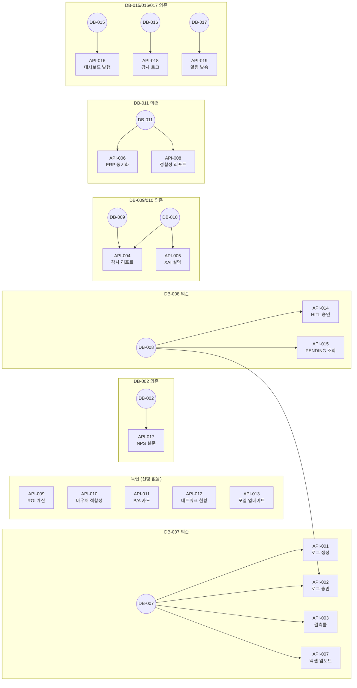

# FactoryAI — API 계약 정의 Issues (API-001 ~ API-019)

> **Source**: SRS-002 Rev 2.0 (V0.8) — §6.1 API Endpoint List  
> **작성일**: 2026-04-19  
> **총 Issue**: 19건  
> **프레임워크**: Next.js App Router (Route Handlers / Server Actions)  
> **인증**: NextAuth.js v5 + RBAC 5역할

> [!IMPORTANT]
> 본 문서는 **Request/Response DTO 타입 정의 + Zod 검증 스키마 + 에러 코드 계약**만 다룹니다.  
> 실제 비즈니스 로직 구현은 Step 2 (Command/Query) 태스크에서 수행합니다.

---

## API-001: `POST /api/v1/log-entries` DTO 정의

---
name: Feature Task
about: SRS 기반의 구체적인 개발 태스크 명세
title: "[API/E1] API-001: POST /api/v1/log-entries DTO 정의 — 패시브 로깅 엔트리 생성"
labels: 'feature, backend, api-contract, priority:must, epic:e1-passive-logging'
assignees: ''
---

### :dart: Summary
- **기능명**: [API-001] `POST /api/v1/log-entries` Request/Response DTO + 에러 코드 정의
- **목적**: STT/Vision/엑셀 파싱 결과를 LOG_ENTRY로 저장하는 API의 입출력 계약을 정의한다. E1 패시브 로깅의 핵심 엔드포인트로, 모든 수집 데이터가 이 API를 통해 시스템에 진입한다.

### :link: References (Spec & Context)
> :bulb: AI Agent & Dev Note: 작업 시작 전 아래 문서를 반드시 먼저 Read/Evaluate 할 것.
- SRS 문서: [`SRS_V_1.0.md#§6.1 API #1`](file:///c:/Antigravity_Workspace/SRS%20from%20PRD_RPA%20Saas/SRS-Drafts/18_SRS_V07.md) — POST /api/v1/log-entries
- 데이터 모델: §6.2.4 LOG_ENTRY 엔터티
- 요구사항: REQ-FUNC-001~008 (E1 패시브 로깅 전체)
- 시퀀스: §3.4.1 패시브 로깅 시퀀스

### :white_check_mark: Task Breakdown (실행 계획)
- [ ] **1.** `types/api/log-entries.ts` 생성 — Request/Response 타입 정의
- [ ] **2.** Request DTO (`CreateLogEntryRequest`):
  ```typescript
  {
    source_type: 'STT' | 'VISION' | 'EXCEL_BATCH';
    raw_data: Record<string, unknown>;  // 원본 데이터 JSON
    factory_id: string;                  // UUID
    line_id: string;                     // UUID (→ ProductionLine)
    work_order_id: string;               // UUID
    captured_at?: string;                // ISO 8601 (선택, 미제공 시 서버 시간)
  }
  ```
- [ ] **3.** Response DTO (`CreateLogEntryResponse`):
  ```typescript
  {
    id: string;                          // UUID
    status: 'PENDING';                   // 항상 PENDING으로 생성
    source_type: 'STT' | 'VISION' | 'EXCEL_BATCH';
    captured_at: string;                 // ISO 8601
    created_at: string;                  // ISO 8601
  }
  ```
- [ ] **4.** Zod 검증 스키마 (`schemas/log-entries.ts`):
  - `source_type` — enum 검증
  - `raw_data` — 비어있지 않은 오브젝트 검증
  - `factory_id`, `line_id`, `work_order_id` — UUID 포맷 검증
  - `captured_at` — ISO 8601 형식 (optional)
  - 파일 용량: raw_data JSON 크기 ≤10MB
- [ ] **5.** 에러 코드 정의:
  | HTTP Status | Error Code | 설명 |
  |:---:|:---|:---|
  | 400 | `INVALID_SOURCE_TYPE` | 미지원 source_type |
  | 400 | `INVALID_RAW_DATA` | raw_data 비어있음 또는 10MB 초과 |
  | 400 | `INVALID_UUID_FORMAT` | UUID 형식 오류 |
  | 401 | `UNAUTHORIZED` | 인증 없음 |
  | 403 | `FORBIDDEN_ROLE` | VIEWER 등 권한 부족 (OPERATOR 이상 필요) |
  | 404 | `FACTORY_NOT_FOUND` | factory_id 미존재 |
  | 404 | `WORK_ORDER_NOT_FOUND` | work_order_id 미존재 |
  | 202 | `QUEUED_FOR_PROCESSING` | Rate Limit 큐 대기 중 (AI 처리 시) |
  | 429 | `RATE_LIMIT_EXCEEDED` | Gemini 15 RPM 초과 |
  | 500 | `INTERNAL_ERROR` | 서버 내부 오류 |
- [ ] **6.** 공통 에러 응답 타입 (`types/api/error.ts`):
  ```typescript
  {
    error: {
      code: string;
      message: string;
      details?: Record<string, unknown>;
    };
    timestamp: string;
    request_id: string;
  }
  ```

### :test_tube: Acceptance Criteria (BDD/GWT)

**Scenario 1: 유효한 STT 로그 생성 요청**
- **Given**: `source_type=STT`, 유효한 `raw_data`, `factory_id`, `work_order_id`가 주어진다
- **When**: `POST /api/v1/log-entries`로 요청한다
- **Then**: 201 Created + `CreateLogEntryResponse` (status=PENDING) 반환

**Scenario 2: 잘못된 source_type**
- **Given**: `source_type=BLUETOOTH`가 주어진다
- **When**: 요청한다
- **Then**: 400 Bad Request + `INVALID_SOURCE_TYPE` 에러

**Scenario 3: VIEWER 역할 접근 차단**
- **Given**: 인증된 사용자의 역할이 VIEWER이다
- **When**: 요청한다
- **Then**: 403 Forbidden + `FORBIDDEN_ROLE` 에러

### :gear: Technical & Non-Functional Constraints
- **인증**: RBAC — OPERATOR 이상 접근 가능
- **Zod**: 런타임 타입 검증 필수 (서버 사이드)
- **성능**: DTO 검증 p95 ≤50ms
- **감사**: 생성 시 Prisma Middleware를 통한 AUDIT_LOG 자동 기록

### :checkered_flag: Definition of Done (DoD)
- [ ] TypeScript 타입 정의 파일 생성 완료
- [ ] Zod 스키마 구현 + 단위 테스트 통과
- [ ] 에러 코드 테이블 문서화
- [ ] 공통 에러 응답 타입 정의 (최초 1회)
- [ ] ESLint/TSConfig strict 경고 0건

### :construction: Dependencies & Blockers
- **Depends on**: `DB-007` (LOG_ENTRY 스키마)
- **Blocks**: `E1-CMD-001` (STT 로직), `E1-CMD-002` (Vision 로직), `MOCK-006` (Mock API)

---

## API-002: `PATCH /api/v1/log-entries/{id}/approve` DTO 정의

---
name: Feature Task
title: "[API/E1] API-002: PATCH /api/v1/log-entries/{id}/approve DTO 정의 — 로그 승인/거절"
labels: 'feature, backend, api-contract, priority:must, epic:e1-passive-logging'
---

### :dart: Summary
- **기능명**: [API-002] `PATCH /api/v1/log-entries/{id}/approve` DTO 정의
- **목적**: 관리자가 AI 파싱 결과(LOG_ENTRY)를 Approve/Reject하는 API 계약. HITL 프로토콜의 실행 엔드포인트.

### :link: References (Spec & Context)
- SRS: §6.1 API #2 — PATCH /api/v1/log-entries/{id}/approve
- 요구사항: REQ-FUNC-003 (Approve/Reject ≤1초 반영 + 감사 로그)

### :white_check_mark: Task Breakdown (실행 계획)
- [ ] **1.** Path Parameter: `id` — UUID (LOG_ENTRY ID)
- [ ] **2.** Request DTO (`ApproveLogEntryRequest`):
  ```typescript
  {
    approval_decision: 'APPROVED' | 'REJECTED';
    reviewer_id: string;       // UUID — 검토자
    comment?: string;           // 선택적 코멘트 (max 500자)
  }
  ```
- [ ] **3.** Response DTO (`ApproveLogEntryResponse`):
  ```typescript
  {
    id: string;
    status: 'APPROVED' | 'REJECTED';
    reviewer_id: string;
    reviewed_at: string;       // ISO 8601
    audit_log_id: string;      // UUID — 감사 로그 참조
  }
  ```
- [ ] **4.** Zod 스키마: `approval_decision` enum, `reviewer_id` UUID, `comment` max(500)
- [ ] **5.** 에러 코드:
  | HTTP Status | Error Code | 설명 |
  |:---:|:---|:---|
  | 400 | `INVALID_DECISION` | APPROVED/REJECTED 외 값 |
  | 404 | `LOG_ENTRY_NOT_FOUND` | 대상 로그 미존재 |
  | 409 | `ALREADY_REVIEWED` | 이미 승인/거절된 건 재처리 시도 |
  | 403 | `FORBIDDEN_ROLE` | OPERATOR/VIEWER 권한 — ADMIN 이상 필요 |

### :test_tube: Acceptance Criteria (BDD/GWT)

**Scenario 1: 정상 승인**
- **Given**: `status=PENDING`인 LOG_ENTRY가 존재
- **When**: `APPROVED` 결정으로 PATCH 요청
- **Then**: 200 OK + `status=APPROVED` + `audit_log_id` 반환

**Scenario 2: 이미 처리된 건 재시도**
- **Given**: `status=APPROVED`인 LOG_ENTRY
- **When**: 다시 PATCH 요청
- **Then**: 409 Conflict + `ALREADY_REVIEWED`

### :gear: Technical & Non-Functional Constraints
- **성능**: 반영 ≤1초 (REQ-FUNC-003)
- **인증**: ADMIN/AUDITOR 이상

### :checkered_flag: Definition of Done (DoD)
- [ ] 타입 정의 + Zod 스키마 + 에러 코드 완료
- [ ] 단위 테스트 통과
- [ ] ESLint 경고 0건

### :construction: Dependencies & Blockers
- **Depends on**: `DB-007` (LOG_ENTRY), `DB-008` (APPROVAL)
- **Blocks**: `E1-CMD-003` (승인 로직)

---

## API-003: `GET /api/v1/log-entries/missing-rate` DTO 정의

---
name: Feature Task
title: "[API/E1] API-003: GET /api/v1/log-entries/missing-rate DTO 정의 — 결측률 조회"
labels: 'feature, backend, api-contract, priority:must, epic:e1-passive-logging'
---

### :dart: Summary
- **기능명**: [API-003] `GET /api/v1/log-entries/missing-rate` DTO 정의
- **목적**: 일별 결측률 리포트 조회 API. 결측률 ≤5% 목표 달성(REQ-NF-043) 모니터링의 기반.

### :link: References (Spec & Context)
- SRS: §6.1 API #3, REQ-FUNC-004 (결측률 ≤5%)

### :white_check_mark: Task Breakdown (실행 계획)
- [ ] **1.** Query Parameters DTO (`MissingRateQuery`):
  ```typescript
  {
    factory_id: string;         // UUID (필수)
    start_date: string;         // ISO 8601 date
    end_date: string;           // ISO 8601 date
    line_id?: string;           // UUID (선택 — 라인별 필터)
  }
  ```
- [ ] **2.** Response DTO (`MissingRateResponse`):
  ```typescript
  {
    factory_id: string;
    period: { start: string; end: string };
    missing_rate: number;          // 0.0 ~ 100.0 (%)
    total_expected_entries: number;
    actual_entries: number;
    missing_entries: number;
    daily_breakdown: Array<{
      date: string;
      missing_rate: number;
      expected: number;
      actual: number;
    }>;
    target_rate: number;           // 5.0 (목표)
    is_target_met: boolean;
  }
  ```
- [ ] **3.** Zod 스키마: `factory_id` UUID, 날짜 범위 유효성 (start ≤ end, 최대 90일)
- [ ] **4.** 에러 코드:
  | HTTP Status | Error Code | 설명 |
  |:---:|:---|:---|
  | 400 | `INVALID_DATE_RANGE` | start > end 또는 90일 초과 |
  | 404 | `FACTORY_NOT_FOUND` | factory_id 미존재 |

### :test_tube: Acceptance Criteria (BDD/GWT)

**Scenario 1: 정상 결측률 조회**
- **Given**: 유효한 `factory_id`와 날짜 범위가 주어진다
- **When**: GET 요청
- **Then**: 200 OK + 결측률(%), 일별 breakdown 포함 응답

**Scenario 2: 잘못된 날짜 범위**
- **Given**: `start_date > end_date`
- **When**: GET 요청
- **Then**: 400 + `INVALID_DATE_RANGE`

### :gear: Technical & Non-Functional Constraints
- **인증**: RBAC — OPERATOR 이상
- **KPI**: 결측률 ≤5% 달성 여부 자동 판정 (`is_target_met`)

### :checkered_flag: Definition of Done (DoD)
- [ ] 타입 + Zod + 에러 코드 완료, 단위 테스트 통과

### :construction: Dependencies & Blockers
- **Depends on**: `DB-007`
- **Blocks**: `E1-QRY-001`, `E1-UI-004`, `NFR-MON-001`

---

## API-004: `POST /api/v1/audit-reports` DTO 정의

---
name: Feature Task
title: "[API/E2] API-004: POST /api/v1/audit-reports DTO 정의 — 감사 리포트 생성"
labels: 'feature, backend, api-contract, priority:must, epic:e2-audit-report'
---

### :dart: Summary
- **기능명**: [API-004] `POST /api/v1/audit-reports` DTO 정의
- **목적**: 원클릭 감사 리포트 생성 요청 API. Lot 병합 + 규제 포맷 PDF 생성을 트리거한다.

### :link: References (Spec & Context)
- SRS: §6.1 API #4, REQ-FUNC-009~013

### :white_check_mark: Task Breakdown (실행 계획)
- [ ] **1.** Request DTO (`CreateAuditReportRequest`):
  ```typescript
  {
    factory_id: string;                             // UUID
    lot_ids: string[];                              // UUID[] (최소 1건)
    regulation_type: 'SAMSUNG_QA' | 'HYUNDAI' | 'CBAM' | 'HACCP';
    date_range: { start: string; end: string };     // ISO 8601
    include_xai: boolean;                           // XAI 설명 포함 여부 (기본 true)
  }
  ```
- [ ] **2.** Response DTO (`CreateAuditReportResponse`):
  ```typescript
  {
    report_id: string;         // UUID
    status: 'PENDING';         // HITL 승인 대기
    lot_count: number;
    regulation_type: string;
    created_at: string;
    estimated_completion_ms?: number;   // 예상 소요 시간
  }
  ```
- [ ] **3.** Zod 스키마: `lot_ids` 최소 1개, `regulation_type` enum, 날짜 범위 유효
- [ ] **4.** 에러 코드:
  | HTTP Status | Error Code | 설명 |
  |:---:|:---|:---|
  | 400 | `EMPTY_LOT_IDS` | lot_ids 비어있음 |
  | 400 | `UNSUPPORTED_REGULATION` | 미지원 규제 포맷 |
  | 404 | `LOT_NOT_FOUND` | lot_id 미존재 |
  | 409 | `UNAPPROVED_LOGS_EXIST` | Lot 내 PENDING 로그 존재 — 승인 필요 |
  | 422 | `MISSING_DATA_DETECTED` | 필수 데이터 결측 (결측치 목록 포함) |
  | 422 | `TIMESTAMP_CONFLICT` | Lot 타임스탬프 중복/역전 감지 |

### :test_tube: Acceptance Criteria (BDD/GWT)

**Scenario 1: 정상 리포트 생성 요청**
- **Given**: 유효한 Lot IDs, 모든 로그 APPROVED 상태
- **When**: POST 요청
- **Then**: 201 Created + `status=PENDING` (HITL 승인 대기)

**Scenario 2: 미승인 로그 포함 Lot**
- **Given**: Lot 내 PENDING 상태 로그 존재
- **When**: POST 요청
- **Then**: 409 Conflict + `UNAPPROVED_LOGS_EXIST` + 미승인 건 목록

**Scenario 3: 미지원 규제 포맷**
- **Given**: `regulation_type=ISO_9001` (미지원)
- **When**: POST 요청
- **Then**: 400 + `UNSUPPORTED_REGULATION` + 대체 포맷 제안 (REQ-FUNC-012)

### :gear: Technical & Non-Functional Constraints
- **인증**: ADMIN/AUDITOR 이상
- **HITL**: 생성 시 항상 PENDING → 품질이사 승인 후 최종 발행
- **Lot 정확도**: ≥99% (REQ-FUNC-009)

### :checkered_flag: Definition of Done (DoD)
- [ ] 타입 + Zod + 에러 코드 완료, 단위 테스트 통과

### :construction: Dependencies & Blockers
- **Depends on**: `DB-010` (AUDIT_REPORT), `DB-009` (LOT)
- **Blocks**: `E2-CMD-001`, `E2-CMD-002`, `MOCK-008`

---

## API-005: `GET /api/v1/xai/explanations/{id}` DTO 정의

---
name: Feature Task
title: "[API/E2-B] API-005: GET /api/v1/xai/explanations/{id} DTO 정의 — XAI 설명 조회"
labels: 'feature, backend, api-contract, priority:must, epic:e2b-xai'
---

### :dart: Summary
- **기능명**: [API-005] `GET /api/v1/xai/explanations/{id}` DTO 정의
- **목적**: AI 이상탐지 결과에 대한 한국어 XAI 설명과 데이터 하이라이팅 정보를 조회한다.

### :link: References (Spec & Context)
- SRS: §6.1 API #5, REQ-FUNC-014~018

### :white_check_mark: Task Breakdown (실행 계획)
- [ ] **1.** Path Parameter: `id` — UUID (AUDIT_REPORT ID 또는 XAI 설명 ID)
- [ ] **2.** Response DTO (`XaiExplanationResponse`):
  ```typescript
  {
    id: string;
    explanation_text: string;       // 한국어 설명
    data_highlights: Array<{
      field: string;
      value: unknown;
      anomaly_type: 'HIGH' | 'LOW' | 'MISSING' | 'PATTERN';
      description: string;
    }>;
    confidence: number;             // 0.0~1.0
    model_version: string;
    generated_at: string;
  }
  ```
- [ ] **3.** 에러 코드:
  | HTTP Status | Error Code | 설명 |
  |:---:|:---|:---|
  | 404 | `EXPLANATION_NOT_FOUND` | 설명 미존재 |
  | 503 | `XAI_SERVICE_UNAVAILABLE` | XAI 모듈 장애 (수동 판단 모드) |

### :test_tube: Acceptance Criteria (BDD/GWT)

**Scenario 1: 정상 XAI 설명 조회**
- **Given**: 유효한 explanation ID
- **When**: GET 요청
- **Then**: 200 OK + 한국어 설명 + 데이터 하이라이팅 반환

**Scenario 2: XAI 서비스 장애**
- **Given**: XAI 모듈 헬스체크 실패 상태
- **When**: GET 요청
- **Then**: 503 + `XAI_SERVICE_UNAVAILABLE`

### :gear: Technical & Non-Functional Constraints
- **인증**: ADMIN/AUDITOR/OPERATOR
- **XAI 이해도**: ≥4.0/5.0 (REQ-FUNC-014)

### :checkered_flag: Definition of Done (DoD)
- [ ] 타입 + 에러 코드 완료, 단위 테스트 통과

### :construction: Dependencies & Blockers
- **Depends on**: `DB-010`
- **Blocks**: `E2B-CMD-001`, `E2B-QRY-001`

---

## API-006: `POST /api/v1/erp/sync` DTO 정의

---
name: Feature Task
title: "[API/E3] API-006: POST /api/v1/erp/sync DTO 정의 — ERP 동기화 실행"
labels: 'feature, backend, api-contract, priority:must, epic:e3-erp-bridge'
---

### :dart: Summary
- **기능명**: [API-006] `POST /api/v1/erp/sync` DTO 정의
- **목적**: ERP Read-Only 동기화를 트리거하는 API. 합의 테이블만 읽어오며 Write는 시스템 레벨 차단.

### :link: References (Spec & Context)
- SRS: §6.1 API #6, REQ-FUNC-019~023, ADR-2 (비파괴형 브릿지)

### :white_check_mark: Task Breakdown (실행 계획)
- [ ] **1.** Request DTO (`SyncErpRequest`):
  ```typescript
  {
    connection_id: string;      // UUID — ERP_CONNECTION ID
    table_names: string[];      // 동기화 대상 테이블 (approved_tables 내)
    period?: {
      start: string;
      end: string;
    };
  }
  ```
- [ ] **2.** Response DTO (`SyncErpResponse`):
  ```typescript
  {
    sync_id: string;
    sync_status: 'SYNCED' | 'SYNCING' | 'ERROR' | 'SCHEMA_CHANGED';
    records_count: number;
    synced_tables: string[];
    errors: Array<{
      table: string;
      error_code: string;
      message: string;
    }>;
    started_at: string;
    completed_at?: string;
    duration_ms?: number;
  }
  ```
- [ ] **3.** 에러 코드:
  | HTTP Status | Error Code | 설명 |
  |:---:|:---|:---|
  | 400 | `UNAPPROVED_TABLE` | approved_tables에 없는 테이블 요청 |
  | 403 | `WRITE_OPERATION_BLOCKED` | Write 시도 감지 → 즉시 차단 + CISO 알림 |
  | 404 | `CONNECTION_NOT_FOUND` | ERP 연결 정보 미존재 |
  | 409 | `SYNC_IN_PROGRESS` | 동기화 이미 진행 중 |
  | 409 | `SCHEMA_CHANGED` | 스키마 변경 감지 → 동기화 중단 |

### :test_tube: Acceptance Criteria (BDD/GWT)

**Scenario 1: 정상 동기화**
- **Given**: 유효한 `connection_id`, approved_tables 내 테이블
- **When**: POST 요청
- **Then**: 200 OK + `sync_status=SYNCED` + 레코드 수

**Scenario 2: 미승인 테이블 접근**
- **Given**: `approved_tables`에 없는 테이블명
- **When**: POST 요청
- **Then**: 400 + `UNAPPROVED_TABLE`

**Scenario 3: 스키마 변경 감지**
- **Given**: ERP 스키마가 변경됨
- **When**: 동기화 실행
- **Then**: 409 + `SCHEMA_CHANGED` + CIO 알림 ≤1분

### :gear: Technical & Non-Functional Constraints
- **인증**: ADMIN 이상
- **Write 차단**: 3중 차단 (TS Interface + Prisma Middleware + DB RLS)
- **MVP**: Mock ERP 테이블 직접 조회

### :checkered_flag: Definition of Done (DoD)
- [ ] 타입 + Zod + 에러 코드 완료, 단위 테스트 통과

### :construction: Dependencies & Blockers
- **Depends on**: `DB-011`
- **Blocks**: `E3-CMD-001`, `MOCK-010`

---

## API-007: `POST /api/v1/erp/excel-import` DTO 정의

---
name: Feature Task
title: "[API/E3] API-007: POST /api/v1/erp/excel-import DTO 정의 — 엑셀 업로드 파싱"
labels: 'feature, backend, api-contract, priority:must, epic:e3-erp-bridge'
---

### :dart: Summary
- **기능명**: [API-007] `POST /api/v1/erp/excel-import` DTO 정의
- **목적**: 극보안 환경용 엑셀 드래그&드롭 업로드 → 자동 파싱·적재 API 계약.

### :link: References (Spec & Context)
- SRS: §6.1 API #7, REQ-FUNC-020 (파싱 ≥95%), REQ-FUNC-023 (50MB 초과 거부)

### :white_check_mark: Task Breakdown (실행 계획)
- [ ] **1.** Request: `multipart/form-data`
  ```typescript
  {
    file: File;                // .xlsx 또는 .csv (≤50MB)
    factory_id: string;        // UUID
    mapping_template?: string; // 컬럼 매핑 템플릿 ID (선택)
  }
  ```
- [ ] **2.** Response DTO (`ExcelImportResponse`):
  ```typescript
  {
    import_id: string;
    factory_id: string;
    file_name: string;
    file_size_bytes: number;
    parsed_records: number;
    failed_records: number;
    errors: Array<{
      row: number;
      column: string;
      error: string;
    }>;
    status: 'SUCCESS' | 'PARTIAL' | 'FAILED';
    processing_time_ms: number;
  }
  ```
- [ ] **3.** 에러 코드:
  | HTTP Status | Error Code | 설명 |
  |:---:|:---|:---|
  | 400 | `FILE_TOO_LARGE` | 50MB 초과 |
  | 400 | `UNSUPPORTED_FORMAT` | .xlsx/.csv 외 포맷 |
  | 400 | `INVALID_ENCODING` | 비표준 인코딩 |
  | 422 | `PARSE_FAILED` | 전체 파싱 실패 (0건 성공) |

### :test_tube: Acceptance Criteria (BDD/GWT)

**Scenario 1: 정상 엑셀 업로드**
- **Given**: 50MB 이하 .xlsx 파일
- **When**: POST multipart 요청
- **Then**: 201 + 파싱 결과 (성공률 ≥95%)

**Scenario 2: 50MB 초과**
- **Given**: 60MB 파일
- **When**: 업로드 시도
- **Then**: 400 + `FILE_TOO_LARGE` (≤3초 응답, REQ-FUNC-023)

### :gear: Technical & Non-Functional Constraints
- **처리 시간**: ≤30초/파일 (REQ-FUNC-020)
- **인증**: OPERATOR 이상

### :checkered_flag: Definition of Done (DoD)
- [ ] 타입 + Zod + 에러 코드 완료, 단위 테스트 통과

### :construction: Dependencies & Blockers
- **Depends on**: `DB-007`
- **Blocks**: `E3-CMD-002`, `E3-CMD-003`

---

## API-008: `GET /api/v1/erp/consistency-report` DTO 정의

---
name: Feature Task
title: "[API/E3] API-008: GET /api/v1/erp/consistency-report DTO 정의 — 정합성 리포트"
labels: 'feature, backend, api-contract, priority:must, epic:e3-erp-bridge'
---

### :dart: Summary
- **기능명**: [API-008] `GET /api/v1/erp/consistency-report` DTO 정의
- **목적**: ERP 데이터와 FactoryAI 로그 간 불일치율 리포트 조회. 목표 ≤2% (REQ-FUNC-021).

### :link: References (Spec & Context)
- SRS: §6.1 API #8, REQ-FUNC-021

### :white_check_mark: Task Breakdown (실행 계획)
- [ ] **1.** Query Parameters: `factory_id` (UUID), `period` (optional date range)
- [ ] **2.** Response DTO (`ConsistencyReportResponse`):
  ```typescript
  {
    factory_id: string;
    inconsistency_rate: number;    // 0.0~100.0 (%)
    target_rate: number;           // 2.0
    is_target_met: boolean;
    total_records: number;
    inconsistent_records: number;
    details: Array<{
      table: string;
      field: string;
      erp_value: unknown;
      factory_value: unknown;
      record_id: string;
    }>;
    generated_at: string;
  }
  ```
- [ ] **3.** 에러 코드: `FACTORY_NOT_FOUND`, `NO_SYNC_DATA`

### :test_tube: Acceptance Criteria (BDD/GWT)

**Scenario 1: 정상 조회** → 200 OK + 불일치율(%) + 상세 목록

### :gear: Technical & Non-Functional Constraints
- **인증**: ADMIN/AUDITOR, **목표**: 불일치율 ≤2%

### :construction: Dependencies & Blockers
- **Depends on**: `DB-011` → **Blocks**: `E3-QRY-001`

---

## API-009: `POST /api/v1/roi/calculate` DTO 정의

---
name: Feature Task
title: "[API/E4] API-009: POST /api/v1/roi/calculate DTO 정의 — ROI 계산"
labels: 'feature, backend, api-contract, priority:should, epic:e4-roi'
---

### :dart: Summary
- **기능명**: [API-009] `POST /api/v1/roi/calculate` DTO 정의
- **목적**: CFO용 ROI 계산 — 기업 규모 입력 → 바우처 매칭 + 자부담 + 회수액 + Payback 시뮬레이션.

### :link: References (Spec & Context)
- SRS: §6.1 API #9, REQ-FUNC-024~028

### :white_check_mark: Task Breakdown (실행 계획)
- [ ] **1.** Request DTO (`CalculateRoiRequest`):
  ```typescript
  {
    industry: 'METAL_PROCESSING' | 'FOOD_MANUFACTURING';
    employee_count: number;       // 양수 필수
    annual_revenue: number;       // 양수 필수 (원)
    erp_type: 'DOUZONE_ICUBE' | 'DOUZONE_SMARTA' | 'YOUNGRIMWON_KSYSTEM' | 'NONE';
    production_lines: number;     // 생산라인 수
  }
  ```
- [ ] **2.** Response DTO (`CalculateRoiResponse`):
  ```typescript
  {
    voucher_match: {
      eligible: boolean;
      voucher_type: string;
      total_budget: number;
      government_support: number;
    };
    self_pay: number;              // 자부담액
    payback_months: number;        // 회수 기간 (월)
    roi_percentage: number;        // ROI (%)
    annual_savings: number;        // 연간 절감액
    breakdown: {
      labor_savings: number;
      quality_savings: number;
      audit_savings: number;
    };
  }
  ```
- [ ] **3.** 에러 코드:
  | HTTP Status | Error Code | 설명 |
  |:---:|:---|:---|
  | 400 | `INVALID_INDUSTRY` | 미지원 업종 |
  | 400 | `UNREALISTIC_VALUE` | 매출 0원 / 직원 0명 (REQ-FUNC-028) |
  | 400 | `MISSING_REQUIRED_FIELD` | 필수 항목 누락 (REQ-FUNC-027) |

### :test_tube: Acceptance Criteria (BDD/GWT)

**Scenario 1: 정상 ROI 계산** → 200 OK + 계산 결과 (≤3초, 정확도 ≥90%)

**Scenario 2: 비현실적 수치** → 400 + `UNREALISTIC_VALUE` + 경고 메시지

### :gear: Technical & Non-Functional Constraints
- **인증**: RBAC 전 역할 가능 (CFO 대상이나 접근 제한 완화)
- **성능**: ≤3초 응답

### :construction: Dependencies & Blockers
- **Depends on**: None (독립 모듈)
- **Blocks**: `E4-CMD-001`, `MOCK-009`

---

## API-010: `POST /api/v1/roi/voucher-fit` DTO 정의

---
name: Feature Task
title: "[API/E4] API-010: POST /api/v1/roi/voucher-fit DTO 정의 — 바우처 적합성 진단"
labels: 'feature, backend, api-contract, priority:should, epic:e4-roi'
---

### :dart: Summary
- **기능명**: [API-010] `POST /api/v1/roi/voucher-fit` DTO 정의
- **목적**: 5항목 적합성 진단 → 성공 확률(%) + 항목별 리스크 등급 반환.

### :link: References (Spec & Context)
- SRS: §6.1 API #10, REQ-FUNC-025

### :white_check_mark: Task Breakdown (실행 계획)
- [ ] **1.** Request DTO:
  ```typescript
  {
    industry: 'METAL_PROCESSING' | 'FOOD_MANUFACTURING';
    employee_count: number;
    erp_type: string;
    voucher_history: boolean;    // 기존 바우처 수혜 이력
    security_level: 'HIGH' | 'MEDIUM' | 'LOW';
  }
  ```
- [ ] **2.** Response DTO:
  ```typescript
  {
    fit_probability: number;      // 0~100 (%)
    risk_grades: Array<{
      item: string;
      grade: 'HIGH' | 'MID' | 'LOW';
      recommendation: string;
    }>;
    overall_grade: 'HIGH' | 'MID' | 'LOW';
  }
  ```
- [ ] **3.** 에러 코드: `MISSING_REQUIRED_FIELD` (5항목 중 누락)

### :test_tube: Acceptance Criteria (BDD/GWT)

**Scenario 1**: 5항목 입력 → 200 OK + 확률(%) + 리스크 등급 (≤5초)

### :construction: Dependencies & Blockers
- **Depends on**: None → **Blocks**: `E4-CMD-002`

---

## API-011: `POST /api/v1/roi/ba-card` DTO 정의

---
name: Feature Task
title: "[API/E4] API-011: POST /api/v1/roi/ba-card DTO 정의 — Before-After 카드 생성"
labels: 'feature, backend, api-contract, priority:should, epic:e4-roi'
---

### :dart: Summary
- **기능명**: [API-011] `POST /api/v1/roi/ba-card` DTO 정의
- **목적**: 동종 업종 벤치마크 기반 Before-After 비교 카드 생성.

### :link: References (Spec & Context)
- SRS: §6.1 API #11, REQ-FUNC-026

### :white_check_mark: Task Breakdown (실행 계획)
- [ ] **1.** Request: `{ industry: string; reference_data?: object; }`
- [ ] **2.** Response:
  ```typescript
  {
    ba_card: {
      before: { metric: string; value: number; unit: string }[];
      after:  { metric: string; value: number; unit: string }[];
      improvement_rates: { metric: string; rate: number }[];
    };
    source: string;          // 벤치마크 출처
    generated_at: string;
  }
  ```
- [ ] **3.** 에러 코드: `INVALID_INDUSTRY`, `NO_BENCHMARK_DATA`

### :test_tube: Acceptance Criteria (BDD/GWT)
**Scenario 1**: 유효 업종 → 200 OK + B/A 카드 (≤10초)

### :construction: Dependencies & Blockers
- **Depends on**: None → **Blocks**: `E4-CMD-003`

---

## API-012: `GET /api/v1/security/network-status` DTO 정의

---
name: Feature Task
title: "[API/E6] API-012: GET /api/v1/security/network-status DTO 정의 — 네트워크 모니터링"
labels: 'feature, backend, api-contract, priority:must, epic:e6-security'
---

### :dart: Summary
- **기능명**: [API-012] `GET /api/v1/security/network-status` DTO 정의
- **목적**: 외부 트래픽 0 byte 검증용 네트워크 상태 조회. CISO 보안 콘솔(CLI-03) 데이터 소스.

### :link: References (Spec & Context)
- SRS: §6.1 API #12, REQ-FUNC-029

### :white_check_mark: Task Breakdown (실행 계획)
- [ ] **1.** Query: `factory_id` (UUID), `period` (optional: 24h default)
- [ ] **2.** Response:
  ```typescript
  {
    factory_id: string;
    period: { start: string; end: string };
    external_traffic_bytes: number;  // MVP: 참고용 메트릭
    external_api_calls: number;
    status: 'SECURE' | 'WARNING' | 'BREACH';
    last_checked_at: string;
  }
  ```
- [ ] **3.** 에러 코드: `FACTORY_NOT_FOUND`

### :test_tube: Acceptance Criteria (BDD/GWT)
**Scenario 1**: 정상 조회 → 200 OK + 트래픽 바이트 수 + 상태

### :gear: Technical & Non-Functional Constraints
- **인증**: CISO 역할 전용

### :construction: Dependencies & Blockers
- **Depends on**: None → **Blocks**: `E6-QRY-002`

---

## API-013: `POST /api/v1/models/update` DTO 정의

---
name: Feature Task
title: "[API/E6] API-013: POST /api/v1/models/update DTO 정의 — 모델 업데이트"
labels: 'feature, backend, api-contract, priority:must, epic:e6-security'
---

### :dart: Summary
- **기능명**: [API-013] `POST /api/v1/models/update` DTO 정의
- **목적**: [PROD] USB/내부망 모델 업데이트. [MVP] Git Push CI/CD. 무결성 해시 검증.

### :link: References (Spec & Context)
- SRS: §6.1 API #13, REQ-FUNC-030, REQ-FUNC-033

### :white_check_mark: Task Breakdown (실행 계획)
- [ ] **1.** Request:
  ```typescript
  {
    package_file: string;     // 파일 경로 또는 Base64
    hash: string;             // SHA-256 해시
    version: string;          // Semantic Version
    release_notes?: string;
  }
  ```
- [ ] **2.** Response:
  ```typescript
  {
    update_status: 'SUCCESS' | 'FAILED' | 'HASH_MISMATCH';
    hash_verified: boolean;
    previous_version: string;
    new_version: string;
    audit_log_id: string;
    applied_at: string;
  }
  ```
- [ ] **3.** 에러 코드:
  | HTTP Status | Error Code | 설명 |
  |:---:|:---|:---|
  | 400 | `HASH_MISMATCH` | 해시 불일치 → 설치 거부 + CISO 알림 ≤10초 |
  | 400 | `INVALID_VERSION` | 버전 포맷 오류 |
  | 403 | `ADMIN_ONLY` | ADMIN 역할 필수 |

### :test_tube: Acceptance Criteria (BDD/GWT)
**Scenario 1**: 해시 일치 → 200 + 모델 교체 성공
**Scenario 2**: 해시 불일치 → 400 + `HASH_MISMATCH` + CISO 알림

### :construction: Dependencies & Blockers
- **Depends on**: None → **Blocks**: (PROD Phase 2)

---

## API-014: `PATCH /api/v1/approvals/{id}` DTO 정의

---
name: Feature Task
title: "[API/HITL] API-014: PATCH /api/v1/approvals/{id} DTO 정의 — HITL 승인/거절"
labels: 'feature, backend, api-contract, priority:must, epic:hitl-safety-protocol'
---

### :dart: Summary
- **기능명**: [API-014] `PATCH /api/v1/approvals/{id}` DTO 정의
- **목적**: HITL 승인 프로세스의 핵심 엔드포인트. AI 결과물에 대한 인간 결정(APPROVED/REJECTED)을 기록한다.

### :link: References (Spec & Context)
- SRS: §6.1 API #14, REQ-FUNC-040~045

### :white_check_mark: Task Breakdown (실행 계획)
- [ ] **1.** Path Parameter: `id` — UUID (APPROVAL ID)
- [ ] **2.** Request DTO (`UpdateApprovalRequest`):
  ```typescript
  {
    decision: 'APPROVED' | 'REJECTED';
    reviewer_id: string;        // UUID
    comment?: string;            // 최대 1000자
  }
  ```
- [ ] **3.** Response DTO (`UpdateApprovalResponse`):
  ```typescript
  {
    id: string;
    status: 'APPROVED' | 'REJECTED';
    reviewer_id: string;
    decision_at: string;
    audit_log_id: string;
    related_entity: {
      type: 'LOG_ENTRY' | 'AUDIT_REPORT';
      id: string;
    };
  }
  ```
- [ ] **4.** 에러 코드:
  | HTTP Status | Error Code | 설명 |
  |:---:|:---|:---|
  | 404 | `APPROVAL_NOT_FOUND` | 승인 건 미존재 |
  | 409 | `ALREADY_DECIDED` | 이미 결정 완료 |
  | 403 | `INSUFFICIENT_ROLE` | 결정 권한 부족 |

### :test_tube: Acceptance Criteria (BDD/GWT)
**Scenario 1**: PENDING → APPROVED → 200 OK + 감사 로그
**Scenario 2**: 이미 APPROVED → 409 + `ALREADY_DECIDED`

### :construction: Dependencies & Blockers
- **Depends on**: `DB-008` → **Blocks**: `HITL-CMD-001`, `MOCK-007`

---

## API-015: `GET /api/v1/approvals/pending` DTO 정의

---
name: Feature Task
title: "[API/HITL] API-015: GET /api/v1/approvals/pending DTO 정의 — PENDING 건 조회"
labels: 'feature, backend, api-contract, priority:must, epic:hitl-safety-protocol'
---

### :dart: Summary
- **기능명**: [API-015] `GET /api/v1/approvals/pending` DTO 정의
- **목적**: PENDING 승인 건 목록 조회 + 에스컬레이션 상태 확인. 30분 미처리 자동 에스컬레이션(REQ-FUNC-044) 모니터링.

### :link: References (Spec & Context)
- SRS: §6.1 API #15, REQ-FUNC-044

### :white_check_mark: Task Breakdown (실행 계획)
- [ ] **1.** Query Parameters: `factory_id` (UUID), `age_minutes` (optional, 30분 이상 필터)
- [ ] **2.** Response DTO:
  ```typescript
  {
    pending_items: Array<{
      approval_id: string;
      entity_type: 'LOG_ENTRY' | 'AUDIT_REPORT';
      entity_id: string;
      created_at: string;
      age_minutes: number;
      escalated: boolean;
      escalated_at?: string;
      assigned_reviewer?: string;
    }>;
    total_count: number;
    escalated_count: number;
    escalation_threshold_minutes: number;  // 30
  }
  ```
- [ ] **3.** 에러 코드: `FACTORY_NOT_FOUND`

### :test_tube: Acceptance Criteria (BDD/GWT)
**Scenario 1**: PENDING 건 존재 → 200 OK + age_minutes 포함 목록
**Scenario 2**: 30분 초과 → `escalated=true` 표시

### :construction: Dependencies & Blockers
- **Depends on**: `DB-008` → **Blocks**: `HITL-CMD-004`, `HITL-QRY-001`

---

## API-016: `POST /api/v1/dashboards/publish` DTO 정의

---
name: Feature Task
title: "[API/E7] API-016: POST /api/v1/dashboards/publish DTO 정의 — 대시보드 발행"
labels: 'feature, backend, api-contract, priority:should, epic:e7-dashboard'
---

### :dart: Summary
- **기능명**: [API-016] `POST /api/v1/dashboards/publish` DTO 정의
- **목적**: 4인 페르소나별 맞춤 월간 성과 대시보드 발행 트리거.

### :link: References (Spec & Context)
- SRS: §6.1 API #16, REQ-FUNC-035~039

### :white_check_mark: Task Breakdown (실행 계획)
- [ ] **1.** Request DTO:
  ```typescript
  {
    factory_id: string;
    period: string;             // YYYY-MM
    persona_type: 'COO' | 'BUYER' | 'QM' | 'CFO';
  }
  ```
- [ ] **2.** Response DTO:
  ```typescript
  {
    dashboard_id: string;
    factory_id: string;
    period: string;
    persona_type: string;
    status: 'PUBLISHED' | 'PENDING' | 'INSUFFICIENT_DATA';
    render_time_ms: number;
    metrics: {
      log_entries_count: number;
      missing_rate: number;
      audit_reports_count: number;
      cumulative_savings?: number;
    };
    published_at: string;
  }
  ```
- [ ] **3.** 에러 코드:
  | HTTP Status | Error Code | 설명 |
  |:---:|:---|:---|
  | 400 | `INVALID_PERIOD` | 기간 형식 오류 |
  | 400 | `INVALID_PERSONA` | 미지원 페르소나 유형 |
  | 422 | `INSUFFICIENT_DATA` | 로깅 <100건 (REQ-FUNC-038) |
  | 504 | `RENDER_TIMEOUT` | 렌더링 5초 초과 (재시도 안내) |

### :test_tube: Acceptance Criteria (BDD/GWT)
**Scenario 1**: 데이터 ≥100건 → 201 + 대시보드 발행 (렌더링 ≤5초)
**Scenario 2**: 데이터 <100건 → 422 + `INSUFFICIENT_DATA` + COO 알림

### :construction: Dependencies & Blockers
- **Depends on**: `DB-015` → **Blocks**: `E7-CMD-001`

---

## API-017: `POST /api/v1/nps/survey` DTO 정의

---
name: Feature Task
title: "[API/E7] API-017: POST /api/v1/nps/survey DTO 정의 — NPS 설문 발송"
labels: 'feature, backend, api-contract, priority:should, epic:e7-dashboard'
---

### :dart: Summary
- **기능명**: [API-017] `POST /api/v1/nps/survey` DTO 정의
- **목적**: NPS 9~10점 감지 시 1클릭 NPS + 레퍼런스 동의 수집 발송.

### :link: References (Spec & Context)
- SRS: §6.1 API #17, REQ-FUNC-037

### :white_check_mark: Task Breakdown (실행 계획)
- [ ] **1.** Request: `{ factory_id: string; target_users: string[]; }`
- [ ] **2.** Response:
  ```typescript
  {
    survey_id: string;
    factory_id: string;
    sent_count: number;
    total_targets: number;
    failed_targets: string[];
    created_at: string;
  }
  ```
- [ ] **3.** 에러 코드: `FACTORY_NOT_FOUND`, `EMPTY_TARGET_LIST`

### :test_tube: Acceptance Criteria (BDD/GWT)
**Scenario 1**: 유효한 사용자 목록 → 201 + 발송 건수

### :construction: Dependencies & Blockers
- **Depends on**: `DB-002` → **Blocks**: `E7-CMD-004`

---

## API-018: `GET /api/v1/audit-logs` DTO 정의

---
name: Feature Task
title: "[API/E6] API-018: GET /api/v1/audit-logs DTO 정의 — 감사 로그 조회"
labels: 'feature, backend, api-contract, priority:must, epic:e6-security'
---

### :dart: Summary
- **기능명**: [API-018] `GET /api/v1/audit-logs` DTO 정의
- **목적**: 전 접근 전수 기록 감사 로그 조회. CISO 보안 콘솔 핵심 데이터.

### :link: References (Spec & Context)
- SRS: §6.1 API #18, REQ-FUNC-032, REQ-FUNC-034

### :white_check_mark: Task Breakdown (실행 계획)
- [ ] **1.** Query Parameters:
  ```typescript
  {
    factory_id: string;
    start_date: string;
    end_date: string;
    event_type?: string;        // LOGIN_FAILED, PUBLICATION_BLOCKED 등
    user_id?: string;
    severity?: 'INFO' | 'WARNING' | 'CRITICAL';
    page?: number;              // 페이지네이션
    page_size?: number;         // 기본 50, 최대 200
  }
  ```
- [ ] **2.** Response DTO:
  ```typescript
  {
    logs: Array<{
      id: string;
      timestamp: string;
      user_id: string | null;
      user_role: string | null;
      action: string;
      entity_type: string;
      entity_id: string;
      event_type: string | null;
      severity: string;
      ip_address: string | null;
      changes: object | null;
    }>;
    total_count: number;
    page: number;
    page_size: number;
    has_next: boolean;
  }
  ```
- [ ] **3.** 에러 코드: `INVALID_DATE_RANGE`, `FACTORY_NOT_FOUND`

### :test_tube: Acceptance Criteria (BDD/GWT)
**Scenario 1**: 유효 조건 → 200 OK + 페이지네이션된 로그 목록
**Scenario 2**: 이벤트 유형 필터 → 해당 유형만 반환

### :gear: Technical & Non-Functional Constraints
- **인증**: CISO/ADMIN 역할 전용
- **페이지네이션**: 커서 또는 오프셋 기반 (최대 200건/페이지)

### :construction: Dependencies & Blockers
- **Depends on**: `DB-016` → **Blocks**: `E6-QRY-001`, `E6-UI-001`

---

## API-019: `POST /api/v1/notifications` DTO 정의

---
name: Feature Task
title: "[API/Foundation] API-019: POST /api/v1/notifications DTO 정의 — 알림 발송"
labels: 'feature, backend, api-contract, priority:must, epic:foundation'
---

### :dart: Summary
- **기능명**: [API-019] `POST /api/v1/notifications` DTO 정의
- **목적**: 시스템 내부 알림 발송 API. 결측률/보안/이상 감지/에스컬레이션 등 모든 알림이 이 API를 통해 생성된다. 인증은 System 레벨(내부 호출).

### :link: References (Spec & Context)
- SRS: §6.1 API #19, REQ-NF-029~031

### :white_check_mark: Task Breakdown (실행 계획)
- [ ] **1.** Request DTO (`CreateNotificationRequest`):
  ```typescript
  {
    type: 'MISSING_RATE_ALERT' | 'SECURITY_EVENT' | 'ANOMALY_DETECTED'
        | 'ESCALATION' | 'SCHEMA_CHANGED' | 'SENSOR_DISCONNECTED'
        | 'DISK_WARNING' | 'GENERAL';
    target_role: 'ADMIN' | 'OPERATOR' | 'AUDITOR' | 'VIEWER' | 'CISO';
    target_user_id?: string;     // 특정 사용자 지정 (선택)
    message: string;             // 알림 메시지 (max 500자)
    severity: 'INFO' | 'WARNING' | 'CRITICAL';
    factory_id?: string;         // 공장 컨텍스트 (선택)
    metadata?: Record<string, unknown>;  // 추가 데이터
  }
  ```
- [ ] **2.** Response DTO (`CreateNotificationResponse`):
  ```typescript
  {
    notification_id: string;
    type: string;
    target_role: string;
    severity: string;
    sent_at: string;
    recipients_count: number;
  }
  ```
- [ ] **3.** 에러 코드:
  | HTTP Status | Error Code | 설명 |
  |:---:|:---|:---|
  | 400 | `INVALID_TYPE` | 미지원 알림 유형 |
  | 400 | `INVALID_SEVERITY` | 미지원 심각도 |
  | 400 | `MESSAGE_TOO_LONG` | 500자 초과 |
  | 404 | `TARGET_USER_NOT_FOUND` | target_user_id 미존재 |

### :test_tube: Acceptance Criteria (BDD/GWT)

**Scenario 1: 역할 기반 알림 발송**
- **Given**: `type=SECURITY_EVENT`, `target_role=CISO`, `severity=CRITICAL`
- **When**: POST 요청
- **Then**: 201 + CISO 역할 전원에게 알림 생성 + `sent_at` 기록

**Scenario 2: 특정 사용자 알림**
- **Given**: `target_user_id` 지정
- **When**: POST 요청
- **Then**: 해당 사용자 1인에게만 알림

### :gear: Technical & Non-Functional Constraints
- **인증**: System 레벨 (서버 내부 호출 전용, Bearer 토큰 미필요)
- **SLA**: 알림 생성 → 수신 가능 ≤30초 (REQ-NF-029)

### :checkered_flag: Definition of Done (DoD)
- [ ] 타입 + Zod + 에러 코드 완료, 단위 테스트 통과

### :construction: Dependencies & Blockers
- **Depends on**: `DB-017` (NOTIFICATION)
- **Blocks**: `NOTI-001` (알림 서비스 구현), `NOTI-002` (알림 UI)

---

## 전체 API 태스크 실행 순서 (의존성 기반)



### 권장 실행 순서 (병렬 가능 그룹)

| 그룹 | Task IDs | 설명 | 선행 | 예상 소요 |
|:---:|:---|:---|:---|:---:|
| **A** (독립) | API-009, 010, 011, 012, 013 | ROI 3건 + 보안 2건 | None | 2h (병렬) |
| **B** (DB-007) | API-001, 003, 007 | E1 로깅 + 엑셀 | DB-007 | 1.5h |
| **C** (DB-008) | API-002, 014, 015 | HITL 승인 | DB-007+008 | 1h |
| **D** (DB-009~011) | API-004, 005, 006, 008 | E2 리포트 + E3 ERP | DB-009~011 | 1.5h |
| **E** (DB-015~017) | API-016, 017, 018, 019 | 대시보드+알림+감사 | DB-015~017 | 1.5h |
| | | | **총 예상** | **~7.5h** |

---

## 공통 타입 정의 (모든 API에서 공유)

> 아래 공통 타입은 `API-001` 작업 시 최초 1회 생성됩니다.

### `types/api/common.ts`

```typescript
// 공통 에러 응답
export interface ApiErrorResponse {
  error: {
    code: string;
    message: string;
    details?: Record<string, unknown>;
  };
  timestamp: string;     // ISO 8601
  request_id: string;    // UUID — 추적용
}

// 공통 페이지네이션
export interface PaginationMeta {
  page: number;
  page_size: number;
  total_count: number;
  has_next: boolean;
}

// 공통 날짜 범위
export interface DateRange {
  start: string;         // ISO 8601
  end: string;           // ISO 8601
}
```
