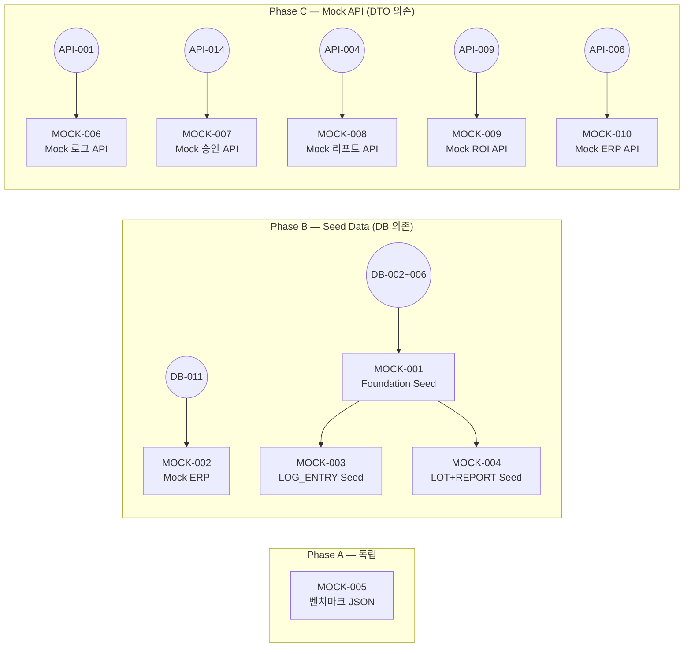

# FactoryAI — Mock 데이터 & Mock API Issues (MOCK-001 ~ MOCK-010)

> **Source**: SRS-002 Rev 2.0 (V0.8) — §6.2 Entity & Data Model + §6.1 API Endpoint List  
> **작성일**: 2026-04-19  
> **총 Issue**: 10건 (Seed Data 5건 + Mock API 5건)  
> **목적**: 백엔드 로직 미구현 상태에서 프론트엔드 병렬 개발 + E2E 시연을 가능하게 하는 Mock 레이어 구축

> [!IMPORTANT]
> **Seed Data (MOCK-001~005)**: Prisma `prisma/seed.ts`로 DB에 직접 적재하는 초기 데이터.  
> **Mock API (MOCK-006~010)**: Next.js Route Handler에 하드코딩 응답을 반환하는 스텁 엔드포인트.  
> Mock API는 실제 구현(E1-CMD, E2-CMD 등) 완료 시 제거하며, 환경변수 `MOCK_API=true`로 ON/OFF 전환.

---

## MOCK-001: Foundation Seed 데이터 (USER + FACTORY + PRODUCTION_LINE)

---
name: Feature Task
about: SRS 기반의 구체적인 개발 태스크 명세
title: "[Mock/Foundation] MOCK-001: Seed 데이터 — USER(5역할×2명) + FACTORY(2개) + PRODUCTION_LINE(공장당 3라인)"
labels: 'feature, backend, mock-data, priority:must, epic:foundation'
assignees: ''
---

### :dart: Summary
- **기능명**: [MOCK-001] Foundation Seed 데이터 스크립트
- **목적**: 개발/테스트 환경에서 즉시 사용 가능한 기본 마스터 데이터를 적재한다. 5역할×2명=10명의 USER, 2개 업종 FACTORY, 공장당 3개 PRODUCTION_LINE을 포함하며, 모든 후속 Mock 데이터의 FK 참조 기반이 된다.

### :link: References (Spec & Context)
> :bulb: AI Agent & Dev Note: 작업 시작 전 아래 문서를 반드시 먼저 Read/Evaluate 할 것.
- SRS 문서: §6.2.1~6.2.14 전체 엔터티 스키마
- 제약사항: ASM-08 (PoC 1개사, 사용자 2~3명, 동시접속 3명)
- 데이터 모델: §6.2.14 USER / §6.2.1 FACTORY / §6.2.2 PRODUCTION_LINE
- DB 스키마: [`9_Issues_DB-001_to_DB-017.md`](file:///c:/Antigravity_Workspace/SRS%20from%20PRD_RPA%20Saas/Tasks/9_Issues_DB-001_to_DB-017.md) — DB-002, DB-003, DB-004

### :white_check_mark: Task Breakdown (실행 계획)
- [ ] **1.** `prisma/seed.ts` 파일 생성
- [ ] **2.** `package.json`에 `"prisma": { "seed": "ts-node prisma/seed.ts" }` 추가
- [ ] **3.** **USER Seed (10명)**:
  | # | name | email | role | factory | 비밀번호 해시 |
  |:---:|:---|:---|:---|:---|:---|
  | 1 | 한성우 (COO) | coo@metalfactory.co.kr | ADMIN | 금속가공 | `bcrypt("Test1234!")` |
  | 2 | 김관리 (ADMIN2) | admin2@foodfactory.co.kr | ADMIN | 식품제조 | 동일 |
  | 3 | 박작업 (작업자1) | op1@metalfactory.co.kr | OPERATOR | 금속가공 | 동일 |
  | 4 | 이작업 (작업자2) | op2@foodfactory.co.kr | OPERATOR | 식품제조 | 동일 |
  | 5 | 클레어 리 (감사) | auditor1@metalfactory.co.kr | AUDITOR | 금속가공 | 동일 |
  | 6 | 차품질 (감사2) | auditor2@foodfactory.co.kr | AUDITOR | 식품제조 | 동일 |
  | 7 | 이뷰어 (열람) | viewer1@metalfactory.co.kr | VIEWER | 금속가공 | 동일 |
  | 8 | 정뷰어 (열람2) | viewer2@foodfactory.co.kr | VIEWER | 식품제조 | 동일 |
  | 9 | 최보안 (CISO1) | ciso1@metalfactory.co.kr | CISO | 금속가공 | 동일 |
  | 10 | 강보안 (CISO2) | ciso2@foodfactory.co.kr | CISO | 식품제조 | 동일 |
- [ ] **4.** **FACTORY Seed (2개)**:
  | # | name | industry | address | employee_count |
  |:---:|:---|:---|:---|:---:|
  | 1 | 대한금속 주식회사 | METAL_PROCESSING | 경기도 안산시 단원구 | 85 |
  | 2 | 한국식품 주식회사 | FOOD_MANUFACTURING | 충남 천안시 서북구 | 120 |
- [ ] **5.** **PRODUCTION_LINE Seed (6개 = 2공장 × 3라인)**:
  | Factory | # | name | status |
  |:---|:---:|:---|:---|
  | 대한금속 | 1 | CNC 절삭 가공 라인 | ACTIVE |
  | 대한금속 | 2 | 프레스 성형 라인 | ACTIVE |
  | 대한금속 | 3 | 표면 처리 라인 | MAINTENANCE |
  | 한국식품 | 4 | 원재료 혼합 라인 | ACTIVE |
  | 한국식품 | 5 | 충전 포장 라인 | ACTIVE |
  | 한국식품 | 6 | 멸균/살균 라인 | IDLE |
- [ ] **6.** **WORK_ORDER Seed (공장당 3건 = 6건)**: 각 라인에 1개 PENDING/IN_PROGRESS/COMPLETE 상태
- [ ] **7.** **DATA_SOURCE Seed (공장당 2건 = 4건)**: CAMERA + MICROPHONE (ACTIVE)
- [ ] **8.** `npx prisma db seed` 실행 테스트 — 멱등성 보장 (`upsert` 사용)
- [ ] **9.** `.env.example`에 `SEED_PASSWORD=Test1234!` 문서화

### :test_tube: Acceptance Criteria (BDD/GWT)

**Scenario 1: 최초 시드 실행**
- **Given**: 빈 데이터베이스 (마이그레이션만 완료)
- **When**: `npx prisma db seed`를 실행한다
- **Then**: USER 10명, FACTORY 2개, PRODUCTION_LINE 6개, WORK_ORDER 6건, DATA_SOURCE 4건이 정상 적재된다.

**Scenario 2: 중복 실행 (멱등성)**
- **Given**: 이미 시드 데이터가 적재되어 있다
- **When**: `npx prisma db seed`를 재실행한다
- **Then**: 에러 없이 완료된다 (upsert로 중복 방지). 데이터 수량 변화 없음.

**Scenario 3: 역할별 사용자 확인**
- **Given**: 시드 완료 후
- **When**: `SELECT role, COUNT(*) FROM "User" GROUP BY role`을 실행한다
- **Then**: ADMIN=2, OPERATOR=2, AUDITOR=2, VIEWER=2, CISO=2 (총 10명)

### :gear: Technical & Non-Functional Constraints
- **비밀번호**: Bcrypt 해시 저장 (평문 금지). 공통 테스트 비밀번호 `Test1234!`
- **멱등성**: `upsert` 사용 필수 — CI/CD에서 반복 실행 가능
- **FK 순서**: FACTORY → PRODUCTION_LINE → WORK_ORDER → DATA_SOURCE → USER 순서 적재
- **환경 분리**: `.env.local`(dev)과 `.env.cloud`(MVP) 모두에서 동작

### :checkered_flag: Definition of Done (DoD)
- [ ] `npx prisma db seed` 성공 (SQLite + PostgreSQL)
- [ ] 멱등성 테스트 통과 (2회 연속 실행 에러 0건)
- [ ] 5역할 × 2명 = 10명 USER 확인
- [ ] 2개 FACTORY × 3개 LINE = 6개 PRODUCTION_LINE 확인
- [ ] 모든 FK 참조 무결성 검증
- [ ] `.env.example`에 시드 비밀번호 문서화

### :construction: Dependencies & Blockers
- **Depends on**: `DB-002` (USER), `DB-003` (FACTORY), `DB-004` (PRODUCTION_LINE), `DB-005` (WORK_ORDER), `DB-006` (DATA_SOURCE)
- **Blocks**: `MOCK-003` (LOG_ENTRY 시드), `MOCK-004` (LOT/REPORT 시드), `AUTH-001` (로그인 테스트)

---

## MOCK-002: Mock ERP 테이블 (더존 iCUBE 스키마 모방) + 샘플 데이터

---
name: Feature Task
title: "[Mock/E3] MOCK-002: Supabase 내 Mock ERP 테이블 생성 + 재고/발주/실적 샘플 데이터"
labels: 'feature, backend, mock-data, priority:must, epic:e3-erp-bridge'
assignees: ''
---

### :dart: Summary
- **기능명**: [MOCK-002] Mock ERP 테이블 (더존 iCUBE 스키마 모방) + 재고/발주/실적 샘플 데이터
- **목적**: 실제 ERP DB 연결 없이 E3 ERP 브릿지 기능을 시연/테스트하기 위한 Mock ERP 테이블을 Supabase/Prisma 내에 생성하고 현실적 샘플 데이터를 적재한다. 더존 iCUBE의 핵심 테이블 구조를 모방한다.

### :link: References (Spec & Context)
> :bulb: AI Agent & Dev Note: 작업 시작 전 아래 문서를 반드시 먼저 Read/Evaluate 할 것.
- SRS 문서: §3.1 EXT-01 (더존 iCUBE/Smart A 연동)
- 가정: ASM-02 (Mock DB 기반 시연), ASM-07 (더존 iCUBE 스키마 모방)
- 제약: CON-02 (Read-Only), CON-05 (더존/영림원 한정)
- ADR: ADR-2 (비파괴형 브릿지)

### :white_check_mark: Task Breakdown (실행 계획)
- [ ] **1.** Prisma 스키마에 Mock ERP 모델 추가 (prefix: `MockErp_`):
  - `MockErp_Inventory` (재고 마스터)
    ```
    item_code  VARCHAR(50) PK
    item_name  VARCHAR(200)
    category   VARCHAR(50)
    unit       VARCHAR(10)
    qty_on_hand INT
    warehouse  VARCHAR(50)
    last_updated TIMESTAMP
    ```
  - `MockErp_PurchaseOrder` (발주)
    ```
    po_number    VARCHAR(50) PK
    vendor_name  VARCHAR(200)
    item_code    VARCHAR(50) FK → Inventory
    order_qty    INT
    unit_price   DECIMAL(15,2)
    order_date   DATE
    delivery_date DATE
    status       VARCHAR(20)  -- ORDERED/RECEIVED/CANCELLED
    ```
  - `MockErp_ProductionResult` (실적)
    ```
    result_id    VARCHAR(50) PK
    work_date    DATE
    line_name    VARCHAR(100)
    product_code VARCHAR(50)
    plan_qty     INT
    actual_qty   INT
    defect_qty   INT
    worker_name  VARCHAR(50)
    ```
- [ ] **2.** `ERP_CONNECTION` 시드: Mock 연결 정보 (erp_type=DOUZONE_ICUBE, approved_tables=["MockErp_Inventory","MockErp_PurchaseOrder","MockErp_ProductionResult"])
- [ ] **3.** **재고 샘플 데이터 (20건)**:
  - 금속가공: SUS304 스테인리스, AL6061 알루미늄, SK5 탄소공구강 등 10건
  - 식품제조: 밀가루, 설탕, 대두유, 살균 포장재 등 10건
- [ ] **4.** **발주 샘플 데이터 (15건)**: 상태별 (ORDERED 5, RECEIVED 8, CANCELLED 2)
- [ ] **5.** **실적 샘플 데이터 (30건)**: 최근 30일, 라인별 일일 실적 (plan vs actual, 불량 포함)
- [ ] **6.** 시드 스크립트에 통합 (`prisma/seed.ts`의 `seedMockErp()` 함수)
- [ ] **7.** 스키마 스냅샷 JSON 생성 (E3-CMD-001 스키마 변경 감지용 기준점)

### :test_tube: Acceptance Criteria (BDD/GWT)

**Scenario 1: Mock ERP 테이블 생성**
- **Given**: Prisma 마이그레이션 완료
- **When**: `npx prisma db seed`를 실행한다
- **Then**: MockErp_Inventory(20건), MockErp_PurchaseOrder(15건), MockErp_ProductionResult(30건)이 적재된다.

**Scenario 2: Read-Only 동기화 시연**
- **Given**: Mock ERP 데이터가 적재되어 있다
- **When**: E3-CMD-001이 `SELECT * FROM MockErp_Inventory`를 실행한다
- **Then**: 20건 재고 데이터가 정상 조회된다.

**Scenario 3: 현실적 데이터 품질**
- **Given**: 실적 데이터가 존재한다
- **When**: 불량률 (`defect_qty / actual_qty`)을 계산한다
- **Then**: 금속가공 1~5%, 식품제조 0.5~3% 범위의 현실적 수치가 나온다.

### :gear: Technical & Non-Functional Constraints
- **Read-Only**: Mock ERP 테이블은 FactoryAI 코어에서 절대 Write 불가 (E3-CMD-001에서 검증)
- **스키마 모방**: 더존 iCUBE 실제 테이블 구조를 최대한 유사하게 모방 (한글 컬럼명 회피, 영문 기반)
- **데이터 현실성**: 단가, 수량, 불량률 등이 제조 현장 실 데이터와 유사한 범위

### :checkered_flag: Definition of Done (DoD)
- [ ] 3개 Mock ERP 테이블 생성 + 65건 샘플 데이터 적재
- [ ] ERP_CONNECTION 시드 (approved_tables 포함) 완료
- [ ] 스키마 스냅샷 JSON 생성
- [ ] Read-Only SELECT 테스트 통과
- [ ] 멱등성 보장 (upsert)

### :construction: Dependencies & Blockers
- **Depends on**: `DB-011` (ERP_CONNECTION)
- **Blocks**: `E3-CMD-001` (Mock ERP 동기화), `MOCK-010` (Mock sync API)

---

## MOCK-003: Mock LOG_ENTRY 데이터 (3종 × 20건)

---
name: Feature Task
title: "[Mock/E1] MOCK-003: Mock LOG_ENTRY 시드 — STT/VISION/EXCEL_BATCH 3종 × 20건"
labels: 'feature, backend, mock-data, priority:must, epic:e1-passive-logging'
---

### :dart: Summary
- **기능명**: [MOCK-003] Mock LOG_ENTRY 데이터 (STT/VISION/EXCEL_BATCH 3종 × 20건 = 60건)
- **목적**: E1 패시브 로깅 UI 개발과 HITL 승인 워크플로 테스트를 위한 다양한 상태의 로그 샘플 데이터.

### :link: References (Spec & Context)
- SRS: §6.2.4 LOG_ENTRY 엔터티
- 데이터 분포: 3종 source_type × 다양한 status (PENDING/APPROVED/REJECTED)

### :white_check_mark: Task Breakdown (실행 계획)
- [ ] **1.** `prisma/seed.ts`에 `seedLogEntries()` 함수 추가
- [ ] **2.** **STT 로그 20건**:
  - PENDING: 8건 (검토 대기)
  - APPROVED: 10건 (정상 승인)
  - REJECTED: 2건 (오인식 거절)
  - `raw_data` 예시: `{ "transcript": "CNC-3번 공정 시작, 온도 180도 확인", "confidence": 0.92 }`
- [ ] **3.** **VISION 로그 20건**:
  - PENDING: 6건, APPROVED: 12건, REJECTED: 2건
  - `raw_data` 예시: `{ "image_url": "/mock/img001.jpg", "detected_values": { "temperature": 182, "pressure": 4.5 }, "confidence": 0.88 }`
  - REJECTED 건: `{ "error": "lens_contamination", "confidence": 0.31 }`
- [ ] **4.** **EXCEL_BATCH 로그 20건**:
  - PENDING: 4건, APPROVED: 16건, REJECTED: 0건
  - `raw_data` 예시: `{ "file_name": "2026-04-daily.xlsx", "rows_parsed": 45, "source": "MANUAL_UPLOAD" }`
- [ ] **5.** `captured_at` 분포: 최근 7일, 시간대 분산 (08:00~18:00)
- [ ] **6.** FK 참조: MOCK-001의 WORK_ORDER에 연결
- [ ] **7.** 일부 건에 `reviewer_id`, `reviewed_at` 입력 (APPROVED/REJECTED 건)

### :test_tube: Acceptance Criteria (BDD/GWT)

**Scenario 1: 시드 데이터 적재**
- **Given**: MOCK-001 시드 완료 상태
- **When**: `seedLogEntries()` 실행
- **Then**: LOG_ENTRY 60건 (STT 20 + VISION 20 + EXCEL 20) 적재

**Scenario 2: 상태 분포 확인**
- **Given**: 시드 완료
- **When**: `GROUP BY status` 조회
- **Then**: PENDING 18건, APPROVED 38건, REJECTED 4건

**Scenario 3: 결측률 시뮬레이션**
- **Given**: 시드 데이터 기반
- **When**: 결측률 API (API-003)가 호출된다
- **Then**: 현실적 결측률 수치 (5~15% 범위) 산출 가능

### :gear: Technical & Non-Functional Constraints
- **FK 무결성**: 모든 `work_order_id`가 MOCK-001의 WorkOrder 참조
- **시간 분포**: `captured_at`이 현실적 근무 시간대에 분포
- **JSON 현실성**: `raw_data`가 실제 STT/Vision 파싱 결과 포맷과 일치

### :checkered_flag: Definition of Done (DoD)
- [ ] 60건 LOG_ENTRY 적재 (3종 × 20건)
- [ ] 3종 source_type + 3종 status 분포 확인
- [ ] JSON raw_data 구조 현실적 데이터 포함
- [ ] 멱등성 보장

### :construction: Dependencies & Blockers
- **Depends on**: `MOCK-001` (USER/FACTORY/LINE/WORK_ORDER 시드), `DB-007` (LOG_ENTRY)
- **Blocks**: `MOCK-006` (Mock 로그 API), `E1-QRY-001` (결측률), `E1-UI-003` (롤백 뷰어)

---

## MOCK-004: Mock LOT + AUDIT_REPORT 데이터

---
name: Feature Task
title: "[Mock/E2] MOCK-004: Mock LOT(10건) + AUDIT_REPORT(3건) 시드"
labels: 'feature, backend, mock-data, priority:must, epic:e2-audit-report'
---

### :dart: Summary
- **기능명**: [MOCK-004] Mock LOT + AUDIT_REPORT 시드 (Lot 10건 + 리포트 3건)
- **목적**: 감사 리포트 UI 개발 및 Lot 병합 로직 테스트를 위한 시드 데이터.

### :link: References (Spec & Context)
- SRS: §6.2.7 LOT, §6.2.8 AUDIT_REPORT

### :white_check_mark: Task Breakdown (실행 계획)
- [ ] **1.** **LOT Seed (10건)**:
  | # | lot_number | factory | start_time | end_time | work_order |
  |:---:|:---|:---|:---|:---|:---|
  | 1 | LOT-M-2026-001 | 금속가공 | 04-01 08:00 | 04-01 12:00 | WO-1 |
  | 2 | LOT-M-2026-002 | 금속가공 | 04-01 13:00 | 04-01 17:00 | WO-1 |
  | 3 | LOT-M-2026-003 | 금속가공 | 04-02 08:00 | 04-02 12:00 | WO-2 |
  | 4 | LOT-M-2026-004 | 금속가공 | 04-02 13:00 | 04-02 17:00 | WO-2 |
  | 5 | LOT-M-2026-005 | 금속가공 | 04-03 08:00 | 04-03 12:00 | WO-3 |
  | 6 | LOT-F-2026-001 | 식품제조 | 04-01 07:00 | 04-01 11:00 | WO-4 |
  | 7 | LOT-F-2026-002 | 식품제조 | 04-01 12:00 | 04-01 16:00 | WO-4 |
  | 8 | LOT-F-2026-003 | 식품제조 | 04-02 07:00 | 04-02 11:00 | WO-5 |
  | 9 | LOT-F-2026-004 | 식품제조 | 04-02 12:00 | 04-02 16:00 | WO-5 |
  | 10 | LOT-F-2026-005 | 식품제조 | 04-03 07:00 | — (진행 중) | WO-6 |
- [ ] **2.** **AUDIT_REPORT Seed (3건)**:
  | # | factory | regulation_type | integrity | approved_by | xai_explanation |
  |:---:|:---|:---|:---|:---|:---|
  | 1 | 금속가공 | SAMSUNG_QA | VERIFIED | 클레어 리 | JSON (정상 판정) |
  | 2 | 금속가공 | HYUNDAI | VERIFIED | 클레어 리 | JSON (이상 1건 포함) |
  | 3 | 식품제조 | HACCP | FLAGGED | NULL (미승인) | JSON (결측 경고) |
- [ ] **3.** XAI 설명 JSON 샘플: `{ "summary": "CNC-3번 라인 온도 편차 2.3°C 감지...", "highlights": [...] }`
- [ ] **4.** 리포트 #3은 `approved_by=NULL` (HITL 미승인 상태 — PENDING 시나리오)

### :test_tube: Acceptance Criteria (BDD/GWT)

**Scenario 1: LOT 적재 + UNIQUE 검증**
- **Given**: 시드 실행
- **When**: `SELECT COUNT(*) FROM "Lot"`
- **Then**: 10건, `lot_number` 모두 유일

**Scenario 2: 미승인 리포트 확인**
- **Given**: 시드 데이터
- **When**: `approved_by IS NULL` 조회
- **Then**: 리포트 #3 반환 (HITL-CMD-001 차단 테스트용)

### :gear: Technical & Non-Functional Constraints
- **XAI NOT NULL**: AUDIT_REPORT.`xai_explanation`은 모두 NOT NULL (HITL ② 준수)
- **시간 순서**: LOT start_time이 시간순으로 정렬 가능하도록 설계

### :checkered_flag: Definition of Done (DoD)
- [ ] LOT 10건 + AUDIT_REPORT 3건 적재
- [ ] lot_number UNIQUE 검증
- [ ] xai_explanation NOT NULL 검증
- [ ] 멱등성 보장

### :construction: Dependencies & Blockers
- **Depends on**: `DB-009` (LOT), `DB-010` (AUDIT_REPORT), `MOCK-001`
- **Blocks**: `E2-CMD-001` (Lot 병합), `MOCK-008` (Mock 리포트 API)

---

## MOCK-005: 동종 업종 벤치마크 데이터 JSON

---
name: Feature Task
title: "[Mock/E4] MOCK-005: 동종 업종 벤치마크 Before-After 참고 데이터 JSON"
labels: 'feature, backend, mock-data, priority:should, epic:e4-roi'
---

### :dart: Summary
- **기능명**: [MOCK-005] 동종 업종 벤치마크 데이터 JSON
- **목적**: ROI 계산기(E4)에서 Before-After 카드 생성(REQ-FUNC-026)에 사용할 동종 업종 참고 데이터. DB가 아닌 정적 JSON 파일로 제공.

### :link: References (Spec & Context)
- SRS: §4.1.5 REQ-FUNC-026 (동종 업종 B/A 카드)
- API: API-011 (`POST /api/v1/roi/ba-card`)

### :white_check_mark: Task Breakdown (실행 계획)
- [ ] **1.** `data/benchmarks/metal_processing.json` 생성:
  ```json
  {
    "industry": "METAL_PROCESSING",
    "sample_size": 15,
    "metrics": {
      "missing_rate":    { "before": 42.5, "after": 3.8,  "unit": "%" },
      "schedule_time":   { "before": 195,  "after": 12,   "unit": "min" },
      "idle_time":       { "before": 6.2,  "after": 2.8,  "unit": "h/day" },
      "audit_prep_time": { "before": 52,   "after": 0.4,  "unit": "hours" },
      "erp_manual_work": { "before": 42,   "after": 0,    "unit": "h/month" },
      "defect_detection":{ "before": 24,   "after": 4,    "unit": "hours_delay" }
    },
    "cost_savings": {
      "annual_labor_savings": 18000000,
      "annual_quality_savings": 12000000,
      "annual_audit_savings": 5000000
    },
    "source": "FactoryAI PoC 참고 데이터 (2026)",
    "disclaimer": "실제 성과는 고객사 환경에 따라 다를 수 있습니다."
  }
  ```
- [ ] **2.** `data/benchmarks/food_manufacturing.json` 생성 (식품제조 특화 수치)
- [ ] **3.** `data/benchmarks/index.ts` — 타입 정의 + 로더 함수:
  ```typescript
  export interface BenchmarkData {
    industry: string;
    sample_size: number;
    metrics: Record<string, { before: number; after: number; unit: string }>;
    cost_savings: Record<string, number>;
  }
  export function loadBenchmark(industry: string): BenchmarkData;
  ```
- [ ] **4.** 수치 현실성 검증: SRS §4.2.10 KPI 목표와 일치 확인

### :test_tube: Acceptance Criteria (BDD/GWT)

**Scenario 1: 벤치마크 로드**
- **Given**: `metal_processing.json`이 존재한다
- **When**: `loadBenchmark('METAL_PROCESSING')` 호출
- **Then**: 6개 메트릭 + 3개 절감액 데이터 반환

**Scenario 2: KPI 일관성**
- **Given**: 벤치마크 데이터
- **When**: `missing_rate.after` 값 확인
- **Then**: SRS REQ-NF-043 목표(≤5%)와 일관된 수치

### :gear: Technical & Non-Functional Constraints
- **정적 파일**: DB 적재 아닌 JSON 파일 (import 로 읽기)
- **2 업종**: 금속가공 + 식품제조만 (CON-06)

### :checkered_flag: Definition of Done (DoD)
- [ ] 2개 업종 JSON 파일 + 타입 정의 + 로더 함수 완료
- [ ] SRS KPI 목표와 수치 일관성 확인
- [ ] 단위 테스트 통과

### :construction: Dependencies & Blockers
- **Depends on**: None (독립)
- **Blocks**: `E4-CMD-003` (B/A 카드), `E4-CMD-001` (ROI 계산)

---

## MOCK-006: Mock API — `POST /api/v1/log-entries`

---
name: Feature Task
title: "[Mock/E1] MOCK-006: 프론트엔드용 POST /api/v1/log-entries Mock API 엔드포인트"
labels: 'feature, backend, mock-api, priority:must, epic:e1-passive-logging'
---

### :dart: Summary
- **기능명**: [MOCK-006] `POST /api/v1/log-entries` Mock API (성공/실패 시나리오)
- **목적**: E1 UI 컴포넌트(E1-UI-001 녹음, E1-UI-002 카메라) 개발 시 백엔드 구현 전에 사용할 스텁 엔드포인트.

### :link: References (Spec & Context)
- API 계약: [`10_Issues_API-001_to_API-019.md`](file:///c:/Antigravity_Workspace/SRS%20from%20PRD_RPA%20Saas/Tasks/10_Issues_API-001_to_API-019.md) — API-001
- SRS: §6.1 API #1

### :white_check_mark: Task Breakdown (실행 계획)
- [ ] **1.** `app/api/v1/log-entries/route.ts`에 Mock 분기 추가:
  ```typescript
  if (process.env.MOCK_API === 'true') {
    return mockHandler(request);
  }
  // 실제 핸들러 (나중에 구현)
  ```
- [ ] **2.** Mock 시나리오 구현:
  | 조건 | 응답 |
  |:---|:---|
  | 정상 요청 | 201 + `{ id: "mock-uuid-001", status: "PENDING", captured_at: ... }` |
  | `source_type=INVALID` | 400 + `INVALID_SOURCE_TYPE` 에러 |
  | `raw_data` 10MB 초과 시뮬레이션 | 400 + `INVALID_RAW_DATA` |
  | Header에 `X-Mock-Rate-Limit: true` | 202 + `QUEUED_FOR_PROCESSING` |
  | Header에 `X-Mock-Error: 500` | 500 + `INTERNAL_ERROR` |
- [ ] **3.** Mock 응답 딜레이: `await sleep(200)` (리얼한 지연 시뮬레이션)
- [ ] **4.** `.env.local`에 `MOCK_API=true` 기본 설정

### :test_tube: Acceptance Criteria (BDD/GWT)

**Scenario 1: 성공 시나리오**
- **Given**: `MOCK_API=true`, 유효한 요청 Body
- **When**: `POST /api/v1/log-entries`
- **Then**: 201 + PENDING 상태 Mock UUID 반환

**Scenario 2: 에러 시나리오**
- **Given**: `X-Mock-Error: 500` 헤더 포함
- **When**: 요청
- **Then**: 500 + `INTERNAL_ERROR` (에러 UI 개발용)

**Scenario 3: Mock OFF**
- **Given**: `MOCK_API=false`
- **When**: 요청
- **Then**: Mock 핸들러 비활성, 실제 핸들러로 라우팅 (501 Not Implemented 또는 실제 로직)

### :gear: Technical & Non-Functional Constraints
- **환경변수**: `MOCK_API=true/false`로 ON/OFF
- **API 계약 준수**: API-001에서 정의한 Request/Response DTO 타입 그대로 사용
- **제거 시점**: E1-CMD-001 실제 구현 완료 시 Mock 분기 제거

### :checkered_flag: Definition of Done (DoD)
- [ ] 성공/실패 5개 시나리오 구현
- [ ] API-001 DTO 타입 준수 확인
- [ ] `MOCK_API` 환경변수 ON/OFF 동작 확인
- [ ] 프론트엔드 개발자가 즉시 사용 가능

### :construction: Dependencies & Blockers
- **Depends on**: `API-001` (DTO 타입 정의)
- **Blocks**: `E1-UI-001` (녹음 UI), `E1-UI-002` (카메라 UI)

---

## MOCK-007: Mock API — `PATCH /api/v1/approvals/{id}`

---
name: Feature Task
title: "[Mock/HITL] MOCK-007: 프론트엔드용 PATCH /api/v1/approvals/{id} Mock API"
labels: 'feature, backend, mock-api, priority:must, epic:hitl-safety-protocol'
---

### :dart: Summary
- **기능명**: [MOCK-007] `PATCH /api/v1/approvals/{id}` Mock API (APPROVED/REJECTED 시나리오)
- **목적**: HITL 승인 UI(E1-UI-003, E2B-UI-001) 개발용 스텁 엔드포인트.

### :link: References (Spec & Context)
- API 계약: API-014 (`PATCH /api/v1/approvals/{id}`)
- SRS: §6.1 API #14

### :white_check_mark: Task Breakdown (실행 계획)
- [ ] **1.** `app/api/v1/approvals/[id]/route.ts` Mock 분기
- [ ] **2.** Mock 시나리오:
  | input decision | 응답 |
  |:---|:---|
  | `APPROVED` | 200 + `{ status: "APPROVED", decision_at: NOW, audit_log_id: "mock-..." }` |
  | `REJECTED` | 200 + `{ status: "REJECTED", ... }` |
  | id = `already-done` | 409 + `ALREADY_DECIDED` |
  | id = `not-found` | 404 + `APPROVAL_NOT_FOUND` |
- [ ] **3.** Mock 딜레이: 200ms (승인 반영 ≤1초 시뮬레이션)

### :test_tube: Acceptance Criteria (BDD/GWT)

**Scenario 1: APPROVED** → 200 + 감사 로그 ID 포함
**Scenario 2: 이미 결정된 건** → 409 + `ALREADY_DECIDED`

### :gear: Technical & Non-Functional Constraints
- **API-014 DTO 준수**: Request/Response 타입 완전 일치

### :checkered_flag: Definition of Done (DoD)
- [ ] 4개 시나리오 구현
- [ ] API-014 DTO 타입 준수

### :construction: Dependencies & Blockers
- **Depends on**: `API-014`
- **Blocks**: `E1-UI-003` (롤백 뷰어), `E2B-UI-001` (XAI 대시보드)

---

## MOCK-008: Mock API — `POST /api/v1/audit-reports`

---
name: Feature Task
title: "[Mock/E2] MOCK-008: 프론트엔드용 POST /api/v1/audit-reports Mock API"
labels: 'feature, backend, mock-api, priority:must, epic:e2-audit-report'
---

### :dart: Summary
- **기능명**: [MOCK-008] `POST /api/v1/audit-reports` Mock API (PDF 생성 성공 / 결측치 누락 시나리오)
- **목적**: 감사 리포트 생성 UI(E2-UI-001) 개발용 스텁.

### :link: References (Spec & Context)
- API 계약: API-004
- SRS: §6.1 API #4, REQ-FUNC-009~013

### :white_check_mark: Task Breakdown (실행 계획)
- [ ] **1.** `app/api/v1/audit-reports/route.ts` Mock 분기
- [ ] **2.** Mock 시나리오:
  | 조건 | 응답 |
  |:---|:---|
  | 정상 요청 (lot_ids 유효) | 201 + `{ report_id: "mock-...", status: "PENDING", lot_count: N }` |
  | `lot_ids` 비어있음 | 400 + `EMPTY_LOT_IDS` |
  | `regulation_type=ISO_9001` | 400 + `UNSUPPORTED_REGULATION` + 대체 포맷 제안 |
  | Header `X-Mock-Missing: true` | 422 + `MISSING_DATA_DETECTED` + 결측치 목록 |
  | Header `X-Mock-Conflict: true` | 422 + `TIMESTAMP_CONFLICT` + 충돌 Lot 목록 |
- [ ] **3.** 결측치 목록 Mock: `{ missing_fields: ["temperature", "pressure"], affected_lots: ["LOT-M-2026-003"] }`
- [ ] **4.** 타임스탬프 충돌 Mock: `{ conflicting_lots: [{ lot_a: "...", lot_b: "...", overlap_seconds: 120 }] }`

### :test_tube: Acceptance Criteria (BDD/GWT)

**Scenario 1: 성공** → 201 + PENDING 리포트 ID
**Scenario 2: 결측치** → 422 + 누락 필드 목록 (E2-UI-002 결측치 UI 연동)
**Scenario 3: 충돌** → 422 + 충돌 Lot 목록 (E2-UI-003 충돌 해결 UI 연동)

### :checkered_flag: Definition of Done (DoD)
- [ ] 5개 시나리오 구현, API-004 DTO 타입 준수

### :construction: Dependencies & Blockers
- **Depends on**: `API-004`
- **Blocks**: `E2-UI-001` (리포트 생성 UI), `E2-UI-002` (결측치 UI), `E2-UI-003` (충돌 해결 UI)

---

## MOCK-009: Mock API — `POST /api/v1/roi/calculate`

---
name: Feature Task
title: "[Mock/E4] MOCK-009: 프론트엔드용 POST /api/v1/roi/calculate Mock API"
labels: 'feature, backend, mock-api, priority:should, epic:e4-roi'
---

### :dart: Summary
- **기능명**: [MOCK-009] `POST /api/v1/roi/calculate` Mock API (바우처 매칭 결과 시나리오)
- **목적**: ROI 웹 계산기 UI(E4-UI-001) 개발용 스텁.

### :link: References (Spec & Context)
- API 계약: API-009
- SRS: §6.1 API #9, REQ-FUNC-024~028

### :white_check_mark: Task Breakdown (실행 계획)
- [ ] **1.** `app/api/v1/roi/calculate/route.ts` Mock 분기
- [ ] **2.** Mock 시나리오:
  | 조건 | 응답 |
  |:---|:---|
  | 금속가공, 85명, 매출 50억 | 201 + 바우처 매칭 성공 (자부담 800만, Payback 14개월) |
  | 식품제조, 120명, 매출 80억 | 201 + 바우처 매칭 성공 (자부담 600만, Payback 11개월) |
  | `employee_count=0` | 400 + `UNREALISTIC_VALUE` (REQ-FUNC-028) |
  | `industry` 누락 | 400 + `MISSING_REQUIRED_FIELD` (REQ-FUNC-027) |
- [ ] **3.** 현실적 ROI 수치: MOCK-005 벤치마크 기반 계산 시뮬레이션

### :test_tube: Acceptance Criteria (BDD/GWT)

**Scenario 1: 정상 계산** → 201 + ROI/Payback/자부담 (≤3초 시뮬레이션)
**Scenario 2: 비현실적 수치** → 400 + 경고 메시지

### :checkered_flag: Definition of Done (DoD)
- [ ] 4개 시나리오 구현, API-009 DTO 타입 준수

### :construction: Dependencies & Blockers
- **Depends on**: `API-009`
- **Blocks**: `E4-UI-001` (ROI 계산기 UI)

---

## MOCK-010: Mock API — `POST /api/v1/erp/sync`

---
name: Feature Task
title: "[Mock/E3] MOCK-010: 프론트엔드용 POST /api/v1/erp/sync Mock API"
labels: 'feature, backend, mock-api, priority:must, epic:e3-erp-bridge'
---

### :dart: Summary
- **기능명**: [MOCK-010] `POST /api/v1/erp/sync` Mock API (성공/스키마변경 시나리오)
- **목적**: ERP 연동 관리 UI(E3-UI-001) 개발용 스텁.

### :link: References (Spec & Context)
- API 계약: API-006
- SRS: §6.1 API #6, REQ-FUNC-019~023

### :white_check_mark: Task Breakdown (실행 계획)
- [ ] **1.** `app/api/v1/erp/sync/route.ts` Mock 분기
- [ ] **2.** Mock 시나리오:
  | 조건 | 응답 |
  |:---|:---|
  | 정상 동기화 | 200 + `{ sync_status: "SYNCED", records_count: 65, duration_ms: 1200 }` |
  | 미승인 테이블 | 400 + `UNAPPROVED_TABLE` |
  | Header `X-Mock-Schema: changed` | 409 + `SCHEMA_CHANGED` + 변경 내역 |
  | Header `X-Mock-Write: true` | 403 + `WRITE_OPERATION_BLOCKED` + CISO 알림 시뮬레이션 |
  | 이미 동기화 중 | 409 + `SYNC_IN_PROGRESS` |
- [ ] **3.** 스키마 변경 Mock 상세:
  ```json
  {
    "error": { "code": "SCHEMA_CHANGED" },
    "schema_diff": {
      "table": "MockErp_Inventory",
      "changes": [
        { "type": "COLUMN_ADDED", "column": "batch_number", "data_type": "VARCHAR(50)" },
        { "type": "COLUMN_TYPE_CHANGED", "column": "qty_on_hand", "from": "INT", "to": "BIGINT" }
      ]
    }
  }
  ```
- [ ] **4.** Write 차단 Mock: CISO 알림 트리거 시뮬레이션 메시지 포함

### :test_tube: Acceptance Criteria (BDD/GWT)

**Scenario 1: 정상 동기화** → 200 + SYNCED + records_count
**Scenario 2: 스키마 변경** → 409 + 변경 내역 상세 (E3-UI-001 경고 표시 연동)
**Scenario 3: Write 차단** → 403 + CISO 알림 메시지 포함

### :gear: Technical & Non-Functional Constraints
- **Read-Only 시뮬레이션**: Write 시도 시나리오도 Mock으로 제공 (보안 테스트용)

### :checkered_flag: Definition of Done (DoD)
- [ ] 5개 시나리오 구현, API-006 DTO 타입 준수

### :construction: Dependencies & Blockers
- **Depends on**: `API-006`
- **Blocks**: `E3-UI-001` (ERP 연동 관리 UI)

---

## 전체 MOCK 태스크 실행 순서



### 권장 실행 순서

| 순서 | Task ID | 유형 | 설명 | 예상 소요 |
|:---:|:---|:---|:---|:---:|
| 1 | MOCK-005 | Seed | 벤치마크 JSON (독립) | 30m |
| 2 | MOCK-001 | Seed | Foundation (USER/FACTORY/LINE) | 1.5h |
| 3 | MOCK-002 | Seed | Mock ERP 테이블 + 65건 | 2h |
| 4 | MOCK-003 | Seed | LOG_ENTRY 60건 | 45m |
| 5 | MOCK-004 | Seed | LOT 10건 + REPORT 3건 | 30m |
| 6 | MOCK-006 | API | Mock 로그 엔드포인트 | 45m |
| 7 | MOCK-007 | API | Mock 승인 엔드포인트 | 30m |
| 8 | MOCK-008 | API | Mock 리포트 엔드포인트 | 45m |
| 9 | MOCK-009 | API | Mock ROI 엔드포인트 | 30m |
| 10 | MOCK-010 | API | Mock ERP sync 엔드포인트 | 30m |
| | | | **총 예상** | **~7.5h** |

---

## 공통 Mock 인프라 (MOCK-006 작업 시 최초 1회 설정)

### `lib/mock/mock-utils.ts`

```typescript
// Mock 모드 판별
export function isMockMode(): boolean {
  return process.env.MOCK_API === 'true';
}

// Mock 응답 딜레이 (현실적 지연 시뮬레이션)
export async function mockDelay(ms: number = 200): Promise<void> {
  await new Promise(resolve => setTimeout(resolve, ms));
}

// Mock UUID 생성
export function mockUuid(prefix: string = 'mock'): string {
  return `${prefix}-${Date.now()}-${Math.random().toString(36).slice(2, 8)}`;
}

// Mock 에러 응답 생성기
export function mockError(status: number, code: string, message: string) {
  return Response.json({
    error: { code, message },
    timestamp: new Date().toISOString(),
    request_id: mockUuid('req'),
  }, { status });
}
```

### `.env.local` 설정

```bash
# Mock 모드 활성화 (개발 환경)
MOCK_API=true

# 시드 비밀번호
SEED_PASSWORD=Test1234!
```
