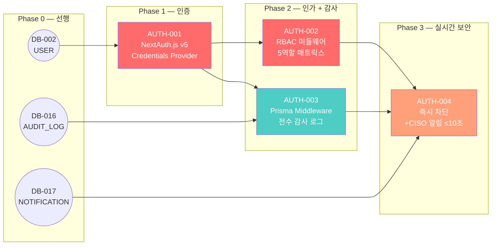

# FactoryAI — 인증/인가 공통 Issues (AUTH-001 ~ AUTH-004)

> **Source**: SRS-002 Rev 2.0 (V0.8) — §4.1.6 REQ-FUNC-032~034, §4.2.4 REQ-NF-023, §10.1 기술 스택  
> **작성일**: 2026-04-19  
> **총 Issue**: 4건  
> **프레임워크**: NextAuth.js v5 (Auth.js) + Prisma Middleware + Next.js App Router  
> **보안 원칙**: Fail-Close (장애 시 기본 차단) + 전 접근 전수 감사 기록

> [!IMPORTANT]
> AUTH-001~004는 FactoryAI 전체 보안 기반을 구축하는 **최우선 Foundation 태스크**입니다.  
> 모든 Step 2 Command/Query 태스크(E1-CMD, E2-CMD 등)가 이 4건에 의존합니다.  
> 특히 AUTH-002(RBAC 미들웨어)는 **19개 API 엔드포인트 전체**에 적용됩니다.

---

## AUTH-001: NextAuth.js v5 초기 설정 + 자격 증명 프로바이더

---
name: Feature Task
about: SRS 기반의 구체적인 개발 태스크 명세
title: "[Auth/Foundation] AUTH-001: NextAuth.js v5 초기 설정 + Credentials Provider (이메일/패스워드)"
labels: 'feature, backend, security, priority:must, epic:foundation'
assignees: ''
---

### :dart: Summary
- **기능명**: [AUTH-001] NextAuth.js v5 초기 설정 + 자격 증명 프로바이더 (이메일/패스워드)
- **목적**: FactoryAI의 인증 체계를 구축한다. NextAuth.js v5 (Auth.js)를 Next.js App Router에 통합하고, 이메일/패스워드 기반 Credentials Provider를 구현한다. JWT 세션 전략으로 Supabase Free Tier 제약(세션 DB 불필요)에 최적화한다.

### :link: References (Spec & Context)
> :bulb: AI Agent & Dev Note: 작업 시작 전 아래 문서를 반드시 먼저 Read/Evaluate 할 것.
- SRS 문서: §10.1 기술 스택 (NextAuth.js v5)
- 제약사항: CON-10 (NextAuth.js + Supabase Auth 통합)
- 데이터 모델: [`9_Issues_DB-001_to_DB-017.md`](file:///c:/Antigravity_Workspace/SRS%20from%20PRD_RPA%20Saas/Tasks/9_Issues_DB-001_to_DB-017.md) — DB-002 USER 엔터티
- 시드 데이터: [`11_Issues_MOCK-001_to_MOCK-010.md`](file:///c:/Antigravity_Workspace/SRS%20from%20PRD_RPA%20Saas/Tasks/11_Issues_MOCK-001_to_MOCK-010.md) — MOCK-001 (10명 USER)
- NextAuth.js v5 공식 문서: https://authjs.dev/getting-started

### :white_check_mark: Task Breakdown (실행 계획)
- [ ] **1.** `npm install next-auth@beta @auth/prisma-adapter bcryptjs`
- [ ] **2.** `auth.ts` (루트) — NextAuth 설정 파일 생성:
  ```typescript
  import NextAuth from "next-auth";
  import Credentials from "next-auth/providers/credentials";
  import { PrismaAdapter } from "@auth/prisma-adapter";
  import { prisma } from "@/lib/prisma";
  import bcrypt from "bcryptjs";

  export const { handlers, auth, signIn, signOut } = NextAuth({
    adapter: PrismaAdapter(prisma),
    session: { strategy: "jwt" },  // Supabase Free Tier 최적화
    providers: [
      Credentials({
        credentials: {
          email: { label: "이메일", type: "email" },
          password: { label: "비밀번호", type: "password" },
        },
        async authorize(credentials) {
          // 1. 이메일로 사용자 조회
          // 2. bcrypt 해시 비교
          // 3. is_active 확인
          // 4. 인증 실패 시 null 반환 (에러 메시지 노출 금지)
        },
      }),
    ],
    callbacks: {
      async jwt({ token, user }) {
        // user.role, user.factory_id를 JWT 토큰에 주입
      },
      async session({ session, token }) {
        // 토큰에서 role, factory_id를 세션 객체로 전파
      },
    },
    pages: {
      signIn: "/login",
      error: "/login?error=true",
    },
  });
  ```
- [ ] **3.** `app/api/auth/[...nextauth]/route.ts` — Route Handler 연결:
  ```typescript
  import { handlers } from "@/auth";
  export const { GET, POST } = handlers;
  ```
- [ ] **4.** `types/next-auth.d.ts` — 타입 확장 (JWT + Session에 role/factory_id 추가):
  ```typescript
  declare module "next-auth" {
    interface User {
      role: "ADMIN" | "OPERATOR" | "AUDITOR" | "VIEWER" | "CISO";
      factory_id: string | null;
      is_active: boolean;
    }
    interface Session {
      user: User & DefaultSession["user"];
    }
  }
  declare module "next-auth/jwt" {
    interface JWT {
      role: string;
      factory_id: string | null;
    }
  }
  ```
- [ ] **5.** `lib/auth-utils.ts` — 서버 사이드 헬퍼:
  ```typescript
  export async function getServerUser() {
    const session = await auth();
    if (!session?.user) throw new AuthError("UNAUTHORIZED");
    return session.user;
  }
  ```
- [ ] **6.** 로그인 페이지 (`app/(auth)/login/page.tsx`) — 기본 UI:
  - 이메일/비밀번호 입력 폼
  - 에러 메시지 (토스트): "이메일 또는 비밀번호가 올바르지 않습니다" (구체적 원인 미노출)
  - 로딩 상태 스피너
- [ ] **7.** `.env.local`에 필수 환경변수:
  ```bash
  NEXTAUTH_SECRET=<random-32bytes>
  NEXTAUTH_URL=http://localhost:3000
  ```
- [ ] **8.** 비활성 계정(`is_active=false`) 로그인 차단 로직
- [ ] **9.** `last_login_at` 자동 업데이트 (로그인 성공 시)

### :test_tube: Acceptance Criteria (BDD/GWT)

**Scenario 1: 정상 로그인**
- **Given**: MOCK-001에서 생성된 `coo@metalfactory.co.kr` / `Test1234!` 계정이 존재한다
- **When**: 이메일과 비밀번호로 로그인을 시도한다
- **Then**: JWT 세션이 생성되고, `role=ADMIN`, `factory_id` 포함된 세션이 반환된다. `last_login_at`이 갱신된다.

**Scenario 2: 잘못된 비밀번호**
- **Given**: `coo@metalfactory.co.kr` 계정이 존재한다
- **When**: 잘못된 비밀번호 `WrongPass!`로 로그인을 시도한다
- **Then**: 인증 실패. "이메일 또는 비밀번호가 올바르지 않습니다" 메시지 반환. 구체적 실패 원인 미노출.

**Scenario 3: 비활성 계정 차단**
- **Given**: `is_active=false`인 계정이 존재한다
- **When**: 올바른 자격으로 로그인을 시도한다
- **Then**: 인증 실패. "계정이 비활성 상태입니다. 관리자에게 문의하세요" 메시지.

**Scenario 4: 미인증 상태에서 보호 라우트 접근**
- **Given**: 로그인하지 않은 사용자
- **When**: `/dashboard`에 접근을 시도한다
- **Then**: `/login` 페이지로 리다이렉트된다.

**Scenario 5: JWT 세션 정보 확인**
- **Given**: ADMIN 역할로 로그인된 사용자
- **When**: `getServerUser()`를 호출한다
- **Then**: `{ id, name, email, role, factory_id }` 객체가 반환된다.

### :gear: Technical & Non-Functional Constraints
- **세션 전략**: JWT (DB 기반 세션 미사용 — Supabase Free Tier 최적화)
- **비밀번호**: Bcrypt 해시 비교 (평문 비교 절대 금지)
- **보안**: 인증 실패 시 구체적 원인 미노출 (이메일 존재 여부 등)
- **성능**: 로그인 응답 p95 ≤ 500ms
- **JWT 만료**: 24시간 (개발 환경), 환경변수로 설정 가능
- **CSRF 보호**: NextAuth.js 내장 CSRF 토큰 활용

### :checkered_flag: Definition of Done (DoD)
- [ ] NextAuth.js v5 설정 완료 (Credentials Provider)
- [ ] JWT 세션에 `role`, `factory_id` 포함 확인
- [ ] 로그인 성공/실패 5개 시나리오 테스트 통과
- [ ] `is_active=false` 차단 동작 확인
- [ ] `last_login_at` 자동 갱신 확인
- [ ] 타입 확장 (`next-auth.d.ts`) 완료 — TSConfig strict 경고 0건
- [ ] 로그인 페이지 기본 UI 구현
- [ ] ESLint 경고 0건

### :construction: Dependencies & Blockers
- **Depends on**: `DB-002` (USER 테이블 — email, password_hash, role, is_active)
- **Blocks**: `AUTH-002` (RBAC 미들웨어), `AUTH-003` (감사 로그), 모든 인증 필요 API

---

## AUTH-002: RBAC 미들웨어 — 5역할 접근제어 매트릭스 + Route 보호

---
name: Feature Task
about: SRS 기반의 구체적인 개발 태스크 명세
title: "[Auth/Foundation] AUTH-002: RBAC 미들웨어 — 5역할 접근제어 매트릭스 + Route 보호"
labels: 'feature, backend, security, priority:must, epic:foundation'
assignees: ''
---

### :dart: Summary
- **기능명**: [AUTH-002] RBAC 미들웨어: 5역할(ADMIN/OPERATOR/AUDITOR/VIEWER/CISO) 접근제어 매트릭스 + Route 보호
- **목적**: 모든 API 엔드포인트와 페이지 라우트에 역할 기반 접근 제어를 적용한다. 중앙 집중식 접근제어 매트릭스(ACM)를 정의하고, Next.js Middleware + Route Handler 레벨에서 2중 검증한다.

### :link: References (Spec & Context)
> :bulb: AI Agent & Dev Note: 작업 시작 전 아래 문서를 반드시 먼저 Read/Evaluate 할 것.
- SRS 문서: §4.1.6 REQ-FUNC-032 (RBAC + 감사 로그)
- 요구사항: REQ-NF-022 (RBAC 5역할 접근 제어)
- API 엔드포인트: [`10_Issues_API-001_to_API-019.md`](file:///c:/Antigravity_Workspace/SRS%20from%20PRD_RPA%20Saas/Tasks/10_Issues_API-001_to_API-019.md) — 19개 API별 인증 요구사항

### :white_check_mark: Task Breakdown (실행 계획)
- [ ] **1.** `lib/rbac/access-control-matrix.ts` — 접근제어 매트릭스 정의:
  ```typescript
  export type Role = 'ADMIN' | 'OPERATOR' | 'AUDITOR' | 'VIEWER' | 'CISO';

  export const ACCESS_MATRIX: Record<string, Role[]> = {
    // === E1 패시브 로깅 ===
    'POST /api/v1/log-entries':          ['ADMIN', 'OPERATOR'],
    'PATCH /api/v1/log-entries/*/approve':['ADMIN', 'AUDITOR'],
    'GET /api/v1/log-entries/missing-rate':['ADMIN', 'OPERATOR', 'AUDITOR'],
    
    // === E2 감사 리포트 ===
    'POST /api/v1/audit-reports':        ['ADMIN', 'AUDITOR'],
    'GET /api/v1/xai/explanations/*':    ['ADMIN', 'AUDITOR', 'OPERATOR'],
    
    // === E3 ERP 브릿지 ===
    'POST /api/v1/erp/sync':            ['ADMIN'],
    'POST /api/v1/erp/excel-import':    ['ADMIN', 'OPERATOR'],
    'GET /api/v1/erp/consistency-report':['ADMIN', 'AUDITOR'],
    
    // === E4 ROI ===
    'POST /api/v1/roi/calculate':       ['ADMIN', 'OPERATOR', 'AUDITOR', 'VIEWER', 'CISO'],
    'POST /api/v1/roi/voucher-fit':     ['ADMIN', 'OPERATOR', 'AUDITOR', 'VIEWER', 'CISO'],
    'POST /api/v1/roi/ba-card':         ['ADMIN', 'OPERATOR', 'AUDITOR', 'VIEWER', 'CISO'],
    
    // === E6 보안 ===
    'GET /api/v1/security/network-status':['CISO', 'ADMIN'],
    'POST /api/v1/models/update':       ['ADMIN'],
    'GET /api/v1/audit-logs':           ['CISO', 'ADMIN'],
    
    // === HITL ===
    'PATCH /api/v1/approvals/*':        ['ADMIN', 'AUDITOR'],
    'GET /api/v1/approvals/pending':    ['ADMIN', 'AUDITOR'],
    
    // === E7 대시보드 ===
    'POST /api/v1/dashboards/publish':  ['ADMIN'],
    'POST /api/v1/nps/survey':          ['ADMIN'],
    
    // === Foundation ===
    'POST /api/v1/notifications':       ['SYSTEM'],  // 내부 호출 전용
  };
  ```
- [ ] **2.** `lib/rbac/check-access.ts` — 접근 검증 함수:
  ```typescript
  export function checkAccess(
    userRole: Role,
    method: string,
    path: string
  ): { allowed: boolean; reason?: string } {
    const key = `${method} ${path}`;
    const allowedRoles = findMatchingRoles(key);
    if (!allowedRoles) return { allowed: false, reason: 'ROUTE_NOT_DEFINED' };
    if (!allowedRoles.includes(userRole)) {
      return { allowed: false, reason: 'INSUFFICIENT_ROLE' };
    }
    return { allowed: true };
  }
  ```
- [ ] **3.** `middleware.ts` (루트) — Next.js Middleware (1차 검증):
  ```typescript
  import { auth } from "@/auth";
  import { checkAccess } from "@/lib/rbac/check-access";
  
  export default auth((req) => {
    const { pathname } = req.nextUrl;
    
    // 공개 라우트 bypass
    if (isPublicRoute(pathname)) return;
    
    // 미인증 → 로그인 리다이렉트
    if (!req.auth) return redirectToLogin(req);
    
    // API 라우트 RBAC 검증
    if (pathname.startsWith('/api/v1/')) {
      const result = checkAccess(req.auth.user.role, req.method, pathname);
      if (!result.allowed) {
        return new Response(JSON.stringify({
          error: { code: 'FORBIDDEN_ROLE', message: result.reason }
        }), { status: 403 });
      }
    }
    
    // 페이지 라우트 RBAC 검증
    if (!isAllowedPage(pathname, req.auth.user.role)) {
      return redirectTo403(req);
    }
  });
  
  export const config = {
    matcher: ['/((?!_next/static|_next/image|favicon.ico).*)'],
  };
  ```
- [ ] **4.** `lib/rbac/route-handler-guard.ts` — Route Handler 데코레이터 (2차 검증):
  ```typescript
  export function withAuth(
    allowedRoles: Role[],
    handler: (req: Request, context: { user: AuthUser }) => Promise<Response>
  ) {
    return async (req: Request) => {
      const user = await getServerUser();
      if (!allowedRoles.includes(user.role as Role)) {
        // AUTH-004에서 CISO 알림 트리거
        return forbiddenResponse('FORBIDDEN_ROLE');
      }
      return handler(req, { user });
    };
  }
  ```
- [ ] **5.** **페이지 라우트 접근제어 매트릭스**:
  | 페이지 | ADMIN | OPERATOR | AUDITOR | VIEWER | CISO |
  |:---|:---:|:---:|:---:|:---:|:---:|
  | `/dashboard` | ✅ | ✅ | ✅ | ✅ | ✅ |
  | `/log-entries` | ✅ | ✅ | ✅ | ✅ (읽기) | ❌ |
  | `/audit-reports` | ✅ | ❌ | ✅ | ✅ (읽기) | ❌ |
  | `/erp` | ✅ | ❌ | ❌ | ❌ | ❌ |
  | `/security` | ✅ | ❌ | ❌ | ❌ | ✅ |
  | `/admin` | ✅ | ❌ | ❌ | ❌ | ❌ |
- [ ] **6.** 공개 라우트 목록: `/login`, `/api/auth/*`, `/roi-calculator` (ROI는 비인증 접근 허용)
- [ ] **7.** Factory Scope 격리: 사용자의 `factory_id`와 요청 데이터의 `factory_id` 일치 검증

### :test_tube: Acceptance Criteria (BDD/GWT)

**Scenario 1: OPERATOR가 로그 생성 API 접근**
- **Given**: OPERATOR 역할로 인증된 사용자
- **When**: `POST /api/v1/log-entries`를 호출한다
- **Then**: 200/201 정상 응답 (OPERATOR는 허용 역할)

**Scenario 2: VIEWER가 로그 생성 API 접근 차단**
- **Given**: VIEWER 역할로 인증된 사용자
- **When**: `POST /api/v1/log-entries`를 호출한다
- **Then**: 403 Forbidden + `FORBIDDEN_ROLE` 에러

**Scenario 3: CISO가 감사 로그 조회**
- **Given**: CISO 역할로 인증된 사용자
- **When**: `GET /api/v1/audit-logs`를 호출한다
- **Then**: 200 정상 응답 (CISO 전용 허용)

**Scenario 4: 다른 Factory 데이터 접근 차단**
- **Given**: `factory_id=A` 소속 OPERATOR 사용자
- **When**: `factory_id=B`의 로그를 생성하려 한다
- **Then**: 403 Forbidden + `FACTORY_SCOPE_VIOLATION` 에러

**Scenario 5: 미인증 사용자 리다이렉트**
- **Given**: 로그인하지 않은 사용자
- **When**: `/dashboard` 페이지에 접근한다
- **Then**: `/login` 페이지로 302 리다이렉트

**Scenario 6: 공개 라우트 bypass**
- **Given**: 미인증 사용자
- **When**: `/roi-calculator` 페이지에 접근한다
- **Then**: 정상 접근 허용 (인증 불필요)

### :gear: Technical & Non-Functional Constraints
- **2중 검증**: Middleware (Edge, 1차) + Route Handler Guard (Service, 2차) — Defense in Depth
- **Factory Scope**: Multi-tenant 격리 — `factory_id` 교차 접근 차단
- **성능**: RBAC 검증 p95 ≤ 10ms (매트릭스는 메모리 상수)
- **확장성**: 새 API 추가 시 `ACCESS_MATRIX`에 1줄 추가만으로 RBAC 적용
- **로깅**: 차단된 접근 시도는 AUTH-003 감사 로그에 자동 기록

### :checkered_flag: Definition of Done (DoD)
- [ ] 접근제어 매트릭스 19개 API + 6개 페이지 정의 완료
- [ ] Middleware + Route Handler Guard 2중 검증 동작 확인
- [ ] 5역할 × 19 API 조합 테스트 (95개 케이스) 중 핵심 15개 통과
- [ ] Factory Scope 격리 검증
- [ ] 공개 라우트 bypass 5개 확인
- [ ] 차단 시 감사 로그 기록 연동 (AUTH-003 의존)
- [ ] ESLint 경고 0건

### :construction: Dependencies & Blockers
- **Depends on**: `AUTH-001` (NextAuth.js 설정 — JWT 세션에서 role 조회)
- **Blocks**: `AUTH-004` (미인가 접근 CISO 알림), 모든 API Route Handler (API-001~019 구현 시 `withAuth()` 사용)

---

## AUTH-003: Prisma Middleware 전수 감사 로그 기록

---
name: Feature Task
about: SRS 기반의 구체적인 개발 태스크 명세
title: "[Auth/Foundation] AUTH-003: Prisma Middleware 전수 감사 로그 — AUDIT_LOG 자동 기록"
labels: 'feature, backend, security, priority:must, epic:foundation'
assignees: ''
---

### :dart: Summary
- **기능명**: [AUTH-003] Prisma Middleware 전수 감사 로그 기록 (AUDIT_LOG 테이블)
- **목적**: Prisma를 통한 **모든 데이터 접근/변경을 전수 기록**하는 감사 로그 시스템을 구현한다. REQ-NF-023의 "감사 로그 누락률 0%, 이상 알림 ≤10초" 요구사항을 달성한다.

### :link: References (Spec & Context)
> :bulb: AI Agent & Dev Note: 작업 시작 전 아래 문서를 반드시 먼저 Read/Evaluate 할 것.
- SRS 문서: §4.2.4 REQ-NF-023 (감사 로그 누락 0%, 이상 알림 ≤10초)
- 데이터 모델: [`9_Issues_DB-001_to_DB-017.md`](file:///c:/Antigravity_Workspace/SRS%20from%20PRD_RPA%20Saas/Tasks/9_Issues_DB-001_to_DB-017.md) — DB-016 AUDIT_LOG 테이블
- API 명세: [`10_Issues_API-001_to_API-019.md`](file:///c:/Antigravity_Workspace/SRS%20from%20PRD_RPA%20Saas/Tasks/10_Issues_API-001_to_API-019.md) — API-018 (감사 로그 조회)

### :white_check_mark: Task Breakdown (실행 계획)
- [ ] **1.** `lib/prisma.ts` — PrismaClient에 Middleware 등록:
  ```typescript
  import { PrismaClient, Prisma } from "@prisma/client";
  import { auditLogMiddleware } from "@/lib/audit/audit-middleware";

  const prisma = new PrismaClient();
  prisma.$use(auditLogMiddleware);
  ```
- [ ] **2.** `lib/audit/audit-middleware.ts` — 핵심 Middleware 구현:
  ```typescript
  import { Prisma } from "@prisma/client";
  import { getAuditContext } from "./audit-context";

  export const auditLogMiddleware: Prisma.Middleware = async (params, next) => {
    const startTime = Date.now();
    const context = getAuditContext();  // AsyncLocalStorage에서 user 정보 취득
    
    // 특정 모델 제외 (AUDIT_LOG 자체는 기록하지 않음 — 무한 루프 방지)
    if (params.model === 'AuditLog') return next(params);
    
    // === CREATE ===
    if (params.action === 'create' || params.action === 'createMany') {
      const result = await next(params);
      await recordAuditLog({
        action: 'CREATE',
        entity_type: params.model!,
        entity_id: extractId(result),
        user_id: context?.userId,
        user_role: context?.userRole,
        factory_id: context?.factoryId,
        changes: { after: sanitize(params.args.data) },
        ip_address: context?.ipAddress,
      });
      return result;
    }
    
    // === UPDATE ===
    if (params.action === 'update' || params.action === 'updateMany') {
      // 변경 전 데이터 스냅샷
      const before = await fetchBefore(params);
      const result = await next(params);
      await recordAuditLog({
        action: 'UPDATE',
        entity_type: params.model!,
        entity_id: extractId(params.args.where),
        user_id: context?.userId,
        user_role: context?.userRole,
        factory_id: context?.factoryId,
        changes: { before: sanitize(before), after: sanitize(params.args.data) },
        ip_address: context?.ipAddress,
      });
      return result;
    }
    
    // === DELETE ===
    if (params.action === 'delete' || params.action === 'deleteMany') {
      const before = await fetchBefore(params);
      const result = await next(params);
      await recordAuditLog({
        action: 'DELETE',
        entity_type: params.model!,
        entity_id: extractId(params.args.where),
        user_id: context?.userId,
        user_role: context?.userRole,
        factory_id: context?.factoryId,
        changes: { before: sanitize(before) },
        ip_address: context?.ipAddress,
      });
      return result;
    }
    
    return next(params);
  };
  ```
- [ ] **3.** `lib/audit/audit-context.ts` — AsyncLocalStorage 기반 요청 컨텍스트:
  ```typescript
  import { AsyncLocalStorage } from "node:async_hooks";
  
  interface AuditContext {
    userId: string | null;
    userRole: string | null;
    factoryId: string | null;
    ipAddress: string | null;
    requestId: string;
  }
  
  export const auditStorage = new AsyncLocalStorage<AuditContext>();
  
  export function getAuditContext(): AuditContext | undefined {
    return auditStorage.getStore();
  }
  
  export function withAuditContext<T>(
    context: AuditContext,
    fn: () => Promise<T>
  ): Promise<T> {
    return auditStorage.run(context, fn);
  }
  ```
- [ ] **4.** `lib/audit/audit-request-wrapper.ts` — Route Handler 래퍼:
  ```typescript
  // 모든 Route Handler에서 사용: 요청 컨텍스트를 auditStorage에 주입
  export function withAudit(handler: RouteHandler): RouteHandler {
    return async (req: Request, ctx: any) => {
      const user = await getServerUser().catch(() => null);
      const context: AuditContext = {
        userId: user?.id ?? null,
        userRole: user?.role ?? null,
        factoryId: user?.factory_id ?? null,
        ipAddress: req.headers.get('x-forwarded-for'),
        requestId: crypto.randomUUID(),
      };
      return withAuditContext(context, () => handler(req, ctx));
    };
  }
  ```
- [ ] **5.** `lib/audit/sanitize.ts` — 민감 정보 마스킹:
  - `password_hash` → `"[REDACTED]"`
  - `connection_string` → `"[ENCRYPTED_REDACTED]"`
  - JSON 내 `token`, `secret` 키 → 마스킹
- [ ] **6.** `lib/audit/record-audit-log.ts` — AUDIT_LOG 인서트 (비동기, 실패 시 로그 대체):
  ```typescript
  export async function recordAuditLog(entry: AuditEntry): Promise<void> {
    try {
      await prismaRaw.auditLog.create({ data: entry }); // raw 클라이언트 (middleware 미적용)
    } catch (error) {
      // 감사 로그 기록 실패 시, console.error로 대체 (데이터 유실 방지)
      console.error('[AUDIT_LOG_FAILURE]', JSON.stringify(entry), error);
      // 향후: Dead Letter Queue 또는 파일 시스템 fallback
    }
  }
  ```
- [ ] **7.** 커스텀 이벤트 기록 API: `recordCustomEvent(eventType, severity, details)`:
  - `PUBLICATION_BLOCKED`: HITL 차단 이벤트
  - `LOGIN_FAILED`: 로그인 실패
  - `WRITE_BLOCKED`: ERP Write 시도 차단
  - `UNAUTHORIZED_ACCESS`: 미인가 접근 시도

### :test_tube: Acceptance Criteria (BDD/GWT)

**Scenario 1: CREATE 자동 기록**
- **Given**: Prisma를 통해 LOG_ENTRY가 생성된다
- **When**: `prisma.logEntry.create()` 실행
- **Then**: AUDIT_LOG에 `action=CREATE`, `entity_type=LogEntry`, `user_id`, `changes.after` 기록

**Scenario 2: UPDATE 변경 전후 기록**
- **Given**: LOG_ENTRY의 `status`를 PENDING→APPROVED로 변경한다
- **When**: `prisma.logEntry.update()` 실행
- **Then**: AUDIT_LOG에 `changes: { before: { status: "PENDING" }, after: { status: "APPROVED" } }` 기록

**Scenario 3: DELETE 원본 기록**
- **Given**: 특정 레코드를 삭제한다
- **When**: `prisma.xxx.delete()` 실행
- **Then**: AUDIT_LOG에 삭제 전 데이터 (`changes.before`) 전체 기록

**Scenario 4: 민감 정보 마스킹**
- **Given**: USER의 `password_hash`가 변경된다
- **When**: 감사 로그에 기록된다
- **Then**: `password_hash` 값이 `"[REDACTED]"`로 마스킹 되어있다

**Scenario 5: AUDIT_LOG 자체 기록 제외 (무한루프 방지)**
- **Given**: Prisma Middleware가 동작 중이다
- **When**: `prisma.auditLog.create()`가 호출된다
- **Then**: Middleware 내에서 AUDIT_LOG 레코드 생성에 대한 감사 로그가 재기록되지 않는다

**Scenario 6: 감사 로그 누락률 0%**
- **Given**: 100건의 상태 변경이 발생한다
- **When**: AUDIT_LOG를 조회한다
- **Then**: 100건의 감사 로그가 존재한다 (누락 0건)

### :gear: Technical & Non-Functional Constraints
- **누락률**: 0% 필수 (REQ-NF-023)
- **성능**: 감사 로그 인서트가 본 트랜잭션 latency에 ≤50ms 추가
- **마스킹**: `password_hash`, `connection_string`, `token` 등 민감 필드 반드시 마스킹
- **무한루프 방지**: `AuditLog` 모델은 Middleware에서 제외
- **Fallback**: 감사 로그 DB 인서트 실패 시 `console.error` fallback (추후 DLQ)
- **AsyncLocalStorage**: Node.js 내장 `async_hooks` 활용 — 요청별 사용자 컨텍스트 전파

### :checkered_flag: Definition of Done (DoD)
- [ ] CREATE/UPDATE/DELETE 3개 action 자동 기록 확인
- [ ] AsyncLocalStorage 기반 user 컨텍스트 전파 확인
- [ ] 민감 정보 마스킹 (password_hash, connection_string) 확인
- [ ] AUDIT_LOG 무한루프 방지 확인
- [ ] Fallback 로직 (DB 실패 → console.error) 확인
- [ ] 커스텀 이벤트 API (4개 이벤트 타입) 구현
- [ ] 100건 기록 → 100건 감사 로그 (누락 0%) 테스트 통과
- [ ] ESLint 경고 0건

### :construction: Dependencies & Blockers
- **Depends on**: `DB-016` (AUDIT_LOG 테이블), `AUTH-001` (사용자 세션 — 컨텍스트 전파)
- **Blocks**: `AUTH-004` (CISO 알림 — 커스텀 이벤트 트리거), `API-018` (감사 로그 조회), `E6-QRY-001`

---

## AUTH-004: 미인가 접근 감지 → 즉시 차단 + CISO 알림 ≤10초

---
name: Feature Task
about: SRS 기반의 구체적인 개발 태스크 명세
title: "[Auth/Foundation] AUTH-004: 미인가 접근 감지 — 즉시 차단 + CISO 알림 ≤10초 발송"
labels: 'feature, backend, security, priority:must, epic:foundation'
assignees: ''
---

### :dart: Summary
- **기능명**: [AUTH-004] 미인가 접근 감지 시 즉시 차단 + CISO 알림 ≤10초 발송
- **목적**: AUTH-002(RBAC)에서 차단된 접근 시도와 AUTH-003(감사 로그)의 이상 이벤트를 감지하여, CISO에게 ≤10초 내 실시간 알림을 발송한다. "Fail-Close + 즉시 알림" 원칙을 구현하여 보안 사각지대를 제거한다.

### :link: References (Spec & Context)
> :bulb: AI Agent & Dev Note: 작업 시작 전 아래 문서를 반드시 먼저 Read/Evaluate 할 것.
- SRS 문서: §4.1.6 REQ-FUNC-034 (미인가 차단 + 감사 로그 + CISO 알림 ≤10초)
- 알림 인프라: [`9_Issues_DB-001_to_DB-017.md`](file:///c:/Antigravity_Workspace/SRS%20from%20PRD_RPA%20Saas/Tasks/9_Issues_DB-001_to_DB-017.md) — DB-017 NOTIFICATION
- API: [`10_Issues_API-001_to_API-019.md`](file:///c:/Antigravity_Workspace/SRS%20from%20PRD_RPA%20Saas/Tasks/10_Issues_API-001_to_API-019.md) — API-019 (알림 발송)

### :white_check_mark: Task Breakdown (실행 계획)
- [ ] **1.** `lib/security/security-event-emitter.ts` — 보안 이벤트 발행기:
  ```typescript
  import { EventEmitter } from "node:events";
  
  export const securityEventEmitter = new EventEmitter();
  
  export interface SecurityEvent {
    type: 'UNAUTHORIZED_ACCESS' | 'FORBIDDEN_ROLE' | 'FACTORY_SCOPE_VIOLATION'
        | 'WRITE_BLOCKED' | 'HASH_MISMATCH' | 'PUBLICATION_BLOCKED'
        | 'LOGIN_FAILED_REPEATED' | 'SCHEMA_CHANGED';
    severity: 'WARNING' | 'CRITICAL';
    user_id: string | null;
    user_role: string | null;
    ip_address: string | null;
    resource: string;             // 접근 시도한 리소스 (URI)
    factory_id: string | null;
    details: Record<string, unknown>;
    timestamp: string;
  }
  ```
- [ ] **2.** `lib/security/security-event-handler.ts` — 이벤트 핸들러 (≤10초 SLA):
  ```typescript
  securityEventEmitter.on('security', async (event: SecurityEvent) => {
    const startTime = Date.now();
    
    // 1. 감사 로그 기록 (AUTH-003 커스텀 이벤트)
    await recordCustomEvent(event.type, event.severity, event.details);
    
    // 2. CISO 알림 생성 (DB-017 NOTIFICATION)
    await createCisoNotification(event);
    
    // 3. SLA 확인
    const elapsed = Date.now() - startTime;
    if (elapsed > 10000) {
      console.error(`[SECURITY_SLA_BREACH] CISO 알림 ${elapsed}ms 소요 (SLA: 10000ms)`);
    }
  });
  ```
- [ ] **3.** `lib/security/ciso-notification.ts` — CISO 알림 생성:
  ```typescript
  async function createCisoNotification(event: SecurityEvent): Promise<void> {
    await prisma.notification.create({
      data: {
        type: 'SECURITY_EVENT',
        target_role: 'CISO',
        message: buildSecurityMessage(event),
        severity: event.severity,
        factory_id: event.factory_id,
        metadata: {
          event_type: event.type,
          resource: event.resource,
          user_id: event.user_id,
          ip_address: event.ip_address,
        },
      },
    });
    
    // === MVP 추가 채널 (Phase 2 확장 포인트) ===
    // Phase 2: 이메일/슬랙 발송
    // await sendEmail(cisoEmail, subject, body);
    // await sendSlack(cisoChannel, message);
  }
  ```
- [ ] **4.** AUTH-002 연동 — RBAC 차단 시 이벤트 발행:
  ```typescript
  // middleware.ts / route-handler-guard.ts 에서 차단 시:
  securityEventEmitter.emit('security', {
    type: 'FORBIDDEN_ROLE',
    severity: 'WARNING',
    user_id: session.user.id,
    user_role: session.user.role,
    resource: pathname,
    ...
  });
  ```
- [ ] **5.** AUTH-003 연동 — 커스텀 보안 이벤트 발행:
  - `WRITE_BLOCKED`: ERP Write 시도 감지 시 (E3-CMD-001)
  - `PUBLICATION_BLOCKED`: HITL 미승인 발행 시도 시 (HITL-CMD-001)
  - `HASH_MISMATCH`: 모델 해시 불일치 시 (API-013)
  - `LOGIN_FAILED_REPEATED`: 동일 IP/이메일 5회 연속 실패 시
- [ ] **6.** `lib/security/rate-limit-detector.ts` — 반복 실패 감지:
  ```typescript
  // 메모리 캐시 기반 (Map<key, { count, firstAttempt }>)
  // 5분 내 5회 실패 → CRITICAL 이벤트 발행
  export function detectRepeatedFailure(key: string): boolean;
  ```
- [ ] **7.** 보안 알림 메시지 포맷 (한국어):
  ```
  [🚨 보안 경고] 미인가 접근 감지
  - 시간: 2026-04-19 14:35:22 KST
  - 유형: FORBIDDEN_ROLE
  - 사용자: viewer1@metalfactory.co.kr (VIEWER)
  - 리소스: POST /api/v1/erp/sync
  - 공장: 대한금속 주식회사
  - 조치: 접근 차단 완료. 감사 로그 기록 완료.
  ```

### :test_tube: Acceptance Criteria (BDD/GWT)

**Scenario 1: RBAC 차단 → CISO 알림 ≤10초**
- **Given**: VIEWER 역할 사용자가 `POST /api/v1/erp/sync`에 접근을 시도한다
- **When**: AUTH-002에서 차단된다
- **Then**: ①즉시 403 반환 ②AUDIT_LOG에 `UNAUTHORIZED_ACCESS` 기록 ③CISO 역할 사용자에게 NOTIFICATION 생성 — **전체 ≤10초**

**Scenario 2: Factory Scope 위반 → CISO 알림**
- **Given**: `factory_id=A` 사용자가 `factory_id=B` 데이터에 접근을 시도한다
- **When**: Factory Scope 검증에서 차단된다
- **Then**: ①403 반환 ②`FACTORY_SCOPE_VIOLATION` 이벤트 → CISO 알림

**Scenario 3: ERP Write 시도 차단 → CRITICAL 알림**
- **Given**: 코드 버그 등으로 ERP Write 시도가 감지된다
- **When**: Prisma Middleware에서 차단된다
- **Then**: ①Write 차단 ②`WRITE_BLOCKED` (severity=CRITICAL) → CISO 즉시 알림

**Scenario 4: 반복 로그인 실패 → 자동 탐지**
- **Given**: 동일 IP에서 5분 내 5회 로그인 실패가 발생한다
- **When**: Rate Limit Detector가 감지한다
- **Then**: `LOGIN_FAILED_REPEATED` (severity=CRITICAL) → CISO 알림 + 해당 IP 로그

**Scenario 5: 알림 SLA 위반 시 에러 로깅**
- **Given**: NOTIFICATION 생성이 10초를 초과한다
- **When**: SLA 타이머가 만료된다
- **Then**: `[SECURITY_SLA_BREACH]` 에러 로그 기록 (모니터링 경보 기반)

### :gear: Technical & Non-Functional Constraints
- **SLA**: 차단→알림 **≤10초** 필수 (REQ-FUNC-034)
- **Fail-Close**: 알림 실패 시에도 **차단은 유지** (알림 실패가 차단 해제를 유발하면 안 됨)
- **이벤트 기반**: `EventEmitter`로 느슨한 결합 — 알림 채널 추가 시 핸들러만 등록
- **MVP**: NOTIFICATION 테이블 기록 (인앱 알림). Phase 2: 이메일/슬랙 확장
- **Rate Limit**: 메모리 기반 Map (단일 인스턴스 MVP 충분). Phase 2: Redis 전환
- **동시성**: 보안 이벤트 핸들러는 비동기 — 본 요청 응답 블로킹 최소화

### :checkered_flag: Definition of Done (DoD)
- [ ] 보안 이벤트 8개 유형 정의 + 발행 완료
- [ ] RBAC 차단 → CISO 알림 ≤10초 E2E 테스트 통과
- [ ] Factory Scope 위반 → 알림 확인
- [ ] 반복 로그인 실패 감지 (5회/5분) 동작 확인
- [ ] 민감 정보 마스킹 (비밀번호 등) 알림 메시지 확인
- [ ] SLA 위반 시 에러 로깅 확인
- [ ] Fail-Close 원칙 테스트: 알림 실패 시에도 차단 유지 확인
- [ ] ESLint 경고 0건

### :construction: Dependencies & Blockers
- **Depends on**: `AUTH-002` (RBAC 미들웨어 — 차단 이벤트 소스), `AUTH-003` (감사 로그 — 이벤트 기록), `DB-017` (NOTIFICATION 테이블)
- **Blocks**: `HITL-CMD-001` (발행 차단 알림), `E3-CMD-001` (Write 차단 알림), `E6-QRY-002` (보안 콘솔)

---

## 전체 AUTH 태스크 실행 순서



### 권장 실행 순서 (직렬)

| 순서 | Task ID | 설명 | 핵심 산출물 | 예상 소요 |
|:---:|:---|:---|:---|:---:|
| 1 | AUTH-001 | NextAuth.js v5 설정 + 로그인 | `auth.ts`, 로그인 페이지 | 3h |
| 2 | AUTH-002 | RBAC 5역할 접근제어 | `access-control-matrix.ts`, `middleware.ts` | 4h |
| 3 | AUTH-003 | Prisma 전수 감사 로그 | `audit-middleware.ts`, `audit-context.ts` | 3h |
| 4 | AUTH-004 | 미인가 → CISO 알림 | `security-event-emitter.ts`, Rate Limiter | 2.5h |
| | | | **총 예상** | **~12.5h** |

---

## 아키텍처 요약 — 인증/인가/감사 레이어 스택

```
┌──────────────────────────────────────────────────┐
│  Client Request                                   │
├──────────────────────────────────────────────────┤
│  [AUTH-001] NextAuth.js Middleware (Edge)          │
│  → JWT 유효성 검증, 미인증 → /login 리다이렉트    │
├──────────────────────────────────────────────────┤
│  [AUTH-002] RBAC Middleware (Edge, 1차)            │
│  → ACCESS_MATRIX 기반 역할 검증                   │
│  → 차단 시 → [AUTH-004] 보안 이벤트 발행          │
├──────────────────────────────────────────────────┤
│  [AUTH-002] Route Handler Guard (Service, 2차)    │
│  → withAuth() 데코레이터                          │
│  → Factory Scope 격리 검증                         │
├──────────────────────────────────────────────────┤
│  [AUTH-003] Prisma Middleware (Data, 3차)          │
│  → AsyncLocalStorage → User 컨텍스트 전파          │
│  → CREATE/UPDATE/DELETE → AUDIT_LOG 자동 기록     │
│  → 민감 필드 마스킹                                │
├──────────────────────────────────────────────────┤
│  [AUTH-004] Security Event Handler                │
│  → 이벤트 수신 → CISO 알림 ≤10초                  │
│  → 반복 실패 탐지 (5회/5분)                        │
│  → Fail-Close 원칙 (알림 실패 ≠ 차단 해제)        │
└──────────────────────────────────────────────────┘
```
