# FactoryAI — E2-B 품질 XAI 이상탐지 Issues (E2B-CMD-001 ~ E2B-UI-002)

> **Source**: SRS-002 Rev 2.0 (V0.8) — E2-B 품질 XAI 이상탐지  
> **작성일**: 2026-04-19  
> **총 Issue**: 8건 (Command 4건 + Query 2건 + UI 2건)  
> **목적**: AI가 이상 징후를 탐지하면 "왜 이상이라고 판단했는지"를 한국어 자연어로 설명(XAI)하여, 품질이사가 근거 기반 의사결정을 할 수 있게 한다.

> [!IMPORTANT]
> E2-B Epic은 **AI 단독 실행 0건** 원칙의 핵심 구현체입니다.  
> AI가 이상을 탐지해도 무조건 인간(품질이사)에게 판단을 넘기며, AI는 **근거 제공자** 역할만 수행합니다.  
> XAI 모듈 장애 시에도 시스템이 멈추지 않고 **수동 판단 모드**로 자동 전환되어야 합니다 (Fail-Safe).

---

## E2B-CMD-001: [Command] Gemini API 기반 XAI 한국어 설명 생성

---
name: Feature Task
about: SRS 기반의 구체적인 개발 태스크 명세
title: "[Feature/E2B] E2B-CMD-001: Gemini API XAI 한국어 설명 생성 Server Action"
labels: 'feature, backend, ai, priority:must, epic:e2b-xai'
assignees: ''
---

### :dart: Summary
- **기능명**: [E2B-CMD-001] Gemini API 기반 XAI 한국어 설명 생성
- **목적**: LOG_ENTRY 및 LOT 데이터에서 감지된 이상 징후(온도 편차, 불량률 급증 등)를 Vercel AI SDK(Gemini)에 전달하여, 품질이사가 읽을 수 있는 **한국어 자연어 설명**을 ≤3초 내에 생성한다. "CNC-3번 라인 온도가 설정값(180°C) 대비 2.3°C 높습니다. 과거 유사 패턴에서 불량률 12% 상승이 관측되었습니다."와 같은 형태.

### :link: References (Spec & Context)
> :bulb: AI Agent & Dev Note: 작업 시작 전 아래 문서를 반드시 먼저 Read/Evaluate 할 것.
- SRS 문서: REQ-FUNC-014 (이상 감지 근거 한국어 설명)
- API 계약: [`10_Issues_API-001_to_API-019.md`](file:///c:/Antigravity_Workspace/SRS%20from%20PRD_RPA%20Saas/Tasks/10_Issues_API-001_to_API-019.md) — API-005 (XAI 설명 조회)
- AI 인프라: [`13_Issues_Foundation_AI_NOTI.md`](file:///c:/Antigravity_Workspace/SRS%20from%20PRD_RPA%20Saas/Tasks/13_Issues_Foundation_AI_NOTI.md) — AI-001, AI-002

### :white_check_mark: Task Breakdown (실행 계획)
- [ ] **1.** `actions/xai/generate-explanation.ts` Server Action 생성
- [ ] **2.** 입력 데이터 구조 정의 (Zod 스키마):
  ```typescript
  const XaiInputSchema = z.object({
    anomaly_type: z.enum(['TEMPERATURE_DEVIATION', 'DEFECT_RATE_SPIKE', 'PRESSURE_ANOMALY', 'MISSING_RECORD']),
    detected_values: z.record(z.unknown()),    // { temperature: 182.3, threshold: 180 }
    historical_context: z.record(z.unknown()), // { avg_last_30d: 179.8, std_dev: 0.5 }
    production_line: z.string(),
    lot_id: z.string().optional(),
  });
  ```
- [ ] **3.** Gemini 프롬프트 엔지니어링 — 한국어 설명 생성 시스템 프롬프트:
  ```
  당신은 제조 현장 이상 감지 전문가입니다.
  아래 데이터를 분석하여, 품질 관리자가 즉시 이해할 수 있는 한국어 설명을 작성하세요.
  
  [필수 포함 항목]
  1. 이상 내용 요약 (1~2문장)
  2. 과거 유사 패턴 비교 (있을 경우)
  3. 권장 조치 (1~2가지)
  
  [금지 사항]
  - 학술 용어 사용 금지 (공장 반장도 이해 가능해야 함)
  - 영어 혼용 금지
  ```
- [ ] **4.** Vercel AI SDK `generateText` 호출 (AI-002 Rate Limiter 래핑):
  ```typescript
  import { generateText } from 'ai';
  import { getAIModel } from '@/lib/ai/provider';
  
  const { text } = await generateText({
    model: getAIModel(),
    system: XAI_SYSTEM_PROMPT,
    prompt: buildAnomalyPrompt(input),
    maxTokens: 500,
  });
  ```
- [ ] **5.** 생성된 설명을 `AUDIT_REPORT.xai_explanation` 필드에 JSON으로 저장:
  ```json
  {
    "summary": "CNC-3번 라인 온도 편차 2.3°C 감지",
    "details": "설정값 180°C 대비 182.3°C...",
    "highlights": [
      { "field": "temperature", "value": 182.3, "threshold": 180, "severity": "WARNING" }
    ],
    "recommendations": ["설정값 재확인", "냉각 라인 점검"],
    "generated_at": "2026-04-19T10:30:00Z",
    "model_version": "gemini-1.5-flash"
  }
  ```
- [ ] **6.** 응답 시간 ≤ 3초 보장 — 타임아웃 설정 + AI-002 큐 대기시간 포함

### :test_tube: Acceptance Criteria (BDD/GWT)

**Scenario 1: 온도 이상 감지 → 한국어 설명 생성**
- **Given**: CNC-3번 라인에서 온도 182.3°C가 감지되었다 (설정값 180°C)
- **When**: `generate-explanation` Server Action이 호출된다
- **Then**: ≤3초 내에 한국어 설명이 생성되고, `xai_explanation` JSON에 `summary`, `highlights`, `recommendations`가 포함된다.

**Scenario 2: 불량률 급증 이상 → 과거 패턴 비교 포함**
- **Given**: 식품 라인에서 불량률이 전일 대비 300% 증가하였다
- **When**: Server Action이 호출된다
- **Then**: 설명에 "지난 30일 평균 불량률 1.2% 대비 현재 4.8% (300% 증가)" 같은 비교 데이터가 포함된다.

**Scenario 3: 영어/전문 용어 미사용 검증**
- **Given**: AI가 설명을 생성한다
- **When**: 결과 텍스트를 검증한다
- **Then**: 영문 단어가 0건, 학술 전문 용어가 0건이다 (현장 반장 가독성 테스트).

### :gear: Technical & Non-Functional Constraints
- **응답 시간**: p95 ≤ 3초 (AI-002 큐 대기 포함)
- **토큰 제한**: maxTokens=500 (비용 최적화, Free Tier 보호)
- **언어**: 출력 100% 한국어 (프롬프트 Level 강제)
- **모델 버전 추적**: `model_version` 필드로 설명 생성에 사용된 모델 기록
- **멱등성**: 동일 입력에 대해 재호출 시 새 설명 생성 (캐싱 없음 — 최신성 보장)

### :checkered_flag: Definition of Done (DoD)
- [ ] Server Action 구현 + 타임아웃 3초 설정 완료
- [ ] 프롬프트 엔지니어링 — 한국어 출력 + 권장 조치 포함 확인
- [ ] `xai_explanation` JSON 스키마 일관성 테스트 통과
- [ ] AI-002 Rate Limiter 래핑 연동 확인
- [ ] 단위 테스트 (Mock AI 응답 기반) 통과
- [ ] ESLint 경고 0건

### :construction: Dependencies & Blockers
- **Depends on**: `AI-001` (모델 팩토리), `AI-002` (Rate Limiter)
- **Blocks**: `E2-CMD-004` (XAI → PDF 삽입), `E2B-CMD-002` (실패 핸들링), `E2B-QRY-001` (대시보드 조회)

---

## E2B-CMD-002: [Command] XAI 설명 생성 실패 시 경고 + 수동 판단 요청

---
name: Feature Task
title: "[Feature/E2B] E2B-CMD-002: XAI 설명 생성 실패 → '설명 생성 불가' 경고 + 수동 판단 요청"
labels: 'feature, backend, ai, priority:must, epic:e2b-xai'
assignees: ''
---

### :dart: Summary
- **기능명**: [E2B-CMD-002] XAI 설명 생성 실패 핸들링
- **목적**: Gemini API 오류, 타임아웃, 포맷 파싱 실패 등의 이유로 XAI 설명 생성이 실패한 경우, 시스템이 크래시 없이 (Fail-Safe):
  1. "설명 생성 불가" 경고를 관리자에게 전달
  2. **원본 이상 데이터**를 그대로 보여줌
  3. 품질이사에게 **수동 판단 요청** 알림을 발송

### :link: References (Spec & Context)
- SRS: REQ-FUNC-017 (AI 실패 시 수동 전환)
- 알림: `NOTI-001` (알림 서비스)

### :white_check_mark: Task Breakdown (실행 계획)
- [ ] **1.** E2B-CMD-001의 try-catch 블록 세분화:
  ```typescript
  try {
    const explanation = await generateXaiExplanation(input);
    return { status: 'SUCCESS', explanation };
  } catch (error) {
    if (error instanceof AITimeoutError) {
      return handleXaiFailure(input, 'TIMEOUT');
    }
    if (error instanceof AIRateLimitError) {
      return handleXaiFailure(input, 'RATE_LIMITED');
    }
    return handleXaiFailure(input, 'MODEL_ERROR');
  }
  ```
- [ ] **2.** `handleXaiFailure()` 함수 구현:
  - AUDIT_REPORT.`xai_explanation`에 실패 메타데이터 저장:
    ```json
    {
      "status": "FAILED",
      "failure_reason": "TIMEOUT",
      "raw_anomaly_data": { ... },
      "manual_review_requested": true,
      "requested_at": "2026-04-19T10:30:00Z"
    }
    ```
  - `NOTI-001` 호출: 품질이사(AUDITOR) 대상, severity=WARNING
  - 알림 메시지: `[⚠️ XAI 불가] CNC-3번 라인 이상 감지 — AI 설명 생성 실패. 원본 데이터 기반 수동 판단을 요청합니다.`
- [ ] **3.** 실패 건에 대한 감사 로그 기록 (AUTH-003 커스텀 이벤트)
- [ ] **4.** 클라이언트 반환: `{ status: 'MANUAL_REVIEW_REQUIRED', raw_data: {...} }`

### :test_tube: Acceptance Criteria (BDD/GWT)

**Scenario 1: AI 타임아웃 발생**
- **Given**: Gemini API가 3초 내 응답하지 않는다
- **When**: E2B-CMD-001이 타임아웃으로 실패한다
- **Then**: ①크래시 0건 ②"설명 생성 불가" 상태 저장 ③품질이사에게 알림 발송 ④원본 데이터 반환

**Scenario 2: Rate Limit 초과**
- **Given**: Gemini 15 RPM 한도가 초과된 상태이다
- **When**: XAI 설명 생성을 시도한다
- **Then**: AI-002 큐에서 최대 대기 후에도 실패 시, 동일 `MANUAL_REVIEW_REQUIRED` 핸들링

### :gear: Technical & Non-Functional Constraints
- **Fail-Safe 원칙**: AI 실패가 리포트 생성 전체를 차단해서는 안 된다
- **데이터 보존**: 실패해도 원본 이상 데이터 100% 보존 (유실 0건)
- **에스컬레이션 연계**: E2B-CMD-004의 30분 타임아웃 로직과 연결

### :checkered_flag: Definition of Done (DoD)
- [ ] 3종 에러(TIMEOUT, RATE_LIMITED, MODEL_ERROR) 핸들링 구현
- [ ] 품질이사 알림 발송 확인 (NOTI-001 연동)
- [ ] 크래시 0건 보증 (에러 발생 시에도 정상 응답 반환)
- [ ] 감사 로그 기록 확인

### :construction: Dependencies & Blockers
- **Depends on**: `E2B-CMD-001`, `NOTI-001`
- **Blocks**: `E2B-UI-002` (수동 판단 UI)

---

## E2B-CMD-003: [Command] XAI 모듈 헬스체크 + 수동 판단 모드 자동 전환

---
name: Feature Task
title: "[Feature/E2B] E2B-CMD-003: XAI 모듈 헬스체크 3회 실패 → 수동 판단 모드 자동 전환 (≤5분)"
labels: 'feature, backend, ai, priority:must, epic:e2b-xai'
assignees: ''
---

### :dart: Summary
- **기능명**: [E2B-CMD-003] XAI 헬스체크 + 수동 판단 모드 자동 전환/복귀
- **목적**: XAI 모듈(Gemini API)이 연속 3회 헬스체크 실패 시, 시스템 전체가 ≤5분 내에 **수동 판단 모드**로 자동 전환한다. XAI 복구 후 30분 이내에 자동 복귀한다. 수동 판단 기간의 모든 건에 대해 전 건 감사 로그를 기록한다.

### :link: References (Spec & Context)
- SRS: REQ-FUNC-042 (XAI 장애 → 수동 전환 ≤5분, 복구 후 30분 복귀)

### :white_check_mark: Task Breakdown (실행 계획)
- [ ] **1.** `lib/xai/health-check.ts` — XAI 헬스체크 모듈:
  ```typescript
  // 간단한 프롬프트로 API 연결 상태 확인
  async function checkXaiHealth(): Promise<boolean> {
    try {
      const { text } = await generateText({
        model: getAIModel(),
        prompt: '테스트: 1+1=?',
        maxTokens: 10,
      });
      return text.includes('2');
    } catch {
      return false;
    }
  }
  ```
- [ ] **2.** `lib/xai/xai-mode-manager.ts` — 모드 상태 관리:
  ```typescript
  interface XaiModeState {
    mode: 'AI_ACTIVE' | 'MANUAL_FALLBACK';
    failureCount: number;
    lastFailure: Date | null;
    manualSince: Date | null;
    lastHealthCheck: Date;
  }
  
  // 메모리 기반 상태 (단일 인스턴스 MVP)
  let xaiState: XaiModeState = { mode: 'AI_ACTIVE', failureCount: 0, ... };
  ```
- [ ] **3.** 헬스체크 주기: 60초 간격 (setInterval 또는 Next.js Cron)
- [ ] **4.** 전환 로직:
  - 연속 3회 실패 → `MANUAL_FALLBACK` 전환
  - COO + OPERATOR에게 알림: `[🔧 XAI 장애] 수동 판단 모드로 전환되었습니다`
  - 전환 이벤트 감사 로그 기록
- [ ] **5.** 복구 로직:
  - 헬스체크 성공 감지 → 카운터 리셋
  - 30분 타이머 시작 → 만료 시 `AI_ACTIVE` 복귀
  - 복귀 이벤트 감사 로그 기록
- [ ] **6.** E2B-CMD-001 호출 전 모드 체크 게이트:
  ```typescript
  if (getXaiMode() === 'MANUAL_FALLBACK') {
    return { status: 'MANUAL_REVIEW_REQUIRED', reason: 'XAI_MODULE_DOWN' };
  }
  ```

### :test_tube: Acceptance Criteria (BDD/GWT)

**Scenario 1: 연속 3회 헬스체크 실패 → 자동 전환**
- **Given**: Gemini API가 다운되어 헬스체크가 3회 연속 실패한다
- **When**: 3번째 실패가 감지된다
- **Then**: ≤5분 내에 `MANUAL_FALLBACK` 모드로 전환, COO/OPERATOR 알림 발송

**Scenario 2: XAI 복구 후 30분 자동 복귀**
- **Given**: `MANUAL_FALLBACK` 모드이고, 헬스체크가 성공으로 돌아왔다
- **When**: 30분이 경과한다
- **Then**: `AI_ACTIVE` 모드로 자동 복귀, 알림 발송 "XAI 모듈 정상 복구"

**Scenario 3: 수동 판단 기간 전 건 감사 로그**
- **Given**: `MANUAL_FALLBACK` 기간 동안 5건의 이상 판단이 수행된다
- **When**: 감사 로그를 조회한다
- **Then**: 5건 모두 `manual_mode=true` 플래그가 포함된 감사 로그 존재

### :gear: Technical & Non-Functional Constraints
- **SLA**: 장애 감지 → 모드 전환 ≤5분 (3회 × 60초 = 3분 + 전환 처리)
- **복구 안전**: 30분 관찰 기간 (flapping 방지 — 불안정 API의 반복 전환/복귀 차단)
- **MVP 구현**: 메모리 기반 상태 (단일 Vercel 인스턴스). Phase 2: KV Store 전환

### :checkered_flag: Definition of Done (DoD)
- [ ] 헬스체크 60초 주기 동작 확인
- [ ] 연속 3회 실패 → MANUAL_FALLBACK 전환 확인
- [ ] 복구 후 30분 타이머 → AI_ACTIVE 복귀 확인
- [ ] 수동 판단 기간 전 건 감사 로그 기록 확인
- [ ] 모드 전환 알림 발송 확인

### :construction: Dependencies & Blockers
- **Depends on**: `E2B-CMD-001` (XAI 모듈), `NOTI-001` (알림), `AUTH-003` (감사 로그)
- **Blocks**: 없음 (독립적 운영 레이어)

---

## E2B-CMD-004: [Command] 30분 무응답 시 COO 에스컬레이션 알림

---
name: Feature Task
title: "[Feature/E2B] E2B-CMD-004: 품질이사 30분 무응답 → COO 자동 에스컬레이션 알림"
labels: 'feature, backend, priority:must, epic:e2b-xai'
assignees: ''
---

### :dart: Summary
- **기능명**: [E2B-CMD-004] 30분 무응답 자동 에스컬레이션
- **목적**: 이상 징후가 감지되어 품질이사에게 HITL 승인/거절을 요청했으나, 30분 내 응답이 없으면 COO에게 자동으로 2차 에스컬레이션 알림을 발송하여 HITL 병목을 해소한다.

### :link: References (Spec & Context)
- SRS: REQ-FUNC-018 (30분 이상 무응답 시 에스컬레이션)
- SRS: REQ-FUNC-044 (30분 미처리 PENDING → COO 에스컬레이션)

### :white_check_mark: Task Breakdown (실행 계획)
- [ ] **1.** `lib/escalation/escalation-scheduler.ts` — 에스컬레이션 타이머:
  ```typescript
  // APPROVAL 생성 시 30분 타이머 시작
  export async function scheduleEscalation(approvalId: string): Promise<void> {
    setTimeout(async () => {
      const approval = await prisma.approval.findUnique({ where: { id: approvalId } });
      if (approval?.status === 'PENDING') {
        await escalateToCOO(approval);
      }
    }, 30 * 60 * 1000); // 30분
  }
  ```
- [ ] **2.** `escalateToCOO()` 구현:
  - NOTI-001을 통해 ADMIN(COO) 역할에 CRITICAL 알림 발송
  - 메시지: `[🚨 에스컬레이션] CNC-3번 이상 징후 — 품질이사 30분 무응답. 즉시 확인 요청.`
  - 원본 이상 데이터 + XAI 설명(있으면) + 경과 시간 포함
- [ ] **3.** 에스컬레이션 기록: APPROVAL 테이블에 `escalated_at`, `escalation_target` 필드 기록
- [ ] **4.** 중복 에스컬레이션 방지: 동일 건에 대해 1회만 발송

### :test_tube: Acceptance Criteria (BDD/GWT)

**Scenario 1: 30분 무응답 → COO 알림**
- **Given**: 이상 징후 PENDING 승인 건이 30분 경과했다
- **When**: 타이머가 만료된다
- **Then**: COO에게 CRITICAL 알림 발송, `escalated_at` 기록

**Scenario 2: 25분 후 품질이사가 승인**
- **Given**: PENDING 건이 25분 경과했다
- **When**: 품질이사가 APPROVED 처리한다
- **Then**: 타이머가 무효화되어 에스컬레이션이 발생하지 않는다

**Scenario 3: 중복 방지**
- **Given**: 이미 에스컬레이션된 건이다
- **When**: 30분이 추가 경과한다
- **Then**: 2차 에스컬레이션은 발생하지 않는다 (1회 한정)

### :gear: Technical & Non-Functional Constraints
- **MVP**: `setTimeout` 기반 (단일 인스턴스). Phase 2: Vercel Cron / BullMQ 전환
- **서버 재시작 대비**: MVP에서는 재시작 시 타이머 소실 감수. 중요 건은 NOTI-001에서 주기적(10분) 미처리 건 리마인더로 보완

### :checkered_flag: Definition of Done (DoD)
- [ ] 30분 타이머 → COO 알림 정상 동작 확인
- [ ] 타이머 내 승인 시 에스컬레이션 미발동 확인
- [ ] 중복 방지 로직 검증

### :construction: Dependencies & Blockers
- **Depends on**: `NOTI-001`, `DB-008` (APPROVAL)
- **Blocks**: 없음

---

## E2B-QRY-001: [Query] XAI 대시보드 데이터 조회 API

---
name: Feature Task
title: "[Feature/E2B] E2B-QRY-001: XAI 대시보드 — 이상 징후 + 한국어 설명 + 하이라이팅 조회"
labels: 'feature, backend, query, priority:must, epic:e2b-xai'
assignees: ''
---

### :dart: Summary
- **기능명**: [E2B-QRY-001] XAI 대시보드 데이터 조회
- **목적**: 이상 징후 감지 결과, AI 생성 한국어 설명, 데이터 하이라이팅(어떤 값이 이상한지 표시) 정보를 프론트엔드 대시보드에 공급하는 조회 API.

### :link: References (Spec & Context)
- SRS: REQ-FUNC-014 ("왜 이상인지" 한국어 설명 조회)
- API: API-005 (`GET /api/v1/xai/explanations/{id}`)

### :white_check_mark: Task Breakdown (실행 계획)
- [ ] **1.** `GET /api/v1/xai/explanations/{id}` Route Handler 구현:
  ```typescript
  // AUDIT_REPORT의 xai_explanation JSON 필드 조회
  // + 연관 LOG_ENTRY 이상 데이터 조인
  ```
- [ ] **2.** 응답 DTO:
  ```typescript
  {
    id: string;
    anomaly_summary: string;        // "CNC-3번 라인 온도 편차 감지"
    explanation: string;            // 한국어 상세 설명
    highlights: Array<{
      field: string;
      value: number | string;
      threshold: number | string;
      severity: 'INFO' | 'WARNING' | 'CRITICAL';
    }>;
    recommendations: string[];
    status: 'AI_GENERATED' | 'MANUAL_REVIEW_REQUIRED' | 'MANUAL_JUDGED';
    reviewer: { id, name, role } | null;
    created_at: string;
  }
  ```
- [ ] **3.** 권한 검사: ADMIN, AUDITOR, OPERATOR (AUTH-002)
- [ ] **4.** XAI 목록 조회: `GET /api/v1/xai/explanations?status=PENDING&page=1`

### :test_tube: Acceptance Criteria (BDD/GWT)

**Scenario 1: AI 생성 설명 조회**
- **Given**: `xai_explanation`이 AI로 정상 생성된 리포트가 있다
- **When**: `GET /api/v1/xai/explanations/{id}` 호출
- **Then**: 200 + `highlights` 배열에 이상 필드가 하이라이팅되어 반환

**Scenario 2: 수동 판단 모드 건 조회**
- **Given**: XAI 실패로 `MANUAL_REVIEW_REQUIRED` 상태인 건이 있다
- **When**: 조회 API를 호출한다
- **Then**: `status=MANUAL_REVIEW_REQUIRED`, `explanation=null`, `raw_anomaly_data` 포함

### :checkered_flag: Definition of Done (DoD)
- [ ] 단건/목록 조회 API 구현 완료
- [ ] 하이라이팅 데이터 구조 일관성 확인
- [ ] RBAC 권한 검증 테스트 통과

### :construction: Dependencies & Blockers
- **Depends on**: `E2B-CMD-001`, `AUTH-002`
- **Blocks**: `E2B-UI-001` (XAI 대시보드 UI)

---

## E2B-QRY-002: [Query] AI → 인간 → 결과 판단 이력 조회

---
name: Feature Task
title: "[Feature/E2B] E2B-QRY-002: AI→인간→결과 전 과정 판단 이력 검색 (≤2초)"
labels: 'feature, backend, query, priority:should, epic:e2b-xai'
assignees: ''
---

### :dart: Summary
- **기능명**: [E2B-QRY-002] 판단 이력(Decision Trail) 검색 조회
- **목적**: 특정 이상 징후에 대해 "AI가 무엇이라 판단했고 → 인간이 어떻게 결정했고 → 최종 결과가 무엇인지"의 전체 타임라인을 재구성하여 감사 추적(Audit Trail)을 보장한다.

### :link: References (Spec & Context)
- SRS: REQ-FUNC-016 (AI→인간→결과 전 과정 추적)
- 데이터: `DB-008` (APPROVAL), `AUTH-003` (AUDIT_LOG)

### :white_check_mark: Task Breakdown (실행 계획)
- [ ] **1.** `GET /api/v1/xai/decision-trail/{anomaly_id}` Route Handler
- [ ] **2.** 3단계 타임라인 구성:
  ```typescript
  {
    anomaly_id: string;
    timeline: [
      { step: 'AI_DETECTION',  timestamp: '...', data: { anomaly_type, detected_values } },
      { step: 'XAI_EXPLANATION', timestamp: '...', data: { explanation_summary, model_version } },
      { step: 'HUMAN_DECISION', timestamp: '...', data: { reviewer, decision: 'APPROVED', comment } },
      { step: 'FINAL_OUTCOME', timestamp: '...', data: { action_taken, applied_at } },
    ]
  }
  ```
- [ ] **3.** Prisma 조인 쿼리: AUDIT_REPORT + APPROVAL + AUDIT_LOG 크로스 참조
- [ ] **4.** 응답 시간 ≤ 2초 최적화 (인덱스 확인)

### :test_tube: Acceptance Criteria (BDD/GWT)

**Scenario 1: 완전한 판단 이력 조회**
- **Given**: 이상 징후 → XAI 설명 → 품질이사 승인 → 조치 완료된 건
- **When**: Decision Trail API 호출
- **Then**: 4단계 타임라인이 시간순으로 ≤2초 내 반환

### :checkered_flag: Definition of Done (DoD)
- [ ] 3개 테이블 크로스 조인 쿼리 정상 동작
- [ ] 응답 시간 ≤ 2초 (1,000건 데이터 기준)

### :construction: Dependencies & Blockers
- **Depends on**: `DB-008` (APPROVAL), `AUTH-003` (감사 로그)
- **Blocks**: `E2B-UI-001` (대시보드 이력 뷰)

---

## E2B-UI-001: [UI] XAI 대시보드

---
name: Feature Task
title: "[Feature/E2B] E2B-UI-001: XAI 대시보드 (이상 징후 알림 + 한국어 설명 + 승인/거절)"
labels: 'feature, frontend, ui, priority:must, epic:e2b-xai'
assignees: ''
---

### :dart: Summary
- **기능명**: [E2B-UI-001] XAI 대시보드 메인 화면
- **목적**: 품질이사(차품질)가 AI 탐지 이상 결과를 검토하고 최종 판단(승인/거절)을 내리는 핵심 워크스페이스.

### :white_check_mark: Task Breakdown (실행 계획)
- [ ] **1.** 페이지 경로: `/dashboard/xai`
- [ ] **2.** 좌측 패널: **이상 징후 목록** (DataTable):
  - 컬럼: 시간 | 라인명 | 이상 유형 | 심각도 | 상태(PENDING/JUDGED) | 담당자
  - PENDING 건에 빨간 뱃지(🔴) 표시
  - 행 클릭 시 우측 상세 패널 오픈
- [ ] **3.** 우측 패널: **AI 설명 상세**:
  - **한국어 설명** 블록 (큰 폰트, 읽기 쉬운 레이아웃)
  - **데이터 하이라이팅**: 이상 값에 노란색 배경 + 빨간 테두리 (threshold 초과 시)
  - **과거 비교 차트**: Recharts 미니 차트 (30일 추세선 + 현재 값 마커)
  - **권장 조치** 리스트 (체크박스 형태)
- [ ] **4.** 하단 액션 바:
  - `[✅ 정상 판단 — 승인]` 버튼 → E1-CMD-003 / HITL 승인 연동
  - `[❌ 이상 확인 — 조치 필요]` 버튼 → 코멘트 입력 + 알림 발송
  - `[⏸️ 보류]` 버튼 → 나중에 다시 검토
- [ ] **5.** **판단 이력 타임라인**: E2B-QRY-002 데이터를 세로 타임라인 UI로 표시
- [ ] **6.** 실시간 새 이상 알림: NOTI 폴링 + 화면 상단 토스트 알림

### :test_tube: Acceptance Criteria (BDD/GWT)

**Scenario 1: AI 설명이 있는 이상 건 검토**
- **Given**: AI가 한국어 설명을 정상 생성한 PENDING 건이 있다
- **When**: 품질이사가 해당 행을 클릭한다
- **Then**: 우측 패널에 한국어 설명 + 하이라이팅 + 권장 조치가 표시되고, 승인/거절 버튼이 활성화된다.

**Scenario 2: PENDING 건 배지 표시**
- **Given**: PENDING 3건, JUDGED 10건이 존재한다
- **When**: 대시보드를 로드한다
- **Then**: 좌측 목록에서 PENDING 3건에 빨간 뱃지가 표시되고, 최상단에 정렬된다.

### :gear: Technical & Non-Functional Constraints
- **반응형**: 태블릿(1024px+) 이상 지원
- **접근성**: 색상 대비 WCAG AA 이상
- **폴링 주기**: 30초 간격 새 이상 알림 체크 (MVP)

### :checkered_flag: Definition of Done (DoD)
- [ ] DataTable + 상세 패널 2-패인 레이아웃 완성
- [ ] 한국어 설명 + 하이라이팅 렌더링 확인
- [ ] 승인/거절 버튼 Mutation 연동
- [ ] 판단 이력 타임라인 UI 구현

### :construction: Dependencies & Blockers
- **Depends on**: `E2B-QRY-001`, `E2B-QRY-002`, `MOCK-007`
- **Blocks**: E2 최종 감사 리포트 워크플로 사용자 테스트

---

## E2B-UI-002: [UI] "설명 생성 불가" 수동 판단 모드 UI

---
name: Feature Task
title: "[Feature/E2B] E2B-UI-002: '설명 생성 불가' 경고 + 수동 판단 모드 UI"
labels: 'feature, frontend, ui, priority:must, epic:e2b-xai'
assignees: ''
---

### :dart: Summary
- **기능명**: [E2B-UI-002] 수동 판단 모드 UI
- **목적**: E2B-CMD-002 발동 시(XAI 실패), 품질이사에게 "AI 설명을 제공할 수 없습니다"라는 경고와 함께 원본 이상 데이터를 Raw 형태로 표시하고, 수동 판단 입력 폼을 제공한다.

### :white_check_mark: Task Breakdown (실행 계획)
- [ ] **1.** E2B-UI-001의 우측 패널 대체 뷰 (status === 'MANUAL_REVIEW_REQUIRED' 분기):
  ```tsx
  {status === 'MANUAL_REVIEW_REQUIRED' ? (
    <ManualJudgmentPanel rawData={rawAnomalyData} />
  ) : (
    <AiExplanationPanel explanation={explanation} />
  )}
  ```
- [ ] **2.** 경고 배너:
  ```
  ⚠️ AI 설명 생성 불가
  원인: [타임아웃 / 모델 오류 / Rate Limit]
  아래 원본 데이터를 참고하여 수동으로 판단해 주세요.
  ```
- [ ] **3.** 원본 데이터 테이블:
  | 항목 | 감지 값 | 설정 기준 | 편차 |
  |:---|:---:|:---:|:---:|
  | 온도 | 182.3°C | 180°C | +2.3°C ⚠️ |
  | 압력 | 4.5 bar | 4.0~5.0 | 정상 ✅ |
- [ ] **4.** 수동 판단 입력 폼:
  - 판정 드롭다운: `정상` | `이상 — 조치 필요` | `판단 보류`
  - 사유 텍스트 영역 (필수, 최소 10자)
  - 제출 시 `APPROVAL` 상태 업데이트 + 전 건 감사 로그 기록
- [ ] **5.** 수동 판단 건 시각적 구분: 목록에서 🟡 (노란) 뱃지 + "수동 판단" 태그

### :test_tube: Acceptance Criteria (BDD/GWT)

**Scenario 1: XAI 실패 건 → 수동 판단 UI 전환**
- **Given**: AI 설명 생성이 실패한 이상 건이 있다
- **When**: 품질이사가 해당 건을 클릭한다
- **Then**: ⚠️ 경고 배너 + 원본 데이터 테이블 + 수동 판단 폼이 표시된다 (AI 설명 패널 대신)

**Scenario 2: 수동 판단 제출**
- **Given**: 원본 데이터를 검토하고 "이상 — 조치 필요", 사유 "온도 편차로 인한 불량 우려"를 입력했다
- **When**: 제출 버튼을 클릭한다
- **Then**: APPROVAL 상태 업데이트 + 감사 로그 기록(manual_mode=true) + 성공 토스트

### :gear: Technical & Non-Functional Constraints
- **사유 필수**: 수동 판단 시 사유 미입력 시 제출 차단 (감사 추적 보장)
- **감사 로그**: 수동 판단 건은 `manual_mode=true` 플래그 필수

### :checkered_flag: Definition of Done (DoD)
- [ ] AI 설명 패널 ↔ 수동 판단 패널 조건부 전환 렌더링
- [ ] 경고 배너 + 원본 데이터 테이블 + 판단 폼 완성
- [ ] 사유 필수 Validation 동작
- [ ] 감사 로그 (manual_mode=true) 기록 확인

### :construction: Dependencies & Blockers
- **Depends on**: `E2B-CMD-002` (실패 핸들링 데이터), `E2B-UI-001` (대시보드 프레임워크)
- **Blocks**: 없음 (최종 UI 레이어)

---

## 전체 E2-B 태스크 의존성 그래프

```mermaid
graph LR
    subgraph "AI 기반"
        AI001((AI-001)) --> E2BCMD001[E2B-CMD-001<br>XAI 설명 생성]
        AI002((AI-002)) --> E2BCMD001
    end

    subgraph "Command Layer"
        E2BCMD001 --> E2BCMD002[E2B-CMD-002<br>실패 핸들링]
        E2BCMD001 --> E2BCMD003[E2B-CMD-003<br>헬스체크 + 모드 전환]
        NOTI((NOTI-001)) --> E2BCMD004[E2B-CMD-004<br>30분 에스컬레이션]
    end

    subgraph "Query Layer"
        E2BCMD001 --> E2BQRY001[E2B-QRY-001<br>XAI 대시보드 데이터]
        DB008((DB-008)) --> E2BQRY002[E2B-QRY-002<br>판단 이력]
    end

    subgraph "UI Layer"
        E2BQRY001 --> E2BUI001[E2B-UI-001<br>XAI 대시보드]
        E2BQRY002 --> E2BUI001
        E2BCMD002 --> E2BUI002[E2B-UI-002<br>수동 판단 UI]
        E2BUI001 --> E2BUI002
    end

    style E2BCMD001 fill:#FF6B6B,color:#fff
    style E2BCMD003 fill:#FF6B6B,color:#fff
    style E2BUI001 fill:#4ECDC4,color:#fff
```



### 권장 실행 순서

| 순서 | Task ID | 설명 | 예상 소요 |
|:---:|:---|:---|:---:|
| 1 | E2B-CMD-001 | XAI 한국어 설명 생성 (핵심) | 3h |
| 2 | E2B-CMD-002 | 실패 핸들링 | 1.5h |
| 3 | E2B-CMD-003 | 헬스체크 + 모드 전환 | 2.5h |
| 4 | E2B-CMD-004 | 30분 에스컬레이션 | 1h |
| 5 | E2B-QRY-001 | 대시보드 데이터 API | 1.5h |
| 6 | E2B-QRY-002 | 판단 이력 API | 1.5h |
| 7 | E2B-UI-001 | XAI 대시보드 UI | 4h |
| 8 | E2B-UI-002 | 수동 판단 UI | 2h |
| | | **총 예상** | **~17h** |
