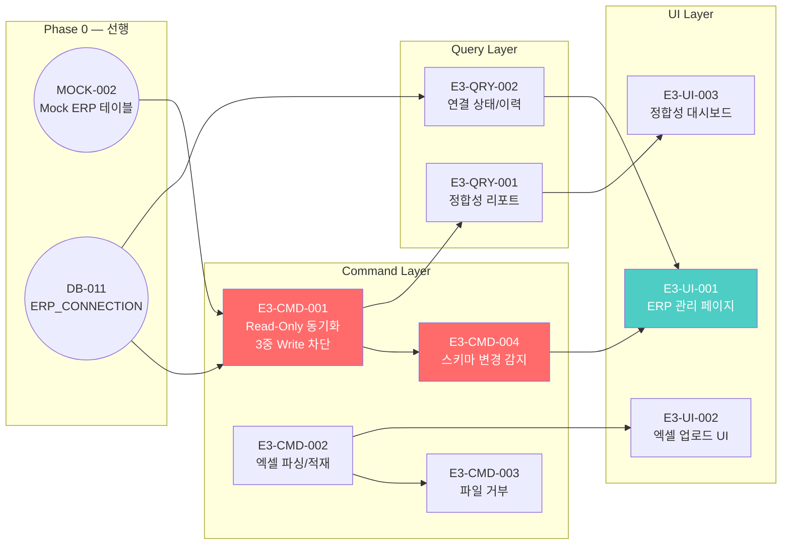

# FactoryAI — E3 ERP 비파괴형 브릿지 Issues (E3-CMD-001 ~ E3-UI-003)

> **Source**: SRS-002 Rev 2.0 (V0.8) — E3 ERP 비파괴형 브릿지  
> **작성일**: 2026-04-19  
> **총 Issue**: 9건 (Command 4건 + Query 2건 + UI 3건)  
> **목적**: 기존 더존 iCUBE/영림원 ERP를 **한 바이트도 변경하지 않고** Read-Only로 데이터를 동기화하며, 엑셀 수동 임포트 우회 경로도 확보한다.

> [!IMPORTANT]
> E3 Epic의 절대 불변 원칙: **Write 차단 3중 방어** (CON-02)  
> ① TypeScript 인터페이스 레벨 — Read-Only 타입 강제  
> ② Prisma Middleware 레벨 — ERP 모델 Write 인터셉트 → 즉시 차단 + 감사 로그  
> ③ Supabase RLS 레벨 — Mock ERP 테이블 Write 정책 Deny  
> 이 3중 방어 중 하나라도 미구현 시 **DoD 미충족**.

---

## E3-CMD-001: [Command] Mock ERP Read-Only 동기화 구현

---
name: Feature Task
about: SRS 기반의 구체적인 개발 태스크 명세
title: "[Feature/E3] E3-CMD-001: Mock ERP Read-Only 동기화 (Write 시스템 레벨 차단)"
labels: 'feature, backend, security, priority:must, epic:e3-erp-bridge'
assignees: ''
---

### :dart: Summary
- **기능명**: [E3-CMD-001] Mock ERP 테이블 Read-Only 동기화
- **목적**: MOCK-002에서 생성된 Mock ERP 테이블(MockErp_Inventory, MockErp_PurchaseOrder, MockErp_ProductionResult)의 데이터를 FactoryAI 내부 테이블로 Read-Only 동기화한다. **Write 시도는 3중 방어로 원천 차단**하여, CIO가 "ERP 데이터 한 바이트도 안 건드린다"를 확신할 수 있게 한다.

### :link: References (Spec & Context)
> :bulb: AI Agent & Dev Note: 작업 시작 전 아래 문서를 반드시 먼저 Read/Evaluate 할 것.
- SRS 문서: REQ-FUNC-019 (비파괴형 동기화)
- 제약사항: CON-02 (Read-Only), ADR-2 (비파괴형 브릿지)
- API 계약: [`10_Issues_API-001_to_API-019.md`](file:///c:/Antigravity_Workspace/SRS%20from%20PRD_RPA%20Saas/Tasks/10_Issues_API-001_to_API-019.md) — API-006
- Mock ERP: [`11_Issues_MOCK-001_to_MOCK-010.md`](file:///c:/Antigravity_Workspace/SRS%20from%20PRD_RPA%20Saas/Tasks/11_Issues_MOCK-001_to_MOCK-010.md) — MOCK-002
- 시퀀스: §3.4.3 ERP 동기화 시퀀스

### :white_check_mark: Task Breakdown (실행 계획)
- [ ] **1.** `lib/erp/erp-connector.ts` — ERP 커넥터 코어:
  ```typescript
  export class ErpConnector {
    private readonly allowedTables: string[];
    
    constructor(connection: ErpConnection) {
      this.allowedTables = connection.approved_tables; // CISO 승인 테이블만
    }
    
    async syncAll(): Promise<SyncResult> {
      const results: TableSyncResult[] = [];
      for (const table of this.allowedTables) {
        const data = await this.readTable(table);
        const mapped = this.mapToInternal(table, data);
        await this.upsertInternal(mapped);
        results.push({ table, records: data.length, status: 'SYNCED' });
      }
      return { sync_id: uuid(), results, synced_at: new Date() };
    }
    
    private async readTable(tableName: string): Promise<Record<string, unknown>[]> {
      // SELECT ONLY — Write 메서드 없음 (타입 레벨 강제)
      return prisma.$queryRawUnsafe(`SELECT * FROM "${tableName}"`);
    }
  }
  ```
- [ ] **2.** **Write 차단 — 1차: TypeScript 인터페이스**:
  ```typescript
  // ReadOnly 전용 인터페이스 — create/update/delete 메서드 미존재
  interface ErpReadOnlyClient {
    findMany(table: string): Promise<unknown[]>;
    findUnique(table: string, where: unknown): Promise<unknown>;
    // create, update, delete 의도적 미정의
  }
  ```
- [ ] **3.** **Write 차단 — 2차: Prisma Middleware**:
  ```typescript
  // lib/erp/erp-write-guard.ts
  export const erpWriteGuardMiddleware: Prisma.Middleware = async (params, next) => {
    const erpModels = ['MockErp_Inventory', 'MockErp_PurchaseOrder', 'MockErp_ProductionResult'];
    if (erpModels.includes(params.model ?? '')) {
      if (['create', 'update', 'delete', 'createMany', 'updateMany', 'deleteMany'].includes(params.action)) {
        // 즉시 차단
        securityEventEmitter.emit('security', {
          type: 'WRITE_BLOCKED',
          severity: 'CRITICAL',
          resource: `ERP.${params.model}.${params.action}`,
        });
        throw new Error(`[WRITE_BLOCKED] ERP 테이블 Write 절대 금지: ${params.model}.${params.action}`);
      }
    }
    return next(params);
  };
  ```
- [ ] **4.** **Write 차단 — 3차: Supabase RLS** (SQL 마이그레이션):
  ```sql
  -- Mock ERP 테이블에 Write 차단 RLS 정책
  ALTER TABLE "MockErp_Inventory" ENABLE ROW LEVEL SECURITY;
  CREATE POLICY "erp_read_only" ON "MockErp_Inventory"
    FOR ALL USING (true)
    WITH CHECK (false);  -- INSERT/UPDATE 항상 거부
  ```
- [ ] **5.** `POST /api/v1/erp/sync` Route Handler (API-006 DTO 준수):
  ```typescript
  export async function POST(req: Request) {
    const user = await getServerUser();
    // ADMIN만 동기화 실행 가능
    const connector = new ErpConnector(await getErpConnection(user.factory_id));
    const result = await connector.syncAll();
    // ERP_SYNC_LOG 기록
    return Response.json(result, { status: 200 });
  }
  ```
- [ ] **6.** 동기화 결과를 `ERP_SYNC_LOG` 테이블에 기록 (DB-012)
- [ ] **7.** 동기화 간격 제한: 최소 5분 간격 (연속 요청 차단)

### :test_tube: Acceptance Criteria (BDD/GWT)

**Scenario 1: Read-Only 정상 동기화**
- **Given**: MOCK-002의 Mock ERP 데이터 65건이 존재한다
- **When**: `POST /api/v1/erp/sync`를 호출한다
- **Then**: 200 + `{ sync_status: "SYNCED", records_count: 65 }` 반환. 내부 테이블에 데이터 적재.

**Scenario 2: Write 시도 → 3중 차단**
- **Given**: 코드 버그 등으로 ERP 테이블에 `prisma.mockErp_Inventory.create()`가 호출된다
- **When**: Prisma Middleware가 실행된다
- **Then**: ①즉시 차단(에러 throw) ②`WRITE_BLOCKED` CRITICAL 보안 이벤트 발행 ③CISO 알림 ≤10초 ④감사 로그 기록

**Scenario 3: 미승인 테이블 접근 차단**
- **Given**: `approved_tables`에 포함되지 않은 `MockErp_SecretTable`이 있다
- **When**: 동기화 시 해당 테이블 접근을 시도한다
- **Then**: 400 + `UNAPPROVED_TABLE` 에러. 해당 테이블 데이터 조회 0건.

**Scenario 4: 5분 미만 재동기화 차단**
- **Given**: 직전 동기화가 3분 전에 완료되었다
- **When**: 다시 동기화를 요청한다
- **Then**: 429 + `SYNC_COOLDOWN` + 남은 대기 시간 반환

### :gear: Technical & Non-Functional Constraints
- **Write 3중 차단**: TS 인터페이스 + Prisma Middleware + Supabase RLS (하나라도 누락 시 DoD 미충족)
- **성능**: 65건 동기화 ≤10초, 향후 1만건까지 ≤60초
- **CISO 승인 테이블만**: `ERP_CONNECTION.approved_tables` 외 테이블 접근 불가
- **감사 추적**: 모든 동기화 실행/차단 이벤트 AUDIT_LOG 기록

### :checkered_flag: Definition of Done (DoD)
- [ ] Read-Only 동기화 정상 동작 (65건 적재)
- [ ] **Write 3중 차단 테스트**: TS 컴파일 에러 + Middleware 차단 + RLS 거부 모두 확인
- [ ] CISO 알림 연동 (Write 시도 시)
- [ ] 5분 쿨다운 동작 확인
- [ ] 감사 로그 기록 확인
- [ ] ESLint 경고 0건

### :construction: Dependencies & Blockers
- **Depends on**: `MOCK-002` (Mock ERP 테이블), `DB-011` (ERP_CONNECTION), `AUTH-002` (RBAC)
- **Blocks**: `E3-CMD-004` (스키마 변경 감지), `E3-QRY-001` (정합성 리포트), `E3-UI-001`

---

## E3-CMD-002: [Command] 엑셀 드래그&드롭 파싱 + 적재

---
name: Feature Task
title: "[Feature/E3] E3-CMD-002: 엑셀(.xlsx/.csv) 드래그&드롭 업로드 → 자동 파싱/적재"
labels: 'feature, backend, priority:must, epic:e3-erp-bridge'
assignees: ''
---

### :dart: Summary
- **기능명**: [E3-CMD-002] 엑셀 파일 업로드 자동 파싱/적재
- **목적**: ERP 직접 연동이 불가능한 상황(장애, 보안 제약 등)에서, 현장 관리자가 ERP에서 내보낸 엑셀 파일을 드래그&드롭으로 업로드하면 자동 파싱하여 LOG_ENTRY 또는 내부 테이블에 적재한다.

### :link: References (Spec & Context)
- SRS: REQ-FUNC-020 (엑셀 임포트 우회 경로)
- API: API-007 (`POST /api/v1/erp/excel-import`)

### :white_check_mark: Task Breakdown (실행 계획)
- [ ] **1.** `app/api/v1/erp/excel-import/route.ts` — FormData 수신 Route Handler
- [ ] **2.** 파일 검증 (Zod):
  - MIME: `application/vnd.openxmlformats-officedocument.spreadsheetml.sheet` 또는 `text/csv`
  - 크기: ≤ 50MB (E3-CMD-003에서 초과 시 거부)
  - 인코딩: UTF-8, EUC-KR 자동 감지
- [ ] **3.** `xlsx` 라이브러리로 파싱:
  ```typescript
  import * as XLSX from 'xlsx';
  
  const workbook = XLSX.read(buffer, { type: 'buffer' });
  const sheet = workbook.Sheets[workbook.SheetNames[0]];
  const rows = XLSX.utils.sheet_to_json<Record<string, unknown>>(sheet);
  ```
- [ ] **4.** 컬럼 자동 매핑 로직:
  | 엑셀 컬럼명 (한글) | 내부 필드 | 타입 |
  |:---|:---|:---|
  | 품목코드 | item_code | string |
  | 품목명 | item_name | string |
  | 수량 | quantity | number |
  | 일자 | date | Date |
  | 비고 | remarks | string? |
- [ ] **5.** 파싱 결과를 `LOG_ENTRY` (`source_type=EXCEL_BATCH`) 로 적재:
  ```typescript
  await prisma.logEntry.createMany({
    data: rows.map(row => ({
      source_type: 'EXCEL_BATCH',
      raw_data: row,
      status: 'PENDING',
      captured_at: row.date || new Date(),
      work_order_id: matchWorkOrder(row),
    })),
  });
  ```
- [ ] **6.** 파싱 결과 요약 반환:
  ```json
  {
    "total_rows": 45,
    "parsed_rows": 43,
    "failed_rows": 2,
    "failures": [
      { "row": 12, "reason": "수량 필드 숫자 아님", "raw": "스물다섯" },
      { "row": 38, "reason": "일자 형식 인식 불가", "raw": "어제" }
    ]
  }
  ```

### :test_tube: Acceptance Criteria (BDD/GWT)

**Scenario 1: 정상 엑셀 파싱**
- **Given**: 45행 × 5열의 정상 .xlsx 파일
- **When**: `POST /api/v1/erp/excel-import`에 업로드한다
- **Then**: ≤30초 내 파싱 완료. `parsed_rows=45`, `failed_rows=0`. LOG_ENTRY 45건 적재.

**Scenario 2: 일부 파싱 실패 (비정형 데이터)**
- **Given**: 45행 중 2행에 한글 숫자("스물다섯")가 포함
- **When**: 파싱을 시도한다
- **Then**: `parsed_rows=43`, `failed_rows=2`. 실패 행 번호 + 사유 반환. 성공 행은 정상 적재.

**Scenario 3: CSV 파일 EUC-KR 인코딩**
- **Given**: EUC-KR 인코딩된 .csv 파일
- **When**: 업로드한다
- **Then**: 자동 인코딩 감지 → UTF-8 변환 → 한글 깨짐 없이 정상 파싱

### :gear: Technical & Non-Functional Constraints
- **파싱 정확도**: ≥ 95% (정형 엑셀 기준)
- **성능**: ≤ 30초/파일 (50MB 기준)
- **인코딩**: UTF-8, EUC-KR 자동 감지 (iconv-lite)

### :checkered_flag: Definition of Done (DoD)
- [ ] .xlsx + .csv 양쪽 파싱 정상 동작
- [ ] EUC-KR 자동 감지 + 변환 확인
- [ ] 파싱 실패 행의 상세 에러 리포트 반환
- [ ] ≤30초 성능 테스트 통과

### :construction: Dependencies & Blockers
- **Depends on**: `DB-007` (LOG_ENTRY), `AUTH-002`
- **Blocks**: `E3-CMD-003` (거부 로직), `E3-UI-002` (업로드 UI)

---

## E3-CMD-003: [Command] 50MB 초과 / 비표준 파일 거부

---
name: Feature Task
title: "[Feature/E3] E3-CMD-003: 50MB 초과/비표준 인코딩 파일 즉시 거부 (≤3초, 크래시 0건)"
labels: 'feature, backend, priority:should, epic:e3-erp-bridge'
assignees: ''
---

### :dart: Summary
- **기능명**: [E3-CMD-003] 비정상 파일 사전 차단
- **목적**: REQ-FUNC-023 대응. 50MB 초과, 비지원 형식(.hwp, .pdf 등), 비표준 인코딩 파일이 업로드될 때, ≤3초 내에 명확한 에러 메시지와 함께 거부한다. **서버 크래시 0건** 보장.

### :white_check_mark: Task Breakdown (실행 계획)
- [ ] **1.** E3-CMD-002 Route Handler 진입 직후 사전 검증 게이트:
  ```typescript
  // 1. 파일 크기 검증
  if (file.size > 50 * 1024 * 1024) {
    return mockError(400, 'FILE_TOO_LARGE', `파일 크기 ${(file.size / 1024 / 1024).toFixed(1)}MB — 최대 50MB`);
  }
  // 2. MIME 타입 검증 (확장자 스푸핑 방어)
  if (!ALLOWED_MIMES.includes(file.type)) {
    return mockError(400, 'UNSUPPORTED_FORMAT', `지원: .xlsx, .csv / 현재: ${file.type}`);
  }
  // 3. 매직 바이트 검증 (바이너리 헤더 확인)
  ```
- [ ] **2.** 에러 메시지 한국어 포맷:
  - `파일이 너무 큽니다 (52.3MB). 최대 50MB까지 업로드 가능합니다.`
  - `지원되지 않는 파일 형식입니다 (.hwp). .xlsx 또는 .csv 형식으로 변환 후 다시 시도해 주세요.`
- [ ] **3.** 성능 보장: 검증은 파일 본문 파싱 **전**에 실행 (헤더만 검사)

### :test_tube: Acceptance Criteria (BDD/GWT)
**Scenario 1**: 55MB .xlsx → 400 + `FILE_TOO_LARGE` (≤3초)  
**Scenario 2**: .hwp → 400 + `UNSUPPORTED_FORMAT` + 대안 안내  
**Scenario 3**: 확장자 .xlsx이나 실제 PDF인 스푸핑 파일 → 400 + `INVALID_FILE_CONTENT`

### :construction: Dependencies & Blockers
- **Depends on**: `E3-CMD-002`
- **Blocks**: 없음 (방어 레이어)

---

## E3-CMD-004: [Command] ERP 스키마 변경 감지 + 동기화 중단 + CIO 알림

---
name: Feature Task
title: "[Feature/E3] E3-CMD-004: ERP 스키마 변경 감지 → 동기화 자동 중단 + CIO 알림 ≤1분"
labels: 'feature, backend, security, priority:must, epic:e3-erp-bridge'
assignees: ''
---

### :dart: Summary
- **기능명**: [E3-CMD-004] ERP 스키마 변경 감지 및 방어
- **목적**: ERP 측(더존 iCUBE)에서 테이블 구조를 변경(컬럼 추가/삭제/타입 변경)했을 때, 동기화가 깨진 데이터를 적재하는 것을 방지한다. 변경 감지 시 즉시 동기화를 중단하고, CIO에게 ≤1분 내 알림을 발송한다.

### :link: References (Spec & Context)
- SRS: REQ-FUNC-022 (스키마 변경 감지 → 중단 + CIO 알림)
- 시퀀스: §3.4.3 ERP 동기화 시퀀스 (alt: 스키마 변경 감지)

### :white_check_mark: Task Breakdown (실행 계획)
- [ ] **1.** `lib/erp/schema-validator.ts` — 스키마 스냅샷 비교기:
  ```typescript
  export async function detectSchemaChanges(
    connection: ErpConnection
  ): Promise<SchemaChangeResult> {
    const currentSchema = await introspectSchema(connection.approved_tables);
    const savedSnapshot = await loadSchemaSnapshot(connection.id);
    
    const diff = compareSchemas(currentSchema, savedSnapshot);
    
    if (diff.hasChanges) {
      return {
        changed: true,
        changes: diff.changes, // [{ type: 'COLUMN_ADDED', table, column, ... }]
      };
    }
    return { changed: false };
  }
  ```
- [ ] **2.** 스키마 인트로스펙션 (`information_schema` 조회):
  ```sql
  SELECT column_name, data_type, is_nullable, character_maximum_length
  FROM information_schema.columns
  WHERE table_name = $1
  ORDER BY ordinal_position;
  ```
- [ ] **3.** 스냅샷 저장/로드: `data/erp-schema-snapshots/{connection_id}.json`
- [ ] **4.** 변경 감지 시 처리:
  - ① 동기화 즉시 중단 (throw)
  - ② CIO 알림 (NOTI-001, severity=CRITICAL):
    ```
    [🔧 ERP 스키마 변경 감지]
    테이블: MockErp_Inventory
    변경 내역:
    - 컬럼 추가: batch_number (VARCHAR(50))
    - 타입 변경: qty_on_hand (INT → BIGINT)
    동기화가 자동 중단되었습니다. IT팀 확인 후 재승인해 주세요.
    ```
  - ③ 감사 로그 기록 (`SCHEMA_CHANGED` 이벤트)
  - ④ `ERP_CONNECTION.status`를 `SCHEMA_MISMATCH`로 업데이트
- [ ] **5.** E3-CMD-001 동기화 시작 전 스키마 검증을 반드시 선행

### :test_tube: Acceptance Criteria (BDD/GWT)

**Scenario 1: 컬럼 추가 감지**
- **Given**: Mock ERP Inventory에 `batch_number` 컬럼이 추가되었다
- **When**: 동기화를 시도한다
- **Then**: ①동기화 중단 ②`SCHEMA_CHANGED` 에러 ③CIO 알림 ≤1분 ④0건 적재 (손상 방지)

**Scenario 2: 스키마 정상 — 동기화 진행**
- **Given**: 스냅샷과 현재 스키마가 동일하다
- **When**: 동기화를 시도한다
- **Then**: 정상 동기화 진행

**Scenario 3: CIO 재승인 후 동기화 재개**
- **Given**: `SCHEMA_MISMATCH` 상태이다
- **When**: CIO가 새 스키마를 확인하고 재승인(스냅샷 갱신)한다
- **Then**: 동기화 가능 상태로 복귀

### :gear: Technical & Non-Functional Constraints
- **CIO 알림 SLA**: ≤ 1분
- **데이터 손상 0건**: 변경 감지 시 단 1건도 적재하지 않음
- **스냅샷**: MOCK-002에서 최초 스냅샷 생성 (기준점)

### :checkered_flag: Definition of Done (DoD)
- [ ] 컬럼 추가/삭제/타입 변경 3종 감지 테스트 통과
- [ ] 동기화 중단 → 0건 적재 확인
- [ ] CIO 알림 ≤1분 E2E 확인
- [ ] 재승인 후 복구 플로우 동작

### :construction: Dependencies & Blockers
- **Depends on**: `E3-CMD-001`, `NOTI-001`, `MOCK-002` (초기 스냅샷)
- **Blocks**: `E3-UI-001` (스키마 차이 경고 표시)

---

## E3-QRY-001: [Query] 정합성 리포트 조회 API

---
name: Feature Task
title: "[Feature/E3] E3-QRY-001: 정합성 리포트 — ERP vs FactoryAI 불일치율 조회"
labels: 'feature, backend, query, priority:should, epic:e3-erp-bridge'
assignees: ''
---

### :dart: Summary
- **기능명**: [E3-QRY-001] 정합성 리포트 조회
- **목적**: ERP에서 동기화한 데이터와 FactoryAI 내부 데이터 간 불일치(Mismatch)를 자동 대조하여, 불일치율(%)과 상세 불일치 항목을 보고한다.

### :link: References (Spec & Context)
- SRS: REQ-FUNC-021 (불일치율 ≤2%)
- API: API-008 (`GET /api/v1/erp/consistency-report`)

### :white_check_mark: Task Breakdown (실행 계획)
- [ ] **1.** `GET /api/v1/erp/consistency-report` Route Handler
- [ ] **2.** 대조 로직:
  - ERP 원본(MockErp_*) vs FactoryAI 내부 사본 비교
  - 필드별 비교: 수량, 금액, 일자, 품목코드
  - 불일치 건 추출:
    ```typescript
    interface MismatchItem {
      table: string;
      record_id: string;
      field: string;
      erp_value: unknown;
      factoryai_value: unknown;
      mismatch_type: 'VALUE_DIFF' | 'MISSING_IN_ERP' | 'MISSING_IN_FACTORYAI';
    }
    ```
- [ ] **3.** 불일치율 계산: `(불일치 건수 / 전체 레코드) × 100`
- [ ] **4.** 응답 DTO:
  ```json
  {
    "total_records": 65,
    "matched": 64,
    "mismatched": 1,
    "mismatch_rate": 1.54,
    "target_rate": 2.0,
    "status": "WITHIN_TARGET",
    "mismatches": [...]
  }
  ```

### :test_tube: Acceptance Criteria (BDD/GWT)

**Scenario 1: 불일치율 ≤2%**
- **Given**: 65건 중 1건 불일치
- **When**: 정합성 리포트를 조회한다
- **Then**: `mismatch_rate=1.54%`, `status=WITHIN_TARGET`

**Scenario 2: 불일치율 >2%**
- **Given**: 65건 중 5건 불일치
- **When**: 조회한다
- **Then**: `mismatch_rate=7.69%`, `status=EXCEEDS_TARGET`, CIO 알림 자동 발송

### :construction: Dependencies & Blockers
- **Depends on**: `E3-CMD-001`, `AUTH-002`
- **Blocks**: `E3-UI-003` (정합성 대시보드)

---

## E3-QRY-002: [Query] ERP 연결 상태/동기화 이력 조회

---
name: Feature Task
title: "[Feature/E3] E3-QRY-002: ERP 연결 상태 + 동기화 이력 조회"
labels: 'feature, backend, query, priority:low, epic:e3-erp-bridge'
assignees: ''
---

### :dart: Summary
- **목적**: ERP 연결 상태(CONNECTED / DISCONNECTED / SCHEMA_MISMATCH)와 과거 동기화 이력(성공/실패/건수/소요시간)을 조회하여 ERP 관리 페이지에 공급한다.
- **실행**: `GET /api/v1/erp/status` + `GET /api/v1/erp/sync-history?page=1&limit=20`
- **DTO**: `ERP_CONNECTION` + `ERP_SYNC_LOG` 조인 조회

### :construction: Dependencies & Blockers
- **Depends on**: `DB-011` (ERP_CONNECTION), `AUTH-002`
- **Blocks**: `E3-UI-001` (연결 상태 표시)

---

## E3-UI-001: [UI] ERP 연동 관리 페이지

---
name: Feature Task
title: "[Feature/E3] E3-UI-001: ERP 연동 관리 페이지 (연결 상태 + 동기화 + 스키마 경고)"
labels: 'feature, frontend, ui, priority:must, epic:e3-erp-bridge'
assignees: ''
---

### :dart: Summary
- **기능명**: [E3-UI-001] ERP 연동 관리 메인 페이지
- **목적**: ADMIN이 ERP 연결 상태를 모니터링하고, 수동 동기화를 실행하며, 스키마 변경 경고를 확인하는 관리 대시보드.

### :white_check_mark: Task Breakdown (실행 계획)
- [ ] **1.** 페이지 경로: `/dashboard/erp`
- [ ] **2.** **연결 상태 카드**:
  - 🟢 CONNECTED (정상) / 🟡 SCHEMA_MISMATCH (경고) / 🔴 DISCONNECTED (장애)
  - 마지막 동기화 시간 + 레코드 수
  - 승인 테이블 목록 표시
- [ ] **3.** **수동 동기화 버튼**:
  - 클릭 시 `POST /api/v1/erp/sync` 호출
  - 진행률 표시 (AI-003 컴포넌트 활용)
  - 5분 쿨다운 카운터
- [ ] **4.** **스키마 변경 경고 배너** (E3-CMD-004 발동 시):
  ```
  ⚠️ ERP 스키마 변경이 감지되었습니다
  테이블: MockErp_Inventory
  변경: batch_number 컬럼 추가
  [상세 보기] [스키마 재승인]
  ```
- [ ] **5.** **동기화 이력 테이블** (E3-QRY-002):
  | 일시 | 상태 | 레코드 수 | 소요 시간 | 실행자 |
  |:---|:---:|:---:|:---:|:---|
  | 04-19 09:00 | ✅ 성공 | 65건 | 1.2초 | 한성우(ADMIN) |
  | 04-18 14:30 | ❌ 실패 | 0건 | — | System (스키마 변경) |

### :test_tube: Acceptance Criteria (BDD/GWT)

**Scenario 1: 정상 상태 대시보드**
- **Given**: ERP가 CONNECTED 상태이다
- **When**: `/dashboard/erp`에 접근한다
- **Then**: 🟢 상태 + 마지막 동기화 정보 + 동기화 버튼 활성

**Scenario 2: 스키마 변경 경고**
- **Given**: `SCHEMA_MISMATCH` 상태이다
- **When**: 페이지를 로드한다
- **Then**: 🟡 경고 + 빨간 배너 + 동기화 버튼 비활성 + "재승인 필요" 안내

### :construction: Dependencies & Blockers
- **Depends on**: `MOCK-010` (Mock sync API), `E3-QRY-002`
- **Blocks**: 없음

---

## E3-UI-002: [UI] 엑셀 드래그&드롭 업로드 UI

---
name: Feature Task
title: "[Feature/E3] E3-UI-002: 엑셀 드래그&드롭 업로드 + 파싱 결과 미리보기"
labels: 'feature, frontend, ui, priority:must, epic:e3-erp-bridge'
assignees: ''
---

### :dart: Summary
- **기능명**: [E3-UI-002] 엑셀 업로드 UI
- **목적**: ERP 직접 연동 불가 시 우회 경로. 파일을 드래그&드롭하면 파싱 결과를 DataTable로 미리보기하고, 확인 후 적재한다.

### :white_check_mark: Task Breakdown (실행 계획)
- [ ] **1.** Dropzone 컴포넌트 (`react-dropzone` 또는 네이티브 DnD API)
- [ ] **2.** 파일 선택 후 즉시 E3-CMD-002 API 호출
- [ ] **3.** 파싱 결과 미리보기 DataTable:
  - 정상 행: 기본 배경
  - 파싱 실패 행: 🔴 빨간 배경 + 에러 사유 컬럼
  - 하단 요약: `총 45행 / 정상 43행 / 실패 2행`
- [ ] **4.** 에러 행 수정 기능 (인라인 편집 → 재파싱 요청)
- [ ] **5.** `[적재 확인]` 버튼 → 정상 행만 DB 적재 + 실패 행 스킵 확인
- [ ] **6.** 50MB 초과 / 형식 오류 시 에러 토스트 즉시 표시 (E3-CMD-003 연동)

### :test_tube: Acceptance Criteria (BDD/GWT)

**Scenario 1: 정상 엑셀 업로드 → 미리보기**
- **Given**: 45행 정상 .xlsx 파일을 드래그&드롭한다
- **When**: 파싱이 완료된다
- **Then**: 45행 DataTable이 렌더링되고, 모든 행이 녹색 체크 표시

**Scenario 2: 50MB 초과 파일**
- **Given**: 55MB .xlsx 파일을 드래그&드롭한다
- **When**: 즉시 (≤3초)
- **Then**: "파일이 너무 큽니다 (55MB). 최대 50MB" 에러 토스트. 업로드 미진행.

### :construction: Dependencies & Blockers
- **Depends on**: `E3-CMD-002`
- **Blocks**: 없음

---

## E3-UI-003: [UI] 정합성 리포트 대시보드

---
name: Feature Task
title: "[Feature/E3] E3-UI-003: 정합성 리포트 대시보드 (불일치율 시각화)"
labels: 'feature, frontend, ui, priority:should, epic:e3-erp-bridge'
assignees: ''
---

### :dart: Summary
- **기능명**: [E3-UI-003] 정합성 리포트 대시보드
- **목적**: ERP 원본 vs FactoryAI 데이터 간 불일치율(%)을 게이지 차트로 시각화하고, 상세 불일치 항목을 DataTable로 드릴다운 조회한다.

### :white_check_mark: Task Breakdown (실행 계획)
- [ ] **1.** 불일치율 게이지 차트 (Recharts RadialBarChart):
  - 0~2%: 🟢 녹색 (목표 이내)
  - 2~5%: 🟡 노란색 (주의)
  - 5%+: 🔴 빨간색 (경고)
  - 목표선(2%) 점선 표시
- [ ] **2.** 불일치 항목 상세 DataTable:
  | 테이블 | 레코드 ID | 필드 | ERP 값 | FactoryAI 값 | 유형 |
  |:---|:---|:---|:---:|:---:|:---|
  | Inventory | SUS304 | qty_on_hand | 150 | 148 | VALUE_DIFF |
- [ ] **3.** 날짜 필터: 특정 동기화 시점 기준 리포트 선택
- [ ] **4.** 불일치 유형별 탭 필터: VALUE_DIFF / MISSING_IN_ERP / MISSING_IN_FACTORYAI

### :test_tube: Acceptance Criteria (BDD/GWT)

**Scenario 1: 목표 이내**
- **Given**: 불일치율 1.54%
- **When**: 리포트 페이지를 로드한다
- **Then**: 🟢 게이지 + "목표(2%) 이내" 텍스트 + 불일치 1건 상세

### :construction: Dependencies & Blockers
- **Depends on**: `E3-QRY-001`
- **Blocks**: 없음

---

## 전체 E3 의존성 그래프



### 권장 실행 순서

| 순서 | Task ID | 설명 | 예상 소요 |
|:---:|:---|:---|:---:|
| 1 | E3-CMD-001 | Read-Only 동기화 + 3중 Write 차단 | 4h |
| 2 | E3-CMD-004 | 스키마 변경 감지 | 2.5h |
| 3 | E3-CMD-002 | 엑셀 파싱/적재 | 3h |
| 4 | E3-CMD-003 | 파일 거부 로직 | 1h |
| 5 | E3-QRY-001 | 정합성 리포트 API | 2h |
| 6 | E3-QRY-002 | 연결 상태/이력 API | 1h |
| 7 | E3-UI-001 | ERP 관리 페이지 | 3h |
| 8 | E3-UI-002 | 엑셀 업로드 UI | 2h |
| 9 | E3-UI-003 | 정합성 대시보드 | 2h |
| | | **총 예상** | **~20.5h** |
