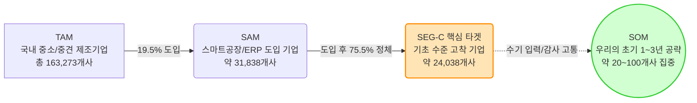
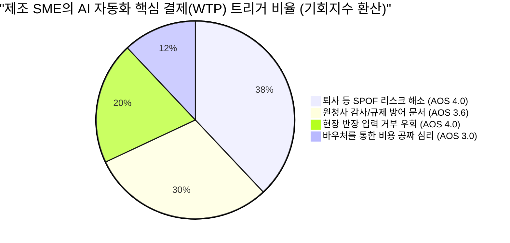
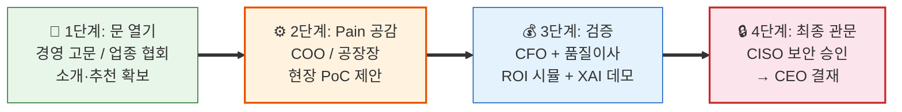

# Value Proposition Sheet (문제-해결 적합성 검증)
## 중소/중견 제조업 대상 AI 자동화 SI 및 SaaS 비즈니스

> **작성 목적**: 본격적인 신규 사업을 준비하는 예비창업자가 '우리는 어떤 고객에게 어떤 차별적 가치를 전달하는가?'를 명확히 정의하고, 시장 진입 전략의 나침반으로 활용하기 위한 통합 가치 제안서입니다.
> **검증 포인트**: 각 페르소나의 Pain Point가 구체적 솔루션(Feature)과 연결되어 실질적 효용(Outcome)으로 이어지는 '문제-해결-효과'의 완전성을 검증 및 시각화하였습니다.
> **핵심 시장 기회**: 국내 스마트공장 도입 기업의 75.5%가 기초 단계에 정체된 이른바 **'2차 자동화 공백(Second Automation Gap)'** — 데이터는 쌓이지만 활용하지 못하는 약 24,000개 기업이 본 사업의 핵심 타겟입니다.
> **버전**: v1.2 (Opus Update — 10개 분석 보고서 검토 결과 반영)
> **작성일**: 2026년 4월

---

## 1. Problem-Solution Fit: 고객별 가치 제안 (문제-해결-효과 매핑)

기존 기능 중심의 나열을 벗어나, 페르소나별 치명적 Pain이 어떻게 해결되고 어떤 정량적 효과를 내는지 명확히 매핑합니다. 4인의 핵심 이해관계자(DMU)가 모두 포함되어야 계약이 성사됩니다.

| 타겟 페르소나 (Pain 주체) | 직면한 문제 (Problem) | 핵심 제안 (Solution Feature) | 기대 효과 (Desired Outcome) |
| :--- | :--- | :--- | :--- |
| **공장장 / COO**<br>(현장운영)<br>AOS 4.0 · DOS 3.6 | **[단일 장애점 & 입력 거부]**<br>핵심 스케줄러 퇴사 시 공장이 멈추는 SPOF 리스크. 막대한 비용을 들여 MES 키오스크를 도입해도 작업자가 입력을 전면 거부. | **[무입력 로깅 & ERP 브릿지]**<br>작업자 개입(터치/타이핑) 없이 음성/Vision만으로 현장 데이터를 패시브하게 수집하고, **더존·영림원 ERP 전용 API 커넥터**를 통해 자동 연동 | **[운영 연속성 확보]**<br>- 현장 작업자 수기 입력 **0%**<br>- 1인 스케줄러 의존 탈피<br>- 불만 폭주 및 파업 리스크 제거 |
| **구매본부장 / 품질이사**<br>(규제/감사 대응)<br>AOS 4.0 · DOS 2.8 | **[규제 방어막의 부재]**<br>원청사의 기습적 품질 감사나 탄소/Traceability 제출 요구 시, 데이터가 분절되어 있어 며칠 밤을 새워 취합해도 조작 의심을 받음. 2026년부터 EU CBAM, 글로벌 원청사 공급망 실사 의무화. | **[원클릭 감사 리포터]**<br>연동된 데이터를 기반으로 원청사나 글로벌 규제가 요구하는 양식의 **적법 이력 증빙 PDF를 버튼 1회 추론으로 자동 생성**. AI 판단 근거를 XAI(설명 가능한 AI) 리포트로 제공 | **[생존권 및 신뢰 보장]**<br>- 감사 리포트 취합 시간 **90% 단축**<br>- 품질 원천 데이터 조작 의혹 소멸<br>- 즉각 제출로 납품 탈락 리스크 방어 |
| **CFO / CEO**<br>(비용 및 결재)<br>AOS 1.6(CFO) · 3.0(CEO) | **[정부 돈과 귀찮음 사이의 딜레마]**<br>AI 도입의 성공이 불확실한 상태에서 내부 자금(수천~억 단위)을 지출할 수 없음. 그러나 정부 바우처를 받자니 신청/보고 서류 등 행정 부담이 막대함. 과거 SI 실패 경험으로 **'투자 실패 공포'**가 가장 강력한 선행 장벽으로 작동. | **[행정 턴키 대행 & 전용 ROI 진단 & 공포 해소 패키지]**<br>중기부/과기부의 AX/제조 바우처 사업 선정을 위한 사업계획서 대행부터 평가/사후 관리까지 100% 밀착 수행. **PoC 성과 미달 시 전액 환불 보증** + 동종 업종 Before-After 비교 카드 + AI 적합성 사전 진단 체크리스트 제공 | **[WTP 저항 제거]**<br>- 도입 기업의 자부담 **최대 80%** 감축<br>- 사내 직원의 행정 투입 시간 **0시간**<br>- 명확한 재무적 회수(Payback) 확인<br>- **"실패해도 잃을 것 없다"**는 심리적 안전망 |
| **CISO / 정보보안책임자**<br>(보안 최종 관문)<br>AOS 1.0 · 평가점수 4.8 | **[클라우드 절대 불가의 벽]**<br>생산 노하우·공정 데이터의 퍼블릭 클라우드 저장 시 보안 감사 즉시 탈락. AI 도입을 허용하고 싶어도 현존하는 SaaS 솔루션의 데이터 외부 반출 구조를 정책적으로 허용 불가. **계약 직전 단독 거부권** 보유. | **[프라이빗 온프레미스 AI]**<br>데이터가 사내를 **한 바이트도 벗어나지 않는** 폐쇄망 전용 AI 패키지. 오프라인 패키지 배포로 모델 업데이트. **보안 준수 확인서** + ISMS 준거 체크리스트 사전 제출 | **[보안과 혁신의 공존]**<br>- 보안 감사 **100% 통과**<br>- CISO의 "명분 있는 혁신 허용" 달성<br>- 클라우드 거부 논리 무력화<br>- 외부 트래픽 **Zero** 검증 |

> [!IMPORTANT]
> **DMU 공략 필수 경로**: CISO는 AOS가 낮아 "기회"로 보이지 않지만, 페르소나 평가 **4.8점 최고점**을 기록한 **"숨은 최종 보스"**입니다. 이 관문을 통과하지 못하면 COO·CFO·품질이사의 모든 합의가 한 번에 무효화됩니다. On-premise 옵션은 선택이 아니라 **필수**입니다.

---

## 2. Value Proposition Sheet 종합 캔버스

| 항목 | 내용 |
| :--- | :--- |
| **핵심 페르소나 및 시장** | **SEG-C (스마트공장 기초 수료 기업)**: 데이터 인프라의 껍데기만 존재하고 실무 활용이 전혀 이루어지지 않는 약 24,038개의 '정체된 중기업' — 이른바 **'2차 자동화 공백(Second Automation Gap)'** 상태에 놓인 기업군. 이 중 생산 자동화 관련 업종 실질 타겟은 약 **1,900~2,500개사**. |
| **초세분화 타겟 (Vertical-First)** | '제조업 전체'가 아닌, **금속가공 또는 식품제조** 1~2개 공정에 완전히 특화. 해당 공정의 업무 로직을 경쟁자보다 먼저, 더 깊이 자산화하여 **도메인 데이터의 해자(Moat)**를 구축. |
| **우리 솔루션의 핵심 제안** | **"단 한 번의 키보드 입력 없이, 당장의 납품 규제를 통과시켜주는 정부 지원 AI 솔루션"**<br>결코 '10% 생산 효율화'라는 모호한 가치를 팔지 않음. 무입력, 원청사 규제 통과, 정부 바우처라는 강력한 생존/비용 프레이밍 제공. |
| **기존 대안 (Competitor)** | - **1세대 MES (수동)**: 작업자가 입력하지 않아 데이터 신뢰도가 바닥임.<br>- **국내 AI+RPA 전문사 (레인보우브레인·파워젠)**: 프로젝트 단가 수천만~억 원, 납품 2~6개월 소요. 중소기업엔 과도하게 무겁고 비쌈.<br>- **ERP 내장 AI (더존 ONE AI)**: 자사 ERP 경계 안에서만 작동 → 공장 현장(MES/설비/엑셀) 연동 불가.<br>- **클라우드 글로벌 AI (SAP 등)**: CISO(보안)가 허락하지 않는 데이터 유출 위험과 수십억의 예산 부담.<br>- **파워포인트/엑셀 (수기)**: 치명적인 휴먼 에러 창출, 담당자 부재 시 노하우 증발. |
| **우리가 제공하는 차별적 가치** | 1. **UX의 극한 (Zero Touch)**: 인간의 노력을 0으로 만드는 데이터 수집<br>2. **영업의 극한 (턴키 행정)**: 단순히 AI 소프트웨어가 아닌, 자금 조달 컨설팅(바우처)을 묶어 파는 '종합 가치'<br>3. **연동의 극한 (Plug & Play)**: 더존·영림원 ERP 전용 커넥터로 즉시 연결, **시스템 교체 Zero**. ERP 연동 커넥터를 먼저 만드는 업체가 고객 Lock-in을 통제<br>4. **보안의 극한 (Private AI)**: 데이터 한 바이트도 안 나가는 온프레미스 전용 패키지로 CISO 관문 무력화 |

---

## 3. Proof (차별적 가치 검증 데이터 및 시각화)

해당 비즈니스의 성공 가능성을 재무 투자자나 내부 팀원에게 설득하기 위해 사용할 수 있는 **핵심 정량 데이터 시각화**입니다. (TAM-SAM-SOM 보고서, JTBD 인터뷰, AOS/DOS 기회분석 산출물 기반)

### A. "이 시장은 정말 크고 타겟은 명확한가?" (TAM-SAM-SOM)
스마트공장 도입 후 '다음 단계(AI)'로 넘어가지 못하고 정체된 이른바 "ERP/MES 껍데기 기업"이라는 강력한 유효 시장(SAM)이 뒷받침합니다.



### B. "고객은 무엇 때문에 우리 AI를 사는가?" (JTBD / AOS 기반 구매 동인)
인터뷰 결과(총 14인), 중소 제조사 결정권자는 '생산성 10% 향상'과 같은 긍정적 지표보다 **'단일 장애점(퇴사) 공포 방어'와 '규제(감사) 회피'**라는 강력한 손실 회피 심리에 지갑을 엽니다.



### B-2. AOS/DOS 통합 기회 TOP 6 (인터뷰 검증 완료)

| Desired Outcome (고객의 언어) | Imp | Sat | AOS | MR | DOS | 검증 근거 |
|:---|:---:|:---:|:---:|:---:|:---:|:---|
| **O-1. 담당자 퇴사 시에도 공정 계획 수립 유지** | 5.0 | 1.0 | **4.0** | 0.9 | **3.6** | "과장 퇴사 트라우마" — JTBD Case 1 |
| **O-2. 현장 작업자 입력 없는 데이터 자동 로깅** | 5.0 | 1.0 | **4.0** | 0.8 | **3.2** | "키오스크 입력은 절대 안 함" |
| **O-3. 원청사 납품 감사용 이력 PDF 즉시 생성** | 4.8 | 1.2 | **3.6** | 0.7 | **2.5** | "밤샘 엑셀 취합 해방" — JTBD Case 2 |
| **O-4. 시스템 교체 없는 ERP-MES 데이터 브릿지** | 4.0 | 1.0 | **3.2** | 0.8 | **2.4** | "15억 전면 교체 외 대안 없음" |
| **O-5. 우리 회사 전용 ROI 분석 보고서 제공** | 4.5 | 1.5 | **3.0** | 0.6 | **1.8** | "남의 회사 ROI는 불신함" |
| **O-6. 데이터 외부 유출 Zero 온프레미스 보안** | 4.2 | 1.2 | **3.0** | 0.5 | **1.5** | "보안실장 승인 유일 조건" |

### C. 수치적 Proof 요약
- **생존 규제**: 2026년부터 EU CBAM(탄소 국경세), 글로벌 원청사(삼성, 현대차 공급망)의 파트 이력 추적성 실사가 의무화됨. 데이터 제출 불가 시 벤더 탈락이라는 막대한 압박.
- **예산 지원**: 중기부/과기부 주도 2026년 "제조 AX 사업" 할당 예산만 **4,230억 원** (중기부+과기부 합산). 고객사 자부담금 축소를 보장할 국비 자금줄이 확실히 존재함.
- **경쟁 공백**: 대형 SI(포스코DX, 미라콤)는 단가 불일치로 중소기업 미진입. 더존 ONE AI는 ERP 경계 밖 연동 불가. 레인보우브레인·파워젠은 납품 2~6개월로 중소기업엔 과중함.

---

## 4. MVP Feature Map (초기 기능 우선순위 설계)

Problem-Solution Fit에 입각하여, 초기 한정된 리소스는 Pain 해소에 가장 치명적인 상위 4개 기능(High Rank)에 80% 이상 전념해야 합니다. AOS/DOS 통합 점수를 근거로 우선순위를 산정하였습니다.

| 기능명 | 핵심 Job 연관성 (해결하는 문제) | AOS 합산 | 중요도 | 개발난이도 | 우선순위 | MVP 포함 |
| :--- | :--- | :---: | :---: | :---: | :---: | :---: |
| **1. ERP-MES API 자동 브릿지** | 데이터 사일로 해소 및 실무 이중 입력 방지. 더존·영림원 전용 커넥터 선점 → Lock-in | 7.2 | 5 | 3 | **High** | ✔️ |
| **2. 원클릭 납품 이력 감사 리포터** | 원청사 실사 대비 PDF 야근 및 조작 의혹 소멸. XAI 판단근거 시각화 포함 | 7.6 | 5 | 2 | **High** | ✔️ |
| **3. 무입력 패시브 센싱 로깅** | 현장 작업자 저항 해소 및 노하우 자동 기록. 카메라/센서/음성 기반 비접촉 수집 | 8.0 | 5 | 4 | **High** | ✔️ |
| **4. CFO 맞춤 진단/바우처 설계기** | 자부담 삭감 증명 + PoC 환불 보증으로 단기적 결재 방어 제거. 투자 실패 공포 해소 | 4.6 | 4 | 2 | **Mid** | ✔️ |
| **5. 온프레미스 보안 패키지** | CISO(보안팀)의 절대적 반대 논리 무력화. 폐쇄망 전용 + 보안 준수 확인서 | 4.2 | 4 | 3 | **Mid** | ✔️ |
| **6. 퇴사 헷지형 AI 공정 스케줄러** | 생산 공정 계획의 1인 두뇌 의존 탈피. 설명형 AI(결정 근거 제시) 포함 | 10.0 | 4 | 5 | Mid | ✖️ (Phase 2) |

> [!TIP]
> **Phase 순서의 논리**: Phase 1(MVP)은 '데이터 수집+리포팅'에 집중합니다. 이것이 먼저 들어가야 AI 스케줄러(Phase 2)의 학습 데이터가 쌓입니다. 스케줄러는 AOS 합산이 가장 높지만(10.0), 개발난이도(5)와 데이터 선행 필요성으로 Phase 2에 배치합니다.

---

## 5. 예비 창업자를 위한 비즈니스 실행 제언 (Actionable Tips)

> [!IMPORTANT]
> **전략 요약: 철저하게 '솔루션'이 아닌 '고통의 진통제'로 위장하십시오.**
> 
> 1. **「기술」을 팔지 말고 「공포 해소」와 「돈」을 파십시오.**
>    고객사 대표와 임원들은 AI 알고리즘의 최적화 수준이나 혁신성에는 관심이 없습니다. 오직 **"이 시스템을 쓰면 김 부장이 내일 관둬도 공장이 돌아간다," "다음 달 삼성전자 감사팀이 와도 1초 만에 서류를 준다," "구축 비용 8천만 원은 중기부가 내줍니다"**라는 강력한 3문장만이 결재 번호표를 뽑게 만듭니다.
> 
> 2. **세그먼트 징검다리 전략 (Beachhead Market)**
>    TAM-SAM 맵에서 확인된 **SEG-C (스마트공장 기초는 갖췄으나 활용하지 못해 고통받는 2만 4천 개 기업)**를 최우선 진입 시장으로 삼으십시오. 데이터 인프라가 엉망인 극소기업이나, 절차가 복잡한 대기업은 초기 현금흐름을 고갈시키는 주범입니다. 
> 
> 3. **관문의 파괴: 「트로이 목마 (바우처 대행사)」 전략**
>    소프트웨어의 완성도만큼 중요한 것은 **정부 지원 사업(AI 바우처 등)을 꿰뚫고 있는 행정 역량**입니다. 콜드 메일을 보낼 때 "우리 혁신 AI를 사세요"가 아니라, **"올해 귀사에 버려질 수 있는 중기부 현금 5천만 원 무상 지원금 확보, 저희가 서류 다 써드리겠습니다"**라고 접근하여 내부 도입의 심리적/재무적 장벽을 파괴하십시오.
>
> 4. **초세분화 공정 집중 (Vertical-First Strategy)**
>    '제조업 전체'를 공략하면 레인보우브레인(2,000건+ 프로젝트)이나 파워젠(20년 업력)의 범용 솔루션에 가격 경쟁으로 끌려갑니다. **금속가공 또는 식품제조** 1~2개 버티컬을 첫 타겟으로 고정하여, 해당 공정의 표준 업무 흐름(Standard Process Map)을 직접 현장에서 문서화하고 자산화하십시오. 도메인 깊이가 곧 경쟁 방어막입니다.
>
> 5. **투자 실패 공포 해소 패키지 (Fear-Killer)**
>    DX 프로젝트의 70%가 목표 미달(McKinsey), RPA 초기 프로젝트의 30~50%가 실패(Forrester)합니다. 바우처로 비용이 0원에 가깝게 내려가도 도입하지 않는 기업이 상당수 존재하는데, 이는 '비용 문제가 아닌 신뢰·검증 문제'입니다. 반드시 다음을 제공하십시오:
>    - **PoC 성과 미달 시 전액 환불 보증**
>    - **AI 적합성 사전 진단 체크리스트** ("이 5가지 조건 충족 시 성공률 80%")
>    - **동종 업종 Before-After 비교 카드**
>    - **업무 시간 절감 계산기** (업무 시간 입력 → 절감 금액 자동 산출)

---

## 6. 수익 구조 및 비즈니스 모델 설계 (왜 돈이 벌리는가?)

> 비즈니스의 수익성, 확장성, 지속가능성을 증명하는 가격 정책 및 과금 모델의 기초 설계입니다.

### A. 하이브리드 과금 모델 (Setup + MRR 구독형)
고객의 초기 도입 심리적 장벽(CAPEX 자부담)은 극소화하면서, 당사의 지속적 캐시플로우(MRR: Monthly Recurring Revenue)를 구축하는 수익 구조입니다.

1. **초기 구축비 (On-boarding & Setup)**: **약 5,000만 원 내외 (바우처 활용)**
   - 현장 Vision/음성 센서 최적화 세팅, ERP 연동 API 구축 등 솔루션 온보딩 비용.
   - **과금 전략**: 총 구축비의 80~90%를 정부 스마트공장 고도화/AX 바우처로 청구. 기업의 실제 자부담은 500~1,000만 원 수준으로 떨어져 결재 문턱이 극적으로 낮아짐.
2. **SaaS 구독료 (Recurring Revenue)**: **월 150~200만 원 (고객사 전액 자부담)**
   - 클라우드 인프라 파이프라인, AI 모델 토큰 비용, 그리고 수시로 바뀌는 원청사 'Traceability 규제 대응 포맷' 정기 업데이트 명목.

> [!WARNING]
> **바우처 의존 리스크**: 정부 예산 삭감 시 초기 구축비 모델이 붕괴될 수 있습니다. 포터 5가지 힘 분석(비관 시나리오)에서도 "정부 의존형 모델은 정책 변동에 취약"으로 경고됩니다. 따라서 **SaaS 구독료 기반의 자립 수익 구조를 Year 2부터 전체 매출의 30% 이상으로 끌어올리는** 것이 필수 생존 조건입니다. 바우처는 '채널'로만 활용하고, 사업의 본질은 반복 수익(MRR)에 둬야 합니다.

### B. 가격 수용성의 핵심 단초 (Pricing vs. Value)
"고객은 왜 초기 비용 외에도 매달 수백만 원을 기꺼이 지불하는가?"에 대한 명확한 재무적 답변(ROI)입니다.

* **Pain 1 기반 회수 (연 5,000만 원 방어)**: 이 시스템은 공장 스케줄이나 데이터를 한 사람이 쥐고 흔들다 퇴사했을 때 가동이 멈추는 리스크를 방어합니다. 숙련자 1인 대체에 투입되는 채용/기회비용(최소 연 5,000만 원) 대비, 본 솔루션의 월 유지비 150만 원은 현저히 저렴한 '경영 리스크 보험금'입니다.
* **Pain 2 기반 회수 (수억 원 대 벤더 탈락 방어)**: 삼성/현대차/해외원청사가 요구하는 탄소 이력이나 현장 실사 데이터를 내지 못하면 페널티를 물거나 다음 입찰에서 제외됩니다. 수억 원대 매출 증발을 막아주는 핵심 인프라이므로 월 150만 원이라는 가격 저항이 소멸됩니다.

### C. 리텐션(Lock-in)과 랜드 앤 익스팬드(Growth) 전략
* **교체 비용(Switching Cost)의 극대화**: 이 시스템을 해지하는 순간, 현장 작업자의 낡고 고통스러운 엑셀 수기 기록 야근이 다시 부활합니다. 즉, 현장 직원들이 '무입력 편의성'을 한 번 맛보게 되면, 관리자가 비용 절감을 위해 시스템을 내리는 것을 조직적으로 거부하는 강력한 Lock-in 이 발생합니다. 또한 ERP 연동 커넥터가 깊게 결합될수록 교체 비용이 기하급수적으로 상승합니다.
* **초기 침투 후 상향 판매 (Land & Expand)**: 1단계 '패시브 로깅+리포트'(핵심 MVP)로 바우처를 통해 거부감 없이 도입시킨 뒤 ➔ 2단계 공정 스케줄링 AI (월과금 인상) ➔ 3단계 품질 불량 탐지 XAI 모듈 추가 등 고부가 모듈을 지속적으로 Upsell하여 고객의 LTV(Customer Lifetime Value)를 극대화합니다.

### D. 3개년 SOM 시나리오 (10인 팀 기준)

```
Year 1:  2억~ 3억원   (SEG-C 4~6건 + SEG-A 10~15건)
Year 2:  5억~ 8.5억원  (SEG-C 확장 + SEG-B 진입)
Year 3: 12억~20억원   (SEG-D 1~2건 진입, MRR 30%↑)
────────────────────
누적 합계: 약 19억~31.5억원 (3년)
고객 1개사 3년 LTV: 약 1억 6,100만원 (SEG-C 기준)
```

---

## 7. 영업 진입 시퀀스 (Sales Critical Path)

> 중견기업(SEG-C/D) 영업은 '바우처로 공짜'만으로 안 됩니다. **'실패 시 담당자의 커리어 손실'을 어떻게 방어해줄 것인가**가 핵심입니다. 아래 4단계를 하나라도 건너뛰면 계약이 파기됩니다.



| 단계 | 대상 | 핵심 액션 | 제공 자료 |
|:---:|------|-----------|----------|
| **1** | 김가이드형 (경영 고문) / 박준호형 (TF장) | 유사 업종 PoC 성공 사례 1건(수치 포함) 공유 | 업종별 성공사례 1-Pager |
| **2** | 한성우형 (COO) ★최우선 / 소장님 (공장장) | 납기 대시보드 라이브 데모 + "3개월 무상 PoC" 제안 | 현장 동행 시연 + Before-After 비교 카드 |
| **3** | 이재무형 (CFO) + 차품질 (품질이사) | 정부 바우처 설계서 + 3년 ROI 시뮬레이션 + XAI 판단근거 데모 | CFO용 재무 계산기 + 품질이사용 블라인드 테스트 결과 |
| **4** | 최보안형 (CISO) → 강승현 (CEO) 최종 결재 | On-premise 아키텍처 설계서 + 보안 준수 확인서 사전 제출 | 망분리 다이어그램 + ISMS 준거 체크리스트 |

> [!CAUTION]
> **CISO는 마지막에 등장하지만 가장 위험합니다.** 도입 의지 최저(Non-user)이나 평가 점수 최고(4.8). 영업 프로세스 후반에 갑자기 등장해 전체를 무효화하는 '숨은 최종 보스'입니다. On-premise 옵션 준비 없이 영업을 시작하면 안 됩니다.

---

## 부록. 분석 보고서 연계 매핑

본 VPS의 각 섹션이 어떤 분석 보고서의 어떤 결론에 근거하는지를 추적할 수 있는 매핑표입니다.

| VPS 섹션 | 근거 보고서 | 핵심 인용/활용 |
|----------|-----------|--------------|
| §1 Problem-Solution Fit | ▶7 페르소나 스펙트럼, ▶9 AOS/DOS, ▶10 JTBD | 핵심 4인 DMU(COO·CFO·품질이사·CISO), Switch Trigger, 인터뷰 인용 |
| §2 종합 캔버스 | ▶2 경쟁사 브리핑, ▶3 가치사슬, ▶4 KSF, ▶5 문제정의서 | 경쟁사 차별화, Vertical-First, 2nd Automation Gap |
| §3 Proof | ▶6 TAM-SAM-SOM, ▶9 AOS/DOS, ▶10 JTBD | 시장 규모 모수, Outcome 기회점수, 인터뷰 검증 |
| §4 MVP Feature Map | ▶9 AOS/DOS §17 기능-페르소나 매핑 | AOS 합산 기반 우선순위, Phase 1/2 분리 논리 |
| §5 실행 제언 | ▶4 KSF, ▶5 문제정의서, ▶1 포터 5가지 힘 | KSF Top 5, 공포 해소, 시나리오 분석 |
| §6 수익 구조 | ▶6 TAM-SAM-SOM §7·§9, ▶1 포터 비관 시나리오 | SOM 3개년, LTV, 바우처 리스크 경고 |
| §7 영업 시퀀스 | ▶7 페르소나 §15 진입 시퀀스, ▶8 CJM 교차 분석 | Critical Path, CISO 관문, DMU 순서 |

---

*본 문서는 10개 분석 통합본(포터5가지힘·경쟁사브리핑·가치사슬·KSF·문제정의서·TAM-SAM-SOM·페르소나스펙트럼·고객여정지도·AOS-DOS기회분석·JTBD인터뷰)을 기반으로 작성된 Value Proposition Sheet 통합본입니다.*
*버전: v1.2 Opus Update / 작성일: 2026년 4월*
