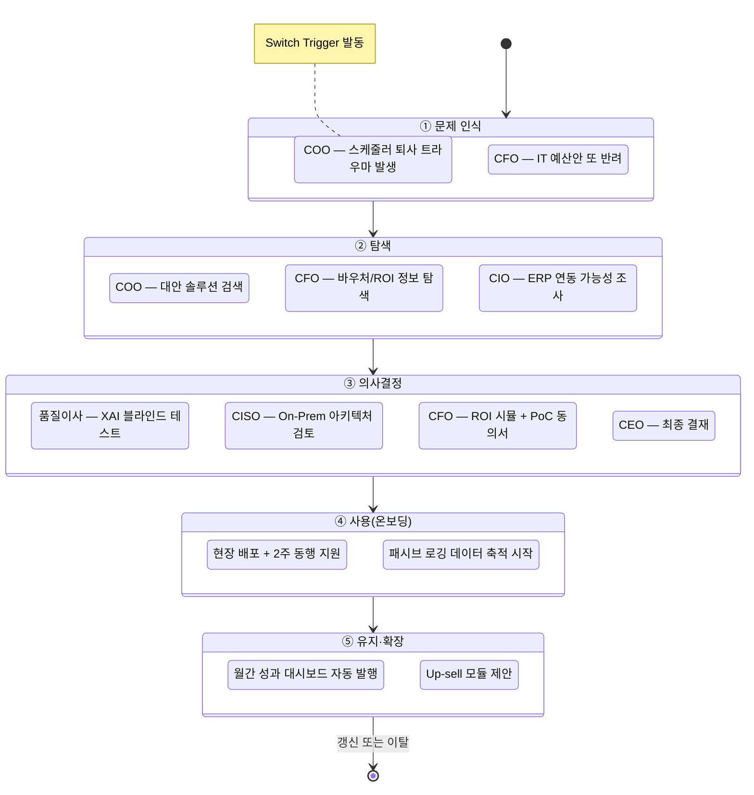
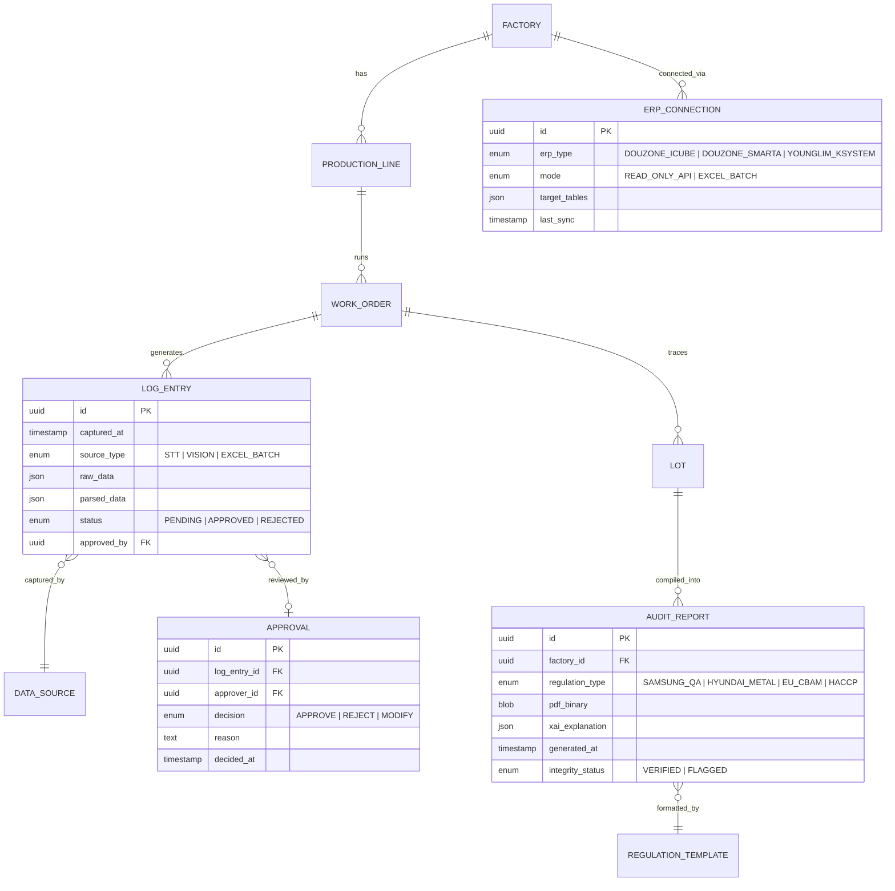
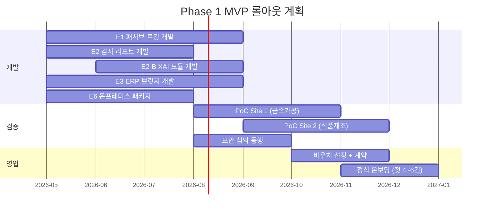

# 제조 AI 자동화 플랫폼 (FactoryAI) — PRD v0.1
- **Owner 팀**: 모두연 EGIGAE #5
- **최종 업데이트**: 2026-04-11
- **원천 문서**: VPS V3 Updated Final (`▶06_VPS_V3_Updated_1_20260411_final.md`)
- **상태**: Draft — 내부 리뷰 대기

---

## 1. 개요·목표

### 1-1. 문제 정의 (Pain 지표 포함)

국내 스마트공장 도입 기업의 **75.5%(≈24,038개사)**가 기초 단계에 정체되어 있다 (이하 '2차 자동화 공백').  
데이터 인프라(MES·ERP)는 설치되었으나 **현장 활용률 10% 미만**이며, 이로 인해 5가지 구조적 실패가 반복된다.

| # | Pain | 실패 KPI (현재 Baseline) | 출처 |
|---|------|------------------------|------|
| P1 | **SPOF**: 스케줄러 1인 퇴사 시 공장 마비 | 납기 지연 4~6건/월, 리스케줄링 3h+/회 | VPS §1-2 / JTBD Case 1 |
| P2 | **데이터 무용론**: MES 입력 거부 | MES 데이터 결측률 **40%+** | VPS §1-1 / 문제정의서 ▶5 |
| P3 | **규제 방어막 부재**: 감사 리포트 수작업 | 감사 취합 **48h+**, 데이터 불일치율 15%+ | VPS §1-2 / JTBD Case 2 |
| P4 | **레거시 사일로**: ERP-MES 분절 | 수동 데이터 결합 **월 40h+**, 정합성 오류 12%+ | VPS §1-2 |
| P5 | **보안 정책 장벽**: 클라우드 전면 불가 | SaaS AI 제안 거절률 **100%** | VPS §1-2 / JTBD 가설 F |

### 1-2. 목표 (Desired Outcome 수치화)

| Target Outcome | Baseline (As-Is) | 목표 (To-Be) | 달성 시점 |
|:---|:---|:---|:---|
| 현장 수기 입력 | 전량 수기 / 결측률 40%+ | **수기 0건/일**, 결측률 ≤5% | MVP+3개월 |
| 스케줄 수립 소요 | 3시간+/회 | **15분 이내 (80%↓)** | MVP+1개월 |
| 감사 리포트 취합 | 48시간+ | **30분 이내 (90%↓)** | MVP 즉시 |
| ERP 연동 수작업 | 월 40시간+ | **0시간 (완전 자동)** | MVP+2주 |
| 보안 심의 소요 | 3~6개월 | **4주 이내** | MVP 즉시 |
| 도입 기업 자부담 | 5,000만 원+ | **500~1,000만 원 (80%↓)** | 바우처 연계 |

### 1-3. 성공 지표 (북극성/보조 KPI)

| KPI 유형 | 지표 | 기준선 | 목표 | 측정 주기 |
|:---:|:---|:---:|:---:|:---:|
| **🌟 북극성** | **바우처 연계 PoC 도입 동의서 확보 건수** | 0건 | **6개월 내 4~6건** | 월간 |
| 보조 KPI-1 | MES 데이터 결측치 감소율 | 40% | **≤5%** (70%↓) | 주간 |
| 보조 KPI-2 | 감사 리포트 자동 생성 건수 | 0건/분기 | **≥4건/분기** | 분기 |
| 보조 KPI-3 | ERP 연동 Man-Month | N/A(신규) | **2번째 고객부터 50%↓** | 프로젝트별 |
| 보조 KPI-4 | CISO 보안 심의 승인률 | 0% | **첫 3건 전수 통과** | 건별 |
| 보조 KPI-5 | MRR / 전체 매출 비중 | 0% | **Year 2 말 30%+** | 월간 |
| 보조 KPI-6 | 고객 NPS | N/A | **≥50** | 분기 |

---

## 2. 사용자와 페르소나

### 2-1. 핵심 DMU(의사결정단위) 5인

| 페르소나 | 역할 | AOS | 핵심 Job (JTBD) | 핵심 Pain KPI | 대응 Epic |
|:---|:---|:---:|:---|:---|:---:|
| **한성우 (COO)** | 현장 운영 총괄 | 4.0 | "스케줄러 퇴사에도 납기를 사수하고 싶다" | 납기 지연 4~6건/월, 결측률 40%+ | E1, E5 |
| **클레어 리 (구매본부장)** | 규제/감사 대응 | 4.0 | "버튼 하나로 감사 리포트를 즉시 내고 싶다" | 감사 취합 48h+, 불일치율 15%+ | E2 |
| **차품질 (품질이사)** | 품질 관리 | 3.0 | "AI 판단 근거를 눈으로 확인하고 최종 결정은 내가 내리고 싶다" | AI 판단 신뢰도 부재 | E2-B |
| **정미경 (CIO)** | IT 인프라 | 3.2 | "기존 시스템 교체 없이 ERP-MES를 연동하고 싶다" | 수동 결합 월 40h+, 교체 견적 15억+ | E3 |
| **이재무 (CFO)** | 예산 승인 | 1.6 | "명확한 Payback 없이는 결재할 수 없다" | IT 예산 반려율 70%+, 행정 80h+/건 | E4 |
| **최보안 (CISO)** | 보안 최종 관문 | 1.0 | "데이터 한 바이트도 외부 유출 없이 AI를 허용하고 싶다" | SaaS 거절률 100%, 단독 거부권 | E6 |

> **DMU 공략 필수 순서**: COO(챔피언) → CFO+품질(검증) → CISO(도장). CISO를 건너뛰면 전체 무효화.

### 2-2. 고객 여정(CJM) 기반 Pain·Needs 상세 연결

> **근거**: VPS V3 §1-2 (CJM 실패 지표), §1-2a (JTBD 선언문), §12 (CJM Touchpoint 설계), ▶8 고객여정지도 CJM 통합본

#### 여정 단계 개요

고객(SEG-C)의 AI 도입 여정은 5단계로 구성되며, 각 단계마다 **DMU 멤버별로 서로 다른 Pain과 Needs**가 발생합니다. 아래 다이어그램은 두 개의 병렬 트랙(COO+CFO 트랙 / 품질이사+CISO 트랙)이 **의사결정 단계에서 합류**하는 구조를 나타냅니다.

#### 페르소나별 5단계 여정 Pain·Needs 상세

##### 🔶 COO / 공장장 (한성우) — 내부 챔피언

| 여정 단계 | Pain (현재 실패 상태) | 실패 KPI | 감정 상태 | Needs (미충족 욕구) | 제품 Touchpoint |
|:---:|:---|:---|:---:|:---|:---|
| **① 문제 인식** | 스케줄러 퇴사 → 공장 마비 경험. "그 과장 없으면 그날 공장 멈춘다" | 납기 지연 **4~6건/월**, 설비 유휴 **하루 3대+** | 😰 공포·절박 | "퇴사에 구애받지 않는 시스템이 필요하다" | 업종별 성공사례 1-Pager, 콘텐츠 마케팅 |
| **② 탐색** | 기존 MES 키오스크 도입했으나 현장 전원 입력 거부 | MES 데이터 결측률 **40%+**, 키오스크 사용률 **10% 미만** | 😤 좌절·불신 | "작업자가 아무것도 안 해도 데이터가 쌓여야 한다" (Zero-Touch) | 현장 동행 데모 + Before-After 비교 카드 |
| **③ 의사결정** | PoC 실패 시 본인 커리어 리스크. CEO·CFO 설득 부담 | 내부 결재 소요 **6개월+** | 😟 부담·고독 | "실패해도 내 책임이 아닌 구조" + CEO/CFO 설득 지원 자료 | 결재 지원 패키지 (CEO용 1장 + CFO용 시뮬레이터) |
| **④ 사용** | "현장 반장이 시스템 못 믿어서 경험대로 하려 해" — 초기 저항 | 초기 2주 데이터 정확도 **70% 미만** (안정 전) | 😬 긴장·관찰 | "초기 2주 현장 동행 지원으로 신뢰 구축" | E1 패시브 로깅 + F1.3 관리자 롤백 웹 |
| **⑤ 유지·확장** | 데이터 축적 → "스케줄러 AI" 욕구 대두 | 스케줄 수립 소요 여전히 **30분~1h** (Phase 1 한계) | 🤔 기대·아쉬움 | "숫자로 보여줘야 계속 쓰겠다" + AI 스케줄러 Up-sell | E7 COO용 월간 대시보드 + E5 Phase 2 제안 |

##### 🔷 구매본부장 / 품질이사 (클레어 리 + 차품질)

| 여정 단계 | Pain | 실패 KPI | 감정 상태 | Needs | 제품 Touchpoint |
|:---:|:---|:---|:---:|:---|:---|
| **① 문제 인식** | 원청사 기습 감사 → 밤샘 엑셀 취합. "숫자 하나 틀리면 조작 의심" | 감사 취합 **48h+**, 엑셀 수동 병합 **20+개/건** | 😱 공포·수치심 | "버튼 하나로 무결성 보장 리포트가 나와야 한다" | (COO 챔피언 경유 — 직접 마케팅 대상 아님) |
| **② 탐색** | 규제 강화(EU CBAM, 원청 실사) 소식에 불안 가중 | 연간 감사 지적사항 **3건+**, 데이터 불일치율 **15%+** | 😰 불안·압박 | "2026년 규제 대응이 생존 조건" | (COO가 내부 전파) |
| **③ 의사결정** | **품질이사**: "AI가 틀리면 수조 원 클레임인데 누가 책임?" | AI 판단 신뢰도 **검증 불가** (기존 시장에 XAI 없음) | 🤨 의심·경계 | "AI 판단 근거를 내 눈으로 확인 + 최종 결정은 반드시 내가" | E2-B XAI 블라인드 테스트 데모 |
| **④ 사용** | 첫 실제 감사 대응 시 성공 여부가 신뢰 분기점 | 리포트 재작업 비율 **30%+** (초기 학습) | 😮 기대·긴장 | "결측치 사전 감지 + 리포트 생성 전 자동 검증" | E2 PDF + F2.3 결측치 알림 |
| **⑤ 유지·확장** | 감사 통과 경험 → "다른 규제 포맷도 해줘" | 미지원 규제 포맷 수 **N개** | 😊 만족·확장 욕구 | "규제 템플릿 확장 + AI 이상감지 적중률 리포트" | E7 품질이사용 대시보드 + 템플릿 추가 |

##### 🔵 CIO / IT 담당자 (정미경)

| 여정 단계 | Pain | 실패 KPI | 감정 상태 | Needs | 제품 Touchpoint |
|:---:|:---|:---|:---:|:---|:---|
| **① 문제 인식** | 경영진 "AI 언제 도입하냐" 압박 vs 레거시 한계 | AI 도입 요청 대응 지연 **6개월+** | 😩 무력감 | "기존 시스템 안 건드리고도 AI를 돌릴 수 있어야" | (COO 경유 — 기술 검토 요청) |
| **② 탐색** | ERP-MES 수동 결합에 매월 40시간+ 소모 | 수동 결합 **월 40h+**, 정합성 오류율 **12%+** | 😤 피로·좌절 | "Read-Only 연동으로 리스크 제로, DB 손상 위험 제로" | E3 커넥터 기술 스펙 문서 |
| **③ 의사결정** | 전면 교체 견적 15억 vs 브릿지 방식 0원 → 보안 정책 충돌 | 전면 교체 견적 **15억 원+** | 😟 갈등·딜레마 | "CISO가 OK할 수 있는 아키텍처 설계가 필수" | E3 + E6 통합 아키텍처 리뷰 |
| **④ 사용** | 커넥터 설치 → 데이터 동기화 안정화 기간 | 정합성 오류율 초기 **5~8%** (안정 전) | 🧐 모니터링 | "오류율 리포트 자동 발행 + 이슈 즉시 알림" | E3 정합성 대시보드 |
| **⑤ 유지·확장** | 다른 시스템(WMS, SCM) 연동 요구 확대 | 미연동 시스템 **N개** | 😊 안도·확장 | "성공 경험 → 추가 시스템 연동 확장" | Phase 2 SaaS 모듈화 |

##### 💰 CFO (이재무)

| 여정 단계 | Pain | 실패 KPI | 감정 상태 | Needs | 제품 Touchpoint |
|:---:|:---|:---|:---:|:---|:---|
| **① 문제 인식** | 과거 SI 실패 경험 → "투자 실패 공포"가 최강 장벽 | 최근 3년 IT 예산안 반려율 **70%+** | 😰 공포·경계 | "실패해도 잃을 것 없는 구조가 필요" | (COO가 재무 데이터로 어필) |
| **② 탐색** | 바우처 존재는 알지만 행정 부담이 막대 | 바우처 신청 행정 투입 **80h+/건** | 😑 번거로움 | "행정 100% 대행 + 우리 회사 맞춤 ROI" | E4 ROI 웹 계산기 + 바우처 설계 웹뷰 |
| **③ 의사결정** | "회수 2년 이상이면 사인 못 해" — Payback 임계점 명확 | PoC 동의까지 의사결정 소요 **6~12개월** | 🤔 계산·망설임 | "Payback 18개월 이내 증명 + PoC 환불 보증" | 자부담 30%↓ 시뮬 + 환불 보증 계약서 |
| **④ 사용** | 바우처 사후관리 미이행 → 환수 리스크 우려 | 사후관리 미이행 환수 사례 **연 50건+** (업계) | 😟 불안 지속 | "사후관리까지 100% 턴키 대행" | 바우처 관리 대행 서비스 |
| **⑤ 유지·확장** | 구독 갱신 결재 근거 필요 | MRR 정당화 데이터 부재 | 🤨 회의·검증 | "분기 ROI 누적 리포트 자동 발행" | E7 CFO용 분기 ROI 리포트 |

##### 🔒 CISO (최보안) — 최종 관문

| 여정 단계 | Pain | 실패 KPI | 감정 상태 | Needs | 제품 Touchpoint |
|:---:|:---|:---|:---:|:---|:---|
| **① 문제 인식** | 현업 부서의 AI 도입 요구 vs 보안 정책 충돌 | SaaS AI 제안 거절률 **100%** | 😤 방어·고립 | "명분 있는 혁신 허용 — 보안 KPI를 지키면서 OK 할 수 있어야" | (아직 미접촉 — 의사결정 단계에서 등장) |
| **② 탐색** | 시장에 On-premise AI 옵션이 거의 없음 | 외부망 연결 승인 건수 **연 0건** | 🤷 무관심 | "물리적으로 불가능한 구조여야 허용 가능" | (아직 미접촉) |
| **③ 의사결정** | On-premise 설계서 + 업데이트 방식 검증 | 보안 심의 소요 **3~6개월** | 🧐 면밀 검토 | "사전 ISMS 확인서 + 망분리 다이어그램 + 오프라인 업데이트 증명" | E6 보안 준수 확인서 + 망분리 설계서 |
| **④ 사용** | "업데이트 시 외부 접근 생기면 즉시 폐기" — 지속 감시 | 보안 감사 지적사항 **0건** 유지 KPI | 🔍 지속 감시 | "외부 트래픽 Zero 검증 로그 상시 제공" | E6 RBAC + 감사 로그 + 트래픽 모니터링 |
| **⑤ 유지·확장** | 성공 시 "전사 AI 보안 관제 파트너" 포지셔닝 가능 | N/A (안정기) | 😌 안도·인정 | "보안 이벤트 리포트 자동 발행" | E7 CISO용 보안 대시보드 |

> [!IMPORTANT]
> **CISO는 ①~② 단계에서 직접 접촉하지 않습니다.** COO+CFO가 내부 합의를 완료한 후 ③ 의사결정 단계에서 처음 등장합니다. 그러나 **On-premise 아키텍처 준비는 ① 단계부터 완료**되어 있어야 합니다. CISO가 등장한 시점에 문서가 없으면 전체가 무효화됩니다.

#### 여정 단계별 제품 개입 요약 (Epic → 여정 단계 매핑)

| Epic | ① 문제 인식 | ② 탐색 | ③ 의사결정 | ④ 사용 | ⑤ 유지·확장 |
|:---|:---:|:---:|:---:|:---:|:---:|
| **E1** 패시브 로깅 | | 데모 | | ★ 핵심 | 데이터 축적 |
| **E2** 감사 리포터 | | | 블라인드 테스트 | ★ 핵심 | 템플릿 확장 |
| **E2-B** 품질 XAI | | | ★ 블라인드 테스트 | 핵심 | 적중률 리포트 |
| **E3** ERP 브릿지 | | 스펙 검토 | 아키텍처 리뷰 | ★ 핵심 | SaaS 모듈화 |
| **E4** ROI 진단 | | ★ 핵심 | ★ 핵심 | 바우처 관리 | |
| **E6** 온프레미스 | (사전 준비) | | ★ 핵심 관문 | 트래픽 모니터링 | 보안 대시보드 |
| **E7** 성과 대시보드 | | | | | ★ 핵심 (리텐션) |

> ★ = 해당 여정 단계에서 가장 강하게 작동하는 핵심 기능

#### 핵심 DMU 간 긴장·동맹이 여정에 미치는 영향

| 긴장 축 | 충돌 지점 (여정 단계) | Pain | 제품 레벨 해소 방법 |
|:---|:---:|:---|:---|
| **COO ↔ CFO** | ③ 의사결정 | "빠른 도입" vs "철저한 ROI 검증" | E4 ROI 시뮬레이터가 COO의 고통 지표(납기 손실비·재작업비)를 수치화 → **"투자 아닌 비용 절감"** 프레임으로 CFO 설득 |
| **COO ↔ 품질이사** | ④ 사용 | "생산성 극대화" vs "공정 안정성 우선" | E2-B XAI 모듈이 **"스케줄 변경 전 품질 리스크 등급 사전 표시"** → COO가 결정, 품질이사가 검증하는 워크플로우 |
| **CIO ↔ CISO** | ③ 의사결정 | "클라우드 AI 연동" vs "외부망 완전 차단" | E6 On-premise 패키지가 **물리적 수준에서** 외부 트래픽 0 byte를 보장 → CISO의 거절 근거 제거 |
| **전체 DMU** | ⑤ 유지·확장 | "성과가 안 보이면 갱신 안 해" | E7 페르소나별 맞춤 대시보드가 **각자의 언어로** 성과를 증명 → MRR 갱신 결재 근거 자동 생산 |

---

## 3. 사용자 스토리와 수용 기준 (AC)

### US-01. COO — 무입력 패시브 로깅 (Epic E1)

**Story**: As a **COO/공장장**, I want **작업자가 아무것도 입력하지 않아도 현장 공정 데이터가 자동으로 수집·기록되길** so that **스케줄러 퇴사에도 생산 데이터가 유지되고, 현장 반발 없이 정확한 실적을 확보할 수 있다.**

| AC | Given | When | Then | 임계치 |
|:---|:---|:---|:---|:---|
| AC-1 | 80dB+ 소음 환경에서 작업자가 지시어를 음성 발화 | STT 모듈이 트리거 워드를 감지 | 공정 상태가 텍스트로 변환·로깅됨 | 음성 인식 정확도 ≥ **90%** (80dB 환경), 트리거 지연 ≤ **2초** |
| AC-2 | 모바일 카메라로 완성품/계기판을 촬영 | Vision 모듈이 이미지를 파싱 | 상태 값이 자동으로 시스템에 기록됨 | 파싱 성공률 ≥ **85%**, 처리 시간 ≤ **5초** |
| AC-3 | AI가 오인식한 데이터가 존재할 때 | 관리자(반장)가 롤백/수정 웹 뷰어에 접속 | 일괄 Approve/Reject 후 수정 이력이 감사 로그에 기록됨 | 수정 반영 지연 ≤ **1초**, 인간 승인 없이 외부 발행 **0건** (HITL 보장) |
| AC-4 | 1일 운영 후 | 데이터 결측률 리포트를 조회 | 결측률이 표시됨 | 결측률 ≤ **5%** (Baseline 40%+ 대비 87.5%↓) |

---

### US-02. 구매본부장 — 원클릭 감사 리포트 (Epic E2)

**Story**: As a **구매본부장**, I want **버튼 하나만 누르면 원청사 규제 포맷에 맞는 무결성 감사 리포트가 즉시 생성되길** so that **밤샘 엑셀 취합 없이 감사를 완벽히 통과하고 납품 계약을 방어할 수 있다.**

| AC | Given | When | Then | 임계치 |
|:---|:---|:---|:---|:---|
| AC-1 | 로깅 데이터와 ERP 재고 데이터가 시스템에 존재 | 사용자가 "감사 리포트 생성" 버튼 클릭 | Lot 기준 시간순 병합 + 규제 포맷 PDF 다운로드 가능 | PDF 생성 시간 ≤ **30초**, Lot 매칭 정확도 ≥ **99%** |
| AC-2 | 필수 데이터 항목 중 누락이 존재 | 리포트 생성 시도 | 결측치 목록 + 담당자 보완 요청 알림 자동 발송 | 결측 감지 정확도 ≥ **95%**, 알림 지연 ≤ **30초** |
| AC-3 | 생성된 PDF에 XAI 판단 근거가 포함 | 품질이사가 XAI 근거 확인 | 한국어로 "왜 이 데이터를 이상으로 판단했는가" 설명이 표시됨 | 설명 가독성 ≥ **4.0/5.0** (사용자 평가), 근거 표시 누락 **0건** |

---

### US-03. CIO — ERP 비파괴형 브릿지 (Epic E3)

**Story**: As a **CIO/IT담당자**, I want **기존 더존·영림원 ERP를 전혀 건드리지 않고도 생산 데이터를 AI 시스템에 연동하길** so that **15억 원 규모의 시스템 전면 교체 없이 경영진의 AI 도입 압박에 구체적 성과로 답할 수 있다.**

| AC | Given | When | Then | 임계치 |
|:---|:---|:---|:---|:---|
| AC-1 | 더존 iCUBE 또는 영림원 K-System이 운영 중 | Read-Only 커넥터를 설치 | 사전 합의된 테이블(재고/발주/생산실적)만 읽기 가능, Write 시도 시 차단 | 기존 DB 변경 **0건**, 데이터 동기화 지연 ≤ **5분** |
| AC-2 | API 개방 불가 극보안 환경 | 사용자가 ERP 엑셀 덤프를 드래그&드롭 | 시스템 포맷으로 자동 파싱·적재 | 파싱 성공률 ≥ **95%**, 처리 시간 ≤ **30초/파일** |
| AC-3 | 연동 후 1주일 운영 | 정합성 오류율 리포트 조회 | ERP-AI 간 데이터 불일치율 표시 | 정합성 오류율 ≤ **2%** (Baseline 12%+ 대비 83%↓) |

---

### US-04. CFO — ROI 진단 및 결재 지원 (Epic E4)

**Story**: As a **CFO**, I want **우리 회사 맞춤형 ROI 시뮬레이션과 정부 바우처 설계가 즉시 보이길** so that **매몰 비용 리스크 없이 재무 건전성을 지키면서 18개월 내 투자 회수를 확인하고 결재할 수 있다.**

| AC | Given | When | Then | 임계치 |
|:---|:---|:---|:---|:---|
| AC-1 | 기업 규모(직원수, 기존 ERP) 입력 | ROI 웹 계산기 실행 | 바우처 매칭 확률 + 예상 자부담 + 야근 삭감 회수액 표시 | 계산 소요 ≤ **3초**, 시뮬레이션 정확도 ≥ **90%** |
| AC-2 | AI 적합성 진단 체크리스트 5항목 완성 | 제출 | "예상 성공률 N%" + 리스크 항목별 대응 방안 표시 | 자동 진단 소요 ≤ **5초** |
| AC-3 | 동종 업종 데이터 존재 시 | B/A 비교 카드 요청 | 업종별 Before-After 실증 카드 자동 생성 | 생성 소요 ≤ **10초**, 업종 매칭률 ≥ **80%** |

---

### US-05. CISO — 온프레미스 보안 패키지 (Epic E6)

**Story**: As a **CISO**, I want **데이터가 사내를 한 바이트도 벗어나지 않는 조건 하에서만 AI를 허용하길** so that **보안 감사 KPI를 100% 유지하면서도 현업의 "CISO만 아니면 됐는데"라는 비난을 해소할 수 있다.**

| AC | Given | When | Then | 임계치 |
|:---|:---|:---|:---|:---|
| AC-1 | Docker 기반 AI 패키지가 사내 서버에 설치됨 | 전체 AI 파이프라인(STT/Vision/LLM) 가동 | 외부 API 호출 **0건**, 외부 트래픽 **0 byte** | 네트워크 모니터링 24h 전수 검증 |
| AC-2 | AI 모델 업데이트 필요 시 | USB/내부망 전용 패키지 배포 | 인터넷 연결 없이 모델 버전 업그레이드 완료 | 오프라인 업데이트 성공률 **100%** |
| AC-3 | CISO가 보안 심의 요청 | ISMS 준거 확인서 + 망분리 다이어그램 제출 | 보안 심의 통과 | 사전 문서 제출로 심의 소요 **6개월→4주**, 승인률 **100%** |
| AC-4 | 사용자 데이터 접근 발생 시 | RBAC + 감사 로그 기록 | 누가/언제/어떤 데이터를 조회했는지 전수 기록 + 이상 접근 알림 | 로그 누락률 **0%**, 이상 접근 알림 지연 ≤ **10초** |

---

### US-06. 품질이사 — XAI 이상탐지 모듈 (Epic E2-B)

**Story**: As a **품질이사**, I want **AI가 이상 징후를 감지했을 때 판단 근거를 한국어로 보여주고, 최종 결정은 반드시 내가 내리길** so that **AI 오판으로 인한 품질사고 책임 리스크 없이 24시간 품질 감시 체계를 구축할 수 있다.**

| AC | Given | When | Then | 임계치 |
|:---|:---|:---|:---|:---|
| AC-1 | AI가 공정 이상 징후를 감지 | XAI 대시보드에 알림 표시 | "왜 이상으로 판단했는가" 한국어 설명 + 관련 데이터 포인트 하이라이팅 | 설명 생성 시간 ≤ **3초**, 이해도 평가 ≥ **4.0/5.0** |
| AC-2 | 이상 알림 수신 후 | 품질이사가 승인/거절 버튼 클릭 | AI 단독 실행 **0건** — 물리적 조치는 명시적 승인 후에만 | 인간 승인 우회 시도 시 시스템 레벨 차단 **100%** |
| AC-3 | 감사 시점 | 판단 이력 조회 | "AI 판단 → 인간 검증 → 결과" 전 과정 시간순 기록 | 이력 누락률 **0%**, 검색 응답 ≤ **2초** |

---

### US-07. 전체 DMU — 성과 가시화 (Epic E7)

**Story**: As a **DMU 전원**, I want **페르소나별 맞춤형 월간 성과 대시보드가 자동으로 발행되길** so that **숫자로 증명된 성과로 MRR 구독 갱신 결재 근거를 확보할 수 있다.**

| AC | Given | When | Then | 임계치 |
|:---|:---|:---|:---|:---|
| AC-1 | 월말 마감 | 자동 리포트 발행 트리거 | COO/CFO/품질이사/CISO 각각 맞춤형 지표 대시보드 발행 | 발행 지연 ≤ **24시간**, 대시보드 렌더링 ≤ **5초** |
| AC-2 | 분기 말 | ROI 누적 리포트 생성 | "도입 후 N개월, 총 절감 X원, 감사 리포트 Y건 자동 발행" 형식 | 자동 생성, 수동 개입 **0건** |
| AC-3 | 고만족 고객(NPS 9~10) 감지 시 | 레퍼런스 동의 요청 자동 발송 | 1클릭 NPS + 레퍼런스 동의 수집 | NPS 응답률 ≥ **30%** |

---

## 4. 기능 요구사항 (Functional) — MoSCoW

### MoSCoW 우선순위 매트릭스

| Priority | Epic | 기능 | MoSCoW | 대안 대비 차별 가치 근거 | AOS |
|:---:|:---|:---|:---:|:---|:---:|
| **P1** | **E1** | 무입력 패시브 로깅 (STT+Vision) | **Must** | 비접촉 패시브 수집은 시장 전무 | 8.0 |
| **P1** | **E2** | 원클릭 감사 리포트 (Lot Merge + PDF) | **Must** | 규제 포맷 자동 매핑 시장 전무 | 7.6 |
| **P1** | **E2-B** | 품질 XAI 이상탐지 | **Must** | 판단 근거 시각화 시장 공백 | 7.0 |
| **P1** | **E3** | ERP 비파괴형 브릿지 (더존·영림원) | **Must** | 더존+영림원+엑셀 통합 브릿지 신규 | 7.2 |
| **P1** | **E6** | 온프레미스 보안 패키지 | **Must** | On-premise AI 패키지 시장 전무 | 4.2 |
| **P2** | **E4** | CFO용 ROI 진단·결재기 | **Should** | 기업 맞춤 재무 계산기 + 사전 진단 없음 | 4.6 |
| **P2** | **E7** | 성과 가시화·리텐션 대시보드 | **Should** | 자동 성과 증명 차별화 | — |
| **P3** | **E5** | AI 공정 스케줄러 + XAI | **Won't** (MVP) | Phase 2. E1 데이터 3개월 축적 선행 필수 | 10.0 |

> **Must 5개가 모두 탑재되어야 DMU 4인 전원 통과** — 하나라도 빠지면 계약 불성사.

### 차별 가치 수치 비교

| 비교 축 | 기존 대안 (엑셀/MES 수동) | 국내 AI+RPA 전문사 | 우리 솔루션 (FactoryAI) | 배율 |
|:---|:---|:---|:---|:---:|
| **감사 리포트 생성** | 48시간+ (수작업) | ~4시간 (반자동) | **30초 (1클릭)** | **96×** vs 수작업 |
| **ERP 연동 비용** | 15억+ (전면 교체) | 수천만~1억 (SI) | **0원 (Read-Only 커넥터)** | **∞** vs 교체 |
| **보안 대응 (On-Prem)** | 미지원 | 미지원 | **100% 폐쇄망** | 유일 |
| **현장 데이터 수집 UX** | 키오스크 입력 (거부율 높음) | 태블릿 입력 | **Zero-Touch (음성/비전)** | **무한대** (입력 0) |
| **도입 행정 부담** | 자체 80h+/건 | 부분 지원 | **100% 턴키 대행 (0시간)** | **∞** vs 자체 |
| **구축 리드타임** | N/A | 2~6개월 | **4주** (브릿지 방식) | **3~6×** 빠름 |

---

## 5. 비기능 요구사항 (NFR)

### 5-1. 성능

| 항목 | 요구사항 |
|:---|:---|
| STT 음성 인식 응답 | p95 ≤ **2,000ms** (80dB+ 환경) |
| Vision 이미지 파싱 | p95 ≤ **5,000ms** (10MB 이미지 기준) |
| PDF 리포트 생성 | p95 ≤ **30,000ms** (100 Lot 기준) |
| 대시보드 렌더링 | p95 ≤ **3,000ms** |
| ERP 데이터 동기화 | 지연 ≤ **5분** (Batch 주기) |
| XAI 판단 근거 설명 생성 | p95 ≤ **3,000ms** |

### 5-2. 신뢰성

| 항목 | 요구사항 |
|:---|:---|
| 시스템 가용성 | **≥ 99.5%** (월간, 계획 유지보수 제외) |
| AI 추론 오류율 | STT 오인식 ≤ **10%**, Vision 파싱 실패 ≤ **15%** |
| 데이터 무결성 | 감사 리포트 데이터 불일치율 ≤ **1%** |
| 장애 복구 (RTO) | ≤ **4시간** (온프레미스 환경) |
| 데이터 백업 (RPO) | ≤ **1시간** |

### 5-3. 보안 (Non-Negotiable)

| 항목 | 요구사항 |
|:---|:---|
| **네트워크** | 외부 반출 트래픽 **0 byte** — 물리적 차단 |
| **AI 런타임** | 100% 온프레미스 실행 — 외부 API 호출 **0건** |
| **모델 업데이트** | USB/내부망 전용 오프라인 배포 |
| **인증** | RBAC (역할기반 접근제어) 기본 내장 |
| **감사 로그** | 전 데이터 접근 전수 기록, 이상 접근 알림 ≤ 10초 |
| **준거** | ISMS/ISMS-P 준거 확인서 자동 생성, 망분리 아키텍처 설계서 제공 |

### 5-4. 비용

| 항목 | 요구사항 |
|:---|:---|
| 온프레미스 HW 최소 사양 | 고객사 기존 서버 활용 우선 (GPU 옵션: NVIDIA T4 이상) |
| AI 모델 토큰 비용 | 온프레미스 실행 → 외부 API 비용 **0원** |
| 월 SaaS 비용 구조 | 고객사 **150~200만 원/월** (MRR) |

### 5-5. 모니터링

| 항목 | 기준 |
|:---|:---|
| **시스템 로그** | 모든 AI 추론 결과, 인간 Approve/Reject, 오류 이벤트 |
| **대시보드** | 관리자용: 일일 데이터 결측률, STT 정확도, 이상 접근 알림 |
| **알림** | 결측률 > 10% 시 COO 알림, 보안 이벤트 발생 시 CISO 즉시 알림, AI 이상 감지 시 품질이사 알림 |

---

## 6. 데이터·인터페이스 개요

### 6-1. 핵심 엔터티

### 6-2. 외부/내부 API 개요

| API | 방향 | 입력 | 출력 | 제약 |
|:---|:---:|:---|:---|:---|
| **더존 iCUBE/Smart A 커넥터** | Inbound (Read-Only) | 테이블명 + 조회 기간 | 재고/발주/생산실적 JSON | **Write 차단**, CISO 사전 승인 테이블만 |
| **영림원 K-System 커넥터** | Inbound (Read-Only) | 동상 | 동상 | 동상 |
| **엑셀 Batch 파서** | Inbound | .xlsx/.csv 파일 드래그&드롭 | 파싱된 구조 데이터 | 최대 50MB/파일, 500행/시트 |
| **STT 엔진** | Internal | 오디오 스트림 (PCM 16kHz) | 트리거 워드 매칭 + 텍스트 | 온프레미스 전용, Whisper 파인튜닝 모델 |
| **Vision 파서** | Internal | 이미지 (JPEG/PNG, ≤10MB) | 파싱된 상태값 JSON | 온프레미스 전용 |
| **PDF 리포트 엔진** | Internal | Lot 데이터 + 규제 템플릿 ID | 워터마크 무결성 PDF | 규제 포맷: 삼성QA/현대차금속/CBAM/HACCP |
| **XAI 설명 생성기** | Internal | 이상 감지 결과 + 관련 데이터 | 한국어 판단 근거 텍스트 | 온프레미스 LLM 사용 |

---

## 7. 범위(In/Out), 리스크·가정·의존성

### 7-1. 범위 정의

| In (MVP Scope) | Out (Phase 2+) |
|:---|:---|
| ✅ E1 무입력 패시브 로깅 (STT+Vision) | ❌ E5 AI 공정 스케줄러 (데이터 3개월 축적 필요) |
| ✅ E2 원클릭 감사 리포트 봇 | ❌ 수요 예측 AI |
| ✅ E2-B 품질 XAI 이상탐지 | ❌ 멀티 시스템 통합 BI |
| ✅ E3 ERP 비파괴형 브릿지 (더존·영림원) | ❌ 영림원·더존 이외의 ERP 연동 |
| ✅ E4 CFO용 ROI 진단·결재기 | ❌ 자체 ERP 기능 (우리는 브릿지만) |
| ✅ E6 온프레미스 보안 패키지 | ❌ 퍼블릭 클라우드 배포 옵션 |
| ✅ E7 성과 가시화 대시보드 | ❌ 다국어(한국어 외) 지원 |
| ✅ 금속가공·식품제조 2개 버티컬 | ❌ 기타 업종 확장 |

### 7-2. 리스크 레지스터

| # | 리스크 | 영향도 | 발생 확률 | 대응 방안 |
|:---:|:---|:---:|:---:|:---|
| R1 | **정부 바우처 예산 삭감** → 초기 구축비 모델 붕괴 | 🔴 Critical | 중간 | Year 2부터 MRR 비중 30%+ 자립 구조. 바우처는 '채널'로만 활용 |
| R2 | **CISO 보안 심의 지연** → 전체 계약 블로킹 | 🔴 Critical | 높음 | 영업 초기부터 보안 준수 확인서 + 망분리 설계서 사전 제출. On-prem 아키텍처 기본 |
| R3 | **현장 소음(80dB+)에서 STT 정확도 미달** | 🟡 High | 중간 | 트리거 워드 한정(전체 음성 아님) + 노이즈 필터 파인튜닝 + Vision 백업 채널 |
| R4 | **더존/영림원 ERP 스키마 변형** → 커넥터 호환 실패 | 🟡 High | 높음 | 고객사별 스키마 변형 패턴 축적 → 표준 브릿지 라이브러리 고도화(Unfair Advantage ①) |
| R5 | **MRR 미정착** → Year 2 수익 자립 실패 | 🟡 High | 중간 | E7 성과 대시보드로 리텐션 정당화 + 분기 ROI 리포트 자동 갱신 |
| R6 | **GPU 비용 상승** → 온프레미스 배포 경제성 훼손 | 🟢 Medium | 낮음 | 경량 모델(Whisper Small/Medium) 우선 + ONNX 최적화 |

### 7-3. 가정·의존성

| 유형 | 내용 |
|:---|:---|
| **가정** | 고객사에 최소 1대의 서버(16GB RAM+, GPU 옵션)가 존재하거나 조달 가능 |
| **가정** | 더존/영림원 ERP의 DB 접근 권한(Read-Only)을 CIO가 사전 승인 |
| **가정** | 2026년 중기부/과기부 제조 AX 바우처 예산 4,230억 원이 집행됨 |
| **의존성** | Whisper (OpenAI): 온프레미스 파인튜닝 가능한 오픈소스 STT 모델 |
| **의존성** | Docker: 폐쇄망 배포용 컨테이너 런타임 |
| **의존성** | 더존비즈온·영림원 기술 지원팀: ERP 스키마 문서화 협력 (또는 리버스 엔지니어링) |

---

## 8. 실험·롤아웃·측정

### 8-1. Phase 1 (MVP) 롤아웃 계획

### 8-2. 실험 가설·측정·성공 기준

| 가설 | 실험 설계 | 측정 도구(Metrics) | 성공 기준 |
|:---|:---|:---|:---|
| **H1. COO는 Zero-Touch 로깅을 MES 대안으로 수용한다** | PoC 2건(금속가공 1, 식품제조 1), 기간 8주 | MES 결측률(Before/After), COO 5점 만족도 | 결측률 40%→**≤10%**, 만족도 **≥4.0/5.0** |
| **H2. 감사 리포트 1클릭 생성이 실무에 사용된다** | PoC 기업 내 실제 감사 1회 이상 대응 | PDF 생성 건수, 감사 통과 여부, 취합 소요시간 | 취합 48h→**≤1h**, 감사 지적 **0건** |
| **H3. CFO는 ROI 시뮬레이터를 보고 PoC 동의서를 서명한다** | UI 목업 시연 5건 이상 | PoC 동의서 확보 건수 | 6개월 내 **4~6건** |
| **H4. CISO 보안 심의를 첫 3건 전수 통과한다** | 망분리 설계서 + ISMS 확인서 사전 제출 | 보안 심의 승인률 | **100%** (3/3건) |
| **H5. ERP 연동 Man-Month가 2번째 고객부터 절반 이하** | 1호 고객 vs 2호 고객 비교 | ERP 연동 소요 Man-Month | 2번째 고객 **50%↓** |

### 8-3. 경쟁 대안 대비 벤치마크 계획

| 벤치마크 항목 | 비교 대상 | 측정 방법 | 성공 기준 |
|:---|:---|:---|:---|
| 감사 리포트 생성 속도 | 고객사 기존 수작업(엑셀) | Stopwatch 비교 (동일 Lot 데이터) | **96× 이상** 빠름 |
| ERP 연동 구축 소요 | 타사 SI 프로젝트 벤치마크 | Man-Month 비교 | **70% 이상** 단축 |
| 현장 데이터 결측률 | MES 키오스크 입력 방식 | 동일 라인 A/B 비교 (2주) | 결측률 **87.5%↓** (40%→5%) |
| 보안 심의 소요 | 타사 클라우드 AI 심의 | 심의 개시~승인 기간 비교 | **75%↓** (6개월→4주) |

---

## 9. 근거 (Proof)

### 9-1. 원천 리서치 보고서 (12종)

| 보고서 | 핵심 활용 내용 | PRD 반영 섹션 |
|:---|:---|:---|
| **▶1 포터 5가지 힘 시장분석** | 시장 구조, 대체재 위협(엑셀/수작업), 공급자 교섭력(GPU 비용) | §1, §4, §7 |
| **▶2 잠재경쟁사 브리핑** | 경쟁 5유형 비교, Man-Month 단가 격차 | §4 차별 가치 |
| **▶3 가치사슬 분석** | 가치사슬 공백(데이터 수집·영업 채널·사후 지원) | §4, §7 |
| **▶4 KSF (핵심 성공 요인)** | Vertical-First, ERP Integration Moat, 보안 대응력 | §4, §7 |
| **▶5 문제정의서** | 5대 핵심 문제, '2차 자동화 공백' 정의, 투자 실패 공포 | §1 |
| **▶6 TAM-SAM-SOM** | 163K→31.8K→24K→20~100 퍼널, 5대 세그먼트 | §1, §7 |
| **▶7 페르소나 스펙트럼** | 12인→4인 선정, 4축 평가, DMU 긴장·동맹 관계 | §2, §3 |
| **▶8 고객여정지도 CJM** | 5단계 Touchpoint, 감정 대응, CJM 실패 지표 | §2, §3 |
| **▶9 AOS/DOS 기회분석** | AOS/DOS TOP 6, 4사분면 전략, MVP 우선순위 산정 | §3, §4 |
| **▶10 JTBD 인터뷰** | 14인 인터뷰, 6개 가설 검증, Switch Trigger 3종, 인용문 | §1, §3 |
| **▶11 비즈니스 모델 캔버스** | BMC 8블록, 수익 구조(SI 60%+SaaS 25%+컨설팅 15%) | §7 |
| **▶12 린 캔버스** | 3가지 가설 검증 전략, Top 3 문제, Unfair Advantage | §7, §8 |

### 9-2. 핵심 인터뷰 발췌

> *「그 과장 없으면 그날 공장 그냥 멈춰요. 진짜로. 기계 3대가 그냥 놀았습니다.」*  
> — 모 자동차 부품사 COO (→ US-01 E1 근거)

> *「감사팀이 오면 밤새우는 날이라고 생각해요. 엑셀 20개 넘게 뒤져서 합쳐야 합니다.」*  
> — 삼성전자 2차 벤더 구매본부장 (→ US-02 E2 근거)

> *「그게 디지털로 기록이 돼요? 내가 말을 안 해도? 야, 그거 되면 나 은퇴해도 되겠네.」*  
> — 40년 경력 창업주 (→ US-01 E1 감성 검증)

### 9-3. 시장 통계 핵심 수치

| 수치 | 내용 | 출처 |
|:---|:---|:---|
| **75.5%** | 스마트공장 도입 기업 중 기초 단계 정체 비율 | 중소벤처기업부 실태조사 (2025) |
| **0.1%** | AI 고도화 달성 기업 비율 | 동상 |
| **4,230억 원** | 2026년 제조 AX 사업 정부 예산 (중기부+과기부) | 정부 예산안 |
| **60%+** | AI 도입 실패 우려 응답 비율 | 동아일보·EY한영 설문 |
| **30~50%** | RPA 초기 프로젝트 실패율 | Forrester |

---

*본 PRD는 VPS V3 Updated Final 문서(12개 비즈니스 분석 보고서 기반)로부터 도출되었습니다.*  
*버전: PRD v0.1 Draft / 작성일: 2026-04-11 / Owner: 모두연 EGIGAE #5*
