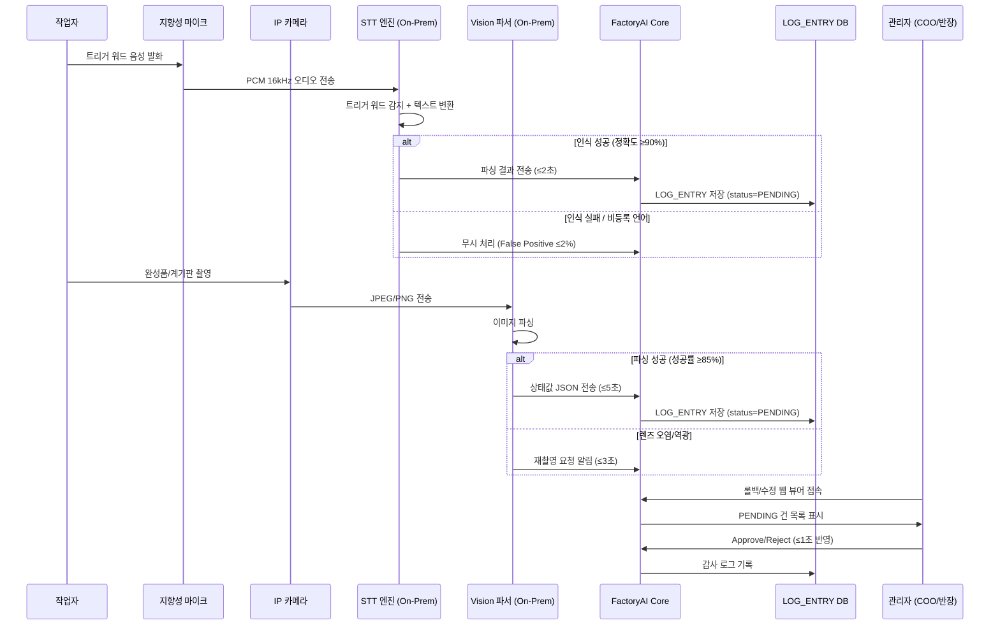
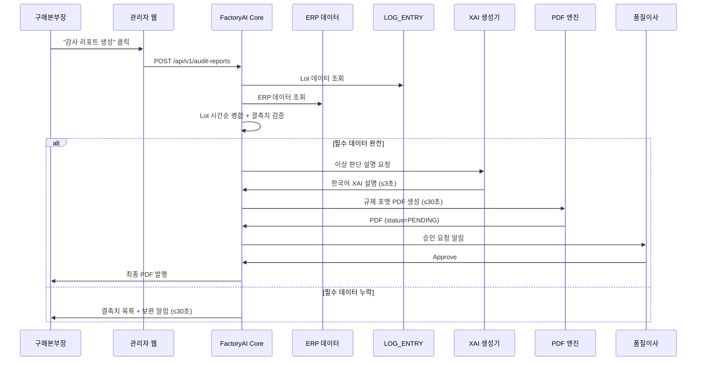
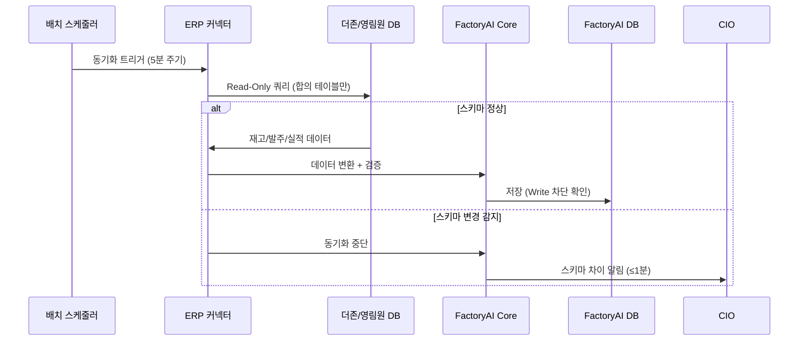
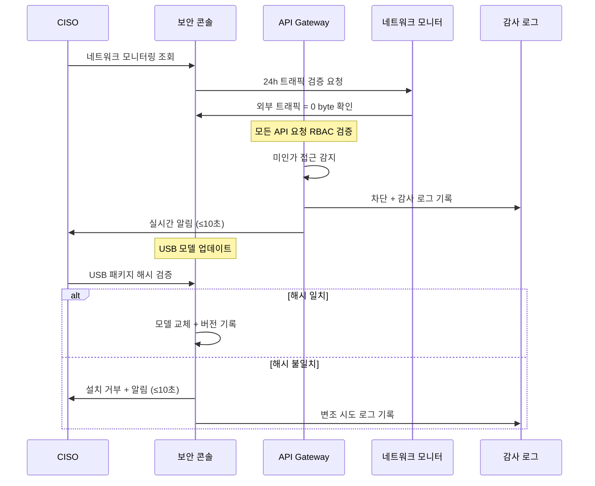
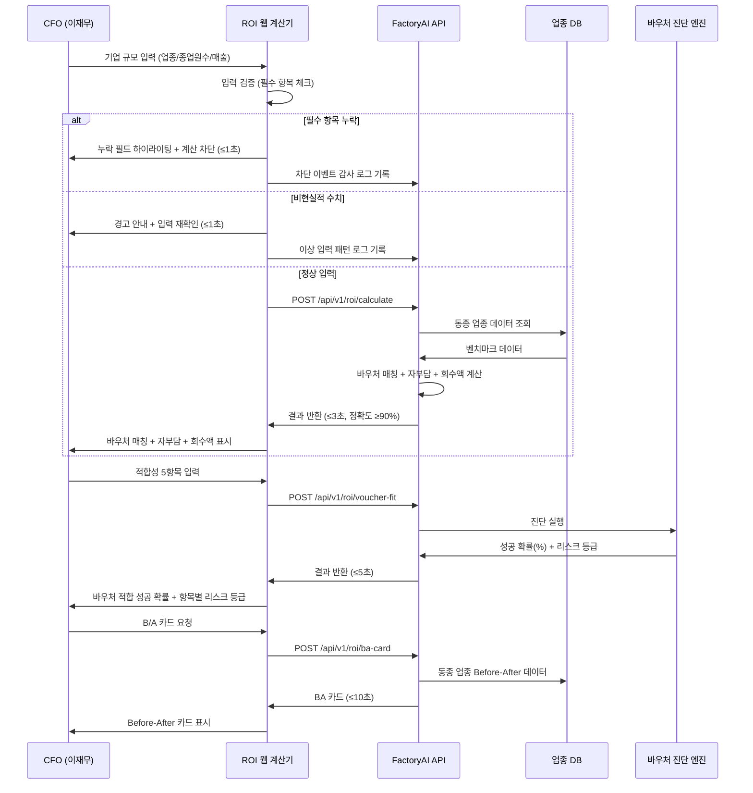
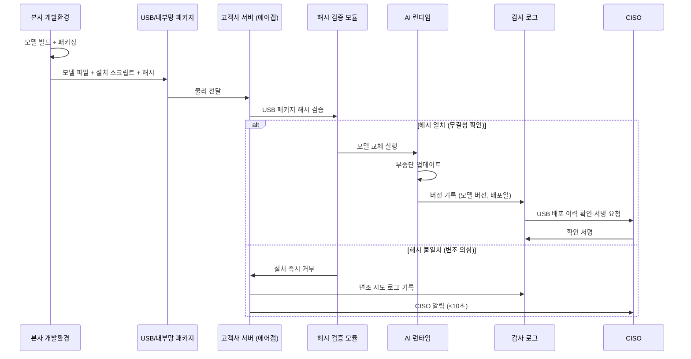
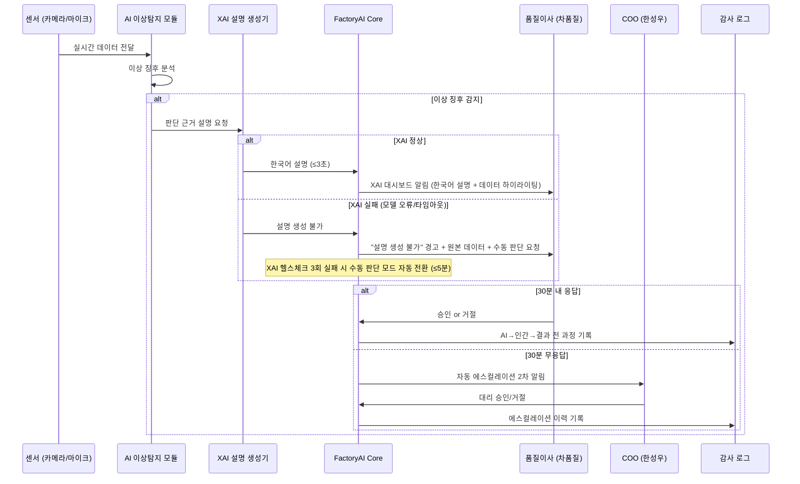
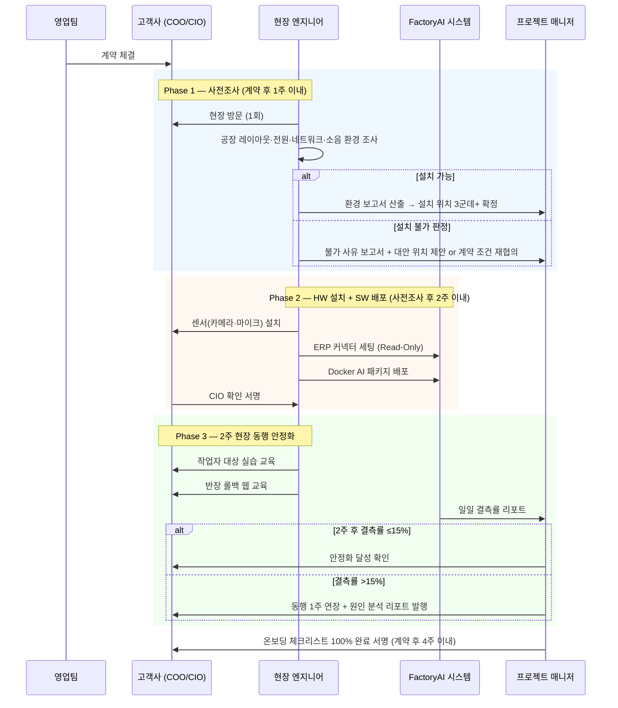
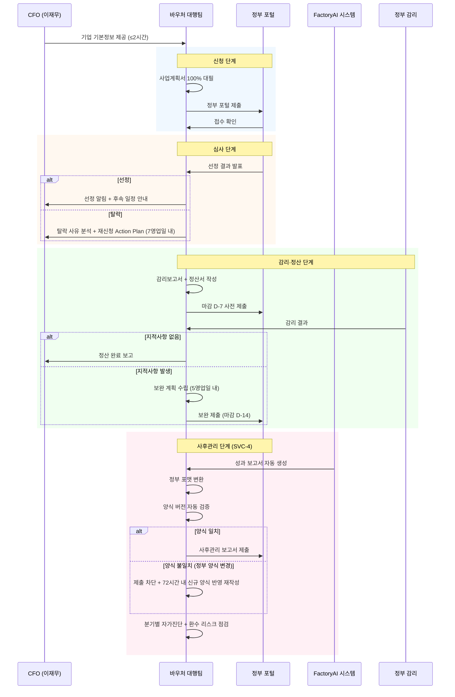

# Software Requirements Specification (SRS)
**Document ID**: SRS-001  
**Revision**: 1.0  
**Date**: 2026-04-18  
**Standard**: ISO/IEC/IEEE 29148:2018  

**Project**: 제조 AI 자동화 플랫폼 (FactoryAI)  
**Source PRD**: PRD v7.0 (2026-04-15)  
**Owner**: 모두연 EGIGAE #5  

---

## 1. Introduction

### 1.1 Purpose

본 SRS는 제조 AI 자동화 플랫폼 "FactoryAI"의 소프트웨어 및 서비스 요구사항을 ISO/IEC/IEEE 29148:2018 표준에 따라 정의한다.

**시스템 목적**: 국내 스마트공장 도입 기업의 75.5%(≈24,038개사)가 기초 단계에 정체된 「2차 자동화 공백(Second Automation Gap)」을 해소한다. 정부 보급으로 MES·ERP 기초 인프라는 설치되었으나 현장 입력 거부(결측률 40%+)로 데이터가 축적되지 않아 AI 고도화 단계로 진입할 수 없는 구조적 공백을 **Zero-Touch 패시브 로깅(STT+Vision)**, **비파괴형 ERP 브릿지**, **100% 온프레미스 AI 패키지**, **턴키 바우처 행정 대행**으로 해소한다.

**대상 독자**: 개발팀, QA팀, 프로젝트 관리자, 아키텍트, 고객사 CTO/CISO, 정부 감리 기관

### 1.2 Scope

#### 1.2.1 In-Scope (MVP)

| 구분 | 항목 |
|:---:|:---|
| SW | E1 패시브 로깅 (STT+Vision) |
| SW | E2 원클릭 감사 리포트 (Lot Merge + PDF) |
| SW | E2-B 품질 XAI 이상탐지 |
| SW | E3 ERP 비파괴형 브릿지 (더존·영림원) |
| SW | E4 CFO용 ROI 진단·결재기 |
| SW | E6 온프레미스 보안 패키지 |
| SW | E7 성과 가시화·리텐션 대시보드 |
| SVC | SVC-1 현장 온보딩 (사전조사 + HW설치 + 2주 동행) |
| SVC | SVC-2 바우처 턴키 대행 (신청→감리→정산) |
| SVC | SVC-3 보안 심의 동행 PT + 사전 문서 |
| SVC | SVC-4 바우처 사후관리 대행 |
| SVC | SVC-5 현장 장애 출동 (수도권/비수도권) |
| 산업 | 금속가공·식품제조 2개 버티컬 |
| 정책 | PoC 성과 미달 시 전액 환불 보증 |

#### 1.2.2 Out-of-Scope (Phase 2+)

| 항목 | 사유 |
|:---|:---|
| E5 AI 공정 스케줄러 | 데이터 3개월 축적 필요 (ADR-7) |
| 고객사 자체 HW 조달 | 사양 가이드만 제공 |
| 고객사 기존 공정 변경 | AI 부착만 수행 |
| 퍼블릭 클라우드 배포 | ADR-1에 의한 On-Premise Only |
| 다국어(한국어 외) 지원 | Phase 2+ |
| 금속가공·식품 외 업종 확장 | Phase 2+ |
| 영림원·더존 이외 ERP 연동 | Phase 2+ |
| 무조건적 환불 | 사전 합의 KPI 기준에 한정 |

#### 1.2.3 Constraints (제약사항)

| ID | 제약사항 | 근거 |
|:---|:---|:---|
| CON-01 | 모든 AI 모델·데이터 파이프라인은 고객사 내부 서버에서 실행되어야 하며, 외부 API 호출 0건, 트래픽 0 byte를 물리적으로 보장해야 한다 | ADR-1, PRD §5-3 |
| CON-02 | ERP 연동은 Read-Only만 허용하며, 고객사 ERP DB에 대한 Write 연산은 시스템 레벨에서 차단해야 한다 | ADR-2, PRD §4-0 |
| CON-03 | 모든 AI 판단 결과는 인간(관리자/품질이사) 승인 없이 외부 발행 또는 물리적 영향 행위를 실행할 수 없다 (HITL 4대 원칙) | ADR-3, PRD §3-C |
| CON-04 | 모델 업데이트는 USB/내부망 전용 오프라인 배포만 허용하며, 무결성 해시 검증을 통과해야 한다 | ADR-4, PRD §6-3 |
| CON-05 | 대상 ERP는 더존 iCUBE/Smart A 및 영림원 K-System에 한정한다 | PRD §7-1 |
| CON-06 | 대상 산업은 금속가공·식품제조 2개 버티컬에 한정한다 | PRD §7-1 |
| CON-07 | 고객사 서버 최소 사양: CPU 16GB RAM, 4core (GPU T4+ 권장) | PRD §5-1 |

#### 1.2.4 Assumptions (가정)

| ID | 가정 | 유형 |
|:---|:---|:---:|
| ASM-01 | 고객사에 서버(16GB RAM+, GPU 옵션) 확보 또는 조달 가능 | SW |
| ASM-02 | 더존/영림원 ERP DB Read-Only 권한을 CIO 사전 승인 | SW |
| ASM-03 | 2026년 중기부/과기부 제조 AX 바우처 예산 4,230억 원 집행 | SVC |
| ASM-04 | 고객사 현장 접근(보안 출입) 허용 — 사전조사·설치·동행 가능 | SVC |
| ASM-05 | 센서 설치를 위한 전원·공간·네트워크(내부망) 확보 가능 | SVC |
| ASM-06 | 작업자 교육 시간(2시간) 확보 가능 — 생산 라인 일시 조정 | SVC |

### 1.3 Definitions, Acronyms, Abbreviations

| 용어 | 정의 |
|:---|:---|
| **2차 자동화 공백 (Second Automation Gap)** | MES·ERP 기초 인프라는 설치되었으나 현장 입력 거부(결측률 40%+)로 데이터가 축적되지 않아 AI 고도화 단계로 진입할 수 없는 구조적 공백 |
| **Zero-Touch** | 작업자가 타이핑·터치 입력 없이 음성(STT) 및 카메라(Vision)로 데이터가 자동 수집되는 패시브 수집 방식 |
| **HITL (Human-in-the-Loop)** | AI 판단 결과에 대해 인간이 반드시 승인/거절을 수행해야 하는 안전 프로토콜 |
| **SPOF (Single Point of Failure)** | 스케줄러 1인 퇴사 시 공장 마비를 유발하는 단일 장애점 |
| **DMU (Decision Making Unit)** | 고객사 내 의사결정단위 (COO, 구매본부장, 품질이사, CIO, CFO, CISO) |
| **AOS (Adjusted Opportunity Score)** | 기회 점수 — 페르소나별 미충족 욕구(Job)의 우선순위 평가 지표 |
| **DOS (Discovered Opportunity Score)** | 발견된 기회 점수 — JTBD 인터뷰 기반 정성적 기회 발견 지표 |
| **MoSCoW** | 우선순위 분류법 — Must / Should / Could / Won't |
| **XAI (Explainable AI)** | AI 판단 근거를 한국어로 시각화하여 설명하는 기능 |
| **STT (Speech-to-Text)** | 음성을 텍스트로 변환하는 기술 |
| **MES (Manufacturing Execution System)** | 제조 실행 시스템 |
| **ERP (Enterprise Resource Planning)** | 전사적 자원 관리 시스템 |
| **RBAC (Role-Based Access Control)** | 역할 기반 접근 제어 |
| **ISMS/ISMS-P** | 정보보호 관리체계 / 정보보호 및 개인정보보호 관리체계 인증 |
| **RPO (Recovery Point Objective)** | 데이터 복구 시점 목표 — 장애 발생 시 허용 가능한 데이터 손실 시간 |
| **RTO (Recovery Time Objective)** | 복구 시간 목표 — 장애 발생 후 서비스 정상화까지 허용 시간 |
| **MTBF (Mean Time Between Failures)** | 평균 고장 간격 |
| **MTTR (Mean Time To Repair)** | 평균 복구 시간 |
| **MRR (Monthly Recurring Revenue)** | 월간 반복 매출 |
| **PoC (Proof of Concept)** | 개념 검증 — 실제 현장에서 MVP 기능을 검증하는 단계 |
| **SLA (Service Level Agreement)** | 서비스 수준 합의서 |
| **CJM (Customer Journey Map)** | 고객 여정 지도 |
| **JTBD (Jobs to Be Done)** | 완수할 과업 — 고객이 제품/서비스를 통해 달성하고자 하는 목표 |
| **Switch Trigger** | 전환 트리거 — 고객이 기존 방식에서 새로운 솔루션으로 전환하는 결정적 계기 (인재 이탈, 감사 지적, 상장 준비 등) |
| **WTP (Willingness To Pay)** | 지불 의사 — 고객이 수용 가능한 가격 수준 |
| **Validator** | 검증자 — 가설이나 기능의 유효성을 검증하는 이해관계자 |
| **ADR (Architecture Decision Record)** | 아키텍처 결정 기록 |
| **NAC (Negative Acceptance Criteria)** | 부정 수용 기준 — 실패·예외 케이스에 대한 시스템 방어 동작 정의 |

### 1.4 References

| ID | 문서명 | 버전/일자 | 비고 |
|:---|:---|:---|:---|
| REF-01 | PRD v7.0 (제조 AI 자동화 플랫폼) | v7.0 / 2026-04-15 | 본 SRS의 유일한 요구사항 원천 |
| REF-02 | VPS V3 Updated Final | v3.0 / 2026-04-11 | PRD 원천 — 12개 비즈니스 분석 기반 |
| REF-03 | ▶1 포터 5가지 힘 분석 | — | 시장 구조, 대체재 위협 |
| REF-04 | ▶2 경쟁사 브리핑 | — | 경쟁 5유형, Man-Month 단가 격차 |
| REF-05 | ▶3 가치사슬 분석 | — | 가치사슬 공백 분석 |
| REF-06 | ▶4 KSF (Key Success Factors) | — | Vertical-First, ERP Moat, 보안 대응 |
| REF-07 | ▶5 문제정의서 | — | 5대 문제, 2차 자동화 공백 |
| REF-08 | ▶6 TAM-SAM-SOM | — | 시장 퍼널 분석 |
| REF-09 | ▶7 페르소나 스펙트럼 | — | 12인→4인 선정, DMU 분석 |
| REF-10 | ▶8 CJM (고객여정지도) | — | 5단계 Touchpoint, 감정·실패 지표 |
| REF-11 | ▶9 AOS/DOS 분석 | — | TOP 6, 4사분면, MVP 우선순위 |
| REF-12 | ▶10 JTBD 인터뷰 | — | 14인 인터뷰, 6가설, Switch Trigger |
| REF-13 | ▶11 BMC (Business Model Canvas) | — | 수익 구조 (SI 60% + SaaS 25% + 컨설팅 15%) |
| REF-14 | ▶12 린 캔버스 | — | 3가지 가설, Unfair Advantage |
| REF-15 | ISO/IEC/IEEE 29148:2018 | 2018 | Systems and software engineering — Life cycle processes — Requirements engineering |
| REF-16 | 중소벤처기업부 스마트공장 통계 (2025) | 2025 | 기초 정체 75.5%, AI 고도화 0.1% |
| REF-17 | 정부 예산안 — 2026 제조 AX | 2026 | 바우처 예산 4,230억 원 |

---

## 2. Stakeholders

| 역할 (Role) | 대표 페르소나 | 책임 (Responsibility) | 관심사 (Interest) | AOS |
|:---|:---|:---|:---|:---:|
| **COO / 공장장** | 한성우 | 현장 운영 총괄, 생산 납기 관리, 스케줄 수립 | SPOF 해소, 스케줄러 퇴사 시에도 생산 데이터 유지, 현장 반발 없는 데이터 수집 | 4.0 |
| **구매본부장** | 클레어 리 | 규제·감사 대응, 원청사 납품 계약 관리 | 1클릭 무결성 감사 리포트 즉시 생성, 밤샘 엑셀 취합 제거 | 4.0 |
| **품질이사** | 차품질 | 품질 관리, AI 판단 근거 검증, 최종 의사결정 | AI 판단 근거 한국어 시각화, AI 단독 실행 0건, 인간 최종 결정 보장 | 3.0 |
| **CIO** | 정미경 | IT 인프라, ERP 시스템 관리 | 기존 ERP 교체 없는 비파괴형 연동, DB 손상 Zero | 3.2 |
| **CFO** | 이재무 | 예산 승인, 투자 ROI 검증 | Payback 18개월 이내 증명, 바우처 자부담 최소화, 행정 투입 0시간 | 1.6 |
| **CISO** | 최보안 | 보안 최종 관문, 보안 KPI 유지 | 데이터 한 바이트도 외부 유출 없음, 온프레미스 100%, 단독 거부권 행사 | 1.0 |

> **DMU 공략 필수 순서**: COO(챔피언) → CFO+품질이사(검증) → CISO(도장). CISO를 건너뛰면 전체 무효화.

---

## 3. System Context and Interfaces

### 3.1 External Systems

| ID | 외부 시스템 | 연동 방식 | 데이터 흐름 | 제약 |
|:---|:---|:---|:---|:---|
| EXT-01 | **더존 iCUBE / Smart A** | Read-Only DB 커넥터 | 재고/발주/실적 JSON → FactoryAI | Write 차단, CISO 승인 테이블만, 5분 Batch |
| EXT-02 | **영림원 K-System** | Read-Only DB 커넥터 | 재고/발주/실적 JSON → FactoryAI | Write 차단, CISO 승인 테이블만, 5분 Batch |
| EXT-03 | **Whisper STT 엔진 (On-Prem)** | 로컬 API | PCM 16kHz 오디오 → 트리거 워드 + 텍스트 | 폐쇄망 전용, 파인튜닝 적용 |
| EXT-04 | **Vision 파서 (On-Prem)** | 로컬 API | JPEG/PNG ≤10MB → 상태값 JSON | 폐쇄망 전용 |
| EXT-05 | **XAI 설명 생성기 (On-Prem)** | 로컬 API | 이상 감지 결과 → 한국어 설명 | 온프레미스 LLM |
| EXT-06 | **바우처 정부 포털** | 수작업 제출 | 사업계획서 PDF + 기업정보 → 접수번호/선정 결과 | API 없음, 수작업 |
| EXT-07 | **현장 카메라 (IP/모바일)** | 물리 HW 연결 | 공정 라인 영상 → Vision 파서 입력 | 방진·방수, 80dB+ 환경 |
| EXT-08 | **현장 마이크 (지향성)** | 물리 HW 연결 | 공장 소음 + 음성 → STT 엔진 입력 | 80dB+ 환경 대응 |
| EXT-09 | **USB 업데이트 패키지** | 물리 매체 | 모델 파일 + 설치 스크립트 → 업데이트된 AI 런타임 | 에어갭, 해시 검증 |

### 3.2 Client Applications

| ID | 클라이언트 | 사용자 | 주요 기능 |
|:---|:---|:---|:---|
| CLI-01 | **관리자 웹 대시보드** | COO, 구매본부장, 품질이사, CIO | 로깅 조회, 감사 리포트 생성, XAI 대시보드, 정합성 리포트, 성과 대시보드 |
| CLI-02 | **ROI 웹 계산기** | CFO | 바우처 매칭, 자부담 계산, Payback 시뮬레이션 |
| CLI-03 | **CISO 보안 콘솔** | CISO | RBAC 관리, 감사 로그 조회, 네트워크 모니터링 |
| CLI-04 | **롤백/수정 웹 뷰어** | 관리자(COO/반장) | Approve/Reject, 데이터 수정, 감사 로그 |

### 3.3 API Overview

| API | 메서드 | 경로 (예시) | 기능 요약 | 인증 |
|:---|:---:|:---|:---|:---:|
| 패시브 로깅 | POST | `/api/v1/log-entries` | STT/Vision 파싱 결과 저장 | RBAC |
| 감사 리포트 생성 | POST | `/api/v1/audit-reports` | Lot 병합 + PDF 생성 | RBAC |
| XAI 설명 조회 | GET | `/api/v1/xai/explanations/{id}` | 이상 감지 결과에 대한 한국어 설명 | RBAC |
| ERP 동기화 | POST | `/api/v1/erp/sync` | Read-Only Batch 동기화 실행 | RBAC |
| 엑셀 업로드 | POST | `/api/v1/erp/excel-import` | .xlsx/.csv 드래그&드롭 파싱 | RBAC |
| ROI 계산 | POST | `/api/v1/roi/calculate` | 기업 규모 기반 ROI 시뮬레이션 | RBAC |
| 바우처 적합성 진단 | POST | `/api/v1/roi/voucher-fit` | 적합성 5항목 진단 | RBAC |
| 대시보드 발행 | POST | `/api/v1/dashboards/publish` | 월간 성과 대시보드 자동 발행 | RBAC |
| 승인/거절 | PATCH | `/api/v1/approvals/{id}` | AI 결과 Approve/Reject | RBAC |
| 감사 로그 조회 | GET | `/api/v1/audit-logs` | 전 접근 전수 기록 조회 | RBAC (CISO/ADMIN) |
| 네트워크 모니터링 | GET | `/api/v1/security/network-status` | 외부 트래픽 0 byte 검증 | RBAC (CISO) |
| 모델 업데이트 | POST | `/api/v1/models/update` | USB/내부망 모델 업데이트 | RBAC (ADMIN) |
| NPS 설문 발송 | POST | `/api/v1/nps/survey` | 1클릭 NPS + 동의 수집 | RBAC |
| 알림 | POST | `/api/v1/notifications` | 결측률/보안/이상 알림 발송 | System |

### 3.4 Interaction Sequences (핵심 시퀀스 다이어그램)

#### 3.4.1 패시브 로깅 시퀀스 (E1)

#### 3.4.2 원클릭 감사 리포트 시퀀스 (E2)

#### 3.4.3 ERP 비파괴형 브릿지 동기화 시퀀스 (E3)

#### 3.4.4 CISO 보안 검증 시퀀스 (E6)

---

## 4. Specific Requirements

### 4.1 Functional Requirements

#### 4.1.1 E1 — 무입력 패시브 로깅 (STT + Vision)

| ID | Requirement | Source | Priority | Acceptance Criteria |
|:---|:---|:---|:---:|:---|
| **REQ-FUNC-001** | 시스템은 80dB+ 소음 환경에서 작업자의 트리거 워드 음성 발화를 STT 모듈로 감지하여 공정 상태를 텍스트로 변환·로깅해야 한다 | US-01, AC-1 | Must | **Given** 80dB+ 소음 환경에서 작업자가 등록된 트리거 워드를 발화한다 **When** STT 모듈이 트리거 워드를 감지한다 **Then** 공정 상태가 텍스트로 변환·로깅된다 (인식 정확도 ≥90%, 지연 ≤2초) |
| **REQ-FUNC-002** | 시스템은 모바일 카메라로 촬영된 완성품/계기판 이미지를 Vision 모듈로 파싱하여 상태 값을 시스템에 기록해야 한다 | US-01, AC-2 | Must | **Given** 모바일 카메라로 완성품/계기판을 촬영한다 **When** Vision 모듈이 이미지를 파싱한다 **Then** 상태 값이 시스템에 기록된다 (파싱 성공률 ≥85%, 처리 ≤5초) |
| **REQ-FUNC-003** | 시스템은 관리자에게 AI 오인식 데이터에 대한 롤백/수정 웹 뷰어를 제공하고, Approve/Reject 후 감사 로그를 기록해야 한다 | US-01, AC-3 | Must | **Given** AI가 오인식한 데이터가 존재한다 **When** 관리자가 롤백/수정 웹 뷰어에 접속하여 Approve/Reject를 수행한다 **Then** 반영 ≤1초 내 완료되고 감사 로그가 기록된다. 인간 승인 없이 발행되는 건은 0건이다 |
| **REQ-FUNC-004** | 시스템은 1일 운영 후 결측률 리포트를 조회할 수 있어야 하며, 결측률을 ≤5%로 유지해야 한다 | US-01, AC-4 | Must | **Given** 1일 운영 완료 후 **When** 결측률 리포트를 조회한다 **Then** 결측률이 표시되며 목표 ≤5%이다 (Baseline 40%+ 대비) |
| **REQ-FUNC-005** | 시스템은 비등록 언어(영어·방언) 음성 발화 시 트리거 워드 미감지로 무시 처리하고, 오등록 0건을 보장해야 한다 | US-01, NAC-1 | Must | **Given** 80dB+ 소음 + 비등록 언어 음성 발화 시 **When** STT 모듈이 수신한다 **Then** 트리거 워드 미감지 → 무시 처리, 오등록 0건 (False Positive ≤2%) |
| **REQ-FUNC-006** | 시스템은 카메라 렌즈 오염·역광 촬영 시 파싱 실패를 감지하고 "재촬영 요청" 알림을 ≤3초 내 발송해야 한다 | US-01, NAC-2 | Must | **Given** 카메라 렌즈 오염·역광으로 촬영한다 **When** Vision 모듈이 파싱을 시도한다 **Then** 파싱 실패 → "재촬영 요청" 알림 발송 (≤3초), 오 데이터 기록 0건 (오류 방어율 100%) |
| **REQ-FUNC-007** | 시스템은 네트워크 단절 시 로컬 큐에 데이터를 저장하고, 복구 후 ≤5분 내 전량 동기화해야 한다 (유실률 0%) | US-01, NAC-3 | Must | **Given** 네트워크 단절 상태에서 로깅이 발생한다 **When** 시스템이 복구된다 **Then** 로컬 큐에 저장된 데이터 전량 동기화 (복구 후 ≤5분, 유실률 0%) |
| **REQ-FUNC-008** | 시스템은 동일 시간대 10건+ 동시 음성 입력 시 순차 처리를 완료하고, 큐 드롭 0건을 보장해야 한다 | US-01, NAC-4 | Must | **Given** 동일 시간대 10건+ 동시 음성 입력이 발생한다 **When** STT 큐가 처리한다 **Then** 순차 처리 완료, 드롭 0건, 최대 지연 ≤10초 |

#### 4.1.2 E2 — 원클릭 감사 리포트 (Lot Merge + PDF)

| ID | Requirement | Source | Priority | Acceptance Criteria |
|:---|:---|:---|:---:|:---|
| **REQ-FUNC-009** | 시스템은 "감사 리포트 생성" 클릭 시 로깅+ERP 데이터를 Lot 시간순으로 병합하여 규제 포맷 PDF를 생성해야 한다 | US-02, AC-1 | Must | **Given** 로깅+ERP 데이터가 존재한다 **When** "감사 리포트 생성"을 클릭한다 **Then** Lot 시간순 병합 + 규제 포맷 PDF 생성 (생성 ≤30초, Lot 정확도 ≥99%) |
| **REQ-FUNC-010** | 시스템은 필수 데이터 누락 시 결측치 목록과 보완 알림을 ≤30초 내 표시해야 한다 | US-02, AC-2 | Must | **Given** 리포트 생성에 필수 데이터가 누락되었다 **When** 리포트 생성을 시도한다 **Then** 결측치 목록 + 보완 알림 표시 (감지 정확도 ≥95%, 알림 ≤30초) |
| **REQ-FUNC-011** | 시스템은 XAI 판단 근거를 포함한 PDF에서 한국어 이상 판단 설명을 표시해야 한다 | US-02, AC-3 | Must | **Given** XAI 판단 근거 포함 PDF가 생성된다 **When** 품질이사가 확인한다 **Then** 한국어 이상 판단 설명이 표시된다 (가독성 ≥4.0/5.0, 누락 0건) |
| **REQ-FUNC-012** | 시스템은 미지원 규제 포맷 요청 시 "지원 불가 포맷" 안내와 대체 포맷을 ≤2초 내 제안해야 한다 (시스템 크래시 0건) | US-02, NAC-1 | Must | **Given** 미지원 규제 포맷이 요청된다 **When** 리포트 생성을 시도한다 **Then** "지원 불가 포맷" 안내 + 대체 포맷 제안 (시스템 크래시 0건, 안내 ≤2초) |
| **REQ-FUNC-013** | 시스템은 Lot 데이터 시간순 불일치(타임스탬프 중복/역전) 시 충돌 Lot 목록을 표시하고 자동 병합을 차단해야 한다 | US-02, NAC-2 | Must | **Given** Lot 데이터에 타임스탬프 중복/역전이 존재한다 **When** 병합을 시도한다 **Then** 충돌 Lot 목록 표시 + 수동 확인 요청 + 자동 병합 차단 (오병합 0건, 경고 ≤5초) |

#### 4.1.3 E2-B — 품질 XAI 이상탐지

| ID | Requirement | Source | Priority | Acceptance Criteria |
|:---|:---|:---|:---:|:---|
| **REQ-FUNC-014** | 시스템은 이상 징후 감지 시 XAI 대시보드에 한국어 설명과 데이터 하이라이팅 알림을 ≤3초 내 표시해야 한다 | US-06, AC-1 | Must | **Given** 이상 징후가 감지된다 **When** XAI 대시보드 알림이 생성된다 **Then** 한국어 설명 + 데이터 하이라이팅 표시 (생성 ≤3초, 이해도 ≥4.0/5.0) |
| **REQ-FUNC-015** | 시스템은 품질이사의 승인/거절 없이 AI 단독 실행을 시스템 레벨에서 차단해야 한다 | US-06, AC-2 | Must | **Given** 알림을 수신한 품질이사가 있다 **When** 승인/거절을 클릭한다 **Then** AI 단독 실행 0건 보장 (우회 차단 100%) |
| **REQ-FUNC-016** | 시스템은 감사 시점에 AI→인간→결과 전 과정 판단 이력을 ≤2초 내 검색 가능하게 기록해야 한다 | US-06, AC-3 | Must | **Given** 감사 시점이다 **When** 판단 이력을 조회한다 **Then** AI→인간→결과 전 과정이 기록되어 있다 (누락 0%, 검색 ≤2초) |
| **REQ-FUNC-017** | 시스템은 XAI 설명 생성 실패(모델 오류·타임아웃) 시 "설명 생성 불가" 경고를 표시하고 원본 데이터 + 수동 판단 요청을 전달해야 한다 | US-06, NAC-1 | Must | **Given** XAI 설명 생성이 실패한다 (모델 오류·타임아웃) **When** 이상 징후가 감지된다 **Then** "설명 생성 불가" 경고 + 원본 데이터 표시 + 수동 판단 요청 (AI 무설명 자동 실행 0건) |
| **REQ-FUNC-018** | 시스템은 품질이사 알림 미수신 후 30분 무응답 시 COO에게 자동 에스컬레이션 2차 알림을 발송해야 한다 | US-06, NAC-2 | Must | **Given** 알림 미수신 (네트워크·수신함 오류)으로 30분 무응답이다 **When** 타임아웃이 발생한다 **Then** 자동 에스컬레이션 → COO에게 2차 알림 발송 (미처리 이상 징후 0건) |

#### 4.1.4 E3 — ERP 비파괴형 브릿지

| ID | Requirement | Source | Priority | Acceptance Criteria |
|:---|:---|:---|:---:|:---|
| **REQ-FUNC-019** | 시스템은 더존/영림원 ERP 운영 중 Read-Only 커넥터로 합의 테이블만 읽고, Write를 시스템 레벨에서 차단해야 한다 | US-03, AC-1 | Must | **Given** 더존/영림원 ERP가 운영 중이다 **When** Read-Only 커넥터가 설치된다 **Then** 합의 테이블만 읽기, DB 변경 0건, 동기화 ≤5분 |
| **REQ-FUNC-020** | 시스템은 API 불가 극보안 환경에서 엑셀 덤프 드래그&드롭을 지원하고 자동 파싱·적재해야 한다 | US-03, AC-2 | Must | **Given** API 불가 극보안 환경이다 **When** 엑셀 파일(.xlsx/.csv)을 드래그&드롭한다 **Then** 자동 파싱·적재 (파싱 ≥95%, 처리 ≤30초/파일) |
| **REQ-FUNC-021** | 시스템은 1주 운영 후 정합성 리포트에서 불일치율을 ≤2%로 표시해야 한다 | US-03, AC-3 | Must | **Given** 1주 운영 후이다 **When** 정합성 리포트를 조회한다 **Then** 불일치율 ≤2% 표시 (Baseline 12%+ 대비) |
| **REQ-FUNC-022** | 시스템은 ERP 스키마 변경(컬럼 추가/삭제/타입 변경) 감지 시 동기화를 중단하고 CIO에게 ≤1분 내 알림을 발송해야 한다 | US-03, NAC-1 | Must | **Given** ERP 스키마가 변경된다 (컬럼 추가/삭제/타입 변경) **When** 동기화가 실행된다 **Then** 스키마 차이 감지 → 동기화 중단 + CIO 알림 (데이터 손상 0건, 알림 ≤1분) |
| **REQ-FUNC-023** | 시스템은 50MB 초과 또는 비표준 인코딩 엑셀 파일 업로드 시 파일을 거부하고 오류 메시지를 ≤3초 내 표시해야 한다 (크래시 0건) | US-03, NAC-2 | Must | **Given** 50MB 초과 또는 비표준 인코딩 엑셀 파일이 업로드된다 **When** 드래그&드롭한다 **Then** 파일 거부 + "사이즈 초과/인코딩 오류" 메시지 (시스템 크래시 0건, 응답 ≤3초) |

#### 4.1.5 E4 — CFO용 ROI 진단·결재기

| ID | Requirement | Source | Priority | Acceptance Criteria |
|:---|:---|:---|:---:|:---|
| **REQ-FUNC-024** | 시스템은 기업 규모 입력 시 바우처 매칭 + 자부담 + 회수액을 ≤3초 내 표시해야 한다 | US-04, AC-1 | Should | **Given** 기업 규모를 입력한다 **When** ROI 웹 계산기를 실행한다 **Then** 바우처 매칭 + 자부담 + 회수액 표시 (계산 ≤3초, 정확도 ≥90%) |
| **REQ-FUNC-025** | 시스템은 적합성 5항목(업종/종업원수/ERP종류/바우처이력/보안등급) 완성 시 바우처 적합 성공 확률(%)과 항목별 리스크 등급을 ≤5초 내 표시해야 한다 | US-04, AC-2 | Should | **Given** 적합성 5항목이 완성된다 **When** 제출한다 **Then** 바우처 적합 성공 확률(%) + 항목별 리스크 등급(High/Mid/Low) 표시 (진단 ≤5초, 진단 항목 누락 0건) |
| **REQ-FUNC-026** | 시스템은 동종 업종 데이터 기반으로 Before-After 카드를 ≤10초 내 생성해야 한다 | US-04, AC-3 | Should | **Given** 동종 업종 데이터가 존재한다 **When** B/A 카드를 요청한다 **Then** Before-After 카드 생성 (생성 ≤10초) |
| **REQ-FUNC-027** | 시스템은 필수 입력 항목(매출액·업종) 누락 시 누락 필드를 하이라이팅하고 계산을 차단해야 한다 (감사 로그 기록) | US-04, NAC-1 | Should | **Given** 필수 입력 항목이 누락된다 (매출액·업종 미선택) **When** ROI 계산기를 실행한다 **Then** 누락 필드 하이라이팅 + 계산 차단 (잘못된 결과 출력 0건, 감지 ≤1초, 차단 이벤트 감사 로그 기록) |
| **REQ-FUNC-028** | 시스템은 비현실적 수치 입력(매출 0원, 직원 수 0명) 시 경고 안내 + 입력 재확인을 요청해야 한다 (이상 입력 패턴 로그 기록) | US-04, NAC-2 | Should | **Given** 비현실적 수치가 입력된다 (매출 0원, 직원 수 0명) **When** 제출한다 **Then** 경고 안내 + 입력 재확인 요청 (오진단 발행 0건, 경고 ≤1초, 이상 입력 패턴 로그 기록) |

#### 4.1.6 E6 — 온프레미스 보안 패키지

| ID | Requirement | Source | Priority | Acceptance Criteria |
|:---|:---|:---|:---:|:---|
| **REQ-FUNC-029** | 시스템은 Docker AI 패키지 설치 후 전체 파이프라인 가동 시 외부 호출 0건, 트래픽 0 byte를 24시간 네트워크 모니터링으로 전수 검증해야 한다 | US-05, AC-1 | Must | **Given** Docker AI 패키지가 설치되었다 **When** 전체 파이프라인이 가동된다 **Then** 외부 호출 0건, 트래픽 0 byte (24h 네트워크 모니터링 전수 검증) |
| **REQ-FUNC-030** | 시스템은 USB/내부망을 통한 오프라인 모델 업그레이드를 지원하고 성공률 100%를 보장해야 한다 | US-05, AC-2 | Must | **Given** 모델 업데이트가 필요하다 **When** USB/내부망으로 배포한다 **Then** 오프라인 업그레이드 완료 (성공률 100%) |
| **REQ-FUNC-031** | 시스템은 보안 심의 요청 시 ISMS 확인서 + 망분리 설계서를 자동 생성하여 심의 통과를 지원해야 한다 | US-05, AC-3 | Must | **Given** 보안 심의가 요청된다 **When** ISMS 확인서 + 망분리 설계서를 제출한다 **Then** 심의 통과 (승인률 100%) |
| **REQ-FUNC-032** | 시스템은 RBAC 5개 역할(ADMIN/OPERATOR/AUDITOR/VIEWER/CISO) 기반 접근 제어와 전 접근 전수 감사 로그를 기록하고, 이상 알림을 ≤10초 내 발송해야 한다 | US-05, AC-4 | Must | **Given** 데이터 접근이 발생한다 **When** RBAC + 감사 로그가 작동한다 **Then** 전수 기록 + 이상 알림 (누락 0%, 알림 ≤10초) |
| **REQ-FUNC-033** | 시스템은 무결성 해시 불일치 USB 패키지의 설치를 즉시 거부하고 CISO 알림 + 감사 로그를 ≤10초 내 기록해야 한다 | US-05, NAC-1 | Must | **Given** 무결성 해시가 불일치하는 USB 패키지가 존재한다 **When** 모델 업데이트를 시도한다 **Then** 설치 즉시 거부 + CISO 알림 + 감사 로그 기록 (변조 패키지 설치 0건, 알림 ≤10초) |
| **REQ-FUNC-034** | 시스템은 미인가 사용자의 데이터 접근 시도를 즉시 차단하고 감사 로그 + 실시간 CISO 알림을 ≤10초 내 발송해야 한다 | US-05, NAC-2 | Must | **Given** 미인가 사용자가 데이터 접근을 시도한다 **When** RBAC 검증이 수행된다 **Then** 접근 차단 + 감사 로그 + CISO 알림 (무단 접근 허용 0건, 알림 ≤10초) |

#### 4.1.7 E7 — 성과 가시화·리텐션 대시보드

| ID | Requirement | Source | Priority | Acceptance Criteria |
|:---|:---|:---|:---:|:---|
| **REQ-FUNC-035** | 시스템은 월말 마감 시 4인(COO/구매본부장/품질이사/CFO) 맞춤 대시보드를 ≤24시간 내 자동 발행해야 한다 (렌더링 ≤5초) | US-07, AC-1 | Should | **Given** 월말 마감이다 **When** 자동 발행 트리거가 실행된다 **Then** 4인 맞춤 대시보드 발행 (≤24시간, 렌더링 ≤5초) |
| **REQ-FUNC-036** | 시스템은 분기 말 ROI 누적 리포트에서 절감액·생성건수를 수동 개입 0건으로 자동 집계해야 한다 | US-07, AC-2 | Should | **Given** 분기 말이다 **When** ROI 누적 리포트가 생성된다 **Then** 절감액·생성건수 자동 집계 (수동 개입 0건) |
| **REQ-FUNC-037** | 시스템은 NPS 9~10점 감지 시 1클릭 NPS + 레퍼런스 동의 수집 요청을 발송해야 한다 (응답률 ≥30%) | US-07, AC-3 | Should | **Given** NPS 9~10이 감지된다 **When** 레퍼런스 요청이 발송된다 **Then** 1클릭 NPS + 동의 수집 (응답률 ≥30%) |
| **REQ-FUNC-038** | 시스템은 당월 로깅 건수 < 100건 시 "데이터 부족" 경고를 표시하고 대시보드를 미발행해야 한다 | US-07, NAC-1 | Should | **Given** 당월 로깅 건수 < 100건이다 **When** 자동 발행 트리거가 실행된다 **Then** "데이터 부족" 경고 + 대시보드 미발행 + COO 알림 (오해 유발 대시보드 발행 0건) |
| **REQ-FUNC-039** | 시스템은 대시보드 렌더링 5초 내 미완료 시 재시도 3회 후 "지연 안내" 메시지를 표시하고 큐 대기해야 한다 | US-07, NAC-2 | Should | **Given** 대시보드 렌더링이 5초 내 완료되지 않는다 **When** 서버 부하로 지연된다 **Then** 재시도 3회 후 "지연 안내" 메시지 + 큐 대기 (사용자 대면 에러 화면 0건) |

#### 4.1.8 HITL (Human-in-the-Loop) 공통 안전 프로토콜

| ID | Requirement | Source | Priority | Acceptance Criteria |
|:---|:---|:---|:---:|:---|
| **REQ-FUNC-040** | 시스템은 APPROVAL 테이블에서 status=PENDING 상태의 AI 생성 결과물에 대해 외부 발행 이벤트를 감지하면 자동 차단하고, 관리자 알림을 ≤10초 내 발송해야 한다 | PRD §3-C, HITL ① | Must | **Given** `APPROVAL` 상태가 PENDING인 AI 생성 결과물이 있다 **When** 외부 발행 이벤트가 감지된다 **Then** 자동 차단 (≤1초) + 관리자 알림 (≤10초) |
| **REQ-FUNC-041** | 시스템은 `AUDIT_REPORT`.`xai_explanation`이 null인 경우 리포트 발행을 차단해야 한다 | PRD §3-C, HITL ② | Must | **Given** `xai_explanation` = null인 AUDIT_REPORT가 존재한다 **When** 발행을 시도한다 **Then** 발행 차단 + 개발팀 알림 (≤30초) |
| **REQ-FUNC-042** | 시스템은 XAI 모듈 장애 시 ≤5분 내 수동 판단 모드로 자동 전환하고, XAI 복구 후 30분 이내 자동 복귀해야 한다. 수동 판단 기간 중 전 건 감사 로그를 기록해야 한다 | PRD §3-C, HITL ② | Must | **Given** XAI 모듈 헬스체크 3회 실패한다 **When** 수동 판단 모드 전환이 필요하다 **Then** ≤5분 내 자동 전환 + OPERATOR 알림. XAI 복구 후 30분 이내 자동 복귀. 수동 판단 기간 전 건 감사 로그 기록 |
| **REQ-FUNC-043** | 시스템은 API 게이트웨이에서 action_type ∈ {STOP, CHANGE} 요청 시 approval_id 필수 검증을 수행하고, 무승인 요청을 즉시 차단 + 감사 로그를 ≤1초 내 기록해야 한다 | PRD §3-C, HITL ③ | Must | **Given** action_type이 STOP 또는 CHANGE인 API 요청이 수신된다 **When** approval_id가 없거나 무효하다 **Then** 요청 차단 + 감사 로그 (≤1초) + CISO 자동 통보 |
| **REQ-FUNC-044** | 시스템은 30분 미처리 PENDING 건에 대해 COO에게 에스컬레이션 알림을 자동 발송해야 한다 | PRD §3-C, HITL ① | Must | **Given** APPROVAL 상태가 PENDING인 건이 30분 경과한다 **When** 타임아웃이 발생한다 **Then** COO에게 에스컬레이션 알림 자동 발송 |
| **REQ-FUNC-045** | 시스템은 LOG_ENTRY Reject 후 원본 데이터 보존 여부를 일일 무결성 검증하고, 위반 시 ≤10초 내 알림을 발송해야 한다 | PRD §3-C, HITL ④ | Must | **Given** LOG_ENTRY가 Reject 처리된다 **When** 일일 무결성 검증이 실행된다 **Then** 원본 데이터 보존 확인. 무결성 위반 시 ≤10초 알림 발송. 데이터 복구 불가 시 백업 RPO 1h 적용 |

#### 4.1.9 SVC-1 — 현장 온보딩 서비스

| ID | Requirement | Source | Priority | Acceptance Criteria |
|:---|:---|:---|:---:|:---|
| **REQ-FUNC-046** | 서비스는 계약 체결 후 1주 이내에 현장 사전조사 방문을 완료하고 공장 레이아웃·전원·네트워크·소음 환경 보고서를 산출해야 한다 | US-S1, AC-1 | Must | **Given** 계약이 체결된다 **When** 현장 사전조사 방문(1회)을 수행한다 **Then** 공장 레이아웃·전원·네트워크·소음 환경 보고서 산출 (계약 후 1주 이내) |
| **REQ-FUNC-047** | 서비스는 사전조사 완료 후 2주 이내에 센서(카메라·마이크) 설치 + ERP 커넥터 세팅을 완료하고 CIO 확인 서명을 확보해야 한다 | US-S1, AC-2 | Must | **Given** 사전조사가 완료된다 **When** 센서 설치 + ERP 커넥터 세팅을 수행한다 **Then** HW+SW 통합 설치 완료 (2주 이내) + CIO 확인 서명 |
| **REQ-FUNC-048** | 서비스는 설치 완료 후 2주 현장 동행 안정화 지원을 수행하여 결측률 ≤15%와 작업자 교육 이수율 ≥80%를 달성해야 한다 | US-S1, AC-3 | Must | **Given** 설치가 완료된다 **When** 2주 현장 동행 안정화를 지원한다 **Then** 결측률 ≤15% 달성 (2주 내) + 작업자 교육 이수율 ≥80% |
| **REQ-FUNC-049** | 서비스는 온보딩 전체를 계약 후 4주 이내에 완료하고 온보딩 체크리스트 100% 완료 서명을 확보해야 한다 | US-S1, AC-4 | Must | **Given** 온보딩 프로젝트가 진행 중이다 **When** 프로젝트가 종료된다 **Then** 온보딩 체크리스트 100% 완료 서명 (계약 후 4주 이내) |

#### 4.1.10 SVC-2 — 바우처 턴키 대행 서비스

| ID | Requirement | Source | Priority | Acceptance Criteria |
|:---|:---|:---|:---:|:---|
| **REQ-FUNC-050** | 서비스는 기업 기본정보 제공(2시간 이내) 후 사업계획서 100% 대필 + 정부 포털 제출을 대행해야 한다 (고객 투입 ≤2시간) | US-S2, AC-1 | Must | **Given** 기업 기본정보가 제공된다 (2시간 이내) **When** 바우처 신청을 수행한다 **Then** 사업계획서 100% 대필 + 정부 포털 제출 (고객 투입 ≤2시간) |
| **REQ-FUNC-051** | 서비스는 바우처 선정률 ≥80%를 달성해야 한다 | US-S2, AC-2 | Must | **Given** 바우처 심사 결과가 발표된다 **When** 선정 통보가 수신된다 **Then** 선정 알림 + 후속 일정 안내 (선정률 ≥80%) |
| **REQ-FUNC-052** | 서비스는 감리보고서 + 정산서를 정부 마감 D-7까지 100% 대행 완료해야 한다 | US-S2, AC-3 | Must | **Given** 바우처 사업 기간 중이다 **When** 감리 및 정산 시점이다 **Then** 감리보고서 + 정산서 100% 대행 (마감 D-7 사전 완료) |

#### 4.1.11 SVC-3 — 보안 심의 동행 서비스

| ID | Requirement | Source | Priority | Acceptance Criteria |
|:---|:---|:---|:---:|:---|
| **REQ-FUNC-053** | 서비스는 영업 3단계 진입 전에 망분리 설계서 + ISMS 확인서 + 데이터 흐름도를 100% 사전 준비해야 한다 | US-S3, AC-1 | Must | **Given** 영업 1단계 시점이다 **When** 사전 문서를 준비한다 **Then** 망분리 설계서 + ISMS 확인서 + 데이터 흐름도 100% 준비 (영업 3단계 진입 전) |
| **REQ-FUNC-054** | 서비스는 CISO 보안 심의에 전문 엔지니어가 동행하여 아키텍처 PT를 수행하고, 1회 방문으로 조건부 승인을 확보해야 한다 | US-S3, AC-2 | Must | **Given** CISO 보안 심의가 요청된다 **When** 전문 엔지니어가 동행 PT를 수행한다 **Then** 아키텍처 설명 + 실시간 질의 응답 (심의 1회 방문 조건부 승인) |

#### 4.1.12 SVC-4 — 바우처 사후관리 대행

| ID | Requirement | Source | Priority | Acceptance Criteria |
|:---|:---|:---|:---:|:---|
| **REQ-FUNC-055** | 서비스는 바우처 사업 종료 후 성과 보고서를 자동 생성 + 정부 포맷 변환하여 고객 투입 0시간으로 제출해야 한다 | US-S4, AC-1 | Should | **Given** 바우처 사업이 종료된다 **When** 성과 보고 시점이다 **Then** 성과 보고서 자동 생성 + 정부 포맷 변환 (고객 투입 0시간) |
| **REQ-FUNC-056** | 서비스는 정부 사후관리 양식 변경 시 제출 전 양식 버전을 자동 검증하고, 불일치 시 제출을 차단 + 72시간 내 신규 양식 반영 재작성해야 한다 | US-S4, NAC-2 | Should | **Given** 정부 양식이 변경되었으나 미감지된다 **When** 기존 양식으로 보고서 제출을 시도한다 **Then** 양식 버전 자동 검증 + 불일치 시 제출 차단 + 담당자 알림 + 72시간 내 신규 양식 반영 재작성 (구양식 제출 0건) |

#### 4.1.13 SVC-5 — 현장 장애 출동 서비스

| ID | Requirement | Source | Priority | Acceptance Criteria |
|:---|:---|:---|:---:|:---|
| **REQ-FUNC-057** | 서비스는 시스템 장애 접수 후 1시간 이내에 1차 원격 진단을 수행하여 원격 해결 가능 여부를 판단해야 한다 | US-S5, AC-1 | Should | **Given** 시스템 장애가 접수된다 **When** 1차 원격 진단을 수행한다 **Then** 원격 해결 가능 여부 판단 (원격 진단 1시간 이내) |
| **REQ-FUNC-058** | 서비스는 원격 해결 불가 판정 시 엔지니어를 현장 출동시켜야 한다 (수도권 ≤4시간, 비수도권 ≤8시간) | US-S5, AC-2 | Should | **Given** 원격 해결 불가가 판정된다 **When** 현장 출동이 필요하다 **Then** 엔지니어 현장 도착 (수도권 ≤4시간, 비수도권 ≤8시간) |
| **REQ-FUNC-059** | 서비스는 장애 해결 후 24시간 이내에 원인 분석 + 재발 방지 대책이 포함된 장애 보고서를 제출해야 한다 | US-S5, AC-3 | Should | **Given** 장애가 해결된다 **When** 장애 보고서를 제출한다 **Then** 원인 분석 + 재발 방지 대책 문서 (보고서 24시간 이내 제출) |

---

### 4.2 Non-Functional Requirements

#### 4.2.1 성능 (Performance)

| ID | Requirement | 측정 지표 | 목표 | 측정 방법 |
|:---|:---|:---|:---|:---|
| **REQ-NF-001** | STT 엔진은 온프레미스 환경에서 p95 응답 시간 ≤2,000ms를 보장해야 한다 | p95 Latency | ≤2,000ms | 부하 테스트 (STT 10건/분 동시 인입) |
| **REQ-NF-002** | Vision 파서는 온프레미스 환경에서 p95 응답 시간 ≤5,000ms를 보장해야 한다 | p95 Latency | ≤5,000ms | 부하 테스트 (Vision 5건/분 동시 인입) |
| **REQ-NF-003** | PDF 리포트 생성(100 Lot 기준)은 p95 응답 시간 ≤30,000ms를 보장해야 한다 | p95 Latency | ≤30,000ms | 100 Lot 데이터 기반 성능 테스트 |
| **REQ-NF-004** | 대시보드 렌더링은 p95 응답 시간 ≤3,000ms를 보장해야 한다 | p95 Latency | ≤3,000ms | 동시접속 30명 부하 테스트 |
| **REQ-NF-005** | ERP 동기화 지연은 Batch 주기 ≤5분을 보장해야 한다 | Batch 주기 | ≤5분 | 내부망 환경 동기화 테스트 |
| **REQ-NF-006** | XAI 설명 생성은 p95 응답 시간 ≤3,000ms를 보장해야 한다 | p95 Latency | ≤3,000ms | GPU 환경 성능 테스트 |
| **REQ-NF-007** | 시스템은 동시접속 최대 30명에서 모든 p95 기준을 유지해야 한다 | 동시접속 수 | 30명 | 동시접속 부하 테스트 |
| **REQ-NF-008** | 시스템은 STT 10건/분 + Vision 5건/분 동시 인입 시 큐 드롭 0건을 보장해야 한다 | 큐 드롭 수 | 0건 | 복합 부하 테스트 |
| **REQ-NF-009** | 시스템은 고객사당 1년 로그 ≤500GB, 3년 아카이브를 지원해야 한다 | 스토리지 용량 | 500GB/년 | 스토리지 용량 모니터링 |

#### 4.2.2 가용성 (Availability)

| ID | Requirement | 측정 지표 | 목표 | 측정 방법 |
|:---|:---|:---|:---|:---|
| **REQ-NF-010** | 시스템 가용성은 월간 ≥99.5%를 보장해야 한다 (계획 유지보수 제외) | 월간 가동률 | ≥99.5% | `가용률(%) = (총 월간 시간 − 계획 유지보수 시간 − 비계획 중단 시간) / (총 월간 시간 − 계획 유지보수 시간) × 100` |
| **REQ-NF-011** | 계획 유지보수는 사전 72시간 고지하고, 월 최대 4시간 이내로 제한해야 한다 | 유지보수 시간 | ≤4시간/월 | 유지보수 일정 로그 |
| **REQ-NF-012** | 비계획 중단은 월 최대 3.6시간(총 720h 기준)으로 제한해야 한다 | 비계획 중단 시간 | ≤3.6시간/월 | 장애 로그 |
| **REQ-NF-013** | MTBF(평균 고장 간격)는 ≥720시간(30일)을 보장해야 한다 | MTBF | ≥720시간 | 장애 이력 분석 |
| **REQ-NF-014** | MTTR(평균 복구 시간)은 ≤2시간을 보장해야 한다 | MTTR | ≤2시간 | 장애 감지→정상화 시간 |

#### 4.2.3 신뢰성 (Reliability)

| ID | Requirement | 측정 지표 | 목표 | 측정 방법 |
|:---|:---|:---|:---|:---|
| **REQ-NF-015** | STT 오인식률은 ≤10%를 유지해야 한다 | STT 오인식률 | ≤10% | 정기 정확도 테스트 |
| **REQ-NF-016** | Vision 파싱 실패율은 ≤15%를 유지해야 한다 | Vision 실패율 | ≤15% | 정기 정확도 테스트 |
| **REQ-NF-017** | 감사 리포트 불일치율은 ≤1%를 유지해야 한다 | 불일치율 | ≤1% | 감사 리포트 정합성 검증 |
| **REQ-NF-018** | 데이터 백업 RPO(Recovery Point Objective)는 ≤1시간(온프레미스 로컬 백업)을 보장해야 한다 | RPO | ≤1시간 | 백업 주기 모니터링 |
| **REQ-NF-019** | 장애 복구 RTO는 원격 ≤4시간, 현장 출동 수도권 ≤4시간, 비수도권 ≤8시간을 보장해야 한다 | RTO | 원격 ≤4h, 수도권 ≤4h, 비수도권 ≤8h | 장애 접수→복구 시간 |

#### 4.2.4 보안 (Security)

| ID | Requirement | 측정 지표 | 목표 | 측정 방법 |
|:---|:---|:---|:---|:---|
| **REQ-NF-020** | 시스템은 외부 반출 트래픽 0 byte를 물리적으로 차단해야 한다 | 외부 트래픽 | 0 byte | 24h 네트워크 캡처 검증 |
| **REQ-NF-021** | AI 런타임은 100% 온프레미스로 실행되며, 외부 API 호출 0건을 보장해야 한다 | 외부 API 호출 | 0건 | API 게이트웨이 로그 분석 |
| **REQ-NF-022** | RBAC 5개 역할(ADMIN, OPERATOR, AUDITOR, VIEWER, CISO)을 내장하고, 역할별 접근 범위를 권한 매트릭스에 따라 제어해야 한다 | 역할 수 / 접근 제어 | 5개 역할 | 접근 제어 테스트 |
| **REQ-NF-023** | 전 접근을 전수 기록하고, 이상 접근 알림을 ≤10초 내 발송해야 한다 | 감사 로그 누락률, 알림 SLA | 누락 0%, 알림 ≤10초 | 감사 로그 분석 |
| **REQ-NF-024** | ISMS/ISMS-P 확인서 자동 생성과 망분리 설계서를 제공해야 한다 | 문서 자동 생성 | 100% 자동 | 보안 심의 결과 |
| **REQ-NF-025** | 분기 1회 내부 보안 감사를 실시하고 감사 보고서를 발행해야 한다 | 보안 감사 주기 | 분기 1회 | 감사 보고서 발행 이력 |
| **REQ-NF-026** | Docker 이미지는 배포 전 CVE 스캔을 실시하여 Critical/High 0건 상태를 유지해야 한다 | CVE 스캔 결과 | Critical/High 0건 | 배포 파이프라인 게이트 |

#### 4.2.5 비용 (Cost)

| ID | Requirement | 측정 지표 | 목표 | 측정 방법 |
|:---|:---|:---|:---|:---|
| **REQ-NF-027** | 도입 기업 자부담은 500~1,000만 원(기존 대비 80%↓)으로 유지해야 한다 | 자부담 금액 | 500~1,000만 원 | `VOUCHER_PROJECT` `self_pay_amount` 필드 집계 |
| **REQ-NF-028** | Payback Period는 ≤18개월을 보장해야 한다 (PoC 성과 미달 시 전액 환불) | Payback Period | ≤18개월 | `SUBSCRIPTION` `cumulative_savings` 누적 vs 총 투자액 교차점 |

#### 4.2.6 운영·모니터링 (Operational Monitoring)

| ID | Requirement | 측정 지표 | 목표 | 측정 방법 |
|:---|:---|:---|:---|:---|
| **REQ-NF-029** | 결측률 >10% 시 COO, 보안 이벤트 시 CISO, 이상 감지 시 품질이사에게 ≤30초 내 알림을 발송해야 한다 | 알림 발송 SLA | ≤30초 | 알림 로그 타임스탬프 |
| **REQ-NF-030** | 센서 HW(카메라/마이크) 연결 끊김을 감지 후 ≤1분 내 알림을 발송해야 한다 | HW 감시 알림 SLA | ≤1분 | 센서 상태 모니터링 로그 |
| **REQ-NF-031** | 남은 디스크 용량 < 20% 시 즉시 알림(≤1분)을 발송해야 한다 | 디스크 알림 SLA | ≤1분 | 디스크 용량 모니터링 |
| **REQ-NF-032** | 월간 가동률 < 99.5% 시 월말 익일 자동 리포트를 생성해야 한다 | 가용성 리포트 | 월말 익일 | 가용성 모니터링 시스템 |

#### 4.2.7 확장성 (Scalability)

| ID | Requirement | 측정 지표 | 목표 | 측정 방법 |
|:---|:---|:---|:---|:---|
| **REQ-NF-033** | 시스템은 고객사 당 최소 3개 생산라인을 동시 지원해야 한다 | 지원 라인 수 | ≥3 라인/고객사 | 멀티 라인 동시 운영 테스트 |
| **REQ-NF-034** | 시스템은 Phase 2(E5 AI 스케줄러), Phase 3(품질 불량 탐지 XAI + 수요 예측) 모듈 추가를 아키텍처 변경 없이 지원해야 한다 | 플러그인 확장 | 아키텍처 변경 0건 | 모듈 추가 테스트 |

#### 4.2.8 유지보수성 (Maintainability)

| ID | Requirement | 측정 지표 | 목표 | 측정 방법 |
|:---|:---|:---|:---|:---|
| **REQ-NF-035** | USB/내부망을 통한 오프라인 모델 업데이트는 무중단으로 수행되어야 하며, 롤백이 가능해야 한다 | 업데이트 무중단 / 롤백 가능 | 성공률 100% | 모델 업데이트 + 롤백 테스트 |
| **REQ-NF-036** | ERP 스키마 변형 패턴 라이브러리를 축적하여 커넥터 호환 실패를 사전 방지해야 한다 | 스키마 패턴 라이브러리 | 축적 건수 | 스키마 변형 로그 분석 |

#### 4.2.9 서비스 SLA (Service Level Agreement)

| ID | Requirement | 측정 지표 | 목표 | 위반 시 패널티 |
|:---|:---|:---|:---|:---|
| **REQ-NF-037** | 현장 온보딩은 계약 후 ≤4주 내 완료해야 한다 | 온보딩 기간 | ≤4주 | 1주 초과 시 해당 월 MRR 10% 크레딧 환급 |
| **REQ-NF-038** | 바우처 서류 제출은 정부 마감 D-7까지 완료해야 한다 | 제출 기한 | D-7 | D-3 이내 제출 시 사유 보고서, D-day 초과 시 바우처 대행 수수료 50% 환급 |
| **REQ-NF-039** | 보안 심의 문서는 영업 3단계 진입 전 100% 준비 완료해야 한다 | 문서 준비율 | 100% | 미준비로 심의 지연 시 우선 에스컬레이션 |
| **REQ-NF-040** | 현장 장애 출동 SLA: 수도권 ≤4시간, 비수도권 ≤8시간을 준수해야 한다 | 출동 시간 | 수도권 ≤4h, 비수도권 ≤8h | SLA 초과 건당 해당 월 MRR 5% 크레딧 환급 |
| **REQ-NF-041** | 장애 보고서는 해결 후 24시간 이내에 제출해야 한다 | 보고서 제출 기한 | ≤24시간 | 48시간 초과 시 사유서 + 재발 방지 대책 의무 첨부 |
| **REQ-NF-042** | PoC 성과 미달 시(KPI 2개 이상 미달) 30일 이내 전액 환불을 실행해야 한다 | 환불 기한 | ≤30일 | 계약 조항에 의한 자동 실행 |

#### 4.2.10 목표 KPI (Target Outcomes)

| ID | Requirement | 측정 지표 | Baseline | 목표 | 달성 시점 | 측정 방법 |
|:---|:---|:---|:---|:---|:---|:---|
| **REQ-NF-043** | 현장 수기 입력을 수기 0건/일, 결측률 ≤5%로 감소시켜야 한다 | 결측률 | 40%+ | ≤5% | MVP+3개월 | `LOG_ENTRY` `source_type` 필터 → 일별 결측률 자동 집계 |
| **REQ-NF-044** | 스케줄 수립 소요를 15분 이내(80%↓)로 단축해야 한다 | 수립 소요 시간 | 3시간+/회 | ≤15분 | MVP+1개월 | 스케줄 모듈 `created_at`→`confirmed_at` 타임스탬프 차이 |
| **REQ-NF-045** | 설비 유휴시간을 ≤3h/일(50%↓)로 감소시켜야 한다 | 유휴시간 | ≥6h/일 | ≤3h/일 | MVP+3개월 | `WORK_ORDER` 상태 이력 → `IDLE` 상태 합계 |
| **REQ-NF-046** | 감사 리포트 취합 시간을 30분 이내(90%↓)로 단축해야 한다 | 취합 시간 | 48시간+ | ≤30분 | MVP 즉시 | `AUDIT_REPORT` 생성 타임스탬프 (요청→완료 차이) |
| **REQ-NF-047** | ERP 연동 수작업을 0시간(완전 자동)으로 제거해야 한다 | 수작업 시간 | 월 40시간+ | 0시간 | MVP+2주 | `ERP_CONNECTION` 동기화 로그 → 수동 개입 건수 |
| **REQ-NF-048** | 보안 심의 소요를 4주 이내로 단축해야 한다 | 심의 소요 기간 | 3~6개월 | ≤4주 | MVP 즉시 | `SECURITY_REVIEW` `document_prepared`→`result` 일수 차이 |

---

## 5. Traceability Matrix

### 5.1 Story ↔ Requirement ↔ Test Case

| Story ID | Story 요약 | Requirement ID(s) | Test Case ID(s) |
|:---|:---|:---|:---|
| US-01 | COO — 무입력 패시브 로깅 (E1) | REQ-FUNC-001 ~ REQ-FUNC-008 | TC-001 ~ TC-008 |
| US-02 | 구매본부장 — 원클릭 감사 리포트 (E2) | REQ-FUNC-009 ~ REQ-FUNC-013 | TC-009 ~ TC-013 |
| US-06 | 품질이사 — XAI 이상탐지 (E2-B) | REQ-FUNC-014 ~ REQ-FUNC-018 | TC-014 ~ TC-018 |
| US-03 | CIO — ERP 비파괴형 브릿지 (E3) | REQ-FUNC-019 ~ REQ-FUNC-023 | TC-019 ~ TC-023 |
| US-04 | CFO — ROI 진단·결재 지원 (E4) | REQ-FUNC-024 ~ REQ-FUNC-028 | TC-024 ~ TC-028 |
| US-05 | CISO — 온프레미스 보안 패키지 (E6) | REQ-FUNC-029 ~ REQ-FUNC-034 | TC-029 ~ TC-034 |
| US-07 | 전체 DMU — 성과 가시화 (E7) | REQ-FUNC-035 ~ REQ-FUNC-039 | TC-035 ~ TC-039 |
| §3-C | HITL 공통 안전 프로토콜 | REQ-FUNC-040 ~ REQ-FUNC-045 | TC-040 ~ TC-045 |
| US-S1 | COO+CIO — 현장 온보딩 (SVC-1) | REQ-FUNC-046 ~ REQ-FUNC-049 | TC-046 ~ TC-049 |
| US-S2 | CFO — 바우처 턴키 대행 (SVC-2) | REQ-FUNC-050 ~ REQ-FUNC-052 | TC-050 ~ TC-052 |
| US-S3 | CISO — 보안 심의 동행 (SVC-3) | REQ-FUNC-053 ~ REQ-FUNC-054 | TC-053 ~ TC-054 |
| US-S4 | CFO — 바우처 사후관리 (SVC-4) | REQ-FUNC-055 ~ REQ-FUNC-056 | TC-055 ~ TC-056 |
| US-S5 | 전체 — 현장 장애 출동 (SVC-5) | REQ-FUNC-057 ~ REQ-FUNC-059 | TC-057 ~ TC-059 |

### 5.2 KPI / 성능 지표 ↔ NFR

| KPI 원천 (PRD) | NFR ID(s) |
|:---|:---|
| §1-2 Desired Outcome (결측률, 스케줄, 유휴시간, 감사, ERP, 보안, 비용, Payback) | REQ-NF-043 ~ REQ-NF-048, REQ-NF-027, REQ-NF-028 |
| §1-3 북극성 KPI (PoC 동의서 확보 건수) | REQ-NF-042 (PoC 환불 보증), REQ-NF-037 (온보딩 SLA) |
| §1-3 보조 KPI (결측치, 감사 건수, ERP MM, 보안 승인, MRR, NPS, 선정률 등) | REQ-NF-043, REQ-NF-046, REQ-NF-047, REQ-NF-048, REQ-NF-038 |
| §5-1 SW 성능 (p95, 동시접속, 부하, 스토리지) | REQ-NF-001 ~ REQ-NF-009 |
| §5-2 신뢰성 (가용성, AI 오류율, 무결성, RTO, RPO, MTBF, MTTR) | REQ-NF-010 ~ REQ-NF-019 |
| §5-3 보안 (네트워크, RBAC, 감사 로그, CVE) | REQ-NF-020 ~ REQ-NF-026 |
| §5-4 서비스 SLA | REQ-NF-037 ~ REQ-NF-042 |
| §5-5 모니터링 | REQ-NF-029 ~ REQ-NF-032 |

### 5.3 ADR ↔ Requirements

| ADR ID | ADR 제목 | 관련 Requirement(s) |
|:---|:---|:---|
| ADR-1 | On-Premise Only (외부 트래픽 제로) | REQ-FUNC-029~034, REQ-NF-020~021 |
| ADR-2 | Read-Only ERP (비파괴형 브릿지) | REQ-FUNC-019~023 |
| ADR-3 | HITL 4대 원칙 | REQ-FUNC-040~045 |
| ADR-4 | USB 오프라인 배포 | REQ-FUNC-030, REQ-FUNC-033, REQ-NF-035 |
| ADR-5 | Zero-Touch UX (패시브 수집) | REQ-FUNC-001~008 |
| ADR-6 | 바우처 번들링 (하이브리드 수익 모델) | REQ-FUNC-050~052, REQ-NF-027~028 |
| ADR-7 | E5 Won't — AI 스케줄러 Phase 2 연기 | REQ-NF-034 (확장성) |

---

## 6. Appendix

### 6.1 API Endpoint List

| # | Method | Endpoint | Request Body (주요 필드) | Response (주요 필드) | 인증 | 관련 REQ |
|:---|:---:|:---|:---|:---|:---:|:---|
| 1 | POST | `/api/v1/log-entries` | `source_type`, `raw_data`, `factory_id`, `line_id` | `id`, `status(PENDING)`, `captured_at` | RBAC | REQ-FUNC-001~008 |
| 2 | PATCH | `/api/v1/log-entries/{id}/approve` | `approval_decision(APPROVED/REJECTED)`, `reviewer_id` | `status`, `audit_log_id` | RBAC | REQ-FUNC-003 |
| 3 | GET | `/api/v1/log-entries/missing-rate` | `factory_id`, `date_range` | `missing_rate(%)`, `total_entries`, `missing_entries` | RBAC | REQ-FUNC-004 |
| 4 | POST | `/api/v1/audit-reports` | `factory_id`, `lot_ids`, `regulation_type`, `date_range` | `report_id`, `pdf_url`, `status(PENDING)` | RBAC | REQ-FUNC-009~013 |
| 5 | GET | `/api/v1/xai/explanations/{id}` | — | `explanation_text(ko)`, `data_highlights`, `confidence` | RBAC | REQ-FUNC-014~018 |
| 6 | POST | `/api/v1/erp/sync` | `connection_id`, `table_names`, `period` | `sync_status`, `records_count`, `errors` | RBAC | REQ-FUNC-019~023 |
| 7 | POST | `/api/v1/erp/excel-import` | `file(multipart)`, `factory_id` | `import_id`, `parsed_records`, `errors` | RBAC | REQ-FUNC-020, 023 |
| 8 | GET | `/api/v1/erp/consistency-report` | `factory_id`, `period` | `inconsistency_rate(%)`, `details` | RBAC | REQ-FUNC-021 |
| 9 | POST | `/api/v1/roi/calculate` | `industry`, `employee_count`, `revenue`, `erp_type` | `voucher_match`, `self_pay`, `payback_months`, `roi(%)` | RBAC | REQ-FUNC-024~028 |
| 10 | POST | `/api/v1/roi/voucher-fit` | `industry`, `employee_count`, `erp_type`, `voucher_history`, `security_level` | `fit_probability(%)`, `risk_grades` | RBAC | REQ-FUNC-025 |
| 11 | POST | `/api/v1/roi/ba-card` | `industry`, `reference_data` | `ba_card(JSON)` | RBAC | REQ-FUNC-026 |
| 12 | GET | `/api/v1/security/network-status` | `factory_id`, `period` | `external_traffic_bytes`, `external_calls`, `status` | RBAC(CISO) | REQ-FUNC-029 |
| 13 | POST | `/api/v1/models/update` | `package_file`, `hash`, `version` | `update_status`, `hash_verified`, `audit_log_id` | RBAC(ADMIN) | REQ-FUNC-030, 033 |
| 14 | PATCH | `/api/v1/approvals/{id}` | `decision(APPROVED/REJECTED)`, `reviewer_id`, `comment` | `status`, `audit_log_id` | RBAC | REQ-FUNC-040~045 |
| 15 | GET | `/api/v1/approvals/pending` | `factory_id`, `age_minutes` | `pending_items[]`, `escalation_status` | RBAC | REQ-FUNC-044 |
| 16 | POST | `/api/v1/dashboards/publish` | `factory_id`, `period`, `persona_type` | `dashboard_id`, `status`, `render_time_ms` | RBAC | REQ-FUNC-035~039 |
| 17 | POST | `/api/v1/nps/survey` | `factory_id`, `target_users[]` | `survey_id`, `sent_count` | RBAC | REQ-FUNC-037 |
| 18 | GET | `/api/v1/audit-logs` | `factory_id`, `date_range`, `event_type` | `logs[]`, `total_count` | RBAC(CISO/ADMIN) | REQ-FUNC-032, 034 |
| 19 | POST | `/api/v1/notifications` | `type`, `target_role`, `message`, `severity` | `notification_id`, `sent_at` | System | REQ-NF-029~031 |

### 6.2 Entity & Data Model

#### 6.2.1 FACTORY

| 필드명 | 타입 | 제약 | 설명 |
|:---|:---|:---|:---|
| id | UUID | PK | 공장 고유 식별자 |
| name | VARCHAR(255) | NOT NULL | 공장명 |
| industry | ENUM | NOT NULL | 업종 (METAL_PROCESSING, FOOD_MANUFACTURING) |
| address | TEXT | NOT NULL | 주소 |
| employee_count | INT | NOT NULL | 종업원 수 |
| created_at | TIMESTAMP | NOT NULL | 등록일시 |

#### 6.2.2 PRODUCTION_LINE

| 필드명 | 타입 | 제약 | 설명 |
|:---|:---|:---|:---|
| id | UUID | PK | 생산라인 고유 식별자 |
| factory_id | UUID | FK → FACTORY | 소속 공장 |
| name | VARCHAR(255) | NOT NULL | 라인명 |
| status | ENUM | NOT NULL | 라인 상태 (ACTIVE, IDLE, MAINTENANCE) |

#### 6.2.3 WORK_ORDER

| 필드명 | 타입 | 제약 | 설명 |
|:---|:---|:---|:---|
| id | UUID | PK | 작업지시 고유 식별자 |
| line_id | UUID | FK → PRODUCTION_LINE | 소속 라인 |
| status | ENUM | NOT NULL | 상태 (PENDING, IN_PROGRESS, COMPLETE, IDLE) |
| created_at | TIMESTAMP | NOT NULL | 생성일시 |
| confirmed_at | TIMESTAMP | — | 확정일시 |

#### 6.2.4 LOG_ENTRY

| 필드명 | 타입 | 제약 | 설명 |
|:---|:---|:---|:---|
| id | UUID | PK | 로그 고유 식별자 |
| work_order_id | UUID | FK → WORK_ORDER | 관련 작업지시 |
| captured_at | TIMESTAMP | NOT NULL | 수집 일시 |
| source_type | ENUM | NOT NULL | 수집 방식 (STT, VISION, EXCEL_BATCH) |
| raw_data | JSON | NOT NULL | 원본 데이터 |
| parsed_data | JSON | — | 파싱된 구조 데이터 |
| status | ENUM | NOT NULL, DEFAULT 'PENDING' | 승인 상태 (PENDING, APPROVED, REJECTED) |
| reviewer_id | UUID | FK → USER | 검토자 |
| reviewed_at | TIMESTAMP | — | 검토일시 |

#### 6.2.5 DATA_SOURCE

| 필드명 | 타입 | 제약 | 설명 |
|:---|:---|:---|:---|
| id | UUID | PK | 데이터 소스 식별자 |
| type | ENUM | NOT NULL | 소스 유형 (CAMERA, MICROPHONE, ERP, EXCEL) |
| factory_id | UUID | FK → FACTORY | 소속 공장 |
| status | ENUM | NOT NULL | 상태 (ACTIVE, DISCONNECTED) |

#### 6.2.6 APPROVAL

| 필드명 | 타입 | 제약 | 설명 |
|:---|:---|:---|:---|
| id | UUID | PK | 승인 고유 식별자 |
| log_entry_id | UUID | FK → LOG_ENTRY | 대상 로그 |
| status | ENUM | NOT NULL, DEFAULT 'PENDING' | 승인 상태 (PENDING, APPROVED, REJECTED) |
| reviewer_id | UUID | FK → USER | 검토자 |
| decision_at | TIMESTAMP | — | 결정 일시 |
| escalated | BOOLEAN | DEFAULT FALSE | 에스컬레이션 여부 |
| escalated_at | TIMESTAMP | — | 에스컬레이션 일시 |

#### 6.2.7 LOT

| 필드명 | 타입 | 제약 | 설명 |
|:---|:---|:---|:---|
| id | UUID | PK | Lot 고유 식별자 |
| work_order_id | UUID | FK → WORK_ORDER | 관련 작업지시 |
| lot_number | VARCHAR(100) | UNIQUE, NOT NULL | Lot 번호 |
| start_time | TIMESTAMP | NOT NULL | 시작 시간 |
| end_time | TIMESTAMP | — | 종료 시간 |

#### 6.2.8 AUDIT_REPORT

| 필드명 | 타입 | 제약 | 설명 |
|:---|:---|:---|:---|
| id | UUID | PK | 리포트 고유 식별자 |
| factory_id | UUID | FK → FACTORY | 대상 공장 |
| regulation_type | ENUM | NOT NULL | 규제 유형 (SAMSUNG_QA, HYUNDAI, CBAM, HACCP) |
| pdf_binary | BLOB | NOT NULL | PDF 바이너리 |
| xai_explanation | JSON | NOT NULL (HITL ② 준수) | XAI 한국어 설명 |
| integrity | ENUM | NOT NULL | 무결성 상태 (VERIFIED, FLAGGED) |
| created_at | TIMESTAMP | NOT NULL | 생성일시 |
| approved_by | UUID | FK → USER | 승인자 |
| approved_at | TIMESTAMP | — | 승인일시 |

#### 6.2.9 ERP_CONNECTION

| 필드명 | 타입 | 제약 | 설명 |
|:---|:---|:---|:---|
| id | UUID | PK | 연결 고유 식별자 |
| factory_id | UUID | FK → FACTORY | 대상 공장 |
| erp_type | ENUM | NOT NULL | ERP 유형 (DOUZONE_ICUBE, DOUZONE_SMARTA, YOUNGRIMWON_KSYSTEM) |
| connection_string | TEXT | ENCRYPTED | 연결 정보 (암호화 저장) |
| approved_tables | JSON | NOT NULL | CISO 승인 테이블 목록 |
| last_sync_at | TIMESTAMP | — | 최종 동기화 일시 |
| sync_status | ENUM | NOT NULL | 동기화 상태 (SYNCED, SYNCING, ERROR, SCHEMA_CHANGED) |

#### 6.2.10 ONBOARDING_PROJECT

| 필드명 | 타입 | 제약 | 설명 |
|:---|:---|:---|:---|
| id | UUID | PK | 온보딩 프로젝트 식별자 |
| factory_id | UUID | FK → FACTORY | 대상 공장 |
| contract_date | DATE | NOT NULL | 계약일 |
| site_survey_date | DATE | — | 사전조사일 |
| hw_install_date | DATE | — | HW 설치일 |
| sw_deploy_date | DATE | — | SW 배포일 |
| accompany_start | DATE | — | 동행 시작일 |
| accompany_end | DATE | — | 동행 종료일 |
| checklist_status | JSON | NOT NULL | 체크리스트 단계별 완료 상태 |
| status | ENUM | NOT NULL | 상태 (SURVEY, INSTALL, ACCOMPANY, COMPLETE) |
| completed_at | DATE | — | 완료일 |

#### 6.2.11 VOUCHER_PROJECT

| 필드명 | 타입 | 제약 | 설명 |
|:---|:---|:---|:---|
| id | UUID | PK | 바우처 프로젝트 식별자 |
| factory_id | UUID | FK → FACTORY | 대상 공장 |
| voucher_type | ENUM | NOT NULL | 유형 (AX, MANUFACTURING, AI) |
| application_date | DATE | — | 신청일 |
| selection_date | DATE | — | 선정일 |
| audit_date | DATE | — | 감리일 |
| settlement_date | DATE | — | 정산일 |
| status | ENUM | NOT NULL | 상태 (DRAFT, SUBMITTED, SELECTED, ACTIVE, SETTLED, CLOSED) |
| total_amount | DECIMAL(15,2) | — | 총 사업비 |
| self_pay_amount | DECIMAL(15,2) | — | 자부담액 |

#### 6.2.12 SECURITY_REVIEW

| 필드명 | 타입 | 제약 | 설명 |
|:---|:---|:---|:---|
| id | UUID | PK | 보안 심의 식별자 |
| factory_id | UUID | FK → FACTORY | 대상 공장 |
| document_prepared | DATE | — | 문서 준비 완료일 |
| review_meeting | DATE | — | 심의 미팅일 |
| result | ENUM | NOT NULL, DEFAULT 'PENDING' | 결과 (PENDING, CONDITIONAL, APPROVED, REJECTED) |
| supplement_items | JSON | — | 보완 요청 항목 |

#### 6.2.13 SUBSCRIPTION

| 필드명 | 타입 | 제약 | 설명 |
|:---|:---|:---|:---|
| id | UUID | PK | 구독 식별자 |
| factory_id | UUID | FK → FACTORY | 대상 공장 |
| plan_type | ENUM | NOT NULL | 플랜 (POC_TRIAL, VOUCHER_BUNDLED, SELF_PAY_MRR) |
| start_date | DATE | NOT NULL | 시작일 |
| end_date | DATE | — | 종료일 |
| mrr_amount | DECIMAL(15,2) | NOT NULL | 월 MRR 금액 |
| status | ENUM | NOT NULL | 상태 (TRIAL, ACTIVE, RENEWAL_PENDING, CHURNED, RENEWED) |
| cumulative_savings | JSON | — | E7 대시보드 누적 절감액 |
| savings_vs_mrr_ratio | DECIMAL(5,2) | — | 절감액 대비 MRR 비율 |
| renewal_proposal_date | DATE | — | 갱신 제안일 |
| renewal_result | ENUM | — | 갱신 결과 (PENDING, RENEWED, CHURNED) |
| churn_reason | VARCHAR(500) | — | 이탈 사유 |

### 6.3 Detailed Interaction Models (상세 시퀀스 다이어그램)

#### 6.3.1 ROI 진단 + 바우처 적합성 진단 시퀀스 (E4)

#### 6.3.2 USB 오프라인 모델 업데이트 시퀀스 (E6 + ADR-4)

#### 6.3.3 이상 징후 감지 + HITL 승인 시퀀스 (E2-B + §3-C)

#### 6.3.4 현장 온보딩 전체 프로세스 시퀀스 (SVC-1)

#### 6.3.5 바우처 턴키 대행 전체 프로세스 시퀀스 (SVC-2 + SVC-4)

### 6.4 Validation Plan (검증 계획)

| 가설 ID | 가설 요약 | 실험 설계 | 성공 기준 | Fail 시 피봇 기준 |
|:---|:---|:---|:---|:---|
| H1 | COO는 Zero-Touch 로깅을 수용한다 | PoC 2건 (금속1, 식품1), 8주 | 결측률 40%→≤10%, 만족도 ≥4.0 | 결측률 >20% 시: STT/Vision 파인튜닝 2주 추가 → 재측정. 재측정 후에도 >20% → 반자동 태블릿 하이브리드 모드 검토 |
| H2 | 감사 리포트 1클릭이 실무에 사용된다 | PoC 기업 내 실제 감사 1회+ 대응 | 48h→≤1h, 지적 0건 | 소요시간 >4h 또는 지적 ≥2건: 템플릿 커스터마이징 범위 재정의 |
| H3 | CFO는 ROI 시뮬 보고 PoC 동의한다 | UI 목업 시연 5건+ | 6개월 내 4~6건 | ≤2건: 바우처 + 환불 보증 패키지 강화 영업 스크립트 재설계 |
| H4 | CISO 보안 심의 전수 통과한다 | 사전 문서 + 동행 PT | 100% (3/3건) | 1건 거절: 아키텍처 보완 2주 스프린트 → 재심의 |
| H5 | ERP 연동 Man-Month 절반 | 1호 vs 2호 비교 | 2번째 50%↓ | 30%↓ 미달: 커넥터 추상화 레이어 리팩터링 |
| H6 | 현장 온보딩 4주 내 완료 | PoC 프로젝트 6단계 | ≥90% 4주 내 완료 | 6주 초과 ≥30%: 사전조사 체크리스트 확대 + 설치 키트 개발 |
| H7 | 바우처 선정률 80% 이상 | 사업계획서 대필 4~6건 | ≥80% | <60%: 사업계획서 프로세스 개선 + 자비 PoC 채널 확보 |
| H8 | 작업자 조직적 거부 없이 안착 | 동행 2주 + 설명회 | 이수율 ≥80%, 공식 불만 0건 | 이수율 <60% 또는 불만 ≥2건: 노조 사전 협의 의무화 + UX 간소화 |
| H9 | 가치 입증 및 WTP (순수 자비 구독) | 대시보드 누적 절감액 기반 자비 연장 제안 | 전환율 ≥60% | <40%: MRR 3-tier 세분화 + 연간 선결제 할인 |
| H10 | 장애 출동 SLA 준수율 | 연간 출동 건 SLA 준수 모니터링 | 수도권 4h/비수도권 8h 준수율 ≥95% | <80%: 지역별 파트너 출동 네트워크 구축 |
| H11 | 바우처 사후관리 환수율 | 대행 고객 정부 환수 건수 | 환수 0건 | 1건 이상: 분기→월간 자가진단 강화 + 양식 변경 모니터링 자동화 |

---

*본 SRS는 PRD v7.0 (2026-04-15)을 유일한 요구사항 원천으로 하여 ISO/IEC/IEEE 29148:2018 표준에 따라 작성되었습니다.*  
*Document ID: SRS-001 / Revision: 1.0 / Date: 2026-04-18 / Owner: 모두연 EGIGAE #5*
