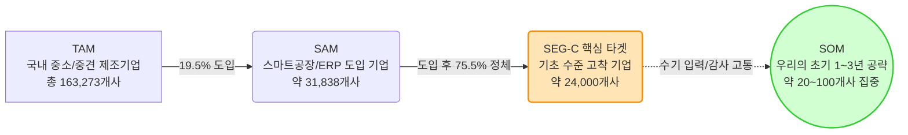
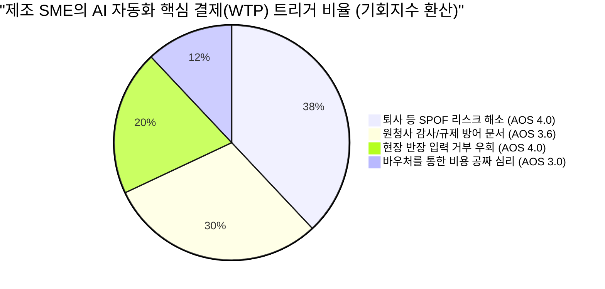

# Value Proposition Sheet (문제-해결 적합성 검증)
## 중소/중견 제조업 대상 AI 자동화 SI 및 SaaS 비즈니스

> **작성 목적**: 본격적인 신규 사업을 준비하는 예비창업자가 '우리는 어떤 고객에게 어떤 차별적 가치를 전달하는가?'를 명확히 정의하고, 시장 진입 전략의 나침반으로 활용하기 위한 통합 가치 제안서입니다.
> **검증 포인트**: 각 페르소나의 Pain Point가 구체적 솔루션(Feature)과 연결되어 실질적 효용(Outcome)으로 이어지는 '문제-해결-효과'의 완전성을 검증 및 시각화하였습니다.

---

## 1. Problem-Solution Fit: 고객별 가치 제안 (문제-해결-효과 매핑)

기존 기능 중심의 나열을 벗어나, 페르소나별 치명적 Pain이 어떻게 해결되고 어떤 정량적 효과를 내는지 명확히 매핑합니다.

| 타겟 페르소나 (Pain 주체) | 직면한 문제 (Problem) | 핵심 제안 (Solution Feature) | 기대 효과 (Desired Outcome) |
| :--- | :--- | :--- | :--- |
| **공장장 / COO** (현장운영) | **[단일 장애점 & 입력 거부]** 핵심 스케줄러 퇴사 시 공장이 멈추는 리스크. 막대한 비용을 들여 MES 키오스크를 도입해도 작업자가 입력을 전면 거부. | **[무입력 로깅 & ERP 브릿지]** 작업자 개입(터치/타이핑) 없이 음성/Vision만으로 현장 데이터를 패시브하게수집하고 ERP와 자동 연동 | **[운영 연속성 확보]** - 현장 작업자 수기 입력 **0%** - 1인 스케줄러 의존 탈피 - 불만 폭주 및 파업 리스크 제거 |
| **구매본부장 / 품질이사** (규제/감사 대응) | **[규제 방어막의 부재]** 원청사의 기습적 품질 감사나 탄소/Traceability 제출 요구 시, 데이터가 분절되어 있어 며칠 밤을 새워 취합해도 조작 의심을 받음. | **[원클릭 감사 리포터]** 연동된 데이터를 기반으로 원청사나 글로벌 규제가 요구하는 양식의 **적법 이력 증빙 PDF를 버튼 1회 추론으로 자동 생성** | **[생존권 및 신뢰 보장]** - 감사 리포트 취합 시간 **90% 단축** - 품질 원천 데이터 조작 의혹 소멸 - 즉각 제출로 납품 탈락 리스크 방어 |
| **CFO / CEO** (비용 및 결재) | **[정부 돈과 귀찮음 사이의 딜레마]** AI 도입의 성공이 불확실한 상태에서 내부 자금(수천~억 단위)을 지출할 수 없음. 그러나 정부 바우처를 받자니 신청/보고 서류 등 행정 부담이 막대함. | **[행정 턴키 대행 & 전용 ROI 진단]** 중기부/과기부의 AX/제조 바우처 사업 선정을 위한 사업계획서 대행부터 평가/사후 관리까지 100% 밀착 수행 | **[WTP 저항 제거]** - 도입 기업의 자부담 **최대 80%** 감축 - 사내 직원의 행정 투입 시간 **0시간** - 명확한 재무적 회수(Payback) 확인 |

---

## 2. Value Proposition Sheet 종합 캔버스

| 항목 | 내용 |
| :--- | :--- |
| **핵심 페르소나 및 시장** | **SEG-C (스마트공장 기초 수료 기업)**: 데이터 인프라의 껍데기만 존재하고 실무 활용이 전혀 이루어지지 않는 24,000개의 '정체된 중기업' |
| **우리 솔루션의 핵심 제안** | **"단 한 번의 키보드 입력 없이, 당장의 납품 규제를 통과시켜주는 정부 지원 AI 솔루션"** 결코 '10% 생산 효율화'라는 모호한 가치를 팔지 않음. 무입력, 원청사 규제 통과, 정부 바우처라는 강력한 생존/비용 프레이밍 제공. |
| **기존 대안 (Competitor)** | - **1세대 MES (수동)**: 작업자가 입력하지 않아 데이터 신뢰도가 바닥임. - **클라우드 글로벌 AI (SAP 등)**: CISO(보안)가 허락하지 않는 데이터 유출 위험과 수십억의 예산 부담. - **파워포인트/엑셀 (수기)**: 치명적인 휴먼 에러 창출, 담당자 부재 시 노하우 증발. |
| **우리가 제공하는 차별적 가치** | 1. **UX의 극한 (Zero Touch)**: 인간의 노력을 0으로 만드는 데이터 수집 2. **영업의 극한 (턴키 행정)**: 단순히 AI 소프트웨어가 아닌, 자금 조달 컨설팅(바우처)을 묶어 파는 '종합 가치' |

---

## 3. Proof (차별적 가치 검증 데이터 및 시각화)

해당 비즈니스의 성공 가능성을 재무 투자자나 내부 팀원에게 설득하기 위해 사용할 수 있는 **핵심 정량 데이터 시각화**입니다. (10번 리서치 및 29.2번 JTBD 인터뷰 산출물 기반)

### A. "이 시장은 정말 크고 타겟은 명확한가?" (TAM-SAM-SOM)
스마트공장 도입 후 '다음 단계(AI)'로 넘어가지 못하고 정체된 이른바 "ERP/MES 껍데기 기업"이라는 강력한 유효 시장(SAM)이 뒷받침합니다.

### B. "고객은 무엇 때문에 우리 AI를 사는가?" (JTBD / AOS 기반 구매 동인)
인터뷰 결과(총 14인), 중소 제조사 결정권자는 '생산성 10% 향상'과 같은 긍정적 지표보다 **'단일 장애점(퇴사) 공포 방어'와 '규제(감사) 회피'**라는 강력한 손실 회피 심리에 지갑을 엽니다.

### C. 수치적 Proof 요약
- **생존 규제**: 2026년부터 EU CBAM(탄소 국경세), 글로벌 원청사(삼성, 현대차 공급망)의 파트 이력 추적성 실사가 의무화됨. 데이터 제출 불가 시 벤더 탈락이라는 막대한 압박.
- **예산 지원**: 중기부/과기부 주도 2026년 "제조 AX 사업" 할당 예산만 **4,230억 원**. 고객사 자부담금 축소를 보장할 국비 자금줄이 확실히 존재함.

---

## 4. MVP Feature Map (초기 기능 우선순위 설계)

Problem-Solution Fit에 입각하여, 초기 한정된 리소스는 Pain 해소에 가장 치명적인 상위 4개 기능(High Rank)에 80% 이상 전념해야 합니다.

| 기능명 | 핵심 Job 연관성 (해결하는 문제) | 중요도 | 개발난이도 | 우선순위 | MVP 포함 |
| :--- | :--- | :---: | :---: | :---: | :---: |
| **1. ERP-MES API 자동 브릿지** | 데이터 사일로 해소 및 실무 이중 입력 방지 | 5 | 3 | **High** | ✔️ |
| **2. 원클릭 납품 이력 감사 리포터** | 원청사 실사 대비 PDF 야근 및 조작 의혹 소멸 | 5 | 2 | **High** | ✔️ |
| **3. 무입력 패시브 센싱 로깅** | 현장 작업자 저항 해소 및 노하우 자동 기록 | 5 | 4 | **High** | ✔️ |
| **4. CFO 맞춤 진단/바우처 설계기** | 자부담 삭감 증명으로 단기적 결재 방어 제거 | 4 | 2 | **Mid** | ✔️ |
| **5. 퇴사 헷지형 AI 공정 스케줄러** | 생산 공정 계획의 1인 두뇌 의존 탈피 | 4 | 5 | Mid | ✖️ (Phase 2) |
| **6. 온프레미스(폐쇄망) 보안 패키지**| CISO(보안팀)의 절대적 반대 논리 무력화 | 3 | 4 | Low | ✖️ (Phase 2) |

---

## 5. 예비 창업자를 위한 비즈니스 실행 제언 (Actionable Tips)

> [!IMPORTANT]
> **전략 요약: 철저하게 '솔루션'이 아닌 '고통의 진통제'로 위장하십시오.**
> 
> 1. **"기술"을 팔지 말고 "공포 해소"와 "돈"을 파십시오.**
>    고객사 대표와 임원들은 AI 알고리즘의 최적화 수준이나 혁신성에는 관심이 없습니다. 오직 **"이 시스템을 쓰면 김 부장이 내일 관둬도 공장이 돌아간다," "다음 달 삼성전자 감사팀이 와도 1초 만에 서류를 준다," "구축 비용 8천만 원은 중기부가 내줍니다"**라는 강력한 3문장만이 결재 번호표를 뽑게 만듭니다.
> 
> 2. **세그먼트 징검다리 전략 (Beachhead Market)**
>    TAM-SAM 맵에서 확인된 **SEG-C (스마트공장 기초는 갖췄으나 활용하지 못해 고통받는 2만 4천 개 기업)**를 최우선 진입 시장으로 삼으십시오. 데이터 인프라가 엉망인 극소기업이나, 절차가 복잡한 대기업은 초기 현금흐름을 고갈시키는 주범입니다. 
> 
> 3. **관문의 파괴: "트로이 목마 (바우처 대행사)" 전략**
>    소프트웨어의 완성도만큼 중요한 것은 **정부 지원 사업(AI 바우처 등)을 꿰뚫고 있는 행정 역량**입니다. 콜드 메일을 보낼 때 "우리 혁신 AI를 사세요"가 아니라, **"올해 귀사에 버려질 수 있는 중기부 현금 5천만 원 무상 지원금 확보, 저희가 서류 다 써드리겠습니다"**라고 접근하여 내부 도입의 심리적/재무적 장벽을 파괴하십시오.

---

## 6. 수익 구조 및 비즈니스 모델 설계 (왜 돈이 벌리는가?)

> 비즈니스의 수익성, 확장성, 지속가능성을 증명하는 가격 정책 및 과금 모델의 기초 설계입니다.

### A. 하이브리드 과금 모델 (Setup + MRR 구독형)
고객의 초기 도입 심리적 장벽(CAPEX 자부담)은 극소화하면서, 당사의 지속적 캐시플로우(MRR: Monthly Recurring Revenue)를 구축하는 수익 구조입니다.

1. **초기 구축비 (On-boarding & Setup)**: **약 5,000만 원 내외 (바우처 활용)**
   - 현장 Vision/음성 센서 최적화 세팅, ERP 연동 API 구축 등 솔루션 온보딩 비용.
   - **과금 전략**: 총 구축비의 80~90%를 정부 스마트공장 고도화/AX 바우처로 청구. 기업의 실제 자부담은 500~1,000만 원 수준으로 떨어져 결재 문턱이 극적으로 낮아짐.
2. **SaaS 구독료 (Recurring Revenue)**: **월 150~200만 원 (고객사 전액 자부담)**
   - 클라우드 인프라 파이프라인, AI 모델 토큰 비용, 그리고 수시로 바뀌는 원청사 'Traceability 규제 대응 포맷' 정기 업데이트 명목.

### B. 가격 수용성의 핵심 단초 (Pricing vs. Value)
"고객은 왜 초기 비용 외에도 매달 수백만 원을 기꺼이 지불하는가?"에 대한 명확한 재무적 답변(ROI)입니다.

* **Pain 1 기반 회수 (연 5,000만 원 방어)**: 이 시스템은 공장 스케줄이나 데이터를 한 사람이 쥐고 흔들다 퇴사했을 때 가동이 멈추는 리스크를 방어합니다. 숙련자 1인 대체에 투입되는 채용/기회비용(최소 연 5,000만 원) 대비, 본 솔루션의 월 유지비 150만 원은 현저히 저렴한 '경영 리스크 보험금'입니다.
* **Pain 2 기반 회수 (수억 원 대 벤더 탈락 방어)**: 삼성/현대차/해외원청사가 요구하는 탄소 이력이나 현장 실사 데이터를 내지 못하면 페널티를 물거나 다음 입찰에서 제외됩니다. 수억 원대 매출 증발을 막아주는 핵심 인프라이므로 월 150만 원이라는 가격 저항이 소멸됩니다.

### C. 리텐션(Lock-in)과 랜드 앤 익스팬드(Growth) 전략
* **교체 비용(Switching Cost)의 극대화**: 이 시스템을 해지하는 순간, 현장 작업자의 낡고 고통스러운 엑셀 수기 기록 야근이 다시 부활합니다. 즉, 현장 직원들이 '무입력 편의성'을 한 번 맛보게 되면, 관리자가 비용 절감을 위해 시스템을 내리는 것을 조직적으로 거부하는 강력한 Lock-in 이 발생합니다.
* **초기 침투 후 상향 판매 (Land & Expand)**: 1단계 '패시브 로깅+리포트'(핵심 MVP)로 바우처를 통해 거부감 없이 도입시킨 뒤 ➔ 2단계 공정 스케줄링 AI (월과금 인상) ➔ 3단계 품질 불량 탐지 XAI 모듈 추가 등 고부가 모듈을 지속적으로 Upsell하여 고객의 LTV(Customer Lifetime Value)를 극대화합니다.
