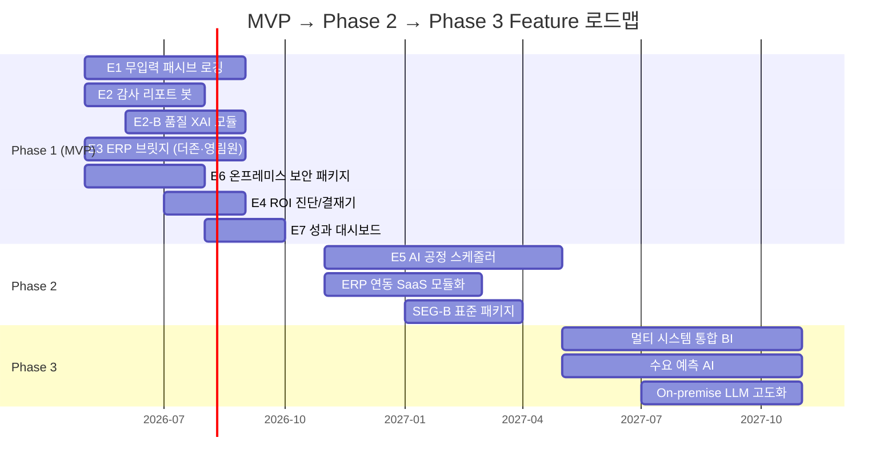

# Job(Value) - MVP Feature Map
## 고객의 핵심 완수 과제(Job)와 제품 기능(Feature) 매핑 보드

> **문서 목적**: 고객이 해결하고자 하는 근본적인 '과제(Job-to-be-Done)'와 이를 달성하기 위한 당사의 '제안 가치(Value)'를 매핑하고, 이를 실제 구현할 **MVP 단위 기능(Feature)들과 그 개발 우선순위**를 직관적으로 나열합니다.
> **설계 원칙**: 모든 기능은 AOS/DOS 기회분석(▶9)의 정량 데이터와 JTBD 인터뷰(▶10)의 정성 검증에 근거하며, 4인 DMU(COO·CFO·품질이사·CISO) 전원의 Job이 반영되어야 계약이 성사됩니다.
> **버전**: v1.2 (Opus Update — 10개 분석 보고서 검토 결과 반영)
> **작성일**: 2026년 4월

---

## 0. 공통 설계 원칙: Human-in-the-Loop 안전 프로토콜

> [!IMPORTANT]
> **AI는 제안·경고만 수행하며, 실행·확정은 반드시 인간이 승인합니다.**
>
> JTBD 인터뷰(▶10)와 페르소나 분석(▶7)에서 반복 확인된 핵심 불안(Anxiety)은 "AI가 틀렸을 때 책임은 누가 지나?"입니다. 제조 현장에서 AI의 비결정론적(non-deterministic) 특성은 품질사고·생산중단으로 직결될 수 있으므로, **MVP 전체 Feature에 다음 원칙이 적용**됩니다.

| 원칙 | 적용 방식 | 적용 Feature |
|------|----------|-------------|
| **AI 제안, 인간 확정** | AI가 생성한 모든 결과물(리포트, 스케줄, 경고)은 담당자의 명시적 Approve 없이 외부로 발행되지 않음 | E1~E7 전체 |
| **판단 근거 의무 표시** | AI가 판단·분류·경고를 수행할 때 반드시 "왜 이렇게 판단했는가"를 한국어로 설명 | E2 (XAI), E5 |
| **단독 실행 금지** | AI가 생산중단, 공정변경 등 물리적 영향이 있는 행위를 단독으로 실행하는 것을 시스템 레벨에서 차단 | E5 (스케줄러) |
| **롤백/수정 보장** | AI가 오인식한 데이터를 관리자가 한 화면에서 확인·일괄수정(Approve/Reject)할 수 있는 인터페이스 제공 | E1 (F1.3) |

---

## 1. Job - Value - Feature 매핑 보드 (Overview)

단순한 기능의 나열이 아닌, 기능이 존재해야 하는 '고객의 이유(Job)'에서 출발하는 매핑 테이블입니다. 개발팀은 이 표를 통해 '우리가 지금 만들고 있는 이 버튼이 어떤 비즈니스 가치를 방어하는가'를 이해할 수 있습니다.

| 타겟 페르소나 | 고객의 완수 과제 (Job) | 제안 가치 (Value Proposition) | MVP 대응 핵심 기능 (Epic/Feature) | AOS 합산 | 비즈니스 중요도 | 난이도 | 타이밍 적합도 | 우선순위 | 릴리즈 | 경쟁사 대비 차별 포인트 |
| :--- | :--- | :--- | :--- | :---: | :---: | :---: | :---: | :---: | :---: | :--- |
| **공장장 / COO** (현장 운영) AOS 4.0 · DOS 3.6 | "작업자들의 반발 없이, 그리고 특정 직원의 퇴사에 구애받지 않고 공정 데이터를 남기고 싶다." | **Zero-Touch 현장 본위 아키텍처** (현장 인력의 행동 변화 요구를 사실상 0으로 만듦) | **E1. 무입력 패시브 센싱 로깅**  - 현장 소음 제거형 음성 로깅  - Vision 기반 자동 캡처  - 관리자용 원클릭 롤백 | **8.0** | 5 | 4 | 5 | **P1** | MVP | 키오스크/태블릿 경쟁사 → 현장 거부. **비접촉 패시브 수집은 시장에 전무** |
| **구매본부장** (원청사 감사 방어) AOS 4.0 · DOS 2.8 | "원청사 감사팀이 들이닥쳤을 때 파편화된 실사 엑셀 데이터를 조작 의심 없이 1초만에 제출하고 싶다." | **납품 규제 100% 방어막** (보고서 야근 삭제 및 원청사 벤더 탈락 리스크 원천 차단) | **E2. 원클릭 감사 리포트 봇**  - Lot 추적 데이터 Merge  - 업종 특화 템플릿 PDF  - 결측치 강제 알림 체커  - **XAI 판단근거 시각화** | **7.6** | 5 | 2 | 5 | **P1** | MVP | 수기 엑셀 대안만 존재. **규제 포맷 자동 매핑은 시장에 전무** |
| **품질이사** (신뢰 검증자) AOS 3.0 · DOS 2.4 | "AI가 판단한 근거를 내 눈으로 확인하고, 최종 결정은 반드시 내가 내리고 싶다." | **Human-in-the-Loop 안전장치** (AI는 경고만, 결정은 반드시 인간) | **E2-B. 품질 이상탐지 XAI 모듈**  - AI 판단근거 한국어 설명  - "알림만, 결정은 이사님" UI  - AI 단독 생산중단 불가 보장 | **7.0** | 5 | 3 | 4 | **P1** | MVP | 전수검사 인해전술만 존재. **원인분석 불가. 판단근거 시각화는 시장 공백** |
| **IT 담당자(CIO)** (보안 및 연동) AOS 3.2 · DOS 2.4 | "현행 더존/영림원 ERP DB를 건드리지 않으면서도 두 시스템 간 정보 불일치를 막고 싶다." | **비파괴형 레거시 동기화** (고가의 시스템 교체 없이 기존 시스템 수명을 연장) | **E3. 레거시(ERP) API 브릿지**  - 더존·영림원 전용 Read-Only 커넥터  - 엑셀 Batch 브릿지 (극보안용) | **7.2** | 5 | 3 | 5 | **P1** | MVP | 더존 ONE AI는 자사 ERP 내부만 작동. **더존+영림원+엑셀 통합 브릿지는 신규** |
| **CISO / 정보보안책임자** (보안 최종 관문) AOS 1.0 · 평가 4.8 | "사내 데이터를 외부로 한 바이트도 내보내지 않으면서 AI 혁신을 허용하고 싶다." | **보안 정책 100% 준수 AI** (보안과 혁신의 공존을 가능하게 하는 인프라) | **E6. 온프레미스 보안 패키지**  - 폐쇄망 전용 AI 패키지  - ISMS 보안 준수 확인서  - RBAC + 접속이력 로그  - 망분리 아키텍처 설계서 | **4.2** | 4 | 3 | 5 | **P1** | MVP | 대부분 SaaS Only. **On-premise AI 패키지는 시장에 거의 전무** |
| **CFO / 기업대표** (도입 결재) AOS 1.6(CFO) · 3.0(CEO) | "우리 회사 자원을 축내거나 골치 아픈 서류 절차 없이 정부의 지원금을 받아 솔루션을 깔고 싶다. 투자 실패에 대한 공포를 명확히 해소받고 싶다." | **재무적 공포의 제거 (Turn-key)** (바우처 대행 + ROI 증명 + 실패 시 안전장치로 심리적·재무적 장벽 동시 파괴) | **E4. 영업용 진단 및 결재기**  - 실시간 B2B 바우처 설계 웹뷰  - CFO 결재용 도입 ROI 리포터  - AI 적합성 사전 진단 체크리스트  - 동종 업종 B/A 비교 카드 | **4.6** | 4 | 2 | 5 | **P2** | MVP | 벤더 ROI가 Generic. **기업 맞춤 재무 계산기 + 사전 진단은 없음** |
| **전체 DMU** (사용→유지 단계) | "도입 효과를 숫자로 보여줘야 계속 쓰겠다. 갱신 결재에 쓸 근거가 필요하다." | **MRR 정당화 & 확장 엔진** (리텐션 + 업셀을 자동화하는 성과 가시화) | **E7. 성과 가시화 & 리텐션 대시보드**  - 페르소나별 월간 성과 리포트  - 분기 ROI 누적 리포트  - NPS + 레퍼런스 동의 수집 | — | 4 | 2 | 3 | **P2** | MVP | 경쟁사 대부분 구축 후 유지 기능 없음. **자동 성과 증명은 차별화** |
| **공장장 / 대표** (스케줄링) | "생산 일정표를 짜는 박 부장의 뇌 구조를 시스템으로 대체해 휴먼 에러를 막고 싶다." | 특정 인력 의존성 탈피 (AI 대체) | **E5. 최적화 공정 AI 스케줄러**  - 작업 배분 알고리즘  - 스케줄링 XAI (결정근거 설명) | **10.0** | 5 | 5 | 2 | **P3** | Phase 2 | SAP PP 고비용. **중견기업 특화 경량 AI는 없음** |

> [!TIP]
> **E5(AI 스케줄러)의 AOS 합산은 10.0으로 최고이지만 P3인 이유**: 비즈니스 중요도는 최고(5)이나, **타이밍 적합도(2)**가 낮습니다. ① E1의 패시브 로깅 데이터가 최소 3개월 이상 축적되어야 AI 학습이 가능하고, ② 개발 난이도(5)로 초기 팀의 Go-to-Market을 6개월+ 지연시키며, ③ 기업마다 공정 변수가 달라 PoC 성공률이 낮습니다. "데이터 수집(Phase 1) → AI 학습(Phase 2)"의 순서가 반드시 지켜져야 합니다.

---

## 2. 우선순위에 따른 핵심 기능(Feature) 상세 목록

전체 E1~E7 중 MVP에 반드시 포함되어야 하는 기능에 대한 세부 기능 트리입니다.

### 🥇 Priority 1 (P1): 제품 본연의 생존과 핵심 가치 창출 (Must Have)

> P1 기능이 하나라도 빠지면 4인 DMU 중 최소 1인의 거부로 계약 자체가 불가합니다.

---

**[E1] 무입력 패시브 로깅 엔진 (Zero-Touch Logging)**
> 대응 Job: COO/공장장 "작업자 반발 없이 데이터를 남기고 싶다" | AOS 합산 8.0

*   **F1.1 노이즈 캔슬레이션 STT 커맨더**: 80dB 이상의 현장 기계음 속에서도 작업자의 지시어("금형 교체", "생산 완료")만 트리거하여 텍스트로 치환하는 모듈. (Whisper API 튜닝)
*   **F1.2 Vision 상태 캡처기**: 모바일 카메라로 공정 완성품/바코드/계기판을 찍으면 LLM이 상태 값을 파싱하여 시스템에 밀어 넣는 기능.
*   **F1.3 로그 롤백/수정 관리자 웹** *(Human-in-the-Loop)*: AI가 오인식한 데이터를 관리자(반장)가 퇴근 전 한 화면에서 확인하고 일괄 수정(Approve/Reject)할 수 있는 웹 뷰어. **AI 자동 확정 불가 — 반드시 인간 승인 필요.**

---

**[E2] 자동화된 추적성(Traceability) 컴플라이언스 봇**
> 대응 Job: 구매본부장 "감사 데이터를 1초만에 제출하고 싶다" | AOS 합산 7.6

*   **F2.1 파편화 로트(Lot) 머지 로직**: 수집된 로깅 데이터와 기존 ERP 재고 데이터를 로트 번호 기준으로 시간순 병합하는 백엔드 엔진.
*   **F2.2 업종 특화 템플릿 매핑 PDF 제너레이터**: **금속가공·식품제조 2개 버티컬 우선** 대응. 삼성전자(전자부품), 현대차(금속가공), EU CBAM(탄소), HACCP(식품안전) 등 주요 규제 포맷에 맞게 테이블 뷰를 재배치하고 워터마크가 찍힌 무결성 PDF로 다운로드 및 이메일 전송.
*   **F2.3 결측치 강제 알림 체커**: 리포트 생성 전 필수 데이터 누락 항목을 자동 감지하고 담당자에게 보완 요청 알림 발송.

---

**[E2-B] 품질 이상탐지 XAI 모듈 (설명 가능한 AI 품질 감시)**
> 대응 Job: 품질이사 "AI 판단 근거를 내 눈으로 확인하고, 최종 결정은 내가 내리고 싶다" | AOS 합산 7.0

*   **F2B.1 XAI 판단근거 시각화 대시보드**: AI가 이상 징후를 감지하거나 리포트를 생성할 때, **"왜 이 데이터를 이상으로 판단했는가"**를 한국어로 설명하는 인터페이스. 관련 데이터 포인트를 하이라이팅하여 품질이사의 직관적 검증을 지원.
*   **F2B.2 "알림만, 결정은 이사님" UI**: AI는 **절대로 단독으로 생산중단 결정을 내리지 않음**을 시스템 레벨에서 보장. 이상 감지 시 알림만 발송하고, 생산중단·공정변경 등 물리적 조치는 반드시 품질이사의 명시적 승인(Approve) 후에만 실행.
*   **F2B.3 판단 이력 감사 로그**: AI가 내린 모든 판단, 품질이사의 승인/거절 이력, 결과(실제 불량 여부)를 시간순으로 기록. 원청사 품질 감사 시 "AI 판단 → 인간 검증 → 결과" 전 과정을 증빙.

---

**[E3] 비파괴형 레거시(ERP) 브릿지**
> 대응 Job: CIO "ERP DB를 건드리지 않고 데이터를 연동하고 싶다" | AOS 합산 7.2

*   **F3.1 더존·영림원 전용 Read-Only DB 커넥터**: **더존 iCUBE/Smart A**, **영림원 K-System** 등 국내 주요 ERP의 특정 테이블(재고, 발주, 생산실적)만 읽어올 수 있도록 하여 고객사 IT 담당자의 정보유출/DB손상 핑계를 원천 차단하는 플러그인. 대상 테이블 범위를 CIO와 사전 합의하여 문서화.
*   **F3.2 Low-Tech 엑셀 Batch 업/다운로더**: API 개방을 절대 불허하는 극보안 타겟사를 위해, 기존 ERP 엑셀 덤프를 드래그 앤 드롭하면 우리 시스템 포맷에 자동 파싱되는 대체 기능. CISO의 "외부 접근 Zero" 요구와 양립.

---

**[E6] 온프레미스 보안 패키지 (Private AI Infrastructure)** *(신규)*
> 대응 Job: CISO "데이터를 외부로 한 바이트도 내보내지 않으면서 AI를 허용하고 싶다" | 평가 4.8

> [!CAUTION]
> **이 기능이 없으면 계약이 성사되지 않습니다.** CISO는 AOS가 낮아(1.0) "기회"로 보이지 않지만, 페르소나 평가 4.8점 최고를 기록한 **"숨은 최종 보스"**입니다. 영업 프로세스 후반에 갑자기 등장해 한마디로 전체를 무효화합니다.

*   **F6.1 폐쇄망 전용 AI 런타임 패키지**: 모든 AI 모델(STT, Vision, LLM)이 고객사 사내 서버에서만 구동. 외부 API 호출 Zero. Docker 기반 오프라인 설치 패키지로 배포.
*   **F6.2 오프라인 모델 업데이트**: AI 모델 업데이트 시 USB/내부망 전용 패키지로 배포. 인터넷 연결 없이 버전 관리 가능. *(JTBD ▶10 가설 F의 "업데이트 시 외부 접근 우려" 해소)*
*   **F6.3 ISMS/ISMS-P 보안 준수 확인서 자동 생성**: CISO가 내부 보안 심의에서 사용할 수 있는 **사전 작성된 보안 적합성 검증 문서**. 데이터 흐름도, 접근권한 매트릭스, 암호화 방식 등을 표준 양식으로 출력.
*   **F6.4 RBAC + 접속이력/데이터조회 감사 로그**: 역할 기반 접근 제어 기본 내장. 누가/언제/어떤 데이터를 조회했는지 전수 기록. 이상 접근 감지 알림.
*   **F6.5 망분리 아키텍처 설계서**: IT 보안 심의 동행 PT에서 사용할 수 있는 네트워크 다이어그램. OT/IT 망분리 원칙 충족 증빙.

---

### 🥈 Priority 2 (P2): 영업 마찰력 제거 및 리텐션 확보 (Should Have)

---

**[E4] CFO 전용 진단 및 도입 시뮬레이터 (B2B 세일즈 내장 툴)**
> 대응 Job: CFO "확실한 ROI와 실패 안전장치 없이는 결재 못 한다" | AOS 합산 4.6

*   **F4.1 반응형 바우처/ROI 웹 계산기**: 기업의 "직원수, 기존 ERP 명"만 입력하면 현 시점 국가지원금 매칭 확률, 예상 자부담금 축소액, 그리고 야근(시간) 삭감 회수액이 즉시 출력되는 마케팅 및 영업용 무기.
*   **F4.2 AI 적합성 사전 진단 체크리스트** *(신규)*: "귀사의 5가지 조건(ERP 보유 여부, 데이터 축적 기간, 스마트공장 단계, 핵심 인력 리스크, 원청사 규제 수준) 충족률 → 예상 성공률 80%"처럼 **도입 전 리스크를 정량화**하여 CFO의 투자 실패 공포를 해소.
*   **F4.3 동종 업종 Before-After 비교 카드 생성기** *(신규)*: "금속가공 A사 → 도입 전/후 납기 준수율 72%→94%, 감사 대응 시간 48h→2h" 형식의 **업종별 실증 카드를 자동 생성**. 남의 회사 ROI를 불신하는 CFO에게 "우리 업종" 데이터를 제공.

---

**[E7] 성과 가시화 & 리텐션 엔진** *(신규)*
> 대응 Job: 전체 DMU "숫자로 보여줘야 계속 쓰겠다" | CJM(▶8) 교차분석 핵심 결론

> [!IMPORTANT]
> **이 기능은 MRR(월 구독료 150~200만 원)을 정당화하는 핵심 기능입니다.** 고객여정지도(▶8)에서 4인 모두 "사용 후 숫자로 보여줘야 계속 쓰겠다"는 공통 동기가 확인되었습니다. 이 기능이 없으면 구독 갱신 거절률이 급증합니다.

*   **F7.1 페르소나별 월간 성과 대시보드 자동 발행**:
    - **COO용**: 납기 준수율, 스케줄 수립 소요시간, 설비 가동률 추이
    - **CFO용**: 운영비 절감 누적 금액, 재고 회전율, 바우처 사후관리 현황
    - **품질이사용**: 불량률 추이, AI 이상감지 적중률(Precision/Recall), 원청사 감사 통과 이력
    - **CISO용**: 외부 트래픽 Zero 검증 로그, 접근 권한 변동 이력, 보안 이벤트 리포트
*   **F7.2 분기 ROI 누적 리포트**: "도입 후 N개월, 총 절감 금액 X원, 감사 리포트 Y건 자동 발행, 납기 지연 Z건→0건" 형식으로 CFO의 **갱신 결재를 자동 지원**.
*   **F7.3 NPS 조사 + 레퍼런스 동의 수집**: 성과 리포트 수신 시 1클릭 NPS 평가. 고만족(9~10점) 고객에게 레퍼런스 동의 및 동종 업계 지인 소개 자동 요청. *(CJM ▶8 §5 "레퍼런스 복리" 구조 실현)*

---

### 🥉 Priority 3 (P3): 고도화 및 장기 비전 (Out of MVP Scope — Phase 2)

**[E5] 완전 자동화 공정 스케줄러 & 스케줄링 XAI 모듈**
> 대응 Job: COO/공장장 "스케줄러 1인의 뇌를 시스템으로 대체하고 싶다" | AOS 합산 10.0 (최고)

*   **F5.1 작업 배분 알고리즘**: 설비 가동률, 자재 재고, 작업자 숙련도를 종합하여 최적 생산 스케줄 자동 생성. *단, E1의 패시브 로깅 데이터가 최소 3개월 이상 축적된 이후에만 학습 가능.*
*   **F5.2 스케줄링 XAI (결정근거 설명)**: AI가 왜 이 순서로 작업을 배치했는지를 "자재 A 입고 예정일에 맞추어 라인 2를 우선 가동"과 같이 자연어로 설명.
*   *(배제 사유)*: AOS 합산 최고(10.0)이나, ① Phase 1 데이터 축적이 선행 필수, ② 기업마다 공정 변수가 달라 초기 개발 코스트가 천문학적, ③ PoC 성공률이 낮아 Phase 2에 배치. 비즈니스 중요도 5 / 타이밍 적합도 2.

---

## 3. 기능 우선순위(Priority) 산정 원칙 근거

| 결정 요소 | P1 (Must Have) 산정 이유 | P3 (Out of Scope) 배제 이유 |
| :--- | :--- | :--- |
| **비즈니스 임팩트 (JTBD/AOS)** | '현장 입력 탈피'(AOS 4.0)와 '원청사 감사 방어'(AOS 3.6)는 생존 필수 조건. '보안 관문 통과'(CISO 평가 4.8)는 계약 전제 조건. | '생산성 10% 증대 스케줄러'(AOS 10.0)는 최고 점수이나, 당장의 목숨(벤더 탈락)을 좌우하진 않으며 데이터 선행 필요. |
| **고객의 지불의사(WTP)** | '자부담 최소화'와 '실패 시 환불 보증'이 WTP의 강력한 트리거. ROI 계산기+사전 진단(P2)이 스케줄링(P3)보다 결재를 더 빨리 받아냄. | XAI 스케줄링은 도입 초기가 아닌 활용 이후에 가치를 느끼므로 Upsell 영역. |
| **타임투마켓 (개발 복잡도)** | PDF 출력, STT 파싱, 온프레미스 Docker 패키지는 현존 API/인프라로 단기간 내 Go-to-Market 가능. | 자체 강화학습 기반의 스케줄러 개발은 엔진 구축에만 6개월 이상 소요. |
| **DMU 통과 필수성** | E6(온프레미스)이 없으면 CISO 거부 → 전체 무효화. E2-B(XAI)가 없으면 품질이사 불신 → 조직적 저항. | 스케줄러 미포함 시 COO가 아쉬워하지만, 로깅+리포트로 당장의 SPOF 리스크는 방어 가능. |

---

## 4. Phase 로드맵 — 세그먼트 확장 경로 연동

TAM-SAM-SOM(▶6) §10~§12의 세그먼트 이동 경로 및 3단계 공략 로드맵과 Feature를 연동합니다.

| Phase | 시기 | 대상 세그먼트 | 핵심 Feature | 목표 |
|:---:|:---:|:---:|:---|:---|
| **Phase 1 (MVP)** | 0~6개월 | **SEG-C** (초핵심) | E1 + E2 + E2-B + E3 + E4 + E6 + E7 | 바우처 연계 첫 수주 4~6건. "데이터 수집 + 리포팅 + 보안" 기반 확보 |
| **Phase 2** | 6~12개월 | SEG-C 확장 **+ SEG-B 진입** | E5 AI 스케줄러 + ERP 연동 SaaS 모듈화 | Phase 1 데이터 기반 AI 학습. ERP 고아 기업용 표준 SaaS 패키지 출시 |
| **Phase 3** | 12~24개월 | SEG-B 안정 **+ SEG-D 진입** | 멀티 시스템 통합 BI + 수요 예측 + On-premise LLM | 중견기업 억 단위 AX 수주. MRR 30%↑ 달성 |

---

## 5. Feature-페르소나 커버리지 검증 매트릭스

4인 DMU가 모두 커버되는지 확인하는 크로스체크 테이블입니다.

| Feature | COO/공장장 | 구매본부장 | 품질이사 | CIO | CFO/CEO | CISO | 비고 |
|---------|:---:|:---:|:---:|:---:|:---:|:---:|------|
| **E1** 무입력 로깅 | ★ | ○ | | | | | 핵심 |
| **E2** 감사 리포터 | ○ | ★ | ○ | | | | 핵심 |
| **E2-B** 품질 XAI | | | ★ | | | | 핵심 |
| **E3** ERP 브릿지 | ○ | ○ | | ★ | | | 핵심 |
| **E4** ROI 진단 | | | | | ★ | | 영업 |
| **E5** AI 스케줄러 | ★ | | | | | | Phase 2 |
| **E6** 온프레미스 | | | | ○ | | ★ | 필수 관문 |
| **E7** 성과 대시보드 | ○ | ○ | ○ | | ○ | ○ | 리텐션 |

★ = 직접 해결 / ○ = 간접 혜택

> **검증 결과**: 4인 DMU(COO·CFO·품질이사·CISO) 모두 최소 1개 이상의 ★ Feature를 보유. 원본 대비 품질이사(E2-B)와 CISO(E6)가 추가되어 **DMU 전원 커버리지 달성**.

---

## 부록. 분석 보고서 연계 매핑

| Feature | 근거 보고서 | 핵심 연결 |
|---------|-----------|----------|
| E1 무입력 로깅 | ▶10 JTBD Case 1, ▶9 AOS 4.0 | "아무것도 안 해야죠" 직접 인용 |
| E2 감사 리포터 | ▶10 JTBD Case 2, ▶9 AOS 4.0/DOS 2.8 | "버튼 하나로 Traceability Report" |
| E2-B 품질 XAI | ▶7 §11 차품질, ▶9 AOS 3.0 | "AI는 이사님의 24시간 감시 조수" |
| E3 ERP 브릿지 | ▶4 KSF-3, ▶5 Integration Moat | 더존·영림원 커넥터 선점 전략 |
| E4 ROI 진단 | ▶10 JTBD 가설 E, ▶5 투자 실패 공포 | 바우처 대행 + 공포 해소 패키지 |
| E5 AI 스케줄러 | ▶9 AOS 합산 10.0 (최고), ▶10 가설 A | Phase 1 데이터 선행 필수 |
| E6 온프레미스 | ▶7 §12 최보안, ▶10 가설 F | "한 바이트도 안 나가는 Private AI" |
| E7 성과 대시보드 | ▶8 CJM §5 교차분석 | "숫자로 보여줘야 계속 쓰겠다" |

---

*본 문서는 10개 분석 통합본(포터5가지힘·경쟁사브리핑·가치사슬·KSF·문제정의서·TAM-SAM-SOM·페르소나스펙트럼·고객여정지도·AOS-DOS기회분석·JTBD인터뷰)을 기반으로 작성된 Job-MVP Feature Map 통합본입니다.*
*버전: v1.2 Opus Update / 작성일: 2026년 4월*
