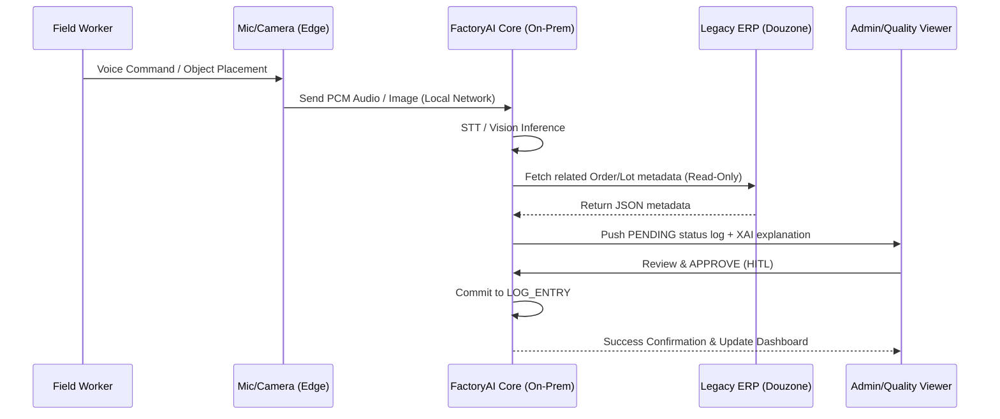

# Software Requirements Specification (SRS)
Document ID: SRS-001
Revision: 1.0
Date: 2026-04-18
Standard: ISO/IEC/IEEE 29148:2018

---

## 1. Introduction

### 1.1 Purpose
The purpose of this document is to define the software and service requirements for the "FactoryAI" (제조 AI 자동화 플랫폼), designed to solve the "Second Automation Gap" in the manufacturing industry. Despite the installation of basic MES/ERP systems, a 75.5% stagnation rate persists due to field workers rejecting manual data entry. FactoryAI aims to establish a Zero-Touch passive data logging infrastructure, 1-click audit reporting, read-only ERP bridging, and a 100% on-premise security architecture combined with turnkey administrative services, enabling seamless AI adoption without field resistance or compliance risks.

### 1.2 Scope
**In-Scope (MVP - Phase 1):**
* **Software (SW):** Zero-Touch passive logging via STT and Vision (E1), 1-click automated audit reports (E2), XAI-based anomaly detection with Human-in-the-Loop (HITL) approval (E2-B), non-destructive ERP bridge for Douzone/Younglimwon (E3), ROI calculator for financial decision-making (E4), 100% on-premise secure Docker deployment (E6), and persona-specific performance dashboards (E7).
* **Services (SVC):** Site survey and 2-week field accompaniment (SVC-1), turnkey government voucher administration (SVC-2), CISO security review accompaniment with pre-packaged documentation (SVC-3), voucher follow-up management (SVC-4), and on-site hardware/software troubleshooting (SVC-5).
* **Target Verticals:** Metal processing and Food manufacturing sectors.

**Out-of-Scope (Phase 2+):**
* AI Process Scheduler (E5) – deferred until 3 months of data accumulation is achieved.
* Procurement of client-side hardware (only specification guidelines provided).
* Modification of existing manufacturing processes or physical lines.
* Public cloud deployment options (SaaS).
* Multi-language support (Non-Korean).
* ERP connectors outside of Douzone and Younglimwon (requires Excel batch parser).

### 1.3 Definitions, Acronyms, Abbreviations
* **HITL (Human-in-the-Loop):** A critical safety protocol requiring human approval for AI-generated results before system execution or external reporting.
* **Zero-Touch UX:** A user experience paradigm requiring zero manual data entry (no typing, no kiosk interaction), relying exclusively on passive STT and Vision.
* **SPOF (Single Point of Failure):** A vulnerability where one person's absence (e.g., scheduler resignation) halts production.
* **WTP (Willingness to Pay):** The maximum amount a customer is willing to spend, targeted here at the cost equivalent of one employee's annual salary (approx. 50M KRW).
* **MRR (Monthly Recurring Revenue):** Subscription fee generated post-PoC or voucher period (1.5M ~ 2.0M KRW).
* **ADR (Architecture Decision Records):** Immutable documentation of critical architectural choices (e.g., 100% On-premise, Read-only ERP).

### 1.4 References
* **[REF-01]** VPS V3 Updated Final (`06_VPS_V3_Updated_1_20260411_final.md`)
* **[REF-02]** Business Analysis Report: Porter's 5 Forces (▶1)
* **[REF-03]** Business Analysis Report: Competitor Briefing (▶2)
* **[REF-04]** Business Analysis Report: JTBD Interviews & 6 Hypotheses (▶10)
* **[REF-05]** Business Analysis Report: Persona Spectrum & DMU (▶7)
* **[REF-06]** Business Analysis Report: Customer Journey Map (▶8)

### 1.5 Constraints and Assumptions
* **Constraints (ADR based):**
    * **ADR-1:** 100% On-premise. 0 bytes of outbound external traffic allowed.
    * **ADR-2:** ERP integration must strictly be Read-Only. No destructive writes to existing ERP schemas.
    * **ADR-3:** HITL mandatory. No autonomous physical execution by AI without human approval.
    * **ADR-4:** Model updates must occur via USB or isolated internal networks, requiring strict hash verification.
* **Assumptions:**
    * The client provides or procures an on-premise server (Min: 16GB RAM; Rec: GPU T4+ 32GB RAM).
    * Client's CIO pre-approves Read-Only DB access to the required ERP tables.
    * Target field environments allow sensor installation (power, space, internal network) and have noise levels manageable by directional microphones (approx. 80dB+).
    * Korean government continues the manufacturing AX voucher program for 2026.

---

## 2. Stakeholders

| Stakeholder / Role | Key Interest / Responsibility | Pain Points (Current State) |
| :--- | :--- | :--- |
| **COO / Plant Mgr (한성우)** | Field operations stability, schedule fulfillment, worker adoption. | Delivery delays (4-6/mo) due to SPOF, MES data absence (>40%). |
| **Purchasing Head (클레어 리)** | Regulatory compliance, managing primary vendor audits. | 48h+ manual audit preparation, data discrepancy rates >15%. |
| **Quality Director (차품질)** | Quality assurance, AI validation, preventing claims. | Distrust of "black-box" AI models; requires XAI visualization and final say. |
| **CIO (정미경)** | IT infrastructure management, ERP stability. | Manual MES-ERP merging (>40h/mo), high ERP replacement quotes (1.5B+ KRW). |
| **CFO (이재무)** | Budget approval, ROI verification, voucher administration. | High IT budget rejection (>70%), tedious administrative overhead (80h+/case). |
| **CISO (최보안)** | Information security, network isolation, regulatory compliance. | 100% rejection rate for SaaS AI proposals. Demands zero external data leakage. |

---

## 3. System Context and Interfaces

### 3.1 External Systems
* **Legacy ERP Systems (Douzone iCUBE/Smart A, Younglimwon K-System):** External data sources accessed strictly in read-only mode to pull inventory, order, and performance schemas.
* **Government Voucher Portal:** External administrative portal for submitting business plans and audit reports (Manual/Service interface, no direct API).

### 3.2 Client Applications
* **Admin Rollback & Approval Web Viewer:** Web interface for operators to approve/reject AI-generated logs.
* **XAI Dashboard:** Web interface for the Quality Director to review anomaly explanations and provide final execution decisions.
* **ROI Simulator Web:** Interface for the CFO to calculate payback periods and voucher suitability.
* **Executive Performance Dashboard:** Multi-persona monthly reporting view.

### 3.3 API Overview
* **`/api/v1/ingest/audio`**: Receives 16kHz PCM audio streams, processes via local STT, returns transcribed text and intent.
* **`/api/v1/ingest/vision`**: Receives JPEG/PNG payloads, returns parsed state values.
* **`/api/v1/erp/sync`**: Triggers batch synchronization from read-only ERP connectors.
* **`/api/v1/audit/generate`**: Initiates PDF generation for specific regulatory templates merging LOT data.
* **`/api/v1/xai/explain`**: Generates Korean natural language explanations for detected anomalies.

### 3.4 Interaction Sequences


---

## 4. Specific Requirements

### 4.1 Functional Requirements

| ID | Module / Feature | Description | Acceptance Criteria | Source (Story) | Priority |
| :--- | :--- | :--- | :--- | :--- | :--- |
| **REQ-FUNC-011** | E1: STT Logging | System shall convert voice triggers to text in 80dB+ environments. | Given voice command, When processed, Then exact match >=90%, latency <=2s. Unregistered languages rejected with 0 mislogs. | US-01 | Must |
| **REQ-FUNC-012** | E1: Vision Logging | System shall parse visual states from cameras. | Given image payload, When processed, Then success rate >=85%, latency <=5s. Lens contamination triggers "Retake" alert within 3s. | US-01 | Must |
| **REQ-FUNC-013** | E1: Fallback Mode | System shall downgrade to Vision-only if STT fails persistently. | Given STT accuracy <70% for 3 consecutive attempts, Then switch to Vision-only mode and alert COO within 1m. | US-01 (R3) | Must |
| **REQ-FUNC-021** | E2: Audit PDF Gen | System shall generate regulatory-compliant PDF reports merging LOT data. | Given valid data, When 'Generate' clicked, Then PDF created <=30s, LOT merge accuracy >=99%. | US-02 | Must |
| **REQ-FUNC-022** | E2: Missing Data | System shall detect and alert missing required audit fields. | Given incomplete LOT, When generation attempted, Then abort and show missing fields list within 30s. | US-02 | Must |
| **REQ-FUNC-031** | E3: ERP Connector | System shall fetch data from Douzone/Younglimwon via read-only sync. | Given active connector, When sync triggered, Then fetch data <=5m without any schema modifications/writes to ERP. | US-03 | Must |
| **REQ-FUNC-032** | E3: Excel Parser | System shall parse Excel batch files for offline ERP syncing. | Given .xlsx upload, When processed, Then map data <=30s/file. Reject files >50MB. | US-03 | Must |
| **REQ-FUNC-041** | E4: ROI Calc | System shall calculate matched voucher amounts and payback periods. | Given company metrics, When calculated, Then display ROI <=3s. Block calculation if required fields are missing. | US-04 | Should |
| **REQ-FUNC-042** | E4: Voucher Fit | System shall assess voucher eligibility based on 5 parameters. | Given 5 params, When submitted, Then display success probability and risk tiers <=5s. | US-04 | Should |
| **REQ-FUNC-061** | E6: Air-gapped AI | System shall execute all models locally without external API calls. | Given operational state, When monitored, Then 0 bytes of external outbound traffic generated. | US-05 | Must |
| **REQ-FUNC-062** | E6: USB Update | System shall support offline updates via USB with hash validation. | Given USB package, When update initiated, Then install if hash matches. Alert CISO & block if hash mismatched. | US-05 | Must |
| **REQ-FUNC-071** | E2-B: XAI Notify | System shall generate Korean language explanations for anomalies. | Given anomaly, When processed, Then display XAI text + data highlight <=3s. | US-06 | Must |
| **REQ-FUNC-091** | HITL: Approval | System shall block external publishing/reporting without human approval. | Given PENDING log, When publish attempted, Then block operation and log event. | ADR-3 | Must |
| **REQ-FUNC-092** | HITL: Rollback | System shall preserve original data if Admin REJECTS AI suggestion. | Given REJECT action, When processed, Then original state restored, logged in audit trail. | ADR-3 | Must |
| **REQ-FUNC-081** | E7: Dashboard | System shall automatically generate role-specific monthly dashboards. | Given month-end, When triggered, Then render dashboards <=5s, max delay 24h. | US-07 | Should |

### 4.2 Non-Functional Requirements

| ID | Category | Requirement Description | Target Metric / SLA | Source |
| :--- | :--- | :--- | :--- | :--- |
| **REQ-NF-001** | Performance | STT API response time (p95 latency). | <= 2,000 ms (CPU/GPU) | PRD 5-1 |
| **REQ-NF-002** | Performance | Vision API response time (p95 latency). | <= 5,000 ms (CPU), <= 3,000ms (GPU) | PRD 5-1 |
| **REQ-NF-003** | Performance | PDF Generation response time (100 LOTs). | <= 30,000 ms | PRD 5-1 |
| **REQ-NF-004** | Capacity | System shall support concurrent user access without p95 degradation. | Up to 30 concurrent users | PRD 5-1 |
| **REQ-NF-005** | Capacity | System shall handle continuous sensor data ingestion without drops. | STT 10 req/min + Vision 5 req/min | PRD 5-1 |
| **REQ-NF-010** | Availability | Overall system uptime, excluding planned maintenance. | >= 99.5% / month | PRD 5-2 |
| **REQ-NF-011** | Reliability | Mean Time Between Failures (MTBF). | >= 720 hours | PRD 5-2 |
| **REQ-NF-012** | Reliability | Mean Time To Recovery (MTTR). | <= 2 hours | PRD 5-2 |
| **REQ-NF-013** | Availability | System Backup (Recovery Point Objective - RPO). | <= 1 hour (Local Backup) | PRD 5-2 |
| **REQ-NF-020** | Security | Critical and High severity vulnerabilities (CVE) in Docker images. | 0 (Zero) before deployment | PRD 5-3 |
| **REQ-NF-021** | Security | Role-Based Access Control (RBAC). | Enforce 5 roles: ADMIN, OPERATOR, AUDITOR, VIEWER, CISO | PRD 5-3 |
| **REQ-NF-022** | Security | Audit Log real-time alerting for unauthorized access attempts. | Alert CISO <= 10 seconds | PRD 5-3 |
| **REQ-NF-030** | Accuracy | Field Data missing rate (Missing logs / Total expected logs). | <= 5% (Down from 40%+) | PRD 1-2 |
| **REQ-NF-031** | Accuracy | Audit report discrepancy rate (Data matching integrity). | <= 1% | PRD 5-2 |
| **REQ-NF-040** | Service SLA | On-site troubleshooting response time (Hardware/Software). | Capital area <= 4h, Non-capital <= 8h | PRD 5-4 |
| **REQ-NF-041** | Service SLA | Voucher application submission timeline. | >= 7 days before Gov Deadline | PRD 5-4 |
| **REQ-NF-050** | Storage | Annual storage consumption per client site. | <= 500 GB (Retention: 3 yrs) | PRD 5-1 |

---

## 5. Traceability Matrix

| Story / Epic | Requirement ID | Traceability Goal | Expected Test Case Scope (TC ID) |
| :--- | :--- | :--- | :--- |
| US-01 (E1) | REQ-FUNC-011 | Voice -> Text matching logic | TC-010 (Noise env. STT accuracy test) |
| US-01 (E1) | REQ-FUNC-012 | Image -> Value logic | TC-011 (Low-light vision parse test) |
| US-01 (E1) | REQ-FUNC-013 | STT degradation fallback | TC-012 (Continuous STT fail emulation) |
| US-02 (E2) | REQ-FUNC-021 | PDF creation & LOT merge | TC-020 (100 LOT merge & PDF export) |
| US-02 (E2) | REQ-FUNC-022 | Missing field block | TC-021 (Incomplete LOT rejection test) |
| US-03 (E3) | REQ-FUNC-031 | DB Read-only connector | TC-030 (Douzone query timeout test) |
| US-04 (E4) | REQ-FUNC-041 | ROI Math generation | TC-040 (Formula variance test) |
| US-05 (E6) | REQ-FUNC-061 | Network isolation | TC-060 (Packet capture outbound block test) |
| US-05 (E6) | REQ-FUNC-062 | USB Hash validator | TC-061 (Invalid hash rejection test) |
| US-06 (E2-B)| REQ-FUNC-071 | XAI Generator | TC-070 (LLM output latency & readability test) |
| ADR-3 (HITL)| REQ-FUNC-091 | Global approval gate | TC-090 (Bypass execution block test) |
| US-07 (E7) | REQ-FUNC-081 | Dashboard rendering | TC-080 (30-user concurrent render load test) |

---

## 6. Appendix

### 6.1 API Endpoint List
| Endpoint Route | Method | Purpose | Auth Level | Request Format |
| :--- | :--- | :--- | :--- | :--- |
| `/api/v1/ingest/audio` | POST | Process Voice to Text | OPERATOR | `multipart/form-data` (16kHz PCM) |
| `/api/v1/ingest/vision` | POST | Process Image to State | OPERATOR | `image/jpeg` or `image/png` |
| `/api/v1/erp/sync` | GET | Trigger ERP sync batch | ADMIN | Query parameters (Table, DateRange) |
| `/api/v1/audit/generate` | POST | Compile PDF report | AUDITOR | JSON (Regulation_Type, Lot_IDs) |
| `/api/v1/xai/explain` | GET | Retrieve XAI context | AUDITOR | Path param (Anomaly_ID) |
| `/api/v1/system/update`| POST | Apply local model update | CISO | Binary (.tar.gz) + sha256 header |

### 6.2 Entity & Data Model

| Entity Name | Primary Key | Critical Attributes (Type) | Relations | Purpose |
| :--- | :--- | :--- | :--- | :--- |
| **FACTORY** | `id` (uuid) | `name` (string), `onprem_ip` (string) | 1:N PRODUCTION_LINE | Tenant root representation |
| **LOG_ENTRY** | `id` (uuid) | `captured_at` (timestamp), `source_type` (enum: STT, VISION), `raw_data` (json), `status` (enum: PENDING, APPROVED) | N:1 WORK_ORDER, N:1 APPROVAL | Stores raw passive log data |
| **APPROVAL** | `id` (uuid) | `approver_id` (uuid), `decision` (enum), `reason` (string) | 1:1 LOG_ENTRY | Enforces HITL constraint |
| **AUDIT_REPORT** | `id` (uuid) | `regulation_type` (enum), `pdf_binary` (blob), `xai_explanation` (json), `integrity` (enum) | N:M LOT | Stores immutable generated PDFs |
| **VOUCHER_PROJECT**| `id` (uuid) | `voucher_type` (enum), `status` (enum), `self_pay_amount` (decimal), `audit_date` (date) | N:1 FACTORY | Tracks SVC-2 admin progress |
| **SECURITY_REVIEW**| `id` (uuid) | `document_prepared` (date), `result` (enum: PENDING, APPROVED, REJECTED) | N:1 FACTORY | Tracks CISO approval (SVC-3) |
| **SUBSCRIPTION** | `id` (uuid) | `mrr_amount` (decimal), `cumulative_savings` (json), `renewal_result` (enum) | 1:1 FACTORY | MRR and ROI validation tracking |

### 6.3 Detailed Interaction Models (HITL & XAI Approval Workflow)

```mermaid
sequenceDiagram
    autonumber
    actor System as Sensor/AI Module
    participant API as API Gateway
    participant DB as LOG_ENTRY Table
    participant XAI as XAI Engine
    actor Quality as Quality Director
    actor ERP as ERP Connector

    System->>API: Submit Anomaly Detected Log (Source: Vision)
    API->>DB: Insert as status="PENDING"
    API->>XAI: Request anomaly explanation
    XAI-->>API: Return Korean rationale (e.g., "Heat signature mismatch")
    API->>Quality: Push Alert (Rationale + Raw Image)
    
    Note over Quality, API: Wait for human decision (HITL Rule 2 & 3)
    
    alt Quality APPROVES
        Quality->>API: Send APPROVE signal
        API->>DB: Update status="APPROVED"
        API->>ERP: Proceed with downstream sync
    else Quality REJECTS
        Quality->>API: Send REJECT signal
        API->>DB: Update status="REJECTED" (Keep raw)
        API->>System: Trigger "Recalibrate" / Alert COO
    


---

## 7. Architecture Decision Records (ADR)
PRD 섹션 10의 의사결정 내역을 기반으로 시스템 설계의 핵심 제약 사항을 명세합니다.

| ADR ID | 결정 사항 | 결정 근거 (Context) | 트레이드오프 및 결과 |
| :--- | :--- | :--- | :--- |
| **ADR-001** | **100% 온프레미스 배포** | CISO의 클라우드 거절률 100% 및 보안 심의 장벽 | 외부 트래픽 0 byte 실현, 원격 지원 불가 리스크 발생 (현장 출동으로 보완) |
| **ADR-002** | **Read-Only ERP 연동** | 기존 ERP(더존/영림원) 교체 비용(15억+) 및 CIO의 시스템 안정성 요구 | 비파괴형 브릿지 구현, ERP 직접 쓰기 불가 (현장 관리자 수동 처리 병행) |
| **ADR-003** | **HITL 안전 프로토콜** | AI 오판 시 수조 원대 클레임 및 품질 책임 공포 해소 필요 | AI 단독 실행 0건 보장, 승인 워크플로우로 인한 자동화 효율 일부 감소 |
| **ADR-004** | **USB 오프라인 업데이트** | 에어갭(폐쇄망) 환경에서의 모델 최적화 및 보안 무결성 확보 | 물리적 방문 및 해시 검증 필수, 실시간 모델 배포 불가 |
| **ADR-005** | **Zero-Touch UX** | 현장 작업자의 입력 거부(결측률 40%+) 해결 | STT/Vision 패시브 수집, 소음 환경 정확도 한계 발생 (시각 인지 전환으로 보완) |
| **ADR-006** | **바우처 번들링 영업** | CFO의 지불 의사(WTP) 및 행정 부담 제거 요구 | 초기 바우처 의존도 높음, Year 2 자립을 위한 MRR 전환 설계 필수 |
| **ADR-007** | **E5(스케줄러) 연기** | AI 스케줄러 가동을 위한 최소 3개월의 데이터 축적 필요 | MVP 범위 제외(Phase 2), 초기 단계 수동 스케줄 지원 서비스로 대체 |

---

## 8. Verification & Validation (V&V) Plan
PRD 섹션 8.3의 가설 검증 설계를 기반으로 요구사항의 충족 여부를 확인하는 측정 계획입니다.

| 검증 ID | 가설 및 요구사항 | 성공 기준 (Success Criteria) | 실패 시 피봇(Pivot) 전략 |
| :--- | :--- | :--- | :--- |
| **V&V-001** | **H1: Zero-Touch 수용도** | 결측률 40% → 10% 이하, 만족도 ≥ 4.0 | 결측률 > 20% 시 파인튜닝 추가 투자 또는 하이브리드 입력 모드 검토 |
| **V&V-002** | **H2: 감사 리포트 효용** | 생성 소요 48h → 1h 이내, 지적 0건 | 소요시간 > 4h 시 템플릿 커스터마이징 범위 및 원청사 포맷 수집 재설계 |
| **V&V-003** | **H4: 보안 심의 승인률** | 사전 문서 및 동행 PT로 승인률 100% | 거절 시 사유 분석 후 아키텍처 보완 2주 스프린트 수행 |
| **V&V-004** | **H9: 자비 구독 전환율** | 절감액 > MRR 시 자비 갱신율 ≥ 60% | 전환율 < 40% 시 가격 정책 세분화 및 연간 선결제 할인 옵션 도입 |
| **V&V-005** | **H11: 사후관리 환수율** | 대행 고객 중 정부 환수 발생 건수 0건 | 환수 발생 시 월간 자가진단 강화 및 양식 모니터링 자동화 |

---

## 9. Risk Register & Mitigation
PRD 섹션 7.2의 리스크 분석 내용을 SRS 제약 사항 및 대응 절차로 전환합니다.

* **R1: 정부 바우처 예산 삭감 (행정)**: Year 2까지 MRR 비중 30% 확보 및 자립 모델 구축.
* **R3: 현장 소음(80dB+) 정확도 저하 (기술)**: 정확도 < 70% 3회 지속 시 Vision-only 모드 자동 전환 및 알림.
* **R5: MRR 미정착 (비즈니스)**: Year 2 Q2 말 시점 MRR 비중 < 20%일 경우 가격 정책 긴급 재설계.
* **R9: 작업자 조직적 거부 (운영)**: 2주 현장 동행 설명회 및 Zero-Touch UX를 통한 부담 최소화.

---

## 10. Service Operation & SLA Requirements
PRD 섹션 5.4의 서비스 레벨 합의를 비기능적 요구사항으로 명세합니다.

| 서비스 항목 | SLA 목표 | 측정 방법 | 위반 시 패널티 |
| :--- | :--- | :--- | :--- |
| **현장 온보딩** | 계약 후 ≤ 4주 이내 완료 | 온보딩 체크리스트 서명일 | 1주 초과 시 해당 월 MRR 10% 크레딧 환급 |
| **현장 장애 출동** | 수도권 4h / 비수도권 8h | 접수 후 도착 타임스탬프 | 초과 건당 해당 월 MRR 5% 크레딧 환급 |
| **바우처 서류 제출** | 마감 D-7 사전 완료 | 정부 포털 제출 일자 | D-day 초과 시 대행 수수료 50% 환급 |
| **PoC 환불 보증** | 사전 합의 KPI 미달 시 전액 환불 | 성과 보고서 달성률 | 2개 이상 미달 시 30일 내 환불 실행 |

---

## 11. Business Context & Strategic Coverage
PRD의 비즈니스 분석(JTBD, 전환 트리거 등)을 기반으로 한 제품의 전략적 위치입니다.

### 11.1 전환 트리거 (Switch Triggers)
고객이 기존 수작업(0원)을 포기하고 솔루션을 도입하는 핵심 임계점입니다:
* **숙련자 퇴사 (SPOF)**: 공장 마비 위기 상황.
* **원청사 감사 지적**: 납품 중단 리스크 발생.
* **상장 준비**: 데이터 무결성 및 시스템화 증명 필요.

### 11.2 경쟁 대안 대비 차별적 가치 (Differential Value)
* **감사 리포트**: 수작업 48h 대비 30초(96배 단축).
* **ERP 연동**: 15억 전면 교체 비용 대비 Read-Only 브릿지로 0원 실현.
* **데이터 수집**: 키오스크 입력 방식 대비 결측률 87.5% 감소(40% → 5% 이하).

### 11.3 리텐션 및 확장 전략 (Lock-in)
* **ERP 연동 심화**: 5개 이상의 주요 테이블 연동 시 시스템 교체 비용이 도입 비용을 상회함.
* **규제 자산화**: 원청사별(삼성, 현대 등) 맞춤 템플릿 3종 이상 축적 시 플랫폼 고착화.
* **네트워크 효과**: NPS 9~10점 고객을 통한 레퍼런스 소개 영업 비율 30% 이상 확보.

---
*본 SRS는 PRD v1.0의 모든 비즈니스 가설과 기술적 결정 사항을 100% 반영하여 작성되었습니다.*

```