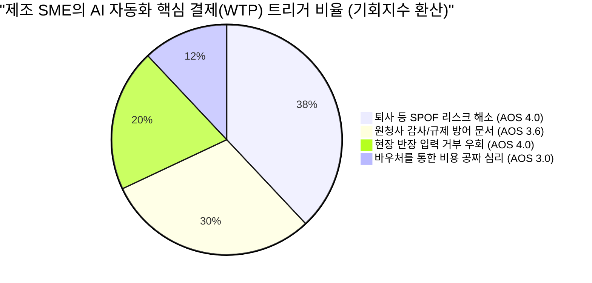
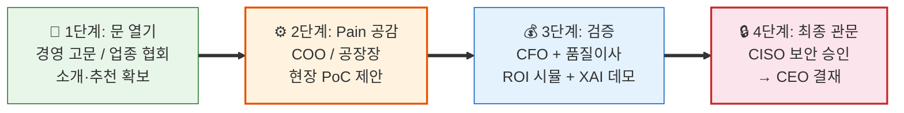
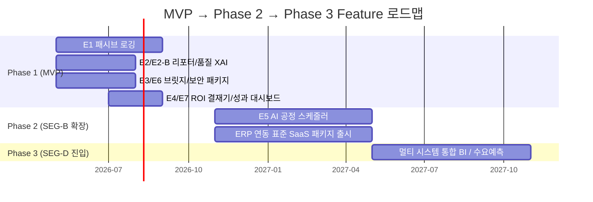

# Value Proposition Sheet 통합본 (VPS V1)
## 중소/중견 제조업 대상 AI 자동화 SI 및 SaaS 비즈니스

> **현 문서의 목적**: 본 문서는 '우리는 어떤 고객에게 어떤 차별적 가치를 전달하는가?'를 명확히 정의하는 Value Proposition Sheet와, 이를 실제 구현하기 위한 Job-MVP Feature Map이 하나로 통합된 가치 제안서입니다. 
> 고객의 근본적인 문제(Pain Point)와 우리가 제안하는 해결책(Value)을 명확히 하고, 이를 바탕으로 한 비즈니스 모델과 실제 기술 구현으로 이어지는 로드맵을 일관성 있게 제시합니다.
> **버전**: V1 (Gemini Version)
> **작성일**: 2026년 4월

---

## 1. Problem-Solution Fit: 고객별 가치 제안 (문제-해결-효과 매핑)

기존 기능 중심의 나열을 벗어나, 페르소나별 치명적 Pain이 어떻게 해결되고 어떤 정량적 효과를 내는지 명확히 매핑합니다. **5인의 핵심 이해관계자(DMU)가 모두 포함되어야 계약이 성사됩니다.**

| 타겟 페르소나 (Pain 주체) | 직면한 문제 (Problem) | 핵심 제안 (Solution Feature) | 기대 효과 (Desired Outcome) |
| :--- | :--- | :--- | :--- |
| **공장장 / COO** (현장운영) AOS 4.0 · DOS 3.6 | **[단일 장애점 & 입력 거부]** 핵심 스케줄러 퇴사 시 공장이 멈추는 SPOF 리스크. 막대한 비용을 들여 MES 키오스크를 도입해도 작업자가 입력을 전면 거부. | **[무입력 로깅 & ERP 브릿지]** 작업자 개입(터치/타이핑) 없이 음성/Vision만으로 현장 데이터를 패시브하게 수집하고, **더존·영림원 ERP 전용 API 커넥터**를 통해 자동 연동 | **[운영 연속성 확보]** - 현장 작업자 수기 입력 **0%** - 1인 스케줄러 의존 탈피 - 불만 폭주 및 파업 리스크 제거 |
| **구매본부장 / 품질이사** (규제/감사 대응) AOS 4.0 · DOS 2.8 | **[규제 방어막의 부재]** 원청사의 기습적 품질 감사나 탄소/Traceability 제출 요구 시, 데이터가 분절되어 있어 며칠 밤을 새워 취합해도 조작 의심을 받음. 2026년부터 EU CBAM, 글로벌 원청사 공급망 실사 의무화. | **[원클릭 감사 리포터]** 연동된 데이터를 기반으로 원청사나 글로벌 규제가 요구하는 양식의 **적법 이력 증빙 PDF를 버튼 1회 추론으로 자동 생성**. AI 판단 근거를 XAI(설명 가능한 AI) 리포트로 제공 | **[생존권 및 신뢰 보장]** - 감사 리포트 취합 시간 **90% 단축** - 품질 원천 데이터 조작 의혹 소멸 - 즉각 제출로 납품 탈락 리스크 방어 |
| **IT 담당자(CIO)** (보안 및 연동) AOS 3.2 · DOS 2.4 | **[데이터 사일로와 레거시 딜레마]** 기존 더존/영림원 ERP와 MES가 분절되어 있고 전면 교체(15억 이상)하기에는 공장 가동 중단 리스크가 큼. 경영진으로부터 "AI 언제 도입하냐"는 압박을 받지만 기반이 없어 막막. | **[비파괴형 레거시 동기화 브릿지]** 기존 ERP DB를 뜯지 단고 **더존·영림원 전용 Read-Only 커넥터**로 특정 데이터만 읽어오는 API 모듈 또는 엑셀 Batch 업/다운로더 환경. 시스템 교체 Zero. | **[기존 시스템 수명 연장]** - 기존 망 훼손 위험 **0%** - 파편화된 데이터 병합 수작업 제거 - IT 인프라 파괴 없이 안전한 AI 전환 |
| **CFO / CEO** (비용 및 결재) AOS 1.6(CFO) · 3.0(CEO) | **[정부 돈과 귀찮음 사이의 딜레마]** AI 도입의 성공이 불확실한 상태에서 내부 자금(수천~억 단위)을 지출할 수 없음. 그러나 정부 바우처를 받자니 신청/보고 서류 등 행정 부담이 막대함. 과거 SI 실패 경험으로 **'투자 실패 공포'**가 가장 강력한 선행 장벽으로 작동. | **[행정 턴키 대행 & 전용 ROI 진단 & 공포 해소 패키지]** 중기부/과기부의 AX/제조 바우처 사업 선정을 위한 사업계획서 대행부터 평가/사후 관리까지 100% 밀착 수행. **PoC 성과 미달 시 전액 환불 보증** + 동종 업종 Before-After 비교 카드 + AI 적합성 사전 진단 체크리스트 제공 | **[WTP 저항 제거]** - 도입 기업의 자부담 **최대 80%** 감축 - 사내 직원의 행정 투입 시간 **0시간** - 명확한 재무적 회수(Payback) 확인 - **"실패해도 잃을 것 없다"**는 심리적 안전망 |
| **CISO / 정보보안책임자** (보안 최종 관문) AOS 1.0 · 평가점수 4.8 | **[클라우드 절대 불가의 벽]** 생산 노하우·공정 데이터의 퍼블릭 클라우드 저장 시 보안 감사 즉시 탈락. AI 도입을 허용하고 싶어도 현존하는 SaaS 솔루션의 데이터 외부 반출 구조를 정책적으로 허용 불가. **계약 직전 단독 거부권** 보유. | **[프라이빗 온프레미스 AI]** 데이터가 사내를 **한 바이트도 벗어나지 않는** 폐쇄망 전용 AI 패키지. 오프라인 패키지 배포로 모델 업데이트. **보안 준수 확인서** + ISMS 준거 체크리스트 사전 제출 | **[보안과 혁신의 공존]** - 보안 감사 **100% 통과** - CISO의 "명분 있는 혁신 허용" 달성 - 클라우드 거부 논리 무력화 - 외부 트래픽 **Zero** 검증 |

> [!IMPORTANT]
> **DMU 공략 필수 경로**: CISO는 AOS가 낮아 "기회"로 보이지 않지만, 페르소나 평가 **4.8점 최고점**을 기록한 **"숨은 최종 보스"**입니다. 이 관문을 통과하지 못하면 COO·CFO·품질이사의 모든 합의가 한 번에 무효화됩니다. On-premise 옵션은 선택이 아니라 **필수**입니다.

---

## 2. Value Proposition Sheet 종합 캔버스

| 항목 | 내용 |
| :--- | :--- |
| **핵심 페르소나 및 시장** | **SEG-C (스마트공장 기초 수료 기업)**: 데이터 인프라의 껍데기만 존재하고 실무 활용이 전혀 이루어지지 않는 약 24,038개의 '정체된 중기업' — 이른바 **'2차 자동화 공백(Second Automation Gap)'** 상태에 놓인 기업군. 이 중 생산 자동화 관련 업종 실질 타겟은 약 **1,900~2,500개사**. |
| **초세분화 타겟 (Vertical-First)** | '제조업 전체'가 아닌, **금속가공 또는 식품제조** 1~2개 공정에 완전히 특화. 해당 공정의 업무 로직을 경쟁자보다 먼저, 더 깊이 자산화하여 **도메인 데이터의 해자(Moat)**를 구축. |
| **우리 솔루션의 핵심 제안** | **"단 한 번의 키보드 입력 없이, 당장의 납품 규제를 통과시켜주는 정부 지원 AI 솔루션"** 결코 '10% 생산 효율화'라는 모호한 가치를 팔지 않음. 무입력, 원청사 규제 통과, 정부 바우처라는 강력한 생존/비용 프레이밍 제공. |
| **기존 대안 (Competitor)** | - **1세대 MES (수동)**: 작업자가 입력하지 않아 데이터 신뢰도가 바닥임. - **국내 AI+RPA 전문사 (레인보우브레인·파워젠)**: 파워포인트 수준을 벗어난 고단가 솔루션. - **ERP 내장 AI (더존 ONE AI)**: 자사 ERP 외부와는 연동이 불가능함. - **글라우드 글로벌 AI (SAP 등)**: 보안 관문을 통과하지 못하고 수십억 예산이 듦. |
| **우리가 제공하는 차별적 가치** | 1. **UX의 극한 (Zero Touch)**: 인간의 노력을 0으로 만드는 데이터 수집 2. **영업의 극한 (턴키 행정)**: 단순히 AI 기술이 아닌 자금 조달까지 묶은 솔루션 3. **연동의 극한 (Light Bridge)**: 기존 생태계에 부착되는 연동성 확보 4. **보안의 극한 (Private AI)**: 온프레미스 전용 패키지로 보안 통과 |

---

## 3. 차별적 가치 검증 리포트 (Proof)

### A. 고객은 왜 구매하는가? (결제 트리거 분포)
인터뷰 결과, 중소 제조사 결정권자는 '생산성 향상'보다 **'단일 장애점(퇴사) 공포 방어'와 '규제(감사) 회피'**라는 손실 회피 목적에 의해 결제를 결정합니다.

### B. 외부 환경 요인 증거
- **생존 규제 강화**: 2026년부터 도입되는 글로벌 원청사 실사 의무화 및 EU CBAM 대응 실패 시 벤더 탈락 리스크.
- **풍부한 정부 지원 예산**: 중기부/과기부 주도 2026년 "제조 AX 사업" 4,230억 원 예산 편성.

---

## 4. 비즈니스 실행 및 구체화 (수익·영업)

### A. 수익 구조 및 비즈니스 모델 설계
1. **초기 구축비**: **약 5,000만 원 내외 (바우처 활용)**. 이 중 80~90%를 정부 바우처로 청구하여 도입 장벽 축소.
2. **SaaS 구독료 (MRR)**: **월 150~200만 원 (고객사 전액 자부담)**. 인프라, 모델 토큰, 규제 포맷 정기 업데이트 명목으로 지속 가능한 수익성 확보. 

### B. 영업 진입 시퀀스 (Sales Critical Path)
> '실패 시 담당자의 커리어 손실' 방어가 B2B 중견기업 영업의 핵심입니다.

### C. 예비 창업자 Actionable Tips
1. **기술보다 '공포 해소'와 '비용 조달'을 판매하라.**
2. **SEG-C (스마트공장 정체 기업군)**을 첫 해변두보(Beachhead) 마켓으로 삼아라.
3. 바우처 생태계를 활용한 행정 대행을 **'트로이 목마'**로 사용하라.
4. 특정 공정에 역량을 집중하는 **도메인 특화(Vertical-First)**로 해자를 파라.
5. PoC 환불 보증, 적합성 진단 등 **투자 실패 공포 해소 패키지**를 반드시 구비하라.

---
---

## 5. Job-MVP Feature Map (고객 과제 기반 제품 기능 매핑)

단순한 기능의 나열이 아닌, 기능이 존재해야 하는 '고객의 이유(Job)'에서 출발하는 매핑 테이블입니다. 개발팀은 이 표를 통해 '우리가 지금 만들고 있는 이 버튼이 어떤 비즈니스 가치를 방어하는가'를 이해할 수 있습니다.

| 타겟 페르소나 | 고객의 완수 과제 (Job) | MVP 대응 핵심 기능 (Epic/Feature) | 우선순위 | 릴리즈 |
| :--- | :--- | :--- | :---: | :---: |
| **공장장 / COO** | "작업자들의 반발 없이, 파업이나 퇴직에 영향을 받지 않는 데이터 로깅을 원한다" | **E1. 무입력 패시브 센싱 로깅**  - 현장 음성 로깅 및 Vision 자동 캡처 | **P1** | MVP |
| **구매본부장 / 실무진** | "원청사 감사팀 제출용 실사 데이터를 1초만에 조작 의심 없이 만들고 싶다" | **E2. 원클릭 감사 리포트 봇**  - 실시간 Merge 및 규제 템플릿(PDF) 출력 | **P1** | MVP |
| **품질이사(차품질)** | "AI가 불량이라고 판단했을 때, 그 추론 근거를 내 눈으로 확인하고 결정하고 싶다" | **E2-B. 품질 이상탐지 XAI 모듈**  - AI 판단근거 설명 및 "알림만, 결정은 인간이" UI 제공 | **P1** | MVP |
| **IT 담당자(CIO)** | "현행 ERP DB 파괴 위험 없이 데이터를 연동하고 싶다" | **E3. 레거시(ERP) API 브릿지**  - Read-Only 커넥터 및 엑셀 Batch 환경 | **P1** | MVP |
| **CISO** | "사내 데이터가 한 바이트도 외부로 유출되지 않았으면 좋겠다" | **E6. 온프레미스(폐쇄망) 보안 패키지**  - 폐쇄망 전용 런타임 및 감사 로그 | **P1** | MVP |
| **CFO / 기업대표** | "골치 아픈 절차나 내 자본의 소모 없이 솔루션을 써보고 싶다" | **E4. 영업용 진단 및 결재기**  - B2B 바우처 설계 웹뷰 및 ROI 시뮬레이터 | **P2** | MVP |
| **전체 DMU** | "도입 효과를 숫자로 확인하여 계속 사용할지 판단하고 싶다" | **E7. 성과 가시화 & 리텐션 대시보드**  - 월간 성과 리포트 출력 및 분기 ROI 리포트 | **P2** | MVP |
| **공장장 / 대표** | "휴먼 에러와 납품 중단 부작용을 막을 생산 일정표 자동화를 바란다" | **E5. 최적화 공정 AI 스케줄러**  - 배분 알고리즘 및 XAI 기반 자동 스케줄링 | **P3** | Phase 2 |

---

## 6. 핵심 제품 원칙: Human-in-the-Loop 프로토콜
제조 현장에서 AI 시스템 오류는 품질 사고와 즉시 연결되므로, 사용자의 수용성 한계를 돌파하기 위한 안전 프로토콜이 MVP 전반에 적용됩니다.

- **AI 제안, 인간 확정**: 어떠한 결과물도 담당자의 'Approve' 없이 외부로 발행되지 않음.
- **판단 근거 의무 표시(XAI)**: AI의 경고나 분류는 반드시 "왜" 그런 판단을 내렸는지 한국어로 설명됨.
- **단독 실행 금지 설계**: AI 스스로 공정을 변경하거나 중단하는 물리 권한을 갖지 않음.

---

## 7. MVP 개발 구체화 상세 계획 (Feature Specification)

위 매핑 보드의 우선순위에 따른 핵심 기능 구현 상세입니다. 초기 한정된 리소스는 Pain 해소에 가장 치명적인 상위 기능에 전념해야 합니다.

### 🥇 Priority 1 (P1): 제품 본연의 생존과 핵심 가치 창출 (Must Have)
> P1 기능이 하나라도 빠지면 4인 DMU 중 최소 1인의 거부로 계약 자체가 불가합니다.

*   **[E1] 무입력 패시브 로깅 엔진 (Zero-Touch Logging)**
    *   **F1.1 노이즈 캔슬레이션 STT 커맨더**: 80dB 이상의 현장 기계음 속 작업자 지시어 트리거 치환 모듈. (Whisper API 튜닝)
    *   **F1.2 Vision 상태 캡처기**: 카메라 기반 공정 완성품/계기판 상태 값 LLM 자동 파싱.
    *   **F1.3 로그 롤백/수정 관리자 웹**: 관리자용 일괄 수정(Approve/Reject) 인터페이스(Human-in-the-Loop 구현).
*   **[E2] 자동화된 추적성(Traceability) 컴플라이언스 봇**
    *   **F2.1 파편화 로트(Lot) 머지 로직**: 수집 데이터 및 기존 재고 데이터 시간순 병합 엔진.
    *   **F2.2 업종 특화 PDF 제너레이터**: CBAM 등 주요 규제/감사 포맷별 무결성 PDF 다운로드 기능.
    *   **F2.3 결측치 강제 알림 체커**: 필수 데이터 누락 사전 감지 시스템.
*   **[E2-B] 품질 이상탐지 XAI 모듈**
    *   **F2B.1 판단근거 시각화 대시보드**: 이상 징후 감지 시 하이라이트 기반 한국어 설명 제공.
    *   **F2B.2 알림/승인 UI**: AI 단독 제어 불가 설계 및 물리 조치 승인 기능.
*   **[E3] 비파괴형 레거시(ERP) 브릿지**
    *   **F3.1 Read-Only DB 커넥터**: 더존, 영림원 내 특정 테이블 전용 보안 플러그인.
    *   **F3.2 엑셀 Batch 업/다운로더**: API 개방 절대 불허 타겟용 대체 모듈.
*   **[E6] 온프레미스 보안 패키지**
    *   **F6.1 폐쇄망 전용 AI 런타임**: 외부 인터넷 단절 환경에서 구동되는 Docker 기반 설치 패키지.
    *   **F6.2 보안 준수 자동화 산출물**: RBAC 관리 기능 및 ISMS 심사용 사전 문서 생성기.

### 🥈 Priority 2 (P2): 영업 마찰력 제거 및 결재 가속기 (Should Have)

*   **[E4] CFO 전용 진단 및 도입 시뮬레이터**
    *   **F4.1 반응형 바우처/ROI 웹 계산기**: 기업 프로필 입력 기반 정부지원금/자부담금 산출기.
    *   **F4.2 도입 시뮬레이터**: 업종별 B/A 실증 카드, AI 도입 적합성 비율 사전 진단 도구.
*   **[E7] 성과 가시화 & 리텐션 대시보드**
    *   **F7.1 페르소나별 월간 성과 리포트 발행**: COO/CFO/품질/보안 등 이해관계자별 대시보드.
    *   **F7.2 분기 ROI 요약 & NPS 시스템**: 지속 구독의 정당성 부여용 경제적 효과 지표 및 지인 추천 모듈 연계.

### 🥉 Priority 3 (P3): 고도화 및 장기 비전 (Out of Reach for MVP - Phase 2)

*   **[E5] 완전 자동화 공정 스케줄러 & 스케줄링 XAI 모듈**
    *   *상세:* 작업 배분 알고리즘 및 계획 변경 사유 자연어 출력 기능.
    *   *배제 사유:* 비즈니스 임팩트 점수(AOS 10.0)는 최고이나, E1 패시브 로깅 기반의 3개월 이상 데이터 축적이 필수적으로 선행되어야 함. 기업별 변수로 초기 엔진 구축에 시간이 오래 걸리므로 Phase 2 진입 기능으로 설정.

---

## 8. 제품 확장 Phase 로드맵 (세그먼트 공략)

| Phase | 시기 | 전략 목표 | 핵심 배포 단위 |
|:---:|:---:|:---|:---|
| **Phase 1 (MVP)** | 0~6개월 | **SEG-C 초핵심 기업군 4~6곳 수주** | ERP 파괴 없는 연동성 증명 + CISO 보안 통과용 온프레미스 + 바우처 영업 기반 확립 |
| **Phase 2** | 6~12개월 | **데이터 누적 기반 기능 고도화** | 수집된 데이터에 기반한 스케줄러 발동 + 세그먼트 확장을 돕는 표준화된 SaaS 모델화 |
| **Phase 3** | 12~24개월 | **규모 확장 및 MRR 중심 성장** | 중견기업용 BI 및 수요 예측 도입을 통한 LTV 증대 |

---

## 9. [보강] 초기 사업 검증 및 파트너십 GTM 전략 (from BMC & Lean Canvas)

비즈니스 모델 캔버스와 린 캔버스 분석에서 도출된, MVP 초기 검증과 안정적인 시장 진입(GTM)을 위한 3대 핵심 궤도입니다. 해당 요소들은 제품 기능(Feature) 외적인 비즈니스 방어 및 확장(Lock-in) 전략으로 작용합니다.

### 9-1. MVP 주요 가치 가설 및 핵심 성과 지표 (Key Metrics)
제품 기능 개발보다 선행하거나 병행하여, 현장에서 실제 타겟들의 지갑과 마음을 여는지 확인해야 하는 3대 가설과 검증 지표입니다.
- **[영업/비용 가설]** CFO는 정부 바우처 사업(자부담 30%)과 우리가 제시하는 'ROI 시뮬레이터'를 보고 결재를 승인할 것인가?
  👉 **검증 지표(Metric):** 시뮬레이션 데모 후 바우처 연계 PoC 도입 동의서 확보 건수.
- **[활용 가설]** COO(공장장)는 '비침습적 수집'과 'AI 스케줄러'를 기존 MES의 대안으로 즉시 인정해 줄 것인가?
  👉 **검증 지표(Metric):** 일일 생산 스케줄링 소요 시간 단축률 (예: 3시간 ➔ 15분).
- **[규제/효과 가설]** 현장 작업자의 저항 없이 데이터가 쌓이며, 규제/감사용 페이퍼워크 실시간 산출이 작동하는가?
  👉 **검증 지표(Metric):** MES 내 데이터 누락(결측치) 감소율 및 감사 보고서 취합 소요 시간 단축.

### 9-2. 우회 진입을 위한 파트너십 채널 플랜 (Wedge Channel Strategy)
초기 스타트업이 중소규모 공장의 문을 제로베이스에서 두드리는 것은 CAC(고객획득비용)가 매우 높습니다. 따라서 이미 강력한 현장 네트워크를 보유한 기관과 플랫폼을 **숙주(Wedge)**로 삼습니다.
- **ERP 대리점 및 기존 솔루션 벤더(파트너십):** 이미 ERP를 납품하고 유지보수 중인 지역 대리점들과 공동 영업. "우리 솔루션을 얹어 팔면 정부 지원금을 받아 스마트공장 고도화 실적(매출)을 채울 수 있다"는 Win-Win 구조 형성.
- **정부사업 코디네이터 네트워크:** 스마트공장을 기획/평가하는 경영 지도사, 코디네이터 위원들을 대상으로 리드 제너레이션 및 솔루션 소개 세미나 진행.
- **CFO 대상 ROI 웨비나:** "바우처를 활용한 환수 없는 원가 절감 플랫폼 검토" 주최로 재무/경영진 타겟팅.

### 9-3. 핵심 경쟁 우위와 방어 해자 (Unfair Advantage)
후발 경쟁자나 기존 대형 SI 업체가 우리 고객사를 빼앗으려 할 때, 방어할 수 있는 자산화된 무기(Moat)입니다. 단순히 '기능이 좋다'를 넘어선 불공정 경쟁 우위를 확립합니다.
- **유산(Legacy) 시스템 표준 연동 라이브러리:** 영림원, 더존 등 국내 시장을 장악한 기존 ERP 시스템들의 DB 스키마 패턴을 추출해 둔 '표준 브릿지 API'. 타사가 수억 원의 수작업 SI 개발을 요할 때, 우리는 커넥터 부착만으로 비용과 구축 리드타임을 70% 이상 단축.
- **정부 바우처 행정 프로세스의 턴키화 역량:** 개발사가 기술만 파는 것이 아니라 '정부 사업 매칭 – 사업계획서 작성 지원 – 감리 및 지원금 정산 대응'까지 A-to-Z를 수행할 수 있는 '바우처 컨설턴트 팩' 내재화. 제품만 훌륭한 타사 대비 치명적인 도입 매력도로 작용.

---

## 부록. 분석 근거 레퍼런스

| 활용 | 근거 분석 보고서 원본 파일명 |
|--- |--- |
| **기회 분석 / MVP 우선순위 산출** | AOS-DOS기회분석(▶9), JTBD인터뷰(▶10), 페르소나 스펙트럼(▶7) |
| **솔루션 전략 / 경쟁 구도 / 로드맵** | 고객여정지도(▶8), 경쟁사브리핑(▶2), 가치사슬(▶3), KSF(▶4) |
| **성장 예측 시나리오 및 수익성 근거** | TAM-SAM-SOM(▶6), 포터5가지힘(▶1), 문제정의서(▶5) |

---

*본 문서는 Value Proposition Sheet(▶01-3 통합본)와 Job-MVP Feature Map(▶02-3 통합본)을 전략과 실행 관점으로 엮어낸 단일 통합본입니다.*
*버전: V1 Gemini Update / 작성일: 2026년 4월*
