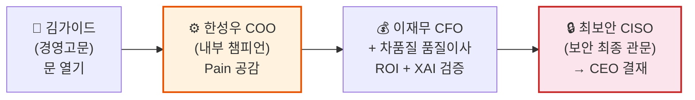
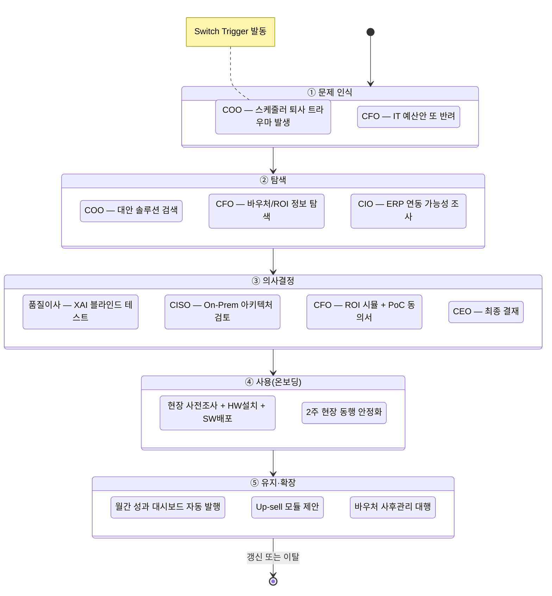
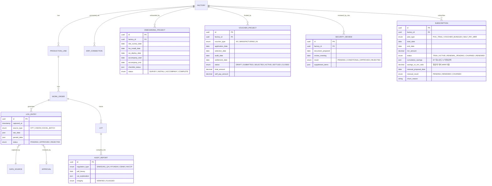
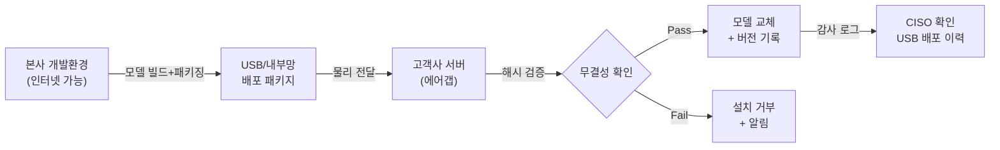
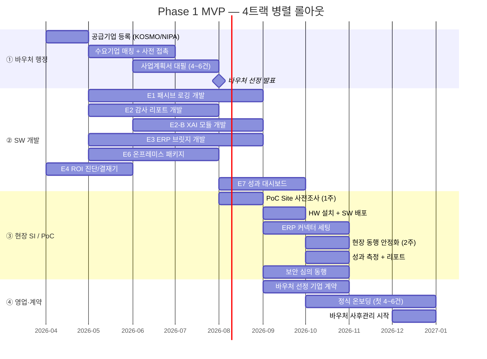

# 제조 AI 자동화 플랫폼 (FactoryAI) — PRD v4.0
- **Owner 팀**: 모두연 EGIGAE #5
- **최종 업데이트**: 2026-04-12
- **원천 문서**: VPS V3 Updated Final (`▶06_VPS_V3_Updated_1_20260411_final.md`), 비즈니스 분석(▶1~▶12)
- **상태**: V4 — V2(Gemini)+V3(Opus) 통합 최종본
- **변경 이력**: 
  - v0.1: SW 기능 중심의 최초 초안
  - v1.0: SW + Service 하이브리드 관점 전면 보강
  - v2.0: 가설 검증 틈새(WTP) 보완 및 논리 무결성 최종 확보 (Verification by Gemini)
  - v3.0: VPS 원문 1:1 교차 검증 → 누락 요소 10개 전량 보강 (Verification by Opus)
    - ✅ §1-1 "2차 자동화 공백" 구조적 인과관계 추가
    - ✅ §1-2 누락 KPI 3개 (설비 유휴시간, Payback, 의사결정 소요) 추가
    - ✅ §1-4 전환 트리거 3대 인사이트 신설
    - ✅ §3-C Human-in-the-Loop 4대 설계 원칙 독립 섹션 신설
    - ✅ §4 서두 4대 극한 가치 선언문 추가
    - ✅ §4-3 환불 보증·가격 정당화·레퍼런스 영업 비율 추가
    - ✅ §6-1 SUBSCRIPTION 엔터티 추가 (H9 WTP 연결)
    - ✅ §8-4 레퍼런스 소개 영업 벤치마크 추가
    - ✅ §8-5 리텐션 Lock-in 전략 신설
  - **v4.0**: V2(Gemini 검증본) + V3(Opus 검증본) 중복 제거 통합 최종본

---

## 1. 개요·목표

### 1-1. 문제 정의 (Pain 지표 포함)

국내 스마트공장 도입 기업의 **75.5%(≈24,038개사)**가 기초 단계에 정체되어 있다 (이하 '2차 자동화 공백').  

#### 「2차 자동화 공백(Second Automation Gap)」의 구조적 인과관계

정부 주도 스마트공장 보급 정책으로 **기초 인프라(MES·ERP)는 상당수 도입**되었으나, 현장 작업자가 키오스크·태블릿 입력을 전면 거부하면서 **대시보드가 빈 껍데기**가 되었다. 이로 인해 데이터가 축적되지 않아 AI 고도화 단계로 올라갈 수 없는 구조적 공백이 형성되었으며, 특정 인물 의존(SPOF), 수작업 감사 대응, ERP-MES 분절이라는 악순환이 반복된다.

> **인과 체인**: 정부 보급 → MES/ERP 기초 설치 → 현장 입력 거부(결측률 40%+) → 데이터 공백 → AI 고도화 불가(0.1%) → SPOF·감사 실패·사일로 반복

데이터 인프라(MES·ERP)는 설치되었으나 **현장 활용률 10% 미만**이며, 이로 인해 7가지 구조적 실패가 반복된다.

| # | Pain | 실패 KPI (현재 Baseline) | 유형 | 출처 |
|---|------|------------------------|:---:|------|
| P1 | **SPOF**: 스케줄러 1인 퇴사 시 공장 마비 | 납기 지연 4~6건/월, 리스케줄링 3h+/회 | SW+SVC | VPS §1-2 / JTBD Case 1 |
| P2 | **데이터 무용론**: MES 입력 거부 | MES 데이터 결측률 **40%+** | SW | VPS §1-1 / 문제정의서 ▶5 |
| P3 | **규제 방어막 부재**: 감사 리포트 수작업 | 감사 취합 **48h+**, 데이터 불일치율 15%+ | SW | VPS §1-2 / JTBD Case 2 |
| P4 | **레거시 사일로**: ERP-MES 분절 | 수동 데이터 결합 **월 40h+**, 정합성 오류 12%+ | SW+SVC | VPS §1-2 |
| P5 | **보안 정책 장벽**: 클라우드 전면 불가 | SaaS AI 제안 거절률 **100%** | SW+SVC | VPS §1-2 / JTBD 가설 F |
| P6 | **행정 부담**: 바우처 신청·관리 복잡 | 바우처 행정 투입 **80h+/건**, 환수 사례 연 50건+(업계) | SVC | VPS §1-2 / JTBD 가설 E |
| P7 | **투자 실패 공포**: ROI 불확실 | IT 예산안 반려율 **70%+**, 의사결정 소요 6~12개월 | SVC | VPS §1-2 |

### 1-2. 목표 (Desired Outcome 수치화)

| Target Outcome | Baseline (As-Is) | 목표 (To-Be) | 달성 시점 | 유형 |
|:---|:---|:---|:---|:---:|
| 현장 수기 입력 | 전량 수기 / 결측률 40%+ | **수기 0건/일**, 결측률 ≤5% | MVP+3개월 | SW |
| 스케줄 수립 소요 | 3시간+/회 | **15분 이내 (80%↓)** | MVP+1개월 | SW |
| 설비 유휴시간 | SPOF 발생 시 하루 3대+ 정지 | **50%↓** | MVP+3개월 | SW |
| 감사 리포트 취합 | 48시간+ | **30분 이내 (90%↓)** | MVP 즉시 | SW |
| ERP 연동 수작업 | 월 40시간+ | **0시간 (완전 자동)** | MVP+2주 | SW |
| 보안 심의 소요 | 3~6개월 | **4주 이내** | MVP 즉시 | SW+SVC |
| 도입 기업 자부담 | 5,000만 원+ | **500~1,000만 원 (80%↓)** | 바우처 연계 | SVC |
| 고객사 행정 투입 | 80시간+/건 | **0시간 (100% 턴키 대행)** | 계약 시점 | SVC |
| PoC 온보딩 완료 | N/A | **≤4주 (현장 설치~안정화)** | MVP | SVC |
| 바우처 선정률 | 업계 평균 미상 | **≥80%** | Year 1 | SVC |
| Payback Period | ROI 불확실 (결재 마비) | **≤18개월** (PoC 성과 미달 시 전액 환불) | MVP+6개월 | SW+SVC |
| AI 도입 의사결정 소요 | 6~12개월 | **≤3개월** | 바우처+ROI 시뮬 | SVC |

### 1-3. 성공 지표 (북극성/보조 KPI)

| KPI 유형 | 지표 | 기준선 | 목표 | 측정 주기 | 유형 |
|:---:|:---|:---:|:---:|:---:|:---:|
| **🌟 북극성** | **바우처 연계 PoC 도입 동의서 확보 건수** | 0건 | **6개월 내 4~6건** | 월간 | SW+SVC |
| 보조-1 | MES 데이터 결측치 감소율 | 40% | **≤5%** | 주간 | SW |
| 보조-2 | 감사 리포트 자동 생성 건수 | 0건/분기 | **≥4건/분기** | 분기 | SW |
| 보조-3 | ERP 연동 Man-Month | N/A | **2번째 고객 50%↓** | 프로젝트별 | SW+SVC |
| 보조-4 | CISO 보안 심의 승인률 | 0% | **첫 3건 전수 통과** | 건별 | SW+SVC |
| 보조-5 | MRR / 전체 매출 비중 | 0% | **Year 2 말 30%+** | 월간 | SW |
| 보조-6 | 고객 NPS | N/A | **≥50** | 분기 | SW+SVC |
| 보조-7 | **바우처 선정률** | N/A | **≥80%** | 반기 | SVC |
| 보조-8 | **PoC→정식계약 (자비 갱신) 전환율** | N/A | **≥60%** | 반기 | SVC |
| 보조-9 | **현장 온보딩 완료율 (4주 이내)** | N/A | **≥90%** | 프로젝트별 | SVC |
| 보조-10 | **턴키 행정 대행 완수율** | N/A | **100%** | 건별 | SVC |
| 보조-11 | **현장 장애 출동 빈도** | N/A | **≤1회/분기/고객** | 분기 | SVC |
| 보조-12 | **레퍼런스 소개 영업 비율** | N/A | **Year 2부터 ≥30%** | 반기 | SVC |

### 1-4. 전환 트리거 3대 인사이트 (JTBD ▶10 기반)

> **근거**: VPS §3-B (JTBD 인터뷰 14인, 6가설 통합 분석)

고객의 구매 결정은 "효율 10% 개선" 같은 점진적 가치로는 발생하지 않습니다. 아래 3가지 조건이 PRD 전 섹션의 설계 기저에 깔려 있어야 합니다.

| 인사이트 | 내용 | PRD 설계 반영 |
|:---|:---|:---|
| **① Switch Trigger** | 단순 효율 증대가 아닌 **'인재 이탈(퇴사)', '원청사 감사 지적', '상장 준비'** 등 특정 가시적 위기 상황에서만 전환 발생 | §3 US-01(퇴사 SPOF), US-02(감사 위기) Story의 Given 조건 |
| **② 최대 장벽 (Habit/Anxiety)** | "IT 시스템은 현장에서 안 쓴다(불신)" + "AI가 틀렸을 때의 책임은 누구인가(공포)"가 의사결정 지연의 핵심 원인 | §3-C HITL 4대 원칙, US-06 XAI, SVC-1 현장 2주 동행 |
| **③ 지불 의사 (WTP)** | 연간 인건비 1인분(≈5천만 원) 수준의 1회성 프로젝트 또는 바우처 자부담 소액 결제에 가장 개방적 | §4-4 가격 정당화, §1-2 Payback 18개월, PoC 환불 보증 |

---

## 2. 사용자와 페르소나

### 2-1. 핵심 DMU(의사결정단위) 5인

| 페르소나 | 역할 | AOS | 핵심 Job (JTBD) | 핵심 Pain KPI | SW Epic | SVC Epic |
|:---|:---|:---:|:---|:---|:---:|:---:|
| **한성우 (COO)** | 현장 운영 총괄 | 4.0 | "스케줄러 퇴사에도 납기를 사수하고 싶다" | 납기 지연 4~6건/월, 결측률 40%+ | E1, E5 | SVC-1 |
| **클레어 리 (구매본부장)** | 규제/감사 대응 | 4.0 | "버튼 하나로 감사 리포트를 즉시 내고 싶다" | 감사 취합 48h+, 불일치율 15%+ | E2 | — |
| **차품질 (품질이사)** | 품질 관리 | 3.0 | "AI 판단 근거를 확인하고 최종 결정은 내가" | AI 판단 신뢰도 부재 | E2-B | — |
| **정미경 (CIO)** | IT 인프라 | 3.2 | "기존 시스템 교체 없이 ERP-MES 연동" | 수동 결합 월 40h+, 교체 견적 15억+ | E3 | SVC-1 |
| **이재무 (CFO)** | 예산 승인 | 1.6 | "명확한 Payback 없이는 결재할 수 없다" | IT 예산 반려율 70%+, 행정 80h+/건 | E4 | SVC-2 |
| **최보안 (CISO)** | 보안 최종 관문 | 1.0 | "한 바이트도 외부 유출 없이 AI 허용" | SaaS 거절률 100%, 단독 거부권 | E6 | SVC-3 |

> **DMU 공략 필수 순서**: COO(챔피언) → CFO+품질(검증) → CISO(도장). CISO를 건너뛰면 전체 무효화.

### 2-2. 고객 여정(CJM) 기반 Pain·Needs 상세 연결

> **근거**: VPS V3 §1-2 (CJM 실패 지표), §1-2a (JTBD 선언문), §12 (CJM Touchpoint 설계), ▶8 고객여정지도 CJM 통합본

#### 여정 단계 개요

고객(SEG-C)의 AI 도입 여정은 5단계로 구성되며, 각 단계마다 **SW 기능**과 **오프라인 서비스**가 결합하여 작동합니다.

#### 페르소나별 5단계 여정 Pain·Needs 상세

##### 🔶 COO / 공장장 (한성우) — 내부 챔피언

| 여정 단계 | Pain (현재 실패 상태) | 실패 KPI | 감정 상태 | Needs (미충족 욕구) | SW Touchpoint | SVC Touchpoint |
|:---:|:---|:---|:---:|:---|:---|:---|
| **① 문제 인식** | 스케줄러 퇴사 → 공장 마비 | 납기 지연 **4~6건/월** | 😰 공포 | "퇴사에도 돌아가는 시스템" | — | 업종별 사례 1-Pager |
| **② 탐색** | 키오스크 도입 → 현장 전원 입력 거부 | 결측률 **40%+** | 😤 좌절 | "아무것도 안 해도 데이터가 쌓여야" | E1 데모 시연 | 현장 동행 데모 |
| **③ 의사결정** | PoC 실패 시 본인 커리어 리스크 | 결재 소요 **6개월+** | 😟 부담 | "실패해도 내 책임이 아닌 구조" | E4 ROI 시뮬 | 결재 지원 패키지 |
| **④ 사용** | 현장 반장 초기 불신 | 초기 2주 정확도 **70%** 미만 | 😬 긴장 | "현장 동행 지원으로 신뢰 구축" | E1 + F1.3 롤백 웹 | **SVC-1 현장 2주 동행** |
| **⑤ 유지** | "숫자로 보여줘야 계속 쓰겠다" | Phase 1 한계 | 🤔 기대 | "성과 대시보드 + AI 스케줄러" | E7 대시보드 | 분기 성과 리뷰 미팅 |

##### 🔷 구매본부장 + 품질이사

| 여정 단계 | Pain | 실패 KPI | Needs | SW Touchpoint | SVC Touchpoint |
|:---:|:---|:---|:---|:---|:---|
| **① 문제 인식** | 원청사 기습 감사 → 밤샘 취합 | 취합 **48h+** | "1클릭 무결성 리포트" | — | COO 경유 내부 전파 |
| **③ 의사결정** | "AI 틀리면 수조 원 클레임" | XAI 부재 | "판단 근거 시각화 + 인간 최종 결정" | E2-B XAI 데모 | **블라인드 테스트 현장 시연** |
| **④ 사용** | 첫 감사 대응 성공이 신뢰 분기점 | 리포트 재작업 **30%+** | "결측치 사전 감지" | E2 PDF + F2.3 알림 | 첫 감사 대응 동행 지원 |
| **⑤ 유지** | "다른 규제 포맷도 해줘" | 미지원 포맷 N개 | "템플릿 확장" | E7 품질 대시보드 | 규제 포맷 업데이트 컨설팅 |

##### 🔵 CIO (정미경) · 💰 CFO (이재무) · 🔒 CISO (최보안)

| 페르소나 | 핵심 여정 단계 | Pain | Needs | SW Touchpoint | SVC Touchpoint |
|:---|:---:|:---|:---|:---|:---|
| **CIO** | ②~④ | 수동 결합 월 40h+, 교체 견적 15억 | "Read-Only 연동, DB 손상 Zero" | E3 커넥터 | **SVC-1 현장 ERP 연동 세팅** |
| **CFO** | ②~⑤ | 예산 반려 70%+, 행정 80h+ | "턴키 행정 + Payback 18개월 증명" | E4 ROI 계산기 | **SVC-2 바우처 턴키 대행** |
| **CISO** | ③~④ | SaaS 거절 100%, 심의 3~6개월 | "사전 문서 제출 + 트래픽 Zero 증명" | E6 온프레미스 | **SVC-3 보안 심의 동행 PT** |

> [!IMPORTANT]
> **CISO는 ①~② 단계에서 직접 접촉하지 않습니다.** 그러나 **On-premise 아키텍처와 보안 문서는 ① 시점부터 준비 완료**되어 있어야 합니다.

#### Epic → 여정 단계 매핑 (SW + SVC 통합)

| Epic | 유형 | ① 인식 | ② 탐색 | ③ 의사결정 | ④ 사용 | ⑤ 유지 |
|:---|:---:|:---:|:---:|:---:|:---:|:---:|
| **E1** 패시브 로깅 | SW | | 데모 | | ★ | 축적 |
| **E2** 감사 리포터 | SW | | | 테스트 | ★ | 확장 |
| **E2-B** 품질 XAI | SW | | | ★ | 핵심 | 리포트 |
| **E3** ERP 브릿지 | SW | | 스펙 | 리뷰 | ★ | SaaS |
| **E4** ROI 진단 | SW | | ★ | ★ | | |
| **E6** 온프레미스 | SW | (준비) | | ★ | 모니터링 | 대시보드 |
| **E7** 성과 대시보드 | SW | | | | | ★ |
| **SVC-1** 현장 온보딩 | SVC | | 사전조사 | | ★ | 장애출동 |
| **SVC-2** 바우처 대행 | SVC | | ★ | ★ | | 사후관리 |
| **SVC-3** 보안 심의 동행 | SVC | (문서준비) | | ★ | | |
| **SVC-4** 사후관리 대행 | SVC | | | | | ★ |
| **SVC-5** 장애 출동 | SVC | | | | | ★ |

---

## 3. 사용자 스토리와 수용 기준 (AC)

### Part A. 소프트웨어 기능 스토리

#### US-01. COO — 무입력 패시브 로깅 (Epic E1)

**Story**: As a **COO/공장장**, I want **작업자가 아무것도 입력하지 않아도 현장 공정 데이터가 자동으로 수집·기록되길** so that **스케줄러 퇴사에도 생산 데이터가 유지되고, 현장 반발 없이 정확한 실적을 확보할 수 있다.**

| AC | Given | When | Then | 임계치 |
|:---|:---|:---|:---|:---|
| AC-1 | 80dB+ 소음 환경에서 작업자가 지시어를 음성 발화 | STT 모듈이 트리거 워드를 감지 | 공정 상태가 텍스트로 변환·로깅됨 | 인식 정확도 ≥ **90%**, 지연 ≤ **2초** |
| AC-2 | 모바일 카메라로 완성품/계기판을 촬영 | Vision 모듈이 이미지를 파싱 | 상태 값이 시스템에 기록됨 | 파싱 성공률 ≥ **85%**, 처리 ≤ **5초** |
| AC-3 | AI가 오인식한 데이터 존재 | 관리자 롤백/수정 웹 뷰어 접속 | Approve/Reject 후 감사 로그 기록 | 반영 ≤ **1초**, 인간 승인 없이 발행 **0건** |
| AC-4 | 1일 운영 후 | 결측률 리포트 조회 | 결측률 표시 | ≤ **5%** (Baseline 40%+ 대비) |

---

#### US-02. 구매본부장 — 원클릭 감사 리포트 (Epic E2)

**Story**: As a **구매본부장**, I want **버튼 하나로 원청사 규제 포맷의 무결성 감사 리포트가 즉시 생성되길** so that **밤샘 엑셀 취합 없이 감사를 통과하고 납품 계약을 방어할 수 있다.**

| AC | Given | When | Then | 임계치 |
|:---|:---|:---|:---|:---|
| AC-1 | 로깅+ERP 데이터 존재 | "감사 리포트 생성" 클릭 | Lot 시간순 병합 + 규제 포맷 PDF | 생성 ≤ **30초**, Lot 정확도 ≥ **99%** |
| AC-2 | 필수 데이터 누락 | 리포트 생성 시도 | 결측치 목록 + 보완 알림 | 감지 정확도 ≥ **95%**, 알림 ≤ **30초** |
| AC-3 | XAI 판단 근거 포함 PDF | 품질이사 확인 | 한국어 이상 판단 설명 표시 | 가독성 ≥ **4.0/5.0**, 누락 **0건** |

---

#### US-03. CIO — ERP 비파괴형 브릿지 (Epic E3)

**Story**: As a **CIO**, I want **더존·영림원 ERP를 전혀 건드리지 않고 AI 시스템에 연동하길** so that **15억 전면 교체 없이 AI 도입 성과를 낼 수 있다.**

| AC | Given | When | Then | 임계치 |
|:---|:---|:---|:---|:---|
| AC-1 | 더존/영림원 운영 중 | Read-Only 커넥터 설치 | 합의 테이블만 읽기, Write 차단 | DB 변경 **0건**, 동기화 ≤ **5분** |
| AC-2 | API 불가 극보안 환경 | 엑셀 덤프 드래그&드롭 | 자동 파싱·적재 | 파싱 ≥ **95%**, 처리 ≤ **30초/파일** |
| AC-3 | 1주 운영 후 | 정합성 리포트 조회 | 불일치율 표시 | ≤ **2%** (Baseline 12%+ 대비) |

---

#### US-04. CFO — ROI 진단·결재 지원 (Epic E4)

**Story**: As a **CFO**, I want **맞춤 ROI 시뮬레이션과 바우처 설계가 즉시 보이길** so that **Payback 18개월 이내를 확인하고 결재할 수 있다.**

| AC | Given | When | Then | 임계치 |
|:---|:---|:---|:---|:---|
| AC-1 | 기업 규모 입력 | ROI 웹 계산기 실행 | 바우처 매칭+자부담+회수액 표시 | 계산 ≤ **3초**, 정확도 ≥ **90%** |
| AC-2 | 적합성 5항목 완성 | 제출 | 성공률+리스크 대응 표시 | 진단 ≤ **5초** |
| AC-3 | 동종 업종 데이터 존재 | B/A 카드 요청 | Before-After 카드 생성 | 생성 ≤ **10초** |

---

#### US-05. CISO — 온프레미스 보안 패키지 (Epic E6)

**Story**: As a **CISO**, I want **데이터가 한 바이트도 외부로 나가지 않는 조건에서만 AI를 허용하길** so that **보안 KPI 100%를 유지하면서 현업 비난을 해소한다.**

| AC | Given | When | Then | 임계치 |
|:---|:---|:---|:---|:---|
| AC-1 | Docker AI 패키지 설치됨 | 전체 파이프라인 가동 | 외부 호출 0건, 트래픽 0 byte | 24h 네트워크 모니터링 전수 검증 |
| AC-2 | 모델 업데이트 필요 | USB/내부망 배포 | 오프라인 업그레이드 완료 | 성공률 **100%** |
| AC-3 | 보안 심의 요청 | ISMS 확인서+망분리 제출 | 심의 통과 | 승인률 **100%** |
| AC-4 | 데이터 접근 발생 | RBAC+감사 로그 | 전수 기록+이상 알림 | 누락 **0%**, 알림 ≤ **10초** |

---

#### US-06. 품질이사 — XAI 이상탐지 (Epic E2-B)

**Story**: As a **품질이사**, I want **AI 판단 근거를 한국어로 보고 최종 결정은 반드시 내가 내리길** so that **AI 오판 책임 리스크 없이 24시간 품질 감시를 구축한다.**

| AC | Given | When | Then | 임계치 |
|:---|:---|:---|:---|:---|
| AC-1 | 이상 징후 감지 | XAI 대시보드 알림 | 한국어 설명+데이터 하이라이팅 | 생성 ≤ **3초**, 이해도 ≥ **4.0/5.0** |
| AC-2 | 알림 수신 후 | 승인/거절 클릭 | AI 단독 실행 0건 보장 | 우회 차단 **100%** |
| AC-3 | 감사 시점 | 판단 이력 조회 | AI→인간→결과 전 과정 기록 | 누락 **0%**, 검색 ≤ **2초** |

---

#### US-07. 전체 DMU — 성과 가시화 (Epic E7)

**Story**: As a **DMU 전원**, I want **페르소나별 맞춤 월간 성과 대시보드가 자동 발행되길** so that **MRR 구독 갱신 결재 근거를 확보한다.**

| AC | Given | When | Then | 임계치 |
|:---|:---|:---|:---|:---|
| AC-1 | 월말 마감 | 자동 발행 트리거 | 4인 맞춤 대시보드 발행 | ≤ **24시간**, 렌더링 ≤ **5초** |
| AC-2 | 분기 말 | ROI 누적 리포트 생성 | 절감액·생성건수 자동 집계 | 수동 개입 **0건** |
| AC-3 | NPS 9~10 감지 | 레퍼런스 요청 발송 | 1클릭 NPS + 동의 수집 | 응답률 ≥ **30%** |

---

### Part B. 오프라인 서비스 스토리

#### US-S1. COO+CIO — 현장 온보딩 서비스 (SVC-1)

**Story**: As a **COO/CIO**, I want **전문 엔지니어가 현장에 방문하여 센서 설치·ERP 연동·작업자 교육까지 완료해주길** so that **우리 직원이 추가 IT 역량 없이도 시스템이 현장에 정착할 수 있다.**

| AC | Given | When | Then | 임계치 |
|:---|:---|:---|:---|:---|
| AC-1 | 계약 체결 후 | 현장 사전조사 방문 (1회) | 공장 레이아웃·전원·네트워크·소음 환경 보고서 | 사전조사 완료 **계약 후 1주 이내** |
| AC-2 | 사전조사 완료 후 | 센서(카메라·마이크) 설치 + ERP 커넥터 세팅 | HW+SW 통합 설치 완료 | 설치 완료 **2주 이내**, CIO 확인 서명 |
| AC-3 | 설치 완료 후 | **2주 현장 동행 안정화 지원** | 작업자 대상 실습+반장 롤백 웹 교육 완료 | 결측률 **≤15%** 달성 (2주 내), 작업자 교육 이수율 **≥80%** |
| AC-4 | 온보딩 전체 | 프로젝트 종료 | 온보딩 체크리스트 100% 완료 서명 | **계약 후 4주 이내** 완료 |

---

#### US-S2. CFO — 바우처 턴키 대행 서비스 (SVC-2)

**Story**: As a **CFO**, I want **바우처 사업계획서 작성부터 정부 포털 제출, 감리, 정산까지 100% 대행되길** so that **사내 직원 행정 투입 0시간으로 자부담 80% 절감과 환수 리스크 제로를 달성한다.**

| AC | Given | When | Then | 임계치 |
|:---|:---|:---|:---|:---|
| AC-1 | 기업 기본정보 제공 (2시간 이내) | 바우처 신청 | 사업계획서 100% 대필 + 정부 포털 제출 | 고객 투입 **≤2시간** (정보 제공만) |
| AC-2 | 바우처 심사 결과 발표 | 선정 통보 | 선정 알림 + 후속 일정 안내 | 선정률 **≥80%** |
| AC-3 | 바우처 사업 기간 중 | 감리 및 정산 시점 | 감리보고서 + 정산서 100% 대행 | 정부 제출 **마감 D-7** 사전 완료 |
| AC-4 | 사후관리 기간 | 정부 점검 | 환수 사유 0건 | 환수 발생률 **0%** |

---

#### US-S3. CISO — 보안 심의 동행 서비스 (SVC-3)

**Story**: As a **CISO**, I want **보안 전문가가 내부 심의에 직접 동행하여 아키텍처 PT를 수행하고, ISMS 확인서를 사전 제출해주길** so that **심의 소요를 6개월에서 4주로 단축하고, 거절 근거를 사전 제거한다.**

| AC | Given | When | Then | 임계치 |
|:---|:---|:---|:---|:---|
| AC-1 | 영업 1단계 시점 (CISO 접촉 전) | 사전 문서 준비 | 망분리 설계서+ISMS 확인서+데이터 흐름도 사전 작성 | 영업 **3단계 진입 전 100% 준비** |
| AC-2 | CISO 보안 심의 요청 | 전문 엔지니어 동행 PT | 아키텍처 설명 + 실시간 질의 응답 | 심의 **1회 방문**으로 조건부 승인 확보 |
| AC-3 | 심의 후 보완 요청 시 | 보완 문서 제출 | 수정 아키텍처 + 보완 확인서 | 보완 제출 **3영업일 이내** |

---

#### US-S4. CFO — 바우처 사후관리 대행 (SVC-4)

**Story**: As a **CFO**, I want **바우처 사후관리 보고서와 정산이 자동 대행되길** so that **정부 환수 리스크 없이 다음 연도 바우처도 원활히 신청할 수 있다.**

| AC | Given | When | Then | 임계치 |
|:---|:---|:---|:---|:---|
| AC-1 | 바우처 사업 종료 후 | 성과 보고 시점 | 성과 보고서 자동 생성 + 정부 포맷 변환 | 고객 투입 **0시간** |
| AC-2 | 정부 사후점검 | 현장 감리 | 감리 대응 100% 대행 | 감리 지적사항 **0건** |
| AC-3 | 환수 사유 발생 리스크 | 사전 리스크 점검 | 분기별 자가진단 + 보완 조치 | 환수율 **0%** |

---

#### US-S5. 전체 — 현장 장애 출동 서비스 (SVC-5)

**Story**: As a **COO/CIO**, I want **시스템 장애 시 전문 엔지니어가 현장에 직접 출동하여 해결해주길** so that **온프레미스 환경에서도 원격 지원 불가 상황을 신속하게 대응할 수 있다.**

| AC | Given | When | Then | 임계치 |
|:---|:---|:---|:---|:---|
| AC-1 | 시스템 장애 접수 | 1차 원격 진단 | 원격 해결 가능 여부 판단 | 원격 진단 **1시간 이내** |
| AC-2 | 원격 해결 불가 판정 | 현장 출동 | 엔지니어 현장 도착 | 수도권 **≤4시간**, 비수도권 **≤8시간** |
| AC-3 | 장애 해결 후 | 장애 보고서 제출 | 원인 분석+재발 방지 대책 문서 | 보고서 **24시간 이내** 제출 |

---

### Part C. 공통 설계 원칙 — Human-in-the-Loop (HITL) 안전 프로토콜

> **근거**: VPS §5 / ▶10 JTBD 인터뷰 Anxiety 패턴 / ▶7 페르소나 §11 차품질 프로파일
>
> JTBD 인터뷰(▶10)와 페르소나 분석(▶7)에서 반복 확인된 핵심 불안(Anxiety)은 **"AI가 틀렸을 때 책임은 누가 지나?"**입니다. 제조 현장에서 AI의 비결정론적 특성은 품질사고·생산중단으로 직결되므로, **MVP 전체 Feature에 다음 4대 원칙이 예외 없이 적용**됩니다.

| 원칙 | 적용 방식 | 적용 Feature | 인터뷰 근거 |
|:---|:---|:---|:---|
| **① AI 제안, 인간 확정** | AI가 생성한 모든 결과물은 담당자의 명시적 Approve 없이 외부로 발행되지 않음 | E1~E7 전체 | "AI가 틀렸을 때 수조 원대 클레임 누가 책임지나?" — 품질이사 |
| **② 판단 근거 의무 표시** | AI가 판단·분류·경고를 수행할 때 반드시 "왜?"를 한국어로 설명 | E2 (XAI), E2-B, E5 | 차품질: "확률적 답변에 극도로 거부감, 100% 확실하지 않으면 안 씀" |
| **③ 단독 실행 금지** | AI가 생산중단, 공정변경 등 물리적 영향이 있는 행위를 **시스템 레벨에서 차단** | E5 (스케줄러) | "AI는 절대 단독으로 생산중단 결정 안 함" — F2B.2 시스템 보장 |
| **④ 롤백/수정 보장** | AI 오인식 데이터를 관리자가 한 화면에서 일괄수정(Approve/Reject) 가능 | E1 (F1.3) | "알림만, 결정은 이사님" UI 원칙 |

> [!CAUTION]
> **이 4대 원칙은 선택이 아닌 필수입니다.** 하나라도 위반되면 품질이사의 조직적 저항과 CISO의 보안 거부가 동시에 발동하여 계약이 무효화됩니다.

---

## 4. 기능 요구사항 (Functional) — MoSCoW

### 4-0. 핵심 가치 선언 — 「4대 극한(Four Extremes)」

> **근거**: VPS §2-1 핵심 포지셔닝

우리 제품의 모든 기능은 아래 4대 극한 가치에서 출발합니다. 이 4가지가 동시에 달성될 때 비로소 **엑셀/수작업이라는 0원 대체재**를 이기고, **DMU 4인 전원의 승인**을 확보할 수 있습니다.

| 극한 | 핵심 메시지 | 대응 Epic |
|:---|:---|:---:|
| **🟢 UX의 극한 (Zero Touch)** | 인간의 노력을 0으로 만드는 데이터 수집 — 타이핑·터치 일체 불필요 | E1 |
| **🟠 영업의 극한 (턴키 행정)** | 단순 AI 소프트웨어가 아닌, 자금 조달 컨설팅(바우처)을 묶어 파는 '종합 가치' | E4, SVC-2 |
| **🔵 연동의 극한 (Light Bridge)** | 시스템 교체 Zero — 더존·영림원 ERP 전용 커넥터로 즉시 연결 | E3 |
| **🔴 보안의 극한 (Private AI)** | 데이터 한 바이트도 안 나가는 온프레미스 전용 패키지 — CISO 관문 무력화 | E6, SVC-3 |

### 4-1. SW Epic MoSCoW

| Priority | Epic | 기능 | MoSCoW | 대안 대비 차별 가치 | AOS |
|:---:|:---|:---|:---:|:---|:---:|
| **P1** | **E1** | 무입력 패시브 로깅 (STT+Vision) | **Must** | 비접촉 패시브 수집 시장 전무 | 8.0 |
| **P1** | **E2** | 원클릭 감사 리포트 (Lot Merge+PDF) | **Must** | 규제 포맷 자동 매핑 시장 전무 | 7.6 |
| **P1** | **E2-B** | 품질 XAI 이상탐지 | **Must** | 판단 근거 시각화 시장 공백 | 7.0 |
| **P1** | **E3** | ERP 비파괴형 브릿지 | **Must** | 더존+영림원+엑셀 통합 브릿지 신규 | 7.2 |
| **P1** | **E6** | 온프레미스 보안 패키지 | **Must** | On-premise AI 패키지 시장 전무 | 4.2 |
| **P2** | **E4** | CFO용 ROI 진단·결재기 | **Should** | 기업 맞춤 재무 계산기 없음 | 4.6 |
| **P2** | **E7** | 성과 가시화·리텐션 대시보드 | **Should** | 자동 성과 증명 차별화 | — |
| **P3** | **E5** | AI 공정 스케줄러 + XAI | **Won't** (MVP) | Phase 2. 데이터 3개월 축적 선행 | 10.0 |

### 4-2. SVC(Service) Epic MoSCoW

| Priority | Epic | 서비스 | MoSCoW | 대안 대비 차별 가치 |
|:---:|:---|:---|:---:|:---|
| **P1** | **SVC-1** | 현장 온보딩 (사전조사+HW설치+동행 2주) | **Must** | 타사는 구축 후 철수, 우리는 2주 동행 |
| **P1** | **SVC-2** | 바우처 턴키 대행 (신청→감리→정산) | **Must** | "행정까지 해주는 턴키"는 시장에 전무 |
| **P1** | **SVC-3** | 보안 심의 동행 PT + 사전 문서 패키지 | **Must** | CISO 관문 통과를 위한 필수 서비스 |
| **P2** | **SVC-4** | 바우처 사후관리 대행 | **Should** | 환수 리스크 제거 → 다음 연도 재신청 교두보 |
| **P2** | **SVC-5** | 현장 장애 출동 (수도권 4h / 비수도권 8h) | **Should** | 온프레미스 환경의 원격 불가 상황 대응 |

> **Must SW 5개 + Must SVC 3개 = 총 Must 8개**가 모두 탑재되어야 DMU 4인 전원 통과.

### 4-3. 차별 가치 수치 비교 (SW + SVC 통합)

| 비교 축 | 기존 대안 | 국내 AI+RPA 전문사 | 우리 (FactoryAI) | 배율 | 유형 |
|:---|:---|:---|:---|:---:|:---:|
| 감사 리포트 생성 | 48h+ (수작업) | ~4h (반자동) | **30초 (1클릭)** | 96× | SW |
| ERP 연동 비용 | 15억+ (전면교체) | 수천만~1억 | **0원 (Read-Only)** | ∞ | SW |
| 보안 대응 (On-Prem) | 미지원 | 미지원 | **100% 폐쇄망** | 유일 | SW |
| 현장 데이터 수집 | 키오스크 (거부율 높음) | 태블릿 입력 | **Zero-Touch** | ∞ | SW |
| 도입 행정 부담 | 자체 80h+/건 | 부분 지원 | **0시간 (턴키)** | ∞ | SVC |
| 구축 리드타임 | N/A | 2~6개월 | **4주 (브릿지+동행)** | 3~6× | SW+SVC |
| 현장 안정화 지원 | 없음 (구축 후 철수) | 전화 지원 | **2주 현장 동행** | 유일 | SVC |
| 보안 심의 소요 | 6개월+ | 지원 없음 | **4주 (사전문서+동행)** | 6× | SVC |
| **PoC 실패 리스크** | 자비 매몰 | 부분 보증 | **성과 미달 시 전액 환불** | 유일 | SVC |

### 4-4. 가격 정당화 (Pricing vs. Value)

> **근거**: VPS §10-D 가격 수용성의 핵심 단초

월 구독료 **150~200만 원**이 합리적인 이유:

| Pain 기반 회수 논리 | 연간 절감/방어액 | 월 MRR 대비 |
|:---|:---:|:---:|
| **SPOF 방어**: 숙련자 1인 대체 채용/기회비용 | 연 **5,000만 원+** | 월 150만 원 = 보험금 수준 |
| **벤더 탈락 방어**: 원청사 실사 데이터 미제출 시 매출 증발 | 연 **수억 원 대** | 가격 저항 소멸 |
| **감사 야근 제거**: 48h→30분으로 인력 재배치 | 연 **1,200만 원+** | 추가 절감 |

> **PoC 안전망**: **성과 미달 시 전액 환불 보증** — CFO의 "투자 실패 공포(P7)"를 구조적으로 제거하는 Fear-Killer. VPS §11에서 핵심 실행 제언으로 정의.

---

## 5. 비기능 요구사항 (NFR)

### 5-1. SW 성능 (온프레미스 기준)

| 항목 | 요구사항 | 최소 HW 사양 | 권장 HW 사양 |
|:---|:---|:---|:---|
| STT 응답 | p95 ≤ **2,000ms** | CPU Only (16GB RAM) | GPU (T4+, 32GB RAM) |
| Vision 파싱 | p95 ≤ **5,000ms** | CPU Only — 처리 8초까지 허용 | GPU — 3초 이내 |
| PDF 리포트 | p95 ≤ **30,000ms** (100 Lot) | CPU 충분 | 동일 |
| 대시보드 렌더링 | p95 ≤ **3,000ms** | CPU 충분 | 동일 |
| ERP 동기화 지연 | ≤ **5분** (Batch 주기) | 네트워크 무관 (내부망) | 동일 |
| XAI 설명 생성 | p95 ≤ **3,000ms** | GPU 필요 | GPU (T4+) |

### 5-2. 신뢰성

| 항목 | 요구사항 |
|:---|:---|
| 시스템 가용성 | **≥ 99.5%** (월간, 계획 유지보수 제외) |
| AI 오류율 | STT 오인식 ≤ **10%**, Vision 실패 ≤ **15%** |
| 데이터 무결성 | 감사 리포트 불일치율 ≤ **1%** |
| 장애 복구 (RTO) | 원격: ≤ **4시간** / 현장 출동: 수도권 ≤ **4시간**, 비수도권 ≤ **8시간** |
| 데이터 백업 (RPO) | ≤ **1시간** (온프레미스 로컬 백업) |

### 5-3. 보안 (Non-Negotiable)

| 항목 | 요구사항 |
|:---|:---|
| 네트워크 | 외부 반출 트래픽 **0 byte** — 물리적 차단 |
| AI 런타임 | 100% 온프레미스 — 외부 API 호출 **0건** |
| 모델 업데이트 | USB/내부망 전용 오프라인 배포 |
| 인증 | RBAC 기본 내장 |
| 감사 로그 | 전 접근 전수 기록, 이상 알림 ≤ 10초 |
| 준거 | ISMS/ISMS-P 확인서 자동 생성, 망분리 설계서 |

### 5-4. 서비스 SLA (Service Level Agreement)

| SLA 항목 | 요구사항 | 측정 방법 |
|:---|:---|:---|
| **현장 온보딩 완료** | 계약 후 **≤4주** (사전조사~안정화) | 온보딩 체크리스트 서명일 |
| **바우처 서류 제출** | 정부 마감 **D-7** 사전 완료 | 정부 포털 제출 타임스탬프 |
| **보안 심의 문서 준비** | 영업 **3단계 진입 전** 100% 완료 | 문서 패키지 CISO 전달일 |
| **현장 장애 출동** | 수도권 **≤4시간**, 비수도권 **≤8시간** | 접수~현장 도착 시간 |
| **장애 보고서** | 해결 후 **24시간 이내** 제출 | 보고서 발행 타임스탬프 |
| **바우처 사후관리** | 감리보고서·정산서 **마감 D-7** 대행 완료 | 정부 제출 타임스탬프 |
| **분기 성과 리뷰** | 분기별 **1회 현장/화상 리뷰 미팅** | 미팅 의사록 |
| **PoC 환불 보증** | 사전 합의 KPI 미달 시 **전액 환불** | PoC 성과 보고서 대비 달성률 |

### 5-5. 모니터링

| 항목 | 기준 | 유형 |
|:---|:---|:---:|
| 시스템 로그 | 모든 AI 추론, Approve/Reject, 오류 이벤트 | SW |
| SW 대시보드 | 일일 결측률, STT 정확도, 이상 접근 알림 | SW |
| 알림 | 결측률 >10% → COO, 보안 이벤트 → CISO, 이상 감지 → 품질이사 | SW |
| **센서 HW 상태** | 카메라/마이크 동작 상태, 연결 끊김 알림 | SW+SVC |
| **USB 배포 이력** | 모델 버전, 배포일, 설치 확인 서명 | SVC |
| **온보딩 진행률** | 체크리스트 단계별 완료율 (현장별) | SVC |
| **바우처 행정 마일스톤** | 신청→심사→선정→감리→정산 단계별 진행 | SVC |

---

## 6. 데이터·인터페이스 개요

### 6-1. 핵심 엔터티 (SW + SVC + 구독 통합)

> **SUBSCRIPTION 엔터티 설계 의도**: H9(WTP 자비 갱신) 가설 검증을 위해 `cumulative_savings`, `savings_vs_mrr_ratio`, `renewal_result` 필드를 포함. E7 대시보드의 누적 절감액과 연동되어 "절감액 > MRR일 때 자비 갱신 전환율 ≥60%"을 데이터로 추적합니다.

### 6-2. 인터페이스 개요 (SW + 물리 + 행정)

| 인터페이스 | 유형 | 입력 | 출력 | 제약 |
|:---|:---:|:---|:---|:---|
| **더존 iCUBE/Smart A 커넥터** | SW (Read-Only) | 테이블명+조회기간 | 재고/발주/실적 JSON | Write 차단, CISO 승인 테이블만 |
| **영림원 K-System 커넥터** | SW (Read-Only) | 동상 | 동상 | 동상 |
| **엑셀 Batch 파서** | SW | .xlsx/.csv 드래그&드롭 | 파싱된 구조 데이터 | 50MB/파일, 500행/시트 |
| **STT 엔진** | SW (On-Prem) | PCM 16kHz 오디오 | 트리거 워드+텍스트 | Whisper 파인튜닝, 폐쇄망 전용 |
| **Vision 파서** | SW (On-Prem) | JPEG/PNG ≤10MB | 상태값 JSON | 폐쇄망 전용 |
| **PDF 리포트 엔진** | SW | Lot 데이터+템플릿 ID | 워터마크 PDF | 삼성QA/현대차/CBAM/HACCP |
| **XAI 설명 생성기** | SW (On-Prem) | 이상 감지 결과 | 한국어 설명 | 온프레미스 LLM |
| **현장 카메라** | 물리 HW | 공정 라인 영상 | Vision 파서 입력 | IP 카메라 또는 모바일, 방진·방수 |
| **현장 마이크** | 물리 HW | 공장 소음 + 음성 | STT 엔진 입력 | 지향성 마이크, 80dB+ 환경 |
| **USB 업데이트 패키지** | 물리 매체 | 모델 파일+설치 스크립트 | 업데이트된 AI 런타임 | 에어갭 환경, 버전 무결성 해시 검증 |
| **바우처 정부 포털** | 행정 시스템 | 사업계획서 PDF + 기업정보 | 접수번호, 선정 결과 | 정부 포털 직접 제출 (API 없음) |
| **감리 보고서** | 문서 산출물 | PoC 성과 데이터 | 감리 포맷 보고서 | 정부 양식 준수 |

### 6-3. 오프라인 데이터 흐름 (USB 모델 업데이트)

---

## 7. 범위(In/Out), 리스크·가정·의존성

### 7-1. 범위 정의 (SW + SVC)

| In (MVP Scope) | Out (Phase 2+) |
|:---|:---|
| ✅ **SW**: E1 패시브 로깅, E2 감사 리포트, E2-B XAI, E3 ERP 브릿지, E4 ROI 진단, E6 온프레미스, E7 대시보드 | ❌ E5 AI 공정 스케줄러 (데이터 3개월 필요) |
| ✅ **SVC-1**: 현장 온보딩 (사전조사+HW설치+2주 동행) | ❌ 고객사 자체 HW 조달 (우리가 사양 가이드만 제공) |
| ✅ **SVC-2**: 바우처 턴키 대행 (신청→감리→정산) | ❌ 고객사 기존 공정 변경 (우리는 AI 부착만) |
| ✅ **SVC-3**: 보안 심의 동행 PT + 사전 문서 | ❌ 퍼블릭 클라우드 배포 옵션 |
| ✅ **SVC-4**: 바우처 사후관리 대행 | ❌ 다국어(한국어 외) 지원 |
| ✅ **SVC-5**: 현장 장애 출동 (수도권/비수도권) | ❌ 기타 업종 확장 (금속가공·식품 외) |
| ✅ 금속가공·식품제조 2개 버티컬 | ❌ 영림원·더존 이외의 ERP 연동 |
| ✅ **PoC 성과 미달 시 전액 환불 보증** | ❌ 무조건적 환불 (사전 합의 KPI 기준) |

### 7-2. 리스크 레지스터 (SW + SVC + 행정)

| # | 리스크 | 유형 | 영향도 | 확률 | 대응 |
|:---:|:---|:---:|:---:|:---:|:---|
| R1 | **정부 바우처 예산 삭감** → 구축비 모델 붕괴 | 행정 | 🔴 | 중 | Year 2에 MRR 30%+ 자립. 바우처는 '채널'로만 |
| R2 | **CISO 보안 심의 지연** → 전체 블로킹 | SW+SVC | 🔴 | 높 | SVC-3 사전 문서+동행 PT로 심의 4주 단축 |
| R3 | **현장 소음(80dB+) STT 정확도 미달** | SW | 🟡 | 중 | 트리거 워드 한정 + Vision 백업 |
| R4 | **ERP 스키마 변형** → 커넥터 호환 실패 | SW | 🟡 | 높 | 스키마 변형 패턴 라이브러리 축적 |
| R5 | **MRR 미정착** → Year 2 자립 실패 | SW | 🟡 | 중 | E7 성과 대시보드 리텐션 정당화 + H9 WTP 검증 |
| R6 | **GPU 비용 상승** → 온프레미스 경제성 훼손 | SW | 🟢 | 낮 | 경량 모델 우선 + ONNX 최적화 |
| R7 | **고객사 현장 환경 예상 불일치** → 설치 지연 | SVC | 🟡 | 높 | SVC-1 사전조사(1주) 필수, 환경 보고서 작성 |
| R8 | **PoC 중 고객사 담당자 교체** → 프로젝트 지연 | SVC | 🟡 | 중 | 복수 담당자 교육, 인수인계 체크리스트 |
| R9 | **현장 작업자 조직적 거부** (노조 이슈) | SVC | 🔴 | 중 | 2주 동행 시 작업자 참여 설명회, Zero-Touch UX로 부담 최소화 |
| R10 | **바우처 선정 실패** → 계약 무산 | 행정 | 🟡 | 중 | 사업계획서 품질 고도화 + 선정률 ≥80% 목표 |
| R11 | **사후관리 감리 미통과** → 환수 | 행정 | 🟡 | 낮 | SVC-4 대행으로 마감 D-7 사전 제출 |

### 7-3. 가정·의존성

| 유형 | 내용 | SW/SVC |
|:---|:---|:---:|
| **가정** | 고객사에 서버(16GB RAM+, GPU 옵션) 또는 조달 가능 | SW |
| **가정** | 더존/영림원 ERP DB Read-Only 권한을 CIO 사전 승인 | SW |
| **가정** | 2026년 중기부/과기부 제조 AX 바우처 예산 4,230억 원 집행 | SVC |
| **가정** | 고객사 현장 접근(보안 출입) 허용 — 사전조사·설치·동행 가능 | SVC |
| **가정** | 센서 설치를 위한 전원·공간·네트워크(내부망) 확보 가능 | SVC |
| **가정** | 작업자 교육 시간(2시간) 확보 가능 — 생산 라인 일시 조정 | SVC |
| **의존성** | Whisper (OpenAI): 온프레미스 파인튜닝 오픈소스 STT | SW |
| **의존성** | Docker: 폐쇄망 배포용 컨테이너 런타임 | SW |
| **의존성** | 더존비즈온·영림원: ERP 스키마 문서화 협력 (또는 리버스 엔지니어링) | SW |
| **의존성** | 정부 바우처 포털: 사업계획서 제출·결과 조회 (수작업) | SVC |
| **의존성** | 산업용 IoT HW 공급사: 방진·방수 카메라, 지향성 마이크 | SVC |

---

## 8. 실험·롤아웃·측정

### 8-1. Phase 1 (MVP) 4-트랙 롤아웃 계획

### 8-2. PoC 6단계 현장 프로젝트 방법론

| 단계 | 활동 | 기간 | 산출물 | 성공 기준 |
|:---:|:---|:---:|:---|:---|
| **1. 사전조사** | 공장 레이아웃·전원·소음·네트워크 현장 답사 | 2~3일 | 환경 보고서 | 센서 설치 위치 3군데+ 확정 |
| **2. HW 설치** | 카메라·마이크 설치, 서버 세팅 | 1~2일 | 설치 완료 서명 | 전체 장비 정상 가동 확인 |
| **3. SW 배포** | Docker 패키지 설치, AI 모델 로딩 | 1일 | 배포 완료 로그 | STT/Vision 기본 테스트 통과 |
| **4. ERP 연동** | 더존/영림원 커넥터 세팅 또는 엑셀 Batch 구성 | 1~2주 | 연동 완료+정합성 리포트 | 정합성 오류율 ≤8% (안정화 전) |
| **5. 동행 안정화** | 현장 엔지니어 2주 상주, 작업자 교육, 반장 롤백 웹 교육 | 2주 | 일일 결측률 리포트 | 결측률 ≤15% (2주 내) |
| **6. 성과 측정** | Before-After 데이터 비교, COO 만족도 설문 | 1주 | PoC 성과 보고서 | 결측률 ≤10%, 만족도 ≥4.0/5.0 |

### 8-3. 실험 가설·측정·성공 기준

| 가설 | 실험 설계 | 측정 도구 | 성공 기준 | 유형 |
|:---|:---|:---|:---|:---:|
| **H1.** COO는 Zero-Touch 로깅을 수용 | PoC 2건 (금속1, 식품1), 8주 | 결측률 B/A, 만족도 5점 | 결측률 40%→≤10%, 만족도 ≥4.0 | SW |
| **H2.** 감사 리포트 1클릭이 실무에 사용 | PoC 기업 내 실제 감사 1회+ 대응 | PDF 건수, 통과 여부, 소요시간 | 48h→≤1h, 지적 0건 | SW |
| **H3.** CFO는 ROI 시뮬 보고 PoC 동의 | UI 목업 시연 5건+ | 동의서 확보 건수 | 6개월 내 4~6건 | SW+SVC |
| **H4.** CISO 보안 심의 전수 통과 | 사전 문서+동행 PT | 심의 승인률 | 100% (3/3건) | SW+SVC |
| **H5.** ERP 연동 Man-Month 절반 | 1호 vs 2호 비교 | Man-Month | 2번째 50%↓ | SW |
| **H6.** 현장 온보딩 4주 내 완료 | PoC 프로젝트 6단계 | 체크리스트 완료일 | ≥90% 4주 내 완료 | SVC |
| **H7.** 바우처 선정률 80% 이상 | 사업계획서 대필 4~6건 | 선정/탈락 건수 | ≥80% | SVC |
| **H8.** 작업자 조직적 거부 없이 안착 | 동행 2주 + 설명회 | 작업자 교육 이수율, 불만 접수 | 이수율 ≥80%, 공식 불만 0건 | SVC |
| **H9.** 가치 입증 및 WTP (순수 자비 구독) | 대시보드 누적 절감액 기반 자비 연장 제안 | SUBSCRIPTION 엔터티 갱신율 | 전환율 **≥60%** (절감액>MRR 시 이탈 0%) | SVC |

### 8-4. 경쟁 대안 대비 벤치마크

| 벤치마크 항목 | 비교 대상 | 측정 방법 | 성공 기준 | 유형 |
|:---|:---|:---|:---|:---:|
| 감사 리포트 속도 | 고객사 기존 수작업 | 동일 Lot 데이터 Before-After | 96× 빠름 | SW |
| ERP 연동 소요 | 타사 SI 벤치마크 | Man-Month 비교 | 70%↓ | SW |
| 데이터 결측률 | MES 키오스크 방식 | 동일 라인 Before-After (4주) | 87.5%↓ | SW |
| 보안 심의 소요 | 타사 클라우드 AI | 심의 개시→승인 기간 | 75%↓ (6개월→4주) | SVC |
| 고객 행정 투입 | 자체 바우처 신청 | 고객 투입 시간 비교 | 80h→0h (100%↓) | SVC |
| 온보딩 완료 기간 | 타사 SI 프로젝트 | 계약→안정화 운영 기간 | 3~6개월→4주 | SVC |
| **레퍼런스 소개 영업 비율** | 타사 콜드 영업 대비 | 전체 신규 계약 중 기존 고객 소개 비율 | **Year 2부터 ≥30%** | SVC |

### 8-5. 리텐션·Lock-in 전략 및 네트워크 효과

> **근거**: VPS §10-E 리텐션과 랜드 앤 익스팬드 전략

#### 교체 비용(Switching Cost) 극대화 구조

| Lock-in 메커니즘 | 내용 | 작동 시점 |
|:---|:---|:---|
| **UX 습관화** | 현장 직원이 '무입력 편의성'(Zero-Touch)을 한 번 맛보면, 시스템을 내리는 것을 조직적으로 거부 | MVP+2주 (동행 안정화 후) |
| **ERP 커넥터 결합** | 더존·영림원 커넥터가 깊게 결합될수록 교체 비용 기하급수적 상승 | MVP+4주 (정합성 안정화 후) |
| **규제 포맷 자산화** | 원청사별 감사 템플릿이 축적될수록 대체 솔루션으로 이전 불가 | MVP+3개월 (첫 감사 통과 후) |

#### Land & Expand 3단계

| 단계 | 내용 | 과금 변화 |
|:---:|:---|:---|
| **Land** | 패시브 로깅 + 감사 리포트 (MVP) | 바우처 구축비 + MRR 150만 원 |
| **Expand 1** | E5 AI 공정 스케줄러 추가 (Phase 2) | MRR **200만 원**으로 인상 |
| **Expand 2** | 품질 불량 탐지 XAI + 수요 예측 (Phase 3) | MRR **300만 원** + 추가 모듈 과금 |

> **네트워크 효과**: NPS 9~10점 고객의 레퍼런스 소개 → Year 2부터 신규 계약의 30%+를 소개 영업으로 확보 목표 (보조-12 KPI). 첫 번째 PoC 성공 후 동일 산업단지 내 확산 속도가 핵심.

---

## 9. 근거 (Proof)

### 9-1. 원천 리서치 보고서 (12종)

| 보고서 | 핵심 활용 | PRD 반영 |
|:---|:---|:---|
| **▶1 포터 5가지 힘** | 시장 구조, 대체재 위협, 공급자 교섭력 | §1, §4, §7 |
| **▶2 경쟁사 브리핑** | 경쟁 5유형, Man-Month 단가 격차 | §4 차별 가치 |
| **▶3 가치사슬 분석** | 가치사슬 공백 (데이터 수집·영업·사후 지원) | §4, §7 |
| **▶4 KSF** | Vertical-First, ERP Moat, 보안 대응 | §4, §7 |
| **▶5 문제정의서** | 5대 문제, 2차 자동화 공백, 투자 실패 공포 | §1 |
| **▶6 TAM-SAM-SOM** | 163K→31.8K→24K→20~100 퍼널, 5대 세그먼트 | §1, §7 |
| **▶7 페르소나 스펙트럼** | 12인→4인 선정, DMU 긴장·동맹 | §2, §3 |
| **▶8 CJM** | 5단계 Touchpoint, 감정·실패 지표 | §2, §3 |
| **▶9 AOS/DOS** | TOP 6, 4사분면, MVP 우선순위 | §3, §4 |
| **▶10 JTBD 인터뷰** | 14인 인터뷰, 6가설, Switch Trigger, 인용문 | §1, §3, §1-4 |
| **▶11 BMC** | 수익 구조 (SI 60%+SaaS 25%+컨설팅 15%) | §4-4, §7, §8-5 |
| **▶12 린 캔버스** | 3가지 가설, Unfair Advantage | §7, §8 |

### 9-2. 핵심 인터뷰 발췌

> *「그 과장 없으면 그날 공장 그냥 멈춰요. 진짜로. 기계 3대가 그냥 놀았습니다.」*  
> — 모 자동차 부품사 COO (→ US-01 E1 + US-S1 SVC-1 근거)

> *「감사팀이 오면 밤새우는 날이라고 생각해요. 엑셀 20개 넘게 뒤져서 합쳐야 합니다.」*  
> — 삼성전자 2차 벤더 구매본부장 (→ US-02 E2 근거)

> *「자부담 비율보다 '행정 서류 대행'과 '확실한 비용 분석'이 결재의 핵심 조건이에요.」*  
> — JTBD 가설 E 검증 (→ US-S2 SVC-2 + US-04 E4 근거)

> *「온프레미스여도 업데이트 방식에 대한 보안 우려가 존재합니다.」*  
> — JTBD 가설 F 조건부 검증 (→ US-05 E6 + US-S3 SVC-3 근거)

> *「그게 디지털로 기록이 돼요? 내가 말을 안 해도 얘가 내 방식을 배운다는 거지? 야, 그거 되면 나 은퇴해도 되겠네.」*  
> — 40년 경력 창업주 (→ E1 패시브 로깅 Pull 발생 근거)

### 9-3. 시장 통계

| 수치 | 내용 | 출처 |
|:---|:---|:---|
| **75.5%** | 스마트공장 기초 정체 비율 | 중소벤처기업부 (2025) |
| **0.1%** | AI 고도화 달성 비율 | 동상 |
| **4,230억 원** | 2026 제조 AX 정부 예산 | 정부 예산안 |
| **60%+** | AI 도입 실패 우려 비율 | 동아일보·EY한영 |
| **30~50%** | RPA 초기 실패율 | Forrester |

### 9-4. 서비스 차별 가치 근거

| 서비스 주장 | 근거 유형 | 현재 준비 상태 | 검증 계획 |
|:---|:---|:---:|:---|
| **바우처 100% 턴키 대행** | JTBD 가설 E ✅ 완전검증 | 프로세스 설계 완료 | H7: 선정률 ≥80% (4~6건) |
| **현장 2주 동행 안정화** | CJM ▶8 COO 사용단계 Pain | 체크리스트 초안 | H6: 온보딩 4주 완료 ≥90% |
| **보안 심의 동행 PT** | JTBD 가설 F ⚠️ 조건부검증 | ISMS 확인서+망분리 설계서 템플릿 | H4: 3/3건 통과 |
| **장애 출동 SLA** | CJM 유지단계 Pain 도출 | 출동 인력 확보 필요 (Year 1 부분 외주) | H—: 출동 시간 준수율 모니터링 |
| **사후관리 대행** | JTBD 가설 E + 업계 환수 사례 (연 50건+) | 감리 보고서 템플릿 개발 중 | H—: 환수율 0% |
| **PoC 전액 환불 보증** | VPS §11 Fear-Killer 패키지 | 계약서 환불 조항 초안 | H3: 동의서 확보 시 환불 조건 안내 |

---

*본 PRD는 VPS V3 Updated Final 문서(12개 비즈니스 분석 보고서 기반)로부터 도출되었습니다.*  
*버전: PRD v4.0 (V2 Gemini + V3 Opus 통합본) / 작성일: 2026-04-12 / Owner: 모두연 EGIGAE #5*
