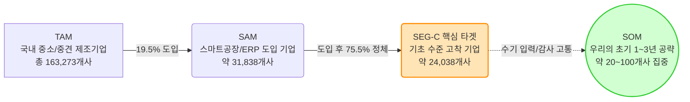
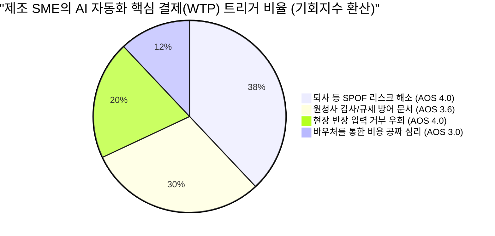
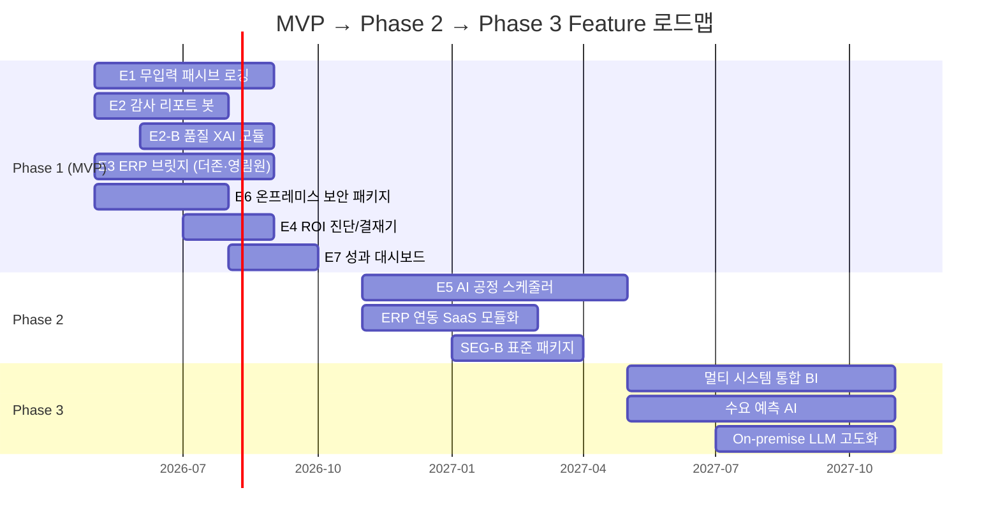
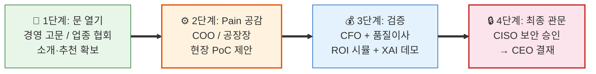
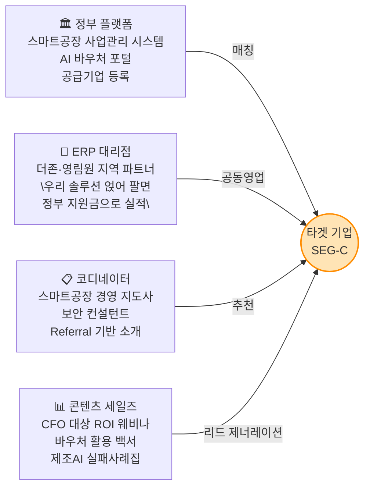

# Value Proposition Sheet (VPS) V1 — 최종 합본
## 중소/중견 제조업 대상 AI 자동화 SI 및 SaaS 비즈니스

> **문서 목적**: '우리는 어떤 고객에게 어떤 차별적 가치를 전달하는가?'를 명확히 정의하고, 고객의 근본적 '과제(Job-to-be-Done)'로부터 출발하여 제안 가치(Value), 제품 기능(Feature), MVP 구현 상세 계획, 비즈니스 실행 전략까지 하나의 문서로 일관되게 연결합니다.
> **설계 원칙**: 모든 기능은 AOS/DOS 기회분석(▶9)의 정량 데이터와 JTBD 인터뷰(▶10)의 정성 검증에 근거하며, DMU(COO·CFO·품질이사·CISO) 전원의 Job이 반영되어야 계약이 성사됩니다.
> **핵심 시장 기회**: 국내 스마트공장 도입 기업의 75.5%가 기초 단계에 정체된 **'2차 자동화 공백(Second Automation Gap)'** — 약 24,000개 기업이 본 사업의 핵심 타겟입니다.
> **버전**: V1 Merged (Opus + Gemini 합본)
> **작성일**: 2026년 4월

---

## 목차

| Part | 섹션 | 내용 | 핵심 질문 |
|:---:|:---|:---|:---:|
| **Ⅰ** | §1 Problem-Solution Fit | 페르소나별 문제-해결-효과 매핑 | 왜 사는가? |
| **Ⅰ** | §2 종합 캔버스 | 시장·경쟁·차별적 가치 요약 | 무엇을 파는가? |
| **Ⅰ** | §3 Proof | TAM-SAM-SOM, JTBD, AOS/DOS 정량 검증 | 증거가 있는가? |
| **Ⅱ** | §4 Job-Value-Feature 매핑 보드 | 고객 Job → 가치 → 기능 전체 매핑 | 무엇을 만드는가? |
| **Ⅱ** | §5 공통 설계 원칙 | Human-in-the-Loop 안전 프로토콜 | 어떤 원칙으로? |
| **Ⅲ** | §6 MVP 기능 상세 명세 | Feature별 세부 기능 트리 (P1→P2→P3) | 어떻게 만드는가? |
| **Ⅲ** | §7 우선순위 산정 원칙 | Priority 결정의 논리적 근거 | 왜 이 순서인가? |
| **Ⅲ** | §8 Phase 로드맵 | 세그먼트 확장 경로 연동 Gantt | 언제 만드는가? |
| **Ⅲ** | §9 페르소나 커버리지 검증 | DMU 전원 커버리지 크로스체크 | 빠진 것은 없는가? |
| **Ⅳ** | §10 수익 구조 | 과금 모델, ROI, SOM 시나리오 | 어떻게 버는가? |
| **Ⅳ** | §11 실행 제언 | 예비 창업자 Actionable Tips | 어떻게 시작하는가? |
| **Ⅳ** | §12 영업 시퀀스 | Sales Critical Path (4단계) | 어떻게 파는가? |
| **Ⅳ** | §13 GTM 보강 | 가설 검증 지표 + 파트너 채널 + 경쟁 해자 | 어떻게 뚫는가? |
| **부록** | 분석 보고서 연계 매핑 | 12개 보고서 → 섹션별 근거 추적 | 근거는 어디에? |

---

# Part Ⅰ. 가치 제안 — 왜 사는가?

---

## §1. Problem-Solution Fit: 고객별 가치 제안 (문제-해결-효과 매핑)

페르소나별 치명적 Pain이 어떻게 해결되고 어떤 정량적 효과를 내는지 명확히 매핑합니다. **5인의 핵심 이해관계자(DMU)가 모두 포함되어야 계약이 성사됩니다.**

| 타겟 페르소나 (Pain 주체) | 직면한 문제 (Problem) | 핵심 제안 (Solution Feature) | 기대 효과 (Desired Outcome) |
| :--- | :--- | :--- | :--- |
| **공장장 / COO**<br>(현장운영)<br>AOS 4.0 · DOS 3.6 | **[단일 장애점 & 입력 거부]**<br>핵심 스케줄러 퇴사 시 공장이 멈추는 SPOF 리스크. 막대한 비용을 들여 MES 키오스크를 도입해도 작업자가 입력을 전면 거부. | **[무입력 로깅 & ERP 브릿지]**<br>작업자 개입(터치/타이핑) 없이 음성/Vision만으로 현장 데이터를 패시브하게 수집하고, **더존·영림원 ERP 전용 API 커넥터**를 통해 자동 연동 | **[운영 연속성 확보]**<br>- 현장 작업자 수기 입력 **0%**<br>- 1인 스케줄러 의존 탈피<br>- 불만 폭주 및 파업 리스크 제거 |
| **구매본부장 / 품질이사**<br>(규제/감사 대응)<br>AOS 4.0 · DOS 2.8 | **[규제 방어막의 부재]**<br>원청사의 기습적 품질 감사나 탄소/Traceability 제출 요구 시, 데이터가 분절되어 있어 며칠 밤을 새워 취합해도 조작 의심을 받음. 2026년부터 EU CBAM, 글로벌 원청사 공급망 실사 의무화. | **[원클릭 감사 리포터]**<br>연동된 데이터를 기반으로 원청사나 글로벌 규제가 요구하는 양식의 **적법 이력 증빙 PDF를 버튼 1회 추론으로 자동 생성**. AI 판단 근거를 XAI(설명 가능한 AI) 리포트로 제공 | **[생존권 및 신뢰 보장]**<br>- 감사 리포트 취합 시간 **90% 단축**<br>- 품질 원천 데이터 조작 의혹 소멸<br>- 즉각 제출로 납품 탈락 리스크 방어 |
| **IT 담당자(CIO)**<br>(보안 및 연동)<br>AOS 3.2 · DOS 2.4 | **[데이터 사일로와 레거시 딜레마]**<br>기존 더존/영림원 ERP와 MES가 분절되어 있고 전면 교체(15억 이상)하기에는 공장 가동 중단 리스크가 큼. 경영진으로부터 "AI 언제 도입하냐"는 압박을 받지만 기반이 없어 막막. | **[비파괴형 레거시 동기화 브릿지]**<br>기존 ERP DB를 뜯지 않고 **더존·영림원 전용 Read-Only 커넥터**로 특정 데이터만 읽어오는 API 모듈 또는 엑셀 Batch 업/다운로더 환경. 시스템 교체 Zero. | **[기존 시스템 수명 연장]**<br>- 기존 망 훼손 위험 **0%**<br>- 파편화된 데이터 병합 수작업 제거<br>- IT 인프라 파괴 없이 안전한 AI 전환 |
| **CFO / CEO**<br>(비용 및 결재)<br>AOS 1.6(CFO) · 3.0(CEO) | **[정부 돈과 귀찮음 사이의 딜레마]**<br>AI 도입의 성공이 불확실한 상태에서 내부 자금(수천~억 단위)을 지출할 수 없음. 그러나 정부 바우처를 받자니 신청/보고 서류 등 행정 부담이 막대함. 과거 SI 실패 경험으로 **'투자 실패 공포'**가 가장 강력한 선행 장벽으로 작동. | **[행정 턴키 대행 & 전용 ROI 진단 & 공포 해소 패키지]**<br>중기부/과기부의 AX/제조 바우처 사업 선정을 위한 사업계획서 대행부터 평가/사후 관리까지 100% 밀착 수행. **PoC 성과 미달 시 전액 환불 보증** + 동종 업종 Before-After 비교 카드 + AI 적합성 사전 진단 체크리스트 제공 | **[WTP 저항 제거]**<br>- 도입 기업의 자부담 **최대 80%** 감축<br>- 사내 직원의 행정 투입 시간 **0시간**<br>- 명확한 재무적 회수(Payback) 확인<br>- **"실패해도 잃을 것 없다"**는 심리적 안전망 |
| **CISO / 정보보안책임자**<br>(보안 최종 관문)<br>AOS 1.0 · 평가점수 4.8 | **[클라우드 절대 불가의 벽]**<br>생산 노하우·공정 데이터의 퍼블릭 클라우드 저장 시 보안 감사 즉시 탈락. AI 도입을 허용하고 싶어도 현존하는 SaaS 솔루션의 데이터 외부 반출 구조를 정책적으로 허용 불가. **계약 직전 단독 거부권** 보유. | **[프라이빗 온프레미스 AI]**<br>데이터가 사내를 **한 바이트도 벗어나지 않는** 폐쇄망 전용 AI 패키지. 오프라인 패키지 배포로 모델 업데이트. **보안 준수 확인서** + ISMS 준거 체크리스트 사전 제출 | **[보안과 혁신의 공존]**<br>- 보안 감사 **100% 통과**<br>- CISO의 "명분 있는 혁신 허용" 달성<br>- 클라우드 거부 논리 무력화<br>- 외부 트래픽 **Zero** 검증 |

> [!IMPORTANT]
> **DMU 공략 필수 경로**: CISO는 AOS가 낮아 "기회"로 보이지 않지만, 페르소나 평가 **4.8점 최고점**을 기록한 **"숨은 최종 보스"**입니다. 이 관문을 통과하지 못하면 COO·CFO·품질이사의 모든 합의가 한 번에 무효화됩니다. On-premise 옵션은 선택이 아니라 **필수**입니다.

---

## §2. Value Proposition Sheet 종합 캔버스

| 항목 | 내용 |
| :--- | :--- |
| **핵심 페르소나 및 시장** | **SEG-C (스마트공장 기초 수료 기업)**: 데이터 인프라의 껍데기만 존재하고 실무 활용이 전혀 이루어지지 않는 약 24,038개의 '정체된 중기업' — 이른바 **'2차 자동화 공백(Second Automation Gap)'** 상태에 놓인 기업군. 이 중 생산 자동화 관련 업종 실질 타겟은 약 **1,900~2,500개사**. |
| **초세분화 타겟 (Vertical-First)** | '제조업 전체'가 아닌, **금속가공 또는 식품제조** 1~2개 공정에 완전히 특화. 해당 공정의 업무 로직을 경쟁자보다 먼저, 더 깊이 자산화하여 **도메인 데이터의 해자(Moat)**를 구축. |
| **우리 솔루션의 핵심 제안** | **"단 한 번의 키보드 입력 없이, 당장의 납품 규제를 통과시켜주는 정부 지원 AI 솔루션"**<br>결코 '10% 생산 효율화'라는 모호한 가치를 팔지 않음. 무입력, 원청사 규제 통과, 정부 바우처라는 강력한 생존/비용 프레이밍 제공. |
| **기존 대안 (Competitor)** | - **1세대 MES (수동)**: 작업자가 입력하지 않아 데이터 신뢰도가 바닥임.<br>- **국내 AI+RPA 전문사 (레인보우브레인·파워젠)**: 프로젝트 단가 수천만~억 원, 납품 2~6개월 소요. Man-Month 구조라 중소 제조 현장에 가볍게 진입 불가.<br>- **ERP 내장 AI (더존 ONE AI)**: 자사 ERP 경계 안에서만 작동 → 공장 현장(MES/설비/엑셀) 연동 불가.<br>- **클라우드 글로벌 AI (SAP 등)**: CISO(보안)가 허락하지 않는 데이터 유출 위험과 수십억의 예산 부담.<br>- **파워포인트/엑셀 (수기)**: 치명적인 휴먼 에러 창출, 담당자 부재 시 노하우 증발. |
| **우리가 제공하는 차별적 가치** | 1. **UX의 극한 (Zero Touch)**: 인간의 노력을 0으로 만드는 데이터 수집<br>2. **영업의 극한 (턴키 행정)**: 단순히 AI 소프트웨어가 아닌, 자금 조달 컨설팅(바우처)을 묶어 파는 '종합 가치'<br>3. **연동의 극한 (Light Bridge)**: 시스템 교체 없이 기존 생태계에 부착. 더존·영림원 ERP 전용 커넥터로 즉시 연결, **시스템 교체 Zero**<br>4. **보안의 극한 (Private AI)**: 데이터 한 바이트도 안 나가는 온프레미스 전용 패키지로 CISO 관문 무력화 |

---

## §3. Proof (차별적 가치 검증 데이터 및 시각화)

### A. "이 시장은 정말 크고 타겟은 명확한가?" (TAM-SAM-SOM)



### B. "고객은 무엇 때문에 우리 AI를 사는가?" (JTBD / AOS 기반 구매 동인)
인터뷰 결과(총 14인), 중소 제조사 결정권자는 '생산성 10% 향상'과 같은 긍정적 지표보다 **'단일 장애점(퇴사) 공포 방어'와 '규제(감사) 회피'**라는 강력한 손실 회피 심리에 지갑을 엽니다.

> *"그 과장 없으면 그날 공장 그냥 멈춰요. 누가 뭘 먼저 찍어야 할지 아무도 몰라요."* (모 자동차 부품사 COO)
> *"감사팀 실사 오면 밤새 엑셀 찾는 게 일상입니다. 데이터 하나 어긋나면 납품 탈락 사유가 돼요."* (모 회사 구매본부장)



### B-2. AOS/DOS 통합 기회 TOP 6 (인터뷰 검증 완료)

| Desired Outcome (고객의 언어) | Imp | Sat | AOS | MR | DOS | 검증 근거 |
|:---|:---:|:---:|:---:|:---:|:---:|:---|
| **O-1. 담당자 퇴사 시에도 공정 계획 수립 유지** | 5.0 | 1.0 | **4.0** | 0.9 | **3.6** | "과장 퇴사 트라우마" — JTBD Case 1 |
| **O-2. 현장 작업자 입력 없는 데이터 자동 로깅** | 5.0 | 1.0 | **4.0** | 0.8 | **3.2** | "키오스크 입력은 절대 안 함" |
| **O-3. 원청사 납품 감사용 이력 PDF 즉시 생성** | 4.8 | 1.2 | **3.6** | 0.7 | **2.5** | "밤샘 엑셀 취합 해방" — JTBD Case 2 |
| **O-4. 시스템 교체 없는 ERP-MES 데이터 브릿지** | 4.0 | 1.0 | **3.2** | 0.8 | **2.4** | "15억 전면 교체 외 대안 없음" |
| **O-5. 우리 회사 전용 ROI 분석 보고서 제공** | 4.5 | 1.5 | **3.0** | 0.6 | **1.8** | "남의 회사 ROI는 불신함" |
| **O-6. 데이터 외부 유출 Zero 온프레미스 보안** | 4.2 | 1.2 | **3.0** | 0.5 | **1.5** | "보안실장 승인 유일 조건" |

### C. 수치적 Proof 요약
- **생존 규제**: 2026년부터 EU CBAM(탄소 국경세), 글로벌 원청사(삼성, 현대차 공급망)의 파트 이력 추적성 실사가 의무화됨. 데이터 제출 불가 시 벤더 탈락이라는 막대한 압박.
- **예산 지원**: 중기부/과기부 주도 2026년 "제조 AX 사업" 할당 예산만 **4,230억 원** (중기부+과기부 합산). 고객사 자부담금 축소를 보장할 국비 자금줄이 확실히 존재함.
- **경쟁 공백**: 대형 SI(포스코DX, 미라콤)는 단가 불일치로 중소기업 미진입. 더존 ONE AI는 ERP 경계 밖 연동 불가. 레인보우브레인·파워젠은 납품 2~6개월로 중소기업엔 과중함.

---

# Part Ⅱ. Job-Feature 매핑 — 무엇을 만드는가?

---

## §4. Job - Value - Feature 매핑 보드 (Overview)

기능이 존재해야 하는 '고객의 이유(Job)'에서 출발하는 매핑 테이블입니다. 개발팀은 이 표를 통해 '우리가 지금 만들고 있는 이 버튼이 어떤 비즈니스 가치를 방어하는가'를 이해할 수 있습니다.

| 타겟 페르소나 | 고객의 완수 과제 (Job) | 제안 가치 (Value Proposition) | MVP 대응 핵심 기능 (Epic/Feature) | AOS 합산 | 중요도 | 난이도 | 타이밍 | 우선순위 | 릴리즈 | 경쟁사 대비 차별 포인트 |
| :--- | :--- | :--- | :--- | :---: | :---: | :---: | :---: | :---: | :---: | :--- |
| **공장장 / COO**<br>AOS 4.0 · DOS 3.6 | "작업자 반발 없이, 퇴사에 구애받지 않고 공정 데이터를 남기고 싶다." | **Zero-Touch 현장 본위 아키텍처** | **E1. 무입력 패시브 센싱 로깅**<br> - 소음 제거형 음성 로깅<br> - Vision 기반 자동 캡처<br> - 관리자용 롤백 | **8.0** | 5 | 4 | 5 | **P1** | MVP | **비접촉 패시브 수집은 시장에 전무** |
| **구매본부장 / 실무진**<br>AOS 4.0 · DOS 2.8 | "감사팀이 들이닥쳤을 때 1초만에 조작 의심 없이 제출하고 싶다." | **납품 규제 100% 방어막** | **E2. 원클릭 감사 리포트 봇**<br> - Lot Merge 로직<br> - 업종 특화 PDF 출력<br> - 결측치 알림 + **XAI 시각화** | **7.6** | 5 | 2 | 5 | **P1** | MVP | **규제 포맷 자동 매핑은 시장에 전무** |
| **품질이사(차품질)**<br>AOS 3.0 · DOS 2.4 | "AI 판단 근거를 내 눈으로 확인하고, 최종 결정은 반드시 내가 내리고 싶다." | **Human-in-the-Loop 안전장치** | **E2-B. 품질 이상탐지 XAI 모듈**<br> - 판단근거 한국어 설명<br> - "알림만, 결정은 이사님" UI<br> - 판단 이력 감사 로그 | **7.0** | 5 | 3 | 4 | **P1** | MVP | **판단근거 시각화는 시장 공백** |
| **IT 담당자(CIO)**<br>AOS 3.2 · DOS 2.4 | "ERP DB를 건드리지 않으면서 정보 불일치를 막고 싶다." | **비파괴형 레거시 동기화** | **E3. 레거시(ERP) API 브릿지**<br> - 더존·영림원 Read-Only 커넥터<br> - 수동 엑셀 Batch 브릿지 | **7.2** | 5 | 3 | 5 | **P1** | MVP | **더존+영림원+엑셀 통합 브릿지는 신규** |
| **CISO**<br>AOS 1.0 · 평가 4.8 | "데이터를 외부로 한 바이트도 내보내지 않으면서 AI를 허용하고 싶다." | **보안 정책 100% 준수 AI** | **E6. 온프레미스(폐쇄망) 보안 패키지**<br> - 폐쇄망 AI 런타임<br> - ISMS 준수 확인서<br> - RBAC + 감사 로그<br> - 망분리 설계서 | **4.2** | 4 | 3 | 5 | **P1** | MVP | **On-premise AI 패키지는 시장에 전무** |
| **CFO / 기업대표**<br>AOS 1.6(CFO) · 3.0(CEO) | "서류 절차나 자본 소모 없이 정부 지원금으로 솔루션을 쓰고 싶다." | **재무적 공포의 제거 (Turn-key)** | **E4. 영업용 진단 및 결재기**<br> - 바우처 설계 웹뷰<br> - ROI 리포터<br> - 적합성 사전 진단<br> - B/A 비교 카드 | **4.6** | 4 | 2 | 5 | **P2** | MVP | **기업 맞춤 재무 계산기 + 사전 진단은 없음** |
| **전체 DMU**<br>(사용→유지) | "숫자로 보여줘야 계속 쓰겠다. 갱신 결재 근거가 필요하다." | **MRR 정당화 & 확장 엔진** | **E7. 성과 가시화 & 리텐션 대시보드**<br> - 페르소나별 월간 성과<br> - 분기 ROI 리포트<br> - NPS + 레퍼런스 수집 | — | 4 | 2 | 3 | **P2** | MVP | **자동 성과 증명은 차별화** |
| **공장장 / COO**<br>(스케줄링) | "박 부장의 뇌 구조를 시스템으로 대체해 납기 중단을 막고 싶다." | **특정 인력 의존성 탈피** | **E5. 최적화 공정 AI 스케줄러**<br> - 작업 배분 알고리즘<br> - 스케줄링 XAI | **10.0** | 5 | 5 | 2 | **P3** | Phase 2 | **중견기업 특화 경량 AI는 없음** |

> [!TIP]
> **E5(AI 스케줄러)의 AOS 합산은 10.0으로 최고이지만 P3인 이유**: ① E1 데이터가 최소 3개월 축적 필수, ② 개발 난이도(5)로 Go-to-Market 6개월+ 지연, ③ 기업마다 공정 변수가 달라 PoC 성공률이 낮음. "데이터 수집(Phase 1) → AI 학습(Phase 2)"의 순서가 반드시 지켜져야 합니다.

---

## §5. 공통 설계 원칙: Human-in-the-Loop 안전 프로토콜

> [!IMPORTANT]
> **AI는 제안·경고만 수행하며, 실행·확정은 반드시 인간이 승인합니다.**
>
> JTBD 인터뷰(▶10)와 페르소나 분석(▶7)에서 반복 확인된 핵심 불안(Anxiety)은 "AI가 틀렸을 때 책임은 누가 지나?"입니다. 제조 현장에서 AI의 비결정론적 특성은 품질사고·생산중단으로 직결되므로, **MVP 전체 Feature에 다음 원칙이 적용**됩니다.

| 원칙 | 적용 방식 | 적용 Feature |
|------|----------|-------------|
| **AI 제안, 인간 확정** | AI가 생성한 모든 결과물은 담당자의 명시적 Approve 없이 외부로 발행되지 않음 | E1~E7 전체 |
| **판단 근거 의무 표시** | AI가 판단·분류·경고를 수행할 때 반드시 "왜?"를 한국어로 설명 | E2 (XAI), E5 |
| **단독 실행 금지** | AI가 생산중단, 공정변경 등 물리적 영향이 있는 행위를 시스템 레벨에서 차단 | E5 (스케줄러) |
| **롤백/수정 보장** | AI 오인식 데이터를 관리자가 한 화면에서 일괄수정(Approve/Reject) 가능 | E1 (F1.3) |

---

# Part Ⅲ. MVP 구현 상세 계획 — 어떻게 만드는가?

---

## §6. 우선순위에 따른 핵심 기능(Feature) 상세 목록

### 🥇 Priority 1 (P1): 제품 본연의 생존과 핵심 가치 창출 (Must Have)

> P1 기능이 하나라도 빠지면 4인 DMU 중 최소 1인의 거부로 계약 자체가 불가합니다.

---

**[E1] 무입력 패시브 로깅 엔진 (Zero-Touch Logging)**
> 대응 Job: COO/공장장 "작업자 반발 없이 데이터를 남기고 싶다" | AOS 합산 8.0

*   **F1.1 노이즈 캔슬레이션 STT 커맨더**: 80dB 이상의 현장 기계음 속에서도 작업자의 지시어("금형 교체", "생산 완료")만 트리거하여 텍스트로 치환하는 모듈. (Whisper API 튜닝)
*   **F1.2 Vision 상태 캡처기**: 모바일 카메라로 공정 완성품/바코드/계기판을 찍으면 LLM이 상태 값을 파싱하여 시스템에 밀어 넣는 기능.
*   **F1.3 로그 롤백/수정 관리자 웹** *(Human-in-the-Loop)*: AI가 오인식한 데이터를 관리자(반장)가 퇴근 전 한 화면에서 확인하고 일괄 수정(Approve/Reject)할 수 있는 웹 뷰어. **AI 자동 확정 불가 — 반드시 인간 승인 필요.**

---

**[E2] 자동화된 추적성(Traceability) 컴플라이언스 봇**
> 대응 Job: 구매본부장 "감사 데이터를 1초만에 제출하고 싶다" | AOS 합산 7.6

*   **F2.1 파편화 로트(Lot) 머지 로직**: 수집된 로깅 데이터와 기존 ERP 재고 데이터를 로트 번호 기준으로 시간순 병합하는 백엔드 엔진.
*   **F2.2 업종 특화 템플릿 매핑 PDF 제너레이터**: **금속가공·식품제조 2개 버티컬 우선** 대응. 삼성전자(전자부품), 현대차(금속가공), EU CBAM(탄소), HACCP(식품안전) 등 주요 규제 포맷에 맞게 테이블 뷰를 재배치하고 워터마크가 찍힌 무결성 PDF로 다운로드 및 이메일 전송.
*   **F2.3 결측치 강제 알림 체커**: 리포트 생성 전 필수 데이터 누락 항목을 자동 감지하고 담당자에게 보완 요청 알림 발송.

---

**[E2-B] 품질 이상탐지 XAI 모듈 (설명 가능한 AI 품질 감시)**
> 대응 Job: 품질이사 "AI 판단 근거를 내 눈으로 확인하고, 최종 결정은 내가 내리고 싶다" | AOS 합산 7.0

*   **F2B.1 XAI 판단근거 시각화 대시보드**: AI가 이상 징후를 감지할 때, **"왜 이 데이터를 이상으로 판단했는가"**를 한국어로 설명하는 인터페이스. 관련 데이터 포인트를 하이라이팅하여 품질이사의 직관적 검증을 지원.
*   **F2B.2 "알림만, 결정은 이사님" UI**: AI는 **절대로 단독으로 생산중단 결정을 내리지 않음**을 시스템 레벨에서 보장. 이상 감지 시 알림만 발송하고, 물리적 조치는 반드시 품질이사의 명시적 승인 후에만 실행.
*   **F2B.3 판단 이력 감사 로그**: AI가 내린 모든 판단, 품질이사의 승인/거절 이력, 결과(실제 불량 여부)를 시간순으로 기록. 원청사 품질 감사 시 "AI 판단 → 인간 검증 → 결과" 전 과정 증빙.

---

**[E3] 비파괴형 레거시(ERP) 브릿지**
> 대응 Job: CIO "ERP DB를 건드리지 않고 데이터를 연동하고 싶다" | AOS 합산 7.2

*   **F3.1 더존·영림원 전용 Read-Only DB 커넥터**: **더존 iCUBE/Smart A**, **영림원 K-System** 등 국내 주요 ERP의 특정 테이블(재고, 발주, 생산실적)만 읽어올 수 있도록 하여 정보유출/DB손상 우려를 원천 차단하는 플러그인. 대상 테이블 범위를 CIO와 사전 합의하여 문서화.
*   **F3.2 Low-Tech 엑셀 Batch 업/다운로더**: API 개방을 절대 불허하는 극보안 타겟사를 위해, 기존 ERP 엑셀 덤프를 드래그 앤 드롭하면 우리 시스템 포맷에 자동 파싱되는 대체 기능.

---

**[E6] 온프레미스 보안 패키지 (Private AI Infrastructure)**
> 대응 Job: CISO "데이터를 외부로 한 바이트도 내보내지 않으면서 AI를 허용하고 싶다" | 평가 4.8

> [!CAUTION]
> **이 기능이 없으면 계약이 성사되지 않습니다.** CISO는 AOS가 낮아(1.0) "기회"로 보이지 않지만, 페르소나 평가 4.8점 최고를 기록한 **"숨은 최종 보스"**입니다.

*   **F6.1 폐쇄망 전용 AI 런타임 패키지**: 모든 AI 모델(STT, Vision, LLM)이 고객사 사내 서버에서만 구동. 외부 API 호출 Zero. Docker 기반 오프라인 설치 패키지로 배포.
*   **F6.2 오프라인 모델 업데이트**: AI 모델 업데이트 시 USB/내부망 전용 패키지로 배포. 인터넷 연결 없이 버전 관리 가능.
*   **F6.3 ISMS/ISMS-P 보안 준수 확인서 자동 생성**: CISO가 내부 보안 심의에서 사용할 수 있는 **사전 작성된 보안 적합성 검증 문서**. 데이터 흐름도, 접근권한 매트릭스, 암호화 방식 등을 표준 양식으로 출력.
*   **F6.4 RBAC + 접속이력/데이터조회 감사 로그**: 역할 기반 접근 제어 기본 내장. 누가/언제/어떤 데이터를 조회했는지 전수 기록. 이상 접근 감지 알림.
*   **F6.5 망분리 아키텍처 설계서**: IT 보안 심의 동행 PT에서 사용할 수 있는 네트워크 다이어그램. OT/IT 망분리 원칙 충족 증빙.

---

### 🥈 Priority 2 (P2): 영업 마찰력 제거 및 리텐션 확보 (Should Have)

---

**[E4] CFO 전용 진단 및 도입 시뮬레이터 (B2B 세일즈 내장 툴)**
> 대응 Job: CFO "확실한 ROI와 실패 안전장치 없이는 결재 못 한다" | AOS 합산 4.6

*   **F4.1 반응형 바우처/ROI 웹 계산기**: 기업의 "직원수, 기존 ERP 명"만 입력하면 국가지원금 매칭 확률, 예상 자부담금 축소액, 야근 삭감 회수액이 즉시 출력되는 영업용 무기.
*   **F4.2 AI 적합성 사전 진단 체크리스트**: "귀사의 5가지 조건 충족률 → 예상 성공률 80%"처럼 **도입 전 리스크를 정량화**하여 CFO의 투자 실패 공포를 해소.
*   **F4.3 동종 업종 Before-After 비교 카드 생성기**: "금속가공 A사 → 납기 준수율 72%→94%, 감사 대응 시간 48h→2h" 형식의 **업종별 실증 카드를 자동 생성**.

---

**[E7] 성과 가시화 & 리텐션 엔진**
> 대응 Job: 전체 DMU "숫자로 보여줘야 계속 쓰겠다" | CJM(▶8) 교차분석 핵심 결론

> [!IMPORTANT]
> **이 기능은 MRR(월 구독료 150~200만 원)을 정당화하는 핵심 기능입니다.** 이 기능이 없으면 구독 갱신 거절률이 급증합니다.

*   **F7.1 페르소나별 월간 성과 대시보드 자동 발행**:
    - **COO용**: 납기 준수율, 스케줄 수립 소요시간, 설비 가동률 추이
    - **CFO용**: 운영비 절감 누적 금액, 재고 회전율, 바우처 사후관리 현황
    - **품질이사용**: 불량률 추이, AI 이상감지 적중률(Precision/Recall), 원청사 감사 통과 이력
    - **CISO용**: 외부 트래픽 Zero 검증 로그, 접근 권한 변동 이력, 보안 이벤트 리포트
*   **F7.2 분기 ROI 누적 리포트**: "도입 후 N개월, 총 절감 금액 X원, 감사 리포트 Y건 자동 발행" 형식으로 CFO의 **갱신 결재를 자동 지원**.
*   **F7.3 NPS 조사 + 레퍼런스 동의 수집**: 성과 리포트 수신 시 1클릭 NPS 평가. 고만족(9~10점) 고객에게 레퍼런스 동의 및 지인 소개 자동 요청.

---

### 🥉 Priority 3 (P3): 고도화 및 장기 비전 (Out of MVP Scope — Phase 2)

**[E5] 완전 자동화 공정 스케줄러 & 스케줄링 XAI 모듈**
> 대응 Job: COO/공장장 "스케줄러 1인의 뇌를 시스템으로 대체하고 싶다" | AOS 합산 10.0 (최고)

*   **F5.1 작업 배분 알고리즘**: 설비 가동률, 자재 재고, 작업자 숙련도를 종합하여 최적 생산 스케줄 자동 생성. *단, E1의 패시브 로깅 데이터가 최소 3개월 이상 축적된 이후에만 학습 가능.*
*   **F5.2 스케줄링 XAI (결정근거 설명)**: AI가 왜 이 순서로 작업을 배치했는지를 자연어로 설명.
*   *(배제 사유)*: AOS 합산 최고(10.0)이나, ① Phase 1 데이터 축적 선행 필수, ② 기업마다 공정 변수가 달라 PoC 성공률이 낮음, ③ 개발 난이도(5)로 MVP 출시를 6개월+ 지연시킴.

---

## §7. 기능 우선순위(Priority) 산정 원칙 근거

| 결정 요소 | P1 (Must Have) 산정 이유 | P3 (Out of Scope) 배제 이유 |
| :--- | :--- | :--- |
| **비즈니스 임팩트** | '무입력 체제'(AOS 4.0)와 '규제 방어'(AOS 3.6)는 치명적 요건. '보안 관문 통과'(CISO 평가 4.8)는 계약 전제 조건. | 스케줄러 SPOF 해소(AOS 10.0)는 최상위이나, 현장 변수로 MVP 범위를 넘어섬. |
| **고객 지불의사(WTP)** | '자부담 최소화'와 '환불 보증'이 초기 WTP의 가장 강력한 트리거. ROI 계산기+사전 진단(P2)이 결재 지렛대. | XAI 스케줄링은 활용 이후에 가치를 느끼므로 Upsell 모델로 활용. |
| **타임투마켓** | PDF 템플릿, LLM API 파싱, Docker 패키지 등 12주 내 출시 가능. | 공정 스케줄러(난이도 5)는 엔진 구축에만 6개월+ 소요. |
| **DMU 통과 필수성** | E6 없으면 CISO 거부 → 전체 무효화. E2-B 없으면 품질이사 불신 → 조직적 저항. | 스케줄러 미포함 시 COO가 아쉬워하지만, 로깅+리포트로 당면 SPOF 방어 가능. |

---

## §8. Phase 로드맵 — 세그먼트 확장 경로 연동



| Phase | 시기 | 대상 세그먼트 | 핵심 Feature | 목표 |
|:---:|:---:|:---:|:---|:---|
| **Phase 1 (MVP)** | 0~6개월 | **SEG-C** (초핵심) | E1+E2+E2-B+E3+E4+E6+E7 | 바우처 연계 첫 수주 4~6건 |
| **Phase 2** | 6~12개월 | SEG-C 확장 **+ SEG-B 진입** | E5 AI 스케줄러 + ERP SaaS 모듈화 | Phase 1 데이터 기반 AI 학습 |
| **Phase 3** | 12~24개월 | SEG-B 안정 **+ SEG-D 진입** | 멀티 시스템 통합 BI + 수요 예측 | MRR 30%↑ 달성 |

---

## §9. Feature-페르소나 커버리지 검증 매트릭스

| Feature | COO/공장장 | 구매본부장 | 품질이사 | CIO | CFO/CEO | CISO | 비고 |
|---------|:---:|:---:|:---:|:---:|:---:|:---:|------|
| **E1** 무입력 로깅 | ★ | ○ | | | | | 핵심 |
| **E2** 감사 리포터 | ○ | ★ | ○ | | | | 핵심 |
| **E2-B** 품질 XAI | | | ★ | | | | 핵심 |
| **E3** ERP 브릿지 | ○ | ○ | | ★ | | | 핵심 |
| **E4** ROI 진단 | | | | | ★ | | 영업 |
| **E5** AI 스케줄러 | ★ | | | | | | Phase 2 |
| **E6** 온프레미스 | | | | ○ | | ★ | 필수 관문 |
| **E7** 성과 대시보드 | ○ | ○ | ○ | | ○ | ○ | 리텐션 |

★ = 직접 해결 / ○ = 간접 혜택

> **검증 결과**: 4인 DMU(COO·CFO·품질이사·CISO) 모두 최소 1개 이상의 ★ Feature를 보유. **DMU 전원 커버리지 달성**.

---

# Part Ⅳ. 비즈니스 실행 — 어떻게 버는가?

---

## §10. 수익 구조 및 비즈니스 모델 설계

### A. 하이브리드 과금 모델 (Setup + MRR 구독형)

1. **초기 구축비 (On-boarding & Setup)**: **약 5,000만 원 내외 (바우처 활용)**
   - 현장 Vision/음성 센서 최적화 세팅, ERP 연동 API 구축 등 솔루션 온보딩 비용.
   - **과금 전략**: 총 구축비의 80~90%를 정부 바우처로 청구. 기업 실제 자부담 500~1,000만 원.
2. **SaaS 구독료 (Recurring Revenue)**: **월 150~200만 원 (고객사 전액 자부담)**
   - AI 모델 토큰 비용, 원청사 규제 대응 포맷 정기 업데이트 명목.

> [!WARNING]
> **바우처 의존 리스크**: 정부 예산 삭감 시 초기 구축비 모델이 붕괴될 수 있습니다. **SaaS 구독료 기반의 자립 수익 구조를 Year 2부터 전체 매출의 30% 이상으로 끌어올리는** 것이 필수 생존 조건입니다. 바우처는 '채널'로만 활용하고, 사업의 본질은 반복 수익(MRR)에 둬야 합니다.

### B. 가격 수용성의 핵심 단초 (Pricing vs. Value)

* **Pain 1 기반 회수 (연 5,000만 원 방어)**: 숙련자 1인 대체에 투입되는 채용/기회비용(최소 연 5,000만 원) 대비, 월 유지비 150만 원은 '경영 리스크 보험금'입니다.
* **Pain 2 기반 회수 (수억 원 대 벤더 탈락 방어)**: 원청사 실사 데이터를 내지 못하면 수억 원대 매출이 증발합니다. 월 150만 원이라는 가격 저항이 소멸됩니다.

### C. 리텐션(Lock-in)과 랜드 앤 익스팬드(Growth) 전략

* **교체 비용(Switching Cost)의 극대화**: 현장 직원들이 '무입력 편의성'을 한 번 맛보면, 시스템을 내리는 것을 조직적으로 거부합니다. ERP 연동 커넥터가 깊게 결합될수록 교체 비용이 기하급수적으로 상승합니다.
* **Land & Expand**: 1단계 '패시브 로깅+리포트'(MVP) → 2단계 공정 스케줄링 AI (월과금 인상) → 3단계 품질 불량 탐지 XAI 추가로 LTV를 극대화합니다.

### D. 3개년 SOM 시나리오 (10인 팀 기준)

```
Year 1:  2억~ 3억원   (SEG-C 4~6건 + SEG-A 10~15건)
Year 2:  5억~ 8.5억원  (SEG-C 확장 + SEG-B 진입)
Year 3: 12억~20억원   (SEG-D 1~2건 진입, MRR 30%↑)
────────────────────
누적 합계: 약 19억~31.5억원 (3년)
고객 1개사 3년 LTV: 약 1억 6,100만원 (SEG-C 기준)
```

---

## §11. 예비 창업자를 위한 비즈니스 실행 제언 (Actionable Tips)

> [!IMPORTANT]
> **전략 요약: 철저하게 '솔루션'이 아닌 '고통의 진통제'로 위장하십시오.**
> 
> 1. **「기술」을 팔지 말고 「공포 해소」와 「돈」을 파십시오.**
>    고객사 대표와 임원들은 AI 알고리즘의 혁신성에는 관심이 없습니다. **"김 부장이 내일 관둬도 공장이 돌아간다," "삼성전자 감사팀이 와도 1초 만에 서류를 준다," "구축 비용 8천만 원은 중기부가 내줍니다"**라는 3문장만이 결재를 만듭니다.
> 
> 2. **세그먼트 징검다리 전략 (Beachhead Market)**
>    **SEG-C (스마트공장 기초는 갖췄으나 활용하지 못해 고통받는 2만 4천 개 기업)**를 최우선 진입 시장으로 삼으십시오.
> 
> 3. **관문의 파괴: 「트로이 목마 (바우처 대행사)」 전략**
>    콜드 메일을 보낼 때 "우리 혁신 AI를 사세요"가 아니라, **"올해 귀사에 버려질 수 있는 중기부 현금 5천만 원 무상 지원금 확보, 저희가 서류 다 써드리겠습니다"**라고 접근하여 장벽을 파괴하십시오.
>
> 4. **초세분화 공정 집중 (Vertical-First Strategy)**
>    **금속가공 또는 식품제조** 1~2개 버티컬을 첫 타겟으로 고정하여, 해당 공정의 표준 업무 흐름을 자산화하십시오. 도메인 깊이가 곧 경쟁 방어막입니다.
>
> 5. **투자 실패 공포 해소 패키지 (Fear-Killer)**
>    - **PoC 성과 미달 시 전액 환불 보증**
>    - **AI 적합성 사전 진단 체크리스트** ("이 5가지 조건 충족 시 성공률 80%")
>    - **동종 업종 Before-After 비교 카드**
>    - **업무 시간 절감 계산기** (업무 시간 입력 → 절감 금액 자동 산출)

---

## §12. 영업 진입 시퀀스 (Sales Critical Path)

> 중견기업(SEG-C/D) 영업은 '바우처로 공짜'만으로 안 됩니다. **'실패 시 담당자의 커리어 손실'을 어떻게 방어해줄 것인가**가 핵심입니다.



| 단계 | 대상 | 핵심 액션 | 제공 자료 |
|:---:|------|-----------|----------|
| **1** | 김가이드형 (경영 고문) / 박준호형 (TF장) | 유사 업종 PoC 성공 사례 1건(수치 포함) 공유 | 업종별 성공사례 1-Pager |
| **2** | 한성우형 (COO) ★최우선 / 소장님 (공장장) | 납기 대시보드 라이브 데모 + "3개월 무상 PoC" 제안 | 현장 동행 시연 + Before-After 비교 카드 |
| **3** | 이재무형 (CFO) + 차품질 (품질이사) | 정부 바우처 설계서 + 3년 ROI 시뮬레이션 + XAI 판단근거 데모 | CFO용 재무 계산기 + 품질이사용 블라인드 테스트 |
| **4** | 최보안형 (CISO) → 강승현 (CEO) 최종 결재 | On-premise 아키텍처 설계서 + 보안 준수 확인서 사전 제출 | 망분리 다이어그램 + ISMS 준거 체크리스트 |

> [!CAUTION]
> **CISO는 마지막에 등장하지만 가장 위험합니다.** 도입 의지 최저(Non-user)이나 평가 점수 최고(4.8). On-premise 옵션 준비 없이 영업을 시작하면 안 됩니다.

---

## §13. 초기 사업 검증 및 파트너십 GTM 전략 (from BMC & Lean Canvas)

> 비즈니스 모델 캔버스(▶11)와 린 캔버스(▶12)에서 도출된 **사업 검증 궤도, 파트너 채널, 경쟁 우위 해자(Moat)** 3가지를 보강합니다.

### 13-1. MVP 핵심 가설 검증 및 성과 지표 (Key Metrics)

| 가설 유형 | 검증 질문 | 핵심 지표 (Metric) | 타겟 수준 |
|:---:|:---|:---|:---|
| **영업 가설** | CFO는 바우처 + ROI 시뮬레이터를 보고 PoC에 동의하는가? | 바우처 연계 PoC **도입 동의서 확보 건수** | 6개월 내 4~6건 |
| **가치 가설** | COO는 '비침습적 수집'과 '자동 보고서'를 기존 MES의 대안으로 인정하는가? | 스케줄링 소요 시간 단축률 (예: 3시간 → 15분) | **80% 이상** 단축 |
| **데이터 가설** | 현장 작업자의 저항 없이 실적 데이터가 쌓이는가? | MES 내 데이터 **결측치 감소율** | 도입 전 대비 **70%↓** |
| **효율 가설** | 표준화 커넥터로 SI 비용이 절감되는가? | ERP 연동 **Man-Month 하락 추이** | 2번째 고객사부터 **50%↓** |

> [!TIP]
> **영업 가설**(동의서 확보 건수)은 제품 개발 이전에도 UI 목업과 ROI 웹 계산기만으로 검증 가능합니다. §12의 2단계(Pain 공감 → PoC 제안)와 연동하여 최우선 실행하십시오.

### 13-2. 우회 진입을 위한 파트너십 채널 플랜 (Wedge Channel Strategy)

§12의 영업 시퀀스는 기업 **내부** DMU 공략 4단계를 정의했습니다. 여기서는 **최초 접점을 형성하는 방법**을 제시합니다.



| 채널 유형 | 파트너 | Win-Win 구조 | §12 연결 |
|:---|:---|:---|:---:|
| **정부 플랫폼** | KOSMO, NIPA | 공급기업 등록 → 수요기업 매칭 시스템 통해 자동 리드 확보 | 1단계 |
| **ERP 대리점** | 더존비즈온·영림원 지역 파트너 | "우리 AI를 얹어 팔면 정부 지원금으로 실적을 채울 수 있다"는 크로스셀 | 1단계 |
| **코디네이터** | 스마트공장 경영 지도사, 보안 컨설턴트 | 기존에 기업을 평가·지도하는 위원들의 Referral 기반 영업 | 1단계 |
| **콘텐츠 세일즈** | 자체 웨비나·백서 | "바우처 활용 원가 절감 플랜" 주최로 CFO/경영진 타겟팅 리드 수집 | 3단계 |

### 13-3. 핵심 경쟁 우위와 방어 해자 (Unfair Advantage)

| Unfair Advantage | 내용 | 복제 난이도 | 시간 가치 |
|:---|:---|:---:|:---:|
| **① 레거시 ERP 표준 연동 라이브러리** | 영림원·더존 등의 DB 스키마 패턴을 추출한 '표준 브릿지 API'. 타사 대비 구축 리드타임 **70% 이상 단축**. 고객사마다 축적되는 스키마 변형 노하우가 해자를 두텁게 만듦. | ★★★★★ | 선점할수록 심화 |
| **② 바우처 행정 턴키 프로세스** | 정부 사업 매칭 → 사업계획서 작성 → 감리 및 지원금 정산까지 A-to-Z 수행. 제품만 훌륭한 타사 대비 **"행정까지 해주는 턴키"**라는 치명적 매력. | ★★★★☆ | 경험 축적형 |

> [!IMPORTANT]
> 두 해자 모두 **시간이 지날수록 강화되는 복리(Compound) 구조**입니다. §11 Tip 4(Vertical-First)와 결합하여 **특정 업종 × 특정 ERP 조합의 깊이**를 선제적으로 확보하는 것이 전략적 급소입니다.

---

# 부록. 분석 보고서 연계 매핑

### A. VPS 섹션별 근거 추적

| VPS 섹션 | 근거 보고서 | 핵심 인용/활용 |
|----------|-----------|--------------| 
| §1 Problem-Solution Fit | ▶7 페르소나 스펙트럼, ▶9 AOS/DOS, ▶10 JTBD | 핵심 5인 DMU, Switch Trigger, 인터뷰 인용 |
| §2 종합 캔버스 | ▶2 경쟁사 브리핑, ▶3 가치사슬, ▶4 KSF, ▶5 문제정의서 | 경쟁사 차별화, Vertical-First, 2nd Automation Gap |
| §3 Proof | ▶6 TAM-SAM-SOM, ▶9 AOS/DOS, ▶10 JTBD | 시장 규모 모수, Outcome 기회점수, JTBD 인용문 |
| §4 Job-Feature 매핑 | ▶9 AOS/DOS §17 기능-페르소나 매핑 | AOS 합산 기반 우선순위, Phase 분리 논리 |
| §10 수익 구조 | ▶6 TAM-SAM-SOM §7·§9, ▶1 포터 비관 시나리오 | SOM 3개년, LTV, 바우처 리스크 경고 |
| §11 실행 제언 | ▶4 KSF, ▶5 문제정의서, ▶1 포터 5가지 힘 | KSF Top 5, 공포 해소, 시나리오 분석 |
| §12 영업 시퀀스 | ▶7 페르소나 §15 진입 시퀀스, ▶8 CJM 교차 분석 | Critical Path, CISO 관문, DMU 순서 |
| §13 GTM 보강 | ▶11 비즈니스 모델 캔버스, ▶12 린 캔버스 | Key Metrics, Wedge Channel, Unfair Advantage |

### B. Feature별 근거 추적

| Feature | 근거 보고서 | 핵심 연결 |
|---------|-----------|----------|
| E1 무입력 로깅 | ▶10 JTBD Case 1, ▶9 AOS 4.0 | "아무것도 안 해야죠" 직접 인용 |
| E2 감사 리포터 | ▶10 JTBD Case 2, ▶9 AOS 4.0/DOS 2.8 | "버튼 하나로 Traceability Report" |
| E2-B 품질 XAI | ▶7 §11 차품질, ▶9 AOS 3.0 | "AI는 이사님의 24시간 감시 조수" |
| E3 ERP 브릿지 | ▶4 KSF-3, ▶5 Integration Moat | 더존·영림원 커넥터 선점 전략 |
| E4 ROI 진단 | ▶10 JTBD 가설 E, ▶5 투자 실패 공포 | 바우처 대행 + 공포 해소 패키지 |
| E5 AI 스케줄러 | ▶9 AOS 합산 10.0 (최고), ▶10 가설 A | Phase 1 데이터 선행 필수 |
| E6 온프레미스 | ▶7 §12 최보안, ▶10 가설 F | "한 바이트도 안 나가는 Private AI" |
| E7 성과 대시보드 | ▶8 CJM §5 교차분석 | "숫자로 보여줘야 계속 쓰겠다" |

---

*본 문서는 VPS V1 Opus 버전과 VPS V1 Gemini 버전의 장점을 결합한 최종 합본입니다. 12개 분석 통합본(포터5가지힘·경쟁사브리핑·가치사슬·KSF·문제정의서·TAM-SAM-SOM·페르소나스펙트럼·고객여정지도·AOS-DOS기회분석·JTBD인터뷰·비즈니스모델캔버스·린캔버스)에 근거합니다.*
*버전: V1 Merged / 작성일: 2026년 4월*
