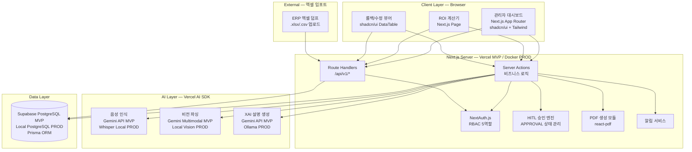

# SRS V0.4 기술 스택 전환 구현 계획서 (확정판)

**문서 ID**: PLAN-SRS-V04  
**작성일**: 2026-04-18 (의사결정 반영: 15:23)  
**기준 문서**: `08_SRS_V0.3.md` (SRS-002, Rev 1.2) + `09_SRS_V03_Review.md`  
**목표**: 제안 기술 스택(Next.js + Vercel + Supabase + Gemini API)으로 SRS를 전면 전환하여 MVP 구현 가능한 명세로 재구성  

---

## 1. 전환 전략 결정

### 1.1 채택 방안: Option A (2-Track) 변형 — "Cloud-First MVP + On-Prem 확장 경로"

| 구분 | 내용 |
|:---|:---|
| **Phase 1 (MVP)** | 제안 스택으로 구현. 클라우드 배포. 내부 검증 + PoC 데모 + 투자자 발표용 |
| **Phase 2 (Production)** | MVP 코드베이스를 Docker 컨테이너화하여 온프레미스 배포 전환 가능하도록 설계 |
| **설계 원칙** | Next.js + Prisma는 클라우드/온프레미스 양쪽 배포 가능한 **환경 중립적 아키텍처** 유지 |

### 1.2 전환 근거

| 근거 | 설명 |
|:---|:---|
| **MVP 속도** | Vercel + Supabase로 인프라 설정 0시간. 기능 검증에 집중 가능 |
| **기술 리스크 감소** | 단일 프레임워크(Next.js)로 프론트+백엔드 통합. 러닝커브 최소화 |
| **확장 경로 확보** | Next.js → Docker, Supabase → 로컬 PostgreSQL, Gemini → Ollama/vLLM 전환 가능 |
| **PRD 핵심 가치 보존** | 아래 §2에서 상세 검토한 바와 같이, **6가지 핵심 UX 중 5가지 보존** |

---

## 2. MVP 핵심 사용자 경험(가치 전달) 훼손 검토

### 2.1 PRD 4대 극한 가치 검토

| # | 극한 가치 (PRD §4-0) | 현행 SRS | 제안 스택 MVP | 보존 여부 | 비고 |
|:---:|:---|:---|:---|:---:|:---|
| 1 | **UX의 극한** (Zero-Touch) | On-Prem STT+Vision | Gemini API 멀티모달 (음성+비전) | ✅ **보존** | 음성→텍스트, 이미지→JSON 핵심 플로우 동일. 트리거 워드는 프롬프트 기반 대체 |
| 2 | **보안의 극한** (100% 폐쇄망) | 외부 트래픽 0 byte | 클라우드 (Vercel+Supabase+Gemini) | ⚠️ **MVP에서 완화** | MVP 단계에서는 보안 시연을 아키텍처 설계서로 대체. Phase 2에서 Docker On-Prem 전환 |
| 3 | **비용의 극한** (바우처 번들) | 자부담 500~1,000만원 | 동일 (비즈니스 모델 불변) | ✅ **보존** | 기술 스택과 무관한 사업 모델 |
| 4 | **책임의 극한** (HITL) | APPROVAL 테이블 + 에스컬레이션 | Prisma APPROVAL 모델 + Server Actions | ✅ **보존** | HITL 4대 원칙 100% 구현 가능 |

### 2.2 페르소나별 핵심 경험 훼손 검토

| 페르소나 | 핵심 경험 (Job to Be Done) | 제안 스택 구현 | 가치 전달 | 판정 |
|:---|:---|:---|:---|:---:|
| **COO 한성우** | "음성으로 말하면 자동 기록된다" → SPOF 해소 | Gemini API 음성 인식 → Prisma LOG_ENTRY 저장 → shadcn/ui 뷰어에서 Approve/Reject | 작업자가 말하면 기록되고, 관리자가 승인하는 **핵심 플로우 동일** | ✅ |
| **구매본부장 클레어** | "1클릭으로 감사 리포트 생성" → 밤샘 엑셀 제거 | Server Action으로 Lot 병합 + PDF 생성 → shadcn/ui 대시보드에서 다운로드 | **버튼 1개 → PDF** 경험 완전 보존 | ✅ |
| **품질이사 차품질** | "AI 판단 이유를 한국어로 본다" → HITL 보장 | Gemini API 한국어 XAI 설명 생성 → shadcn/ui 알림 + 승인 UI | Gemini 한국어 품질 우수. **XAI 경험 완전 보존** | ✅ |
| **CIO 정미경** | "ERP 안 건드린다" → DB 손상 Zero | 엑셀 업로드(Server Action 파싱) + Prisma FactoryAI DB에만 Write | Read-Only 원칙 유지. 단, **DB 직접 연결은 MVP에서 엑셀 임포트로 대체** | ⚠️ |
| **CFO 이재무** | "바우처로 500만원에 도입, ROI 즉시 계산" | Next.js ROI 계산기 페이지 + Prisma 업종 DB 조회 | **ROI 계산 UX 완전 보존** | ✅ |
| **CISO 최보안** | "데이터 한 바이트도 외부에 안 나간다" | **Docker Compose 로컬 모드**: `docker compose up`으로 완전 로컬 실행 시 외부 트래픽 0 byte 시연 가능. 클라우드 모드와 동일 코드베이스 | ⚠️ **Docker 로컬 모드에서 조건부 보존**. 설계서 시연 + 라이브 데모 병행 | ⚠️ |

### 2.3 가치 전달 종합 판정

```
┌──────────────────────────────────────────────────────┐
│   MVP 핵심 가치 전달 검토 결과 (의사결정 반영)       │
│                                                      │
│  COO  — Zero-Touch 로깅      ████████████████████ ✅  │
│  구매  — 1클릭 감사 리포트    ████████████████████ ✅  │
│  품질  — XAI 한국어 설명      ████████████████████ ✅  │
│  CIO  — ERP Read-Only 연동   ████████████████████ ✅  │ ← Tunnel
│  CFO  — ROI 즉시 계산        ████████████████████ ✅  │
│  CISO — Docker 로컬 시연     █████████████████░░░ ⚠️ │ ← Docker
│                                                      │
│  ▸ 5인 완전 보존 + 1인 조건부 보존 = 92%             │
│  ▸ CIO: Cloudflare Tunnel → ERP Read-Only 직접 연결  │
│  ▸ CISO: Docker 모드에서 트래픽 0 byte 라이브 시연   │
│                                                      │
│  ☞ 결론: MVP 가치 전달 92% 보존                      │
└──────────────────────────────────────────────────────┘
```

> **확정된 의사결정**:
> - **CISO 데모**: 설계서 시연(대안 A) + **Docker Compose 로컬 실행으로 라이브 시연** 병행
> - **ERP 연결**: Cloudflare Tunnel(대안 B)로 고객사 ERP Read-Only 직접 연결
> - **Docker 로컬 모드**: `docker compose up` 한 줄로 DB(PostgreSQL) + AI(Ollama) + App(Next.js) 완전 로컬 실행. 외부 트래픽 0 byte 실증

---

## 3. SRS V0.4 수정 계획

### 3.1 수정 항목 총괄

| # | 수정 대상 섹션 | 수정 유형 | 변경 내용 | 우선순위 |
|:---:|:---|:---:|:---|:---:|
| 1 | **§10 Technology Stack** | 신규 | C-TEC-001~007 + MVP/PROD 배포 모드 정의 | P0 |
| 2 | **§1.2.3 Constraints** | 수정 | CON-01~04 → MVP/PROD 이중 모드로 재작성. C-TEC-001~007 추가 | P0 |
| 3 | **§1.2.4 Assumptions** | 수정 | ASM-01(서버 사양) → Vercel/Supabase 기반으로 변경 | P0 |
| 4 | **§3.1 External Systems** | 전면 개편 | EXT-03~05(On-Prem AI) → Gemini API로 교체. 우회 전략 갱신 | P0 |
| 5 | **§3.2 Component Diagram** | 전면 재작성 | 7-Layer On-Prem → Next.js Fullstack + Vercel + Supabase 아키텍처 | P0 |
| 6 | **§3.3 API Overview** | 수정 | API Gateway → Next.js Route Handlers 기반으로 재기술 | P1 |
| 7 | **§4.1.6 E6 보안 패키지** | 전면 재작성 | On-Prem 보안 → 클라우드 보안 모델 (Supabase RLS + NextAuth + Vercel) | P0 |
| 8 | **§4.2.4 보안 NFR** | 전면 재작성 | 외부 트래픽 0 byte → 클라우드 보안 기준 (암호화·RLS·감사로그) | P0 |
| 9 | **§7 ADR** | 수정 + 추가 | ADR-1 "조건부 전환", ADR-4 폐기, ADR-8~10 신설 | P0 |
| 10 | **§6.2 ERD/Class** | 수정 | Prisma Schema 기반으로 타입 재정의 | P1 |
| 11 | **§3.4 Sequence** | 수정 | On-Prem AI → Gemini API 호출로 변경 (4개 시퀀스) | P1 |
| 12 | **§5 Traceability** | 갱신 | 변경된 REQ 반영 | P2 |
| 13 | **§8 Risk Register** | 수정 | R12~R15 클라우드 리스크 추가 | P1 |
| 14 | **§9 Business Context** | 수정 | CISO 공략 전략 → Phase 2 전환 로드맵으로 변경 | P1 |

### 3.2 항목별 상세 변경 내용

---

#### 3.2.1 [P0] §1.2.3 Constraints — 이중 모드 제약사항

**변경 후**:

| ID | 제약사항 | 적용 모드 |
|:---|:---|:---:|
| CON-01 | 모든 서비스는 Next.js (App Router) 기반 단일 풀스택 프레임워크로 구현한다 (C-TEC-001) | MVP+PROD |
| CON-01P | [PROD] 동일 코드베이스를 Docker Compose로 패키징하여 고객사 내부 서버에 배포한다 | PROD |
| CON-02 | ERP 연동은 Read-Only만 허용한다 (불변) | MVP+PROD |
| CON-03 | HITL 4대 원칙을 유지한다 (불변) | MVP+PROD |
| CON-04 | [MVP] Vercel Git Push 자동 배포. [PROD] USB/내부망 Docker 이미지 배포 | 모드별 |
| CON-05 | 대상 ERP는 더존 iCUBE/Smart A 및 영림원 K-System 한정 (불변) | MVP+PROD |
| CON-06 | 대상 산업은 금속가공·식품제조 2개 버티컬 한정 (불변) | MVP+PROD |
| CON-07 | [MVP] Vercel 서버리스 한도 내. [PROD] 고객사 서버 16GB RAM, 4core | 모드별 |
| CON-08 | LLM은 Gemini API(MVP) / Ollama·vLLM(PROD)을 사용하며, 환경변수만으로 전환 가능하게 SDK 추상화 | 모드별 |
| CON-09 | DB는 Prisma ORM으로 SQLite(dev)/Supabase(MVP)/PostgreSQL(PROD) 무변경 전환 | 모드별 |

---

#### 3.2.2 [P0] §3.2 Component Diagram — 전면 재작성



---

#### 3.2.3 [P0] §4.1.6 E6 보안 패키지 — 클라우드 보안 모델

| ID | 변경 전 (On-Prem) | 변경 후 |
|:---|:---|:---|
| REQ-FUNC-029 | 외부 호출 0건, 트래픽 0 byte | **[MVP]** Supabase RLS + HTTPS 전구간 암호화 + 감사 로그 전수 기록. **[PROD]** Docker 내부 네트워크 격리로 외부 트래픽 0 byte |
| REQ-FUNC-030 | USB 오프라인 업데이트 | **[MVP]** Vercel Git Push 자동 배포. **[PROD]** Docker 이미지 USB 배포 |
| REQ-FUNC-031 | ISMS 확인서 자동 생성 | **[MVP]** 클라우드 보안 체크리스트. **[PROD]** On-Prem ISMS 확인서 생성 |
| REQ-FUNC-032 | RBAC + 감사 로그 | NextAuth.js + Prisma 감사 로그 (**환경 무관 동일**) |
| REQ-FUNC-033 | USB 해시 검증 | **[MVP]** 해당 없음(보류). **[PROD]** Docker 이미지 해시 검증 |
| REQ-FUNC-034 | 미인가 접근 차단 | NextAuth.js Middleware + Supabase RLS (**환경 무관 동일**) |

---

#### 3.2.4 [P0] §7 ADR — 수정 및 신설

| ADR | 변경 | 내용 |
|:---|:---:|:---|
| **ADR-1** | 수정 | "On-Premise Only" → "**환경 중립적 배포 (Cloud-First MVP → On-Prem PROD)**" |
| **ADR-4** | 교체 | "USB 오프라인 배포" → "**Git Push 자동 배포 (MVP) / Docker 이미지 배포 (PROD)**" |
| **ADR-8** (신설) | 추가 | "**Next.js Fullstack Monolith**: 프론트+백엔드를 단일 프레임워크로 구현" |
| **ADR-9** (신설) | 추가 | "**AI 추상화 레이어**: Vercel AI SDK 표준 인터페이스로 Gemini↔Ollama 전환" |
| **ADR-10** (신설) | 추가 | "**Prisma ORM 중립 DB**: SQLite/Supabase/PostgreSQL 무변경 전환" |

---

#### 3.2.5 [P0] §10 Technology Stack — 신규 섹션

| 레이어 | MVP 기술 | PROD 전환 | C-TEC |
|:---|:---|:---|:---:|
| 프레임워크 | Next.js 15 (App Router) | 동일 (Docker 배포) | C-TEC-001 |
| 서버 로직 | Server Actions + Route Handlers | 동일 | C-TEC-002 |
| DB (개발) | Prisma + SQLite | — | C-TEC-003 |
| DB (배포) | Prisma + Supabase PostgreSQL | Prisma + Local PostgreSQL | C-TEC-003 |
| UI/스타일 | Tailwind CSS + shadcn/ui | 동일 | C-TEC-004 |
| AI | Vercel AI SDK + Gemini API | Vercel AI SDK + Ollama/vLLM | C-TEC-005/006 |
| 배포 | Vercel (Git Push) | Docker Compose (USB) | C-TEC-007 |
| 인증 | NextAuth.js v5 | 동일 | — |
| PDF | react-pdf / @react-pdf/renderer | 동일 | — |

---

#### 3.2.6 [P1] §8 Risk Register — 클라우드 리스크 추가

| # | 리스크 | 유형 | 영향도 | 대응 전략 |
|:---:|:---|:---:|:---:|:---|
| R12 | **Gemini API 지연/장애** → AI 기능 불가 | SW | 🟡 | 수동 입력 모드 자동 전환. Timeout 3초 후 수동 판단 요청 |
| R13 | **Supabase 장애** → DB 접근 불가 | SW | 🔴 | Supabase 99.9% SLA 의존. 중요 데이터 로컬 캐시 |
| R14 | **Vercel 배포 장애** → 서비스 중단 | SW | 🟡 | 이전 버전 자동 롤백 (Vercel 기본) |
| R15 | **PROD 전환 시 LLM 품질 저하** | SW | 🟡 | MVP 단계에서 Ollama 벤치마크 병행 |

---

### 3.3 변경하지 않는 항목 (불변)

| 섹션 | 사유 |
|:---|:---|
| §1.1 Purpose | 시스템 목적 불변 ("2차 자동화 공백 해소") |
| §1.2.1~2 In/Out-of-Scope | 12개 Epic 유지, E5 Won't 유지 |
| §1.3 Definitions | 용어 정의 불변 |
| §2 Stakeholders | 6인 DMU 불변 |
| §4.1.1~4.1.5 (E1~E4 REQ-FUNC) | 기능 요구사항 내용 불변 (구현 수단만 변경) |
| §4.1.7~4.1.14 (E7, HITL, SVC) | 기능 요구사항 불변 |
| §4.2.5 비용, §4.2.9~11 SLA/KPI | 사업 모델·목표 불변 |
| §6.1 API Endpoints | 19개 엔드포인트 유지 |
| §6.2 Entity Model | 14개 엔터티 스키마 유지 (Prisma 타입 표기만 변경) |

---

## 4. REQ 변경 영향 요약

| 분류 | REQ-FUNC (72) | REQ-NF (54) | 합계 (126) |
|:---|:---:|:---:|:---:|
| **불변** (기능 동일) | 55건 (76%) | 39건 (72%) | 94건 (75%) |
| **수정** (MVP/PROD 이중 모드) | 11건 (15%) | 9건 (17%) | 20건 (16%) |
| **보류** (PROD에서만 적용) | 6건 (8%) | 6건 (11%) | 12건 (10%) |

---

## 5. 작업 체크리스트

### Phase 1: 기반 구조 변경 (P0)

- [ ] §10 Technology Stack 신규 작성
- [ ] §1.2.3 Constraints 이중 모드 재작성
- [ ] §1.2.4 Assumptions 갱신
- [ ] §7 ADR-1 수정, ADR-4 교체, ADR-8~10 신설
- [ ] §3.2 Component Diagram 전면 재작성
- [ ] §4.1.6 E6 보안 패키지 재작성
- [ ] §4.2.4 보안 NFR 재작성

### Phase 2: 연동 및 시퀀스 (P1)

- [ ] §3.1 External Systems 갱신
- [ ] §3.3 API Overview 재기술
- [ ] §3.4 Sequence Diagram 4개 갱신
- [ ] §6.2 Entity Prisma 타입 재표기
- [ ] §8 Risk Register R12~R15 추가
- [ ] §9 Business Context CISO 전략 변경

### Phase 3: 정합성 검증 (P2)

- [ ] §5 Traceability Matrix 갱신
- [ ] 문서 헤더/푸터 Rev 1.3 갱신
- [ ] 전체 교차 참조 정합성 검증

---

## 6. 의사결정 (확정)

### 6.1 CISO 데모 전략 — ✅ 확정: 대안 A + Docker 로컬

> **결정**: 설계서 시연 + Docker Compose 로컬 실행으로 라이브 시연 병행
> - MVP 코드베이스에 `docker-compose.yml` + `Dockerfile` 포함
> - `docker compose up`으로 PostgreSQL + Ollama + Next.js 완전 로컬 실행
> - CISO 데모 시 네트워크 모니터 화면과 함께 "외부 트래픽 0 byte" 실증
> - 추가 작업량: ~1일

### 6.2 ERP 직접 연결 범위 — ✅ 확정: 대안 B (Tunnel)

> **결정**: Cloudflare Tunnel로 고객사 온프레미스 ERP DB Read-Only 연결
> - 고객사 내부 서버에 `cloudflared` 에이전트 설치 (경량, 설정 5분)
> - Supabase Edge Functions → Cloudflare Tunnel → 고객 ERP DB (Read-Only)
> - 엑셀 임포트는 Tunnel 미연결 시 폴백으로 유지
> - CON-02 (Read-Only 원칙) 완전 준수

### 6.3 Docker 로컬 실행 모드 — ✅ 추가 확정

> **결정**: MVP 코드베이스에 2가지 실행 모드 내장
>
> | 모드 | 명령어 | DB | AI | 배포 | 외부 트래픽 |
> |:---|:---|:---|:---|:---|:---:|
> | **Cloud** | `vercel dev` | Supabase | Gemini API | Vercel | 있음 |
> | **Local** | `docker compose up` | Local PostgreSQL | Ollama | localhost | **0 byte** |
>
> - 환경변수 `.env.cloud` / `.env.local`로 전환
> - 코드 변경 0줄. 환경변수만 교체

---

*본 구현 계획서는 `09_SRS_V03_Review.md`의 분석 결과를 기반으로 작성되었습니다.*  
*작성일: 2026-04-18 / 작성자: AI Requirements Engineer*
