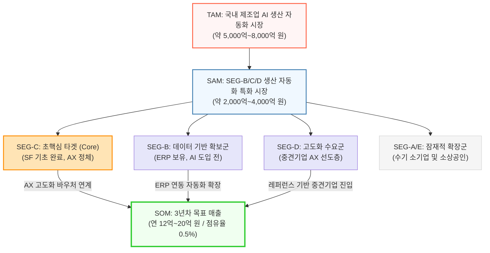

# TAM-SAM-SOM 및 시장 세분화 시각화 (Mermaid Chart)
## AI 기반 생산 공정 자동화 사업 전략 맵

> **작성 목적**: 앞서 분석한 TAM-SAM-SOM 데이터와 시장 세분화 지도를 시각적으로 한눈에 파악할 수 있도록 머메이드(Mermaid) 차트로 표현한다.  
> **핵심 타겟**: SEG-C (스마트공장 기초 수료 후 AX 정체 기업)  
> **작성일**: 2026년 4월

---

## 📊 시장 전략 구조도

---

## 🔍 차트 설명 및 전략적 시사점

### 1. 시장 흐름 (TAM → SAM → SOM)
*   **TAM**: 생산 스케줄링, 공정 제어, 자재 관리 등 S/W 및 서비스 전체 시장입니다.
*   **SAM**: 전체 제조업 중 우리 솔루션이 즉시 적용 가능한 특정 세그먼트(B, C, D)의 생산 자동화 수요로 좁혔습니다.
*   **SOM**: **SEG-C**를 징검다리 삼아 3년 내 연 매출 12억~20억 원(SAM 내 0.5% 점유) 달성을 목표로 합니다.

### 2. 세그먼트별 공략 포인트
*   **SEG-C (Core-Orange)**: **초핵심 타겟**입니다. 스마트공장 1단계로 데이터는 이미 쌓여 있으나 활용을 못 하는 곳으로, 고도화 바우처 지원금(70%)을 지렛대 삼아 가장 빠르게 유료 고객으로 전환합니다.
*   **SEG-B (Purple)**: ERP를 쓰고 있는 소/중기업입니다. AI 기술보다는 **'기존 ERP와의 연동 편리성'**을 강조하여 진입합니다.
*   **SEG-D (Purple)**: 레퍼런스가 쌓인 3년 차 이후 진입할 중견기업 층입니다. 통합 시스템 구축과 높은 계약 단가가 목표입니다.

### 3. 성공 공식 (Driving Force)
*   **Voucher Engine**: 정부 바우처를 통해 고객의 초기 투자 공포(Risk)를 제거합니다.
*   **Legacy Bridge**: 기존 시스템(더존, 영림원 등)과 AI를 즉시 연결하는 '라스트 마일' 기술력이 SOM 획득의 핵심 동력입니다.

---
*참고: 위 차트는 Mermaid 호환 Markdown 뷰어에서 시각화되어 표시됩니다.*
