# 세그먼트 관계 및 비즈니스 실행 전략 보고서
## 중소/중견 제조업 AI 생산 자동화 사업 (SEG-C 초핵심 타겟)

> **작성 목적**: 도출된 5개 시장 세그먼트 간의 상호작용을 로드맵화하고, 각 세그먼트별 차별화된 접근 전략과 이를 달성하기 위한 구체적 실행 방안을 수립한다.  
> **핵심 전략**: **'SEG-C 징검다리 전략'** (기초 데이터 확보군을 선점하여 중견기업 시장으로 확장)  
> **작성일**: 2026년 4월

---

## 1. 세그먼트 간의 관계도 (Market Dynamics Map)

세그먼트들은 독립적으로 존재하지 않고, 기업의 성장 단계와 디지털 성숙도에 따라 유기적으로 연결되어 있다.

```mermaid
graph LR
    %% 세그먼트 정의
    A["SEG-A: 수기 소기업<br>(디지털 입문)"]:::potential
    E["SEG-E: 소상공인<br>(SaaS 입문)"]:::potential
    B["SEG-B: ERP 고아<br>(디지털 과도기)"]:::segment
    C["SEG-C: 초핵심 타겟<br>(AI 전환점)"]:::core
    D["SEG-D: AX 중견기업<br>(고도화 성숙기)"]:::high

    %% 시장 이동 관계 (성장 사다리)
    E -- "성장/확장" --> A
    A -- "ERP 도입" --> B
    B -- "SF 기초 구축" --> C
    C -- "AI 고도화 완료" --> D

    %% 리퍼럴/영향력 관계 (신뢰 사다리)
    C -. "신뢰 증명" .-> D
    C -. "성공사례 확산" .-> B
    B -. "사용 편의성 증명" .-> A

    %% 클래스 디자인
    classDef core fill:#FFE4B5,stroke:#FF8C00,stroke-width:2px;
    classDef segment fill:#E6E6FA,stroke:#9370DB,stroke-width:1px;
    classDef high fill:#D1FFD1,stroke:#32CD32,stroke-width:1px;
    classDef potential fill:#F5F5F5,stroke:#D3D3D3,stroke-width:1px;
```

### 1-1. 관계의 핵심: "SEG-C가 모든 시장의 엔진"
*   **고객의 이동**: SEG-A/B 기업이 성장하면 결국 SEG-C의 고민("데이터는 있는데 활용을 못 함")에 도달한다. 즉, SEG-C 솔루션은 상위 시장인 SEG-D로 가는 **필수 통과 관문**이다.
*   **신뢰의 전이**: 보수적인 중견기업(SEG-D)은 업계의 허리인 SEG-C에서 검증된 솔루션만을 신뢰한다. 따라서 SEG-C 레퍼런스는 SEG-D 영업을 위한 **가장 강력한 영업 자산**이 된다.

---

## 2. 세그먼트별 접근 전략 (Value Proposition)

| 세그먼트 | 핵심 메시지 (Hook) | 차별화 전략 (Differentiator) | 수익 모델 |
| :--- | :--- | :--- | :--- |
| **SEG-C** (초핵심) | **"이미 수집한 데이터, AI로 돈이 되게 하세요"** | **기술적 라스트 마일**: 기존 MES/SF 데이터와 AI 스케줄링 모델을 100% 밀착 연동. | 바우처 구축(SI) + 월 AI 운영비(SaaS) |
| **SEG-B** (중기업) | **"ERP 데이터, 엑셀 대신 AI가 읽어드립니다"** | **사용자 경험(UX)**: 더존/영림원 전용 AI 커넥터를 통한 '설치형'에 가까운 빠른 도입. | 구축비 최적화 + 표준 모듈 월 구독료 |
| **SEG-D** (중견기업) | **"파편화된 시스템 통합, 단일 AI 에이전트로 해결"** | **안정성 및 보안**: On-premise(구축형) LLM 및 기업 전용 보안 거버넌스 제공. | 고단가 SI (PoC+본사업) + 장기 유지보수 |
| **SEG-A** (소기업) | **"경리 직원 없어도 공장 돌아가게 해드립니다"** | **행정 대행**: 혁신바우처 신청 전 과정을 무료로 대행하여 심리적·비용 장벽 제거. | 바우처 정액 수익 (Low-margin, High-volume) |

---

## 3. 비즈니스를 위한 전략 실행 방안 (Implementation Plan)

10인 팀 기준의 '빠른 실행과 리스크 관리'에 초점을 맞춘 3단계 로드맵이다.

### Phase 1: 기반 구축 및 '안전한 성과' 입증 (0~6개월)
*   **목표**: SEG-C 타겟 3개사 이상 레퍼런스 확보 및 정부 인증 획득
*   **실행 과제**:
    1.  **바우처 사냥꾼(Voucher Hunter)**: AI 바우처 및 스마트공장 고도화 사업 공급기업 등록 완료.
    2.  **데이터 선점**: 금속 가공, 식품 가공 등 데이터 수집이 비교적 정형화된 특정 업종 1~2개 집중 공략.
    3.  **수치화된 ROI 도구**: 도입 전 "얼마나 아낄 수 있는지" 보여주는 **'생산 시간 절감 계산기'** 개발 및 영업 활용.

### Phase 2: 솔루션 표준화 및 '업셀 사다리' 구축 (6~18개월)
*   **목표**: 구축 경험의 라이브러리화 및 SaaS 비중 확대
*   **실행 과제**:
    1.  **커넥터 모듈화**: 더존, 영림원 등 주요 ERP 연동 코드를 라이브러리화하여 구축 기간 50% 단축.
    2.  **SaaS 전환**: 1회성 구축비 대신, 월 AI 모델 재학습 및 성능 유지비를 받는 **'AI 운영 구독 서비스'** 정착.
    3.  **SEG-B 진입**: SEG-C의 성공사례를 바탕으로 ERP만 보유한 기업들에게 "미리 AI를 준비하라"는 메시지로 시장 확장.

### Phase 3: 시장 지배력 강화 및 '중견기업(SEG-D)' 진입 (18~36개월)
*   **목표**: 특정 산업군 'Top-tier AX 파트너' 포지셔닝
*   **실행 과제**:
    1.  **산업별 전문화**: "자동차 부품 생산 AI는 OOO(우리회사)"라는 인식을 심기 위해 산업 전문 전시회 참여 및 백서 발간.
    2.  **SEG-D 타겟 대형 수주**: SEG-C에서 검증된 모듈을 통합하여 억 단위 이상의 중견기업 AX 본사업 수주.
    3.  **전담 조직 분화**: 영업팀과 엔지니어링팀을 세그먼트별(소호/중소 vs 중견/SI)로 전문화하여 운영 효율 극대화.

---

## 4. 전략 실행을 위한 핵심 KSF (Key Success Factors)

1.  **행정 대행 역량**: 중소기업 대표들은 '귀찮음' 때문에 포기한다. 서류 작업부터 선정까지 우리가 90% 대행해주는 것이 가장 강력한 영업력이다.
2.  **도메인 특화 데이터**: 단순히 AI를 잘하는 것이 아니라, **"열처리 공정에서 왜 이 데이터가 튀는지"**를 이해하는 도메인 지식을 확보해야 한다.
3.  **실패 회피 설계 (Fail-safe)**: 초기 도입 시 AI가 틀릴 가능성을 인정하고, 반드시 **'인간 개입(Human-in-the-loop)'** 및 **'데이터 검증 도구'**를 함께 제공하여 신뢰 하락을 방지해야 한다.

---

## 5. 결론: "SEG-C에서 승리하고 다른 시장을 흡수한다"

우리 비즈니스의 승패는 **"스마트공장 1단계를 마친 2만 개의 기업에게 '다음 단계'를 얼마나 명확하고 안전하게 보여줄 수 있는가"**에 달려 있습니다.

*   **진입 단계**: 정부 지원금을 활용해 고객의 비용 리스크를 우리가 대신 지고,
*   **성장 단계**: 표준화된 연동 모듈을 통해 우리의 구축 원가를 낮추며,
*   **성숙 단계**: 구축된 데이터를 바탕으로 장기적인 구독 서비스(SaaS)로 안정성을 확보하는 것이 최종 지향점입니다.

---
*작성일: 2026년 4월*
