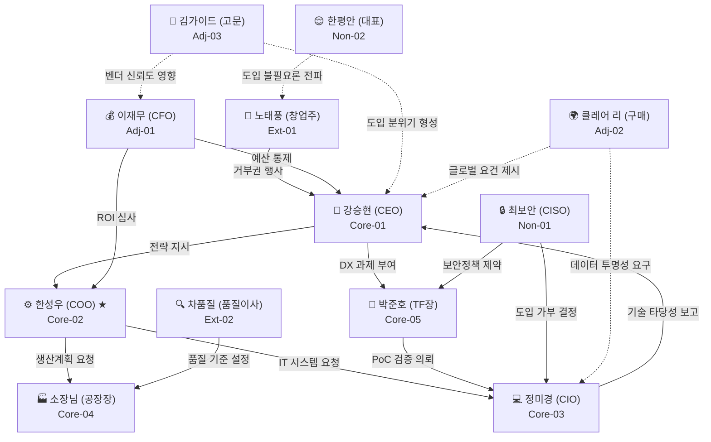

# Persona Spectrum Map (페르소나 스펙트럼 맵)
## AI 생산 공정 자동화 사업 — B2B 이해관계자 관계 구조도

> **작성 목적**: 12인 페르소나 간의 영향력 관계, 역할적 연결고리, 전략적 진입 순서를 하나의 통합 구조로 시각화한다.  
> **활용 범위**: 영업 전략 설계, 제안서 구조화, MVP 우선순위 결정  
> **작성일**: 2026년 4월

---

## 섹션 1. 스펙트럼 위상 맵 (Spectrum Position Map)

### 축 정의
- **X축 (도입 의지)**: 낮음(1) ◀──────────▶ 높음(5)
- **Y축 (조직 영향력)**: 실무(1) ◀──────────▶ 경영/전략(5)

---

### 사분면 배치표

| 사분면 | 페르소나 | X축 (의지) | Y축 (영향력) | 위치 해석 |
|--------|----------|:----------:|:----------:|-----------|
| **[I] 고영향·고의지** | 강승현 (CEO) | 4 | 5 | 전략적 챔피언. 야심이 크나 결재 前 CFO/CIO 합의 필요 |
| **[I] 고영향·고의지** | 박준호 (AX TF장) | 4 | 4 | 내부 혁신 주도자. Quick-Win이 전제됨 |
| **[I] 고영향·고의지** | 한성우 (COO) | 5 | 4 | ★최우선 타겟. 실질적 고통 보유 + 결재권 있음 |
| **[II] 고영향·저의지** | 이재무 (CFO) | 2 | 5 | 재무 관문. 설득 시 프로젝트 전체 가속화 |
| **[II] 고영향·저의지** | 노태풍 (창업주) | 1 | 5 | 파괴적 거부권자. 감성 전략 없이는 프로젝트 소멸 위험 |
| **[II] 고영향·저의지** | 최보안 (CISO) | 1 | 4 | 정책적 거부자. On-premise 없이는 협상 테이블 불가 |
| **[III] 저영향·고의지** | 정미경 (CIO) | 4 | 3 | 기술 챔피언. 실무 영향력은 높으나 최종 결재권 제한적 |
| **[III] 저영향·고의지** | 소장님 (공장장) | 3 | 3 | 현장 수용성 결정자. 현장 도입 성패의 핵심 변수 |
| **[III] 저영향·고의지** | 차품질 (품질이사) | 2 | 3 | 기술 검증자. 통과 시 신뢰도 폭발적 상승 |
| **[IV] 저영향·저의지** | 클레어 리 (구매본부장) | 3 | 3 | 글로벌 규제 대응 문맥에서만 활성화 |
| **[IV] 저영향·저의지** | 김가이드 (스마트팩토리 고문) | 3 | 2 | 레퍼런스 기반 소개형 채널. 직접 결정권 없음 |
| **[IV] 저영향·저의지** | 한평안 (안주형 대표) | 1 | 2 | 현재 공략 불가. 위기 발생 시 재접촉 후보 |

---

### 텍스트 기반 사분면 다이어그램

```
높음(경영/전략)
    │
  5 │  노태풍(창)   이재무(CFO)    강승현(CEO)
    │
  4 │  최보안(CISO)              박준호(TF) │ 한성우(COO) ★
    │─────────────────────────────────────────────────────▶
  3 │  차품질(품)  한평안(안)      소장님(장)  정미경(CIO)
    │
  2 │  김가이드(고)              클레어(구)
    │
  1 │
    └──────────────────────────────────────────────────
       낮음(1)          도입 의지          높음(5)

  [I] 오른쪽 위: 고의지·고영향 → 핵심 공략 대상
 [II] 왼쪽 위:  저의지·고영향 → 설득 필수 관문
[III] 오른쪽 아래: 고의지·저영향 → 내부 챔피언 육성
 [IV] 왼쪽 아래: 저의지·저영향 → 관망 또는 채널 활용
```

> **결론**: 한성우(COO)는 유일하게 "고의지 + 고영향"을 동시에 보유한 인물이다. 그를 첫 번째 내부 챔피언으로 확보하면, 나머지 관문(이재무·차품질·최보안)을 순차적으로 공략하는 경로가 열린다.

---

## 섹션 2. 영향력 연결 관계도 (Influence Network Map)

### 관계 유형 범례
- `→` : 직접 영향 (결정권 행사)
- `-->` : 간접 영향 (분위기·맥락 형성)
- `⟺` : 갈등/긴장 (이해 충돌)
- `+` : 동맹 가능 (함께 설득 시 시너지)

---

### Mermaid 다이어그램



---

### 관계별 텍스트 설명

#### ① 직접 영향 관계 (→)

| 발신자 | 수신자 | 영향 내용 |
|--------|--------|-----------|
| 노태풍 (창업주) | 강승현 (CEO) | 프로젝트 중단 거부권 보유. 감정적 반대 한마디로 예산 소멸 가능 |
| 강승현 (CEO) | 한성우 (COO) | AI 전략 방향 지시. COO는 CEO 비전의 실행자 |
| 강승현 (CEO) | 박준호 (TF장) | DX 과제를 TF에 위임. TF장의 권한 원천 |
| 한성우 (COO) | 소장님 | 생산 계획 실행 지시. 공장장은 COO 의지의 현장 집행자 |
| 한성우 (COO) | 정미경 (CIO) | 스케줄링 시스템 구축 요청. COO-CIO 협력 없이는 시스템 불가 |
| 이재무 (CFO) | 강승현 (CEO) | 예산 최종 통제권. ROI 불충분 시 CEO도 결제 불가 |
| 이재무 (CFO) | 한성우 (COO) | 투자비용 한도 설정. COO의 도입 범위를 재무적으로 제약 |
| 최보안 (CISO) | 정미경 (CIO) | 클라우드 연계 시스템 거부. CIO 솔루션 선택지를 제한 |
| 최보안 (CISO) | 박준호 (TF장) | 보안 가이드라인 미충족 PoC 차단 |

#### ② 간접 영향 관계 (-→)

| 발신자 | 수신자 | 영향 내용 |
|--------|--------|-----------|
| 김가이드 (고문) | 강승현 (CEO) | 세미나·네트워크를 통해 "믿을 만한 벤더"라는 분위기 형성 |
| 김가이드 (고문) | 이재무 (CFO) | "타사 도입 성공 사례" 언급으로 CFO의 심리적 저항 완화 |
| 클레어 리 (구매) | 강승현 (CEO) | 글로벌 원청사 요구 기준 강화로 AI 도입 필요성 간접 압박 |
| 클레어 리 (구매) | 정미경 (CIO) | 공급망 데이터 투명성 요구로 데이터 인프라 구축 당위성 제공 |
| 한평안 (안주형) | 노태풍 (창업주) | "지금도 잘 되는데 왜..."라는 현실 안주 논리 강화 |

#### ③ 갈등/긴장 관계 (⟺)

| 쌍 | 긴장 원인 |
|----|-----------|
| 한성우 (COO) ⟺ 이재무 (CFO) | "빠른 도입" vs "철저한 ROI 검증" — 속도와 신중함의 충돌 |
| 한성우 (COO) ⟺ 소장님 | "시스템화" vs "현장 자율성" — 데이터 통제권 갈등 |
| 정미경 (CIO) ⟺ 최보안 (CISO) | "클라우드 AI 연동" vs "외부망 완전 차단" — 기술 방향 충돌 |
| 강승현 (CEO) ⟺ 노태풍 (창업주) | "혁신 드라이브" vs "현장 경험 우선주의" — 세대 간 경영관 충돌 |
| 차품질 (품질이사) ⟺ 한성우 (COO) | "안정성 우선" vs "생산성 우선" — AI 도입 속도 갈등 |

#### ④ 동맹 가능 관계 (+)

| 쌍 | 시너지 내용 |
|----|------------|
| 한성우 (COO) + 박준호 (TF장) | COO의 실질적 고통 + TF의 공식 권한 → 빠른 PoC 추진 가능 |
| 강승현 (CEO) + 이재무 (CFO) | CEO의 상장 야심 + CFO의 재무 구조화 능력 → 대형 투자 명분 완성 |
| 정미경 (CIO) + 박준호 (TF장) | 기술 타당성 + PoC 성과 → 경영진 보고의 강력한 근거 세트 |
| 김가이드 (고문) + 이재무 (CFO) | 외부 권위자 추천 + 재무 검증 → CFO의 심리적 승인 저항을 가장 빠르게 해소 |

> **결론**: 가장 강력한 동맹 조합은 **한성우(COO) + 박준호(TF장)**이다. COO가 실질적 고통의 대변인이 되고, TF장이 공식 채널을 열어주는 구조로 접근하면 초기 PoC 진입 속도를 최대화할 수 있다.

---

## 섹션 3. 전략적 진입 시퀀스 맵 (Sales Journey Map)

### 전체 시퀀스 개요

```
[1단계] 문 열기        [2단계] 설득          [3단계] 검증           [4단계] 조달
김가이드(고문)    →    한성우(COO)      →    차품질 + 이재무    →    최보안(CISO)
(소개 채널)           (내부 챔피언)          (기술·재무 게이트)       (보안 최종 도장)
      ↕                    ↕                       ↕                      ↕
 박준호(TF장)         소장님 (현장)           정미경(CIO)             강승현(CEO)
 (공식 채널)          (수용성 확보)          (기술 지원)             (최종 결재)
```

---

### 단계별 상세 전략

#### 1단계 — 문 열기 (Door Opener)
> **핵심 질문**: "누가 첫 미팅의 명분을 만드는가?"

| 항목 | 내용 |
|------|------|
| **담당 페르소나** | 김가이드 (스마트팩토리 고문) / 박준호 (AX TF장) |
| **The Hook** | 고문: *"제가 신뢰하는 AI 파트너사를 소개해 드리겠습니다."* TF장: *"경영진 지시로 AI 벤더 검토를 시작합니다."* |
| **주요 장애물** | 고문은 실패 레퍼런스 없는 벤더를 절대 추천하지 않음. TF장은 내부 예산 승인 전에는 공식 채널 활동이 제한됨 |
| **돌파 전략** | 고문에게: **유사 업종 PoC 성공 사례 1건** (수치 포함)을 먼저 공유하여 추천 리스크를 제거. TF장에게: **"3개월 무상 PoC"** 제안으로 예산 승인 없이도 시작할 수 있는 경로 제시 |

---

#### 2단계 — 설득 (Pain Resonance)
> **핵심 질문**: "누가 실무적 고통을 공감하고 내부 챔피언이 되는가?"

| 항목 | 내용 |
|------|------|
| **담당 페르소나** | 한성우 (COO) ★ + 소장님 (공장장) |
| **The Hook** | COO: *"전무님, 이제 매일 아침 현장 반장들과 싸우지 마세요. AI가 짠 데이터 기반 계획이 전무님의 가장 강력한 중재 도구가 될 것입니다."* 공장장: *"현장에서 스마트폰 하나로 AI가 알아서 報告書를 만들어드립니다."* |
| **주요 장애물** | COO: 과거 IT 도입 실패 경험으로 인한 불신. 공장장: "현장 물정 모르는 컴퓨터 사람들"에 대한 냉소 |
| **돌파 전략** | COO에게: **납기 준수율 대시보드 라이브 데모** (가상 데이터 사용)로 즉각적 가치 체감. 공장장에게: 현장 방문 후 **작업자 동작 관찰 → 자동 리포팅 목업** 시연. '컴퓨터가 아닌 현장 데이터가 주인'이라는 메시지 강조 |

---

#### 3단계 — 검증 (Trust Gate)
> **핵심 질문**: "누가 기술적·재무적 타당성을 검증하는가?"

| 항목 | 내용 |
|------|------|
| **담당 페르소나** | 차품질 (품질이사) + 이재무 (CFO) + 정미경 (CIO) |
| **The Hook** | 품질이사: *"AI는 이사님을 대신하는 것이 아니라, 24시간 센서 데이터를 감시하여 품질 사고 前兆를 가장 먼저 알려드리는 가장 영리한 조수입니다."* CFO: *"이 프로젝트는 자산 투자가 아니라 정부 지원금을 활용한 비용 절감 프로젝트입니다. 초기 자부담 최소화, 연간 재고비용 3억 절감 시나리오를 검증해 드립니다."* |
| **주요 장애물** | 품질이사: AI의 "확률적 답변"에 대한 근본적 불신. CFO: 매몰 비용에 대한 공포, 구체적 회수 기간(Payback) 미제시 시 거절 |
| **돌파 전략** | 품질이사에게: **XAI 대시보드 — AI 판단 근거 데이터 시각화** 시연 + "최종 결정권은 항상 이사님"임을 문서화. CFO에게: **정부 바우처 설계서 + 3년 ROI 시뮬레이션 리포트** 사전 제출. "투자 회수 기간 18개월" 수치 중심 제안 |

---

#### 4단계 — 조달 (Final Veto)
> **핵심 질문**: "누가 마지막 결재/거부권을 행사하는가?"

| 항목 | 내용 |
|------|------|
| **담당 페르소나** | 최보안 (CISO) + 강승현 (CEO) |
| **The Hook** | CISO: *"팀장님, 데이터를 밖으로 한 바이트도 내보내지 않는 프라이빗 AI 인프라를 먼저 구축해 드립니다. 팀장님이 OK하시는 보안 수준 안에서만 혁신이 일어나도록 모든 통제권을 드리겠습니다."* CEO: *"대표님, 이 프로젝트가 완료되면 코스닥 상장 IR에서 'AI 전환 기업'으로 밸류에이션 프리미엄을 받는 첫 번째 중견 제조사가 됩니다."* |
| **주요 장애물** | CISO: SaaS 기반 클라우드에 대한 정책적 거부. CEO: 노태풍(창업주)의 반대를 어떻게 처리할 것인지 |
| **돌파 전략** | CISO에게: **On-premise 아키텍처 설계서 + 보안 가이드라인 준수 확인서** 사전 제출. "클라우드 0%" 옵션 명시. 창업주에게: "AI가 30년 경험을 디지털 유산으로 보존하는 도구"로 재프레이밍. CEO에게 이 논리를 먼저 제공 |

> **결론**: 영업 사이클 전체의 Critical Path는 **고문(소개) → COO(챔피언) → CFO+품질(검증) → CISO(도장)**이다. 이 중 하나라도 건너뛰면 계약이 파기될 수 있다. 특히 CISO는 가장 마지막에 등장하지만 단 한 번의 거절로 전체를 무효화할 수 있다.

---

## 섹션 4. 페르소나 간 긴장/동맹 분석 (Tension & Alliance Matrix)

### 핵심 관계 매트릭스

| 관계 | 유형 | 이유 | 우리의 대응 전략 |
|------|------|------|----------------|
| **COO ↔ CFO** | ⚡ 긴장 (Tension) | COO는 빠른 시스템 도입을 원하지만, CFO는 ROI가 증명될 때까지 예산 집행을 보류함. "속도 vs 검증"의 구조적 충돌 | COO를 통해 고통 지표(납기 손실비, 재작업비)를 수치화 → CFO에게 "투자 건 아닌 비용 절감 건"으로 프레임 전환. 두 사람이 동시에 참석하는 ROI 워크숍 개최 |
| **COO ↔ 품질이사** | ⚡ 잠재적 충돌 (Latent Conflict) | COO는 생산성/가동률 극대화를 추구, 품질이사는 공정 안정성 우선. AI 스케줄 변경이 품질 사고로 이어질 수 있다는 품질이사의 우려 | MVP 기능 설계 시 "스케줄 변경 전 품질 리스크 등급 사전 표시" 기능 추가. "COO가 결정하고 품질이사가 검증"하는 워크플로우로 양쪽 역할 명확화 |
| **COO ↔ CISO** | 🔵 중립 (Neutral) → 긴장 가능 | 직접 충돌은 없으나, COO가 클라우드 기반 AI를 원할 경우 CISO의 정책 장벽에 막힘. 현재는 무관심이나 도입 결정 후 갈등 발생 위험 | 초기 제안 단계에서 On-premise 옵션을 기본 구조로 제시. "COO의 요구사항은 CISO 정책 범위 안에서 모두 충족 가능"함을 사전 명시 |
| **CFO ↔ CISO** | 🤝 동맹 (Alliance) | 두 사람 모두 "왜 이걸 해야 하나"를 먼저 따지는 보수적 검증자. CFO는 ROI, CISO는 보안이라는 서로 다른 기준이지만 "안전한 투자"라는 공통 목표를 가짐 | 이 두 사람을 동시에 만족시키는 "보안 검증 완료 + ROI 보장" 패키지 구성. CFO가 CISO에게 "이 회사는 보안도 되고 돈도 된다"고 말할 수 있게 만듦 |
| **품질이사 ↔ CISO** | 🤝 동맹 (Alliance) | 둘 다 "AI의 실수"를 가장 두려워함. 품질이사는 불량 사고, CISO는 데이터 유출 사고. 신중함이라는 공통 성향 보유 | 이 두 사람이 함께하는 "기술 검증 위원회"를 제안. XAI 투명성 + 데이터 격리 아키텍처를 동시에 시연하는 기술 데모 세션 운영 |
| **CEO ↔ 창업주(노태풍)** | ⚡ 잠재적 충돌 (Latent Conflict) | CEO(강승현)는 2세 경영인으로 혁신 지향, 창업주는 30년 현장 경험 기반 보수주의. 명시적 갈등은 없지만 창업주의 한마디가 CEO의 결정을 뒤집을 수 있음 | 창업주와 CEO를 분리 접촉. 창업주에게는 "AI가 창업주의 30년 노하우를 데이터로 보존하는 도구"로 소개. CEO에게는 "창업주께서도 긍정적으로 보신다"는 신호가 가장 강력한 내부 승인 신호임을 사전 코칭 |

---

### 종합 관계 지도 (텍스트 시각화)

```
                        ★ 우리의 목표 경로 ★
┌─────────┐    동맹     ┌─────────┐    검증     ┌─────────┐
│  CFO    │◄──────────►│  CISO   │◄──────────►│ 품질이사 │
│ (이재무) │            │ (최보안) │            │ (차품질) │
└────┬────┘            └────┬────┘            └────┬─────┘
     │ 예산통제              │ 보안거부              │ 기술검증
     ▼                      ▼                      ▼
┌─────────┐  ←─── 실무 협력 ───►  ┌─────────┐ ← ─ ─  ┌──────────┐
│  COO    │◄──────────────────────│  CIO    │         │  공장장  │
│ (한성우) │★핵심챔피언           │ (정미경) │         │ (소장님)  │
└────┬────┘                       └────┬────┘         └──────────┘
     │ 실행지시                        │ 기술보고
     ▼                                ▼
┌─────────┐ ◄──── DX 과제 ────── ┌─────────┐
│  CEO    │                      │  TF장   │
│ (강승현) │                      │ (박준호) │
└────┬────┘                       └─────────┘
     ↑ 거부권
┌─────────┐
│  창업주  │  ← ─ 안주형(한평안)의 논리 흡수 위험
│ (노태풍) │
└─────────┘
```

---

## 섹션 5. 전략적 포지셔닝 요약 카드 (Strategic Positioning Summary)

---

### 🃏 카드 1 — 한성우 (COO) | Core-02 | ★최우선 타겟

```
┌─────────────────────────────────────────────────────────┐
│  한성우 (48세) / 운영본부장·COO / [핵심-Core]  ★우선순위 1  │
├─────────────────────────────────────────────────────────┤
│  핵심 공포 (Core Fear)                                   │
│  "스케줄러 1인이 퇴사하면 공장 전체가 멈춘다"              │
│  → 예측 불가능성, 인적 의존 리스크                        │
├─────────────────────────────────────────────────────────┤
│  원하는 결과 (Desired Outcome)                           │
│  납기 준수율 향상 + 수주-납기 갈등 제거                   │
│  시스템화된 생산 계획 (탈-휴먼 리스크)                    │
├─────────────────────────────────────────────────────────┤
│  구매 트리거 (The Hook)                                  │
│  "AI가 짠 객관적 계획이 전무님의 중재 무기가 됩니다"        │
│  → 납기/재고 대시보드 실시간 데모                         │
├─────────────────────────────────────────────────────────┤
│  MVP 대응 기능                                           │
│  • AI 생산 스케줄러 (공정 최적화)                         │
│  • 실시간 납기 준수율 대시보드                            │
│  • 공정 지연 사전 알림 시스템                             │
├─────────────────────────────────────────────────────────┤
│  실패 시 영향도 (리스크)                                  │
│  ★★★★★ 치명적 — 내부 챔피언 부재로 프로젝트 진입 불가    │
└─────────────────────────────────────────────────────────┘
```

---

### 🃏 카드 2 — 이재무 (CFO) | Adj-01 | 2선 재무 관문

```
┌─────────────────────────────────────────────────────────┐
│  이재무 (49세) / 재무이사·CFO / [확장-Adjacent] 우선순위 2  │
├─────────────────────────────────────────────────────────┤
│  핵심 공포 (Core Fear)                                   │
│  "수억 원 IT 투자가 아무 성과 없이 매몰 비용이 된다"        │
│  → Sunk Cost 공포, 정부 감사 환수 리스크                  │
├─────────────────────────────────────────────────────────┤
│  원하는 결과 (Desired Outcome)                           │
│  Opex 15% 이상 절감 + 정부 바우처 최대 활용                │
│  AI 투자를 재무제표에서 '비용'이 아닌 '수익'으로 처리      │
├─────────────────────────────────────────────────────────┤
│  구매 트리거 (The Hook)                                  │
│  "자부담 30% 이하, 연간 재고비용 3억 절감 시나리오"         │
│  → 정부 바우처 연계 ROI 시뮬레이터 제출                   │
├─────────────────────────────────────────────────────────┤
│  MVP 대응 기능                                           │
│  • 정부 바우처 설계 패키지 (서류 포함)                    │
│  • 3년 ROI 시뮬레이션 리포트 (자동 생성)                  │
│  • 재고 비용 절감 분석 모듈                               │
├─────────────────────────────────────────────────────────┤
│  실패 시 영향도 (리스크)                                  │
│  ★★★★☆ 중대 — CFO 미설득 시 5,000만 원↑ 예산 집행 차단  │
└─────────────────────────────────────────────────────────┘
```

---

### 🃏 카드 3 — 차품질 (품질관리이사) | Ext-02 | 기술 신뢰 검증자

```
┌─────────────────────────────────────────────────────────┐
│  차품질 (51세) / 품질관리이사 / [극단-Extreme] 우선순위 3  │
├─────────────────────────────────────────────────────────┤
│  핵심 공포 (Core Fear)                                   │
│  "AI가 틀렸을 때 수조 원대 클레임 책임은 누가 지는가"       │
│  → 원인불명 불량, AI 블랙박스 불신, 품질 트라우마          │
├─────────────────────────────────────────────────────────┤
│  원하는 결과 (Desired Outcome)                           │
│  불량 사후 처리 → 사전 이상 징후 과학적 포착              │
│  모든 AI 판단에 대한 논리적·데이터적 근거 확보            │
├─────────────────────────────────────────────────────────┤
│  구매 트리거 (The Hook)                                  │
│  "최종 결정권은 항상 이사님. AI는 24시간 감시 조수"        │
│  → XAI 판단근거 시각화 대시보드 시연                      │
├─────────────────────────────────────────────────────────┤
│  MVP 대응 기능                                           │
│  • 설명 가능한 AI(XAI) 인터페이스                        │
│  • 이상 징후 사전 탐지 알람 (센서 기반)                   │
│  • AI 결정 근거 데이터 로그 자동 보관                     │
├─────────────────────────────────────────────────────────┤
│  실패 시 영향도 (리스크)                                  │
│  ★★★★☆ 중대 — 기술 검증 실패 시 "AI 불신" 조직 전파 위험  │
└─────────────────────────────────────────────────────────┘
```

---

### 🃏 카드 4 — 최보안 (CISO) | Non-01 | 최종 보안 관문

```
┌─────────────────────────────────────────────────────────┐
│  최보안 (43세) / 정보보안책임자·CISO / [비활성] 우선순위 4  │
├─────────────────────────────────────────────────────────┤
│  핵심 공포 (Core Fear)                                   │
│  "생산 노하우·고객 데이터가 클라우드 타고 경쟁사로 간다"    │
│  → 데이터 유출, 보안 사고 시 회사 존폐 위협              │
├─────────────────────────────────────────────────────────┤
│  원하는 결과 (Desired Outcome)                           │
│  현업의 혁신 요구 ↔ 보안 정책 사이의 갈등 해소            │
│  보안 통제권을 잃지 않으면서 AI 도입에 '명분'을 줌         │
├─────────────────────────────────────────────────────────┤
│  구매 트리거 (The Hook)                                  │
│  "데이터를 한 바이트도 외부로 내보내지 않는 Private AI"    │
│  → On-premise 아키텍처 설계서 + 보안 준수 확인서 사전 제출 │
├─────────────────────────────────────────────────────────┤
│  MVP 대응 기능                                           │
│  • On-premise / Hybrid 배포 옵션 (기본 제공)             │
│  • 보안 가이드라인 준수 확인서 (문서 패키지)              │
│  • 폐쇄망 환경 AI 모델 업데이트 프로세스 설계              │
├─────────────────────────────────────────────────────────┤
│  실패 시 영향도 (리스크)                                  │
│  ★★★★★ 치명적 — 계약 직전 단독 거부권으로 전체 무효화 가능 │
└─────────────────────────────────────────────────────────┘
```

---

## 💡 종합 전략 결론

### 핵심 3가지 인사이트

1. **"One Persona, One Message" 원칙**  
   한성우에게 ROI를 말하지 않는다. 차품질에게 생산성을 말하지 않는다. 각 페르소나는 자신의 고통 언어로만 반응한다. 메시지의 맞춤화가 곧 영업 성패를 가른다.

2. **"CISO는 마지막이지만 가장 위험하다"**  
   최보안은 도입 의지가 낮은 Non-user지만 평가 점수(4.8)가 가장 높다. 이는 그가 영업 프로세스 후반에 갑자기 등장해 전체를 무효화할 수 있는 '숨은 최종 보스'임을 의미한다. On-premise 옵션은 선택이 아니라 필수이다.

3. **"동맹은 우리가 만드는 것이 아니라 설계하는 것이다"**  
   CFO + CISO 동맹, 품질이사 + CISO 동맹은 저절로 생기지 않는다. 우리가 두 사람이 동시에 만족하는 제안서를 설계함으로써 이 동맹을 인위적으로 구축해야 한다. "보안도 되고 ROI도 된다"는 메시지가 이 동맹의 접착제다.

---

### 영업 실행 체크리스트

- [ ] 김가이드(고문)에게 줄 **PoC 성공 사례 1페이지 요약** 준비
- [ ] 한성우(COO) 대상 **납기 대시보드 라이브 데모** 시나리오 작성
- [ ] 이재무(CFO) 대상 **정부 바우처 + 3년 ROI 시뮬레이션 리포트** 작성
- [ ] 차품질(품질이사) 대상 **XAI 판단근거 시각화 데모** 준비
- [ ] 최보안(CISO) 대상 **On-premise 아키텍처 설계서 + 보안 준수 확인서** 문서화
- [ ] 노태풍(창업주) 설득용 **"디지털 가업 승계" 스토리라인** CEO에게 코칭
- [ ] 전체 4인 관계 기반 **통합 제안서 목차** 구성 (COO → CFO → 품질이사 → CISO 순)

---

*작성일: 2026년 4월*  
*기반 자료: 18_고객_페르소나_스펙트럼_보고서.md / 19_페르소나_평가_및_선정_보고서.md / 20_심층_검증_페르소나_4인_상세프로파일.md*
