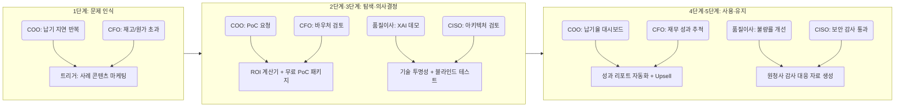

# 핵심 4인 고객 여정 지도 (Customer Journey Map)
## AI 생산 공정 자동화 사업 — 의사결정 단위(DMU) 완전 분석

> **작성 목적**: 최종 선정된 4인의 핵심 페르소나(COO, CFO, 품질이사, CISO)가 우리 솔루션을 처음 인식하는 순간부터 지속 사용하기까지의 전 여정을 단계별로 시각화하여, 각 접점(Touchpoint)에서 우리가 무엇을 해야 하는지 명확히 한다.
> **작성일**: 2026년 4월

---

## 🧭 페르소나 1 — 한성우 (COO / 운영본부장)
### "납기를 사수하는 야전 사령관이 AI를 받아들이기까지"

| **단계** | 고객 행동 | 고객 생각 | 감정 | Pain Point | **우리의 개선 기회** |
| :---: | :--- | :--- | :---: | :--- | :--- |
| **문제 인식** | 또 납기 지연이 발생함. 스케줄 담당자 결근 하루로 공장 전체가 흔들리는 상황 확인. 경영진에게 질책받음 | "이 사람 하나 없으면 공장이 멈추는 구조는 분명히 잘못된 거다. 언제까지 이러고 살 수 없다." | 😤 분노 + 무력감 | 스케줄링 프로세스가 특정 인물의 머릿속에만 존재하여 시스템화 불가. 현황 파악을 위해 일일이 전화를 돌려야 함 | **트리거 콘텐츠**: "중소 제조 납기 지연의 70%는 스케줄러 1인 의존에서 발생합니다" — 사례 기반 문제 정의 글/영상 제공 |
| **탐색** | MES/AI 스케줄링 솔루션 키워드로 검색. 동종 업계 지인에게 "이런 거 쓰는 곳 있나?" 문의. 산업 세미나에 참석함 | "AI 스케줄러를 쓴다는 회사가 실제로 있긴 한 건가? 우리 공장에도 적용이 가능할까? 비용은 얼마나 들지?" | 🤔 기대 반 + 의심 반 | 솔루션마다 사용 언어와 기술 수준이 달라 비교가 어려움. 도입 업체가 우리 공장을 이해하는지 알 수 없음 | **비교 자산**: 업종별(금속/식품/부품) 납품 실적과 스케줄링 성과 비교 1-Pager 제공. "우리 업종 도입 사례"를 SEO 핵심 키워드로 운영 |
| **의사결정** | CEO/CFO에게 도입 필요성 보고용 자료 요청. PoC(개념 검증) 조건을 벤더에게 요구. 내부 반대 의견(IT팀의 "또 새 시스템?") 조율 | "일단 3개월만 써보자고 경영진을 설득할 수 있는 숫자가 필요하다. 실패하면 다 내 책임이다." | 😰 압박 + 조심스러움 | 도입 실패 시 본인이 책임을 지는 구조. CEO와 CFO 모두 설득해야 하는 내부 정치적 장벽. 개념 증명(PoC) 기간과 비용 구조 불투명 | **결재 지원 패키지**: CEO용 '전략 가치 1장 요약', CFO용 'ROI 시뮬레이터', 무료 2주 PoC + 성과 미달성 시 전액 환불 보증 제공 |
| **사용** | AI가 자동 생성한 생산 스케줄과 기존 수동 스케줄을 비교 검토. 현장 반장들의 "이 계획 말이 되냐?" 반발 조율. 첫 납기 준수율 확인 | "오 생각보다 잘 맞는데? 근데 현장이 아직 시스템을 못 믿어서 본인들 경험대로 하려고 하네. 이걸 어떻게 설득하지." | 🎢 기대 + 당혹 (갈등기) | 현장 반장들의 저항. AI가 제시한 스케줄과 현장의 경험 사이의 충돌. 예외 상황(긴급 수주) 처리 방법 미숙지 | **현장 변화 관리**: 배포 초기 2주간 '현장 동행 구축 지원사' 파견. 반장 대상 '왜 AI 스케줄이 맞는가' 설명 자료(비교 데이터) 제공 |
| **유지** | 월간 납기 준수율 대시보드를 경영진 보고서에 포함시킴. 스케줄링 외 자재 발주 자동화 추가 요청. 협력사에 성과 공유 시도 | "이제 아침 회의 시간이 30분 줄었다. 이 시스템으로 자재 발주까지 연동할 수 있다면 진짜 끝내주겠는데." | 😊 안정 + 확장 욕구 | 다음 단계(자재 연동, SCM 연결) 기능 로드맵 불투명. 서비스 비용 증가 시 내부 승인 재요청 필요 | **확장 세일즈(Up-sell)**: 3개월 성과 리포트 자동 제공. 성과 확인 후 '자재 발주 자동화 모듈' 추가 제안. NPS(고객 만족도) 조사 후 레퍼런스 동의 요청 |

---

## 🧭 페르소나 2 — 이재무 (CFO / 재무이사)
### "숫자로 증명되지 않으면 결재하지 않는 파수꾼이 지갑을 여는 순간"

| **단계** | 고객 행동 | 고객 생각 | 감정 | Pain Point | **우리의 개선 기회** |
| :---: | :--- | :--- | :---: | :--- | :--- |
| **문제 인식** | 연간 결산 후 재고 과다 누적과 생산 원가 초과를 확인. COO와의 회의에서 "AI 도입하면 운영비 줄일 수 있다"는 보고를 받음 | "재고가 이렇게 많으면 현금이 묶이는 거잖아. 인건비도 계속 오르는데 어디서 줄일 게 없나." | 📊 냉철한 위기감 | 비효율의 원인은 알지만 어느 항목을 어떻게 줄여야 할지 구체적 수치가 없음. AI 도입이 비용인지 투자인지 분류 기준 불명확 | **트리거 콘텐츠**: "AI 도입 전후 제조 기업의 재고 회전율 변화" 재무 벤치마크 데이터 백서 제공 |
| **탐색** | COO가 가져온 AI 스케줄러 벤더 제안서 검토. 정부 중소기업 AI 바우처 지원 제도 지원 범위 확인. 투자 회수 기간(Payback Period) 계산 시도 | "이 솔루션이 연간 얼마를 아껴주나? 지원금을 어디까지 받을 수 있나? 회수 기간이 2년 이상이면 사인 못 해준다." | 💼 냉정한 검토 | 벤더가 제시하는 ROI 수치가 일반적(Generic)이고, 우리 회사의 재무 구조를 반영하지 않아 신뢰 불가. 정부 바우처의 복잡한 행정 절차 | **재무 맞춤 도구**: 기업 데이터(인건비, 재고, 불량률)를 입력하면 맞춤형 ROI가 나오는 '재무 계산기' 제공. 바우처 신청 대행 서비스 포함 패키지 설계 |
| **의사결정** | 재무 계산기로 시뮬레이션 실행. '정부 바우처 활용 시 자부담 30%' 조건 확인. 최악의 시나리오(실패 시 손실 최소화) 계산 | "바우처 쓰면 실제 우리 자부담은 2,000만 원이네. 이 정도면 실패해도 손실이 크지 않다. 한번 해볼 만하다." | ✅ 조건부 승인 결정 | 바우처 사후 관리 조건 불이행 시 환수 리스크 우려. 회계 처리(자산인지 비용인지) 기준 모호 | **리스크 제거**: 사후 관리 항목 체크리스트 제공. 회계사/세무사 협력 매뉴얼(감가상각 처리 가이드) 제공. 중간 성과 보고서 자동 발행(환수 방어용) |
| **사용** | 월간 운영비 절감 수치 대시보드 모니터링. 재고 자산 변동 추이 추적. 분기 보고서에 AI 도입 효과 항목 추가 | "재고가 실제로 줄어들고 있네. 현금 흐름이 개선되는 게 수치로 나온다. 이거 다음 연봉 협상에 써먹을 수 있겠다." | 📈 만족 + 관심 확장 | 재고 외 다른 항목(품질 불량 비용, 잔업 비용)은 아직 측정이 안 됨. 내부 보고 체계에 AI 성과 지표가 없음 | **성과 가시화**: 분기별 '재무 성과 리포트' 자동 발행. CFO 전용 대시보드(운영비 절감, 재고 회전율, ROI 누적) 공급 |
| **유지** | 연간 계약 갱신 검토 시 ROI 총계 확인. COO의 모듈 추가 요청에 대한 추가 예산 배정 검토 | "올해 투자 대비 효과가 명확하니까 내년에도 계속 쓰는 게 맞다. 추가 모듈도 검토해보자." | 🏦 신뢰 + 파트너십 | SaaS 구독 비용 인상 시 재승인 프로세스 재발동 우려. 여러 부서에서 다른 AI 솔루션 요청이 늘어남 | **장기 계약 유도**: 2년 구독 시 10% 할인 제공. CFO 대상 '전사 AI 통합 운영 비용 효율화' 제안서로 내부 복수 솔루션 통합 기회 모색 |

---

## 🧭 페르소나 3 — 차품질 (품질이사 / 이사)
### "단 한 번의 AI 실수도 용납하지 않는 완벽주의자가 신뢰를 쌓아가는 여정"

| **단계** | 고객 행동 | 고객 생각 | 감정 | Pain Point | **우리의 개선 기회** |
| :---: | :--- | :--- | :---: | :--- | :--- |
| **문제 인식** | 반복되는 공정 이상 후 원인 불명확 불량 발생. 전수 검사 인력이 지쳐서 이직함. 경쟁사가 AI 품질 검사 도입했다는 소문 들음 | "우리는 왜 불량이 나는지 항상 사후에야 알아? 경쟁사는 AI로 미리 잡는다던데 그게 진짜 가능한 건가?" | 😣 조급함 + 불신이 공존 | 불량 원인을 소급 분석하는 데 수일 소요. 사후 대응 중심 구조의 한계. AI가 틀렸을 때 책임 소재 불명확 | **신뢰 콘텐츠**: "AI는 품질 책임자를 대신하지 않습니다 — 사전 징후를 포착해 더 빠른 판단을 돕습니다" 포지셔닝 메시지와 함께 불량 선행 지표 예측 사례 제공 |
| **탐색** | AI 품질 검사 솔루션 학술 자료 및 기술 문서 탐독. 유사 업종 품질팀과 벤치마킹 미팅 요청. 솔루션 데모 신청 | "AI의 정확도가 몇 %나 되나? 잘못 판단한 사례는 없었나? 내가 최종 결정하는 구조인지 먼저 봐야겠다." | 🧐 냉정한 검증 | 솔루션 벤더가 제시하는 정확도(%) 수치를 어떻게 독립적으로 검증할지 모름. 데모가 통제된 환경에서만 진행됨 | **독립 검증 기회**: 실제 고객사 공장 데이터로 진행하는 '현장 블라인드 테스트' 옵션 제공. 오탐(False Positive) 비율과 미탐(False Negative) 비율을 솔직하게 공개 |
| **의사결정** | AI의 판단 근거를 설명해주는 XAI(설명 가능한 AI) 기능 데모 요청. "왜 이 공정이 위험한가"의 인과 관계 데이터 확인. 파일럿 1개 공정 선정 | "AI가 '위험하다'고 하면서 왜 위험한지를 데이터로 보여주는 거면, 내가 최종 판단을 내릴 수 있겠다. 그거면 된다." | ✅ 조건부 신뢰 형성 | 기존 수작업 검사 방식과 AI 결과의 이중 검증 기간 동안 현장 혼란 우려. AI 패키지 도입 후 기존 전수 검사 인력의 업무 변화 저항 | **전환 지원 전략**: 파일럿 기간 중 기존 전수 검사 병행 유지. '이중 검증 결과 비교 리포트' 자동 생성으로 신뢰 축적. 검사 인력 Re-skilling 가이드 제공 |
| **사용** | 특정 공정(고위험 라인)에 AI 이상 감지 알림 적용. 알림 발생 시 직접 현장 확인 후 판단. AI 판단과 본인 판단의 일치율 추적 | "지금까지 3번 알림 받았고 2번은 실제 이상이 맞았다. 1번은 오탐이었는데 원인이 설명됐다. 신뢰도가 올라가고 있다." | 📊 냉정 + 신중한 수용 | 오탐(False Alarm) 발생 시 현장 신뢰도 저하. AI가 자동으로 생산 중단을 결정하는 구조에 대한 근본적 거부 | **통제권 보장 설계**: AI는 절대 단독으로 생산 중단을 결정하지 않음을 시스템 레벨에서 명문화. '알림만 하고 결정은 이사님이' UI 원칙 고수 |
| **유지** | 분기별 불량률 동향 리포트 자동 수신. AI 적용 공정 확대(2개 → 전 공정). 원청사 품질 감사 대응에 AI 로그 데이터 활용 | "원청사 감사 때 이 데이터 보여줬더니 반응이 좋았다. 이제 이 시스템 없으면 감사 맞을 자신이 없다." | 😌 안도 + 의존성 형성 | 전 공정 확대 시 데이터 볼륨 증가로 알림 피로(Alert Fatigue) 우려. 경쟁사가 더 정확한 모델로 교체 제안을 해올 가능성 | **충성도 강화**: 원청사 품질 감사 리포트 자동 생성 기능 추가. 분기별 모델 정확도 개선 결과 공유. 고객사 데이터 기반 전용 Fine-tuning 제공 |

---

## 🧭 페르소나 4 — 최보안 (CISO / 정보보안책임자)
### "'절대 안 된다'는 문지기가 보안 안에서 혁신을 허락하기까지"

| **단계** | 고객 행동 | 고객 생각 | 감정 | Pain Point | **우리의 개선 기회** |
| :---: | :--- | :--- | :---: | :--- | :--- |
| **문제 인식** | 생산팀/DX팀에서 "클라우드 AI 도입하고 싶다"는 요청서를 받음. 보안 가이드라인과 충돌 여부 검토 시작 | "또 클라우드 AI 얘기네. 공장 생산 데이터가 외부 서버에 올라가면 보안 감사에서 바로 지적사항 나온다. 그러면 내 책임이다." | 🚨 즉각적 방어 반응 | 현업의 혁신 요구와 보안 정책 사이에서 악역(방해자)이 되어야 하는 구조적 갈등. 외부 AI 벤더의 보안 기준 충족 여부 검증 체계 부재 | **최초 접근법 전환**: 현업이 아닌 CISO를 첫 미팅 대상으로 설정. "외부망 없이 사내에서 완결되는 AI" 포지셔닝 선제 제시 |
| **탐색** | 폐쇄망(폐쇄 로컬 네트워크) 기반 AI 구현 가능성 검토. 온프레미스(On-premise) AI 아키텍처 기술 문서 요청. 정보보호 인증(ISMS) 관련 리스크 체크 | "온프레미스 AI면 데이터가 안 나가는 거 맞지? 근데 모델 업데이트는 어떻게 하나? 그것도 외부 연결이 필요하면 또 문제다." | 🔍 면밀한 기술 검토 | AI 모델 업데이트·패치시 외부 인터넷 연결 필요 여부. 온프레미스 구축 후 유지 관리 책임 소재. 사내 OT(운영기술) 망과 IT망 분리 원칙 충족 여부 | **기술 투명성 자료**: 망 분리 아키텍처 다이어그램 제공. 업데이트 방식(오프라인 패키지 배포 지원) 설명. ISMS/ISMS-P 준거 체크리스트 자료 제공 |
| **의사결정** | IT 보안 부서 내부 심의 회의 개최. 벤더에게 보안 테스트(모의 해킹, 취약점 점검) 결과 제출 요청. 현업 DX팀과 도입 조건 합의 | "아키텍처상 데이터 외부 반출이 물리적으로 불가능한 구조라면 내가 막을 이유가 없다. 조건부로 허용하겠다." | ✅ 조건부 승인 (정책 준수 확인 후) | 보안 테스트 비용과 일정. 조달 규정에 따른 비인증 벤더 등록 프로세스 기간. 표준 보안 요구사항(망분리, 암호화, 접근제어) 명문화 요구 | **조달 인증 패스트트랙**: 조달청/SMTECH 등록 사전 완료 상태 유지. 보안 적합성 검증 비용 무상 지원. 내부 보안 심의 통과를 위한 기술 PT 동행 서비스 |
| **사용** | 사내 전용 서버에 AI 시스템 설치. 접근 계정 권한 체계 직접 설정. 월 1회 내부 보안 로그 점검 | "설치하고 나서 외부 트래픽 로그를 보니 예상대로 아무것도 나가지 않는다. 지금까진 문제없다. 내가 설정한 대로 움직이고 있어." | 😌 안도 + 경계 유지 | 사용이 늘어날수록 내부 접근 권한 관리 복잡도 증가. 현장에서 개인 스마트폰으로 접근하는 Shadow IT 가능성 | **제어 강화 도구**: 역할 기반 접근 제어(RBAC) 기능 내장. 접속 이력 및 데이터 조회 로그 자동 기록. 이상 접근 감지 알림 기능 기본 제공 |
| **유지** | 반기별 내부 보안 감사 시 AI 시스템 포함 점검. 타 부서에서 추가 AI 도입 요청 시 검토 기준 제공. 신규 보안 규정 개정 시 벤더와 조율 | "이 벤더는 내가 원하는 대로 다 맞춰줬다. 다른 AI 솔루션도 이 회사 제품이면 일단 검토할 것 같다." | 🤝 신뢰 파트너십 형성 | 정부 보안 규정 개정 시 시스템 재검토 비용 발생. 다른 부서가 비공인 AI 솔루션을 개별 도입하는 리스크 | **파트너 포지셔닝**: 보안 정책 개정 대응 업데이트 우선 제공. "전사 AI 통합 보안 관제" 컨설팅으로 CISO를 AI 거버넌스의 핵심 파트너로 격상 |

---

## 💡 4인의 여정 교차 분석: 타이밍과 접점 연계 전략

### 전략적 시사점

*   **COO + CFO는 동시 공략**: COO가 PoC를 요청하는 순간, CFO에게도 ROI 시뮬레이터 제안서를 동시에 보내 내부에서 두 명이 서로를 도와주는 구조를 만든다. 이 둘이 함께 CEO를 설득하게 하는 것이 최단 경로다.
*   **품질이사 + CISO는 별도 설득 트랙으로 운영**: 이 두 명은 기술/보안 중심의 논리로 접근해야 하며, 영업 피치보다 엔지니어링 레벨의 Q&A와 문서 제공이 더 효과적이다.
*   **'사용 → 유지' 구간의 핵심은 수치**: 4인 모두 사용 후 단계에서 "숫자로 보여줘야 계속 쓰겠다"는 공통적 동기를 가진다. **월간/분기별 성과 리포트 자동 발행**은 리텐션의 가장 강력한 무기다.

---
*작성일: 2026년 4월*
*참고 근거: 심층 검증 페르소나 4인 상세 프로파일(20번), Pain 중요도 평가(22번), 대체 솔루션 만족도 평가(23번)*
