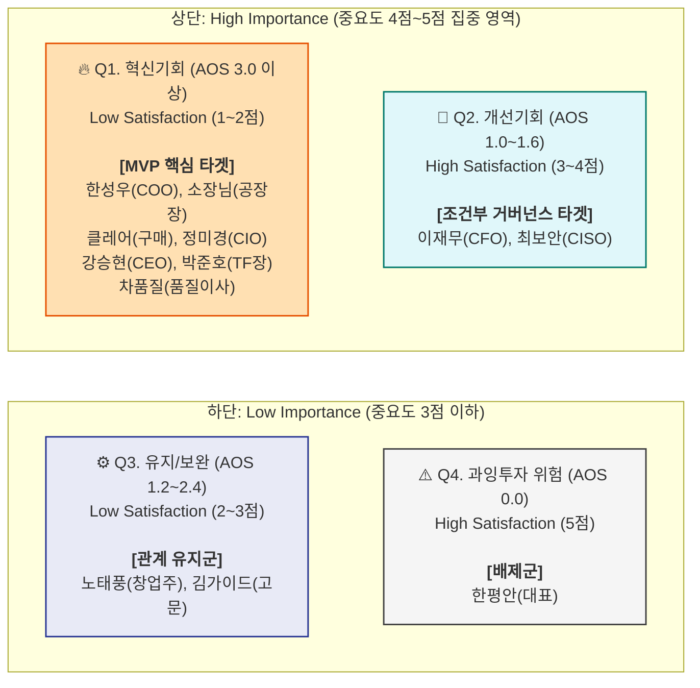

# 시장기회 분석을 위한 OS-AOS 계산 및 매트릭스 시각화
## 12인 페르소나의 Pain/Goal 기반 Adjusted Opportunity Score 산출

> **작성 목적**: 앞서 산출한 고객의 **중요도(Importance, 1~5점)**와 대체 솔루션에 대한 **만족도(Satisfaction, 1~5점)**를 결합하여, 실질적인 혁신 기회 강도를 의미하는 **AOS (Adjusted Opportunity Score)**를 도출하고 시각화한다.  
> **계산 공식**: 제공된 PDF 가이드라인을 엄격히 준수함
> * `AOS = Importance × (1 - Satisfaction / 5)`
> * 점수가 높을수록 시장이 갈구하는(Unmet Need) 강력한 혁신 기회임을 의미

---

## 📊 1. 12인 페르소나 AOS 점수 산출 표 (AOS 내림차순)

| 순위 | 페르소나 (직위) | 핵심 Pain / Goal 요약 | 중요도 (Imp) | 만족도 (Sat) | 1 - (Sat/5) (불충족률) | **AOS 점수** | 전략적 해석 (Insight) |
|:---:|:---|:---|:---:|:---:|:---:|:---:|:---|
| **1** | **Core-02. 한성우 (COO)** | 인적 의존적 스케줄링 / AI 최적화 | 5 | 1 | 0.8 | **4.0** | **[최우선 혁신]** 대안 부재 및 고통 극심. MVP 핵심 타겟 |
| **1** | **Core-04. 소장님 (공장장)** | 현장 입력 거부 / 자동 리포트 | 5 | 1 | 0.8 | **4.0** | **[최우선 혁신]** 실패한 키오스크 하드웨어의 완벽한 반대 제안 필요 |
| **1** | **Adj-02. 클레어 리 (구매)** | 원청사 데이터 실사 / 거래 유지 | 5 | 1 | 0.8 | **4.0** | **[최우선 혁신]** 공급망 데이터는 생존 필수 요소이므로 높은 지불 의사 |
| **4** | **Core-03. 정미경 (CIO)** | 데이터 파편화 / 통합 브릿지 | 4 | 1 | 0.8 | **3.2** | **[주요 혁신]** 대형 SI 투자를 못 하는 상황이므로 가벼운 브릿지로 어필 |
| **5** | **Core-01. 강승현 (CEO)** | 외산 패키지 도입 한계 / 데이터 경영 | 5 | 2 | 0.6 | **3.0** | **[주요 혁신]** 고가 ERP 대비 구축 속도와 비용 우위를 소구 |
| **5** | **Core-05. 박준호 (TF장)** | 자체 개발 정체 / Quick-Win | 5 | 2 | 0.6 | **3.0** | **[주요 혁신]** 자체 개발보다 빠르고 안전하다는 '결과 시뮬레이션' 보장 |
| **5** | **Ext-02. 차품질 (품질이사)**| 전수 검사 비효율 / 사전 징후 포착 | 5 | 2 | 0.6 | **3.0** | **[주요 혁신]** 인건비 낭비를 막는 설명가능한 AI(XAI)로 설득 필요 |
| **8** | **Ext-01. 노태풍 (창업주)** | 저가 MES 무용지물 / 유산 승계 | 4 | 2 | 0.6 | **2.4** | **[부분 혁신]** 감정적 허들이므로, 기능보다 시스템의 '친숙함'이 중요 |
| **9** | **Adj-01. 이재무 (CFO)** | 뜬구름 잡는 예산 / Opex 절감 | 4 | 3 | 0.4 | **1.6** | **[개선 기회]** 기존 반려 방식으로 방어 중이나, 바우처 제공 시 즉시 전환 |
| **10**| **Adj-03. 김가이드 (고문)** | 위험한 AI 벤더 / 평판 방어 | 3 | 3 | 0.4 | **1.2** | **[유지 보완]** 직접 고통보다 기회 손실 수준이므로 성공 레퍼런스 후 접근 |
| **11**| **Non-01. 최보안 (CISO)** | SaaS 절대 금지 / 100% 보안 | 5 | 4 | 0.2 | **1.0** | **[조건부 진입]** 폐쇄망 기술(구축형) 미지원 시, 혁신 대상이 아님 |
| **12**| **Non-02. 한평안 (대표)** | 변화 거부 / 현상 유지 | 2 | 5 | 0.0 | **0.0** | **[진입 배제]** 현재에 만족하므로 에너지 투입 불필요 |

---

## 📈 2. AOS 혁신 기회 매트릭스 4분면 기준 및 시각화

### 🔍 사분면 상하·좌우 분류 기준 (Threshold Criteria)
제공된 매트릭스 구획 방법에 따라, **전체 평균(데이터 분포 기반)**을 통해 사분면을 분류했습니다.

*   **Y축 상·하단 기준 (Importance)**:
    *   기준점: 점수 3.0을 초과하거나 전체 평균(약 4.4점) 이상인 경우 **'상단(High Importance)'** 배치.
    *   우리의 핵심 페르소나는 문제 자체가 생존과 직결되어 있어 대부분 상단(중요도 4~5점) 점수를 확보함.
*   **X축 좌·우측 기준 (Satisfaction)**:
    *   기준점: 점수 3.0 미만인 경우 **'좌측(Low Satisfaction)'**, 3.0 이상인 경우 **'우측(High Satisfaction)'** 배치.
*   **AOS 분류 (색상/전략 점수 기준)**:
    *   **Q1 (혁신기회)**: High AOS (보통 2.5 이상 영역) — 솔루션 기획 우선순위 1순위
    *   **Q2 (개선기회)**: 중간 AOS (1.0 \~ 2.4 영역) — 핀포인트 개선 또는 전략적 우회 반경
    *   **Q3 (유지보완)**: Low AOS — 마케팅 최적화 중심
    *   **Q4 (과잉투자)**: AOS 0 근처 — 매몰 비용 경계 대상

### 🧩 Flowchart 기반 매트릭스 구조도 (표준)

---

## 💡 3. 데이터 기반 전략적 분석 (Insight)

1. **초핵심 기회 영역 (AOS 4.0 클럽)**
   * **COO(생산), 공장장(현장), 클레어리(구매/공급망)** 이 3명은 중요도가 매우 높음에도 대안 솔루션은 완전히 고장난 상태(Sat=1점)입니다.
   * 이는 현장에서 "돈은 얼마가 들어도 좋으니 이 지옥 같은 스케줄링, 데이터 수집 전쟁, 거래처 닦달에서 제발 벗어나게 해달라"는 강렬한 신호입니다. 이들의 고통을 연결한 **"수기 입력 없는 자동화 브릿지"**가 우리 MVP의 척추가 되어야 합니다.

2. **개선 및 전략적 우회 반경 (AOS 2.0 이하)**
   * 최보안(CISO)이나 이재무(CFO)는 AOS 수치만 보면 1점대로 낮아 중요하지 않아 보일 수 있습니다. 하지만 이는 **"기존 방식(도입 차단, 예산 반려)으로 본인들의 문제를 꽤 잘 방어하고 있기 때문(만족도 3~4점)"**입니다.
   * 따라서 이들은 혁신으로 설득할 대상이라기보다, **비즈니스 모델(무료 PoC, 바우처)과 인프라 요건(온프레미스 지원)**을 통해 그들의 방어막을 훼손하지 않으면서 우회 통과시켜야 하는 '거버넌스 그룹'으로 취급해야 합니다.

**결론적으로 우리의 타겟팅 자원은 혁신기회사분면(Top-Left)에 몰려있는 Core 그룹에 80% 이상 전면 투입해야 하며, 그 길고 좁은 관문을 여는 열쇠는 '현장의 무입력 자동화'에 있습니다.**
