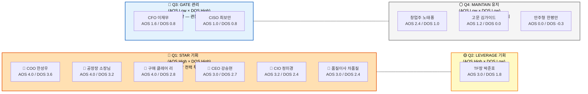

# AOS × DOS 통합 시장 기회 분석 리포트
## AI 생산 공정 자동화 SI/SaaS — 12인 페르소나 기반 최종 전략 보고서

> **작성 목적**: AOS(개인 Pain 기반 기회점수)와 DOS(시장 규모 가중 기회점수)를 통합하여, "고객이 아파하는가?" + "시장이 충분히 큰가?" 두 축의 교차 분석으로 자원 배분의 최적 의사결정을 도출한다.  
> **핵심 질문**: *어느 Pain을 가장 먼저, 가장 깊이 해결해야 MVP가 팔리는가?*  
> **작성일**: 2026년 4월

---

## Part 1. 산출 방법론 — AOS & DOS 공식 정의

### 1-1. AOS (Adjusted Opportunity Score)

> **출처**: Tony Ulwick의 Outcome-Driven Innovation(ODI) 방법론 변형 적용

```
AOS = Importance × (1 - Satisfaction / 5)
```

| 변수 | 정의 | 척도 |
|------|------|------|
| **Importance** | 해당 Pain이 Goal 달성에 미치는 치명도 | 1 (무관) ~ 5 (치명적) |
| **Satisfaction** | 현재 대체 솔루션에 대한 고객 만족도 | 1 (완전 실패) ~ 5 (완전 만족) |
| **1 - Sat/5** | 불충족률 — 현재 솔루션이 얼마나 못 해결하고 있는가 | 0.0 ~ 1.0 |
| **AOS 최대값** | 5점 (Imp=5, Sat=1일 때) | — |

**해석 기준**:
- AOS ≥ 3.0 → **최우선 혁신 기회** (MVP 핵심 기능으로 직결)
- AOS 2.0 ~ 2.9 → **주요 혁신 기회** (로드맵 2단계 우선 배치)
- AOS 1.0 ~ 1.9 → **조건부 개선** (거버넌스/우회 설계 필요)
- AOS < 1.0 → **진입 불가 또는 배제** (자원 투입 중단)

---

### 1-2. DOS (Discovered Opportunity Score)

> **출처**: Clayton Christensen의 JTBD(Jobs-to-be-Done) 이론 + 시장 가중치 결합

```
DOS = (Importance - Satisfaction) × Market Relevance
```

| 변수 | 정의 | 척도 |
|------|------|------|
| **Importance** | Pain의 치명도 (AOS와 동일) | 1 ~ 5 |
| **Satisfaction** | 대체 솔루션 만족도 (AOS와 동일) | 1 ~ 5 |
| **Market Relevance** | 잠재 시장 규모 × 성장률 × 확산 용이성을 종합한 시장 접근성 | 0.1 ~ 1.0 |
| **DOS 최대값** | 4.0 (Imp=5, Sat=1, MR=1.0일 때) | — |

**해석 기준**:
- DOS ≥ 3.0 → **시장 킬러 기회** (전사 전략 수준의 집중 투자)
- DOS 2.0 ~ 2.9 → **고성장 기회** (타깃 캠페인 및 전문화)
- DOS 1.0 ~ 1.9 → **전략적 틈새** (특정 고객군 집중)
- DOS < 1.0 → **시장 한계** (수익화 어렵거나 공략 의미 없음)

---

### 1-3. AOS vs DOS 관점의 차이

| 항목 | AOS | DOS |
|------|-----|-----|
| **초점** | 개인(페르소나)의 Pain 강도 | 시장 전체의 사업화 가능성 |
| **강점** | 고객 공감 메시지, 세일즈 우선순위 결정 | 비즈니스 모델, 투자 규모, GTM 전략 결정 |
| **약점** | 시장 크기를 반영하지 못함 | 개인의 감정·저항을 반영하지 못함 |
| **함께 쓰면** | "누가 아프냐" + "얼마나 큰 시장이냐" → 최적 진입 타겟 결정 | |

---

## Part 2. AOS 산출 근거 — 12인 원점수 및 계산 결과

### 2-1. 입력 데이터

| 구분 | 페르소나 | 핵심 Pain | 대체 솔루션 현황 | Imp | Sat |
|------|----------|-----------|-----------------|:---:|:---:|
| Core-01 | 강승현 (CEO) | 껍데기뿐인 스마트공장, 상장 IR 수치 없음 | SAP 등 고가 패키지 검토 중단(비용 과다) | 5 | 2 |
| Core-02 | 한성우 (COO) ★ | 스케줄러 1인 의존 → 부재 시 공장 마비 | 전담 인력 추가 채용 시도 → 실패 | 5 | 1 |
| Core-03 | 정미경 (CIO) | MES·ERP 사일로 → AI 시작 불가 | 15억+ SI 전면 개편 견적 → 락인 | 4 | 1 |
| Core-04 | 소장님 (공장장) | 현장 데이터 입력 거부 → 원천 데이터 단절 | 키오스크 설치 → 무용지물(먼지만 쌓임) | 5 | 1 |
| Core-05 | 박준호 (TF장) | PoC 실패 시 커리어 타격, 3개월 수치 압박 | 내부 IT 자체 개발 → 진척 0% | 5 | 2 |
| Adj-01 | 이재무 (CFO) | 재무 근거 없는 예산안 → 결재 불가 | 예산 반려 후 아날로그 유지 | 4 | 3 |
| Adj-02 | 클레어 리 (구매) | 공급망 실사 → 데이터 없어 거래 단절 위협 | 수기 엑셀 급조 → 한계 도달 | 5 | 1 |
| Adj-03 | 김가이드 (고문) | 추천 실패 시 평판 파괴 | 검증된 벤더 배제 → 기회 손실 | 3 | 3 |
| Ext-01 | 노태풍 (창업주) | 30년 직관이 AI에 부정당한다는 분노 | 저가 MES 설치 후 미사용 | 4 | 2 |
| Ext-02 | 차품질 (품질이사) | AI 블랙박스 → 불량 클레임 공포 | 사후 100% 전수 검사 → 인건비 낭비 | 5 | 2 |
| Non-01 | 최보안 (CISO) | 클라우드 유출 → 정책적 절대 차단 | 폐쇄망 100% 고수(현재 KPI 달성) | 5 | 4 |
| Non-02 | 한평안 (대표) | 변화 자체 거부 → 현상 유지 집착 | 혁신 시도 없음, 현행 영업 유지 | 2 | 5 |

### 2-2. AOS 계산 결과 (내림차순)

| 순위 | 페르소나 | Imp | Sat | 불충족률 | **AOS** | 사분면 |
|:---:|----------|:---:|:---:|:-------:|:-------:|:------:|
| 1 | **한성우 (COO)** | 5 | 1 | 0.80 | **4.00** | Q1 🔥 |
| 1 | **소장님 (공장장)** | 5 | 1 | 0.80 | **4.00** | Q1 🔥 |
| 1 | **클레어 리 (구매)** | 5 | 1 | 0.80 | **4.00** | Q1 🔥 |
| 4 | **정미경 (CIO)** | 4 | 1 | 0.80 | **3.20** | Q1 🔥 |
| 5 | **강승현 (CEO)** | 5 | 2 | 0.60 | **3.00** | Q1 🔥 |
| 5 | **박준호 (TF장)** | 5 | 2 | 0.60 | **3.00** | Q1 🔥 |
| 5 | **차품질 (품질이사)** | 5 | 2 | 0.60 | **3.00** | Q1 🔥 |
| 8 | **노태풍 (창업주)** | 4 | 2 | 0.60 | **2.40** | Q3 ⚙️ |
| 9 | **이재무 (CFO)** | 4 | 3 | 0.40 | **1.60** | Q2 💎 |
| 10 | **김가이드 (고문)** | 3 | 3 | 0.40 | **1.20** | Q3 ⚙️ |
| 11 | **최보안 (CISO)** | 5 | 4 | 0.20 | **1.00** | Q2 💎 |
| 12 | **한평안 (대표)** | 2 | 5 | 0.00 | **0.00** | Q4 ⚠️ |

---

## Part 3. DOS 산출 근거 — Pain × 시장가중치 계산 결과

### 3-1. Market Relevance 산정 기준

| Market Relevance | 정의 | 해당 기업군 |
|:----------------:|------|------------|
| **0.9 ~ 1.0** | 국내 수만 개 이상 기업이 동일 Pain 보유. 정부 정책과 연계 강함 | 전국 중소 제조업 전반 |
| **0.7 ~ 0.8** | 특정 산업군 전체 또는 성장 트렌드와 정렬 | 수출 제조, 식품·전자부품 |
| **0.5 ~ 0.6** | 중견기업 이상 특화 또는 조직 구조 조건 필요 | 그룹사 TF, 가업 승계 기업 |
| **0.1 ~ 0.4** | 극소 모집단 또는 영업 불가 집단 | 안주형 소기업, 극단 저항자 |

### 3-2. DOS 계산 결과 (내림차순)

| 순위 | Pain 영역 (대표 페르소나) | Imp | Sat | Imp-Sat | MR | **DOS** |
|:---:|--------------------------|:---:|:---:|:-------:|:--:|:-------:|
| 1 | 인적 스케줄링 탈피 **(COO)** | 5 | 1 | 4 | 0.90 | **3.60** |
| 2 | 현장 무입력 자동 리포트 **(공장장)** | 5 | 1 | 4 | 0.80 | **3.20** |
| 3 | 공급망 데이터 실사 증명 **(구매)** | 5 | 1 | 4 | 0.70 | **2.80** |
| 4 | 저비용 데이터 경영 실현 **(CEO)** | 5 | 2 | 3 | 0.90 | **2.70** |
| 5 | 시스템 교체 없는 데이터 통합 **(CIO)** | 4 | 1 | 3 | 0.80 | **2.40** |
| 5 | XAI 기반 사전 품질 이상 탐지 **(품질이사)** | 5 | 2 | 3 | 0.80 | **2.40** |
| 7 | 3개월 Quick-Win 수치 창출 **(TF장)** | 5 | 2 | 3 | 0.60 | **1.80** |
| 8 | 1세대 오너 노하우 유산화 **(창업주)** | 4 | 2 | 2 | 0.50 | **1.00** |
| 9 | Opex 절감 + 바우처 매칭 **(CFO)** | 4 | 3 | 1 | 0.80 | **0.80** |
| 9 | 클라우드 보안 완전 차단 **(CISO)** | 5 | 4 | 1 | 0.80 | **0.80** |
| 11 | 검증된 파트너 소개 **(고문)** | 3 | 3 | 0 | 0.70 | **0.00** |
| 12 | 현상 유지 완전 만족 **(안주형대표)** | 2 | 5 | -3 | 0.10 | **-0.30** |

---

## Part 4. AOS × DOS 통합 분석표

> **통합 해석**: AOS는 "고객이 얼마나 아프냐", DOS는 "그 아픔이 얼마나 큰 시장이냐"를 나타낸다. 두 점수가 모두 높으면 **즉각 투자해야 할 킬러 기회**, 하나만 높으면 **맞춤 전략 필요**.

| 페르소나 | AOS | DOS | AOS 순위 | DOS 순위 | **통합 등급** | 전략 레이블 |
|----------|:---:|:---:|:--------:|:--------:|:------------:|------------|
| **한성우 (COO)** | **4.00** | **3.60** | 1 | 1 | ★★★★★ | 🎯 **킬러 기회 #1** |
| **소장님 (공장장)** | **4.00** | **3.20** | 1 | 2 | ★★★★★ | 🎯 **킬러 기회 #2** |
| **클레어 리 (구매)** | **4.00** | **2.80** | 1 | 3 | ★★★★☆ | 🎯 **고성장 기회** |
| **강승현 (CEO)** | **3.00** | **2.70** | 5 | 4 | ★★★★☆ | 🔥 **전략적 확장** |
| **정미경 (CIO)** | **3.20** | **2.40** | 4 | 5 | ★★★★☆ | 🔥 **전략적 확장** |
| **차품질 (품질이사)** | **3.00** | **2.40** | 5 | 5 | ★★★★☆ | 🔥 **전략적 확장** |
| **박준호 (TF장)** | **3.00** | **1.80** | 5 | 7 | ★★★☆☆ | 💡 **틈새 집중** |
| **노태풍 (창업주)** | **2.40** | **1.00** | 8 | 8 | ★★☆☆☆ | ⚙️ **감성 우회** |
| **이재무 (CFO)** | **1.60** | **0.80** | 9 | 9 | ★★☆☆☆ | 💎 **관문 해제** |
| **최보안 (CISO)** | **1.00** | **0.80** | 11 | 9 | ★★☆☆☆ | 💎 **인프라 관문** |
| **김가이드 (고문)** | **1.20** | **0.00** | 10 | 11 | ★☆☆☆☆ | 📣 **채널 파트너** |
| **한평안 (대표)** | **0.00** | **-0.30** | 12 | 12 | ☆☆☆☆☆ | ⚠️ **배제** |

---

## Part 5. AOS vs DOS 기회 포트폴리오 — 사분면 시각화

### 5-1. 사분면 기준선

| 축 | 기준값 | 의미 |
|----|:------:|------|
| **X축 (AOS)** | **2.5** | 개인 Pain 미충족 강도 |
| **Y축 (DOS)** | **2.0** | 시장 규모 가중 기회 크기 |

### 5-2. Flowchart 기반 사분면 모델



---

### 5-3. XY 산점도 텍스트 시각화 (AOS × DOS)

```
DOS
(시장가중 기회)
4.0 │
    │
3.6 │ ★COO(4.0,3.6)
    │
3.2 │                ★공장장(4.0,3.2)
    │
2.8 │                              ★클레어(4.0,2.8)
    │
2.7 │                                      ★CEO(3.0,2.7)
    │──────────────────────────────────────────── DOS 기준선(2.0)
2.4 │                       ★CIO(3.2,2.4)  ★품질(3.0,2.4)
    │
1.8 │                                             ◆TF장(3.0,1.8)
    │
1.0 │         ◇창업주(2.4,1.0)
    │──────────────────────────────────────────── DOS 기준선 하단
0.8 │ ▲CFO(1.6,0.8)  ▲CISO(1.0,0.8)
    │
0.0 │ ▽고문(1.2,0.0)
    │
-0.3│ ✕한평안(0.0,-0.3)
    └─────────────────────────────────────────────────────────▶
    0.0  0.5  1.0  1.5  2.0  2.5  3.0  3.5  4.0  4.5  AOS
                                          ↑
                                    AOS 기준선(2.5)

범례: ★=Q1(Star) ◆=Q2(Leverage) ▲=Q3(Gate) ◇=Q4(Maintain) ✕=배제
```

---

## Part 6. 사분면별 전략 처방 (Quadrant Strategy)

### 🔴 Q1 STAR — COO·공장장·클레어·CEO·CIO·품질이사 (6명)
> **"자원의 80%를 여기에 쏟아라"**

| 페르소나 | AOS | DOS | 핵심 MVP 기능 | 세일즈 메시지 |
|----------|:---:|:---:|--------------|--------------|
| COO 한성우 | 4.0 | 3.6 | AI 생산 스케줄러 | "스케줄러 1인 없어도 공장 돌아간다" |
| 공장장 소장님 | 4.0 | 3.2 | 무입력 자동 리포팅 | "현장에서 아무도 타이핑 안 해도 보고서 완성" |
| 클레어 리 | 4.0 | 2.8 | 생산 이력 추적 | "원청사 실사 요청 오기 전에 데이터 준비 완료" |
| CEO 강승현 | 3.0 | 2.7 | 전사 AX 대시보드 | "코스닥 IR에서 쓸 수 있는 AI 전환 수치" |
| CIO 정미경 | 3.2 | 2.4 | ERP·MES 브릿지 | "시스템 1개도 바꾸지 않고 데이터 연동" |
| 품질이사 차품질 | 3.0 | 2.4 | XAI 이상 탐지 | "AI가 왜 이 경보를 눌렀는지 근거 데이터 제공" |

**실행 액션**:
1. COO + 공장장 Pain을 해결하는 **AI 스케줄러 + 자동 리포팅 PoC 패키지** 30일 무료 제공
2. 클레어 리 Pain을 위한 **공급망 데이터 이력 모듈** 수출기업 타깃 별매 패키지 구성
3. CEO·CIO·품질이사에게는 위 PoC 성과를 기반으로 **전사 확장 2단계 계약** 전환

---

### 🟡 Q2 LEVERAGE — TF장 박준호 (1명)
> **"규모는 작지만 관문을 열면 대형 계약으로 폭발한다"**

- AOS 3.0으로 Pain은 뚜렷하지만 DOS 1.8로 타깃 모집단이 좁음(중견기업 TF 보직)
- **전략**: PoC 성과 KPI를 계약 전 확정하고, 3개월 내 수치를 경영진 보고 자료로 포장해 주는 "TF 전용 성과 리포트 자동 생성" 기능 제공
- 성공 시 → 그룹사 전체 전사 계약으로 **10배 레버리지** 가능

---

### 🔵 Q3 GATE — CFO·CISO (2명)
> **"직접 설득 금지. 방어막을 건드리지 않는 우회로를 설계하라"**

| 페르소나 | AOS | DOS | 현재 방어 방식 | 우회 전략 |
|----------|:---:|:---:|--------------|----------|
| CFO 이재무 | 1.6 | 0.8 | 예산 반려 | 정부 바우처 연계 → 자부담 30% 이하 구조 설계 |
| CISO 최보안 | 1.0 | 0.8 | 클라우드 전면 차단 | On-premise 아키텍처 선제 제시 + 보안정책 준수 확인서 |

> ⚠️ **함정 주의**: 이들의 낮은 DOS 점수를 "중요하지 않다"고 해석하면 안 된다. 이들은 Q1의 계약이 최종 성사되는 단계에서 단독으로 거부권을 행사할 수 있는 **"침묵의 거부자"**다. Q1 기회를 실현하기 위한 필수 통과 조건으로 취급해야 한다.

---

### ⚪ Q4 MAINTAIN — 창업주·고문·안주형 대표 (3명)
> **"에너지를 소진하지 말고 관계와 채널만 유지하라"**

| 페르소나 | 접근 방식 |
|----------|----------|
| 노태풍 (창업주) | CEO를 통한 우회. "AI = 30년 노하우 디지털 유산화" 재프레이밍. 기능이 아닌 정체성 소구 |
| 김가이드 (고문) | 공식 파트너 프로그램 등록. 성공 레퍼런스 공유 → 추천 인센티브 설계 |
| 한평안 (대표) | 직접 영업 완전 배제. 외부 충격(원청사 요구, 규제 변화) 발생 시 즉각 재접근 대기 |

---

## Part 7. 최종 전략 결론

### 7-1. 핵심 발견 3가지

**① "스케줄링과 현장 자동화"가 이 사업의 척추다**

AOS와 DOS 두 지표에서 모두 최고 순위를 기록한 Pain은 단 하나:  
**"사람의 머릿속에 갇힌 생산 스케줄링"** (COO, DOS 3.6 / AOS 4.0)

이 Pain을 해결하는 AI 스케줄러가 MVP의 중심에 있지 않으면,  
나머지 기능은 모두 의미를 잃는다.

---

**② "클레어 리(글로벌 구매)"는 숨겨진 시장 진입 파이프라인이다**

AOS 4.0의 극강 미충족 상태이면서 글로벌 규제(ESG, 공급망 실사)라는 외부 추진력이 강하다.  
수출 제조기업을 타깃으로 "공급망 데이터 컴플라이언스" 패키지를 별도 GTM으로 운영하면,  
COO/공장장 Pain과 함께 풀 수 있는 **이중 진입 경로**가 확보된다.

---

**③ CFO와 CISO는 "관문"이지 "기회"가 아니다 — 전략적 혼동 주의**

두 사람의 낮은 DOS (0.8)를 보고 "중요하지 않다"고 판단하는 것은 치명적 실수다.  
이들은 혁신 수요자가 아니라 **"계약 최종 허가권자"**다.  
Q1 기회(COO, 공장장 등)를 실현하려면 Q3 관문(CFO 바우처, CISO On-premise)을  
반드시 통과해야 하며, 이를 위한 제품·계약 설계가 영업 이전에 완료되어야 한다.

---

### 7-2. 자원 배분 가이드라인

| 구분 | 배분 비중 | 대상 | 목적 |
|------|:--------:|------|------|
| **MVP 개발** | 60% | Q1: COO·공장장·클레어·CEO·CIO·품질이사 | 핵심 Pain 해결 기능 구현 |
| **인프라/정책 대응** | 20% | Q3: CFO·CISO | 거버넌스 통과 장치 설계 |
| **GTM/영업** | 15% | Q1+Q2: 위 6인 + TF장 | PoC 세일즈, 사례 생성 |
| **채널/관계** | 5% | Q4: 고문 파트너 프로그램 | 레퍼런스 기반 소개 채널 |

---

### 7-3. 단계별 실행 로드맵

```
Phase 1 (0~3개월): PoC 성과 창출
├── COO(한성우) AI 스케줄러 30일 PoC → 납기 준수율 수치화
├── 공장장(소장님) 자동 리포팅 파일럿 → 현장 수용성 검증
└── CFO용 바우처 설계서 + CISO용 On-premise 아키텍처 사전 제출

Phase 2 (3~6개월): 계약 전환 및 확장
├── PoC 성과 기반 COO → CEO → CFO → CISO 순차 설득
├── TF장(박준호) Quick-Win 성과 임원 보고서 패키지 지원
└── 클레어 리 공급망 데이터 이력 모듈 수출기업 GTM 론칭

Phase 3 (6~12개월): 레퍼런스 기반 확산
├── 성공 사례 기반 김가이드(고문) 파트너 채널 공식화
├── 품질이사(차품질) XAI 모듈 제조 품질 특화 패키지 출시
└── CIO(정미경) 데이터 브릿지 확장 → 전사 대시보드 업그레이드
```

---

### 7-4. 한 줄 전략 결론

> **"COO와 공장장의 고통을 AI 스케줄러와 무입력 자동화로 해결하는 것이 이 사업의 첫 번째 단추다. 그 단추가 채워져야 CFO의 지갑이 열리고, CISO의 도장이 찍히며, CEO의 상장 스토리가 완성된다."**

---

## 부록 A. AOS × DOS 순위 불일치 분석 (주목할 케이스)

| 케이스 | AOS 순위 | DOS 순위 | 격차 원인 | 전략적 시사 |
|--------|:--------:|:--------:|----------|------------|
| **클레어 리 (구매)** | 1위 | 3위 | MR=0.7 — 글로벌 수출기업 한정, 모집단 다소 협소 | 수출기업 특화 GTM으로 집중 공략 |
| **강승현 (CEO)** | 5위 | 4위 | MR=0.9 — CEO Pain은 시장 파급력이 큰 보편적 이슈 | CEO 메시지는 브랜딩 채널(세미나, PR)로 확산 |
| **박준호 (TF장)** | 5위 | 7위 | MR=0.6 — TF 보직은 중견기업 이상에만 존재 | 타깃 좁지만 TF 성공 시 전사 계약 레버리지 활용 |
| **최보안 (CISO)** | 11위 | 9위 | MR=0.8로 시장은 크나, 현재 방어 완벽(Sat=4) | On-premise 제품 준비 여부가 수주 자체를 결정 |

---

## 부록 B. 경쟁사 대비 기회 공백 분석 (White Space)

| 기회 영역 | 현재 시장 대안 | 대안의 한계 | 우리의 차별점 |
|-----------|--------------|------------|--------------|
| AI 스케줄링 | SAP PP, 전담 인력 | 비용 과다 / 인력 의존 반복 | 중견기업 특화 경량 AI, 즉시 도입 |
| 현장 자동 로깅 | 키오스크, 태블릿 | 현장 거부로 무용지물 | 카메라·음성 기반 비접촉 자동 수집 |
| 공급망 데이터 | 수기 엑셀 급조 | 신뢰성·실시간성 없음 | MES 연동 실시간 이력 자동 생성 |
| On-premise AI | 없음 (거의 전무) | 대부분 SaaS Only | 하이브리드 배포 기본 옵션 제공 |
| XAI 품질 감시 | 전수 검사 인해전술 | 원인 분석 불가 | 판단 근거 시각화 + 이상 사전 탐지 |

---

*작성일: 2026년 4월*  
*기반 파일: 18·19·20·22·23·24·25.2·26번 페르소나 시리즈*  
*방법론 출처: 7_OS-AOS-DOS 계산 방법 PDF 가이드라인*
