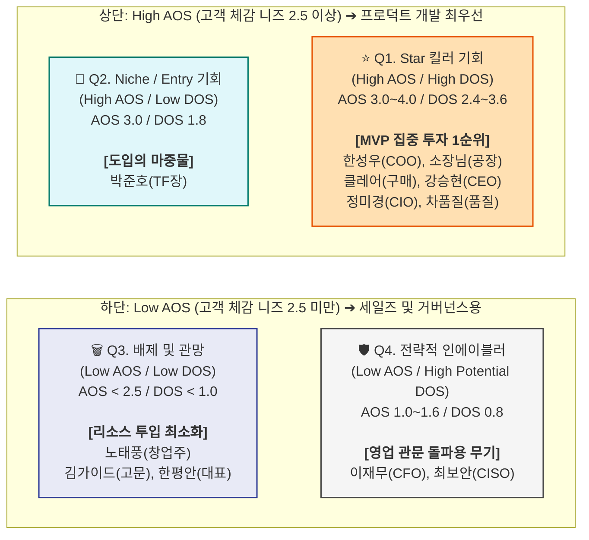

# AOS & DOS 통합 시장 기회 분석 리포트
## 고객 니즈와 시장 파급력을 결합한 B2B AI 제조 자동화 전략 포트폴리오

> **작성 목적**: 고객 개인의 고통 크기(AOS)와 시장 전체의 확장성 및 파급력(DOS)을 통합 분석하여, 신뢰할 수 있는 개발 우선순위(MVP)와 GTM(Go-to-Market) 전략을 도출한다.
> **작성일**: 2026년 4월

---

## 1. 산출 근거 및 프레임워크 정의

본 분석은 VC(벤처캐피털) 및 프로덕트 매니저들이 시장 기회를 정량화할 때 사용하는 표준 프레임워크를 차용했습니다.

*   **AOS (Adjusted Opportunity Score) - "고객이 얼마나 절박한가?"**
    *   `공식: Importance × (1 - Satisfaction / 5)`
    *   **의미**: 특정 페르소나 1명이 겪는 문제의 치명도. 기능 기획(UX/UI)의 기준이 됨.
*   **DOS (Discovered Opportunity Score) - "이 문제가 시장에서 얼마나 돈이 되는가?"**
    *   `공식: (Importance - Satisfaction) × Market Relevance`
    *   **의미**: 해당 문제가 잠재 시장(TAM) 내에서 차지하는 비중, 확산성, 지불 의사를 모두 가중한 실질적 사업 기회. BM(비즈니스 모델)과 영업 전략의 기준이 됨.

---

## 2. AOS - DOS 통합 분석표 (AOS 내림차순 정렬)

| 페르소나 (직위) | 핵심 Pain / Goal 요약 | AOS (니즈) | DOS (시장가치) | 기회 성격 분류 (Opportunity Type) |
| :--- | :--- | :---: | :---: | :--- |
| **한성우 (COO)** | 인적 의존적 스케줄링 탈피 | **4.0** | **3.6** | **Star (절대적 핵심 기회)**: 수요와 폭발력 모두 1위. MVP 중심 |
| **소장님 (공장장)** | 현장 입력 없는 자동 리포트 | **4.0** | **3.2** | **Star (절대적 핵심 기회)**: 저항 극복의 열쇠. 자동 로깅 필수 |
| **클레어 (구매)** | 거래 연장을 위한 제조 데이터 증명 | **4.0** | **2.8** | **Star (수출형 타겟 전략 기회)**: 공급망 ESG 실사 대응 |
| **정미경 (CIO)** | 시스템 교체 없는 데이터 브릿지 | **3.2** | **2.4** | **Star (인프라 기회)**: 대규모 SI의 대안 (API/커넥터) |
| **강승현 (CEO)** | 외산 패키지 대비 가벼운 AI 경영 | **3.0** | **2.7** | **Star (의사결정 기회)**: 저비용 고효율이라는 경영 어필 |
| **차품질 (품질)** | 블랙박스 탈피, 사전 징후 XAI | **3.0** | **2.4** | **Star (품질 특화 기회)**: 신뢰 임계점을 넘기 위한 필수 요건 |
| **박준호 (TF장)** | 3개월 내 가시적 Quick-Win 성과 | **3.0** | **1.8** | **Niche (초기 진입창구)**: 모수는 적으나 레퍼런스용으로 적합 |
| **노태풍 (창업주)** | 직관의 유산화 (저저항 시스템) | **2.4** | **1.0** | **Low (유지/관망)**: 마케팅 언어적 포장으로 대응 |
| **이재무 (CFO)** | ROI 기반 예산 승인 (바우처 활용) | **1.6** | **0.8** | **Enabler (도입 방어 돌파)**: 영업 시 방패막이 뚫기용 |
| **최보안 (CISO)** | 외부망 차단, 온프레미스 AI | **1.0** | **0.8** | **Enabler (도입 방어 돌파)**: 보안 클리어런스 무기 |
| **김가이드 (고문)** | 검증된 성공 파트너 발굴 | **1.2** | **0.0** | **Low (2차 파이프라인)**: 당장 집중할 타겟 아님 |
| **한평안 (대표)** | 변화 거부 (현상 유지) | **0.0** | **-0.3** | **Drop (배제)**: 에너지 낭비 금지 |

---

## 3. AOS vs DOS 기회 포트폴리오 시각화 (Quadrant Matrix)

본 매트릭스는 **X축을 시장 파급력(DOS)**, **Y축을 고객 체감 니즈(AOS)**로 설정하여, 기능 개발과 영업 리소스의 투입 우선순위를 시각화한 표준 Flowchart 모델입니다. 
*(기준선: AOS 2.5 / DOS 2.0)*

> **Q4 사분면(우측 하단) 해석 주의**: CISO와 CFO의 경우 산술적인 DOS 점수는 낮게 나왔으나, 이는 이들이 느끼는 "고통(Pain)"이 낮기 때문입니다. 하지만 이들이 막고 있는 예산과 보안이라는 댐을 무너뜨리면 풀려나오는 시장 파급력(Relevance 0.8)은 거대합니다. 따라서 Q4는 기능적 혁신이 아니라 '영업적 무기'로서 우측(High Potential DOS)에 배치했습니다.

---

## 4. 최종 전략 결론 및 GTM(Go-to-Market) 실행 로드맵

통합 분석 결과, 중소·중견 제조 AI 자동화 시장의 승패는 **"결제권자들의 방패(Q4)를 뚫고, 실무자들의 폭발적 수요(Q1)를 가장 빠른 시간 내에 구축해 내는 것"**에 달려 있습니다. 이를 기반으로 한 3단계 실행 로드맵을 제안합니다.

### 🚩 Phase 1: 랜딩 및 침투 (0~3개월) - 방어막 우회와 Niche 공략
*   **타겟**: TF장(Q2) 및 CFO(Q4)
*   **프로덕트**: 도입 시뮬레이터 (기존 엑셀 연동 기반 스케줄링 파일럿)
*   **영업 전략**: "CFO님, 돈 들지 않습니다." → 정부 AI 바우처 100% 매칭을 통한 **자부담 제로(0) 제안**. 실패 리스크를 극도로 두려워하는 중견기업 TF장에게 '무료 3개월 PoC'로 진입 장벽 완전 제거.

### 🚩 Phase 2: MVP 핵심 가치 증명 (3~9개월) - Star 기회의 본격 개화
*   **타겟**: COO(생산), 공장장(현장), CISO(보안)
*   **프로덕트**: 무입력 자동 로깅 커넥터 + 온프레미스 AI 스케줄러 (Q1, Q4 대응)
*   **영업 전략**: 현장이 거부하는 키오스크 대신 "기계(PLC)와 기존 ERP에서 알아서 데이터를 빨아들이는" 백그라운드 브릿지 방식 적용. CISO를 설득하기 위해 모든 서비스는 외부망을 차단한 사내(Local) 서버 구축형 패키지로 납품.

### 🚩 Phase 3: 전사 확산 및 스케일업 (9개월 이후) - 외부 압력 레버리지
*   **타겟**: CEO(경영), 품질이사, 구매본부장(공급망)
*   **프로덕트**: XAI(설명가능 AI) 품질 리포트 + 글로벌 공급망 대응 제조 이력 대시보드
*   **영업 전략**: 단순 공정 효율화를 넘어 **"원청사 Audit(실사) 통과 패키지"**로 포지셔닝 승격. "우리 시스템이 없으면, 유럽 인증이나 대기업 납품에서 배제될 수 있다"는 강력한 비즈니스 록인(Lock-in) 생성.

---
*통합 산출: 2026.04.04 | 고객 스펙트럼 ~ 시장가중형 점수 완전 통합판*
